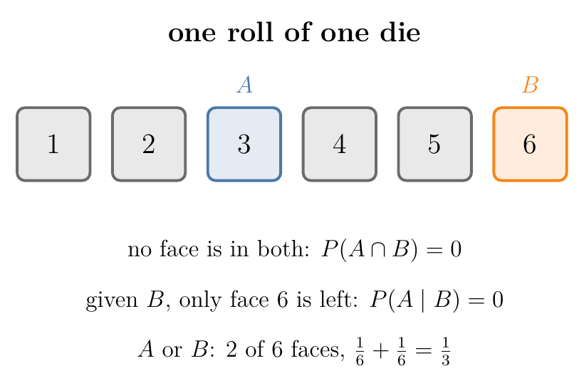
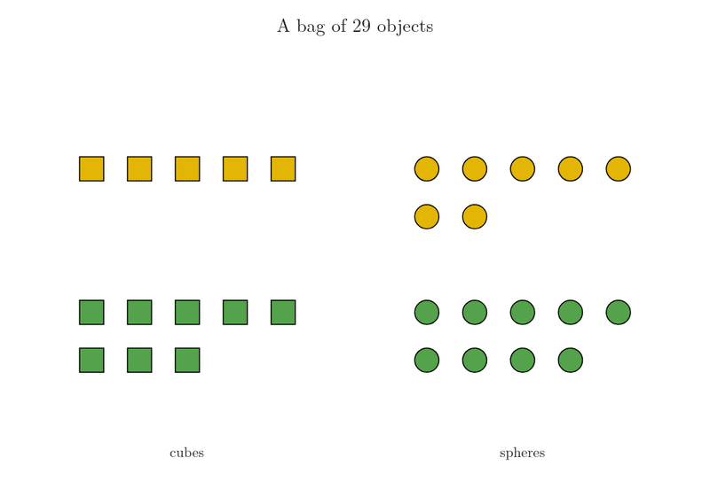

<!-- where-this-fits: generated by course_map/build_map.py; edit concepts.yaml, not this block -->
> **Where this fits:** Pipeline map step 0 (Foundations). See the [Course map](../01-course-map/note.md).
>
> 
>
> - **Builds on:** Conditional probability ([Note 82](../82-conditional-probability/note.md)).
> - **Leads to:** Naive Bayes ([Note 87](../87-naive-bayes-intuition/note.md)); Voting ensembles ([Note 102](../102-voting-ensemble/note.md)).
<!-- /where-this-fits -->

## 1. Overview

> **Key point:** Two events are mutually exclusive when they cannot happen together: P(A ∩ B) = 0. Mutual exclusivity is a different idea from independence, and the two are easily confused.

The previous Note defined **independent** events (G-934): they can happen together, but one does not affect the other. **Mutually exclusive** events are different: they can never happen together. The two ideas are easy to mix up, so this Note puts them side by side.

## 2. The definition

> **Key point:** Mutually exclusive: P(A ∩ B) = 0, so P(A | B) = 0.

Some pairs of events can never happen together:

- A single coin toss cannot land both heads and tails.
- At a junction, a driver turns either left or right, not both.
- One die cannot show both 3 and 6 on the same roll.

Such events are **mutually exclusive** (G-1286): they have no outcome in common, so at most one of them can happen. As a formula, $A$ and $B$ are mutually exclusive if

$$P(A \cap B) = 0$$

{width=70%}

Figure 1 shows the die example: $A$ and $B$ sit on different faces, so no outcome is in both. Once we know $B$ happened, the roll is face 6, and face 3 is ruled out.

## 3. Conditional probability for mutually exclusive events

> **Key point:** If B happened, A cannot have happened: P(A | B) = 0.

Putting $P(A \cap B) = 0$ into the conditional probability formula:

$$P(A \mid B) = \frac{P(A \cap B)}{P(B)} = \frac{0}{P(B)} = 0$$

With numbers: die 1 has shown 3. The probability that the same die shows 6 on that roll is 0. A driver has turned left; the probability that they turned right is 0.

Figure 2 checks this on a million simulated rolls. Over all rolls, a 3 comes up 0.1667 of the time. Among the rolls that showed 6, not one showed 3: the share is exactly 0. The right panel previews the addition rule of Section 5.

## 4. Mutually exclusive is not independent

> **Key point:** Knowing B happened tells us A did not, which is a lot of information. So mutually exclusive events (each with a positive probability) are always dependent.

{width=100%}

Figure 3 lays the two ideas side by side.

| | Mutually exclusive | Independent |
|---|---|---|
| Can happen together? | no | yes |
| $P(A \cap B)$ | 0 | $P(A) \times P(B)$ |
| $P(A \mid B)$ | 0 | $P(A)$ |
| Does B tell us about A? | yes: A did not happen | no |

For "die 1 shows 3" ($A$) and "die 1 shows 6" ($B$), each has probability $1/6$:

- $P(A \cap B) = 0$, so they are mutually exclusive.
- $P(A) \times P(B) = 1/36 \neq 0$, so they are **not** independent.

In fact, if both events have a probability above 0, being mutually exclusive always rules out being independent. Learning that one happened tells us for certain that the other did not.

An everyday picture: a light switch is either on or off. The two states are mutually exclusive, and for that very reason, hearing "the switch is on" tells us everything about "off".

## 5. The addition rule: where mutual exclusivity pays off

> **Key point:** P(A or B) = P(A) + P(B) − P(A and B). For mutually exclusive events the last term is 0, so "or" becomes plain addition.

The probability that A **or** B happens (one, the other, or both) is the probability of their **union** (G-2045), written $P(A \cup B)$. Counting it needs care when the events share outcomes.

A bag holds 29 objects: 5 yellow cubes, 7 yellow spheres, 8 green cubes and 9 green spheres. One object is drawn at random. What is the probability that it is yellow or a cube?

1. **Count yellow:** $5 + 7 = 12$ objects, so $P(\text{yellow}) = 12/29$.
2. **Count cubes:** $5 + 8 = 13$ objects, so $P(\text{cube}) = 13/29$.
3. **Adding them counts some objects twice:** $12 + 13 = 25$, but the 5 yellow cubes are in both counts.
4. **Subtract the overlap once:** $12 + 13 - 5 = 20$, so $P(\text{yellow or cube}) = 20/29$.

In Figure 4, watch the 5 yellow cubes (ringed in red): they lie inside both dashed boxes, so a plain sum counts them twice. Dividing every count in step 4 by 29 gives the general **addition rule**:

$$P(A \cup B) = P(A) + P(B) - P(A \cap B)$$

Now take two events with no overlap: "yellow sphere" (7 objects) and "green cube" (8 objects). No object is both, so the events are mutually exclusive and $P(A \cap B) = 0$. Nothing is counted twice (Figure 4, last scene), and the rule becomes a simple sum, the **addition rule for mutually exclusive events** (G-173):

$$P(A \cup B) = P(A) + P(B) = \frac{7}{29} + \frac{8}{29} = \frac{15}{29}$$

The die of Section 3 follows the same rule: $P(3 \text{ or } 6) = 1/6 + 1/6 = 1/3$ (Figure 2, right). The Bayes' theorem Notes use this sum to split a probability into separate cases.

## 6. Summary

- Mutually exclusive: $P(A \cap B) = 0$; the events cannot happen together, and $P(A \mid B) = 0$.
- Independent: $P(A \cap B) = P(A)P(B)$; they can happen together, and $P(A \mid B) = P(A)$.
- Mutually exclusive events with positive probabilities are never independent.
- Addition rule: $P(A \cup B) = P(A) + P(B) - P(A \cap B)$; for mutually exclusive events, $P(A \cup B) = P(A) + P(B)$.

## 7. Sources

**Built from**

- CampusX, "Naive Bayes Classifier | Part 3 | Mutually Exclusive Events", YouTube, https://www.youtube.com/watch?v=nneTjTYikBE
- Khan Academy, "Addition rule for probability | Probability and Statistics", YouTube, https://www.youtube.com/watch?v=QE2uR6Z-NcU (the bag of 29 objects and the addition rule; Figure 4 recreates the count with our own drawing)

## 8. Key terms

| Term | Meaning |
|---|---|
| Mutually exclusive events | Events that cannot happen at the same time; their intersection has probability 0 |
| Union (A ∪ B) | The event that A or B (or both) happens |
| Addition rule | $P(A \cup B) = P(A) + P(B) - P(A \cap B)$; for mutually exclusive events, $P(A \cup B) = P(A) + P(B)$ |
