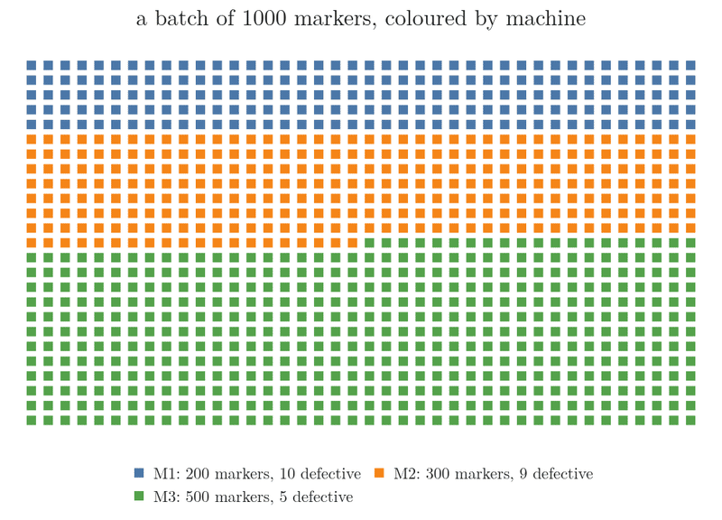
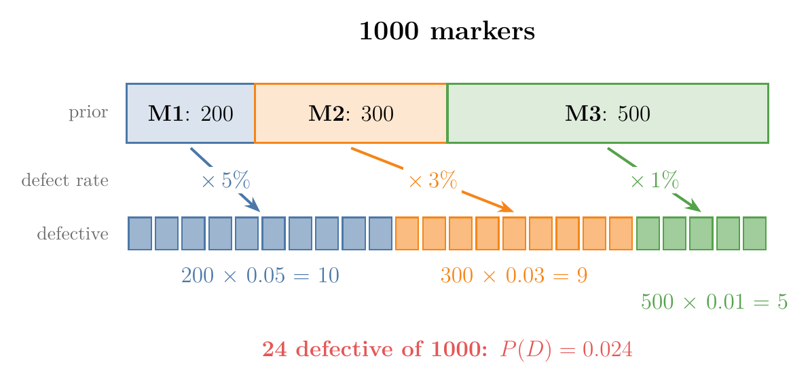
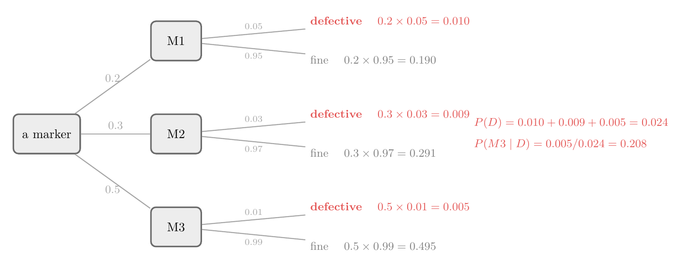
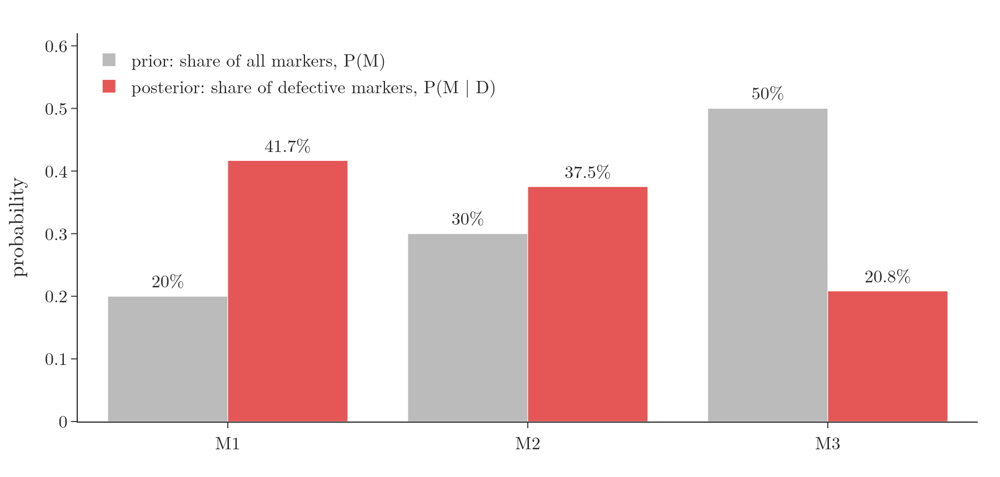
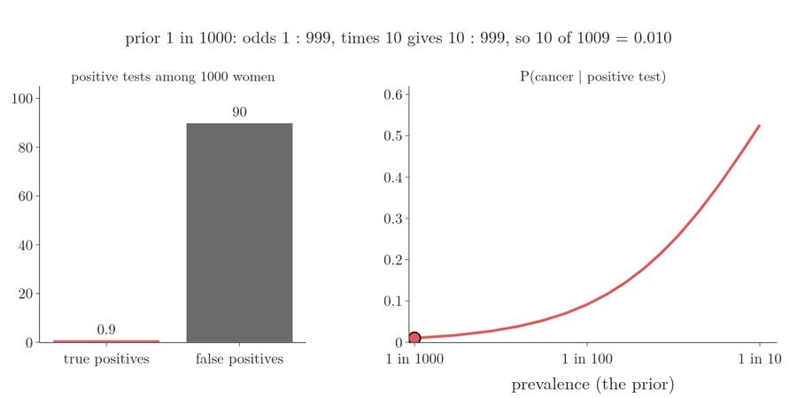
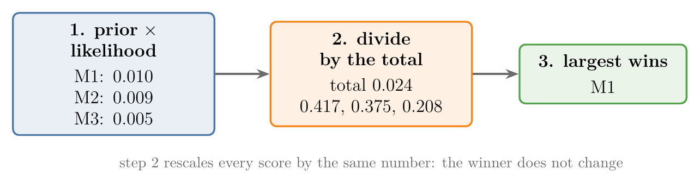

<!-- where-this-fits: generated by course_map/build_map.py; edit concepts.yaml, not this block -->
> **Where this fits:** Pipeline map step 0 (Foundations). See the [Course map](../01-course-map/note.md).
>
> 
>
> - **Builds on:** Conditional probability ([Note 341](../341-joint-marginal-conditional-probability/note.md)); Joint and marginal probability ([Note 341](../341-joint-marginal-conditional-probability/note.md)).
> - **Leads to:** Naive Bayes ([Note 87](../87-naive-bayes-intuition/note.md)); MAP estimation ([Note 633](../633-mle-in-machine-learning/note.md)); Gaussian mixture model (GMM) ([Note 640](../640-gaussian-mixture-models/note.md)).
<!-- /where-this-fits -->

## 1. Overview

> **Key point:** Three machines make markers; a random marker turns out defective. Bayes' theorem, with the total probability rule for the evidence, gives the chance it came from each machine.

This Note works through a classic problem with Bayes' theorem. The Note also introduces the **law of total probability** (G-1053), the usual way to compute the evidence $P(B)$ in the denominator. Naive Bayes computes its evidence the same way.

## 2. The problem

> **Key point:** Production shares 20%, 30%, 50%; defect rates 5%, 3%, 1%.

A factory makes markers on three machines:

| Machine | Share of all markers | Defect rate of that machine |
|---|---|---|
| M1 | 20% | 5% |
| M2 | 30% | 3% |
| M3 | 50% | 1% |

A marker is picked at random from a batch and turns out to be **defective**. What is the probability that it was made by M3?

Figure 1 shows the idea before any formula. In a typical batch of 1000 markers, M1, M2 and M3 make 200, 300 and 500. Their defect rates leave 10, 9 and 5 defective markers. Knowing the picked marker is defective means it is one of these 24, and only 5 of the 24 came from M3.



## 3. Writing down what we know

> **Key point:** The production shares are priors P(M); the defect rates are likelihoods P(D | M).

Let $D$ be "the marker is defective". In probability language:

- **Priors** (G-1565): $P(M1) = 0.2$, $P(M2) = 0.3$, $P(M3) = 0.5$.
- **Likelihoods** (G-1086): $P(D \mid M1) = 0.05$, $P(D \mid M2) = 0.03$, $P(D \mid M3) = 0.01$.

The question asks for $P(M3 \mid D)$. By **Bayes' theorem** (G-269),

$$P(M3 \mid D) = \frac{P(D \mid M3) \times P(M3)}{P(D)}$$

Everything on the right is known except $P(D)$, the overall probability that a marker is defective.

{width=95%}

Figure 2 turns the priors and likelihoods into expected counts for 1000 markers. Watch the bottom row: M3 makes the most markers but supplies the fewest defective squares.

## 4. The evidence: total probability

> **Key point:** A defective marker came from exactly one machine, so P(D) is the sum of the three "defective and from machine i" probabilities.

A defective marker must have come from M1, M2 or M3, and from only one of them. These three cases are mutually exclusive (the mutually exclusive events Note), so their probabilities add:

$$P(D) = P(D \cap M1) + P(D \cap M2) + P(D \cap M3)$$

Each term is a likelihood times a prior, by $P(A \cap B) = P(B \mid A) P(A)$ from the Bayes' theorem proof:

$$P(D) = P(D \mid M1)P(M1) + P(D \mid M2)P(M2) + P(D \mid M3)P(M3)$$

This sum is the law of total probability. With numbers:

$$P(D) = 0.05 \times 0.2 + 0.03 \times 0.3 + 0.01 \times 0.5 = 0.010 + 0.009 + 0.005 = 0.024$$

So 2.4% of all markers are defective. Figure 3 shows the same calculation as a **probability tree** (G-1573).

{width=100%}

## 5. The answer

> **Key point:** P(M3 | D) = 0.005 / 0.024 = 0.208. M3 makes half the markers but only about a fifth of the defective ones.

$$P(M3 \mid D) = \frac{0.01 \times 0.5}{0.024} = \frac{0.005}{0.024} = 0.208$$

The same calculation for every machine:

| Machine | Prior $P(M)$ | **Joint probability** (G-986) $P(D \cap M)$ | **Posterior** (G-1536) $P(M \mid D)$ |
|---|---|---|---|
| M1 | 0.20 | 0.010 | 0.417 |
| M2 | 0.30 | 0.009 | 0.375 |
| M3 | 0.50 | 0.005 | 0.208 |

{height=40%}

Seeing that the marker is defective changes the picture completely (Figure 4). Before, M3 was the most likely source (50%). After, M3 is the least likely (21%), because M3 rarely makes defects.

An everyday picture: three cooks share a kitchen, and one dish comes out burnt. The cook who makes the most dishes is not the likely culprit if that cook almost never burns anything. M1 makes only 20% of markers but 42% of the defective ones.

The three posteriors add up to 1, as they must: the marker came from some machine. A simulation of a million markers gives $P(M3 \mid D) = 0.2095$, matching 0.208.

> **Python:** The whole calculation.
>
> ```python
> prior = {"M1": 0.2, "M2": 0.3, "M3": 0.5}
> p_defect = {"M1": 0.05, "M2": 0.03, "M3": 0.01}
>
> joint = {m: prior[m] * p_defect[m] for m in prior}
> p_D = sum(joint.values())                      # 0.024
> {m: joint[m] / p_D for m in prior}             # 0.417, 0.375, 0.208
> ```

## 6. Another way to see it: a medical test

> **Key point:** A test does not give the final answer; it updates the prior. Posterior odds = prior odds × Bayes factor.

The marker problem has the same shape as a famous question about medical tests. The machines become "has cancer" and "does not have cancer"; "defective" becomes "the test is positive".

A screening test is given to 1000 women. What we know:

- **Prior:** 1 percent have breast cancer, so 10 women are sick and 990 are healthy.
- **Sensitivity** (G-1641; recall, [Note 77](../77-precision-recall-f1/note.md)): the test is positive for 90 percent of the sick women: $P(+ \mid \text{cancer}) = 0.9$.
- **False positive rate** (G-749): the test is also positive for 9 percent of the healthy women: $P(+ \mid \text{healthy}) = 0.09$.

A woman tests positive. What is the chance that she has cancer? The test sounds "90 percent accurate", so many people answer 9 in 10. Count instead, exactly as with the markers:

1. **Sick and positive:** $10 \times 0.9 = 9$ women (true positives).
2. **Healthy and positive:** $990 \times 0.09 \approx 89$ women (false positives).
3. **All positives** (the evidence, by total probability): $9 + 89 = 98$.
4. **Posterior:** $P(\text{cancer} \mid +) = 9/98 \approx 0.092$, about 1 in 11.

The healthy group is so large that its few false positives (89) swamp the true positives (9). This posterior is the **precision** (G-1547) of the test; in medicine it is called the positive predictive value.

The lesson: the test did not decide anything. The test moved the chance from 1 in 100 (the prior) to about 1 in 11 (the posterior). A test **updates** the prior.

### 6.1 The size of the update: the Bayes factor

> **Key point:** Bayes factor = P(evidence | yes) / P(evidence | no). Multiply the prior odds by it to get the posterior odds.

How strong is the update? A positive result is $0.9 / 0.09 = 10$ times more likely for a sick woman than for a healthy one. This ratio of the two likelihoods is the **Bayes factor** (G-2215).

The Bayes factor works on **odds** (G-1376): the number of "yes" cases to the number of "no" cases.

1. **Prior odds:** 10 sick to 990 healthy, that is $1 : 99$.
2. **Multiply by the Bayes factor:** $1 \times 10 : 99 = 10 : 99$. These are the posterior odds.
3. **Back to a probability:** 10 sick for every 99 healthy, so $10 / (10 + 99) = 0.092$. The same answer as the count.

The rule is exact, and it follows from the count above: among the positives, the sick are scaled by 0.9 and the healthy by 0.09, so their ratio is multiplied by $0.9/0.09$.



In Figure 5, watch the same test give very different answers as the prior changes. At a prior of 1 in 1000 a positive result means about 1 percent; at 1 in 100, 9 percent; at 1 in 10, the odds $1 : 9$ become $10 : 9$, which is 53 percent. The test is the same each time; only the prior differs.

The Bayes factor also previews Naive Bayes: each feature multiplies the score of a class by its own likelihood, one factor per feature ([Note 87](../87-naive-bayes-intuition/note.md)).

## 7. The pattern for Naive Bayes

> **Key point:** For each class: prior × likelihood. Divide by their total. The largest posterior wins.

A Naive Bayes classifier follows exactly this procedure. The machines become the classes, the values of the **target** (G-1949; the output we predict). "Defective" becomes the observed **features** (G-772; the input variables, one column each of the data table):

1. for every class, multiply its prior by the likelihood of the observed features;
2. divide each product by their sum (the evidence) to get posteriors that add to 1;
3. predict the class with the largest posterior.

Since the evidence is the same for every class, step 2 does not change which class wins; it only turns the scores into probabilities.

{width=95%}

Figure 6 runs the three steps on the marker numbers: M1 has the largest score both before and after dividing by 0.024.

## 8. Summary

- Priors: production shares; likelihoods: defect rates; posterior: which machine, given a defect.
- Law of total probability: $P(D) = \sum_i P(D \mid M_i) P(M_i)$.
- Answer: $P(M3 \mid D) = 0.208$; M1 is the most likely source (0.417).
- Medical test: prior 1 in 100, sensitivity 0.9, false positive rate 0.09 give a posterior of only 9/98 = 0.092. Posterior odds = prior odds × Bayes factor ($1 : 99$ times 10 is $10 : 99$).

## 9. Sources

**Built from**

- CampusX, "Naive Bayes Classifier | Part 5 | Problem based upon Bayes Theorem", YouTube, https://www.youtube.com/watch?v=aAEHjXDHtbE
- Sanderson, G. (3Blue1Brown), "The medical test paradox, and redesigning Bayes' rule", YouTube, https://www.youtube.com/watch?v=lG4VkPoG3ko (the 1000-women example, the test as an update, the Bayes factor and the odds form; Figure 5 is our own chart of those numbers)

## 10. Key terms

| Term | Meaning |
|---|---|
| Law of total probability | $P(B) = \sum_i P(B \mid A_i) P(A_i)$, when the $A_i$ are mutually exclusive and cover every case |
| Probability tree | A diagram in which each path multiplies the probabilities along its branches |
| Bayes factor (G-2215) | The ratio of the two likelihoods, $P(\text{evidence} \mid \text{yes}) / P(\text{evidence} \mid \text{no})$; it multiplies the prior odds to give the posterior odds |
| Odds | The number of "yes" cases to the number of "no" cases, such as $1 : 99$ |
| False positive rate (G-749) | The share of real negatives that test positive |
| Joint probability | The probability that two events happen together, $P(A \cap B)$ |
