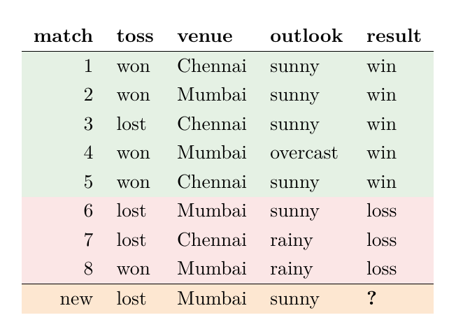
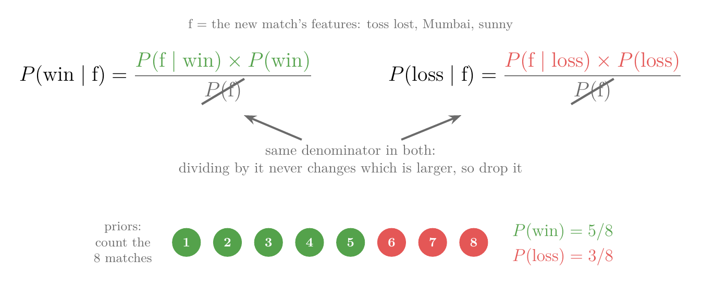
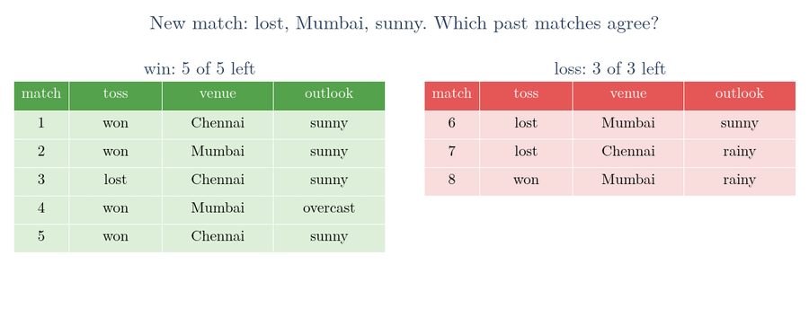
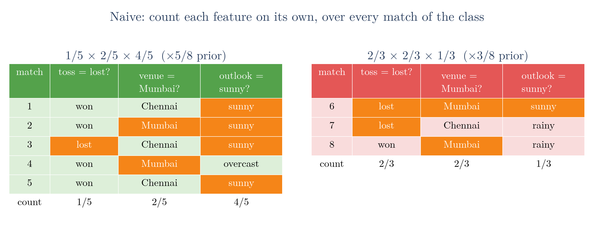
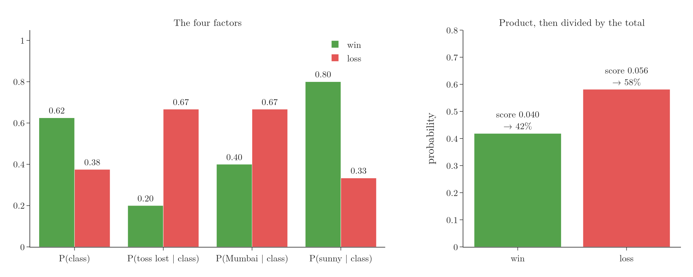

<!-- where-this-fits: generated by course_map/build_map.py; edit concepts.yaml, not this block -->
> **Where this fits:** Pipeline map step 8 (Model). See the [Course map](../01-course-map/note.md).
>
> 
>
> - **Builds on:** Classification problems ([Note 3](../03-types-of-ml/note.md)); Probability density function (PDF) ([Note 20](../20-univariate-analysis/note.md)); Normal distribution ([Note 42](../42-outliers-zscore/note.md)); Independent and mutually exclusive events ([Note 84](../84-mutually-exclusive-events/note.md)); Bayes' theorem ([Note 86](../86-bayes-problem/note.md)).
<!-- /where-this-fits -->

## 1. Overview

> **Key point:** Naive Bayes computes, for each class, a score: the class's prior multiplied by one likelihood per feature. It predicts the class with the largest score. To make this possible, it assumes the features are independent within each class.

With conditional probability, independence and Bayes' theorem in place, we can build the **Naive Bayes classifier** (G-1297), over three Notes: this Note develops the intuition, the [next](../88-naive-bayes-maths/note.md) derives the mathematics, and the [one after](../89-naive-bayes-code/note.md) codes it.

This Note covers:

- the whole method on one picture, with word counts (section 2);
- a small dataset of cricket matches (section 3);
- the strategy: compare the posteriors of the classes (section 4);
- Bayes' theorem, and why the evidence can be dropped (section 5);
- the problem with exact combinations of feature values (section 6);
- the naive assumption that solves the problem (section 7);
- the scores for the new match, one factor at a time (section 8);
- what one zero count does to a score (section 9).

## 2. The method on one picture

> **Key point:** A likelihood P(word | class) is a bar height divided by the class's total. A message's score for a class is the prior times the likelihood of each of its words. The larger score wins.

Suppose we want to separate normal messages from spam. We have 12 normal messages and 6 spam messages. The method has three steps (Figure 1):

1. **Count.** For each class, count how often each word appears. In the 12 normal messages, "hello" appears 9 times out of 20 words. In the 6 spam messages, "hello" appears 2 times out of 10 words.
2. **Turn counts into likelihoods.** Divide each bar by the total number of words of its class: $P(\text{hello} \mid \text{normal}) = 9/20 = 0.45$ and $P(\text{hello} \mid \text{spam}) = 2/10 = 0.20$. Each of these numbers is a **likelihood** (G-1086): how probable a word is if the message belongs to that class.
3. **Score a new message.** For the message "hello free", start from the share of messages in each class, the **prior** (G-1565): 12/18 = 0.67 for normal and 6/18 = 0.33 for spam. Multiply the prior by the likelihood of each word in the message.

{height=55%}

In Figure 1, watch the last frame. Only the bars of the words in the message are used:

$$\text{score(normal)} = 0.67 \times 0.45 \times 0.15 = 0.045 \qquad \text{score(spam)} = 0.33 \times 0.20 \times 0.40 = 0.027$$

The normal score is larger, so the message is classified as normal. Each number is a **score** (G-1753): it is not the probability of the class, only proportional to it, and that is enough to pick the winner. Sections 4 to 7 explain why this recipe is right, on a second dataset.

## 3. The data

> **Key point:** Eight cricket matches, three features (toss, venue, outlook) and the result. Predict the result of a new match.

The main example is a small made-up dataset about one cricket team. Each match is one **observation** (one record, a row of the table). Each has three **features** (input variables, one column each) and one **target** (the output we predict):

{height=38%}

- **toss:** did the team win or lose the toss?
- **venue:** Chennai or Mumbai.
- **outlook:** the weather, sunny, overcast or rainy.
- **result:** win or loss, the class to predict.

For a new match the toss is **lost**, the venue is **Mumbai** and the weather is **sunny**. Will the team win?

## 4. The strategy: compare posteriors

> **Key point:** Compute P(win | features) and P(loss | features); predict whichever is larger.

Naive Bayes asks two questions:

$$P(\text{win} \mid \text{lost}, \text{Mumbai}, \text{sunny}) \qquad\text{and}\qquad P(\text{loss} \mid \text{lost}, \text{Mumbai}, \text{sunny})$$

Each is a **posterior** (G-1536): the probability of a class after the features are seen. The commas mean "and": the three conditions hold together, so they could also be written with $\cap$. If the first probability is, say, 0.56 and the second 0.27, the classifier predicts a win. With more classes (for example win, loss, draw) the classifier computes one probability per class and again takes the largest.

## 5. Applying Bayes' theorem

> **Key point:** Each posterior equals likelihood × prior / evidence. The evidence is the same for every class, so it can be dropped.

With $A$ = the class and $B$ = the three feature values, [Bayes' theorem](../85-bayes-theorem/note.md) gives

$$P(\text{win} \mid \text{lost}, \text{Mumbai}, \text{sunny}) = \frac{P(\text{lost}, \text{Mumbai}, \text{sunny} \mid \text{win}) \times P(\text{win})}{P(\text{lost}, \text{Mumbai}, \text{sunny})}$$

and the same with "loss" in place of "win".

The denominator, the **evidence** (G-718), is identical in both: it is the probability of seeing these feature values, whichever the class. Here only 1 of the 8 matches (match 6) had all three values, so the evidence is 1/8 for both classes. Dividing two numbers by the same positive amount does not change which is larger. So for choosing the class, only the **numerator** matters, and this numerator is the score of section 2:

$$\text{score(class)} = P(\text{features} \mid \text{class}) \times P(\text{class})$$

The priors, also called **class priors** (G-388), come straight from counting: 5 of the 8 matches were wins and 3 were losses.

$$P(\text{win}) = 5/8 \qquad P(\text{loss}) = 3/8$$

Figure 3 puts both steps in one picture. Watch the shared denominator $P(\text{f})$ being struck out in both posteriors, and the priors coming from a plain count of the eight matches.

{height=38%}

## 6. The problem: specific combinations are rare

> **Key point:** No winning match had exactly (lost, Mumbai, sunny), so the likelihood P(lost, Mumbai, sunny | win) would be 0.

The likelihood $P(\text{lost}, \text{Mumbai}, \text{sunny} \mid \text{win})$ is a **joint probability** (G-986), the probability of all three conditions together. It asks: among the 5 winning matches, how many had all three conditions at once? None did. So it would be 0, and the score for "win" would be 0 however strongly the other evidence pointed to a win.

Figure 4 runs this search one condition at a time. Watch the winning matches grey out: one survives "toss lost", none survives "Mumbai", while one losing match (match 6) survives all three.

The rarity of exact matches is a general problem. A past observation that matches a new one on **every** feature at once is rare. With 3 features the search already failed here; with 10 or 20 features, almost every combination would never have been seen. The estimates would be 0 or based on one or two observations, and the classifier would be useless.

## 7. The naive assumption

> **Key point:** Assume the features are independent within each class. Then the joint likelihood becomes a product of one-feature likelihoods, each estimated from many observations.

The way out is to stop asking for all three conditions at once. We count each feature on its own, and multiply the results, exactly as each word was counted on its own in section 2.

Multiplying is allowed only under an assumption, the **naive assumption** (G-1296): **within each class, the features are independent** of each other. The standard name is **conditional independence** (G-443) of the features given the class. From the [independent events Note](../83-independent-events/note.md), the probability of independent events happening together is the product of their probabilities. So

$$P(\text{lost}, \text{Mumbai}, \text{sunny} \mid \text{win}) \approx P(\text{lost} \mid \text{win}) \times P(\text{Mumbai} \mid \text{win}) \times P(\text{sunny} \mid \text{win})$$

Each factor looks at one feature only, so it is estimated from all the observations of that class. Figure 5 shows the difference from Figure 4: no match is thrown away, and each column is counted on its own over all five wins (or all three losses).

{height=38%}

The assumption is rarely exactly true, which is why the method is called **naive**, but it makes the estimates workable (ISL §4.4.4).

What the product gives up is any link between the features. For messages, the words are treated as unrelated to each other, so their order does not matter: "hello free" and "free hello" get the same score. A message is handled as a **bag of words** (G-250). Even so, Naive Bayes separates normal messages from spam well in practice.

An everyday picture: to guess whether a new dish will taste good, we cannot wait for the exact same recipe to have been cooked before. Instead we judge each ingredient on its own record, and combine the verdicts. The next Note derives this step properly.

## 8. Computing the scores

> **Key point:** Win: 5/8 × 1/5 × 2/5 × 4/5 = 0.040. Loss: 3/8 × 2/3 × 2/3 × 1/3 = 0.056. Predict loss.

Figure 6 repeats the three steps of section 2 on the matches. Each bar counts the matches of one class with one feature value. The three bars of the new match light up one at a time, and each one multiplies the running product, which starts at the prior.

{height=55%}

**Win** (5 matches): the toss was lost in 1 of them, the venue was Mumbai in 2, and the weather was sunny in 4.

$$\text{score(win)} = \frac{5}{8} \times \frac{1}{5} \times \frac{2}{5} \times \frac{4}{5} = 0.040$$

**Loss** (3 matches): the toss was lost in 2, Mumbai in 2, sunny in 1.

$$\text{score(loss)} = \frac{3}{8} \times \frac{2}{3} \times \frac{2}{3} \times \frac{1}{3} = 0.056$$

{height=52%}

The loss score is larger, so Naive Bayes predicts a **loss**. Dividing each score by their sum turns them into probabilities: $0.040 / 0.096 = 0.42$, so 42% win and 58% loss (Figure 7, right).

Figure 7 (left) shows why: winning teams mostly won the toss and played in sunny weather, so "lost the toss" (0.20 against 0.67) and "Mumbai" (0.40 against 0.67) both point to a loss. Sunny weather points to a win (0.80 against 0.33), but not strongly enough to outweigh them.

## 9. One zero count

> **Key point:** A single likelihood of 0 forces the whole score to 0. Adding 1 to every count removes the zeros.

The product has one weak spot. In the word counts of section 2, "meeting" never appears in spam, so $P(\text{meeting} \mid \text{spam}) = 0/10 = 0$. Take the message "meeting prize prize prize". "Prize" is a typical spam word, yet the spam score is $0.33 \times 0 \times 0.40^3 = 0$: one zero wipes out everything else, and the message is classified as normal (Figure 8, frame 1).

The fix is to add 1 to every count before dividing (the black boxes in Figure 8). Now $P(\text{meeting} \mid \text{spam}) = 1/14$ instead of 0, the spam score is 0.00108 against 0.00013 for normal, and the message is classified as spam. The priors do not change, because the number of messages in each class is the same as before.

{height=55%}

Adding a count to every value is **Laplace smoothing** (G-1045). The [code Note](../89-naive-bayes-code/note.md) (sections 6 and 7) teaches it in full.

## 10. Summary

| Step | Win | Loss |
|---|---|---|
| Prior $P(\text{class})$ | 5/8 | 3/8 |
| $P(\text{lost} \mid \text{class})$ | 1/5 | 2/3 |
| $P(\text{Mumbai} \mid \text{class})$ | 2/5 | 2/3 |
| $P(\text{sunny} \mid \text{class})$ | 4/5 | 1/3 |
| Score (product) | 0.040 | **0.056** |

- Naive Bayes picks the class with the largest $P(\text{class} \mid \text{features})$.
- A likelihood is a count within a class divided by the class total: a bar height.
- The evidence is shared by all classes, so only likelihood × prior is compared.
- Exact combinations of feature values are rare; the naive assumption (conditional independence) splits them into one-feature probabilities.
- One zero count makes a whole score 0; Laplace smoothing fixes it.

## 11. Sources

**Built from**

- CampusX, "Naive Bayes Classifier | Part 6 | Intuition", YouTube, https://www.youtube.com/watch?v=ZR1_QtLk_4U
- StatQuest with Josh Starmer, "Naive Bayes, Clearly Explained!!!", YouTube, https://www.youtube.com/watch?v=O2L2Uv9pdDA (likelihoods as histogram bars, scoring a short message, the zero count and the added counts, word order; Figures 1, 6 and 8 are redrawn from these ideas with our own numbers)

**Other references**

- **ISL:** James, G., Witten, D., Hastie, T. and Tibshirani, R. *An Introduction to Statistical Learning*, 2nd ed. Springer, 2021. Section 4.4.4, pp. 153–155.

## 12. Key terms

| Term | Meaning |
|---|---|
| Naive Bayes classifier (G-1297) | A classifier that applies Bayes' theorem with the assumption that features are independent within each class |
| Naive assumption (G-1296) | The assumption that the features are conditionally independent given the class |
| Conditional independence (G-443) | Independence that holds once a third variable (here the class) is known |
| Joint probability (G-986) | The probability that several conditions hold together, such as toss lost, Mumbai and sunny in one match |
| Score (G-1753) | Likelihood × prior for a class; proportional to the posterior |
| Class prior (G-388) | The share of training observations in a class |
| Bag of words (G-250) | Treating a text as word counts, ignoring the order of the words |
| Laplace smoothing (G-1045) | Adding a small count (usually 1) to every count so that no probability is 0 |
