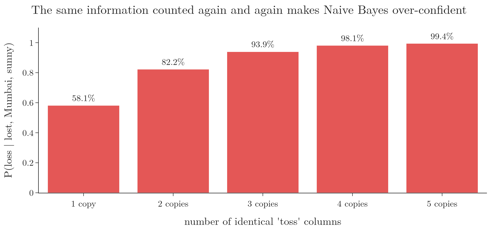

<!-- where-this-fits: generated by course_map/build_map.py; edit concepts.yaml, not this block -->
> **Where this fits:** Pipeline map step 8 (Model). See the [Course map](../01-course-map/note.md).
>
> 
>
> - **Builds on:** Classification problems ([Note 3](../03-types-of-ml/note.md)); Probability density function (PDF) ([Note 20](../20-univariate-analysis/note.md)); Normal distribution ([Note 42](../42-outliers-zscore/note.md)); Independent and mutually exclusive events ([Note 84](../84-mutually-exclusive-events/note.md)); Bayes' theorem ([Note 86](../86-bayes-problem/note.md)).
<!-- /where-this-fits -->

## 1. Overview

> **Key point:** Starting from Bayes' theorem, the chain rule writes the joint probability exactly; the naive assumption (conditional independence) then simplifies it to P(Cₖ) × Π P(xᵢ | Cₖ). The predicted class is the one that maximises this.

The previous Note used the Naive Bayes recipe on a small example. This Note derives it in general, step by step, and makes the "naive" assumption precise.

{height=42%}

## 2. Notation

> **Key point:** Features x = (x₁, ..., xₙ); K classes, C₁ to Cₖ for k up to K.

- An **observation** (one record, a row of the data table) has $n$ **features** (input variables, one column each), with values $x = (x_1, x_2, \dots, x_n)$. In the cricket example, $n = 3$: toss, venue and outlook.
- The **target** (the output we predict) is one of $K$ classes, $C_1, \dots, C_K$. In the cricket example, $K = 2$: win and loss.

The goal: for each class $C_k$, compute $P(C_k \mid x)$, then pick the largest.

## 3. Step 1: Bayes' theorem without the evidence

> **Key point:** P(Cₖ | x) is proportional to P(x | Cₖ) P(Cₖ) = P(x₁, ..., xₙ, Cₖ).

By Bayes' theorem,

$$P(C_k \mid x) = \frac{P(x \mid C_k)\thinspace P(C_k)}{P(x)}$$

The evidence $P(x)$ is the same for every class, so it does not affect which class is largest (the intuition Note). Dropping it, we write $\propto$, "is proportional to":

$$P(C_k \mid x) \propto P(x \mid C_k)\thinspace P(C_k)$$

From the Bayes' theorem proof, $P(x \mid C_k) P(C_k) = P(x \cap C_k)$, the probability of the features and the class together. Writing the features out, with commas meaning "and":

$$P(C_k \mid x) \propto P(x_1, x_2, \dots, x_n, C_k)$$

## 4. Step 2: the chain rule

> **Key point:** Peel off one variable at a time with P(A, B) = P(A | B) P(B). The rule is exact.

Apply $P(A \cap B) = P(A \mid B)\thinspace P(B)$ with $A = x_1$ and $B = (x_2, \dots, x_n, C_k)$:

$$P(x_1, \dots, x_n, C_k) = P(x_1 \mid x_2, \dots, x_n, C_k)\thickspace P(x_2, \dots, x_n, C_k)$$

The last factor has the same form with one variable fewer, so apply the rule again, with $A = x_2$:

$$P(x_2, \dots, x_n, C_k) = P(x_2 \mid x_3, \dots, x_n, C_k)\thickspace P(x_3, \dots, x_n, C_k)$$

Repeating until only $x_n$ and $C_k$ are left, and finally $P(x_n, C_k) = P(x_n \mid C_k)\thinspace P(C_k)$:

$$P(x_1, \dots, x_n, C_k) = P(x_1 \mid x_2, \dots, x_n, C_k)\thickspace P(x_2 \mid x_3, \dots, x_n, C_k) \cdots P(x_n \mid C_k)\thickspace P(C_k)$$

This repeated splitting is the **chain rule** of probability. Nothing has been assumed yet: the chain rule is exact.

## 5. Step 3: the naive assumption

> **Key point:** Assume each feature depends only on the class, not on the other features: P(xᵢ | other features, Cₖ) = P(xᵢ | Cₖ).

The factors of the chain rule are hard to estimate. For the cricket match, $P(x_1 \mid x_2, x_3, C_k)$ is "the probability the toss was lost, given the venue was Mumbai, the weather was sunny and the match was won". Few or no training observations match all those conditions, so the estimate is 0 or unreliable (the intuition Note).

Naive Bayes assumes **conditional independence**: once the class is known, each feature is independent of the others. In symbols, for any features,

$$P(x_i \mid x_{i+1}, \dots, x_n, C_k) = P(x_i \mid C_k)$$

Conditional independence is the independence of the independent events Note, $P(A \mid B) = P(A)$, but holding **within each class**. Every chain-rule factor loses its other features (the red parts in Figure 1):

$$P(x_1, \dots, x_n, C_k) \approx P(x_1 \mid C_k)\thinspace P(x_2 \mid C_k) \cdots P(x_n \mid C_k)\thinspace P(C_k)$$

## 6. The formula and the MAP rule

> **Key point:** Score each class by P(Cₖ) Π P(xᵢ | Cₖ) and predict the largest: the maximum a posteriori rule.

Written with a product sign ($\prod$ is to multiplication what $\sum$ is to addition):

$$P(C_k \mid x) \propto P(C_k) \prod_{i=1}^{n} P(x_i \mid C_k)$$

To get actual probabilities, divide by the sum over all classes: $P(C_k \mid x) = \frac{1}{Z} P(C_k) \prod_i P(x_i \mid C_k)$, where $Z$ is that sum, which equals the evidence $P(x)$.

The prediction is the class with the largest posterior:

$$\hat{y} = \underset{k \in \lbrace1, \dots, K\rbrace}{\arg\max}\thickspace P(C_k) \prod_{i=1}^{n} P(x_i \mid C_k)$$

($\arg\max$ means "the $k$ that gives the maximum".) This is the **maximum a posteriori (MAP) rule**. On the cricket example, it gives 0.040 for win and 0.056 for loss, so $\hat{y}$ = loss.

## 7. When the assumption fails

> **Key point:** The chain rule is exact; the naive product is only exact when the features really are independent within each class. Strongly related features get counted twice.

A simulation with two binary features and 200,000 observations shows the difference:

| Features within a class | Exact $P(x_1, x_2 \mid C)$ | Chain rule | Naive product |
|---|---|---|---|
| independent | 0.476 | 0.476 | 0.477 |
| $x_2$ is a copy of $x_1$ | 0.800 | 0.800 | 0.639 |

When the features are independent, the naive product matches. When $x_2$ simply repeats $x_1$, the naive product multiplies the same evidence twice and is wrong.

An everyday picture: two friends tell us the same rumour, but both read it in the same newspaper. The rumour feels twice as certain, yet we have only one source.

{height=40%}

Figure 2 shows the effect on the cricket prediction: each extra copy of the "toss" feature pushes $P(\text{loss})$ further, from 58% with one copy to 99.4% with five, although no new information was added.

In practice, Naive Bayes often still picks the right class even when its independence assumption is wrong, because only the **order** of the scores matters for the prediction. Its probabilities, however, tend to be too extreme, so they should not be trusted as exact (Domingos and Pazzani 1997; scikit-learn user guide §1.9).

> **Extra:** Multiplying many probabilities, each below 1, produces very small numbers (the log loss Note). Implementations therefore add logarithms instead: $\log P(C_k) + \sum_i \log P(x_i \mid C_k)$. The largest sum identifies the same class.

## 8. Summary

| Step | Result |
|---|---|
| Bayes, drop the evidence | $P(C_k \mid x) \propto P(x_1, \dots, x_n, C_k)$ |
| Chain rule (exact) | $\prod_i P(x_i \mid x_{i+1}, \dots, x_n, C_k) \times P(C_k)$ |
| Naive assumption | $P(x_i \mid \dots, C_k) = P(x_i \mid C_k)$ |
| Formula | $P(C_k) \prod_i P(x_i \mid C_k)$ |
| MAP rule | predict $\arg\max_k$ of the formula |

## 9. Sources

- **Domingos and Pazzani 1997:** Domingos, P. and Pazzani, M. "On the Optimality of the Simple Bayesian Classifier under Zero-One Loss." *Machine Learning* 29, 103–130, 1997.
- **scikit-learn user guide:** Section 1.9, "Naive Bayes", scikit-learn 1.9.

## 10. Key terms

| Term | Meaning |
|---|---|
| Chain rule of probability | Writing a joint probability as a product of conditional probabilities, one variable at a time |
| Conditional independence | Independence that holds once a third variable (here the class) is known |
| Proportional to (∝) | Equal up to a constant factor that is the same for every class |
| arg max | The value of the variable that makes an expression largest |
| MAP rule | Maximum a posteriori: predict the class with the largest posterior probability |
