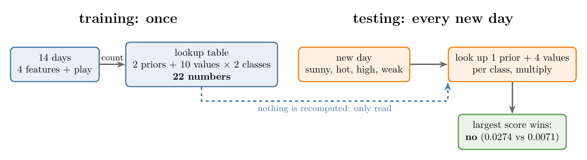
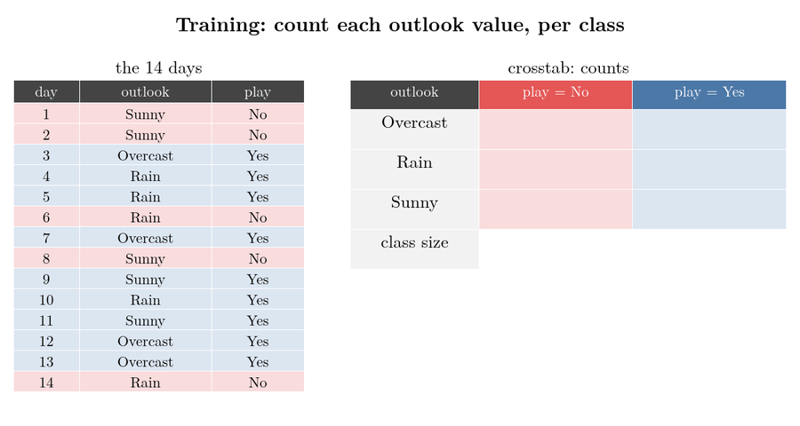
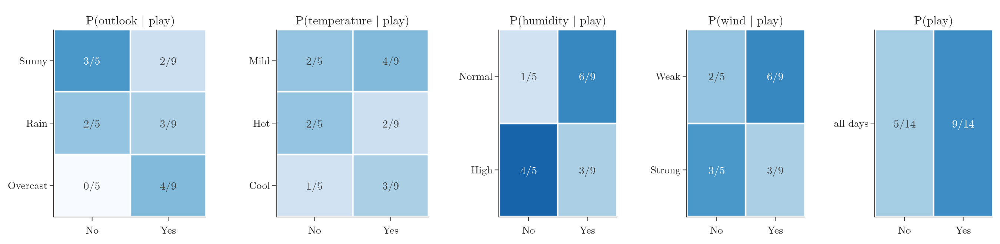
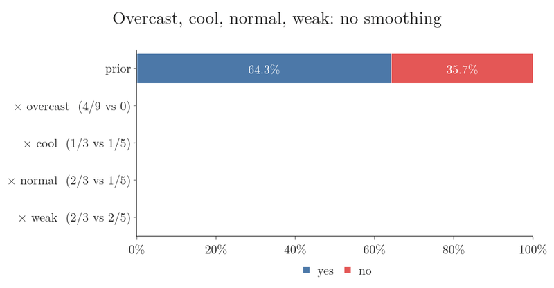
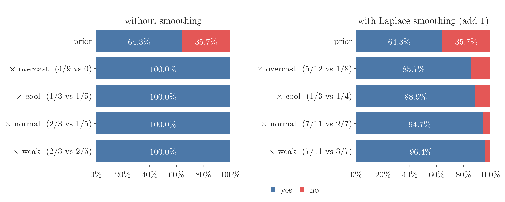

<!-- where-this-fits: generated by course_map/build_map.py; edit concepts.yaml, not this block -->
> **Where this fits:** Pipeline map step 8 (Model). See the [Course map](../01-course-map/note.md).
>
> 
>
> - **Builds on:** Classification problems ([Note 3](../03-types-of-ml/note.md)); Probability density function (PDF) ([Note 20](../20-univariate-analysis/note.md)); Normal distribution ([Note 42](../42-outliers-zscore/note.md)); Independent and mutually exclusive events ([Note 84](../84-mutually-exclusive-events/note.md)); Bayes' theorem ([Note 86](../86-bayes-problem/note.md)).
<!-- /where-this-fits -->

## 1. Overview

> **Key point:** Training Naive Bayes means building a lookup table of probabilities by counting. Predicting means looking up one probability per feature and multiplying.

The previous two Notes gave the intuition and the formula. This Note applies them to a classic toy dataset, **Play Tennis**, in Python: first by hand with pandas, then with scikit-learn.

This Note covers:

- the data and the question (section 2);
- the two phases, training and testing (section 3);
- training: building the lookup table by counting (section 4);
- testing: looking up and multiplying (section 5);
- a practical problem, the **zero-frequency problem** (G-2149) (section 6);
- its standard fix, Laplace smoothing, and scikit-learn's `CategoricalNB` (section 7).

## 2. The data

> **Key point:** 14 days, four weather features, and whether tennis was played (9 yes, 5 no).

Each day is one **observation** (one record, a row of the data table). Each has four **features** (input variables, one column each):

- **outlook:** sunny, overcast, rain;
- **temperature:** hot, mild, cool;
- **humidity:** high, normal;
- **wind:** weak, strong.

The **target** (the output we predict) is **play** (yes or no). Tennis was played on 9 of the 14 days.

The question: on a day that is sunny, hot, high-humidity with weak wind, will tennis be played?

From the [previous Note](../88-naive-bayes-maths/note.md), each class gets a score: its prior multiplied by one likelihood per feature.

$$\text{score(yes)} = P(\text{yes}) \times P(\text{sunny} \mid \text{yes}) \times P(\text{hot} \mid \text{yes}) \times P(\text{high} \mid \text{yes}) \times P(\text{weak} \mid \text{yes})$$

The score for "no" has the same form. We predict the class with the larger score, which is the **MAP rule** (G-1157).

## 3. Two phases

> **Key point:** Training computes and stores every probability; testing only looks them up.

Like every machine learning algorithm, Naive Bayes works in two phases:

1. **Training:** go through the data once and compute every probability the formula could ever need: the class priors, and $P(\text{value} \mid \text{class})$ for every value of every feature. Store them in a **lookup table** (G-1128) (in Python, a dictionary).
2. **Testing:** for a new day, look up the relevant probabilities and multiply. Nothing is recomputed.

How many probabilities does the table hold? Outlook has 3 values and there are 2 classes, so 6; temperature 6; humidity 4; wind 4; plus 2 priors. 22 numbers in all.

Figure 1 shows the two phases side by side. Watch the dashed arrow: testing only reads the table that training built.

{height=28%}

## 4. Training: the lookup table

> **Key point:** pd.crosstab counts each value per class; dividing by the class sizes gives P(value | class).

> **Python:** Building the lookup table.
>
> ```python
> cols = ["outlook", "temperature", "humidity", "wind"]
> class_counts = df["play"].value_counts()          # Yes 9, No 5
> prior = class_counts / len(df)                    # 9/14, 5/14
> lookup = {col: pd.crosstab(df[col], df["play"]) / class_counts
>           for col in cols}
> ```

`pd.crosstab` builds a **crosstab** (G-511): a table that counts how often each value appears with each class. Dividing each class column by the class size turns the counts into probabilities.

Figure 2 runs these two steps for the feature outlook:

1. **Count.** For each value and each class, count the matching days. Rain with "no" matches days 6 and 14, so the count is 2. Sunny appears on 3 "no" days and 2 "yes" days.
2. **Divide.** Divide the "no" column by 5 (the number of "no" days) and the "yes" column by 9. The counts become $P(\text{rain} \mid \text{no}) = 2/5$, $P(\text{sunny} \mid \text{yes}) = 2/9$, and so on.

{height=50%}

Figure 3 shows the result of the same two steps for all four features, plus the priors: the full lookup table.

{width=100%}

For example, of the 5 days without tennis, 4 had high humidity, so $P(\text{high} \mid \text{no}) = 4/5$; of the 9 days with tennis, 6 had normal humidity, so $P(\text{normal} \mid \text{yes}) = 6/9$.

## 5. Testing: look up and multiply

> **Key point:** Sunny, hot, high, weak: yes scores 0.0071, no scores 0.0274. Predict no.

> **Python:** Prediction.
>
> ```python
> def predict(day):
>     scores = {}
>     for c in ["Yes", "No"]:
>         s = prior[c]
>         for col, value in day.items():
>             s *= lookup[col].loc[value, c]
>         scores[c] = s
>     return scores
>
> predict({"outlook": "Sunny", "temperature": "Hot",
>          "humidity": "High", "wind": "Weak"})
> ```

For the sunny, hot, high, weak day:

$$\text{yes: } \frac{9}{14} \times \frac{2}{9} \times \frac{2}{9} \times \frac{3}{9} \times \frac{6}{9} = 0.0071$$

$$\text{no: } \frac{5}{14} \times \frac{3}{5} \times \frac{2}{5} \times \frac{4}{5} \times \frac{2}{5} = 0.0274$$

The "no" score is larger: **no tennis**. As probabilities, $0.0274 / (0.0071 + 0.0274) = 0.795$, so 79.5% no. Sunny weather and high humidity, both much more common on "no" days, decide it.

Figure 4 multiplies the factors in one at a time and shows the yes/no share after each. Watch "yes" start ahead at 64.3%, fall behind at "sunny", and end at 20.5%.


## 6. The zero-frequency problem

> **Key point:** Overcast never occurred on a "no" day, so P(overcast | no) = 0, and any overcast day gets a "no" score of exactly 0.

The [intuition Note](../87-naive-bayes-intuition/note.md) (section 9) met this problem on word counts. The same problem appears in the tennis data. Take an overcast, cool, normal-humidity day with weak wind. In the data, it was overcast on 4 days, and tennis was played on all of them. So $P(\text{overcast} \mid \text{no}) = 0/5 = 0$, and the whole "no" product is 0:

$$\text{no: } \frac{5}{14} \times 0 \times \dots = 0$$

Figure 5 runs the same build-up for this day. Watch the red "no" share vanish at "overcast" and never come back, whatever the later factors say.



The model is 100% sure tennis will be played, purely because one value never happened to appear with "no" in 14 observations. A single zero wipes out all the other evidence, like one veto in a committee that overrules every other vote. With real data and many features, unseen combinations of one value and one class are common, so this is a real problem: training data is never large enough to show every rare event (Manning et al. §13.2).

## 7. The fix: Laplace smoothing

> **Key point:** Add 1 to every count before dividing. No probability is ever exactly 0, and common values are barely affected.

**Laplace smoothing** (G-1045) (or **add-one smoothing**) adds a small count, usually 1, to every cell of each crosstab before turning it into probabilities (Manning et al. §13.2):

$$P(\text{value} \mid \text{class}) = \frac{\text{count} + 1}{\text{class count} + \text{number of values}}$$

The added count is usually written $\alpha$; here $\alpha = 1$. Step by step, for outlook given "no":

1. The counts are overcast 0, rain 2, sunny 3, out of 5 "no" days.
2. Add 1 to each: 1, 3, 4. The total grows by the number of values, 3, to 8.
3. Divide: overcast $(0 + 1) / (5 + 3) = 0.125$ instead of 0, while sunny becomes $(3 + 1)/8 = 0.5$ instead of 0.6.

The priors are not smoothed: adding counts to feature values does not change how many days belong to each class.

| Day | Without smoothing | With Laplace smoothing |
|---|---|---|
| sunny, hot, high, weak | 79.5% no | 68.8% no |
| overcast, cool, normal, weak | 100% yes | 96.4% yes |

The predictions stay the same, but the model is no longer absolutely certain about anything it has seen only a few times.

Figure 6 puts the overcast day before and after smoothing side by side. Watch the "no" share: without smoothing it drops to 0 at "overcast"; with smoothing it shrinks to 14.3% but survives, ending at 3.6%.

{height=38%}

> **Python:** scikit-learn's CategoricalNB.
>
> ```python
> from sklearn.naive_bayes import CategoricalNB
> from sklearn.preprocessing import OrdinalEncoder
>
> enc = OrdinalEncoder()
> X = enc.fit_transform(df[cols])        # categories -> 0, 1, 2
> nb = CategoricalNB(alpha=1.0).fit(X, df["play"])
> nb.predict_proba(enc.transform(new_days))
> ```
>
> `CategoricalNB` is Naive Bayes for categorical features. Its `alpha` is the smoothing count, 1 by default (scikit-learn docs, `CategoricalNB`); with a tiny `alpha` it reproduces the unsmoothed numbers above exactly.

## 8. Summary

- Training: count with `pd.crosstab`, divide by the class sizes, store the lookup table (22 numbers here).
- Testing: multiply the prior by one looked-up probability per feature; the largest score wins.
- Sunny, hot, high, weak gives no (0.0274 against 0.0071).
- A value never seen with a class gives a zero that overrides everything; Laplace smoothing (add 1 to every count) prevents it. `CategoricalNB(alpha=1)` does this by default.

## 9. Sources

**Built from**

- CampusX, "Naive Bayes Classifier | Part 8 | Simple Example Code", YouTube, https://www.youtube.com/watch?v=DeeWsqoY4Eo
- StatQuest with Josh Starmer, "Naive Bayes, Clearly Explained!!!", YouTube, https://www.youtube.com/watch?v=O2L2Uv9pdDA (the zero count and adding $\alpha = 1$ to every count, sections 6 and 7)

**Other references**

- **Manning et al.:** Manning, C. D., Raghavan, P. and Schütze, H. *Introduction to Information Retrieval*. Cambridge University Press, 2008. Section 13.2, "Naive Bayes text classification".
- **scikit-learn docs:** `sklearn.naive_bayes.CategoricalNB` (alpha), scikit-learn 1.9.

## 10. Key terms

| Term | Meaning |
|---|---|
| Lookup table (G-1128) | The stored probabilities that Naive Bayes computes during training |
| Crosstab (G-511), `pd.crosstab` | A table counting the rows for every pair of categories of two columns; the pandas function that builds it |
| MAP rule (G-1157) | Predict the class with the largest posterior probability |
| Zero-frequency problem (G-2149) | A probability of 0 for a value never seen with a class, which forces that class's score to 0 |
| Laplace smoothing (G-1045) | Adding a small count (usually 1) to every count so that no probability is 0 |
| CategoricalNB (G-353) | scikit-learn's Naive Bayes for categorical features |
