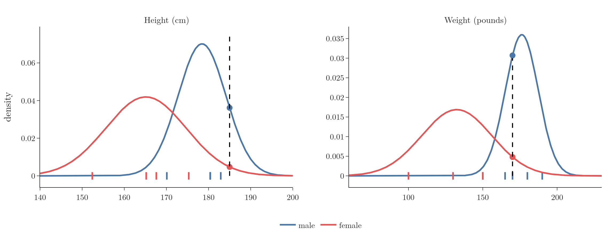

<!-- where-this-fits: generated by course_map/build_map.py; edit concepts.yaml, not this block -->
> **Where this fits:** Pipeline map steps 0 (Foundations), 3 (Understand data), 8 (Model). See the [Course map](../01-course-map/note.md).
>
> 
>
> - **Builds on:** Classification problems ([Note 3](../03-types-of-ml/note.md)); Independent and mutually exclusive events ([Note 84](../84-mutually-exclusive-events/note.md)); Bayes' theorem ([Note 86](../86-bayes-problem/note.md)).
> - **Leads to:** Cumulative distribution function (CDF) ([Note 241](../241-pmf-and-discrete-cdf/note.md)); Density estimation ([Note 243](../243-density-estimation-kde/note.md)); Z-score outlier method ([Note 251](../251-standard-normal-and-z-table/note.md)); Standard normal and the z-table ([Note 251](../251-standard-normal-and-z-table/note.md)); Q-Q plot ([Note 260](../260-kurtosis-and-qq-plots/note.md)); Central limit theorem ([Note 271](../271-sampling-distribution-and-clt/note.md)).
> - **Compare with:** Student's t-distribution ([Note 282](../282-t-procedure/note.md)).
<!-- /where-this-fits -->

## 1. Overview

> **Key point:** Numerical features rarely repeat exactly, so counting fails. Gaussian Naive Bayes assumes each feature follows a normal distribution within each class, and uses the normal curve's height (density) in place of a counted probability.

So far every **feature** (input variable, one column of the data table) was categorical, so probabilities came from counting. This Note handles **numerical** features such as height or weight, and introduces **Gaussian Naive Bayes**, the most common variant for them.

## 2. The problem

> **Key point:** No man in the data is exactly 185 cm tall, so P(height = 185 | male) by counting is 0.

The data has 8 people. Each person is one **observation** (one record, a row of the table). The two features are height (cm) and weight (pounds); the **target** (the output we predict) is gender:

| Height (cm) | Weight (lb) | Gender |
|---|---|---|
| 182.9 | 180 | male |
| 180.4 | 190 | male |
| 170.1 | 170 | male |
| 180.4 | 165 | male |
| 152.4 | 100 | female |
| 167.6 | 150 | female |
| 165.2 | 130 | female |
| 175.3 | 150 | female |

A new person is 185 cm tall and weighs 170 pounds. Male or female?

The Naive Bayes recipe (the maths Note) needs

$$P(\text{male}) \times P(\text{height} = 185 \mid \text{male}) \times P(\text{weight} = 170 \mid \text{male})$$

and the same for female. The prior is easy: 4 of 8 are male, so $P(\text{male}) = 1/2$. But no man in the data is exactly 185 cm, so counting gives $P(\text{height} = 185 \mid \text{male}) = 0$, and the whole score is 0. With a continuous measurement, almost every new value is one never seen before, so counting cannot work.

## 3. The assumption: normal distributions

> **Key point:** Assume each feature is normally distributed within each class. Estimate the mean and standard deviation, then read off the curve's height at the new value.

Gaussian Naive Bayes assumes that, within each class, each numerical feature follows a **normal** (Gaussian) distribution, the bell curve of the earlier statistics Notes.

For each class and each feature:

1. compute the **mean** $\mu$ and **standard deviation** $\sigma$ of that feature over that class's observations;
2. for a new value $x$, compute the normal density

$$f(x) = \frac{1}{\sigma\sqrt{2\pi}}\thinspace  e^{-\frac{1}{2}\left(\frac{x - \mu}{\sigma}\right)^2}$$

3. use $f(x)$ in place of $P(x \mid \text{class})$ in the Naive Bayes product.

{height=52%}

Figure 1 shows the four fitted curves. The new person's height (185 cm) sits on the right flank of the male curve but far out in the tail of the female curve; the same holds for the weight (170 pounds).

## 4. The numbers

> **Key point:** Male score 5.5 × 10⁻⁴ against female 1.1 × 10⁻⁵: predict male, with about 98% probability.

| Class | Feature | Mean | Std. deviation | Density at the new value |
|---|---|---|---|---|
| male | height | 178.45 | 5.69 | 0.03615 |
| male | weight | 176.25 | 11.09 | 0.03070 |
| female | height | 165.12 | 9.51 | 0.00473 |
| female | weight | 132.50 | 23.63 | 0.00479 |

$$\text{male: } 0.5 \times 0.03615 \times 0.03070 = 5.5 \times 10^{-4}$$

$$\text{female: } 0.5 \times 0.00473 \times 0.00479 = 1.1 \times 10^{-5}$$

The male score is about 49 times larger, so the prediction is **male**. As probabilities: 98% male, 2% female.

> **Extra:** A density is not a probability: for a continuous variable, the probability of exactly 185.000... cm is 0, and densities can even be larger than 1. But the density measures how likely values **near** 185 are, and the same small interval would multiply every class's density equally. So comparing densities across classes gives the same decision as comparing probabilities.

> **Python:** scikit-learn's GaussianNB.
>
> ```python
> from sklearn.naive_bayes import GaussianNB
>
> nb = GaussianNB().fit(df[["height_cm", "weight_lb"]], df["gender"])
> nb.theta_           # class means
> nb.var_             # class variances
> nb.predict_proba(new_person)   # about 99% male
> ```
>
> `GaussianNB` estimates the variance by dividing by $n$ rather than $n - 1$ (and adds a tiny amount, `var_smoothing`, for numerical safety; scikit-learn docs, `GaussianNB`), so its numbers differ slightly from the table: 99.2% male instead of 98.0%. The prediction is the same.

## 5. When the data is not normal

> **Key point:** The normal assumption can be wrong. Other variants assume other distributions: multinomial for counts, Bernoulli for yes/no, categorical for categories.

The normal assumption is a choice, and it can be poor, for example for a skewed feature like income. Naive Bayes can use any distribution that suits the data, giving different variants:

| Variant | Assumed distribution | Typical features | scikit-learn |
|---|---|---|---|
| Gaussian | normal | continuous measurements | `GaussianNB` |
| Multinomial | multinomial | counts, such as word counts in a document | `MultinomialNB` |
| Bernoulli | Bernoulli (yes/no) | binary features, such as "word present or not" | `BernoulliNB` |
| Categorical | categorical | categories, as in the Play Tennis Note | `CategoricalNB` |

Each variant suits one kind of data (scikit-learn user guide §1.9), so we look at each feature's distribution and pick the variant whose assumption fits it. A strongly skewed numerical feature can also be transformed first (the power transformer Note) so that it looks more normal.

## 6. Summary

- Numerical values rarely repeat, so $P(x \mid \text{class})$ cannot be counted.
- Gaussian Naive Bayes fits a normal curve (mean, standard deviation) per class and feature, and uses the density at $x$.
- New person 185 cm, 170 lb: male score $5.5 \times 10^{-4}$, female $1.1 \times 10^{-5}$: male (98%).
- Other variants (multinomial, Bernoulli, categorical) suit other kinds of features.

## 7. Sources

- **scikit-learn docs:** `sklearn.naive_bayes.GaussianNB` (var_smoothing); user guide Section 1.9, "Naive Bayes", scikit-learn 1.9.

## 8. Key terms

| Term | Meaning |
|---|---|
| Gaussian Naive Bayes | Naive Bayes that models each numerical feature as normally distributed within each class |
| Probability density | The height of a continuous distribution's curve; compares how likely nearby values are |
| GaussianNB | scikit-learn's Gaussian Naive Bayes |
| MultinomialNB | Naive Bayes for count data, such as word counts |
| BernoulliNB | Naive Bayes for binary (yes/no) features |
