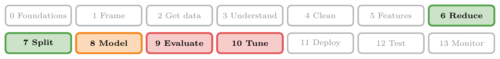
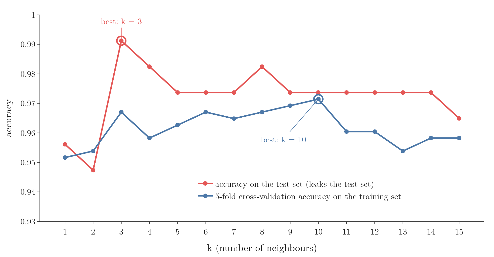
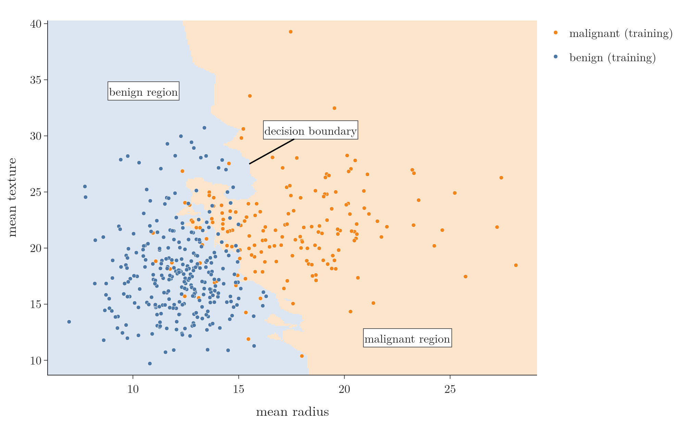
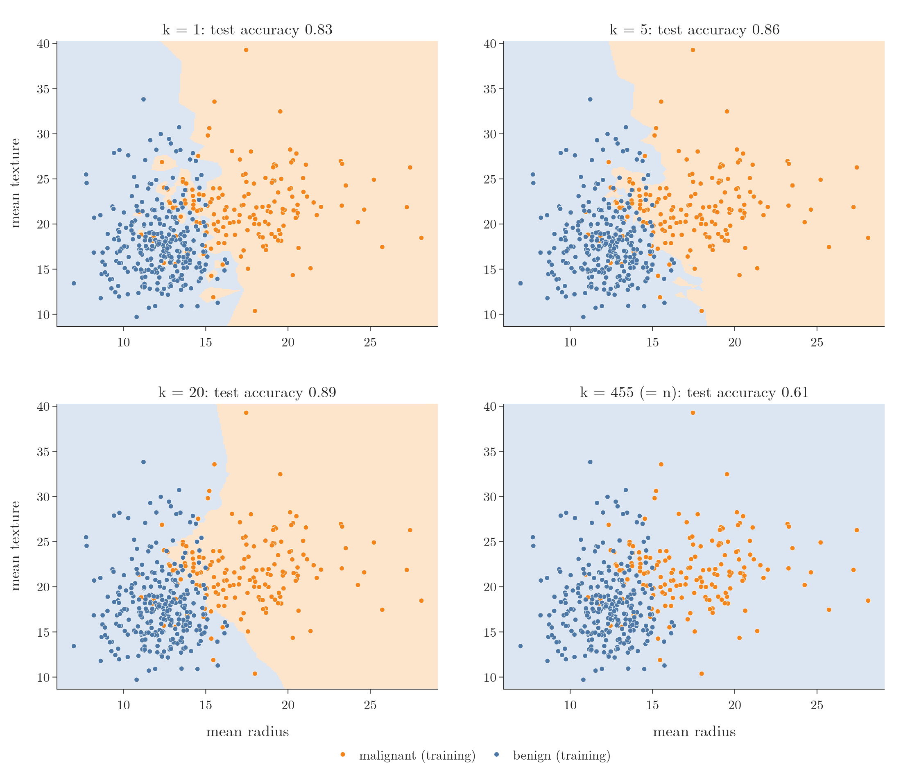
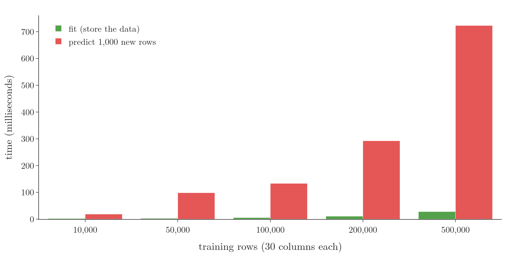

<!-- where-this-fits: generated by course_map/build_map.py; edit concepts.yaml, not this block -->
> **Where this fits:** Pipeline map steps 6 (Reduce dimensions), 7 (Split), 8 (Model), 9 (Evaluate), 10 (Tune). See the [Course map](../01-course-map/note.md).
>
> 
>
> - **Builds on:** Classification problems ([Note 3](../03-types-of-ml/note.md)); Instance-based learning ([Note 6](../06-instance-vs-model-based/note.md)); Train-test split ([Note 13](../13-toy-project/note.md)); Feature scaling ([Note 24](../24-standardization/note.md)); Simple imputation (mean, median, mode, constant) ([Note 37](../37-missing-categorical-data/note.md)); ML pipelines ([Note 38](../38-missing-indicator-random-sample/note.md)).
> - **Leads to:** Decision trees ([Note 97](../97-decision-trees-intuition/note.md)); Boosting ([Note 101](../101-ensemble-learning/note.md)); Voting ensembles ([Note 102](../102-voting-ensemble/note.md)); Bagging ([Note 105](../105-bagging-intuition/note.md)); Random forest ([Note 108](../108-random-forest-intro/note.md)); Bias-variance trade-off ([Note 109](../109-random-forest-bias-variance/note.md)).
> - **Compare with:** Train-test split ([Note 13](../13-toy-project/note.md)); Polynomial regression ([Note 61](../61-polynomial-regression/note.md)); Bias-variance trade-off ([Note 62](../62-bias-variance/note.md)); Confusion matrix ([Note 76](../76-accuracy-confusion-matrix/note.md)); OOB score ([Note 105](../105-bagging-intuition/note.md)); Optuna ([Note 134](../134-optuna/note.md)).
<!-- /where-this-fits -->

## 1. Overview

> **Key point:** KNN predicts a new point's class from the classes of the k training points closest to it. It is simple and often accurate, but slow on big data and unreliable when distances stop meaning much.

**K-nearest neighbours (KNN)** is a classification algorithm built on one idea: a point is probably like its neighbours. A popular saying puts it the same way: "you are the average of the five people you spend the most time with".

This Note covers how KNN predicts, how to run it in scikit-learn, how to choose k, what k does to the decision surface, and the six situations where KNN works badly. The Notebook (`notebook.ipynb`) runs every example, and `app.py` lets us move k with a slider.

## 2. How KNN predicts

> **Key point:** Choose k, measure the distance from the new point to every training point, keep the k nearest, and take a majority vote.

### 2.1 The steps

> **Key point:** Distance, sort, keep k, vote. Nothing else.

The instance-based learning Note ([Note 6](../06-instance-vs-model-based/note.md), Figure 2) already showed one KNN prediction step by step on the student data. Each student has a CGPA, an IQ and a placement result (1 = placed, 0 = not placed). A new student, the **query point**, arrives with a known CGPA and IQ, and we must predict placement.

KNN does it in five steps:

1. **Choose k**, the number of neighbours to consult, for example k = 3.
2. **Measure** the distance from the query point to every training point. With 100 students, that is 100 distances. The usual choice is the Euclidean distance (the [KNN imputer Note](../39-knn-imputer/note.md), section 4.1): the square root of the summed squared differences, column by column.
3. **Sort** the distances from smallest to largest.
4. **Keep the k nearest** training points: the **neighbours**.
5. **Vote:** each neighbour "says" its class, and the class with the most votes wins. If the 3 neighbours say 1, 1 and 0, the prediction is 1 (placed).

> **Extra:** Euclidean is not the only distance. scikit-learn's `KNeighborsClassifier` uses the **Minkowski distance** with `p=2` by default, which is exactly the Euclidean distance. With `p=1` it becomes the **Manhattan distance**: the sum of the absolute differences, like walking along city blocks.

### 2.2 Any number of columns

> **Key point:** Every row is a point (a vector) with one coordinate per column, so KNN works the same way in 3, 30 or 300 dimensions.

Nothing in the steps needs exactly two columns. With 30 input columns, every row is a point in 30-dimensional space, that is, a **vector** of 30 numbers. The Euclidean distance simply gets one squared term per column.

We cannot draw 30 dimensions, but the computer does not need to. It treats the query point as a vector, computes its distance to every training vector, keeps the k closest, and votes.

## 3. KNN in scikit-learn: the breast cancer data

> **Key point:** Split, scale (fit on the training set only), fit `KNeighborsClassifier(n_neighbors=5)`, predict, score: 97.4% test accuracy.

### 3.1 The data

> **Key point:** 569 tumours, 30 numeric measurements each, and a diagnosis: malignant or benign.

The **breast cancer dataset** describes 569 breast tumours. Each has 30 numeric measurements of the cell nuclei, such as `radius_mean`, `texture_mean` and `compactness_mean`. The output column, the **diagnosis**, is malignant (cancer, 212 rows) or benign (not cancer, 357 rows).

The widely shared CSV version also has an `id` column and an empty last column, `Unnamed: 32`. Neither helps predict anything, so both are dropped. scikit-learn ships a cleaned copy without them, which we use.

> **Python:** Loading the data.
>
> ```python
> from sklearn.datasets import load_breast_cancer
>
> data = load_breast_cancer(as_frame=True)
> X, y = data.data, data.target   # 30 inputs; 0 = malignant, 1 = benign
> X.shape                          # (569, 30)
> ```
>
> `as_frame=True` returns pandas tables instead of plain arrays. No values are missing, so no cleaning is needed.

### 3.2 Split and scale

> **Key point:** KNN compares distances, so every column must be on the same scale; otherwise the columns with big numbers decide alone.

We hold back 20% of the rows as a test set (the train-test split, [Note 13](../13-toy-project/note.md)). That leaves 455 training rows and 114 test rows.

The columns have very different ranges. `radius_mean` is in the tens (14, 11, 19, ...), while `compactness_mean` is a small decimal. In a Euclidean distance, a column measured in tens outweighs a column measured in hundredths, so the small-number columns would hardly count.

We fix this with standardization (the [standardization Note](../24-standardization/note.md)): each column becomes $(x - \text{mean}) / \text{standard deviation}$, so every column has mean 0 and standard deviation 1. As always, the scaler learns the mean and standard deviation from the training set only and then applies them to the test set; fitting it on the test set would leak test information into training ([Note 13](../13-toy-project/note.md)).

> **Python:** Splitting and scaling.
>
> ```python
> from sklearn.model_selection import train_test_split
> from sklearn.preprocessing import StandardScaler
>
> X_train, X_test, y_train, y_test = train_test_split(
>     X, y, test_size=0.2, random_state=2)
>
> scaler = StandardScaler()
> X_train_s = scaler.fit_transform(X_train)  # learn mean, std
> X_test_s = scaler.transform(X_test)        # reuse them
> ```
>
> The result is a NumPy array, no longer a pandas table, still with 455 rows and 30 columns.

### 3.3 Train, predict, score

> **Key point:** With k = 5, KNN gets 111 of the 114 test tumours right: 97.4%.

> **Python:** KNN in scikit-learn.
>
> ```python
> from sklearn.neighbors import KNeighborsClassifier
> from sklearn.metrics import accuracy_score
>
> knn = KNeighborsClassifier(n_neighbors=5)  # 5 is the default
> knn.fit(X_train_s, y_train)
> y_pred = knn.predict(X_test_s)
> accuracy_score(y_test, y_pred)             # 0.974
> ```
>
> `n_neighbors` is k: the size of the neighbourhood.

To score a classifier we use **accuracy** (the [accuracy Note](../76-accuracy-confusion-matrix/note.md)): correct predictions divided by all predictions. For example, 180 correct out of 200 test students is $180/200 = 0.90$, or 90%. Here, 111 of 114 correct gives 97.4%.

Without scaling, the same model gets only 104 of 114 right (91.2%). That gap of 6 points is the cost of letting the big-number columns dominate the distances.

## 4. Choosing k

> **Key point:** There is no universally right k. A rough start is $\sqrt{n}$, made odd; the reliable way is to try many values with cross-validation.

k is a **hyperparameter**: a setting we choose before training (the [pipelines Note](../29-pipelines/note.md)). Different datasets need different k, so we must find a good value for each one. There are two approaches: a rule of thumb and experiments.

### 4.1 The rule of thumb: square root of n

> **Key point:** $k \approx \sqrt{n}$, where n is the number of training rows; then pick a nearby odd number to avoid ties.

1. **In words:** take the square root of the number of training rows.
2. **Formula:**
   $$k \approx \sqrt{n}$$
3. **Example:** with 400 patients, $\sqrt{400} = 20$. On our breast cancer data, $\sqrt{455} \approx 21.3$, so about 21.

With two classes, an even k can produce a tie. With k = 4, the vote can end 2 against 2, and there is no majority. So we take an odd value nearby: 19 or 21 instead of 20.

> **Extra:** If a tie does happen, scikit-learn does not flip a coin. It picks the class that comes first in its sorted list of classes (here, 0 = malignant). An odd k avoids the question entirely for two classes.

This rule is only a starting point. Experiments usually do better.

### 4.2 Experiments: try every k

> **Key point:** Train one model per k from 1 to 15, score each, and keep the best.

The idea is simple: build KNN models with k = 1, 2, 3, ..., 15, train each on the training set, score each, and keep the k with the highest accuracy.

> **Python:** One model per k, scored on the test set.
>
> ```python
> test_acc = []
> for k in range(1, 16):
>     m = KNeighborsClassifier(n_neighbors=k)
>     m.fit(X_train_s, y_train)
>     test_acc.append(m.score(X_test_s, y_test))
> ```
>
> `m.score` computes the accuracy directly, the same as `accuracy_score(y_test, m.predict(X_test_s))`.

The red line in Figure 1 shows the result. The best test accuracy is at **k = 3: 113 of 114 correct, 99.1%**. From k = 5 onwards the accuracy settles at about 97.4%.

{height=40%}

> **Extra:** Choosing k by its test-set score has a flaw: the test set is no longer unseen. We tried 15 models on the same 114 test rows and kept the luckiest, so the 99.1% is an optimistic score, not an honest estimate for new patients. This is the same kind of leak as fitting the scaler on the test set.
>
> The right way is **cross-validation** on the training set only (the [pipelines Note](../29-pipelines/note.md), sections 8 and 9). For each k, the 455 training rows are cut into 5 parts; the model is trained on 4 and scored on the fifth, five times, and the scores are averaged. We keep the k with the best average, then score the test set **once**.
>
> The blue line in Figure 1 is this cross-validation accuracy. It picks **k = 10** (97.1% average), not 3. The final, honest test accuracy with k = 10 is **97.4%**.
>
> ```python
> from sklearn.model_selection import GridSearchCV
> from sklearn.pipeline import make_pipeline
>
> model = make_pipeline(StandardScaler(),
>                       KNeighborsClassifier())
> grid = {"kneighborsclassifier__n_neighbors":
>         list(range(1, 16))}
> search = GridSearchCV(model, grid, cv=5)
> search.fit(X_train, y_train)    # unscaled: the pipeline scales
> search.best_params_             # k = 10
> search.score(X_test, y_test)    # 0.974, the one test score
> ```
>
> The scaler goes inside the pipeline so that, in every fold, it is fitted only on that fold's 4 training parts.

## 5. Decision surfaces

> **Key point:** A decision surface colours every point of the input space by the class the model would predict there. It is built by predicting on a dense grid of points.

### 5.1 What it shows

> **Key point:** The coloured areas are the decision regions; the line where the colour changes is the decision boundary.

The **decision regions** (the [softmax regression Note](../79-softmax-regression/note.md)) and the **decision boundary** between them ([Note 6](../06-instance-vs-model-based/note.md)) are familiar. Drawn over the whole input space, they form a **decision surface**. It works for any classifier, as long as the inputs have 1, 2 or 3 columns, so we can plot them.

To get two columns, we use only the first two breast cancer measurements: `mean radius` and `mean texture`. Figure 2 shows KNN with k = 5 trained on them.

{height=42%}

The surface answers "what would the model predict here?" for every point at once. A new tumour with radius 12 and texture 15 falls in the blue region, so KNN predicts benign; one with radius 20 falls in the orange region: malignant. KNN's boundary is not a straight line: it bends wherever the neighbours change.

### 5.2 How it is built

> **Key point:** Make a fine grid covering the data's range, predict the class of every grid point, and colour each one.

1. **Find the range** of each input column, with a small margin: here mean radius from about 6 to 29 and mean texture from about 9 to 40.
2. **Make a grid** of points covering that rectangle: 300 values on each axis give $300 \times 300 = 90{,}000$ points. NumPy's `meshgrid` builds it.
3. **Predict** the class of every grid point with the trained model.
4. **Colour** each grid point by its predicted class (blue or orange) and draw the training points on top.

With 90,000 points packed together, the coloured dots merge into solid areas, and the boundary appears where blue meets orange.

> **Python:** A decision surface with NumPy and Plotly.
>
> ```python
> import numpy as np
> import plotly.graph_objects as go
>
> xs = np.linspace(X2[:, 0].min() - 1,
>                  X2[:, 0].max() + 1, 300)
> ys = np.linspace(X2[:, 1].min() - 1,
>                  X2[:, 1].max() + 1, 300)
> XX, YY = np.meshgrid(xs, ys)          # two 300 x 300 grids
> grid = np.c_[XX.ravel(), YY.ravel()]  # 90,000 rows, 2 columns
> Z = model.predict(grid).reshape(XX.shape)
> go.Figure(go.Heatmap(x=xs, y=ys, z=Z))
> ```
>
> `X2` holds the two input columns and `model` is a pipeline of `StandardScaler` and KNN trained on them. `meshgrid(xs, ys)` returns every combination of an x value and a y value: `XX` holds the x coordinates and `YY` the y coordinates. `ravel()` flattens each grid into one long column, `np.c_` puts the two columns side by side, and `reshape` folds the predictions back into a 300 by 300 grid for the heatmap.

## 6. How k controls overfitting and underfitting

> **Key point:** Small k follows every point, outliers included (overfitting); k = n always predicts the majority class (underfitting). A middle k is best.

Overfitting and underfitting ([Note 7](../07-challenges-in-ml/note.md)), and their link to high variance and high bias ([Note 62](../62-bias-variance/note.md)), show up clearly in KNN. Figure 3 trains KNN on the same two columns with four values of k.

{height=60%}

### 6.1 k = 1: overfitting

> **Key point:** With one neighbour, every training point, even an outlier, claims a small region of its own.

With k = 1, the query point takes the class of its single nearest neighbour. Take a lone orange (malignant) point sitting among blue ones, an outlier. A query point next to it is copied as malignant, even though everything else around says benign.

So the surface for k = 1 (Figure 3, top left) is full of small islands: orange patches inside the blue region and blue patches inside the orange one. The model has memorised small accidents of this particular sample. Another sample would place the islands elsewhere, so predictions change a lot from sample to sample: **high variance**, overfitting.

### 6.2 k = n: underfitting

> **Key point:** If k equals the number of training rows, every query point consults all of them, and the majority class always wins.

The largest possible k is n, the number of training rows; here n = 455. Then the "neighbourhood" of any query point is the whole training set, so the vote is always the same: 288 benign against 167 malignant.

The whole plane turns blue (Figure 3, bottom right): every tumour is predicted benign, wherever it lies. The model ignores the inputs entirely, which is **underfitting**. Its test accuracy, 0.61, is just the share of benign tumours in the test set.

### 6.3 The middle

> **Key point:** As k grows, the boundary smooths out and the islands vanish; past a point it becomes too simple.

At k = 5 the islands shrink, and at k = 20 the boundary is a smooth curve (Figure 3, bottom left). It is still not a straight line, but it follows the real shape of the data rather than individual points. On these two columns, k = 20 also has the best test accuracy of the four (0.89).

So:

- **very small k** (1 or 2): overfitting;
- **very large k** (up to n): underfitting;
- **in between**: the best k, found by experiment as in section 4.

### 6.4 Trying it: the k slider app

> **Key point:** `app.py` redraws the decision surface for any k from 1 to 455.

The folder of this Note contains `app.py`, a small Dash app. Run `python app.py` and open `http://127.0.0.1:8050`. Move the slider and the surface of Figure 3 is redrawn for that k, with its test accuracy.

Things to try:

- **k = 1, 2, 3:** count the islands around single points.
- **k = 5, 10, 20:** watch the islands disappear and the boundary smooth out.
- **k = 100, 200, 300:** the orange region shrinks as the larger benign class wins more votes.
- **k = 455:** everything is benign.

## 7. When KNN fails

> **Key point:** Six weak spots: big datasets, many columns, outliers, unscaled columns, imbalanced classes, and questions about which input matters.

Knowing when not to use an algorithm matters as much as knowing how it works. KNN has six common failure cases.

### 7.1 Large datasets: slow predictions

> **Key point:** KNN is a lazy learner: training only stores the data, and every prediction computes a distance to every training row.

KNN is **lazy learning** (instance-based learning, [Note 6](../06-instance-vs-model-based/note.md)): training only stores the points, and all the work waits for a query. For each query, KNN computes n distances, sorts them and votes.

So training is fast and prediction is slow. With 500,000 rows and 100 columns, every single prediction needs 500,000 distances and a sort. On a website, a user who clicks "predict" and waits 3 seconds may simply leave; internet companies care a lot about **latency**, the delay between a request and its answer.

Figure 4 measures this on random data with 30 columns. "Training" on 500,000 rows takes a few tens of milliseconds, while predicting 1,000 new rows takes about 650 milliseconds, and the prediction time grows in step with n. The exact times depend on the computer.

{height=38%}

> **Extra:** The measurement uses `algorithm="brute"`, the plain method described above. By default scikit-learn picks `algorithm="auto"`, which can store the points in a tree (a **KD-tree** or **ball tree**) so that most far-away points are skipped. That speeds things up a lot when there are few columns, but helps little with many columns, where the next failure case applies.

### 7.2 High-dimensional data: distances stop meaning much

> **Key point:** With many columns, the curse of dimensionality makes all points nearly equally far apart, and KNN depends entirely on distances.

With many input columns, say 500, the **curse of dimensionality** (the [curse of dimensionality Note](../46-curse-of-dimensionality/note.md)) sets in. In high dimensions the farthest point is barely farther than the nearest one (Figure 5 of that Note: 67 times farther in 2 columns, only 1.1 times in 1,000).

When every point is about equally far, the "nearest" neighbours are not really near, so their votes say little about the query point. KNN relies on nothing but distances, so once distances are distorted, its predictions are too. For very high-dimensional data, we either avoid KNN or first reduce the number of columns.

### 7.3 Outliers

> **Key point:** With a small k, a few outliers carve out wrong regions around themselves.

Suppose two pink points sit deep inside the blue region: noise or outliers. With k = 3, a query point next to them has both as neighbours and is called pink. A pink island appears in the decision surface where the region should be blue.

This is the k = 1 picture of Figure 3 again: KNN is sensitive to outliers, and a k that is too small leads to overfitting. A larger, well-chosen k outvotes them.

### 7.4 Columns on different scales

> **Key point:** If one column's numbers are much larger, it decides the distance alone; scale first.

Take employees with years of experience (0 to 25), salary (20 thousand to 1 crore rupees, where 1 crore = 10 million) and whether they were fired. In a raw Euclidean distance, a salary gap of thousands of rupees swamps an experience gap of a few years, so the distance is effectively the salary alone.

This is why section 3.2 scaled the data first. On the breast cancer data, scaling raised the test accuracy from 91.2% to 97.4%.

### 7.5 Imbalanced data

> **Key point:** If one class is rare, its points are usually outvoted, so predictions lean towards the common class.

In imbalanced data ([Note 76](../76-accuracy-confusion-matrix/note.md), section 6), one class is much rarer than the other, for example 98% "yes" and 2% "no". Around almost any query point, most neighbours belong to the common class, so the vote is biased towards it.

> **Extra:** A quick test on synthetic data with 98% of rows in class 0 and 2% in class 1 (5,000 rows, 10 columns). KNN with k = 5 scores 98% accuracy on the test set, yet finds only 1 of the 30 rare-class rows (recall 0.03). The accuracy looks excellent because almost everything is predicted as the common class.

### 7.6 Inference: which input mattered?

> **Key point:** KNN predicts well but does not say how much each input contributes; it acts like a black box.

Sometimes we want **inference** rather than prediction: we want to learn how the inputs affect the output. For example, does CGPA or IQ matter more for placement?

KNN cannot answer this. It labels a query point by its neighbours, but it never builds a function that shows how each input moves the output. Linear or logistic regression, by contrast, gives one coefficient per input. For this purpose KNN acts as a **black box model**: it gives an answer, but not the reasons behind it.

## 8. Summary

| Situation | KNN works well? | Why |
|---|---|---|
| Small or medium dataset | yes | few distances per prediction |
| Large dataset (hundreds of thousands of rows) | no | every prediction computes n distances: high latency |
| Many columns (hundreds) | no | curse of dimensionality: distances lose meaning |
| Outliers, small k | no | islands around outliers: overfitting |
| Columns on different scales | only after scaling | big-number columns dominate the distance |
| Imbalanced classes | no | the common class wins most votes |
| Need to know which input matters | no | no coefficients: a black box |

- KNN predicts by majority vote among the k training points nearest to the query point, usually by Euclidean distance.
- Scale the inputs first: on the breast cancer data, 91.2% unscaled against 97.4% scaled (k = 5).
- Choose k by cross-validation on the training set (here k = 10, test accuracy 97.4%), not by test-set accuracy. $\sqrt{n}$, made odd, is only a rough start.
- A decision surface colours a dense grid of predicted points (`meshgrid`, predict, colour).
- Small k overfits (islands, high variance); k = n underfits (always the majority class).

## 9. Key terms

| Term | Meaning |
|---|---|
| K-nearest neighbours (KNN) | A classifier that predicts the majority class among the k training points nearest to the query point |
| k (n_neighbors) | The number of neighbours that vote; KNN's main hyperparameter |
| Query point | The new point whose class we want to predict |
| Neighbours | The k training points closest to the query point |
| Majority vote | Predicting the class that most of the neighbours have |
| KNeighborsClassifier | scikit-learn's KNN classifier; `n_neighbors=5` by default |
| Square-root rule | A rough starting value for k: about $\sqrt{n}$, made odd |
| Decision surface | A plot colouring every point of the input space by the class the model would predict there |
| meshgrid | NumPy function that builds every combination of x and y values: the grid for a decision surface |
| Latency | The delay between a request and its answer; high for KNN on large data |
| Inference | Learning how the inputs affect the output, rather than only predicting it |
| Black box model | A model that gives predictions without showing how each input contributed |
| Minkowski distance | A family of distances: p = 2 is Euclidean, p = 1 is Manhattan |
