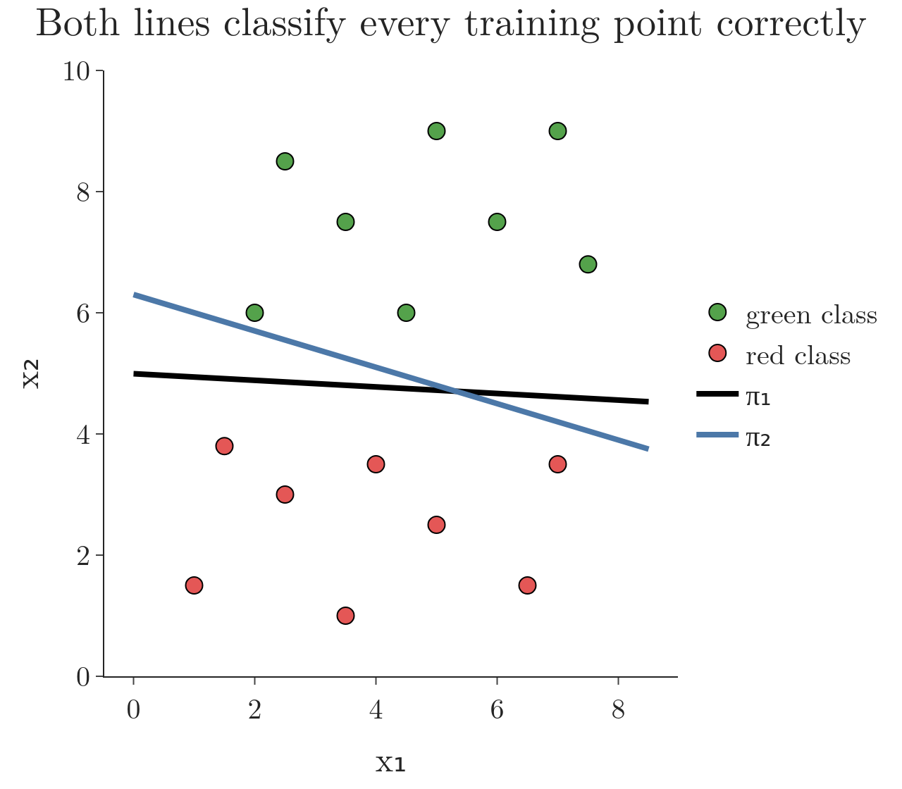
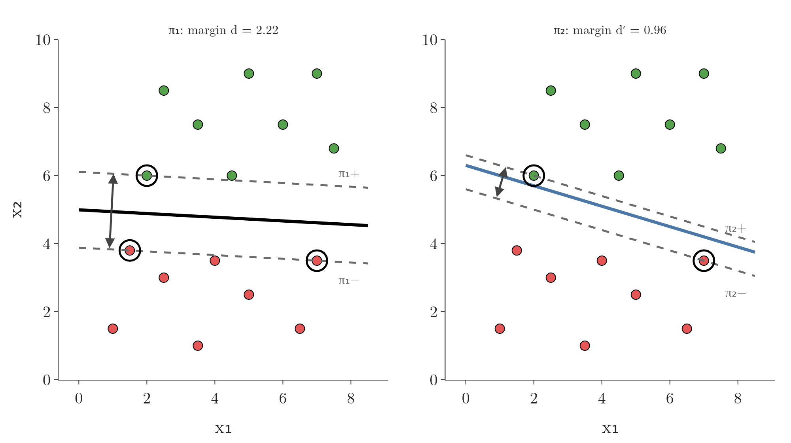

<!-- where-this-fits: generated by course_map/build_map.py; edit concepts.yaml, not this block -->
> **Where this fits:** Pipeline map step 8 (Model). See the [Course map](../01-course-map/note.md).
>
> 
>
> - **Builds on:** Classification problems ([Note 3](../03-types-of-ml/note.md)); Dot product ([Note 48](../48-pca-step-by-step/note.md)); Regularisation ([Note 63](../63-ridge-regression-intuition/note.md)); Equation of a hyperplane ([Note 70](../70-perceptron-trick/note.md)); Perceptron trick ([Note 71](../71-perceptron-code/note.md)).
> - **Compare with:** Logistic regression ([Note 75](../75-logistic-gradient-descent/note.md)).
<!-- /where-this-fits -->

## 1. Overview

> **Key point:** A support vector machine (SVM) separates two classes with the line that leaves the widest possible gap between them. The points that touch the edges of that gap are the support vectors.

A **support vector machine (SVM)** is a classification algorithm from the same family as logistic regression. SVM is a strong, widely used algorithm that works in many situations, often called one of the best "out of the box" classifiers (ISL §9). It builds directly on logistic regression, so the logistic regression Notes are the best preparation for it.

Logistic regression accepts any line that separates the classes. SVM goes one step further and asks which separating line is the **best**. Its answer: the line with the widest empty gap on both sides (Figure 1).

{height=40%}

This Note explains that idea with pictures only. The next Notes turn it into maths.

> **Extra:** The maximum-margin idea goes back to Vapnik's work in the 1960s. The modern SVM took shape in the 1990s: the kernel trick was added in 1992 (Boser, Guyon and Vapnik) and the soft margin in 1995 (Cortes and Vapnik 1995, §1).

## 2. Choosing between two separating lines

> **Key point:** Two lines can both classify every training point correctly. Logistic regression treats them as equally good; SVM prefers the one that keeps the points further away.

### 2.1 Two perfect lines

> **Key point:** Training accuracy alone cannot tell $\pi_1$ and $\pi_2$ apart: both are 100% correct.

Each point is one **observation** (one record, a row of the data table). Its coordinates are its **features** (input variables, one column each), and its colour is the **target** (the output we predict).

Figure 2 shows two classes, green and red, that are linearly separable (see the [perceptron trick Note](../70-perceptron-trick/note.md)). Two lines, $\pi_1$ (black) and $\pi_2$ (blue), both put every green point on one side and every red point on the other. In more dimensions the dividers are planes or [hyperplanes](../53-multiple-linear-regression/note.md), so we write each one with the letter $\pi$.

{height=40%}

For logistic regression both lines do the job, so both are acceptable. SVM asks a further question: which of the two will work better on **new** points? Most people pick $\pi_1$ by eye, because $\pi_2$ passes very close to some points.

### 2.2 Distance as confidence

> **Key point:** The further a point is from the line, the more confident the model is about its class.

Logistic regression already links distance and confidence: $w^T x_i$ grows with the point's distance from the line, and the sigmoid turns it into $P(y = 1) = \sigma(w^T x_i)$ (see the [sigmoid Note](../72-sigmoid-function/note.md)). Near the line $\sigma$ is close to 0.5, far away it is close to 0 or 1: $\sigma(0.2) = 0.55$, while $\sigma(4) = 0.98$.

So a line that keeps every point far away classifies every point with high confidence. The [perceptron code Note](../71-perceptron-code/note.md) already showed the danger of the opposite: a line that hugs one class misclassifies new points from that class easily.

### 2.3 The core idea of SVM

> **Key point:** Separate the classes, and among all lines that do, choose the one that keeps the points as far away as possible.

SVM classifies the data with the hyperplane that separates the classes **as widely as possible**. SVM wants to make the gap between the line and the points as large as it can. The hope is that such a line generalises better: it performs better on new, unseen data than a line that squeezes past the points (ISL §9.1.3). The [perceptron code Note](../71-perceptron-code/note.md) tested this on the iris flowers: lines that hugged one class made more mistakes on new flowers.

## 3. The margin

> **Key point:** The margin is the width of the empty gap around the line. SVM looks for the margin-maximising hyperplane.

The gap around the separating line is called the **margin**. In SVM, the margin is the **full width** of the empty band: the distance from the nearest green point to the nearest red point, measured across the line. The [perceptron code Note](../71-perceptron-code/note.md) used "margin" for the one-sided distance from the line to the nearest point of one class; the SVM margin is the two one-sided gaps added together, so for a line in the middle of the band it is **twice** that distance. SVM searches for the hyperplane that makes this full width as large as possible. For this reason, the SVM line is also called the **margin-maximising hyperplane**.

A wide margin makes the model more general: it leaves room for new points that vary a little from the training points. An everyday picture: a driver who keeps to the middle of the lane, as far as possible from both kerbs, has the most room for a small wobble. A wide margin is the whole goal of SVM; everything else in the following Notes is about how to compute it.

## 4. Measuring the margin of a line

> **Key point:** Slide two copies of the line outwards until each touches the first point of its class. The distance between the copies is the margin d.

### 4.1 The procedure

> **Key point:** Pick a line, build $\pi^+$ and $\pi^-$, measure d, repeat for many lines, keep the line with the largest d.

To measure the margin of a candidate hyperplane $\pi$ (Figure 3):

1. **Pick a hyperplane** $\pi$ that separates the classes.
2. **Find $\pi^+$:** move a copy of $\pi$ parallel to itself in the positive direction. Stop as soon as it touches the first green point. This copy is the **positive hyperplane** $\pi^+$.
3. **Find $\pi^-$:** do the same in the negative direction, stopping at the first red point. This copy is the **negative hyperplane** $\pi^-$.
4. **Measure the margin:** $\pi^+$ and $\pi^-$ are both parallel to $\pi$, so they are parallel to each other. The **margin** $d$ is the shortest distance between them.
5. **Repeat** steps 1 to 4 for many other hyperplanes, each with its own $\pi^+$, $\pi^-$ and $d$.
6. **Keep** the hyperplane whose $d$ is the largest.


In 2D, $\pi$, $\pi^+$ and $\pi^-$ are all straight lines. The same procedure works unchanged with planes in 3D and hyperplanes in more dimensions.

### 4.2 Comparing two lines by their margin

> **Key point:** $\pi_1$ has margin d = 2.22, $\pi_2$ only $d'$ = 0.96, so SVM chooses $\pi_1$.

Applying the procedure to the two lines of Figure 2 gives Figure 4. The parallel copies of $\pi_2$ hit a green point and a red point very quickly, so its margin is narrow.

{height=45%}

In plain words, SVM wants the separating line whose margin is the widest. As a formula, with the line written as $w^T x + b = 0$:

$$\text{choose } w, b \text{ that maximise } d$$

With numbers: $d = 2.22$ for $\pi_1$ and $d' = 0.96$ for $\pi_2$. Since $d' < d$, SVM chooses $\pi_1$ over $\pi_2$.

The next Note turns $d$ into a formula in $w$ and $b$, so that the best line can be found by optimisation instead of trial and error.

> **Python:** In scikit-learn, the SVM classifier is `SVC`. With a straight line (`kernel="linear"`) and a very large `C` (explained in the soft-margin Note), it finds the widest-margin line of Figure 4.
>
> ```python
> from sklearn.svm import SVC
>
> svm = SVC(kernel="linear", C=1e6)
> svm.fit(X, y)                    # y holds +1 (green) and -1 (red)
> svm.coef_, svm.intercept_        # w and b of the line
> svm.support_vectors_             # the ringed points
> ```

## 5. Support vectors

> **Key point:** Support vectors are the points that lie on $\pi^+$ and $\pi^-$. They alone decide where the SVM line goes.

When $\pi^+$ and $\pi^-$ are moved outwards, they stop at the first points of each class. These points, lying exactly on $\pi^+$ or $\pi^-$, are the **support vectors**. In Figure 1 there is one green support vector and two red ones; for $\pi_1$ in Figure 4 it is the same.

The idea is so central that it gives the algorithm its name. The support vectors "support" the two edges of the margin: move one of them and the best line moves too.

> **Extra:** The other points have no say at all. If we deleted every point except the three support vectors in Figure 4 and trained again, we would get exactly the same line (ISL §9.1.3). For the same reason, a trained SVM can discard the other points and keep only its support vectors (Bishop §7.1).

## 6. Strengths of SVM

> **Key point:** SVM copes with outliers (in its soft-margin form), handles non-linear data through kernels, and works for both classification and regression.

1. **Outliers:** SVM handles outliers well, provided we use the soft-margin version of the third SVM Note.
2. **Non-linear data:** when no single straight line can separate the classes, SVM uses **kernels** to draw curved boundaries. The kernel trick Notes explain how.
3. **Classification and regression:** the same ideas give a classifier (SVC) and a regression model (**support vector regression**, SVR).

> **Extra:** The version described in this Note, which demands a perfect separation, is called the hard-margin SVM. The hard-margin SVM is actually **sensitive** to outliers: a single point on the wrong side makes it impossible, and a single extreme point near the boundary changes the line, because that point becomes a support vector (ISL §9.2.1). The robustness comes from the soft margin, which lets a few points break the rules at a cost.

## 7. Summary

| | Logistic regression | SVM |
|---|---|---|
| Goal | any line that separates the classes well | the separating line with the widest margin |
| Two perfect lines | equally good | the one with the larger margin wins |
| Points that decide the line | all points | only the support vectors |
| Non-linear data | needs extra features | kernels |

- SVM picks, among all separating hyperplanes, the margin-maximising one, hoping it generalises better.
- Positive and negative hyperplanes $\pi^+$ and $\pi^-$ are copies of $\pi$ moved out to the first point of each class.
- The margin $d$ is the distance between $\pi^+$ and $\pi^-$. SVM chooses $w$ and $b$ to make $d$ as large as possible.
- The points on $\pi^+$ and $\pi^-$ are the support vectors.

## 8. Sources

- **ISL:** James, G., Witten, D., Hastie, T. and Tibshirani, R. *An Introduction to Statistical Learning*, 2nd ed. Springer, 2021. Chapter 9 introduction (p. 367), Sections 9.1.3 (p. 371) and 9.2.1 (p. 374).
- **Bishop:** Bishop, C. M. *Pattern Recognition and Machine Learning*. Springer, 2006. Section 7.1, p. 330.
- **Cortes and Vapnik 1995:** Cortes, C. and Vapnik, V. "Support-Vector Networks." *Machine Learning* 20, 273–297, 1995. Section 1 (history: optimal hyperplanes 1965, kernels 1992).

## 9. Key terms

| Term | Meaning |
|---|---|
| Support vector machine (SVM) | A classifier that separates the classes with the hyperplane that has the widest margin |
| Margin (SVM) | The full width between $\pi^+$ and $\pi^-$ (later shown to be $2/\lVert w \rVert$): twice the one-sided margin of the perceptron code Note |
| Margin-maximising hyperplane | The separating hyperplane with the largest margin: the SVM decision boundary |
| Positive hyperplane ($\pi^+$) | The copy of the separating hyperplane moved out until it touches the first positive point |
| Negative hyperplane ($\pi^-$) | The copy of the separating hyperplane moved out until it touches the first negative point |
| Support vectors | The training points that lie on $\pi^+$ or $\pi^-$; they alone fix the SVM line |
| Support vector regression (SVR) | The regression version of SVM |
