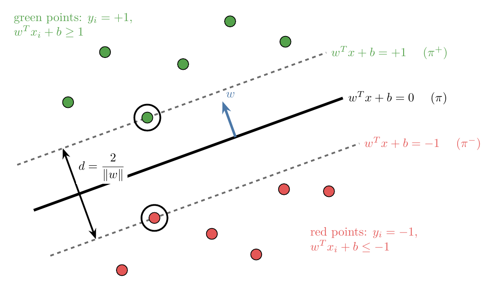
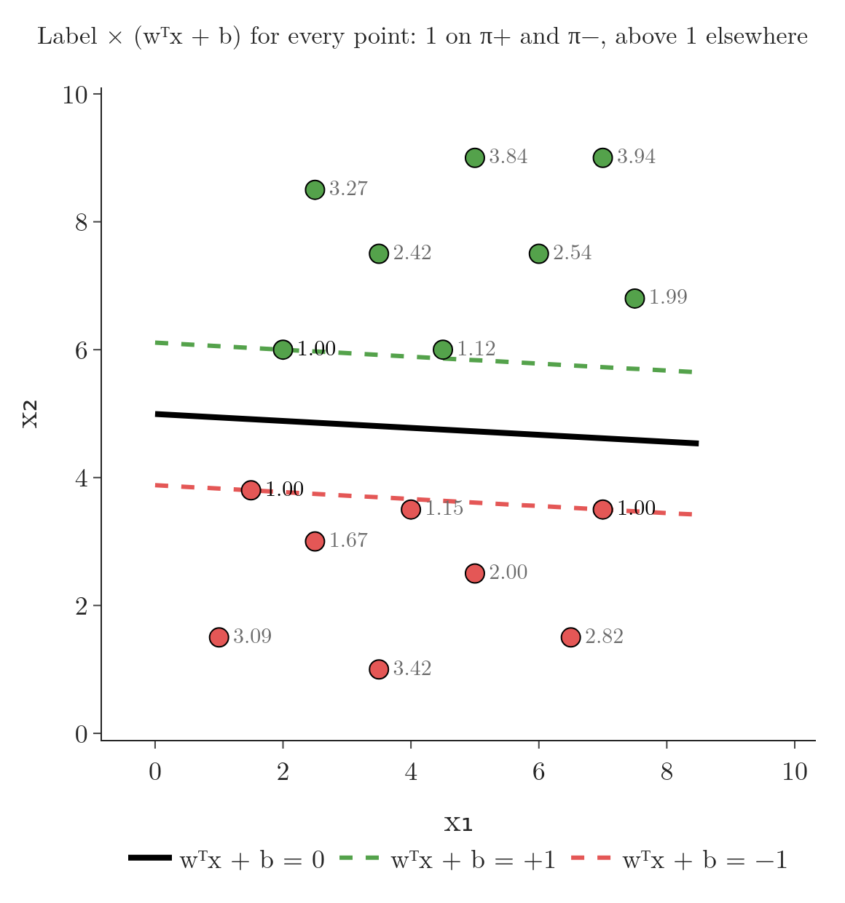

<!-- where-this-fits: generated by course_map/build_map.py; edit concepts.yaml, not this block -->
> **Where this fits:** Pipeline map step 8 (Model). See the [Course map](../01-course-map/note.md).
>
> 
>
> - **Builds on:** Classification problems ([Note 3](../03-types-of-ml/note.md)); Regularisation ([Note 63](../63-ridge-regression-intuition/note.md)); Perceptron trick ([Note 71](../71-perceptron-code/note.md)).
> - **Compare with:** Logistic regression ([Note 75](../75-logistic-gradient-descent/note.md)).
<!-- /where-this-fits -->

## 1. Overview

> **Key point:** We write the SVM line as $w^T x + b = 0$ and its two edges as $w^T x + b = +1$ and $-1$. The margin between the edges is then 2/$\lVert w \rVert$, and SVM maximises it while every point stays on its correct side.

The previous Note, the [SVM intuition Note](../92-svm-intuition/note.md), described SVM in pictures: among all lines that separate two classes, choose the one whose margin $d$, the distance between the positive hyperplane $\pi^+$ and the negative hyperplane $\pi^-$, is the largest. This Note turns that picture into a formula that a computer can optimise.

{height=38%}

Figure 1 shows the result. The steps to get there:

1. A **decision rule** that says on which side of the line a new point lies.
2. Equations for $\pi^+$ and $\pi^-$, and why they use $+1$ and $-1$.
3. **Constraints** that keep every training point on its correct side.
4. A formula for the margin $d$ in terms of $w$.
5. The optimisation problem that puts it all together.

## 2. The decision rule

> **Key point:** Predict +1 if w · u + b ≥ 0, and −1 if w · u + b < 0.

Before finding the best line, we need to know how a line classifies a new point once we have it.

### 2.1 A vector perpendicular to the hyperplanes

> **Key point:** π, $\pi^+$ and $\pi^-$ are parallel, so one vector w is perpendicular to all three. At first we know its direction but not its length.

The three hyperplanes are parallel. So a vector $w$ that is perpendicular to one of them is perpendicular to all three (the blue arrow in Figure 1). At this point we only fix the **direction** of $w$; its length is still unknown and will be decided later.

### 2.2 Projecting a new point onto w

> **Key point:** Project the new point u onto w. If the projection passes a threshold c, the point is positive.

Take an unknown point $u$. In 2D a point is also a vector from the origin, with an x and a y component. Drop $u$ onto the direction of $w$: this is the [projection](../47-pca-geometric-intuition/note.md) of $u$ onto $w$, and its length grows with the [dot product](../48-pca-step-by-step/note.md) $w \cdot u$ (Figure 2).

{height=38%}

The boundary $\pi$ crosses the direction of $w$ at some unknown distance $c$ from the origin. A point is on the positive side when its projection goes past that threshold:

$$w \cdot u \geq c \quad\Leftrightarrow\quad w \cdot u - c \geq 0 \quad\Leftrightarrow\quad w \cdot u + b \geq 0, \quad \text{with } b = -c$$

So the **decision rule** of SVM is:

$$\hat{y} = \begin{cases} +1 & \text{if } w \cdot u + b \geq 0 \\ -1 & \text{if } w \cdot u + b < 0 \end{cases}$$

Once we know $w$ and $b$, classifying any new point takes one dot product and one addition.

> **Extra:** Strictly, the projection's length is $w \cdot u / \lVert w \rVert$, where $\lVert w \rVert$ is the length of $w$. Comparing it with $c$ gives $w \cdot u \geq c\,\lVert w \rVert$. That is the same rule with $b = -c\,\lVert w \rVert$, so the final form does not change.

### 2.3 The same rule in 2D

> **Key point:** In 2D, w · u + b is just "put the point into the line's equation", as in the perceptron trick Note.

In 2D this rule is the side test of the [perceptron trick Note](../70-perceptron-trick/note.md): put the point into the left-hand side of the line's equation and look at the sign. Written with vectors, the line $2x + 3y + 3 = 0$ has $w = (2, 3)$ and $b = 3$.

- $u = (3, 2)$: $w \cdot u + b = 2 \times 3 + 3 \times 2 + 3 = 15 \geq 0$, so the point is **positive**.
- $u = (-2, 0)$: $w \cdot u + b = 2 \times (-2) + 3 \times 0 + 3 = -1 < 0$, so the point is **negative**.

The vector form says exactly the same thing, but it works unchanged in any number of dimensions.

## 3. The equations of $\pi^+$ and $\pi^-$

> **Key point:** We choose $\pi^+$ to be $w^T x + b = +1$ and $\pi^-$ to be $w^T x + b = -1$. Equal sizes keep $\pi$ in the middle; the value 1 is a free choice of scale.

### 3.1 The assumption

> **Key point:** $\pi$: $w^T x + b = 0$, $\pi^+$: $w^T x + b = +1$, $\pi^-$: $w^T x + b = -1$.

To compute the margin we need equations for $\pi^+$ and $\pi^-$. We **choose** them to be:

$$\pi^+:\ w^T x + b = +1, \qquad \pi:\ w^T x + b = 0, \qquad \pi^-:\ w^T x + b = -1$$

For the line $2x + 3y + 3 = 0$, these are $2x + 3y + 3 = 1$ and $2x + 3y + 3 = -1$: two lines parallel to it, one on each side. This choice raises three questions.

1. **Why must the two right-hand sides have the same size** (for example not $+1$ and $-2$)? Because $\pi$ must lie exactly in the middle of $\pi^+$ and $\pi^-$. The distance from $\pi$ to $\pi^+$ must equal the distance from $\pi$ to $\pi^-$, and equal values on both sides give that.
2. **Why 1, and not 25 or 37?** The exact number makes no difference to which line is best. Section 5 shows that a different number only multiplies the margin by a constant, so 1 is chosen for convenience.
3. **Why are these equations useful at all?** Section 3.2 answers this with an experiment.

### 3.2 Scaling w and b changes the margin

> **Key point:** Multiplying w and b by 10 gives the same line π, but $\pi^+$ and $\pi^-$ move closer together. Dividing by 10 pushes them apart.

Multiply every coefficient of $2x + 3y + 3 = 0$ by 10. The result, $20x + 30y + 30 = 0$, is the **same line**: the slope and intercept do not change.

Now do the same to $\pi^+$ and $\pi^-$, multiplying only the left-hand side. The equations $20x + 30y + 30 = \pm 1$ are **not** the same lines as $2x + 3y + 3 = \pm 1$. Since the right-hand side stays at 1, the new $\pi^+$ and $\pi^-$ lie much closer to $\pi$ (Figure 3).

{height=38%}

In plain words: scaling $w$ and $b$ up squeezes the margin; scaling them down widens it. As a formula (derived in Section 5), with $\lVert w \rVert$ the length of $w$:

$$d = \frac{2}{\lVert w \rVert}$$

With numbers, for $w = k \times (2, 3)$:

| Factor $k$ | Equation of $\pi$ | $\lVert w \rVert$ | Margin $d$ |
|---|---|---|---|
| 10 | $20x + 30y + 30 = 0$ | 36.06 | 0.0555 |
| 1 | $2x + 3y + 3 = 0$ | 3.606 | 0.555 |
| 0.1 | $0.2x + 0.3y + 0.3 = 0$ | 0.3606 | 5.55 |

This is why the $\pm 1$ equations are useful. While an optimiser adjusts $w$ and $b$, it can both turn and shift the line and make the margin wider or narrower. The search for the best line becomes a search over $w$ and $b$ alone.

## 4. The constraints

> **Key point:** Every training point must lie on or beyond its own hyperplane: $y_i (w^T x_i + b) \geq 1$ for every i.

### 4.1 Green points above $\pi^+$, red points below $\pi^-$

> **Key point:** Green: $w^T x + b \geq 1$. Red: $w^T x + b \leq -1$. Support vectors give exactly ±1.

The margin only means something if no point sits inside it. $\pi^+$ and $\pi^-$ stop at the first point of each class, so no green point can lie below $\pi^+$ and no red point above $\pi^-$. In equations:

- every green point: $w^T x_i + b \geq 1$;
- every red point: $w^T x_i + b \leq -1$.

The support vectors lie exactly on $\pi^+$ or $\pi^-$, so they give exactly $+1$ or $-1$. All other points give more than $+1$ or less than $-1$.

### 4.2 One constraint for both classes

> **Key point:** Label green points +1 and red points −1, and multiply: both rules become $y_i (w^T x_i + b) \geq 1$.

Two separate rules are awkward to work with, so we merge them. Give every green point the label $y_i = +1$ and every red point the label $y_i = -1$, then multiply $w^T x_i + b$ by the label.

- **Green point:** $y_i = +1$ leaves $w^T x_i + b \geq 1$ unchanged.
- **Red point:** multiplying $w^T x_i + b \leq -1$ by $-1$ flips the sign: $-(w^T x_i + b) \geq 1$.

Both become one **constraint**, for every training point $i = 1, \dots, n$:

$$y_i\,(w^T x_i + b) \geq 1$$

with equality for the support vectors. Figure 4 checks this on the data of the SVM intuition Note, whose best line is $w = (0.049, 0.898)$, $b = -4.485$. For the red point $(2.5, 3)$: $w^T x + b = 0.049 \times 2.5 + 0.898 \times 3 - 4.485 = -1.67$, and $y_i (w^T x_i + b) = (-1)(-1.67) = 1.67 \geq 1$.

{height=48%}

The whole formula for the margin relies on these constraints. If a red point entered the region above $\pi^-$, or a green point the region below $\pi^+$, the margin would no longer be the gap between the classes.

## 5. The margin in terms of w

> **Key point:** Project the vector between two support vectors onto the unit vector w/$\lVert w \rVert$. The result is d = 2/$\lVert w \rVert$.

### 5.1 The derivation

> **Key point:** $d = (x_2 - x_1) \cdot w / \lVert w \rVert$, and the equations of $\pi^+$ and $\pi^-$ turn this into 2/$\lVert w \rVert$.

Take one support vector on each edge: $x_1$ on $\pi^-$ and $x_2$ on $\pi^+$ (Figure 5). The vector from $x_1$ to $x_2$ is $x_2 - x_1$. It crosses the margin, but at a slant, so its length is not the margin.

{height=38%}

The **shortest** distance between the two edges is measured perpendicular to them, that is along $w$. So we project $x_2 - x_1$ onto the [unit vector](../48-pca-step-by-step/note.md) in the direction of $w$, which is $w$ divided by its length (its **norm**) $\lVert w \rVert$:

$$d = (x_2 - x_1) \cdot \frac{w}{\lVert w \rVert} = \frac{w^T x_2 - w^T x_1}{\lVert w \rVert}$$

Both points are support vectors, so their equations are known:

- $x_2$ is on $\pi^+$: $w^T x_2 + b = 1$, so $w^T x_2 = 1 - b$.
- $x_1$ is on $\pi^-$: $w^T x_1 + b = -1$, so $w^T x_1 = -1 - b$.

Substituting:

$$d = \frac{(1 - b) - (-1 - b)}{\lVert w \rVert} = \frac{2}{\lVert w \rVert}$$

### 5.2 The formula with numbers

> **Key point:** For the best line of the intuition Note, $\lVert w \rVert$ = 0.899 and d = 2/0.899 = 2.22.

The margin is two divided by the length of $w$. For the line of Figure 4, $w = (0.049, 0.898)$:

$$\lVert w \rVert = \sqrt{0.049^2 + 0.898^2} = 0.899, \qquad d = \frac{2}{0.899} = 2.22$$

This is the margin $d = 2.22$ measured in the SVM intuition Note. The $b$ cancelled out: the margin depends only on $w$. It is the full width between $\pi^+$ and $\pi^-$; the one-sided distance from $\pi$ to the nearest point, called the margin in the [perceptron code Note](../71-perceptron-code/note.md), is half of it, $1/\lVert w \rVert$.

> **Extra:** This also answers "why 1?". With $\pi^\pm: w^T x + b = \pm k$, the same steps give $d = 2k / \lVert w \rVert$. That is the old margin times a constant, so the same $w$ and $b$ are best. Equivalently, dividing $w$ and $b$ by $k$ turns $\pm k$ back into $\pm 1$ without moving any line. Fixing the support vectors at exactly $\pm 1$ simply picks one scale for $w$ and $b$.

## 6. The optimisation problem

> **Key point:** Find w and b that maximise 2/$\lVert w \rVert$, subject to $y_i (w^T x_i + b) \geq 1$ for every point.

Putting the pieces together, SVM looks for the $w$ and $b$ that make the margin as large as possible while every point respects its constraint:

$$w^*, b^* = \underset{w,\,b}{\arg\max}\ \frac{2}{\lVert w \rVert} \qquad \text{such that} \qquad y_i\,(w^T x_i + b) \geq 1 \ \text{ for all } i$$

This is a **constrained optimisation** problem: we maximise a function while keeping a condition true, one condition per training point. On the data of Figure 4 the answer is $w = (0.049, 0.898)$, $b = -4.485$ and $d = 2.22$.

> **Python:** scikit-learn solves this problem for us. A very large `C` makes `SVC` behave like the hard-margin SVM.
>
> ```python
> import numpy as np
> from sklearn.svm import SVC
>
> svm = SVC(kernel="linear", C=1e6).fit(X, y)
> w, b = svm.coef_[0], svm.intercept_[0]
> y * (X @ w + b)                 # every value >= 1
> 2 / np.linalg.norm(w)           # the margin: 2.22
> ```
>
> The Notebook of this Note checks every number in this Note and rebuilds the scaling experiment of Figure 3 with a slider.

## 7. The limit: hard-margin SVM

> **Key point:** The formulation needs perfectly separable data. A single point on the wrong side makes the constraints impossible to meet.

Real data is rarely perfectly separable. Usually it is **almost** linearly separable, with a few points on the wrong side, or not linearly separable at all.

The constraints above allow no exceptions. In Figure 6 one green point lies among the red points: for the old line it gives $y(w^T x + b) = -2.47$, far below 1. No straight line can put that point on the green side without putting red points there too, so **no** $w$ and $b$ satisfy every constraint. The optimisation has no answer at all.

{height=45%}

The formulation of this Note is called the **hard-margin SVM**: it works only on data that a hyperplane separates perfectly. The next Note relaxes the constraints to allow a few mistakes, which gives the **soft-margin SVM**.

## 8. Summary

| Piece | Formula |
|---|---|
| Decision rule | $\hat{y} = +1$ if $w \cdot u + b \geq 0$, else $-1$ |
| Hyperplanes | $\pi: w^T x + b = 0$, $\ \pi^\pm: w^T x + b = \pm 1$ |
| Constraint (every point) | $y_i (w^T x_i + b) \geq 1$, equal to 1 for support vectors |
| Margin | $d = 2 / \lVert w \rVert$ |
| Optimisation | maximise $2 / \lVert w \rVert$ subject to the constraints |

- $w$ is perpendicular to all three hyperplanes; $b$ shifts them.
- Scaling $w$ and $b$ leaves $\pi$ in place but moves $\pi^+$ and $\pi^-$: a smaller $\lVert w \rVert$ means a wider margin.
- The labels $\pm 1$ merge the two class rules into one constraint.
- Hard-margin SVM fails as soon as one point is on the wrong side.

## 9. Key terms

| Term | Meaning |
|---|---|
| Decision rule (SVM) | Predict +1 if $w \cdot u + b \geq 0$ and −1 otherwise |
| Norm of a vector | The length of a vector, $\lVert w \rVert = \sqrt{w_1^2 + w_2^2 + \dots}$ |
| Constraint | A condition the solution must satisfy; in SVM, $y_i (w^T x_i + b) \geq 1$ for every training point |
| Constrained optimisation | Maximising or minimising a function while keeping one or more constraints true |
| Hard-margin SVM | The SVM that allows no point inside the margin or on the wrong side; it needs perfectly separable data |
