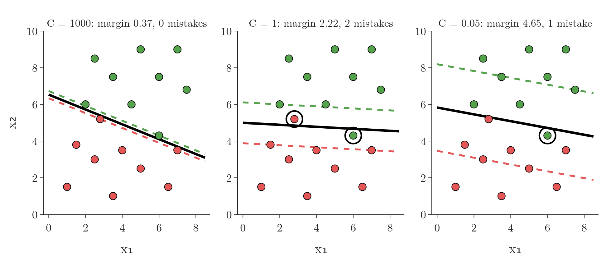

<!-- where-this-fits: generated by course_map/build_map.py; edit concepts.yaml, not this block -->
> **Where this fits:** Pipeline map step 8 (Model). See the [Course map](../01-course-map/note.md).
>
> 
>
> - **Builds on:** Classification problems ([Note 3](../03-types-of-ml/note.md)); Dot product ([Note 48](../48-pca-step-by-step/note.md)); Regularisation ([Note 63](../63-ridge-regression-intuition/note.md)); Equation of a hyperplane ([Note 70](../70-perceptron-trick/note.md)); Perceptron trick ([Note 71](../71-perceptron-code/note.md)).
> - **Compare with:** Log loss (binary cross entropy) ([Note 73](../73-log-loss/note.md)); Logistic regression ([Note 75](../75-logistic-gradient-descent/note.md)); Perceptron loss ([Note 1006](../1006-perceptron-loss/note.md)).
<!-- /where-this-fits -->

## 1. Overview

> **Key point:** Soft-margin SVM lets some points break the rules, but charges for it. Its loss adds a margin error and C times a classification error; C sets the balance.

The hard-margin SVM of the [SVM maths Note](../93-svm-maths/note.md) needs data that a hyperplane separates perfectly. Real data almost never is. The **soft-margin SVM** fixes this by giving every point a little room to be wrong, and adding the cost of that room to the loss (Figure 1).

{width=90%}

## 2. Why the hard margin is not enough

> **Key point:** The hard-margin constraints allow no exceptions, so a single point on the wrong side leaves the problem without a solution.

The hard-margin SVM solves:

$$\underset{w,\,b}{\arg\max}\ \frac{2}{\lVert w \rVert} \qquad \text{such that} \qquad y_i\,(w^T x_i + b) \geq 1 \ \text{ for all } i$$

The constraint says that every green point lies on or above $\pi^+$ and every red point on or below $\pi^-$. A green point below $\pi^+$ breaks it: its label is $+1$ but $w^T x_i + b$ is less than 1, so the product is less than 1. A red point above $\pi^-$ breaks it the same way, with $y_i = -1$ and $w^T x_i + b > -1$.

This is a constrained optimisation problem with $n$ constraints, one per point. It assumes that **no** point ever lies inside the margin or on the wrong side. Real datasets are at best almost linearly separable: a few points, often outliers, sit on the wrong side. With such data the constraints cannot all be met (Figure 6 of the SVM maths Note), so the formulation fails in most real situations.

We need a version that leaves some space for outliers. That version is the soft-margin SVM.

## 3. From maximising to minimising

> **Key point:** Maximising 2/$\lVert w \rVert$ is the same as minimising $\lVert w \rVert$/2. The minimising form is easier to extend.

Before changing anything, we rewrite the hard-margin problem. Maximising a positive function $f$ gives the same answer as minimising $1/f$: a quantity is largest exactly where its inverse is smallest. So:

$$\underset{w,\,b}{\arg\max}\ \frac{2}{\lVert w \rVert} \quad = \quad \underset{w,\,b}{\arg\min}\ \frac{\lVert w \rVert}{2}$$

With numbers, for the best line of the SVM intuition Note, $\lVert w \rVert = 0.899$: the margin $2/0.899 = 2.22$ is as large as possible exactly when $0.899/2 = 0.45$ is as small as possible. This is still the hard-margin SVM; only the form has changed, because a minimisation is easier to add terms to.

> **Extra:** In practice, and in scikit-learn, the term is written $\tfrac{1}{2}\lVert w \rVert^2$ instead of $\lVert w \rVert / 2$. Squaring does not change which $w$ is smallest, and the squared form is smooth (it has no kink at $w = 0$) and is exactly the L2 penalty of [Ridge regression](../63-ridge-regression-intuition/note.md).

## 4. Slack: how far a point breaks the rules

> **Key point:** Each point gets a slack $\xi_i$. It is 0 for a point on the correct side of its own hyperplane, and grows with how far the point sits on the wrong side of it.

### 4.1 The new term

> **Key point:** Add $\sum \xi_i$ to the loss: the total amount by which the points break their constraints.

To make the SVM soft, we add one more term to the minimisation:

$$\underset{w,\,b}{\arg\min}\ \frac{\lVert w \rVert}{2} + \sum_{i=1}^{n} \xi_i$$

The Greek letter $\xi$ is "xi" (some texts use $\zeta$, "zeta"). Each training point $i$ gets its own value $\xi_i$, called its **slack**. The algorithm now looks for the $w$ and $b$ that make **both** terms small.

### 4.2 What ξ measures

> **Key point:** During training, green points are judged against π+ and red points against π−, not against π.

During training, each class is judged against its **own** hyperplane: green points against $\pi^+$, red points against $\pi^-$. (The middle line $\pi$ is only used later, to classify new points.)

- A green point on or above $\pi^+$, or a red point on or below $\pi^-$, is fine: $\xi_i = 0$.
- A green point below $\pi^+$, or a red point above $\pi^-$, is an error point. Its $\xi_i$ is its distance from its own hyperplane, measured in the wrong direction.

So an error point may be inside the margin but still on the correct side of $\pi$, or right across $\pi$ on the wrong side. The further it is from where it should be, the larger its $\xi_i$.

Figure 2 shows the two error points of a soft-margin SVM. The green point $(6, 4.3)$ lies below $\pi^+$, even below $\pi$: $\xi = 1.33$. The red point $(2.8, 5.2)$ lies above $\pi^-$ and above $\pi$: $\xi = 1.32$. Every other point has $\xi = 0$.

{height=45%}

Minimising $\sum \xi_i$ therefore means minimising these distances: keeping the errors few and small.

> **Extra:** Precisely, the slack is $\xi_i = \max\bigl(0,\ 1 - y_i (w^T x_i + b)\bigr)$, and the hard constraint is loosened to $y_i (w^T x_i + b) \geq 1 - \xi_i$ with $\xi_i \geq 0$. This $\xi_i$ is measured in the units of the margin, where the distance from $\pi$ to $\pi^+$ counts as 1. The distance in the plot is $\xi_i / \lVert w \rVert$: for the green point, $1.33 / 0.899 = 1.48$. A point with $0 < \xi_i \leq 1$ is inside the margin but still correctly classified; $\xi_i > 1$ means it is on the wrong side of $\pi$.

## 5. The soft-margin loss

> **Key point:** Loss = margin error + C × classification error. The first term wants a wide margin, the second wants few and small mistakes.

The two terms pull in different directions:

- $\lVert w \rVert / 2$ is the **margin error**. It equals $1/d$, so it falls as the margin widens: a wide margin gives a small margin error.
- $\sum \xi_i$ is the **classification error**. It falls as the error points move back to their own side.

The last step is a weight on the classification error, a positive number $C$. In words: find the line that balances a wide margin against small errors, with $C$ deciding how much the errors count. As a formula, the soft-margin SVM solves:

$$\underset{w,\,b}{\arg\min}\ \underbrace{\frac{\lVert w \rVert}{2}}_{\text{margin error}} + C \underbrace{\sum_{i=1}^{n} \xi_i}_{\text{classification error}}$$

With numbers, for the line of Figure 2 with $C = 1$: $\lVert w \rVert / 2 = 0.899 / 2 = 0.45$ and $\sum \xi_i = 1.33 + 1.32 = 2.65$, so the loss is $0.45 + 1 \times 2.65 = 3.10$. The same mistakes with $C = 10$ would cost $0.45 + 26.5 = 26.95$, which is why a larger C pushes the line to fix them.

## 6. The hyperparameter C

> **Key point:** Large C: avoid mistakes, accept a narrow margin. Small C: keep the margin wide, accept some mistakes. Tune C with cross-validation.

$C$ is a [hyperparameter](../29-pipelines/note.md): a tuning knob we set before training. It can be any positive number.

- **Large C** (say 1,000 or 10,000): the classification error dominates. The algorithm stops caring about the width of the margin and concentrates on misclassifying no point.
- **Small C** (say 0.1, 0.01 or 0.001): the margin error dominates. The algorithm keeps the margin wide even if some points end up misclassified.

Figure 3 shows the same data with three values of C. With $C = 1000$ the margin is only 0.37 wide, but no point is misclassified. With $C = 1$ it is 2.22 wide with two mistakes; with $C = 0.05$ it is 4.65 wide.

{height=36%}

Neither extreme is right in general. A model with no training mistakes and a thin margin may be fitting outliers; a model with a very wide margin may ignore real structure. So we pick C for each dataset with cross-validation, usually through a grid search over values such as 0.001, 0.01, ..., 1,000.

> **Python:** In scikit-learn, `C` is an argument of `SVC`; its default is 1.
>
> ```python
> from sklearn.svm import SVC
> from sklearn.model_selection import GridSearchCV
>
> svm = SVC(kernel="linear", C=1)     # soft margin, C = 1
> svm.fit(X, y)
>
> # choose C by 5-fold cross-validation
> grid = GridSearchCV(SVC(kernel="linear"),
>                     {"C": [0.001, 0.01, 0.1, 1, 10, 100, 1000]}, cv=5)
> grid.fit(X, y)
> grid.best_params_
> ```

## 7. Comparison with logistic regression

> **Key point:** Both are "loss + regularisation". SVM uses the hinge loss where logistic regression uses the log loss, and in both, C is the inverse of the regularisation strength λ.

The soft-margin loss has the same shape as the loss of regularised logistic regression:

| | Error on the data | Regularisation | Strength |
|---|---|---|---|
| Logistic regression | [log loss](../73-log-loss/note.md) | $\lambda \lVert w \rVert^2$ (L2) | $\lambda$ on the penalty |
| Soft-margin SVM | $\sum \xi_i$: the **hinge loss** | $\lVert w \rVert / 2$ | $C$ on the error |

- The margin term $\lVert w \rVert / 2$ plays the role of the **regularisation** term: it keeps $w$ small, which here means a wide margin.
- The error term $\sum \xi_i$ is called the **hinge loss**, the SVM's counterpart of the log loss.
- $C$ multiplies the error instead of the penalty, so it works the other way round: $C$ is inversely proportional to $\lambda$. A large C means weak regularisation; a small C means strong regularisation.

This is also why scikit-learn's `LogisticRegression` has a `C` and no $\lambda$ (see the [logistic regression hyperparameters Note](../81-logistic-hyperparameters/note.md)). The convention comes from SVM: a larger C means less regularisation in both.

> **Extra:** Written with $z = y_i(w^T x_i + b)$, the hinge loss of one point is $\max(0, 1 - z)$ and the log loss is $\log(1 + e^{-z})$ (the same log loss as before, with labels $\pm 1$). Figure 4 compares them. The hinge loss is exactly 0 for every point beyond its own hyperplane ($z \geq 1$), so those points do not affect the line at all; only points on or inside the margin matter, which is why SVM depends only on its support vectors. The log loss never quite reaches 0, so every point keeps pulling a little.
>
> {height=32%}

## 8. Why "soft margin"

> **Key point:** The margin is "soft" because points may enter it or cross it, at a price.

The hard-margin SVM forbids any point inside the margin. The soft-margin SVM relaxes that rule: it allows some errors, as long as it pays for them through $C \sum \xi_i$. Because the criterion is softened, this formulation is called the **soft-margin SVM**. It is the version scikit-learn's `SVC` uses.

## 9. Summary

| | Hard-margin SVM | Soft-margin SVM |
|---|---|---|
| Objective | $\min \lVert w \rVert / 2$ | $\min \lVert w \rVert / 2 + C \sum \xi_i$ |
| Points inside the margin or misclassified | not allowed | allowed, at a cost $\xi_i$ |
| Works on | perfectly separable data | almost separable data with outliers |
| Knob | none | C |

- $\arg\max 2/\lVert w \rVert$ equals $\arg\min \lVert w \rVert / 2$.
- Slack $\xi_i$: 0 on the correct side of a point's own hyperplane, otherwise its distance from that hyperplane.
- Loss = margin error + C × classification error (hinge loss).
- Large C: narrow margin, few mistakes. Small C: wide margin, more mistakes. Tune C by cross-validation.
- C plays the role of $1/\lambda$, as in `LogisticRegression`.

## 10. Key terms

| Term | Meaning |
|---|---|
| Soft-margin SVM | The SVM that allows points inside the margin or on the wrong side, at a cost controlled by C |
| Slack (ξ) | How far a training point lies on the wrong side of its own hyperplane; 0 if it is on the correct side |
| Margin error | The term $\lVert w \rVert$/2 of the SVM loss; small when the margin is wide |
| Classification error (SVM) | The term $\sum \xi_i$ of the SVM loss: the total slack of all points |
| Hinge loss | $\max(0, 1 - y(w^T x + b))$ per point: the error term of the soft-margin SVM |
| C (SVM) | The weight on the classification error; a large C means few mistakes and a narrow margin, a small C a wide margin |
