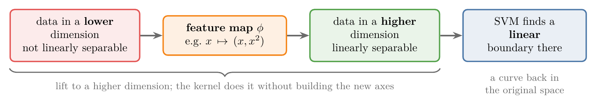

<!-- where-this-fits: generated by course_map/build_map.py; edit concepts.yaml, not this block -->
> **Where this fits:** Pipeline map step 8 (Model). See the [Course map](../01-course-map/note.md).
>
> 
>
> - **Compare with:** Polynomial features ([Note 80](../80-polynomial-logistic-regression/note.md)).
<!-- /where-this-fits -->

## 1. Overview

> **Key point:** When the classes cannot be split by a straight line, a kernel function moves the data into a higher dimension where they can. A linear SVM there gives a curved boundary back in the original space.

One of SVM's main strengths, listed in the [SVM intuition Note](../92-svm-intuition/note.md), is that it also works on non-linear data. The tool that makes this possible is the **kernel trick** (G-1008). Figure 1 shows the idea in four steps.

{width=100%}

An everyday picture: blue marbles sit in the middle of a tablecloth and red marbles around them. No ruler laid flat on the table can fence off the blue ones. Now push the middle of the cloth up from below. The blue marbles rise, the red ones stay low, and a flat tray held level slides between the two colours. A kernel does the same: it adds a height so that a flat cut works.

The mathematics behind it is involved. This Note gives the intuition with two pictures; the next Note runs it in code.

## 2. Data that no straight line can split

> **Key point:** In 1D, a straight boundary is a single point. Circles on both ends and crosses in the middle cannot be split by one point.

Take a dataset with only one **feature** (G-772; an input variable, one column of the data table), so every **observation** (G-1374; one record, one row of the table) is a point on one axis (Figure 2, left). There are two classes: crosses in the middle and circles on both sides.

In 1D a linear boundary is a single point: everything left of it is one class, everything right of it the other. No single point can put all the crosses on one side and all the circles on the other. Data like this is **not linearly separable** (**non-linear data**, G-1335): no straight boundary splits the classes, so a linear SVM cannot classify it.

## 3. The kernel trick

> **Key point:** Apply a function that adds a new dimension, chosen so the classes become linearly separable there. The function is the kernel; applying it is the kernel transformation.

### 3.1 Lifting 1D data into 2D

> **Key point:** Add x² as a second axis. The circles go high, the crosses stay low, and a horizontal line splits them.

The trick is to apply a mathematical function that turns the lower-dimensional **feature space** (the space whose axes are the features) into a higher-dimensional one, in such a way that the data becomes linearly separable. For the 1D data, the function $x \mapsto (x, x^2)$ does it (Figure 2, right).

{height=33%}

Each point keeps its $x$ and gets a height $x^2$:

- the crosses lie near 0, so their $x^2$ is small (at most $1.3^2 = 1.69$);
- the circles lie far from 0, so their $x^2$ is large (at least $2.1^2 = 4.41$).

In 2D the boundary is a line, and the horizontal line $x^2 = 3$ now separates the two classes. Read back on the original axis, this line corresponds to two cut points, $x = -1.73$ and $x = +1.73$: a boundary that no single linear cut could give. Adding $x^2$ as a new input is the same idea as the [polynomial features](../80-polynomial-logistic-regression/note.md) used with logistic regression.

### 3.2 Kernels and the kernel transformation

> **Key point:** The function is called a kernel. The common ones are the RBF, polynomial and sigmoid kernels.

In this Note, a **kernel** (G-1004) is the function that maps the data into the higher-dimensional space, and applying it to the data is the **kernel transformation** (G-1007). (This is a different meaning from the Jupyter kernel of the [setup Note](../12-setup-anaconda-jupyter-colab/note.md), the Python process behind a notebook.)

There are many kernels. Besides the plain linear one, scikit-learn's SVM comes with three:

1. **RBF** (G-1639; radial basis function): the most important one, used in Section 4.
2. **Polynomial** (G-1514): built from powers of the inputs. The $x^2$ example above is of this type.
3. **Sigmoid** (G-1799): an S-shaped kernel.

> **Extra:** The sigmoid kernel is $\tanh(\gamma\thinspace x \cdot x' + r)$. The sigmoid kernel has the same S-shape as the [sigmoid function](../72-sigmoid-function/note.md) of logistic regression, but it is a different formula (tanh, ranging from −1 to 1), and it does not turn SVM into logistic regression. The sigmoid kernel came to SVMs from neural networks, where tanh is a common activation, and in general it does no better than RBF (Lin and Lin 2003).

## 4. A 2D example: concentric circles

> **Key point:** One class in the centre, the other in a ring around it. The RBF function $e^{-r^2}$ lifts the centre points up, and a flat plane then separates them.

Now take 2D data with two classes arranged as concentric circles: green points in the centre, red points in a ring around them (Figure 3, first frame). No straight line can separate a disc from the ring around it.

We apply a function of the form $e^{-x^2}$. The graph of $e^{-x^2}$ is a bump: highest at 0 and falling towards 0 on both sides. In 2D we use the distance from the centre, $r^2 = x_1^2 + x_2^2$, and give every point a third coordinate:

$$z = e^{-(x_1^2 + x_2^2)}$$

The data is first centred so that the bump sits in the middle of the inner class.

- A green point near the centre, say $(0.3, 0.2)$: $r^2 = 0.13$ and $z = e^{-0.13} = 0.88$, high up.
- A red point on the ring, say $(1.5, 0.6)$: $r^2 = 2.61$ and $z = e^{-2.61} = 0.07$, near the floor.

So the green points rise and the red points stay low. In 3D a flat plane between the two heights separates them (Figure 3).

{height=55%}

This function is an example of the RBF kernel, short for radial basis function: "radial" because it depends only on the distance from a centre. Back in the original 2D plane, the flat plane corresponds to a circle around the centre: the curved boundary we needed.

## 5. The kernel trick in SVM

> **Key point:** Kernels are built into SVM. We choose the kernel and its settings as hyperparameters and tune them with grid search.

The kernel trick is built into the SVM algorithm. We do not write the transformation ourselves: we choose a kernel, and SVM handles the rest. The kernel and its settings are **hyperparameters** (G-910), so we choose them like C in the [soft-margin Note](../94-svm-soft-margin/note.md): with a grid search and cross-validation.

In summary: if the data is not linearly separable in its own dimension, a kernel function performs a kernel transformation that makes it linearly separable in a higher-dimensional feature space. These two steps are the whole idea behind the kernel trick.

Figure 4 shows the second half of that sentence on the 34 points of Figure 3. On the left, every point is placed by its distance from the centre and its new height $z$; the flat cut is the horizontal line at $z = 0.37$, halfway between the lowest green point and the highest red one. On the right, the same cut drawn in the original plane: every point at height 0.37 lies at distance 0.99 from the centre, so the straight cut becomes a circle, with all green points inside and all red points outside.

> **Extra:** Why is it called a "trick"? SVM never actually builds the new features. Its training only needs dot products between pairs of points, and a kernel gives the dot product in the higher-dimensional space directly from the original coordinates. The next Note shows this in code; for RBF the higher-dimensional space is even infinite, so building it explicitly would be impossible (MML §12.4).

## 6. Summary

| Data | Kernel function | New space | Boundary there | Boundary back in the original space |
|---|---|---|---|---|
| 1D: crosses in the middle | $x \mapsto (x, x^2)$ (polynomial) | 2D | the line $x^2 = 3$ | two cut points, $x = \pm 1.73$ |
| 2D: concentric circles | $z = e^{-(x_1^2 + x_2^2)}$ (RBF) | 3D | a flat plane | a circle |

- Non-linear data: no straight line, plane or hyperplane separates the classes.
- Kernel trick: map the data to a higher dimension where it becomes linearly separable, then use a linear SVM there.
- The map is the kernel; applying it is the kernel transformation.
- Common kernels: RBF (most used), polynomial, sigmoid. The kernel is a hyperparameter of SVM.

## 7. Sources

**Built from**

- CampusX, "Kernel Trick in SVM | Geometric Intuition", YouTube, https://www.youtube.com/watch?v=egxjT0p7_K8

**Other references**

- **Lin and Lin 2003:** H.-T. Lin and C.-J. Lin, *A Study on Sigmoid Kernels for SVM and the Training of non-PSD Kernels by SMO-type Methods*, National Taiwan University, 2003. csie.ntu.edu.tw/~cjlin/papers/tanh.pdf
- **MML:** M. P. Deisenroth, A. A. Faisal and C. S. Ong, *Mathematics for Machine Learning*, Cambridge University Press, 2020. Section 12.4, Kernels.

## 8. Key terms

| Term | Meaning |
|---|---|
| Feature space | The space whose axes are the features; a kernel maps the data into a higher-dimensional one |
| Kernel trick | Making non-linear data separable by mapping it to a higher dimension, without building the new features |
| Kernel (SVM) | The function that maps the data to the higher-dimensional space (not the Jupyter kernel) |
| Kernel transformation | Applying a kernel to the data |
| Non-linear data | Data whose classes no straight line, plane or hyperplane can separate |
| RBF kernel | Radial basis function kernel, built on $e^{-(\text{distance})^2}$; the most used SVM kernel |
| Polynomial kernel | A kernel built from powers of the inputs, such as $x^2$ |
| Sigmoid kernel | The S-shaped kernel $\tanh(\gamma\thinspace x \cdot x' + r)$ |
