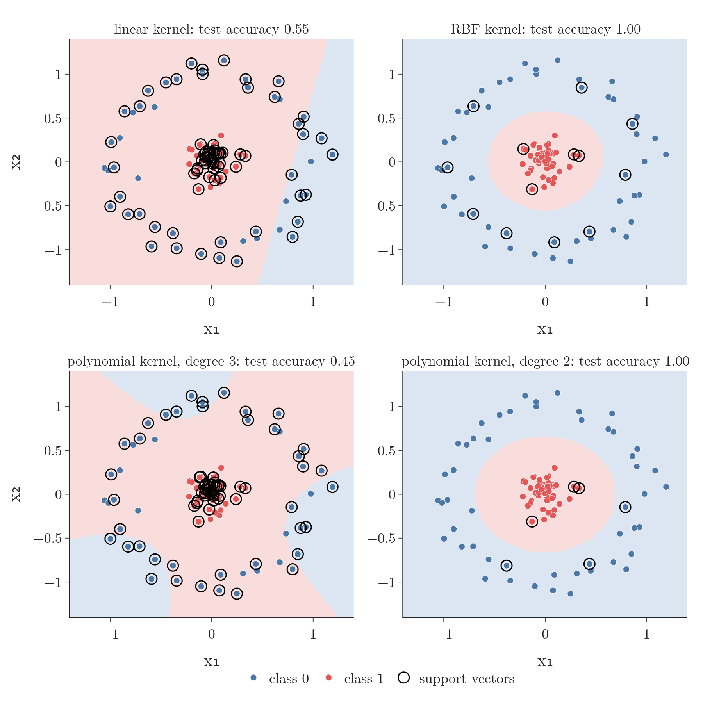
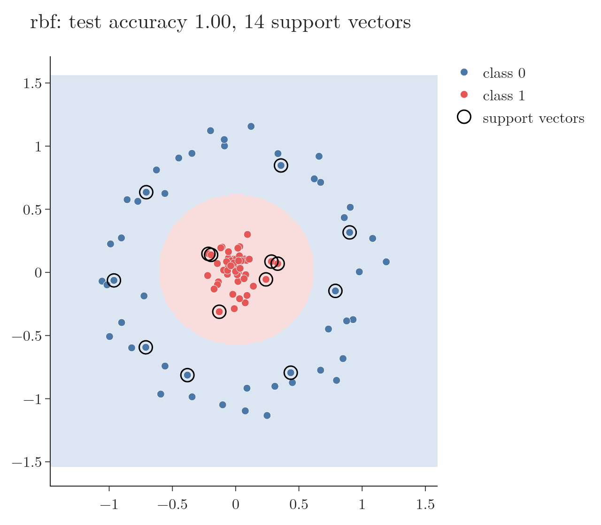

<!-- where-this-fits: generated by course_map/build_map.py; edit concepts.yaml, not this block -->
> **Where this fits:** Pipeline map step 8 (Model). See the [Course map](../01-course-map/note.md).
>
> 
>
> - **Compare with:** Polynomial features ([Note 80](../80-polynomial-logistic-regression/note.md)).
<!-- /where-this-fits -->

## 1. Overview

> **Key point:** On data shaped as two circles, a linear SVM scores 55%. Switching the kernel to RBF, or to a degree-2 polynomial, scores 100%, using the same two input columns.

The [kernel trick intuition Note](../95-kernel-trick-intuition/note.md) showed in pictures how a kernel lifts data into a higher dimension. This Note runs it in scikit-learn on a real non-linear dataset, then looks at why no new columns are needed. Figure 1 shows the four models we train.

{height=58%}

All the code is in the Notebook of this Note (`notebook.ipynb`).

## 2. The data: two circles

> **Key point:** make_circles generates 100 points: one class in a small inner circle, the other in a ring around it.

scikit-learn's sample generators create toy datasets. `make_circles` makes two concentric circles of points: 100 points, 50 per class, with two columns, the x and y coordinates. Class 1 (red) sits in the centre and class 0 (blue) in a ring around it.

> **Python:** Generating the data.
>
> ```python
> from sklearn.datasets import make_circles
>
> # factor: inner radius as a share of the outer one
> X, y = make_circles(n_samples=100, factor=0.1,
>                     noise=0.1, random_state=5)
> X.shape        # (100, 2): x and y coordinates
> ```

Wherever we draw a straight line through this data, it cuts the ring in two, so no line can be a good classifier.

## 3. A linear SVM fails

> **Key point:** SVC(kernel="linear") reaches only 55% test accuracy: a straight boundary cannot separate a disc from a ring.

We split the data into training and test sets, train an SVM with a linear kernel, and measure accuracy on the test set.

> **Python:** Training a linear SVM.
>
> ```python
> from sklearn.model_selection import train_test_split
> from sklearn.svm import SVC
> from sklearn.metrics import accuracy_score
>
> X_train, X_test, y_train, y_test = train_test_split(
>     X, y, test_size=0.2, random_state=0)
>
> linear = SVC(kernel="linear")
> linear.fit(X_train, y_train)
> accuracy_score(y_test, linear.predict(X_test))   # 0.55
> ```

The accuracy is 0.55, little better than guessing, which was bound to happen with a linear classifier on non-linear data. To see the boundary, a helper function predicts a fine grid of points and colours each by its prediction: these are the model's [decision regions](../79-softmax-regression/note.md). Figure 1, top left, shows the result: one straight cut that leaves many blue ring points on the red side.

## 4. Lifting the data into 3D by hand

> **Key point:** Put each coordinate through exp(−x²) and add the results as a height z. The centre points rise to about 2, the ring stays below about 1.6, and a flat plane separates them.

### 4.1 The transformation

> **Key point:** $z = e^{-x_1^2} + e^{-x_2^2}$: large near the centre, small far from it.

The [kernel trick intuition Note](../95-kernel-trick-intuition/note.md), section 4, lifts these circles with $z = e^{-(x_1^2 + x_2^2)}$, so the centre rises and a flat plane splits the classes. In code we use a per-coordinate variant: the bump $e^{-x^2}$ applied to each coordinate, then added.

$$z = e^{-x_1^2} + e^{-x_2^2}$$

It behaves the same way: points near the centre, where both coordinates are small, get the largest $z$.

- A centre point, $(0.1, 0.05)$: $z = e^{-0.01} + e^{-0.0025} = 0.990 + 0.998 = 1.99$.
- A ring point, $(1, 0)$: $z = e^{-1} + e^{0} = 0.368 + 1 = 1.37$.

On the whole dataset, the centre points get $z$ between 1.89 and 2.00, and the ring points between 1.01 and 1.56. So a flat plane at $z = 1.75$ separates them, and a linear classifier now works.

> **Python:** The transformation and the 3D plot.
>
> ```python
> import numpy as np
> import plotly.graph_objects as go
>
> X_new = np.exp(-(X ** 2))     # exp(-x^2) for each coordinate
> z = X_new.sum(axis=1)         # add the two columns: the height
> go.Figure(go.Scatter3d(x=X[:, 0], y=X[:, 1], z=z,
>                        mode="markers")).show()
> ```

### 4.2 Where to centre the bump

> **Key point:** The bump only works if it is centred on the right class. Without knowing the centre, we would need one bump per point, which is expensive.

This worked because the bump $e^{-x^2}$ is centred at 0, exactly where the inner class sits. If the inner class were centred at 5, we would need $e^{-(x - 5)^2}$ instead. In higher dimensions we cannot look at the data and see where the centre is.

So SVM in effect tries a bump centred on each data point and keeps the combination that separates the classes best. Doing this transformation explicitly would be very expensive as the data grows. The point of the kernel trick is that SVM never has to build these new columns at all (Section 7).

> **Extra:** The function used here, $e^{-x_1^2} + e^{-x_2^2}$, treats each coordinate separately; it is a convenient choice for the picture. The RBF kernel that SVM uses compares two points through their distance: $K(a, b) = e^{-\gamma \lVert a - b \rVert^2}$. Its decision function is a weighted sum of such bumps, one centred on each support vector: $\sum_{i \in SV} y_i \alpha_i K(x_i, x) + b$ (sklearn UG §1.4.7).

## 5. The RBF kernel

> **Key point:** SVC(kernel="rbf") reaches 100% test accuracy, with the same two columns and no feature engineering.

Now we let SVM do it. We train a new SVC with `kernel="rbf"` instead of `"linear"` and change nothing else.

> **Python:** The RBF kernel.
>
> ```python
> rbf = SVC(kernel="rbf")     # "rbf" is also the default
> rbf.fit(X_train, y_train)
> accuracy_score(y_test, rbf.predict(X_test))   # 1.0
> ```

The test accuracy is 1.0. Figure 1, top right, shows its boundary: a closed curve around the centre class.

We did not create any extra feature: only the original two columns went into the model, and the kernel did the calculation internally. Compare this with [polynomial regression](../61-polynomial-regression/note.md), where we had to add a new column for every power of the inputs.

## 6. The polynomial kernel

> **Key point:** kernel="poly" uses degree 3 by default and scores 45% here. With degree=2 it scores 100%. The degree is a hyperparameter.

The polynomial kernel is chosen with `kernel="poly"`. It has an extra setting, `degree`, the degree of the polynomial. Its default is 3, and it is ignored by all other kernels.

| Kernel | Test accuracy | Support vectors (of 80) |
|---|---|---|
| linear | 0.55 | 76 |
| RBF | 1.00 | 13 |
| polynomial, degree 3 | 0.45 | 74 |
| polynomial, degree 2 | 1.00 | 6 |

With the default degree 3, the accuracy is even worse than linear: 0.45, with the odd-shaped boundary of Figure 1, bottom left. With `degree=2` it jumps to 1.0 (bottom right). The degree must therefore be tuned like any hyperparameter, for example with a grid search and cross-validation.

> **Python:** Changing the degree.
>
> ```python
> for degree in [3, 2]:
>     poly = SVC(kernel="poly", degree=degree)
>     poly.fit(X_train, y_train)
>     print(degree, accuracy_score(y_test,
>                                  poly.predict(X_test)))
> # 3 0.45
> # 2 1.0
> ```

> **Extra:** Why does degree 2 work and degree 3 fail? scikit-learn's polynomial kernel is $(\gamma\, a \cdot b + r)^d$ with $r$ (`coef0`) equal to 0 by default (sklearn UG §1.4.6). With $r = 0$, the degree-3 kernel contains only terms of degree exactly 3, such as $x_1^3$ and $x_1^2 x_2$. A circle needs $x_1^2 + x_2^2$, a degree-2 term, which the degree-3 kernel cannot produce. The degree-2 kernel contains exactly $x_1^2$, $x_1 x_2$ and $x_2^2$. Setting `coef0=1` with degree 3 adds the lower-degree terms back, and in the Notebook this model also scores 1.00 on the circles.

The table also shows the support vectors. The linear model needs almost every training point; the good kernels need only a few. The reason: every point that sits on the margin, inside it or on the wrong side of the boundary becomes a support vector (ESL §12.2.1). A straight line fits the circles badly, so most points end up inside its margin; a curved boundary that fits well leaves only a few points near it.

> **Extra:** The Notebook checks the margin rule for the linear model. The linear model misclassifies 30 of the 80 training points, and exactly 76 points have $y \cdot f(x) < 1$ (inside the margin or on the wrong side): the same 76 as its support vectors.

## 7. Why it is a trick

> **Key point:** A kernel gives the dot product of two points in the higher-dimensional space directly from the original coordinates, so the new columns are never built.

SVM's training and predictions only need **dot products** between pairs of points (MML §12.4). A kernel is a function $K(a, b)$ that returns the dot product the two points would have **after** the transformation, without carrying the transformation out. We put the original coordinates into the kernel formula, and out comes the value we need.

As a formula, for the degree-2 polynomial kernel with the explicit features $\phi(x) = (x_1^2,\ \sqrt{2}\,x_1 x_2,\ x_2^2)$:

$$K(a, b) = (a \cdot b)^2 = \phi(a) \cdot \phi(b)$$

With numbers, for $a = (1, 2)$ and $b = (3, 1)$:

- Kernel: $a \cdot b = 3 + 2 = 5$, so $K(a, b) = 5^2 = 25$.
- Explicit features: $\phi(a) = (1,\ 2\sqrt{2},\ 4)$ and $\phi(b) = (9,\ 3\sqrt{2},\ 1)$, so $\phi(a) \cdot \phi(b) = 9 + 12 + 4 = 25$.

The kernel needed one 2D dot product and a square; the explicit route needed three new features per point. With more inputs and higher degrees the explicit features multiply quickly, while the kernel stays one dot product. For the RBF kernel the matching feature space is infinite-dimensional, so building it would be impossible, yet the kernel value is cheap (MML §12.4). This is the trick that made SVM famous.

## 8. An interactive playground

> **Key point:** app.py lets you change the dataset, kernel, C, gamma and degree and watch the decision regions and support vectors update.

The folder of this Note contains `app.py`, a small Dash app. Run `python app.py` and open `http://127.0.0.1:8050`. Figure 2 shows it with its default settings.

{height=42%}

Things to try:

- **linear** on the circles: one straight cut, about 0.55 accuracy, and nearly every point a support vector.
- **poly** with degree 3, then 2: the accuracy jumps from 0.45 to 1.00.
- **C** from 3 down to $-3$ (that is, $10^3$ to $10^{-3}$): small C widens the margin and adds support vectors, as in the [soft-margin Note](../94-svm-soft-margin/note.md).
- **gamma** with the RBF kernel on the moons data: from smooth boundaries at small gamma to tight islands around single points at large gamma.

> **Extra:** `gamma` sets how far the influence of one training point reaches in the RBF kernel $e^{-\gamma \lVert a - b \rVert^2}$. A small gamma makes each bump wide, giving smooth boundaries (risk of underfitting). A large gamma makes each bump narrow, so the boundary wraps around individual points (risk of overfitting). scikit-learn's default, `gamma="scale"`, sets it from the spread of the data: $1 / (\text{n\_features} \times \text{variance of } X)$. C and gamma are usually tuned together with a grid search (sklearn, "RBF SVM parameters").

## 9. Summary

| Model | Code | Test accuracy |
|---|---|---|
| Linear SVM | `SVC(kernel="linear")` | 0.55 |
| RBF kernel | `SVC(kernel="rbf")` | 1.00 |
| Polynomial, degree 3 (default) | `SVC(kernel="poly")` | 0.45 |
| Polynomial, degree 2 | `SVC(kernel="poly", degree=2)` | 1.00 |

- A linear SVM cannot separate circular classes.
- Lifting with $z = e^{-x_1^2} + e^{-x_2^2}$ makes them separable by a plane in 3D.
- With a kernel, SVM gets the same effect from the original two columns: no new features.
- The kernel's settings (degree, gamma) and C are hyperparameters to tune.
- A kernel returns the dot product in the higher-dimensional space directly: that is the trick.

## Sources

- **ESL:** T. Hastie, R. Tibshirani and J. Friedman, *The Elements of Statistical Learning*, 2nd ed., Springer, 2009. Section 12.2.1.
- **MML:** M. P. Deisenroth, A. A. Faisal and C. S. Ong, *Mathematics for Machine Learning*, Cambridge University Press, 2020. Section 12.4, Kernels.
- **sklearn UG:** scikit-learn User Guide, Section 1.4, Support Vector Machines (1.4.6 Kernel functions, 1.4.7 Mathematical formulation), and the `SVC` reference page.
- **sklearn, "RBF SVM parameters":** scikit-learn example gallery, *RBF SVM parameters*.

## 10. Key terms

| Term | Meaning |
|---|---|
| make_circles | A scikit-learn generator of two concentric circles of points, a standard non-linear test dataset |
| Feature map ($\phi$) | The explicit transformation of a point into the higher-dimensional space |
| Kernel function $K(a, b)$ | A function that returns $\phi(a) \cdot \phi(b)$ directly from the original points |
| degree | The degree of SVC's polynomial kernel; default 3 |
| gamma | How far one point's influence reaches in the RBF kernel; large gamma gives tighter boundaries |
