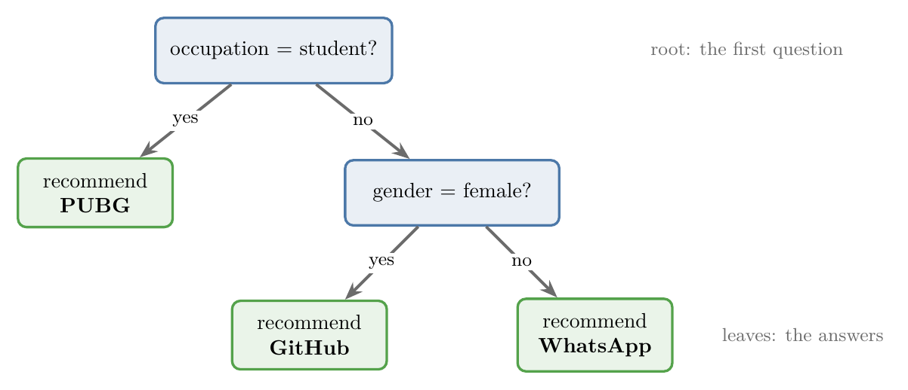
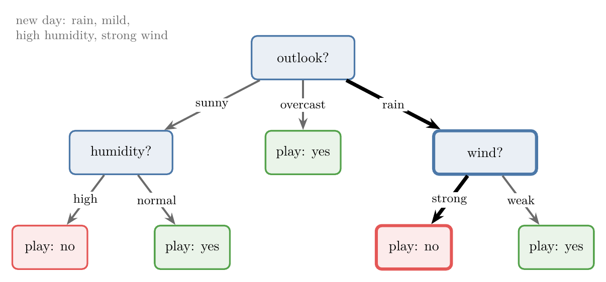
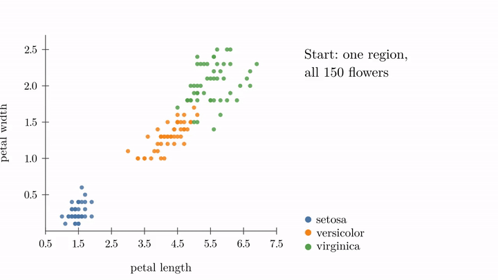
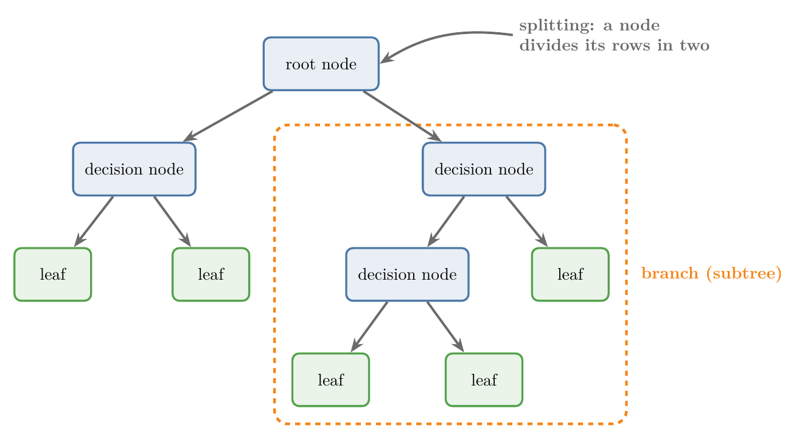
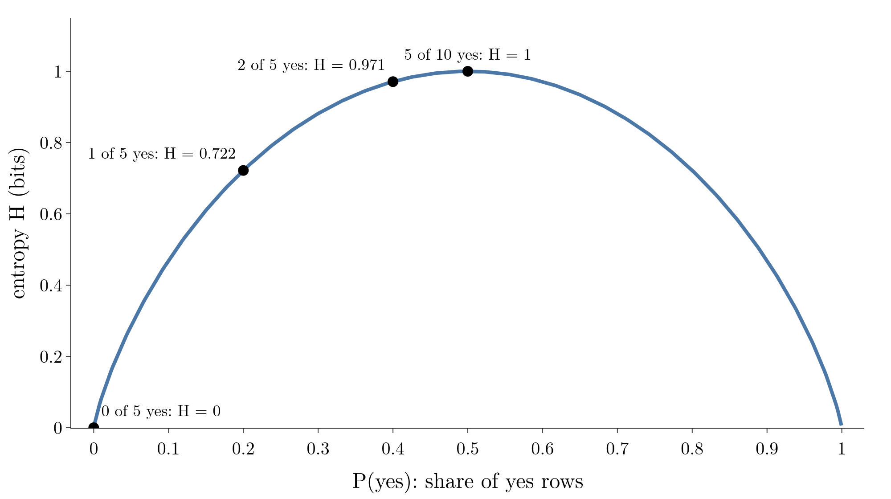
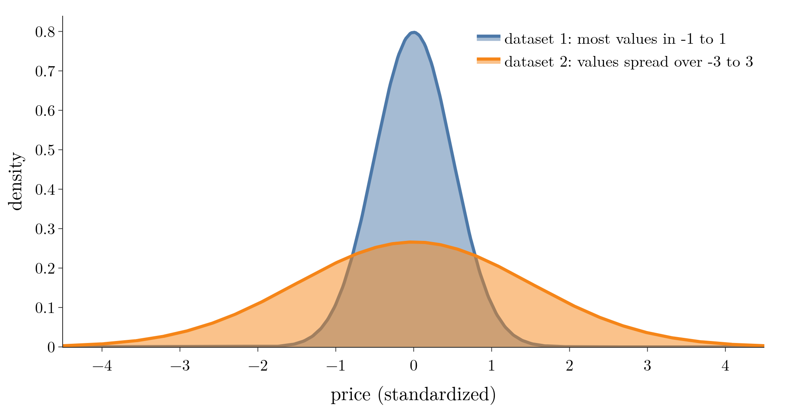
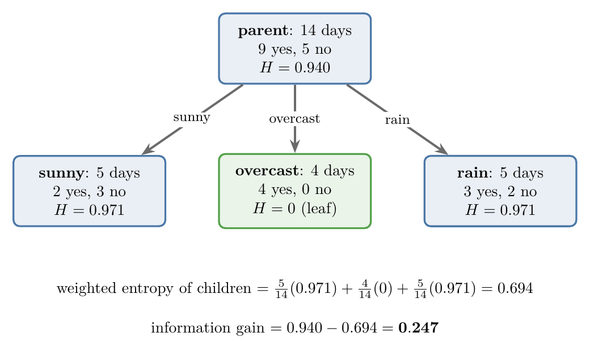
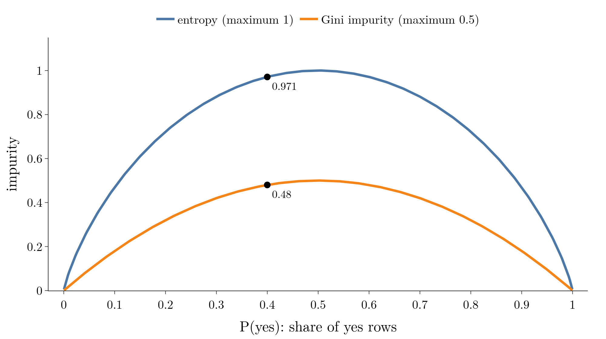
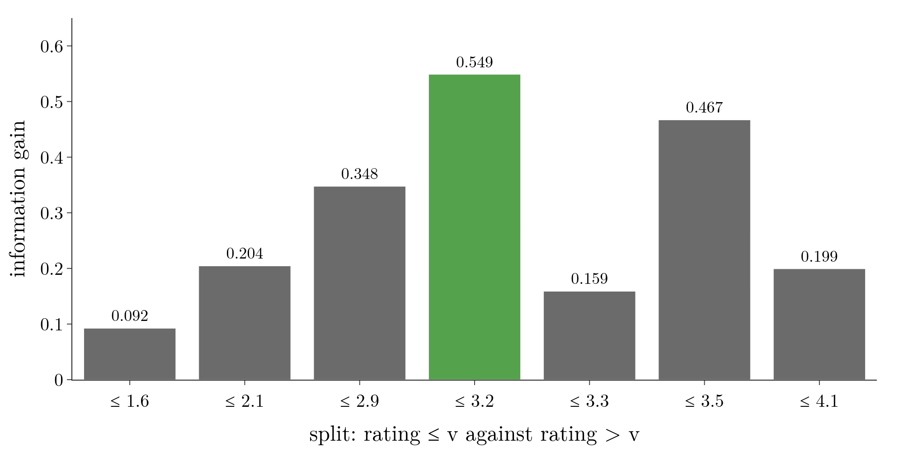

<!-- where-this-fits: generated by course_map/build_map.py; edit concepts.yaml, not this block -->
> **Where this fits:** Pipeline map step 8 (Model). See the [Course map](../01-course-map/note.md).
>
> 
>
> - **Builds on:** Model-based learning ([Note 6](../06-instance-vs-model-based/note.md)); Decision surface and boundary ([Note 91](../91-knn/note.md)).
> - **Leads to:** Feature importance ([Note 99](../99-regression-trees/note.md)); Regression trees ([Note 99](../99-regression-trees/note.md)); Ensemble learning ([Note 101](../101-ensemble-learning/note.md)); Bagging ([Note 105](../105-bagging-intuition/note.md)); Random forest ([Note 108](../108-random-forest-intro/note.md)); AdaBoost ([Note 115](../115-adaboost-intuition/note.md)).
> - **Compare with:** Feature scaling ([Note 24](../24-standardization/note.md)); Log loss (binary cross entropy) ([Note 73](../73-log-loss/note.md)).
<!-- /where-this-fits -->

## 1. Overview

> **Key point:** A decision tree is a set of nested if-else questions learned from data. Each question cuts the data in two (or more) parts, and the tree picks the question that makes the parts as pure as possible.

A **decision tree** predicts by asking a chain of questions about the input **features** (input variables, one column each of the data table), one at a time, until it reaches an answer. Each **observation** (one record, one row of the table) travels down the questions to a prediction of the **target** (the output we predict). Figure 1 shows a tiny one that recommends an app.

{height=30%}

This Note builds the idea in four steps:

- **what** a tree is: nested if-else conditions, drawn as a tree;
- **what it does to the data**: cuts the input space with lines parallel to the axes;
- **how it measures purity**: entropy and Gini impurity;
- **how it chooses each question**: information gain, for categorical and numerical features.

The Notebook (`notebook.ipynb`) computes every number in this Note.

## 2. A decision tree is nested if-else

> **Key point:** If we can write the data's pattern as if-else statements, those statements already are a decision tree.

### 2.1 Recommending an app

> **Key point:** Occupation splits the data first; gender splits what is left.

Suppose an app store recorded, for a few users, their gender, their occupation and the app they downloaded:

| Gender | Occupation | App |
|---|---|---|
| female | student | PUBG |
| male | student | PUBG |
| female | programmer | GitHub |
| male | programmer | WhatsApp |
| male | student | PUBG |
| female | programmer | GitHub |

Two patterns stand out. Every student downloaded PUBG. Among the others, the women downloaded GitHub and the men WhatsApp.

> **Python:** The pattern as code.
>
> ```python
> def recommend(occupation, gender):
>     if occupation == "student":
>         return "PUBG"
>     elif gender == "female":
>         return "GitHub"
>     else:
>         return "WhatsApp"
> ```
>
> `elif` means "else, if": it is only checked when the first condition is false.

Drawing the control flow of this code gives Figure 1. Each question is a box, each answer (yes or no) is an arrow, and the recommendations sit at the ends. The shape is a tree, drawn upside down: the **root** (the first question) at the top and the **leaves** (the answers) at the bottom.

### 2.2 Playing tennis

> **Key point:** A new day travels from the root down one branch; features that the tree never asks about are ignored.

The Play Tennis data (the [Naive Bayes code Note](../89-naive-bayes-code/note.md)) has 14 days, four weather features (outlook, temperature, humidity, wind) and whether tennis was played. Figure 2 shows the decision tree built from it.

{height=30%}

Take a new day: rain, mild temperature, high humidity, strong wind. The root asks about the outlook: rain, so we follow the rain branch. That node asks about the wind: strong, so the answer is **no tennis**. Temperature and humidity were never asked, so their values did not matter.

### 2.3 Numerical features: the iris flowers

> **Key point:** With numbers, a question becomes a threshold: "is petal length at most 2.45?".

Decision trees also work on numerical features. The iris data (the [softmax regression Note](../79-softmax-regression/note.md)) has 150 flowers of three kinds: setosa, versicolor and virginica. Using only the petal length and petal width (in cm), scikit-learn builds this tree with two questions:

1. **Is petal length $\le 2.45$?** Yes: setosa.
2. Otherwise, **is petal width $\le 1.75$?** Yes: versicolor. No: virginica.

The numbers 2.45 and 1.75 are the **splitting criteria** (thresholds). So decision trees handle both categorical and numerical features.

## 3. The geometry: cuts parallel to the axes

> **Key point:** Every question draws a line parallel to one axis. A tree cuts the input space into boxes and gives each box one class.

### 3.1 Splitting the plane step by step

> **Key point:** The first cut splits the whole plane; every later cut splits only the box it belongs to.

Plot the 150 flowers with petal length on the x axis and petal width on the y axis (Figure 3, top left). The question "petal length $\le 2.45$" is the vertical line $x = 2.45$. Everything left of it is setosa (Figure 3, top right).

The second question, "petal width $\le 1.75$", is asked only of the flowers right of the first line. So it draws a horizontal line, $y = 1.75$, only in the right part (Figure 3, bottom left). Below it is versicolor, above it virginica.

A deeper tree keeps going: each new question cuts one existing box in two. Figure 3, bottom right, shows a tree of depth 3 after all its cuts. The animation `images/splitting.gif` plays the whole sequence.

{height=48%}

### 3.2 Lines, planes, hyperplanes

> **Key point:** In 2D the cuts are lines, in 3D planes, in more dimensions hyperplanes; the pieces are rectangles, cuboids and hyper-cuboids.

With 2 input features the cuts are lines and the pieces are rectangles. With 3 features, imagine the points floating in a room: each cut is a flat sheet (a plane) parallel to one wall, and the pieces are cuboids, like rooms. With more features the cuts become **hyperplanes** (the [multiple linear regression Note](../53-multiple-linear-regression/note.md)) and the pieces hyper-cuboids.

The cuts are always parallel to an axis, because each question looks at one feature only. The decision boundary of a tree is therefore made of straight, axis-parallel pieces: a staircase, never a slanted line or a curve.

### 3.3 Two ways to see a decision tree

> **Key point:** In code, a tree is a big nested if-else; in geometry, it is axis-parallel hyperplanes that cut the space into hyper-cuboids.

- **As a programmer:** a decision tree is a large structure of nested if-else conditions. On real data it can be hundreds of conditions deep.
- **Mathematically:** a decision tree uses hyperplanes, each parallel to one axis, to cut the coordinate system into hyper-cuboids, and gives each hyper-cuboid one prediction.

### 3.4 The algorithm in four steps

> **Key point:** Find the best feature, split on it, and repeat on each part until the parts are pure.

1. Start with a dataset of input features and one target (a class for classification, a number for regression).
2. Find the **best feature** to ask about first. That feature becomes the root.
3. **Split** the data on that feature.
4. On each part, find the next best feature and split again, **recursively** (the same steps applied to each part), until every part is pure or another stopping rule is met.

Step 2 is the whole difficulty: what makes one feature "better" than another? Sections 6 to 9 answer it.

## 4. Terminology

> **Key point:** Root node at the top, decision nodes in the middle, leaf nodes at the bottom; any node with everything below it is a branch.

Figure 4 names the parts of a tree. The words are the same as for trees in computer science.

{height=36%}

- **Root node:** the first node, holding all the training observations.
- **Splitting:** dividing a node's observations into parts according to a question.
- **Decision node:** a node in the middle, neither root nor leaf; it asks a question and splits again.
- **Leaf node** (terminal node): a node that is not split; it gives the prediction.
- **Branch** (subtree): a node together with everything below it. A tree is built by building its branches recursively.

The open questions are now precise:

- Which feature becomes the root?
- Which feature does each later decision node use?
- For a numerical feature, which threshold (2.45 rather than 2 or 3)? With hundreds of thousands of observations and hundreds of features, we cannot pick it by eye.

## 5. Strengths, weaknesses and uses

> **Key point:** Trees are easy to read, need little preparation and predict fast; they overfit easily and struggle with imbalanced data.

### 5.1 Advantages

> **Key point:** Intuitive, no scaling needed, fast predictions.

- **Intuitive and easy to explain.** Every prediction can be traced as a short list of questions, so a tree is called a "white box" model, unlike "black box" models such as neural networks (sklearn UG §1.10).
- **Little data preparation.** Each question compares values within one feature only, so the scale of the features does not matter: no standardization or normalization is needed. The [standardization Note](../24-standardization/note.md) (section 8) showed a tree giving the same 87.5% accuracy with and without scaling.
- **Fast predictions.** A prediction follows one path from the root to a leaf and ignores every other branch, so its cost grows only logarithmically with the number of training observations.

> **Extra:** Why "logarithmic"? A tree that halves the data at each question needs about $\log_2 n$ questions to reach a single observation. For $n = 1{,}000{,}000$ observations that is only about 20 questions, because $2^{20} \approx 1{,}000{,}000$. Real trees are rarely perfectly balanced, so this is a best case (sklearn UG §1.10).

### 5.2 Disadvantages

> **Key point:** Overfitting, and bias towards the common class in imbalanced data.

- **Overfitting.** A tree can keep splitting until every leaf holds a handful of observations, memorising noise (overfitting, [Note 7](../07-challenges-in-ml/note.md)). The hyperparameters Note (Note 98) shows how to stop this.
- **Imbalanced data.** When one class is rare, for example 95 "yes" against 5 "no" (imbalanced data, the [accuracy Note](../76-accuracy-confusion-matrix/note.md), section 6), the tree is biased towards the common class, so it helps to balance the data before training (sklearn UG §1.10).

### 5.3 Classification and regression: CART

> **Key point:** Trees are mostly used for classification, but the same idea predicts numbers; hence the name CART.

Decision trees are mostly used for classification problems, but the same logic also works for regression problems (Note 99). These two uses give trees their other name, **CART**: **classification and regression trees**.

### 5.4 A tree in action: Akinator

> **Key point:** A guessing game that narrows down a character with yes/no questions works exactly like a tree.

In the online game Akinator, we think of a character, and the game asks questions such as "Is your character Asian?", "Is your character female?", "Is your character Indian?", "Is your character older than 40?". Each answer removes everyone who does not match: after "Asian: yes", every non-Asian character is gone.

After about a dozen questions only one character fits, and the game names it. Each question is a node, each answer a branch, and the named character is a leaf.

## 6. Entropy

> **Key point:** Entropy measures disorder: how mixed the classes in a set of observations are. All one class: entropy 0. Evenly mixed: entropy at its highest.

### 6.1 Disorder and uncertainty

> **Key point:** More knowledge about a system means less uncertainty, and less uncertainty means less entropy.

**Entropy** is a measure of disorder, which we can also read as a measure of impurity. The idea of entropy comes from physics (thermodynamics) and is also central to information theory.

Water shows the idea. In ice (solid) the molecules are packed tightly and can barely move. In liquid water they move a little, and in vapour they move anywhere. Ice is the most ordered state, so it has the least entropy; vapour has the most.

In data, disorder means uncertainty about the class. If a set of observations is almost all "yes", we can predict a random observation from it confidently: we know a lot, so entropy is low. If it is half "yes" and half "no", we can hardly predict at all: entropy is high.

### 6.2 The formula

> **Key point:** Entropy is minus the sum, over the classes, of each class's share times the log of that share.

1. **In words:** for each class, take its share of the observations ($p_i$), multiply it by $\log_2 p_i$, add these up over all classes, and change the sign.
2. **Formula:**
   $$H = -\sum_{i=1}^{c} p_i \log_2 p_i$$
   For two classes, yes and no:
   $$H = -p_{\text{yes}} \log_2 p_{\text{yes}} - p_{\text{no}} \log_2 p_{\text{no}}$$
3. **Example:** 10 observations, 5 yes and 5 no. Then $p_{\text{yes}} = p_{\text{no}} = 5/10 = 0.5$, and $\log_2 0.5 = -1$, so
   $$H = -0.5 \times (-1) - 0.5 \times (-1) = 1$$

Here $p_i$ is the share of observations in class $i$, the probability of picking that class at random by counting (the [conditional probability Note](../82-conditional-probability/note.md)). Every share is between 0 and 1, so every log is negative (the [log loss Note](../73-log-loss/note.md), section 4), and the minus sign makes entropy positive.

### 6.3 Worked examples

> **Key point:** 2 yes of 5 gives 0.971; 1 yes of 5 gives 0.722; 0 yes of 5 gives 0; three classes 2-3-3 give 1.561.

Two small datasets each have 5 observations, with the features salary and age and the target, purchased (yes or no).

**Dataset 1** has 2 yes and 3 no:

$$H = -\tfrac{2}{5}\log_2\tfrac{2}{5} - \tfrac{3}{5}\log_2\tfrac{3}{5} = 0.529 + 0.442 = 0.971$$

**Dataset 2** has 1 yes and 4 no:

$$H = -\tfrac{1}{5}\log_2\tfrac{1}{5} - \tfrac{4}{5}\log_2\tfrac{4}{5} = 0.464 + 0.258 = 0.722$$

Dataset 2 is less mixed, so its entropy is lower, as expected.

**Dataset 3** has 0 yes and 5 no. Every observation is "no", so we are certain:

$$H = -\tfrac{0}{5}\log_2\tfrac{0}{5} - \tfrac{5}{5}\log_2\tfrac{5}{5} = 0 - 0 = 0$$

> **Extra:** $\log_2 0$ is not defined (it goes to minus infinity). The rule is that $0 \times \log_2 0$ counts as 0, because $p \log_2 p$ shrinks to 0 as $p$ shrinks to 0. In code we simply skip classes with a share of 0.

**More than two classes:** add one term per class. With 8 observations, 2 yes, 3 no and 3 maybe:

$$H = -\tfrac{2}{8}\log_2\tfrac{2}{8} - \tfrac{3}{8}\log_2\tfrac{3}{8} - \tfrac{3}{8}\log_2\tfrac{3}{8} = 0.5 + 0.531 + 0.531 = 1.561$$

### 6.4 Properties of entropy

> **Key point:** For two classes entropy runs from 0 (pure) to 1 (50/50). With more classes the maximum is higher.

- **More uncertainty, more entropy**, and the other way round.
- **Two classes:** the minimum is 0, when all observations are one class; the maximum is 1, when the classes are equal (5 yes and 5 no).
- **More than two classes:** the minimum is still 0, but the maximum is above 1, as the 1.561 above shows.
- **Log base:** base 2 and base $e$ both work. They only rescale every entropy by the same factor, so the order "which set is more mixed" never changes. We use base 2.

> **Extra:** With $c$ equally common classes, entropy reaches its maximum, $\log_2 c$: 1 for two classes, $\log_2 3 = 1.585$ for three. Switching to base $e$ multiplies every value by $\ln 2 = 0.693$; for example 0.971 becomes 0.673.

### 6.5 The entropy curve

> **Key point:** Plotted against the share of yes, two-class entropy is an arch: 0 at both ends, 1 in the middle, symmetric.

Figure 5 plots the two-class entropy against $P(\text{yes})$, with our examples marked.

{height=36%}

- At $P(\text{yes}) = 0$ every observation is "no": we know everything, so entropy is 0.
- At $P(\text{yes}) = 1$ every observation is "yes": entropy is 0 again.
- At $P(\text{yes}) = 0.5$ we know least: entropy is 1, the maximum.

The curve is symmetric because with two classes $P(\text{no}) = 1 - P(\text{yes})$. A share of 0.2 yes means 0.8 no, which is just as mixed as 0.8 yes.

### 6.6 Entropy of a numerical feature

> **Key point:** For a continuous feature, the more peaked the distribution, the lower the entropy; the more spread out, the higher.

Entropy so far needed classes. For a numerical output, such as a price, we can still compare two datasets by their density curves, the KDE (the [univariate analysis Note](../20-univariate-analysis/note.md), section 7). Figure 6 shows two price features.

{height=34%}

The right question is again "where do we know more?". In dataset 1 most values lie between $-1$ and 1, so a random value is easy to guess closely. In dataset 2 they spread over $-3$ to 3. So the more peaked curve, dataset 1, has the lower entropy, and the flatter curve, dataset 2, the higher.

> **Extra:** The continuous version is called **differential entropy**. For a normal distribution with standard deviation $\sigma$ it equals $\tfrac{1}{2}\log_2(2\pi e\sigma^2)$. (Cover and Thomas, Example 8.1.2). For Figure 6, $\sigma = 0.5$ gives 1.05 bits and $\sigma = 1.5$ gives 2.63 bits.

## 7. Information gain

> **Key point:** Information gain is the drop in entropy from a parent node to its children. The tree splits on the feature with the highest gain.

### 7.1 The definition

> **Key point:** Gain = entropy of the parent minus the weighted average entropy of the children.

**Information gain** is the metric used to train decision trees: it measures the quality of a split on one feature. Information gain is the decrease in entropy after the dataset is split on that feature. Building a tree means finding, at each node, the feature with the highest information gain.

1. **In words:** compute the parent's entropy; split; compute each child's entropy; average the children's entropies, weighting each child by its share of the observations; subtract.
2. **Formula:**
   $$\text{IG} = H(\text{parent}) - \sum_{k} \frac{n_k}{n} H(\text{child}_k)$$
   where $n$ is the number of observations in the parent and $n_k$ the number in child $k$.
3. **Example:** the outlook split of Play Tennis, below: $0.940 - 0.694 = 0.247$.

### 7.2 Worked example: splitting Play Tennis on outlook

> **Key point:** Outlook takes the entropy from 0.940 down to 0.694, a gain of 0.247.

**Step 1: entropy of the parent.** The 14 days have 9 yes and 5 no:

$$H(\text{parent}) = -\tfrac{9}{14}\log_2\tfrac{9}{14} - \tfrac{5}{14}\log_2\tfrac{5}{14} = 0.940$$

**Step 2: split and compute each child's entropy.** Grouping by outlook gives three children (Figure 7):

- sunny: 5 days, 2 yes and 3 no, $H = 0.971$;
- overcast: 4 days, all yes, $H = 0$;
- rain: 5 days, 3 yes and 2 no, $H = 0.971$.

{height=32%}

**Step 3: weighted entropy of the children.** Each child counts in proportion to its size:

$$\tfrac{5}{14}(0.971) + \tfrac{4}{14}(0) + \tfrac{5}{14}(0.971) = 0.694$$

**Step 4: information gain.**

$$\text{IG}(\text{outlook}) = 0.940 - 0.694 = 0.247$$

The overcast child has entropy 0: it is pure, so it becomes a **leaf** and is not split any further.

**Step 5: repeat for every feature** and pick the largest gain:

| Feature | Information gain |
|---|---|
| outlook | **0.247** |
| humidity | 0.152 |
| wind | 0.048 |
| temperature | 0.029 |

Outlook wins, so it becomes the root, as in Figure 2.

**Step 6: recurse.** The same steps run on each impure child. Among the sunny days, humidity has a gain of 0.971 (it separates them perfectly); among the rainy days, wind does. These splits give exactly the tree of Figure 2.

### 7.3 Greedy, top-down, recursive

> **Key point:** At each node the tree takes the best split right now and never revisits it.

Decision trees use a **recursive greedy search, top-down**: starting at the root, each node picks the split with the highest gain at that moment, then the same search runs inside each child. Once a node reaches entropy 0 (a leaf), it is not split further.

> **Extra:** "Greedy" means the tree never looks ahead. A split that looks weak now but would enable two excellent splits later is never chosen. Finding the best possible tree is far too slow (the problem is NP-complete), so practical tree algorithms are greedy (sklearn UG §1.10).

## 8. Gini impurity

> **Key point:** Gini impurity, $1 - \sum p_i^2$, measures impurity like entropy does but without logs. Gini is scikit-learn's default.

### 8.1 Why another measure

> **Key point:** scikit-learn's `criterion` defaults to `"gini"`, not `"entropy"`.

In scikit-learn's `DecisionTreeClassifier`, the hyperparameter `criterion` chooses the impurity measure. The default is `"gini"`; `"entropy"` gives the entropy we used above. So we need to know Gini too.

> **Extra:** scikit-learn 1.9 accepts three values: `"gini"`, `"entropy"` and `"log_loss"`. The last two are the same criterion under two names (sklearn UG §1.10.7.1).

### 8.2 The formula

> **Key point:** One minus the sum of the squared class shares.

**Gini impurity** measures, like entropy, how pure the children of a split are; only the formula differs.

1. **In words:** square each class's share, add the squares, and subtract the total from 1.
2. **Formula:**
   $$G = 1 - \sum_{i=1}^{c} p_i^2 \qquad \text{for two classes:} \quad G = 1 - \left(p_{\text{yes}}^2 + p_{\text{no}}^2\right)$$
3. **Example:** dataset 1 (2 yes, 3 no) and dataset 2 (1 yes, 4 no) from section 6.3:
   $$G_1 = 1 - \left(\tfrac{4}{25} + \tfrac{9}{25}\right) = 0.48 \qquad G_2 = 1 - \left(\tfrac{1}{25} + \tfrac{16}{25}\right) = 0.32$$

Dataset 2 is purer, and $0.32 < 0.48$, just as its entropy was lower.

### 8.3 Gini against entropy

> **Key point:** Same shape, same verdicts; Gini peaks at 0.5 instead of 1 and is faster to compute.

Both measures are 0 for a pure node. With $P(\text{yes}) = 1$: entropy is $-1 \log_2 1 = 0$, and Gini is $1 - (1^2 + 0^2) = 0$.

They differ at the maximum. With $P(\text{yes}) = P(\text{no}) = 0.5$, entropy is 1 while Gini is $1 - (0.25 + 0.25) = 0.5$. Figure 8 plots both curves.

{height=34%}

Information gain works the same way with Gini: the parent's Gini minus the weighted Gini of the children. For the outlook split, $0.459 - 0.343 = 0.116$, and outlook again wins against the other three features.

**Which to use?**

- **Gini is faster:** squares are cheaper to compute than logs, which matters on large datasets.
- **Entropy sometimes builds more balanced trees** on some datasets, while Gini may overfit slightly more.
- In practice the two give similar accuracy, but not always the same tree, and neither wins on every dataset (Extra below). So we treat `criterion` as a hyperparameter and try both, as in the [pipelines Note](../29-pipelines/note.md) (section 9).

> **Extra:** The Notebook changes only the criterion on three built-in datasets. The 5-fold cross-validation accuracies differ by at most 0.02 (iris 0.960 against 0.953, wine 0.888 against 0.899, breast cancer 0.917 against 0.935), yet on wine and breast cancer the two criteria pick a different root feature.

## 9. Splitting on a numerical feature

> **Key point:** Sort the feature, try a split at every value, compute the information gain of each, and keep the best threshold.

### 9.1 The problem

> **Key point:** Grouping by a numerical feature would create one child per distinct value.

Take a dataset with a user rating of an app (a number) and whether the app was downloaded (yes or no). For a categorical feature like outlook, we grouped by its values. A numerical feature may have as many distinct values as observations, so grouping would create one child per observation: useless, and impossible to compute with.

### 9.2 The method

> **Key point:** Every value of the feature is a candidate threshold; each threshold splits the data in exactly two.

Here is our data, already sorted by rating:

| Rating | 1.6 | 2.1 | 2.9 | 3.2 | 3.3 | 3.5 | 4.1 | 4.6 |
|---|---|---|---|---|---|---|---|---|
| Downloaded | no | no | no | no | yes | no | yes | yes |

1. **Sort** the data by the numerical feature $f$.
2. **For each value** $v_1, v_2, \dots$ of the feature, split the data in two: $D_1$ with $f \le v$ and $D_2$ with $f > v$. For example, "rating $\le 1.6$" puts 1 observation in $D_1$ and 7 in $D_2$; "rating $\le 2.9$" puts 3 observations in $D_1$ and 5 in $D_2$.
3. **Compute** the entropy of $D_1$ and $D_2$, then their weighted entropy, then the information gain, for every candidate.
4. **Keep** the threshold with the maximum information gain as the splitting criterion.
5. **Recurse** on each side until the leaves are reached.

The parent has 3 yes and 5 no, so $H = 0.954$. Take the candidate "rating $\le 3.2$": the left part holds 4 observations, all "no" ($H = 0$); the right part holds 1 no and 3 yes ($H = 0.811$). So:

$$\text{IG} = 0.954 - \left(\tfrac{4}{8}(0) + \tfrac{4}{8}(0.811)\right) = 0.954 - 0.406 = 0.549$$

Figure 9 shows the gain of every candidate. "Rating $\le 3.2$" has the largest, 0.549, so it becomes the question at this node.

{height=32%}

The right part (1 no, 3 yes) is still impure, so the search repeats inside it, and so on down the tree.

> **Extra:** scikit-learn does not use the feature values themselves as thresholds; it uses the midpoint between two neighbouring sorted values (sklearn source, `tree/_splitter.pyx`). The midpoint rule is why the iris tree asks "petal length $\le 2.45$": 2.45 is halfway between the longest setosa petal (1.9) and the shortest versicolor petal (3.0). The resulting groups are the same.

### 9.3 Is this not slow?

> **Key point:** The search is expensive but happens once, during training; predictions stay fast.

For every numerical feature and every node, the search tries up to $n$ thresholds. Such a search is a lot of work just to choose one number, but it is the standard method.

The cost is paid **once**, at training time, on our own machine. Predictions for new points, for example on a website, only walk one path down the finished tree. So training is slow, but prediction stays fast: logarithmic in the number of observations.

> **Extra:** In practice trees handle numerical features well. The values of each feature are sorted once, and then one pass over the sorted values scores every threshold, about $n_\text{features} \times n \log n$ steps per node (sklearn UG §1.10.4). Libraries such as LightGBM and scikit-learn's `HistGradientBoostingClassifier` go further: they first group the values into at most 255 bins, so only the bin edges are tried.

## 10. Summary

| | Entropy | Gini impurity |
|---|---|---|
| Formula | $-\sum p_i \log_2 p_i$ | $1 - \sum p_i^2$ |
| Pure node | 0 | 0 |
| Two classes, 50/50 | 1 (maximum) | 0.5 (maximum) |
| 2 yes, 3 no | 0.971 | 0.48 |
| Speed | slower (logs) | faster (squares) |
| scikit-learn | `criterion="entropy"` | `criterion="gini"` (default) |

- A decision tree is nested if-else conditions; geometrically, axis-parallel hyperplanes that cut the space into hyper-cuboids.
- Root node at the top, decision nodes in the middle, leaves at the bottom.
- Entropy and Gini measure how mixed a node is: 0 when pure, highest when evenly mixed.
- Information gain = parent impurity minus the weighted impurity of the children. At each node the tree greedily splits on the feature with the highest gain (Play Tennis: outlook, 0.247).
- For a numerical feature, every value is a candidate threshold; the one with the highest gain wins.
- Strengths: easy to read, no scaling, fast predictions. Weaknesses: overfitting, imbalanced data.

## 11. Sources

- **Cover and Thomas:** T. M. Cover and J. A. Thomas, *Elements of Information Theory*, 2nd ed., Wiley, 2006. Example 8.1.2.
- **sklearn UG:** scikit-learn User Guide, Section 1.10, Decision Trees (advantages and disadvantages; 1.10.4 Complexity; 1.10.7.1 Classification criteria). scikit-learn.org/stable/modules/tree.html
- **sklearn source:** scikit-learn 1.9, file `sklearn/tree/_splitter.pyx` (threshold set to the mean of two neighbouring sorted values).
- **255 bins:** scikit-learn `HistGradientBoostingClassifier` reference (`max_bins`, default 255); LightGBM parameters documentation (`max_bin`, default 255).

## 12. Key terms

| Term | Meaning |
|---|---|
| Decision tree | A model that predicts by asking a chain of questions about the input features: nested if-else conditions |
| Root node | The first node of a tree, holding all the training observations |
| Decision node | A node in the middle of a tree that asks a question and splits again |
| Leaf node | A node that is not split; it gives the prediction |
| Splitting | Dividing a node's observations into parts according to a question |
| Branch (subtree) | A node together with everything below it |
| Splitting criterion (threshold) | The value a numerical question compares against, such as petal length $\le$ 2.45 |
| Axis-parallel split | A cut that tests one feature, so it is a line, plane or hyperplane parallel to the other axes |
| Hyper-cuboid | A box in many dimensions: the region a tree's cuts carve out |
| CART | Classification and regression trees: the tree algorithm used for both kinds of problem |
| Entropy | A measure of disorder: $-\sum p_i \log_2 p_i$; 0 when pure, 1 for a 50/50 two-class node |
| Differential entropy | The entropy of a continuous variable; higher for a more spread-out distribution |
| Information gain | The drop in entropy from a parent to its weighted children; the tree splits on the highest |
| Gini impurity | A measure of impurity: $1 - \sum p_i^2$; 0 when pure, 0.5 for a 50/50 two-class node |
| criterion | The DecisionTreeClassifier hyperparameter choosing the impurity measure: "gini" (default), "entropy" or "log_loss" |
| Greedy search | Taking the best split at each node without looking ahead |
