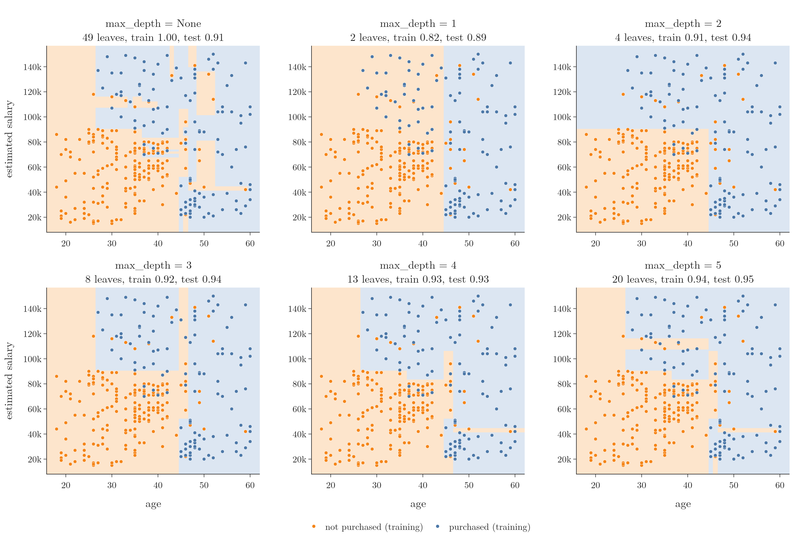
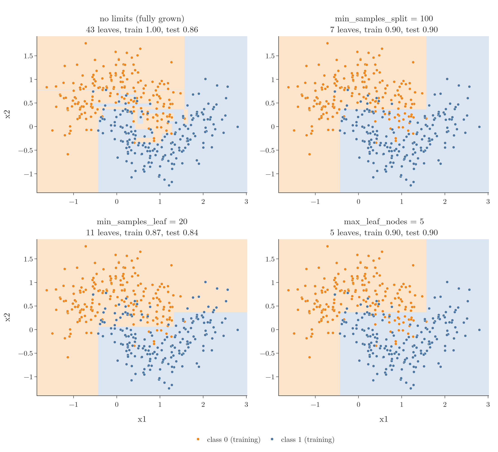

<!-- where-this-fits: generated by course_map/build_map.py; edit concepts.yaml, not this block -->
> **Where this fits:** Pipeline map steps 8 (Model), 10 (Tune). See the [Course map](../01-course-map/note.md).
>
> 
>
> - **Builds on:** Model-based learning ([Note 6](../06-instance-vs-model-based/note.md)); Overfitting ([Note 91](../91-knn/note.md)); Decision surface and boundary ([Note 91](../91-knn/note.md)); Entropy, information gain and Gini ([Note 97](../97-decision-trees-intuition/note.md)).
> - **Leads to:** Feature importance ([Note 99](../99-regression-trees/note.md)); Regression trees ([Note 99](../99-regression-trees/note.md)); Grid and random search ([Note 99](../99-regression-trees/note.md)); Ensemble learning (Video 101, coming); Random forest (Video 108, coming); Optuna (Video 134, coming).
> - **Compare with:** Feature scaling ([Note 24](../24-standardization/note.md)).
<!-- /where-this-fits -->

## 1. Overview

> **Key point:** A decision tree left alone grows until every leaf is pure, which overfits. Its hyperparameters are brakes: each one stops the tree earlier, and too much braking underfits.

Decision trees (the [decision tree intuition Note](../97-decision-trees-intuition/note.md)) are strong models with one big weakness: they tend to **overfit**. They score very well on the training data and worse on new data (overfitting, [Note 7](../07-challenges-in-ml/note.md)).

To control this, scikit-learn's `DecisionTreeClassifier` offers several **hyperparameters**, settings we choose before training (the [pipelines Note](../29-pipelines/note.md)), that act as tuning knobs. This Note covers:

- why a fully grown tree overfits, and why a very short one underfits;
- `max_depth` on a real dataset, with its decision surfaces;
- the other main hyperparameters: `criterion`, `splitter`, `min_samples_split`, `min_samples_leaf`, `max_features`, `max_leaf_nodes` and `min_impurity_decrease`.

The Notebook (`notebook.ipynb`) runs every experiment. The Dash app `app.py` has a control for every hyperparameter, redraws the decision surface and prints the tree.

## 2. Overfitting and underfitting in a tree

> **Key point:** Depth is the main knob: too deep and leaves rest on a handful of noisy rows; too shallow and the tree ignores most of the pattern.

The **depth** of a tree is the number of questions on its longest path from the root to a leaf. The hyperparameter `max_depth` caps it. It is the main cause of both overfitting and underfitting.

### 2.1 A fully grown tree overfits

> **Key point:** With no limit, the tree keeps splitting until its leaves hold a few rows, and those rows may be noise.

Take 200 rows (Figure 1a). A split on some column sends 140 rows one way and 60 the other. Suppose the 60 form a leaf, but the 140 are split again, then again, and so on. Eventually we reach a leaf with only **2 rows**, both "no".

{height=38%}

Every new point that reaches this leaf is labelled "no", because of those 2 rows alone. If they are noise, outliers or data-entry errors, all that if-else logic ends up relying on two untrustworthy rows. The tree is perfect on the training data and fails on new data: overfitting.

By default `max_depth=None`, so the tree grows until every leaf is pure. That default invites exactly this.

Geometrically, the tree keeps cutting the plane with axis-parallel lines until each small box holds a single class. A lone green point surrounded by red ones gets its own tiny green box. Any new point landing in that box is called green, although everything around it says red. This is the same problem as KNN with k = 1 (the [KNN Note](../91-knn/note.md), section 6.1).

### 2.2 A tree of depth 1 underfits

> **Key point:** With one question, each leaf predicts its majority class even when the leaf is badly mixed.

Now set `max_depth=1`: one split only (Figure 1b). The 200 rows (100 yes, 100 no) split into 140 rows (80 yes, 60 no) and 60 rows (20 yes, 40 no). Both children become leaves at once.

A leaf predicts its majority class. A new point that falls in the 140-row leaf is called "yes", because yes outnumbers no there, even though 60 of those 140 training rows were "no". The tree has barely looked at the data before answering confidently: underfitting.

Geometrically, one line cuts the plane in two, and each half gets a single class, however mixed it is.

So `max_depth` needs a middle value: too small underfits, too large (or `None`) overfits.

## 3. max_depth on the Social Network Ads data

> **Key point:** On age and salary, the fully grown tree draws islands around single points; depth 1 draws one line; depths 2 to 5 follow the real pattern.

The Social Network Ads data (the [standardization Note](../24-standardization/note.md)) records each user's age and estimated salary, and whether they bought a product after seeing an ad. We train trees of several depths on 300 rows and test on the other 100, then draw each decision surface the same way as in the [KNN Note](../91-knn/note.md) (section 5.2): predict on a dense `meshgrid` and colour every point by its class.

{height=55%}

Figure 2 shows the results:

- **`max_depth=None`** (top left): 49 leaves and 100% training accuracy. The surface is full of thin strips and small boxes around single points: a blue point deep in orange territory gets its own blue box, and a few orange points carve orange strips into the blue area. Clear overfitting; test accuracy 0.91.
- **`max_depth=1`** (top middle): one vertical line at an age of about 44.5. Many young buyers with high salaries sit in the orange "not purchased" region. Clear underfitting; training accuracy only 0.82.
- **`max_depth=2` to `5`**: the surface follows the pattern of the data. Young people with high salaries buy, older people mostly buy, and young people with average salaries do not. Test accuracy is 0.93 to 0.95.

From depth 5 onwards, strips around single points start to appear again: overfitting returns.

Picking the depth by eye works for two columns we can plot. With tens of columns we cannot see the surface, so we choose `max_depth` by cross-validation with `GridSearchCV`, exactly as for k in the [KNN Note](../91-knn/note.md) (section 4.2).

> **Extra:** On this data, 5-fold cross-validation over `max_depth` in {1, 2, 3, 4, 5, 6, 8, 10, None} picks **depth 2** (average 0.90), with a test accuracy of 0.94. The deeper trees in Figure 2 score similar test accuracies on these 100 test rows, but the cross-validation average prefers the simplest tree that captures the pattern.

## 4. The main hyperparameters

> **Key point:** Each hyperparameter either changes how splits are chosen or stops splitting earlier; a stronger brake means less overfitting and more risk of underfitting.

For the rest of the Note we use a toy dataset: two interleaving half-moons, 500 points with noise, of which 375 are used for training. Each class forms a U shape, so no straight line separates them. All numbers below come from `notebook.ipynb`; `app.py` lets us try any setting.

### 4.1 criterion: Gini or entropy

> **Key point:** The impurity measure used to score splits; the two usually give very similar trees.

`criterion` chooses the impurity measure: `"gini"` (the default) or `"entropy"`, both from the [decision tree intuition Note](../97-decision-trees-intuition/note.md) (section 8). On the moons data, both fully grown trees look almost the same: test accuracy 0.856 with Gini and 0.832 with entropy.

The difference is small, and in practice Gini often does as well or better. Both are worth trying when tuning.

### 4.2 splitter: best or random

> **Key point:** `"random"` picks thresholds at random instead of searching for the best, which adds randomness and can reduce overfitting.

For a numerical column, the tree normally checks every candidate threshold and keeps the one with the highest information gain. That is `splitter="best"`, the default.

With `splitter="random"`, the threshold of each column is drawn at random, and the tree keeps the best of these random splits. The tree fits the training data less tightly, so its results on new data can be more stable: overfitting is reduced. On the moons data the change is small (test accuracy 0.856 against 0.864). It is rarely used on a single tree.

### 4.3 max_depth

> **Key point:** Caps the number of questions on any path: small values underfit, large values or None overfit.

Section 2 covered it in detail. On the moons data:

| max_depth | Leaves | Train accuracy | Test accuracy |
|---|---|---|---|
| 1 | 2 | 0.819 | 0.824 |
| 2 | 4 | 0.899 | 0.896 |
| 5 | 13 | 0.936 | 0.896 |
| None (fully grown) | 43 | 1.000 | 0.856 |

### 4.4 min_samples_split

> **Key point:** A node is split only if it holds at least this many rows. Higher values stop the tree earlier.

`min_samples_split` (default 2) is the smallest number of rows a node must hold to be split. Stopping a tree early in this way is a form of **pruning**: cutting the tree back so it stays general.

The root of the moons tree holds 375 rows and splits into 216 and 159. With `min_samples_split=100`:

- a node with 78, 71 or 59 rows is not split again: it becomes a leaf;
- a node with 137 rows is still split, because $137 \ge 100$.

The result has 7 leaves (Figure 3, top right). With `min_samples_split=301`, the root (375 rows) splits, but neither child (216 or 159 rows) reaches 301, so the tree stops after one question.

So: **higher value, more underfitting; lower value, more overfitting.**

### 4.5 min_samples_leaf

> **Key point:** Every leaf must keep at least this many rows; a split that would create a smaller leaf is not made.

`min_samples_leaf` (default 1) is the smallest number of rows allowed in a leaf. A split is only made if **both** children keep at least that many rows.

With `min_samples_leaf=100`, the tree stops after 3 leaves: any further split would leave fewer than 100 rows on one side. With `min_samples_leaf=20` it has 11 leaves (Figure 3, bottom left).

It works much like `min_samples_split`: a higher value underfits, a lower value overfits.

{height=60%}

### 4.6 max_features

> **Key point:** At each split, the tree considers only this many randomly chosen columns.

Normally every split considers every column: at each node, the tree computes the information gain of all columns and picks the best. With `max_features`, each node only gets a **random subset** of the columns. For example, with 100 columns and `max_features=50`, each node computes the gain of 50 randomly chosen columns and picks the best of those.

This adds randomness on purpose. The tree fits the training data a little worse, which reduces overfitting. It helps most on high-dimensional data, with many columns.

On the moons data there are only 2 columns, so `max_features=1` means each node may look at only one, chosen at random. One node may only see x1, the next only x2.

The same idea is the heart of **random forests** (the random forest Notes, coming later): many trees, each seeing random columns at every split.

> **Extra:** Even with `max_features=None`, scikit-learn shuffles the order in which it tries the columns at each node. When two columns give exactly the same gain, the order decides, so the tree can change with `random_state`. Fixing `random_state` makes the tree reproducible.

### 4.7 max_leaf_nodes

> **Key point:** Caps the number of leaves; the tree keeps the splits that reduce impurity the most.

`max_leaf_nodes` limits how many leaves the tree may have. With `max_leaf_nodes=2` there is one split and two leaves; with 5, exactly 5 leaves (Figure 3, bottom right).

When this limit is set, scikit-learn grows the tree **best-first**: it always makes the split with the largest impurity decrease next, wherever it is in the tree, until the leaf budget is used up. Higher value: overfitting; lower value: underfitting.

### 4.8 min_impurity_decrease

> **Key point:** A split is made only if it reduces the weighted impurity by at least this amount.

Every split is chosen to lower the impurity (Gini or entropy). `min_impurity_decrease` (default 0) sets the smallest decrease worth a split: if the best split of a node gains less, the node becomes a leaf.

The decrease is measured with weights, so that a split of a small node counts less than a split of a big one.

1. **In words:** take the node's share of all training rows, and multiply it by (the node's impurity minus the weighted impurity of its two children).
2. **Formula:**
   $$\Delta = \frac{N_t}{N}\left(G_t - \frac{N_L}{N_t}G_L - \frac{N_R}{N_t}G_R\right)$$
   where $N$ is the number of training rows, $N_t$ the rows in the node, $N_L$ and $N_R$ the rows in its children, and $G$ the impurities.
3. **Example:** the moons root: $N = N_t = 375$, Gini 0.5; its children hold 216 rows (Gini 0.351) and 159 rows (Gini 0.210):
   $$\Delta = \frac{375}{375}\left(0.5 - \frac{216}{375}(0.351) - \frac{159}{375}(0.210)\right) = 0.5 - 0.202 - 0.089 = 0.209$$

With `min_impurity_decrease=0.01` the tree keeps 7 leaves. With 0.1, only the root split (0.209) is large enough, so the tree stops after one question. Higher value: underfitting; lower value: overfitting.

## 5. Why trees deserve the extra attention

> **Key point:** Random forests, bagging and gradient boosting are all built from decision trees, and they are tuned with these same hyperparameters.

The best way to get a feel for these hyperparameters is to experiment. Run `python app.py`, open `http://127.0.0.1:8050`, and try:

- **max_depth 1, 2, 5, then 0 (no limit):** watch the surface go from one line to small islands.
- **min_samples_split 100, then 301:** read the printed tree and check where splitting stops.
- **min_impurity_decrease 0.01, then 0.1:** the tree shrinks to a single question.
- **splitter "random"** or **max_features 1:** the tree changes a little on every setting.

Decision trees are the building blocks of **bagging**, **random forests** and **gradient boosting**, which come later. All of them are tuned through these same knobs, so knowing how each one moves a single tree pays off there too.

## 6. Summary

| Hyperparameter | Default | What it controls | Raise it to |
|----------------------------|------------|------------------------------|-----------------|
| `criterion` | `"gini"` | impurity measure: `"gini"`, `"entropy"`, `"log_loss"` | (no direction) |
| `splitter` | `"best"` | best threshold, or best of random thresholds | `"random"`: less overfitting |
| `max_depth` | `None` | longest path from root to leaf | overfit more |
| `min_samples_split` | 2 | rows a node needs to be split | underfit more |
| `min_samples_leaf` | 1 | rows every leaf must keep | underfit more |
| `max_features` | `None` (all) | columns considered at each split | overfit more |
| `max_leaf_nodes` | `None` | number of leaves | overfit more |
| `min_impurity_decrease` | 0 | weighted impurity drop a split must give | underfit more |

- A fully grown tree (`max_depth=None`) has pure leaves resting on a few rows: overfitting. One split (`max_depth=1`): underfitting.
- On the Social Network Ads data, depths 2 to 5 follow the real pattern; cross-validation picks depth 2.
- Every hyperparameter except `criterion` either limits growth or adds randomness. Tune them with cross-validation, not by eye.

## 7. Key terms

| Term | Meaning |
|---|---|
| Depth | The number of questions on the longest path from a tree's root to a leaf |
| max_depth | The cap on a tree's depth; None lets it grow until every leaf is pure |
| splitter | "best" searches every threshold; "random" draws thresholds at random |
| min_samples_split | The smallest number of rows a node must hold to be split |
| min_samples_leaf | The smallest number of rows every leaf must keep |
| max_features | The number of randomly chosen columns a tree considers at each split |
| max_leaf_nodes | The cap on the number of leaves; the tree grows best-first until it is reached |
| min_impurity_decrease | The smallest weighted impurity decrease a split must give to be made |
| Pruning | Stopping a tree early or cutting it back so it does not overfit |
| Fully grown tree | A tree split until every leaf is pure; usually overfits |
