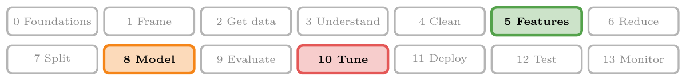
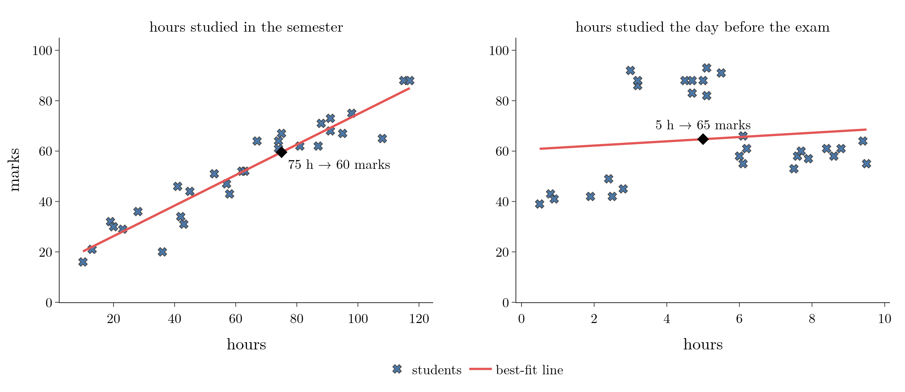
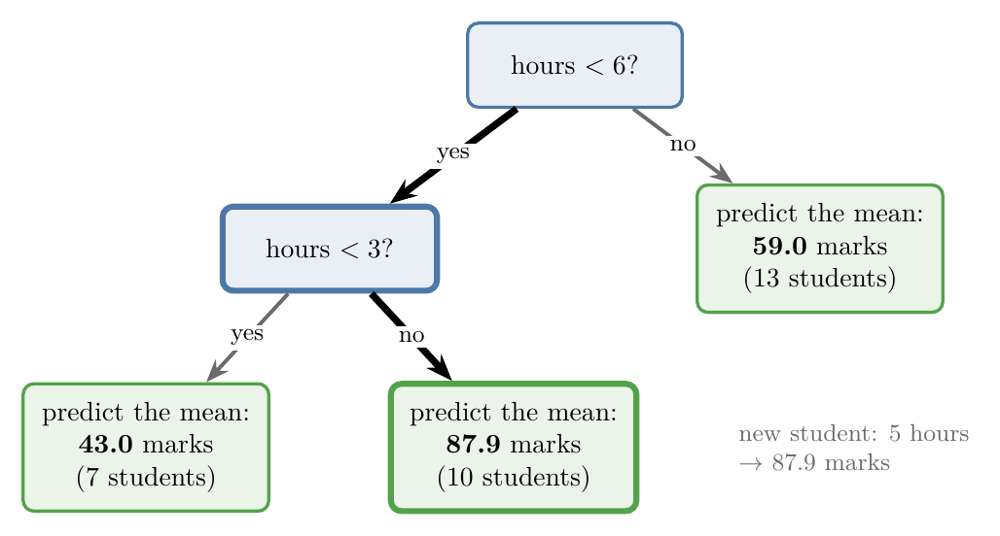
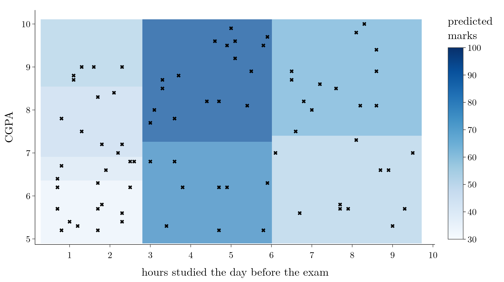
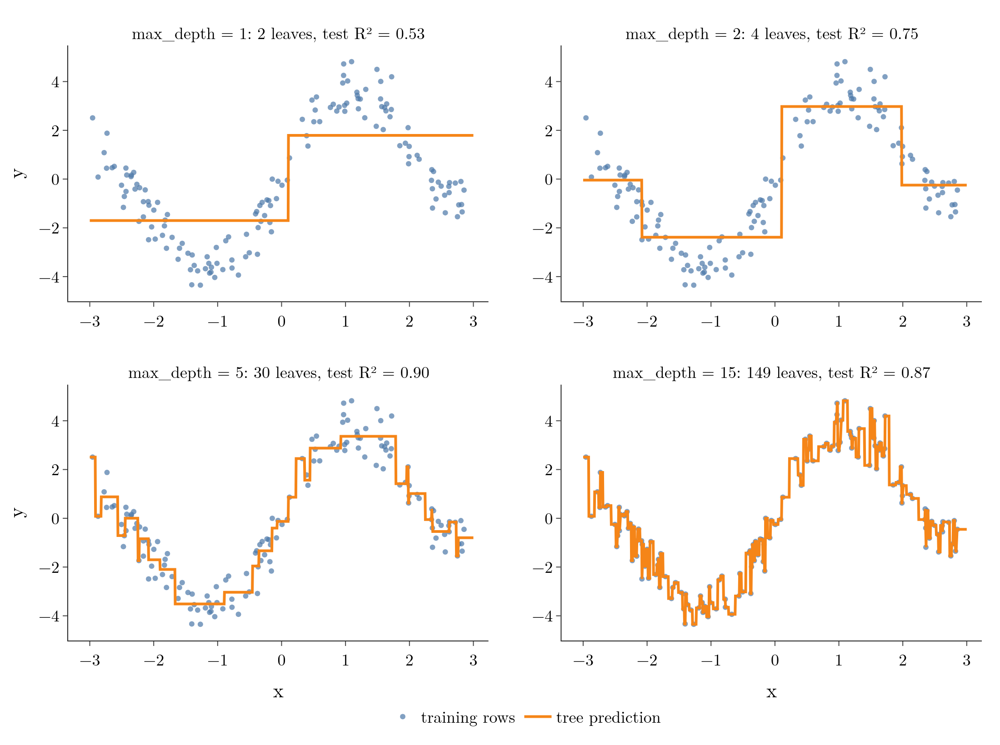

<!-- where-this-fits: generated by course_map/build_map.py; edit concepts.yaml, not this block -->
> **Where this fits:** Pipeline map steps 5 (Engineer features), 8 (Model), 10 (Tune). See the [Course map](../01-course-map/note.md).
>
> 
>
> - **Builds on:** Simple imputation (mean, median, mode, constant) ([Note 37](../37-missing-categorical-data/note.md)); ML pipelines ([Note 38](../38-missing-indicator-random-sample/note.md)); Regression metrics ([Note 52](../52-regression-metrics/note.md)); Cross-validation ([Note 91](../91-knn/note.md)); Decision trees ([Note 98](../98-decision-tree-hyperparameters/note.md)); Hyperparameter tuning ([Note 98](../98-decision-tree-hyperparameters/note.md)).
> - **Leads to:** Bagging ([Note 105](../105-bagging-intuition/note.md)); Random forest ([Note 108](../108-random-forest-intro/note.md)); Permutation importance ([Note 114](../114-feature-importance/note.md)); Gradient boosting ([Note 120](../120-gradient-boosting-intuition/note.md)).
> - **Compare with:** Simple linear regression ([Note 51](../51-linear-regression-maths/note.md)); Optuna ([Note 134](../134-optuna/note.md)); Bayesian optimisation ([Note 134](../134-optuna/note.md)).
<!-- /where-this-fits -->

## 1. Overview

> **Key point:** A regression tree cuts the input space into boxes, exactly like a classification tree, but each leaf predicts the **mean** of its training outputs, and splits are chosen to minimise the squared error.

Decision trees are mostly used for classification (the [decision tree intuition Note](../97-decision-trees-intuition/note.md)), where the output is a category. The same algorithm also works when the output is a number: a **regression tree**.

This Note covers:

- when a regression tree beats linear regression: non-linear data;
- how a tree predicts a number: the mean of a leaf;
- how it finds each split: the sum of squared errors;
- splits with two or more inputs;
- the hyperparameters, and a full example on the Boston housing data, with feature importance.

The Notebook (`notebook.ipynb`) runs every example.

## 2. When a straight line is not enough

> **Key point:** Linear regression handles a roughly straight trend; when the pattern bends, rises and falls, a regression tree follows it.

### 2.1 A linear pattern: hours in the semester

> **Key point:** More study hours over the semester, more marks, roughly in a straight line.

For many regression problems, linear regression is the go-to algorithm. It finds the **best-fit line** $y = mx + b$ (the [simple linear regression Note](../50-simple-linear-regression/note.md)) and predicts by reading the line.

Figure 1 (left) plots 30 students: hours studied over the whole semester against exam marks. Some students study less and score more, others the opposite, but the trend is roughly a straight line. The best-fit line predicts that a student who studied 75 hours gets about 60 marks.

{height=30%}

### 2.2 A non-linear pattern: hours the day before the exam

> **Key point:** Too little and too much last-day study both score low; a line through this data misses every group.

Figure 1 (right) uses a different input: the hours studied on the day **before** the exam.

- Students who studied **under 3 hours** scored low, around 43.
- Students in the **3 to 6 hours** range scored high, around 88.
- Students who studied **more than 6 hours** scored around 59: they were exhausted on exam day.

A straight line through this data is almost flat. For a student who studied 5 hours, it predicts about 65 marks, while every such student scored above 80. It also misses the low group and the tired group. Its $R^2$ (the [regression metrics Note](../52-regression-metrics/note.md)) on these 30 students is only 0.02.

Whenever the relationship is non-linear like this, a regression tree usually does better than linear regression.

## 3. How a regression tree predicts

> **Key point:** Cut the input into ranges with if-else questions; in each range, predict the mean output of the training rows that fall there.

### 3.1 Cutting the data by hand

> **Key point:** Two cuts, at 3 and 6 hours, separate the three groups.

Decision trees cut the data. Here two cuts are enough: one at 3 hours and one at 6 hours. Written as if-else questions (Figure 2):

1. **Is hours < 6?** If no, the student is in the "tired" group.
2. If yes: **is hours < 3?** If yes, the "too little" group; if no, the "just right" group.

{height=30%}

### 3.2 A leaf predicts the mean

> **Key point:** A leaf's prediction is the average output of its training rows.

In a classification tree, a leaf predicts its majority class. In a regression tree, a leaf predicts the **mean** output of the training rows that reached it.

1. **In words:** add up the outputs of the rows in the leaf and divide by how many there are.
2. **Formula:** for a leaf with $n$ training rows and outputs $y_1, \dots, y_n$:
   $$\hat{y}_{\text{leaf}} = \bar{y} = \frac{1}{n}\sum_{i=1}^{n} y_i$$
3. **Example:** the 10 students who studied between 3 and 6 hours scored, in total, 879 marks, so the leaf predicts $879 / 10 = 87.9$.

The three leaves in Figure 2 predict 43.0, 87.9 and 59.0 marks.

A new student who studied 5 hours goes down the tree: $5 < 6$, yes; $5 < 3$, no. They land in the middle leaf, so the tree predicts **87.9 marks**, where the line predicted 65.

Plotted against the hours, the tree's prediction is a staircase: flat within each range, jumping at each cut (Figure 3). scikit-learn, given this data and allowed 3 leaves, finds almost the same cuts by itself: 2.90 and 5.75 hours.

{height=33%}

## 4. Finding the splitting criterion

> **Key point:** Try every threshold; for each, predict each side's mean and add up the squared errors; keep the threshold with the smallest total.

### 4.1 The question

> **Key point:** We can see the gaps at 3 and 6 by eye; the algorithm needs a rule.

In Figure 1 the groups are separated by visible gaps, so we could place the cuts by eye. Real data is continuous, with no gaps, and an algorithm cannot "see". It needs a rule that scores every possible cut. Classification trees use information gain (the [decision tree intuition Note](../97-decision-trees-intuition/note.md), section 9); regression trees use the squared error.

### 4.2 Scoring one threshold: the sum of squared errors

> **Key point:** A threshold's score is the sum of squared residuals when each side predicts its own mean.

Take a threshold $t$ between two neighbouring points. It splits the rows into a left group ($x \le t$) and a right group ($x > t$). Each group predicts its own mean. The gap between a point's actual mark and its group's mean is its **residual** (the [simple linear regression Note](../50-simple-linear-regression/note.md)), its error.

1. **In words:** square every residual on the left, square every residual on the right, and add them all up. The result is the **sum of squared errors (SSE)** of that threshold.
2. **Formula:**
   $$\text{SSE}(t) = \sum_{x_i \le t} \left(y_i - \bar{y}_{\text{left}}\right)^2 + \sum_{x_i > t} \left(y_i - \bar{y}_{\text{right}}\right)^2$$
3. **Example:** 5 students with hours 1, 2, 4, 5, 8 and marks 40, 46, 88, 90, 58. Try $t = 3$ (between 2 and 4):
   - left: 40 and 46, mean 43, so $\text{SSE}_{\text{left}} = (-3)^2 + 3^2 = 18$;
   - right: 88, 90, 58, mean 78.67, so $\text{SSE}_{\text{right}} = 9.33^2 + 11.33^2 + (-20.67)^2 = 642.7$;
   - total: $\text{SSE}(3) = 18 + 642.7 = 660.7$.

The other thresholds score worse: $t = 1.5$ gives 1,443.0, $t = 4.5$ gives 1,880.0 and $t = 6.5$ gives 2,136.0. So $t = 3$ is the best first split for these 5 students.

### 4.3 Trying every threshold

> **Key point:** Sweep the threshold across the data, plot SSE against it, and take the minimum.

The algorithm repeats this for every candidate threshold:

1. Sort the rows by the input. Take the first two points, and put the threshold halfway between them (their mean). The left group has one point, which is its own mean; the right group has the rest.
2. Compute the SSE and plot it against the threshold.
3. Move to the next two points and repeat, until the threshold has passed every gap.
4. Keep the threshold with the **smallest SSE**. It becomes the split.

Figure 4 shows this sweep on our 30 students (`images/sse_sweep.gif` animates it). The red lines are the residuals, the orange and green lines the two means, and the right panel traces the SSE. The minimum is at **hours $\le$ 2.90**, with an SSE of 5,060, down from 9,439 with no split at all.

{height=48%}

> **Extra:** scikit-learn's default criterion, `"squared_error"`, compares splits by the weighted **mean** squared error (MSE) of the children. Since the parent's row count is the same for every candidate, minimising the children's weighted MSE is the same as minimising the SSE. The drop from the parent's MSE to the weighted MSE of its children plays the role that information gain plays in classification; it is often called **variance reduction**, because a node's MSE around its mean is the variance of its outputs.

### 4.4 Recursion, and when to stop

> **Key point:** Repeat the search inside each side; stop when a node gets too small, or the tree will give every point its own leaf.

After the first split, each side is searched again, in exactly the same way, to find its own best split. On our data the next split, inside the right group, is at 5.75 hours.

If we never stop, the tree keeps splitting until every training point sits alone in a leaf. It then reproduces every training mark exactly but fails badly on new students: overfitting (the [bias-variance Note](../62-bias-variance/note.md)). We want to separate the groups, not every point.

So we set a stopping rule, for example: do not split a node with fewer than 4 rows. In practice a minimum of about 20 to 25 rows per node is a common starting point, depending on the dataset. This is the hyperparameter `min_samples_split` (or `min_samples_leaf`) of the [hyperparameters Note](../98-decision-tree-hyperparameters/note.md).

## 5. More than one input

> **Key point:** Find the best threshold for each input separately, then split on the input whose best threshold has the smaller SSE.

Add a second input: each student's CGPA so far. Now there are two inputs, hours and CGPA, and one output, marks, so the data lives in 3D.

For every split, the tree:

1. finds the best threshold on **hours** and its SSE, $\text{SSE}_{\text{hours}}$;
2. finds the best threshold on **CGPA** and its SSE, $\text{SSE}_{\text{CGPA}}$;
3. splits on whichever input has the **smaller** SSE.

In 3D, each split is a plane parallel to one axis that cuts the cloud of points in two. The search then repeats inside each part, with hours and CGPA competing again at every node, until the stopping rule leaves too few rows to split; each final part predicts the mean of its rows.

Figure 5 shows the result on 80 students, viewed from above: each box is a leaf, shaded by its predicted mark. The first split is on hours ($\le 2.8$), and the next ones mix hours (at 6.0) and CGPA. Within each range of hours, a higher CGPA means a higher prediction.

{height=36%}

## 6. Hyperparameters of a regression tree

> **Key point:** The same knobs as the classification tree; only the criterion changes, from Gini or entropy to squared or absolute error.

`DecisionTreeRegressor` has exactly the hyperparameters of the classifier (the [hyperparameters Note](../98-decision-tree-hyperparameters/note.md)): `splitter`, `max_depth`, `min_samples_split`, `min_samples_leaf`, `max_leaf_nodes`, `min_impurity_decrease` and `max_features`, with the same effects. The difference is the **criterion**, which measures error instead of impurity:

- `"squared_error"` (default): the mean squared error, MSE (the [regression metrics Note](../52-regression-metrics/note.md)); leaves predict the mean.
- `"absolute_error"`: the mean absolute error, MAE; leaves predict the **median**, so outliers pull less. It is much slower to train.
- `"poisson"`: for counts, such as the number of visits.

On most data `"squared_error"` does as well as or better than the others, but this is again something to settle by tuning.

> **Extra:** Older code also uses `"friedman_mse"`. In scikit-learn 1.9 it is deprecated (to be removed in 1.11) and simply maps to `"squared_error"`, as the two always gave the same trees.

### 6.1 max_depth on a non-linear curve

> **Key point:** Depth 1 is a single step; depth 5 follows the curve; depth 15 chases every point.

Figure 6 trains trees of four depths on 150 noisy points along a wave and scores them on 50 test points with $R^2$.

{height=50%}

- **Depth 1:** one split at $x \approx 0.1$ and two flat levels. Clear underfitting; test $R^2 = 0.53$.
- **Depth 2:** four levels, a rough outline of the wave; $R^2 = 0.75$.
- **Depth 5:** 30 small steps that follow the wave without chasing single points; $R^2 = 0.90$, the best of the four.
- **Depth 15:** 149 leaves for 150 training points. The line jumps to touch almost every point, noise included: overfitting; $R^2$ falls to 0.87.

The other hyperparameters behave as for classification. For example, with 150 training rows and `min_samples_split=100`, the root splits into 82 and 68 rows, and neither child has 100 rows, so the tree stops there: underfitting. With only one input column, `max_features` has nothing to choose from; it matters on data with many columns.

## 7. A regression tree on the Boston housing data

> **Key point:** A single train-test split flatters the tree; cross-validation gives the honest score, and `feature_importances_` shows which columns the tree relies on.

### 7.1 The data and a first tree

> **Key point:** 506 Boston districts, 13 inputs, and the median house price; a depth-5 tree scores R² = 0.88 on one test split.

The **Boston housing data** describes 506 districts of Boston in the 1970s. Each has 13 input columns, such as `RM` (average number of rooms per home), `LSTAT` (percentage of lower-income residents) and `CRIM` (crime rate). The output, `MEDV`, is the median home value in thousands of dollars.

> **Python:** A regression tree on the Boston data.
>
> ```python
> import pandas as pd
> from sklearn.model_selection import train_test_split
> from sklearn.tree import DecisionTreeRegressor
> from sklearn.metrics import r2_score
>
> boston = pd.read_csv("data/boston.csv")
> X = boston.drop(columns="MEDV")
> y = boston["MEDV"]
> X_train, X_test, y_train, y_test = train_test_split(
>     X, y, test_size=0.2, random_state=42)
>
> reg = DecisionTreeRegressor(criterion="squared_error",
>                             max_depth=5, random_state=42)
> reg.fit(X_train, y_train)
> r2_score(y_test, reg.predict(X_test))   # 0.883
> ```
>
> `DecisionTreeRegressor` is used exactly like `DecisionTreeClassifier`; only the output is a number.

> **Extra:** Older code loads this data with `load_boston` from `sklearn.datasets`. That function was removed in scikit-learn 1.2, partly because one column, `B`, was built from the share of Black residents of each district, an ethically problematic variable. The Notebook reads the same table from `data/boston.csv` (OpenML dataset 531). For new projects, scikit-learn suggests the California housing data instead.

An $R^2$ of 0.88 looks impressive, but it comes from one random test set of 102 districts. Cross-validation (the [pipelines Note](../29-pipelines/note.md), section 8) on the training set gives a more honest average: **0.66**.

### 7.2 Tuning with GridSearchCV and RandomizedSearchCV

> **Key point:** Grid search tries every combination; randomized search tries a fixed number of random ones, which is faster on big grids.

Grid search with `GridSearchCV` (the [KNN Note](../91-knn/note.md), section 4.2) tries every combination of the values we list and keeps the one with the best cross-validated score. Here we tune four hyperparameters:

> **Python:** Tuning a regression tree.
>
> ```python
> from sklearn.model_selection import GridSearchCV
>
> params = {"max_depth": [2, 4, 6, 8, None],
>           "criterion": ["squared_error", "absolute_error"],
>           "max_features": [0.25, 0.5, 1.0],
>           "min_samples_split": [2, 0.05, 0.25]}
> grid = GridSearchCV(DecisionTreeRegressor(random_state=42),
>                     params, cv=5)
> grid.fit(X_train, y_train)
> grid.best_params_   # absolute_error, max_depth 6,
>                     # max_features 1.0, min_samples_split 2
> grid.best_score_    # 0.725, cross-validated R2
> ```
>
> A decimal such as `max_features=0.5` means "50% of the columns" (6 of 13), and `min_samples_split=0.05` means "5% of the training rows".

That is $5 \times 2 \times 3 \times 3 = 90$ combinations, each cross-validated 5 times: 450 trees. The best combination reaches a cross-validated $R^2$ of **0.725**, better than the 0.66 of our first tree, and this score can be trusted because it comes from cross-validation. Adding more values and more hyperparameters can improve it further.

On the single test split, the tuned tree scores only 0.63. A single split of 102 rows is noisy: here it happened to favour the first tree. This is exactly why we choose settings by cross-validation, not by one test score.

When a grid becomes too large, **`RandomizedSearchCV`** is the faster alternative: instead of every combination, it tries `n_iter` combinations drawn at random from the same lists. With `n_iter=20` it trains 100 trees instead of 450 and reaches a cross-validated $R^2$ of 0.70.

### 7.3 Feature importance

> **Key point:** `feature_importances_` gives each column's share of the tree's total error reduction; on Boston, RM, LSTAT and CRIM dominate.

A trained tree also tells us which columns it relied on. Its attribute **`feature_importances_`** gives one number per column: that column's share of all the impurity (here, error) reduction achieved by the tree's splits. The numbers add up to 1.

{height=34%}

Figure 7 shows them for the tuned tree:

- **RM** (rooms per home) is by far the most important column, at 0.47;
- then **LSTAT** (0.29) and **CRIM** (0.11);
- the last few columns (`INDUS`, `ZN`, `CHAS`, `RAD`) contribute almost nothing.

This is useful for **feature selection** (the [curse of dimensionality Note](../46-curse-of-dimensionality/note.md)): if we must drop columns, the ones with near-zero importance are the first candidates.

> **Extra:** The importance of a column is computed by adding up, over every node that splits on it, the node's share of the training rows times its impurity decrease (the $\Delta$ of `min_impurity_decrease` in the [hyperparameters Note](../98-decision-tree-hyperparameters/note.md), section 4.8), and then dividing by the total over all columns. A single tree overfits easily, so its importances can change a lot from one training set to another. Random forests average them over many trees and give more reliable values.

## 8. Summary

| | Classification tree | Regression tree |
|---|---|---|
| Output | a class | a number |
| Leaf predicts | the majority class | the mean of its rows (median with `absolute_error`) |
| Split chosen by | information gain (Gini or entropy) | smallest squared error (SSE / MSE) |
| scikit-learn | `DecisionTreeClassifier` | `DecisionTreeRegressor` |
| Criterion values | `"gini"`, `"entropy"`, `"log_loss"` | `"squared_error"`, `"absolute_error"`, `"poisson"` |
| Prediction shape | boxes of one class | a staircase: boxes of one value |

- Linear regression handles roughly straight trends; regression trees handle non-linear ones, such as marks against last-day study hours.
- Each candidate threshold splits the data in two; each side predicts its mean; the threshold with the smallest SSE wins (here, hours $\le$ 2.90).
- With several inputs, each input's best threshold competes; the smallest SSE wins.
- A tree grown fully gives every point its own leaf; stop it with `max_depth`, `min_samples_split`, `min_samples_leaf` and the other hyperparameters.
- On the Boston data, a tuned tree reaches a cross-validated $R^2$ of 0.725; RM, LSTAT and CRIM are the most important columns.

## 9. Key terms

| Term | Meaning |
|---|---|
| Regression tree | A decision tree whose leaves predict numbers: the mean output of their training rows |
| DecisionTreeRegressor | scikit-learn's regression tree |
| Sum of squared errors (SSE) | The sum of the squared residuals; a regression tree splits where the SSE of the two sides is smallest |
| Variance reduction | The drop in mean squared error from a node to its children; the regression version of information gain |
| squared_error | DecisionTreeRegressor's default criterion: split by mean squared error, leaves predict the mean |
| absolute_error | A criterion that splits by mean absolute error; leaves predict the median |
| RandomizedSearchCV | Tuning that cross-validates a fixed number of randomly drawn hyperparameter combinations |
| Feature importance | A column's share of all the impurity reduction in a tree; the shares add up to 1 |
| feature_importances_ | The fitted attribute holding the feature importance of every column |
| Boston housing data | 506 Boston districts, 13 inputs and the median home value; removed from scikit-learn in version 1.2 |
