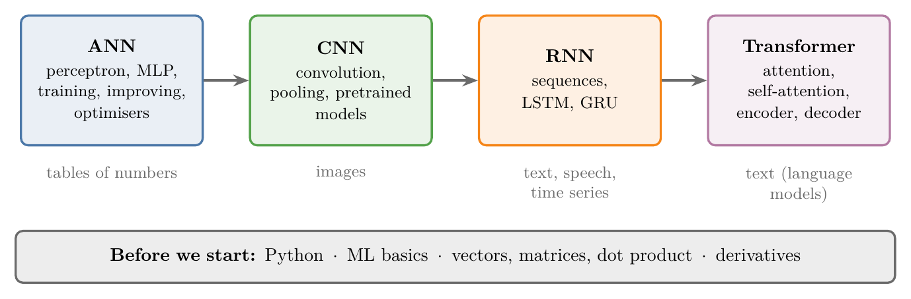
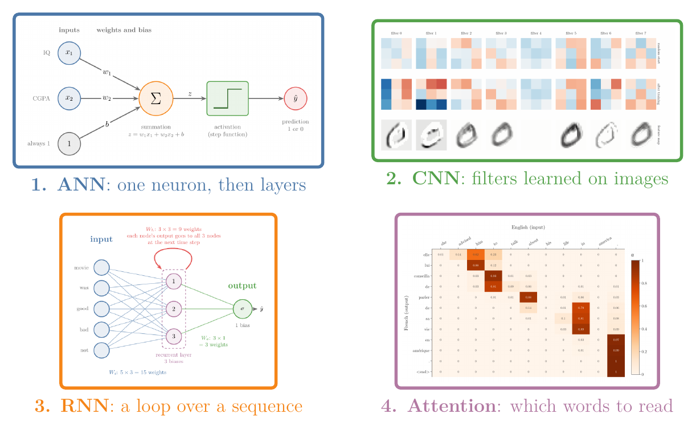
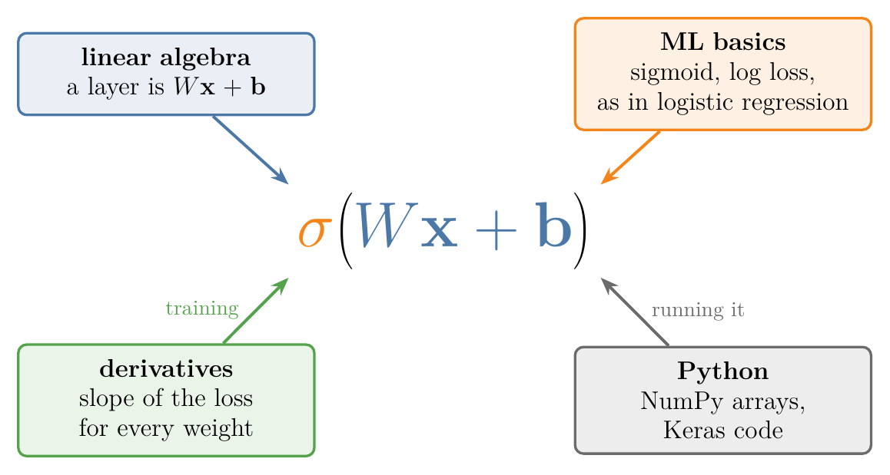

<!-- where-this-fits: generated by course_map/build_map.py; edit concepts.yaml, not this block -->
> **Where this fits:** Pipeline map step 0 (Foundations). See the [Course map](../../../00-course-map/00-course-map.md).
>
> 
>
> - **Builds on:** [Machine learning](../../../ML/01-foundations/ML-001-what-is-ml/ML-001-what-is-ml.md#2-defining-machine-learning).
> - **Leads to:** [Types of neural networks](../../../DL/01-basics/DL-003-nn-types-history-applications/DL-003-nn-types-history-applications.md#2-types-of-neural-networks).
> - **Compare with:** [Machine learning](../../../ML/01-foundations/ML-002-ai-vs-ml-vs-dl/ML-002-ai-vs-ml-vs-dl.md#4-machine-learning).
<!-- /where-this-fits -->

## 1. Overview

> **Key point:** The Deep Learning Notes move through four families of neural networks: ANNs, CNNs, RNNs and transformers. Before starting, we need Python, the basics of ML, some linear algebra and derivatives.

Figure 1 shows the plan. Each box is one family of networks, with its topics inside. The grey text under a box names the kind of data it suits. An arrow means "builds on": reading left to right, each family reuses the one before it. The grey bar at the bottom lists what to know before starting. The first family, the **artificial neural network (ANN)** (G-216), takes the most space, because every later network reuses its ideas.

## 2. The four families of networks

> **Key point:** ANNs come first and take the largest share of the Notes (39 of the 90, close to half); CNNs, RNNs and transformers each reuse the ANN machinery for one kind of data.

{width=90%}

Figure 2 previews one picture from each family; each is explained in its own Note. The numbers 1 to 4 match the order of Figure 1. We do not need to read these pictures yet; the point is that each family looks different:

- Panel 1 shows one neuron, with inputs on the left and one prediction on the right.

- Panel 2 shows small grids of numbers (filters) that are slid over an image.

- Panel 3 shows a layer that feeds its own output back to itself, so it can read a sequence.

- Panel 4 shows a table whose dark cells mark which input word each output word reads.

### 2.1 Artificial neural networks

> **Key point:** From one artificial neuron to a full network: how it predicts, how it is trained, and how to make it train well.

The ANN part runs in this order:

1. **Foundations:** what deep learning is, how it differs from ML, the main types of network, their history and applications.
2. **The perceptron** (G-1486): a single artificial **neuron** (G-1318), how it predicts, how it is trained, and the problem that a single neuron cannot solve.
3. **The multi-layer perceptron (MLP)** (G-1270): many neurons in **layers** (G-1056), the names of its **weights** (G-2106) and **biases** (G-284), and how it makes a prediction.
4. **Training:** **loss functions** (G-706), **backpropagation** (G-247) and **gradient descent** (G-862).
5. **First projects** in the **Keras** (G-1003) library: one classification and one regression problem.
6. **Improving a network:** vanishing and exploding gradients, dropout, regularisation, activation functions, weight initialisation, batch normalisation, optimisers and hyperparameter tuning.

### 2.2 CNNs, RNNs and transformers

> **Key point:** CNNs for images, RNNs for sequences, transformers for language.

- **Convolutional neural networks (CNNs)** (G-484) work best on images: convolution, pooling, pretrained models and transfer learning. An image is a grid of pixels whose useful details, such as edges, are small and can appear anywhere, so a CNN looks at a small patch at a time and reuses the same small filter at every position (Goodfellow, Bengio and Courville, *Deep Learning*, ch. 9 and §9.2; see [convolutional neural network](../DL-003-nn-types-history-applications/DL-003-nn-types-history-applications.md#22-convolutional-neural-network-cnn)).
- **Recurrent neural networks (RNNs)** (G-1647) work on sequences such as text, speech and time series: RNNs, LSTMs and GRUs. A sequence arrives one step at a time, and each step makes sense only with the steps before it, so an RNN reuses the same weights at every step and carries a memory forward, which lets it read sequences of any length (*Deep Learning*, ch. 10; see [recurrent neural network](../DL-003-nn-types-history-applications/DL-003-nn-types-history-applications.md#23-recurrent-neural-network-rnn-and-lstm)).
- **Transformers** (G-2007) replace recurrence with **attention** (G-226; Vaswani et al. 2017) and are the basis of language models such as GPT-3 (Brown et al. 2020): attention, self-attention and the full encoder-decoder transformer.

> **Extra:** Generative networks (GANs, autoencoders), object detection and image segmentation are not covered in these Notes. GANs and autoencoders each get a short paragraph in [types of neural networks](../DL-003-nn-types-history-applications/DL-003-nn-types-history-applications.md#2-types-of-neural-networks).

### 2.3 The software

> **Key point:** Code uses TensorFlow with Keras, the pair most used in industry; PyTorch is the common choice in research.

Most deep learning code in these Notes uses **TensorFlow** (G-1959) with **Keras**, its built-in high-level interface. The other major library, **PyTorch** (G-1595), is used more in research than in industry. Where a Note has code, its Notebook rebuilds it for current library versions.

## 3. What to know first

> **Key point:** Four things: basic Python, the overall flow of an ML project, vectors and matrices, and derivatives.

To see why these four are needed, we work through what one neuron computes, with small numbers. A neuron takes two input numbers, multiplies each by its own weight, adds them, adds a shift, and squashes the result into the range 0 to 1.

| Quantity | Name | Value in our example |
|---|---|---|
| inputs | $\mathbf{x}$ (a list of numbers, a **vector** (G-2081)) | $\mathbf{x} = (2, 3)$ |
| weights | $\mathbf{w}$, one per input | $\mathbf{w} = (1, 2)$ |
| shift | $b$, the **bias** (G-284) (one number) | $b = 0.5$ |
| squash | $\sigma$, the **sigmoid** (G-1798) (a function) | $\sigma(z) = \dfrac{1}{1 + e^{-z}}$ |

The **dot product** (G-634) of two vectors multiplies their matching entries and adds the results. Step by step:

$$1 \times 2 = 2$$

$$2 \times 3 = 6$$

$$2 + 6 = 8 \quad \text{(the dot product of } \mathbf{w} \text{ and } \mathbf{x})$$

The two lines above the sum are the two products.

$$8 + 0.5 = 8.5 \quad \text{(add the bias, call it } z)$$

$$\sigma(8.5) = \frac{1}{1 + e^{-8.5}} \approx 0.9998$$

Writing the dot product as $\mathbf{w}^{\mathsf T}\mathbf{x}$ means: vectors are stored as columns (standing up), so turn the column $\mathbf{w}$ on its side (the **transpose** (G-2012), written $\mathsf T$), then multiply entry by entry and add. So the whole neuron is $\sigma(\mathbf{w}^{\mathsf T}\mathbf{x} + b)$, and the check is the five lines above: 0.9998.

A layer holds several neurons that read the same inputs. Stack their weight lists as the rows of a table $W$ (a **matrix** (G-1180)). Take a second neuron with weights $(-1, 1)$ and bias $-1$:

$$W = \begin{pmatrix} 1 & 2 \cr-1 & 1 \end{pmatrix}$$

$$\mathbf{b} = \begin{pmatrix} 0.5 \cr-1 \end{pmatrix}$$

$$W\mathbf{x} = \begin{pmatrix} 1\cdot 2 + 2\cdot 3 \cr-1\cdot 2 + 1\cdot 3 \end{pmatrix}$$

$$W\mathbf{x} = \begin{pmatrix} 8 \cr1 \end{pmatrix}$$

$$W\mathbf{x} + \mathbf{b} = \begin{pmatrix} 8.5 \cr0 \end{pmatrix}$$

$$\sigma(W\mathbf{x} + \mathbf{b}) = \begin{pmatrix} \sigma(8.5) \cr\sigma(0) \end{pmatrix}$$

$$\sigma(W\mathbf{x} + \mathbf{b}) \approx \begin{pmatrix} 0.9998 \cr0.5 \end{pmatrix}$$

The first row reproduces the single neuron above. Figure 3 shows where each prerequisite enters this one formula.

{width=75%}

In Figure 3, each arrow points from a prerequisite to the part of the formula it supplies. The four prerequisites are:

- **linear algebra** (G-1090) builds $W\mathbf{x} + \mathbf{b}$;
- ML basics (logistic regression) supply the sigmoid;
- derivatives train the weights;
- Python runs the code.

The Deep Learning Notes assume four things. Each row of the table links to the Notes that teach it:

| Prerequisite | How much | Where it is taught |
|---|---|---|
| Python | read and write simple code; NumPy and pandas | Python boxes from the [toy project](../../../ML/01-foundations/ML-012-toy-project/ML-012-toy-project.md#2-the-workflow) onward; setup in the [environment](../../../ML/01-foundations/ML-011-setup-anaconda-jupyter-colab/ML-011-setup-anaconda-jupyter-colab.md#2-anaconda-miniforge-and-conda) |
| ML basics | how a model is trained, how data is prepared, how a model is served | [AI vs ML vs DL](../../../ML/01-foundations/ML-002-ai-vs-ml-vs-dl/ML-002-ai-vs-ml-vs-dl.md#5-deep-learning), [ML development life cycle](../../../ML/01-foundations/ML-009-mldlc/ML-009-mldlc.md#2-from-sdlc-to-mldlc), [toy project](../../../ML/01-foundations/ML-012-toy-project/ML-012-toy-project.md#2-the-workflow) |
| Linear algebra | vectors, dot product, matrices and matrix multiplication | [vectors](../../../MA/05-linear-algebra/MA-048-vectors-and-feature-vectors/MA-048-vectors-and-feature-vectors.md#2-what-a-vector-is), [dot product](../../../MA/05-linear-algebra/MA-050-dot-product-and-cosine-similarity/MA-050-dot-product-and-cosine-similarity.md#3-computing-the-dot-product), [linear transformations and matrices](../../../MA/05-linear-algebra/MA-053-linear-transformations-and-matrices/MA-053-linear-transformations-and-matrices.md#5-the-matrix-of-a-transformation), [matrix multiplication](../../../MA/05-linear-algebra/MA-054-matrix-multiplication-as-composition/MA-054-matrix-multiplication-as-composition.md#4-computing-a-product-column-by-column) |
| Derivatives | slopes, partial derivatives, the chain rule | [derivatives](../../../MA/06-calculus/MA-061-derivatives-of-one-variable/MA-061-derivatives-of-one-variable.md#4-the-derivative-shrinking-the-step-to-zero), [partial derivatives and gradients](../../../MA/06-calculus/MA-062-partial-derivatives-and-gradients/MA-062-partial-derivatives-and-gradients.md#3-partial-derivatives), [gradient descent](../../../ML/06-regression/ML-056-gradient-descent/ML-056-gradient-descent.md#2-the-idea) |

### 3.1 Python and the basics of ML

> **Key point:** We do not need every ML algorithm, only the overall flow: prepare data, train, evaluate, serve.

Every Notebook is written in Python, so we need to read loops, functions and NumPy arrays without trouble. From ML we need the overall flow of a project rather than every algorithm. The [toy project](../../../ML/01-foundations/ML-012-toy-project/ML-012-toy-project.md#2-the-workflow) walks through that flow once, from loading data to a website.

A few ML Notes come back again and again in the Deep Learning Notes, so they are worth reading first:

- **Logistic regression** (G-1120): the [perceptron trick](../../../ML/07-classification/ML-069-perceptron-trick/ML-069-perceptron-trick.md#5-the-perceptron-trick), the [sigmoid function](../../../ML/07-classification/ML-071-sigmoid-function/ML-071-sigmoid-function.md#4-the-sigmoid-function) and the [log loss](../../../ML/07-classification/ML-072-log-loss/ML-072-log-loss.md#62-the-loss-function). A single neuron with a **sigmoid** (G-1798) activation computes $\sigma(\mathbf{w}^{\mathsf T}\mathbf{x} + b)$, the same formula as logistic regression.
- **Gradient descent:** the [gradient descent](../../../ML/06-regression/ML-056-gradient-descent/ML-056-gradient-descent.md#2-the-idea) and its [stochastic](../../../ML/06-regression/ML-058-stochastic-gradient-descent/ML-058-stochastic-gradient-descent.md#3-how-stochastic-gradient-descent-works) variant. Every network is trained this way.
- **Tensors** (G-1957): the [tensors](../../../ML/01-foundations/ML-010-tensors/ML-010-tensors.md#2-what-a-tensor-is). TensorFlow stores inputs, weights and outputs as tensors (TensorFlow guide, Tensors).

### 3.2 Linear algebra

> **Key point:** A layer of a network is a matrix multiplication plus a shift (the bias), so matrices and the dot product are the core of every prediction.

A neural network spends almost all its time multiplying matrices; deep learning libraries are built on linear algebra. One neuron computes a **dot product** (G-634) of its inputs and weights. A whole layer computes a **matrix product** (G-1179) $W\mathbf{x}$ and then adds the bias vector $\mathbf{b}$, as previewed in [neural network layers as matrices](../../../MA/05-linear-algebra/MA-053-linear-transformations-and-matrices/MA-053-linear-transformations-and-matrices.md#73-neural-network-layers-and-pca).

### 3.3 Derivatives

> **Key point:** Training adjusts every weight against the slope of the loss, and the chain rule carries that slope back through the layers.

Training is like walking downhill in fog: we cannot see the valley, but we can feel which way the ground slopes under our feet and step that way. The slope is a **derivative** (G-595), one per weight. The [derivatives](../../../MA/06-calculus/MA-061-derivatives-of-one-variable/MA-061-derivatives-of-one-variable.md#4-the-derivative-shrinking-the-step-to-zero) and the [partial derivatives and gradients](../../../MA/06-calculus/MA-062-partial-derivatives-and-gradients/MA-062-partial-derivatives-and-gradients.md#3-partial-derivatives) teach everything we need.

> **Extra:** Training a network is calculus. Backpropagation applies the **chain rule** (G-371) layer by layer; section 10 of the [Jacobian](../../../MA/06-calculus/MA-063-jacobian-and-matrix-gradients/MA-063-jacobian-and-matrix-gradients.md#10-preview-backpropagation-and-automatic-differentiation) previews it.

## 4. Summary

| Family | Data it suits | Main idea |
|---|---|---|
| ANN | tables of numbers | neurons in layers, trained by backpropagation |
| CNN | images | small filters slid over the image |
| RNN | text, speech, time series | a memory passed from step to step |
| Transformer | text (language models) | attention between all positions at once |

- CNNs suit images because the useful details are small and can sit anywhere, so one small filter slides over the whole image; RNNs suit sequences because they reuse the same weights at every step and carry a memory of the earlier steps.
- The ANN part comes first and is the longest; the later families reuse it.
- Code uses TensorFlow with Keras, the pair most used in industry, so the code matches common practice; PyTorch is the research favourite.
- Before starting: Python, the flow of an ML project, vectors and matrices, and derivatives, because one layer of a network uses all four: linear algebra builds the weighted sums, logistic regression supplies the sigmoid, derivatives train the weights, and Python runs the code.
- Read the logistic regression and gradient descent Notes first: a sigmoid neuron computes the same formula as logistic regression, and every network is trained with gradient descent.
- So the path runs ANN, CNN, RNN, transformer, each family building on the ANN, and these four prerequisites are what the first step needs.

## 5. Sources

**Built from**

- CampusX, "100 Days of Deep Learning | Course Announcement", YouTube, https://www.youtube.com/watch?v=2dH_qjc9mFg

**Other references**

- Goodfellow, I., Bengio, Y. and Courville, A., *Deep Learning*, MIT Press, 2016, deeplearningbook.org: ch. 9 introduction (CNNs process data with a grid-like topology, such as images) and §9.2 "Motivation" (small kernels detect small features such as edges; the same edges appear everywhere in the image, so parameters are shared); ch. 10 introduction (RNNs process sequences, share parameters across time steps and handle sequences of variable length).
- Vaswani et al., "Attention Is All You Need", NeurIPS 2017.
- Brown et al., "Language Models are Few-Shot Learners", NeurIPS 2020.
- TensorFlow guide, "Introduction to Tensors", tensorflow.org.
- Linux Foundation, "Meta Transitions PyTorch to the Linux Foundation" (press release, 12 September 2022), linuxfoundation.org, press releases.

## 6. Key terms

| Term | Meaning |
|---|---|
| TensorFlow | Google's deep learning library for building and training neural networks; most code in these Notes uses it with Keras, its built-in high-level interface. |
| Keras | The high-level interface built into TensorFlow for defining and training networks |
| PyTorch | Deep learning library first built at Meta (Facebook), run by the PyTorch Foundation since 2022 (Linux Foundation 2022); most used in research |
