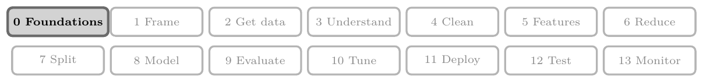
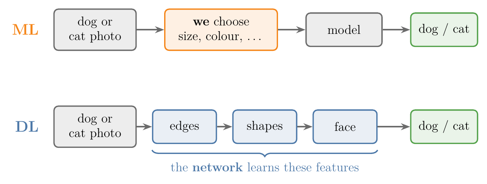
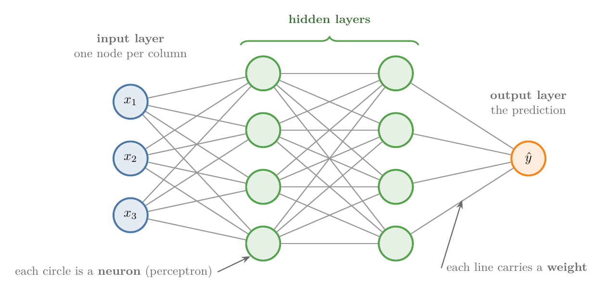
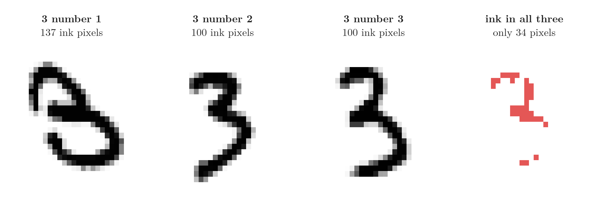
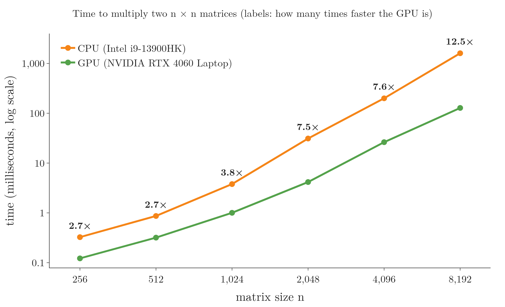
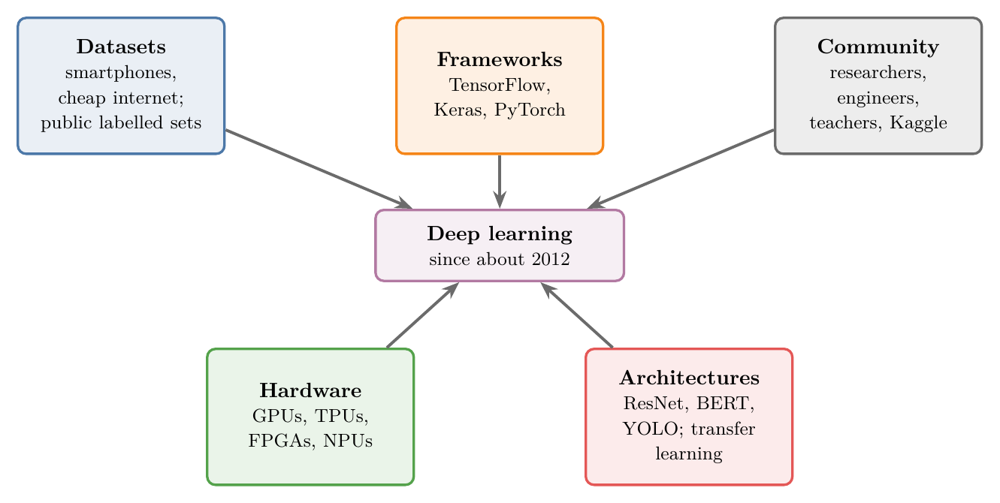

<!-- where-this-fits: generated by course_map/build_map.py; edit concepts.yaml, not this block -->
> **Where this fits:** Pipeline map step 0 (Foundations). See the [Course map](../../../00-course-map/00-course-map.md).
>
> 
>
> - **Builds on:** [Machine learning](../../../ML/01-foundations/ML-001-what-is-ml/ML-001-what-is-ml.md#2-defining-machine-learning); [Linear transformations and matrices](../../../MA/05-linear-algebra/MA-053-linear-transformations-and-matrices/MA-053-linear-transformations-and-matrices.md#7-where-ml-uses-linear-transformations); [Matrix multiplication as composition](../../../MA/05-linear-algebra/MA-054-matrix-multiplication-as-composition/MA-054-matrix-multiplication-as-composition.md#9-sources).
> - **Leads to:** [Types of neural networks](../../../DL/01-basics/DL-003-nn-types-history-applications/DL-003-nn-types-history-applications.md#2-types-of-neural-networks); [Multi-layer perceptron (MLP)](../../../DL/01-basics/DL-003-nn-types-history-applications/DL-003-nn-types-history-applications.md#21-multi-layer-perceptron-mlp); [Convolutional neural network (CNN)](../../../DL/04-cnn/DL-040-cnn-intuition/DL-040-cnn-intuition.md#1-overview).
> - **Compare with:** [Machine learning](../../../ML/01-foundations/ML-002-ai-vs-ml-vs-dl/ML-002-ai-vs-ml-vs-dl.md#4-machine-learning); [Feature engineering](../../../ML/03-feature-engineering/ML-022-what-is-feature-engineering/ML-022-what-is-feature-engineering.md#2-what-feature-engineering-is).
<!-- /where-this-fits -->

## 1. Overview

> **Key point:** Deep learning is the part of ML that uses neural networks: layers of simple units that learn their own features from raw data. Deep learning needs more data, hardware and time than ML, and it is harder to explain, but on images, text and speech it is far stronger.

The [deep learning](../../../ML/01-foundations/ML-002-ai-vs-ml-vs-dl/ML-002-ai-vs-ml-vs-dl.md#5-deep-learning) already placed **deep learning (DL)** (G-568) inside ML and showed its two big advantages: it learns features by itself, and it keeps improving with more data. This Note goes further in three directions:

1. What a neural network looks like, and the technical definition of DL built on **representation learning** (G-1670).
2. Five practical differences between DL and ML.
3. Why DL took off only after about 2012, although its ideas are much older.

{width=95%}

Figure 1 shows the idea that runs through this Note: in DL the features come from the network's layers, not from us.

## 2. Two definitions of deep learning

> **Key point:** The simple definition: DL is ML with neural networks, inspired by the brain. The technical one: DL learns its own representations, layer by layer, from raw data.

### 2.1 The simple definition: ML with neural networks

> **Key point:** ML finds the input-output relationship with statistical techniques; DL finds it with a neural network.

Both ML and DL do the same job: in **supervised learning** (G-1919; learning from examples that come with the right answer), they find the relationship between the inputs and the output. Most ML algorithms do it with statistical techniques. DL does it with a **neural network** (G-1316), a structure of simple connected units loosely inspired by the brain (see [neural networks](../../../ML/01-foundations/ML-002-ai-vs-ml-vs-dl/ML-002-ai-vs-ml-vs-dl.md#51-neural-networks)).

The reasoning behind the brain as a model is simple: to build intelligent machines, copy the most intelligent thing we know. The copy is very loose, as the [perceptron](../DL-004-perceptron/DL-004-perceptron.md#5-perceptron-and-biological-neuron) shows.

### 2.2 The parts of a neural network

> **Key point:** Neurons are arranged in layers: an input layer, one or more hidden layers and an output layer. Each connection carries a weight. Many hidden layers make a network "deep".

{height=40%}

Figure 2 shows the simplest kind of network, the **artificial neural network (ANN)** (G-216):

- Each circle is a **neuron** (G-1318), also called a **perceptron** (G-1486): the network's basic unit.
- Each line connecting two neurons carries a **weight** (G-2106), a number the network learns.
- Neurons in one column form a **layer** (G-1056). The **input layer** (G-952) takes the data, one node per **feature** (G-772; an input variable, one column of the data table). The **output layer** (G-1424) gives the prediction.
- Every layer in between is a **hidden layer** (G-890). We can add as many as we like.

A network with many hidden layers is called **deep**, and this is where the name "deep learning" comes from.

The ANN is only one type of network. Three others:

- **convolutional neural networks (CNNs)** (G-484) work best on images;
- **recurrent neural networks (RNNs)** (G-1647) work on speech and text;
- **generative adversarial networks (GANs)** (G-840) create new images and text.

The [types of neural networks](../DL-003-nn-types-history-applications/DL-003-nn-types-history-applications.md#2-types-of-neural-networks) describes each one.

### 2.3 The technical definition: representation learning

> **Key point:** Representation learning means the algorithm finds the useful features in raw data by itself, instead of us engineering them by hand.

Start with a task that looks easy: read a handwritten 3. Figure 3 shows three 3s written by three people.

We see the same digit three times. The pixels do not agree:

1. Each image is a grid of 28 rows and 28 columns of pixels:
   $$28 \times 28 = 784$$
   The three 3s put ink on 137, 100 and 100 of those pixels.
2. Only 34 pixels are ink in all three images (the red panel).
3. So a hand-written rule such as "these pixels must be dark" fits one 3 and fails on the next.

A rule on raw pixels does not work. We need descriptions that stay the same when the handwriting changes, such as "a curve open to the left, twice". Such a description is a **feature**, and a set of features that describes the data well is a **representation** (G-2260). Writing these features by hand for every digit, face or word is not practical, so we let the algorithm find them.

A more technical definition reads: deep learning is part of the broader family of ML methods based on artificial neural networks **with representation learning**. Its algorithms use multiple layers to progressively extract higher-level features from the raw input.

**Representation learning** (also called **feature learning**) is a set of techniques that let a system discover, from raw data, the features it needs for a task. Representation learning replaces manual [feature engineering](../../../ML/03-feature-engineering/ML-022-what-is-feature-engineering/ML-022-what-is-feature-engineering.md#2-what-feature-engineering-is) (G-761): the machine both learns the features and uses them.

Take a dog-vs-cat classifier:

- **With ML**, we design the features ourselves: size (dogs are usually bigger), colour, and other physical attributes. Then we give these features to the algorithm.
- **With DL**, we give the network the image itself, pixel by pixel, in the right format. The network extracts the features on its own.

### 2.4 Layers extract features of rising complexity

> **Key point:** Early layers find edges, middle layers find shapes, late layers find whole objects such as faces.

The second half of the technical definition says how the layers share the work. In a dog-vs-cat or face classifier:

1. The first hidden layers detect **primitive features**: edges.
2. The next layers combine edges into **shapes**.
3. The deepest layers combine shapes into **high-level concepts**: a face, a digit, a letter.

How can a neuron detect an edge at all? Its weights are positive on a short strip of pixels and negative around the strip, so its weighted sum is large only when that strip is bright and its surroundings are dark. [Detecting an edge with one hidden node](../DL-009-mlp-intuition/DL-009-mlp-intuition.md#45-what-a-hidden-node-can-detect) shows one such neuron.

The output layer then gives the answer. [Layers building up understanding](../../../ML/01-foundations/ML-002-ai-vs-ml-vs-dl/ML-002-ai-vs-ml-vs-dl.md#53-layers-build-up-understanding) animates the same idea for a handwritten 7.

We can watch representation learning happen. Figure 4 trains a small network on the MNIST handwritten digits (LeCun et al. 1998) and looks inside it.

1. **The network.** It takes the 784 pixels of a digit, passes them through hidden layers of 64 and 32 neurons, and outputs one of 10 digits.
2. **Raw pixels.** Squeezed to two dimensions, the 3s, 5s and 8s overlap: for only 56 percent of them, the **nearest neighbour** (the closest other dot in the picture) is the same digit.
3. **Before training (epoch 0).** The hidden layer holds random features, and the digits are just as mixed (48 percent).
4. **Training.** After each **epoch** (G-696), one pass over the 60,000 training images, the hidden layer's 32 numbers group the digits better: 64, 69 and 78 percent after 1, 2 and 5 epochs.
5. **After 10 epochs.** The three digits form three clear groups (87 percent), and the network labels 96.9 percent of the test images correctly.

Nobody told the network which features to compute. It changed its hidden layer, step by step, into numbers that keep similar digits together: the representation it learned.

## 3. Why deep learning became famous

> **Key point:** Two reasons: it applies to a huge range of problems, and in many of them it gives the best results ever recorded, sometimes better than human experts.

### 3.1 Applicability

> **Key point:** The same family of methods works on images, speech, text, medicine, science and games.

DL is used in many fields:

- computer vision;
- speech recognition;
- **natural language processing (NLP)** (G-1305);
- **machine translation** (G-1141);
- bioinformatics;
- drug design;
- medical image analysis;
- climate science;
- material inspection;
- board-game programs.

Few methods reach that many fields.

{width=80%}

Figure 5 shows the reach: one family of methods, ten very different fields.

### 3.2 Performance

> **Key point:** In many fields DL holds the state-of-the-art result, and in some it beats human experts.

In most of these fields, the best results today come from DL. In March 2016 the program AlphaGo, built on deep networks, beat Lee Sedol, one of the world's best players of the board game Go, by 4 games to 1 (Silver et al. 2017). Self-driving cars, new drug candidates and new chemistry research are further examples.

## 4. Five differences between DL and ML

> **Key point:** DL needs more data, stronger hardware and longer training, but it predicts fast, learns its own features, and is hard to interpret.

{width=75%}

Figure 6 is the balance this section weighs: four costs on the left, two gains on the right.

### 4.1 Data

> **Key point:** With little data ML wins; with lots of data DL keeps improving while ML levels off.

DL is **data hungry** (G-534): its results become reliable only with a lot of data. Figure 10 of [more data helps DL more](../../../ML/01-foundations/ML-002-ai-vs-ml-vs-dl/ML-002-ai-vs-ml-vs-dl.md#54-more-data-helps-dl-more) shows the classic curves. With little data, ML performs better; beyond some amount, ML stagnates while DL keeps rising.

### 4.2 Hardware

> **Key point:** ML trains on an ordinary CPU; DL needs a GPU, because it multiplies very large matrices.

A neural network does huge numbers of matrix multiplications. A **GPU** (G-856; graphics processing unit, a chip built for many small calculations at once) with plenty of memory does them in parallel, while a CPU does them slowly. So ML runs on cheap hardware, and DL needs costly hardware.

Figure 7 measures the difference on one laptop. Each point is the time to multiply two square matrices of random numbers, the operation a network repeats millions of times.

The time axis is a **log scale**: each gridline up is ten times the one below (0.1, 1, 10, 100, 1,000 milliseconds), so a fixed gap between the two lines means a fixed ratio of times.

- **Small matrices** ($256 \times 256$): the GPU is 2.7 times faster.
- **Large matrices** ($8192 \times 8192$): the CPU takes 1.6 seconds and the GPU 0.13 seconds, 12.5 times faster.

The bigger the matrices, the more of the work the GPU can do at the same time, and the larger its lead.

### 4.3 Training time and prediction time

> **Key point:** DL trains slowly (days to months on big data) but predicts fast; ML trains in minutes to hours, and its prediction speed depends on the algorithm.

- **Training time:** a DL model on a large dataset can train for weeks, and some research models for months. Most ML models train in minutes, at most hours.
- **Prediction time:** a trained network predicts quickly, because a prediction is only a fixed series of matrix products (the [forward propagation](../DL-010-forward-propagation/DL-010-forward-propagation.md#4-layer-1-as-one-matrix-product) shows it). In ML it varies: [KNN](../../../ML/07-classification/ML-085-knn/ML-085-knn.md#2-how-knn-predicts), for example, predicts slowly because it compares the new point with every stored **observation** (G-1374; one record, one row of the data table).

### 4.4 Feature selection

> **Key point:** In ML we build the features with domain experts; in DL the network extracts them.

Suppose we predict whether a student will be placed from the content of their resume:

- **With ML**, we extract features first: 12th marks, 10th marks, number of achievements, number of courses, quality of college. Choosing them needs domain experts, such as HR staff or teachers.
- **With DL**, we give the whole resume, in a suitable form, to the network. The network extracts the features behind the scenes and predicts.

Letting the network extract the features is representation learning (section 2.3), and it is one of DL's biggest practical benefits.

### 4.5 Interpretability

> **Key point:** A trained network is a black box: it cannot say why it gave an answer. Linear models and decision trees can.

**Interpretability** (G-965) is how well people can understand why a model makes its decisions. The features a network learns are internal numbers that no one chose, so we cannot say what each one means. A trained network is a **black box** (G-311): it gives an answer without the reasons.

Interpretability matters wherever we must justify a decision. Suppose a social network bans users based on their comments, using a DL model. A banned user asks why, and we have no answer.

ML models are often much easier to explain:

- **Logistic regression** (G-1120) on CGPA and IQ learns one weight for each input: $w_1$ for CGPA and $w_2$ for IQ. The larger weight marks the more important input (on inputs of similar scale), so we can tell a student "your CGPA is too low".
- **A decision tree** (G-561) is a flowchart of questions, so it shows exactly why a point got its class (see the [decision trees](../../../ML/08-trees-and-ensembles/ML-091-decision-trees-intuition/ML-091-decision-trees-intuition.md#2-a-decision-tree-is-nested-if-else)).

> **Extra:** Researchers have built tools that explain single predictions of any model, including networks, such as LIME and SHAP, and heat maps of the image regions a CNN used. LIME, for example, fits a simple model that imitates the network near one input (Ribeiro et al. 2016, §3). So these tools explain the network from outside; its own weights stay unreadable.

### 4.6 DL does not replace ML

> **Key point:** Use a needle to sew and a sword to fight: pick ML or DL to fit the problem.

| | Machine learning | Deep learning |
|---|---|---|
| Data | works with little data, levels off | needs a lot, keeps improving |
| Hardware | CPU | GPU (or TPU) |
| Training time | minutes to hours | hours to months |
| Prediction time | depends on the algorithm (KNN is slow) | fast |
| Features | engineered by us | learned by the network |
| Interpretability | often high (linear models, trees) | low: a black box |

Since DL is so strong, why not use it everywhere? Because on small or tabular data (data in rows and columns, like a spreadsheet; section 4.1; Grinsztajn et al. 2022), or when decisions must be explained (section 4.5), ML is the better tool. An old saying puts it well: where a needle is needed, a sword is no use. Section 6 of the [choosing between ML and DL](../../../ML/01-foundations/ML-002-ai-vs-ml-vs-dl/ML-002-ai-vs-ml-vs-dl.md#6-choosing-between-ml-and-dl) gives the rule of thumb for choosing.

## 5. Why deep learning took off after 2010

> **Key point:** Five forces: large public datasets, faster hardware, easy frameworks, ready-made architectures, and a large community.

The core ideas of neural networks are decades old (the [history of deep learning](../DL-003-nn-types-history-applications/DL-003-nn-types-history-applications.md#3-history-of-deep-learning) tells the story), yet DL became famous only around 2012. Figure 8 shows the five forces behind the change.

{height=42%}

### 5.1 Datasets

> **Key point:** Smartphones and cheap internet created huge amounts of data; big companies labelled some of it and made it public.

Around 2010 two revolutions met: smartphones, and much cheaper mobile internet (in India, Jio's free and then very cheap data from 2016). With billions of people on social media apps, the amount of data generated every year began to grow exponentially.

Raw data alone is not enough. To train a dog-vs-cat classifier we need photos **labelled** "dog" or "cat", and a photo uploaded to a social network carries no such label. Companies such as Microsoft, Google and Facebook paid to label large datasets, and then released them as **public datasets** (G-1590) that anyone may use, because open data speeds up research for everyone:

| Data type | Public dataset | Contents |
|---|---|---|
| Images | Microsoft COCO | images with a labelled box around every object; used for object detection |
| Video | YouTube-8M | about 6.1 million labelled online video clips |
| Text | SQuAD | about 150,000 questions and answers on Wikipedia articles |
| Audio | Google AudioSet | about 2 million labelled sound clips in over 600 categories |

Thousands more are available today, for example on Kaggle. Without data there would be no deep learning, so datasets are the biggest single reason.

### 5.2 Hardware

> **Key point:** Moore's law made chips steadily faster and cheaper, and GPUs turned out to do a network's matrix maths in parallel, 10 to 20 times faster than a CPU.

**Moore's law** (G-1261), stated by Intel co-founder Gordon Moore, says that the number of transistors on a microchip doubles about every two years. Electronics therefore get faster and cheaper every year: phones went from about 128 MB of memory in the mid-2000s to 12 GB today.

Around 2010, researchers realised that a network's matrix multiplications can run in parallel, just like the graphics work a GPU was built for. NVIDIA's **CUDA** (G-514), a platform for programming GPUs, made this practical, and training on GPUs became the norm. A GPU typically cuts training time by a factor of 10 to 20 compared with a CPU.

Once the speed-up was clear, chips designed for DL followed:

- **FPGA** (G-800; field-programmable gate array): a reprogrammable chip that is fast and low-power, but expensive. Microsoft runs much of its search engine's AI on FPGAs.
- **ASIC** (G-217; application-specific integrated circuit): a chip custom-made for one job, costly to design but cheap in large numbers. Examples: Google's **TPU** (G-1996; tensor processing unit), the small **Edge TPU** for drones, smartwatches and smart glasses, and the **NPU** (G-1359; neural processing unit) in phones.

Which hardware to use depends on the job:

| Situation | Hardware |
|---|---|
| Learning, small projects | CPU |
| Training large networks | GPU (e.g. NVIDIA RTX series) or TPU |
| DL inside a phone app | mobile CPU or GPU, digital signal processors, NPU |
| DL on a smartwatch, drone or smart glasses | Edge TPU or NPU |

### 5.3 Frameworks

> **Key point:** Libraries do the hard maths behind the scenes, as scikit-learn does for ML: TensorFlow with Keras in industry, PyTorch in research.

Writing a network's training code from scratch takes longer than the problem it solves. Deep learning needed libraries that handle this code, just as scikit-learn does for ML. Two families dominate:

- **TensorFlow (Google)** (G-1959): Google built an internal framework, DistBelief, in 2011, and released TensorFlow publicly in 2015. TensorFlow was powerful but hard to use, so **Keras** (G-1003), a simpler library running on top of it, became popular. Since TensorFlow 2.0 (2019), Keras is built in.
- **PyTorch (Facebook, now Meta)** (G-1595): released in 2016, it became the favourite of researchers. Facebook's Caffe2, a library for running models on servers, was merged into it in 2018.

Today TensorFlow with Keras is used more in industry, and PyTorch more in research. Converting a model from one to the other is awkward, so drag-and-drop tools appeared that build a network in a browser and export code for either: Google's AutoML, Microsoft's Custom Vision and Apple's Create ML.

### 5.4 Architectures and transfer learning

> **Key point:** Researchers publish trained state-of-the-art networks; we download one and apply it to our problem instead of designing our own.

A network's **architecture** (G-209) is how its nodes are connected by weights: how many nodes, what kind, and which connections. Different problems need different architectures, and finding a good one takes many experiments, which cost time, effort and money.

Instead, we can reuse an architecture that researchers already designed and trained on a big dataset. Downloading such a trained network and applying it to our own problem is called **transfer learning** (G-2005), taught in detail later. Well-known ready-made architectures:

| Task | Architecture |
|---|---|
| Image classification | ResNet |
| Text classification, other language tasks | BERT (a transformer) |
| Image segmentation | U-Net |
| Image-to-image translation | pix2pix |
| Object detection | YOLO (You Only Look Once) |
| Speech generation | WaveNet |

These models reach the best known accuracy, in some tasks above human level, and transfer learning made adopting DL far easier.

### 5.5 Community

> **Key point:** People who believed in neural networks through decades of failure, plus today's engineers, teachers, students and communities like Kaggle.

None of the above would exist without people. Researchers worked on neural networks from the 1960s and failed several times before succeeding around 2012. Today engineers, teachers, students and communities such as Kaggle keep the field moving.

## 6. Summary

| Reason DL took off | What changed |
|---|---|
| Datasets | smartphones and cheap internet; public labelled datasets (COCO, YouTube-8M, SQuAD, AudioSet) |
| Hardware | Moore's law; GPUs with CUDA; FPGAs, TPUs, Edge TPUs, NPUs |
| Frameworks | TensorFlow with Keras (industry), PyTorch (research) |
| Architectures | ready-made trained networks (ResNet, BERT, YOLO) and transfer learning |
| Community | researchers, engineers, teachers, students, Kaggle |

- DL is ML with neural networks: neurons in an input layer, hidden layers and an output layer, joined by weights.
- Many hidden layers make a network deep.
- Representation learning: the network learns its own features, edges first and whole objects last.
- DL needs more data, a GPU and longer training, predicts fast, and is a black box.
- ML stays the better choice for small or tabular data and when decisions must be explained.

## 7. Sources

**Built from**

- CampusX, "What is Deep Learning? Deep Learning Vs Machine Learning | Complete Deep Learning Course", YouTube, https://www.youtube.com/watch?v=fHF22Wxuyw4
- Sanderson, G. (3Blue1Brown), "But what is a neural network? | Deep learning chapter 1", 2017, https://www.youtube.com/watch?v=aircAruvnKk (the three different 3s; an edge neuron's weights)

**Other references**

- LeCun, Y., Bottou, L., Bengio, Y. and Haffner, P. (1998). Gradient-Based Learning Applied to Document Recognition. *Proceedings of the IEEE* 86(11). (The MNIST digits.)
- Silver et al., "Mastering the game of Go without human knowledge", *Nature*, 2017 (AlphaGo against Lee Sedol, March 2016).
- Ribeiro, Singh and Guestrin, "Why Should I Trust You? Explaining the Predictions of Any Classifier", KDD 2016 (LIME). Lundberg and Lee, "A Unified Approach to Interpreting Model Predictions", NeurIPS 2017 (SHAP).
- Grinsztajn, Oyallon and Varoquaux, "Why do tree-based models still outperform deep learning on typical tabular data?", NeurIPS 2022 (Datasets and Benchmarks).

## 8. Key terms

| Term | Meaning |
|---|---|
| Artificial neural network (ANN) | The simplest neural network: neurons in layers, each layer connected to the next by weights |
| Neuron (in a network) | One unit of a neural network; in an ANN, a perceptron |
| Weight (in a network) | A learned number on a connection between two neurons |
| Input layer | The first layer, with one node per feature |
| Output layer | The last layer, which gives the prediction |
| Hidden layer | Any layer between the input and output layers |
| Epoch | One pass of training over all the training data |
| Deep network (G-570) | A neural network with many hidden layers |
| Representation (G-2260) | A set of features that describes the data; a good one stays the same when unimportant details (such as handwriting) change |
| Representation learning (feature learning) | Letting the algorithm discover useful features from raw data, instead of engineering them by hand |
| Data hungry | Needing a lot of data before results become reliable |
| Public dataset | A labelled dataset released for anyone to use |
| Moore's law | The number of transistors on a chip doubles about every two years |
| CUDA | NVIDIA's platform for programming GPUs |
| FPGA | A reprogrammable chip: fast and low-power, but expensive |
| ASIC | A chip custom-made for one job, such as the TPU |
| Edge TPU | A small Google chip for running networks on drones, watches and glasses |
| NPU | A neural processing unit: a chip in phones that speeds up networks |
| Architecture (of a network) | How a network's nodes are connected: how many, of what kind, and which connections |
| Transfer learning | Reusing a network trained by others on a big dataset for our own problem |
