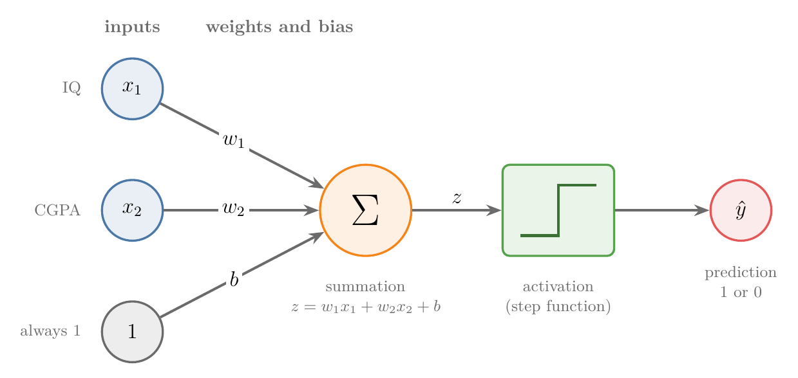
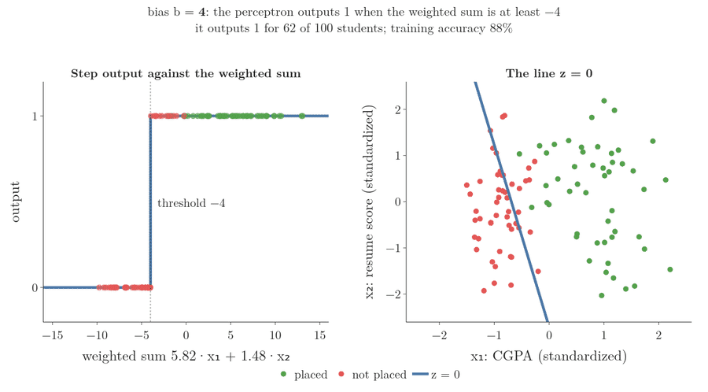
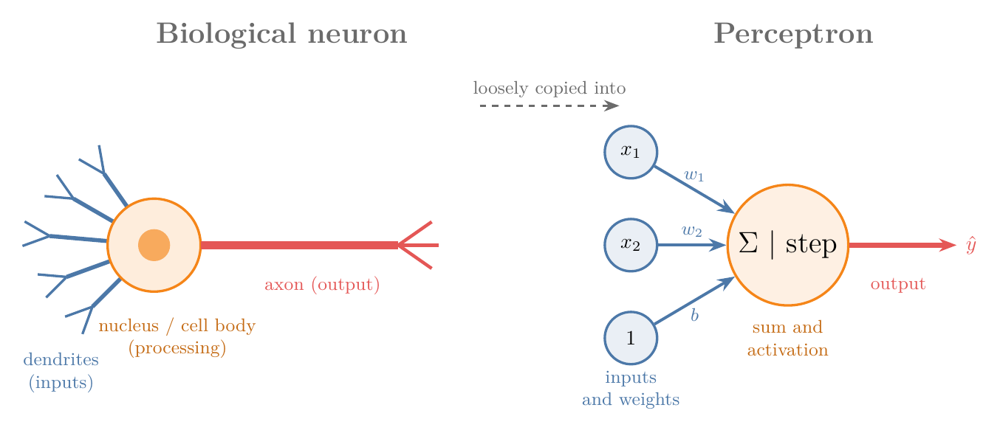
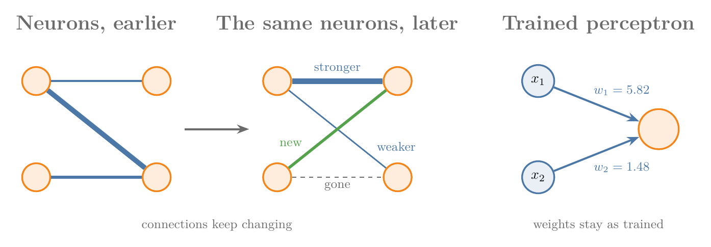
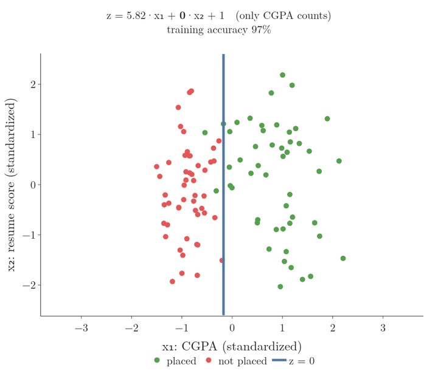
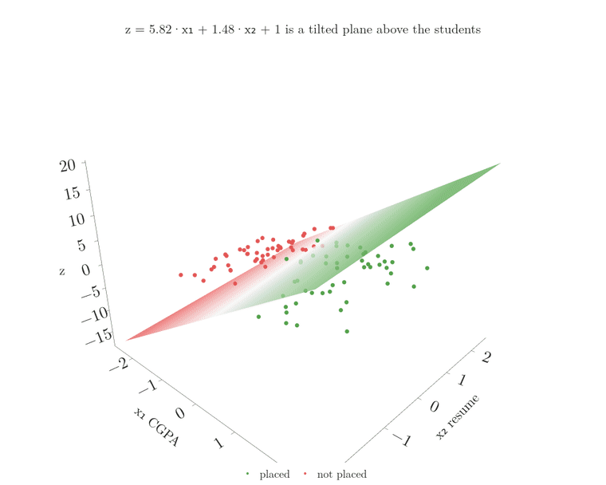

<!-- where-this-fits: generated by course_map/build_map.py; edit concepts.yaml, not this block -->
> **Where this fits:** Pipeline map step 8 (Model). See the [Course map](../../../00-course-map/00-course-map.md).
>
> 
>
> - **Builds on:** [Perceptron trick](../../../ML/07-classification/ML-069-perceptron-trick/ML-069-perceptron-trick.md#5-the-perceptron-trick); [Dot product](../../../MA/05-linear-algebra/MA-050-dot-product-and-cosine-similarity/MA-050-dot-product-and-cosine-similarity.md#3-computing-the-dot-product); [Equation of a hyperplane](../../../MA/05-linear-algebra/MA-051-equation-of-a-hyperplane/MA-051-equation-of-a-hyperplane.md#4-the-vector-form).
> - **Leads to:** [Problem with the perceptron (XOR)](../../../DL/01-basics/DL-007-problem-with-perceptron/DL-007-problem-with-perceptron.md#1-overview); [Multi-layer perceptron (MLP)](../../../DL/01-basics/DL-009-mlp-intuition/DL-009-mlp-intuition.md#1-overview); [Activation functions](../../../DL/02-training/DL-027-activation-functions/DL-027-activation-functions.md#3-what-an-activation-function-is).
<!-- /where-this-fits -->

## 1. Overview

> **Key point:** A perceptron multiplies each input by a weight, adds a bias, and passes the sum through an activation function. With a step activation it defines one hyperplane (a straight line for two inputs) and puts each class on one side.



The **perceptron** (G-1486) is the building block of every **neural network** (G-1316; see [deep learning as ML with neural networks](../DL-002-what-is-deep-learning/DL-002-what-is-deep-learning.md#21-the-simple-definition-ml-with-neural-networks)). It is also a **supervised learning** (G-1919) algorithm in its own right, like linear regression or logistic regression. Figure 1 shows its whole design.

This Note covers four things:

- the parts of the model (section 3);
- training and prediction (section 4);
- how it compares with a brain cell (section 5);
- what it does geometrically (section 7).

How the perceptron learns its weights starts with the [perceptron trick](../DL-005-perceptron-trick/DL-005-perceptron-trick.md#3-the-trick-in-one-picture).

## 2. Prerequisites

- The general form of a line, its positive and negative sides, and the step function: the [perceptron trick](../../../ML/07-classification/ML-069-perceptron-trick/ML-069-perceptron-trick.md#3-the-line-and-its-two-sides), sections 3 and 7.
- Lines, planes and hyperplanes: the [equation of a hyperplane](../../../MA/05-linear-algebra/MA-051-equation-of-a-hyperplane/MA-051-equation-of-a-hyperplane.md#3-from-a-line-to-a-hyperplane).
- The dot product: the [dot product](../../../MA/05-linear-algebra/MA-050-dot-product-and-cosine-similarity/MA-050-dot-product-and-cosine-similarity.md#3-computing-the-dot-product).

## 3. The parts of a perceptron

> **Key point:** Inputs, weights, a bias, a summation block that computes z, and an activation function that turns z into the output.

### 3.1 Inputs, weights and bias

> **Key point:** Each input has its own weight; the bias is the weight on a constant input of 1.

In Figure 1, the data enters on the left. Each **feature** (G-772; an input variable, one column of the data table) gets one input node: $x_1$ and $x_2$.

- The connection from each input carries a **weight** (G-2106; $w_1$, $w_2$; see [the parts of a neural network](../DL-002-what-is-deep-learning/DL-002-what-is-deep-learning.md#22-the-parts-of-a-neural-network)). The weight says how strongly that input counts.
- One extra input is always 1. Its connection carries the **bias** (G-284) $b$. The bias sets how easily the perceptron outputs 1, and it lets the line sit anywhere, not only through the origin (section 3.4).

The weights and the bias are the numbers the perceptron learns. Together they are its [parameters](../../../ML/01-foundations/ML-006-instance-vs-model-based/ML-006-instance-vs-model-based.md#4-model-based-learning) (G-1448): the numbers a trained model is described by.

### 3.2 The summation

> **Key point:** z is the dot product of the weights with the inputs, plus the bias.

The orange block computes the **summation** (G-1915), a **weighted sum** (G-2119) of the inputs:

1. **In words:** multiply each input by its weight, add them up, and add the bias.
2. **Formula:**
   $$z = w_1 x_1 + w_2 x_2 + b$$
3. **Example:** with $w_1 = 1$, $w_2 = 2$, $b = 3$ and inputs $x_1 = 100$, $x_2 = 5.1$, the bias input is always 1:
   $$w_1 x_1 = 1 \times 100 = 100$$
   $$w_2 x_2 = 2 \times 5.1 = 10.2$$
   $$b \times 1 = 3 \times 1 = 3$$
   $$z = 100 + 10.2 + 3 = 113.2$$

The sum $w_1x_1 + w_2x_2$ is the **dot product** (G-634) of the weight vector with the input vector (a vector is a list of numbers, here $(w_1, w_2)$ and $(x_1, x_2)$; see the [dot product](../../../MA/05-linear-algebra/MA-050-dot-product-and-cosine-similarity/MA-050-dot-product-and-cosine-similarity.md#3-computing-the-dot-product)).

### 3.3 The activation function

> **Key point:** The activation function maps z, which can be any number, into a fixed range. The perceptron uses the step function: 1 if z ≥ 0, else 0.

$z$ can be any number, large or small, positive or negative. The green block in Figure 1 is the **activation function** (G-165): a function that brings $z$ into a fixed range.

The classic perceptron uses the [step function](../../../ML/07-classification/ML-069-perceptron-trick/ML-069-perceptron-trick.md#72-predicting) (G-1889): output 1 when $z \geq 0$ and 0 otherwise. Other activation functions exist (sigmoid, tanh, ReLU and more), with ranges such as 0 to 1 or −1 to 1. They are compared in [activation functions](../../02-training/DL-027-activation-functions/DL-027-activation-functions.md#3-what-an-activation-function-is).

### 3.4 The bias as a threshold

> **Key point:** The perceptron outputs 1 when the weighted sum of the inputs is at least −b. So the bias sets how large the weighted sum must be before the output switches to 1.

In plain words, the bias decides how easily the perceptron says 1. A large positive bias makes it say 1 for almost any input; a large negative bias makes it hard to convince.

The standard term for this switching point is the **threshold** (G-2261). The steps:

1. The step function outputs 1 when $z \geq 0$.
2. $z$ is the weighted sum plus the bias: $z = (w_1x_1 + w_2x_2) + b$.
3. So the output is 1 exactly when $w_1x_1 + w_2x_2 \geq -b$. The threshold is $-b$.

For example, with $b = -10$ the perceptron outputs 1 only when the weighted sum reaches 10.

Figure 2 shows the threshold on real data: the perceptron trained in section 8 on 100 students. Its score is

$$z = 5.82\thinspace x_1 + 1.48\thinspace x_2 + b$$

The weights stay as they are and only $b$ changes.

{width=90%}

| Bias $b$ | Threshold $-b$ | Students given output 1 | Training accuracy |
|---|---|---|---|
| 4 | −4 | 62 of 100 | 88 percent |
| 1 (the trained value) | −1 | 49 of 100 | 97 percent |
| −4 | 4 | 32 of 100 | 82 percent |

- **Left panel:** as $b$ falls, the jump of the step function slides to the right, and fewer students pass it.
- **Right panel:** the same change, seen on the two inputs. The line $z = 0$ keeps its direction, because the weights set the direction. The bias only moves the line parallel to itself. With $b = 0$ the line passes through the origin, so without a bias the perceptron could only draw lines through the origin.

## 4. Training and prediction

> **Key point:** Training finds the weights and bias from labelled data. Prediction puts a new **observation** (G-1374; one record, one row of the data table) through the perceptron with those fixed numbers.

Take 1,000 students. Each student is one observation, with two features, IQ and CGPA, and a **target** (G-1949; the output we predict): placed (1) or not (0). One student might be IQ 78, CGPA 7.8, placed 1; another IQ 69, CGPA 5.1, placed 0. We want a model that predicts placement for a new student.

Like any ML algorithm, the perceptron works in two stages:

1. **Training:** feed the students one by one ($x_1$ = IQ, $x_2$ = CGPA), compare the output with the true label, and adjust $w_1$, $w_2$ and $b$. The goal of training is only these three numbers.
2. **Prediction:** with the learned numbers fixed, compute $z$ for a new student and pass it through the step function.

Suppose training gave $w_1 = 1$, $w_2 = 2$ and $b = 3$. A new student has IQ 100 and CGPA 5.1. Section 3.2 already computed $z = 113.2$. Since $z \geq 0$, the step function outputs 1: we predict this student will be placed.

Figure 3 runs prediction on real data. This dataset is different from the IQ example above: it is the one used in section 8, with 100 students and two features, CGPA and a resume score. The perceptron was trained there, with both inputs standardized (**standardization**, G-1874: rescaled to mean 0 and standard deviation 1). Its learned numbers are $w_1 = 5.82$, $w_2 = 1.48$ and $b = 1$.

{width=100%}

Watch the bar: its sign alone decides the output. Student 4 has $z = 1.19$, just above 0, and lands close to the line. The last frame is the straight **decision boundary** (G-555) of section 7, with 97 of the 100 students on their correct side. The three circled students are the ones on the wrong side.

### 4.1 More inputs

> **Key point:** One more feature means one more input node and one more weight; nothing else changes.

If we also know each student's state (encoded as a number, see the [one-hot encoding](../../../ML/03-feature-engineering/ML-026-one-hot-encoding/ML-026-one-hot-encoding.md#22-one-column-per-category)), we add an input $x_3$ with weight $w_3$:

$$z = w_1x_1 + w_2x_2 + w_3x_3 + b$$

With $n$ inputs, $z$ is the sum of $n$ products plus the bias. The summation and the activation stay as they are.

## 5. Perceptron and biological neuron

> **Key point:** The perceptron is loosely inspired by a brain cell, but it is far simpler and is not a copy of it.



The nervous system is a network of billions of **neurons**, the brain cells (**neuron**, G-1318). Figure 4 sets one beside a perceptron:

| Neuron | Role | Perceptron |
|---|---|---|
| **Dendrites** | receive signals | inputs and weights |
| **Nucleus** (cell body) | processes them | summation and activation |
| **Axon** | sends the result on | output |

Neurons connect to each other to form the nervous system; perceptrons connect to each other to form a neural network. The similarity ends there.

### 5.1 Three differences

> **Key point:** A neuron is complex, its processing is not understood, and its connections change over time. A perceptron is simple, its processing is two known operations, and its connections are fixed once trained.

1. **Complexity:** a neuron takes a very large number of inputs and is wired to many other neurons. A perceptron has a handful of inputs and one output.
2. **Processing:** inside a neuron, electrochemical reactions decide the output, and scientists still do not fully understand them. Inside a perceptron there are exactly two operations: a weighted sum and a step.
3. **Neuroplasticity** (G-1319): the connections between neurons get stronger or weaker over time, disappear, or form anew; this is how we learn new skills. A trained perceptron's connections (its weights) do not change.

{width=90%}

Figure 5 draws the third difference: the arrows between neurons thicken, thin, vanish or appear as time passes, while the perceptron's arrows stay the same.

So the perceptron is weakly inspired by the neuron. Calling it a model of the brain would be wrong.

## 6. Weights as feature importance

> **Key point:** A bigger weight means a stronger connection: that input has more say in the decision.

Suppose training on the placement data gave $w_1 = 2$ for IQ, $w_2 = 4$ for CGPA and $b = 1$. The weight of CGPA is twice the weight of IQ. So, for this model, CGPA matters about twice as much as IQ in deciding placement. The box below gives another way to see it.

In this way the weights tell us the **feature importance** (G-764) of each input. The bias does not belong to any input; its role is to shift the line (Section 7).

Figure 6 shows what a weight does to the decision. It takes the trained perceptron of section 8, on standardized CGPA ($x_1$) and resume score ($x_2$):

$$z = 5.82\thinspace x_1 + 1.48\thinspace x_2 + 1$$

The figure keeps $w_1$ and $b$ and changes only $w_2$.



1. **$w_2 = 0$.** The resume score has no say: only CGPA decides, and the line is vertical. Training accuracy is already 97 percent.
2. **$w_2 = 1.48$, the trained value.** The resume score counts a little; the line leans slightly. Accuracy is 97 percent.
3. **$w_2 = 5.82$, equal to $w_1$.** Both inputs count equally, and the line runs diagonally. Accuracy falls to 81 percent, because in this data CGPA matters far more than the resume score.

The bigger a weight compared with the others, the more the line turns to follow that input.

> **Another way to see it:** Reading weights as importance is only fair when the inputs are on the same scale. IQ runs to about 150 while CGPA stops at 10, so a weight on IQ is multiplied by much bigger numbers. Standardize the inputs first (see the [standardization](../../../ML/03-feature-engineering/ML-023-standardization/ML-023-standardization.md#42-the-formula)) and then compare the size of the weights. Section 8 shows a case where the raw weights even get the sign wrong.

## 7. What a perceptron does geometrically

> **Key point:** z = 0 is a line (a plane in 3D, a hyperplane beyond). The perceptron predicts 1 on one side and 0 on the other: it is a binary classifier with one straight decision boundary.

Rename the weights, the bias and the inputs, one at a time:

$$w_1 \to A, \qquad w_2 \to B, \qquad b \to C$$
$$x_1 \to x, \qquad x_2 \to y$$

Then $z = w_1x_1 + w_2x_2 + b = 0$ becomes

$$Ax + By + C = 0$$

This is the general form of a line (see the [perceptron trick](../../../ML/07-classification/ML-069-perceptron-trick/ML-069-perceptron-trick.md#31-the-general-form-of-a-line), section 3).

- $z \geq 0$ is the region on the positive side of the line: predict 1, placed.
- $z < 0$ is the region on the negative side: predict 0, not placed.

Figure 7 shows where this line comes from, for the same trained perceptron. It is a 3D picture: the two horizontal axes are the two inputs, and the height is $z$. Watch how the flat sheet of heights is cut at height 0.



1. **z is a plane.** For every point of the input plane, the score $z$ gives a height. Together the heights form a tilted plane: high above the placed students, below zero under the others.
2. **The plane crosses zero along a line.** Where the height is exactly 0, we get the line $z = 0$, the blue line.
3. **The step flattens it.** The step function replaces every positive height by 1 and every negative height by 0, so the tilted plane becomes two flat terraces that meet at the blue line.

So a trained perceptron is nothing more than a line that splits the plane into two **decision regions** (G-557), one per class. This line is the perceptron's decision boundary. One line gives exactly two regions, so the perceptron is a **binary classifier** (G-302): it separates exactly two classes.

With three inputs the points live in 3D and $z = 0$ is a **plane** (G-1502), like a sheet held across a room. With four or more inputs it is a **hyperplane** (G-911; see the [equation of a hyperplane](../../../MA/05-linear-algebra/MA-051-equation-of-a-hyperplane/MA-051-equation-of-a-hyperplane.md#3-from-a-line-to-a-hyperplane)). In every case there are two regions.

### 7.1 The big limitation

> **Key point:** A perceptron only works on data that a straight decision boundary can (roughly) separate.

A perceptron can only classify [linearly separable](../../../ML/07-classification/ML-069-perceptron-trick/ML-069-perceptron-trick.md#2-when-logistic-regression-works) (G-1103) data, or data that is almost so: a few points on the wrong side only lower the accuracy. If one class surrounds the other, no line can split them and the perceptron fails, whatever we do. The [problem with the perceptron](../DL-007-problem-with-perceptron/DL-007-problem-with-perceptron.md#3-three-tiny-datasets-and-or-and-xor) shows this in code.

## 8. A perceptron in scikit-learn

> **Key point:** scikit-learn's Perceptron learns w₁, w₂ and b with fit; coef_ holds the weights and intercept_ the bias.

The data has 100 students with two inputs, CGPA and a resume score (both from 0 to 10), and the output `placed`. Fifty were placed and fifty not.

> **Python:** Training a perceptron.
>
> ```python
> import pandas as pd
> from sklearn.linear_model import Perceptron
>
> df = pd.read_csv("data/placement.csv")
> X = df[["cgpa", "resume_score"]]
> y = df["placed"]
>
> p = Perceptron(random_state=0)
> p.fit(X, y)
> p.coef_        # [[40.26, -36.0]]: w1 (CGPA), w2 (resume score)
> p.intercept_   # [-25.0]: the bias b
> ```
>
> `Perceptron` lives in `sklearn.linear_model`, next to `LogisticRegression`. `random_state` fixes the order in which it visits the observations.

So the learned line is the set of points where

$$40.26\thinspace x_1 - 36\thinspace x_2 - 25 = 0$$

Here $x_1$ is CGPA and $x_2$ is resume score.


Figure 8 (left) colours each region by the class the perceptron predicts there: green where it predicts placed, red where it predicts not placed. The grey line is the decision boundary, where the prediction switches from one class to the other. These regions are not a loss surface and need no contour reading. The line divides the data, but badly: the training accuracy is only 75%. The weight on resume score is even negative, which would mean a better resume lowers the chance of placement.

The fix is to standardize the inputs first (Figure 8, right). Training accuracy rises to 97%, and the weights become 5.82 for CGPA and 1.48 for resume score. On scaled inputs the weights also make sense as feature importance: CGPA counts about four times as much as the resume score.

Why raw inputs hurt here: each training step moves the weights by about 7 (the size of a CGPA or a resume score) but the bias by only 1, because the bias's input is the constant 1. This data needs a large bias, so the bias is like a walker taking baby steps beside two runners: training ends before the bias gets where it needs to be.

> **Extra:** The evidence, from the Notebook, changing one thing at a time.
>
> - Both features already share a scale (each runs from about 5 to 9.5), so the size of the numbers is not the problem; their distance from the origin is. The observations sit around $(6.9, 6.9)$.
> - Subtracting the mean alone gives 96%. Dividing by the standard deviation alone gives 50%.
> - On raw inputs, scikit-learn's early stop (**early stopping**, G-656) ends training after 7 **epochs** (G-696; full passes over the training data): it stops once the loss has not improved for `n_iter_no_change=5` epochs in a row (scikit-learn docs, Perceptron).
> - Turning the early stop off and training for 1,000 epochs on raw inputs reaches 92%, with a bias of −673. The bias does reach a large value, but only after many more epochs.
>
> The data here is small and nothing was tuned, so the raw result is not the best a perceptron can do. The aim is to see the three learned numbers and the line they describe.

> **Python:** Drawing the regions. The figure colours a fine grid of points by `p.predict`, as in the [toy project](../../../ML/01-foundations/ML-012-toy-project/ML-012-toy-project.md#9-evaluating-the-model) (Figure 7). The Notebook has the code; it uses Plotly instead of the `mlxtend` library's `plot_decision_regions`.

## 9. Summary

| Part | What it does | In the placement example |
|---|---|---|
| Inputs $x_1, x_2$ | the observation's feature values | CGPA, resume score |
| Weights $w_1, w_2$ | how much each input counts | learned on raw inputs: 40.26, −36; on standardized inputs: 5.82, 1.48 |
| Bias $b$ | shifts the line | learned on raw inputs: −25; on standardized inputs: 1 |
| Summation | $z = w_1x_1 + w_2x_2 + b$ | one number per student |
| Activation (step) | 1 if $z \geq 0$, else 0 | placed or not |

- A perceptron is a weighted sum plus a bias, followed by an activation function.
- The bias is a threshold: the output is 1 when the weighted sum is at least $-b$. Changing the bias moves the line without turning it.
- Training finds the weights and bias; prediction applies them to a new observation.
- It is loosely inspired by a neuron (dendrites, nucleus, axon) but far simpler, and its weights are fixed once trained.
- On standardized inputs, larger weights mean more important inputs.
- Geometrically it is a line, plane or hyperplane: a binary classifier for linearly separable data only.

## 10. Sources

**Built from**

- CampusX, "What is a Perceptron? Perceptron Vs Neuron | Perceptron Geometric Intuition", YouTube, https://www.youtube.com/watch?v=X7iIKPoZ0Sw
- Sanderson, G. (3Blue1Brown), "But what is a neural network? | Deep learning chapter 1", 2017, https://www.youtube.com/watch?v=aircAruvnKk (the bias as the level the weighted sum must pass)

**Other references**

- scikit-learn developers, *sklearn.linear_model.Perceptron*, API reference, scikit-learn.org (parameters `tol`, `n_iter_no_change`, `max_iter`).

## 11. Key terms

| Term | Meaning |
|---|---|
| Perceptron | A model that computes a weighted sum of its inputs plus a bias and passes it through an activation function |
| Bias (of a perceptron) | The weight on a constant input of 1; it shifts the boundary away from the origin |
| Threshold (of a perceptron) (G-2261) | The value the weighted sum must reach for the output to be 1; it equals $-b$ |
| Summation ($z$) | The weighted sum $w_1x_1 + w_2x_2 + \dots + b$ inside a perceptron |
| Activation function | The function that turns $z$ into the output, bringing it into a fixed range |
| Neuron (G-1318) | A brain cell: dendrites take signals in, the nucleus processes them, the axon sends the result on |
| Dendrites, nucleus, axon | The input branches, the processing centre and the output fibre of a neuron |
| Neuroplasticity | The brain's connections strengthening, weakening, vanishing or forming over time |
| Feature importance (weights) | Reading the size of a weight as how much its input matters, fair only on scaled inputs |
| Binary classifier | A model that separates exactly two classes |
| Weight | The number each input is multiplied by; it says how strongly that input counts |
| Step function | Outputs 1 when $z \geq 0$ and 0 otherwise |
| Decision boundary | The line (plane, hyperplane) $z = 0$ where the prediction switches class |
| Decision regions | The two sides of the decision boundary, one per predicted class |
