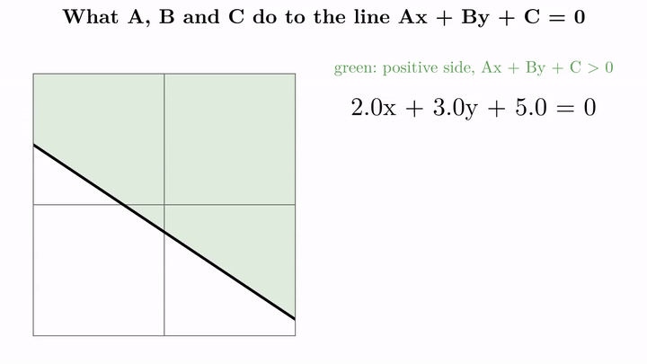
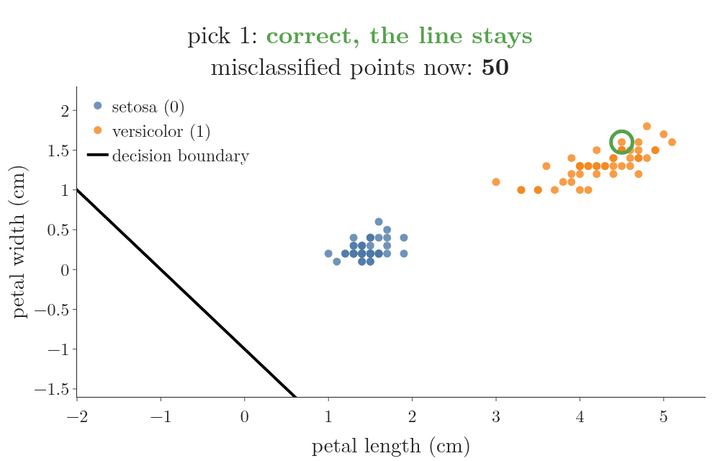
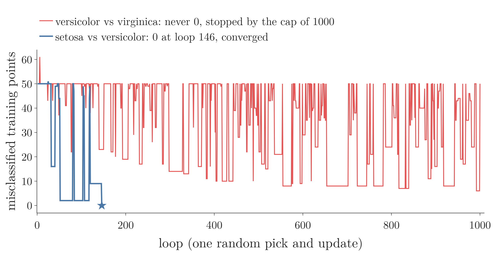

<!-- where-this-fits: generated by course_map/build_map.py; edit concepts.yaml, not this block -->
> **Where this fits:** Pipeline map step 8 (Model). See the [Course map](../../../00-course-map/00-course-map.md).
>
> 
>
> - **Builds on:** Equation of a hyperplane ([Note MA-051](../../../MA/05-linear-algebra/MA-051-equation-of-a-hyperplane/MA-051-equation-of-a-hyperplane.md)).
> - **Leads to:** Perceptron loss ([Note DL-006](../../../DL/01-basics/DL-006-perceptron-loss/DL-006-perceptron-loss.md)).
<!-- /where-this-fits -->

## 1. Overview

> **Key point:** Training a perceptron means finding its weights and bias. The perceptron trick does it by starting from any line and pulling it towards every misclassified point it picks, until a stopping rule ends the loop.

{height=48%}

The [perceptron Note](../DL-004-perceptron/DL-004-perceptron.md) showed how a trained perceptron predicts. This Note covers how it gets its numbers: the **perceptron trick** (G-1485), the simplest training method. Figure 1 shows the whole loop.

The trick itself is taught in full in two earlier Notes, and we do not repeat it here:

- the [perceptron trick Note](../../../ML/07-classification/ML-069-perceptron-trick/ML-069-perceptron-trick.md): positive and negative sides of a line, how $A$, $B$ and $C$ move it, the add-or-subtract update, the learning rate (its Figure 7 animates the line swinging towards a misclassified point in small steps), and the single rule $w \leftarrow w + \eta(y - \hat{y})x$;
- the [perceptron code Note](../../../ML/07-classification/ML-070-perceptron-code/ML-070-perceptron-code.md): the code, an animation of the line moving update by update (its Figure 3), and why the final line depends on the random order.

This Note has these parts:

1. a one-picture recap of the trick (section 3);
2. the trick in the perceptron's own terms (section 4);
3. the loop running on real data (section 5);
4. when to stop (section 6);
5. loops against epochs (section 7);
6. why the trick is not enough (section 8).

## 2. Prerequisites

- The [perceptron Note](../DL-004-perceptron/DL-004-perceptron.md): weights, bias, summation and step activation.
- The [perceptron trick Note](../../../ML/07-classification/ML-069-perceptron-trick/ML-069-perceptron-trick.md) and the [perceptron code Note](../../../ML/07-classification/ML-070-perceptron-code/ML-070-perceptron-code.md).

## 3. The trick in one picture

> **Key point:** C slides the line, A and B turn it. Subtracting a wrongly placed negative point from (A, B, C) turns and slides the line until the point is on the correct side.

The trick works like a conversation between the line and the points. We start with any line and ask one randomly picked point: "are you on the correct side?" A point on the correct side answers "leave the line where it is". A point on the wrong side answers "come towards me", and the line moves towards that point. Repeating the question many times brings the line to a place where no point complains.

The data must be **linearly separable** (G-1103): a straight line can split the two classes. Otherwise some point always complains.

To move the line we change the three numbers of its equation $Ax + By + C = 0$. Figure 2 shows what each number does, and then one full move.

{height=42%}

In Figure 2, watch three things in order:

1. **Changing $C$** slides the line while keeping it parallel to itself.
2. **Changing $A$ or $B$** turns the line.
3. **One update.** The point $(4, 5)$ belongs to the negative class, but $2(4) + 3(5) + 5 = 28 > 0$, so it sits on the positive side: it is misclassified. We append a 1 to the point and subtract it from the coefficients:
   $$(2,\ 3,\ 5) - (4,\ 5,\ 1) = (-2,\ -2,\ 4)$$
   The new line is $-2x - 2y + 4 = 0$. The point now gives $-2(4) - 2(5) + 4 = -14 < 0$: it is on the negative side, as it should be.

The update changes all three numbers at once, so the line turns and slides in one move. For a positive point on the negative side we add instead of subtracting. In practice we do not subtract the whole point: we multiply it by a small **learning rate** (G-1068), such as 0.01, so the line moves in small steps. The [perceptron trick Note](../../../ML/07-classification/ML-069-perceptron-trick/ML-069-perceptron-trick.md) works through both cases and the learning rate.

## 4. The trick in perceptron terms

> **Key point:** The line Ax + By + C = 0 of the trick is the perceptron's z = 0. A and B are the weights, C is the bias, and the column of 1s is the bias input.

The perceptron trick works on the line $Ax_1 + Bx_2 + C = 0$. The perceptron's **decision boundary** (G-555), the line that separates the points it calls positive from those it calls negative, is $z = w_1x_1 + w_2x_2 + b = 0$. They are the same line with different names:

| Perceptron trick | Perceptron | Role |
|---|---|---|
| $A$ ($w_1$) | weight $w_1$ | how much $x_1$ counts |
| $B$ ($w_2$) | weight $w_2$ | how much $x_2$ counts |
| $C$ ($w_0$) | bias $b$ | shifts the line |
| column $x_0 = 1$ | the constant input 1 | carries the bias |

So the column of 1s added in the trick's code is exactly the extra input "1" of the perceptron diagram (Figure 1 of the [perceptron Note](../DL-004-perceptron/DL-004-perceptron.md)), and the 1 we appended to the point $(4, 5)$ in section 3 is that same input.

The two cases, add or subtract, fold into one rule. With the label $y$ and the prediction $\hat{y}$ both 0 or 1:

$$w \leftarrow w + \eta\thinspace(y - \hat{y})\thinspace x$$

Here $w = (w_0, w_1, w_2)$ holds the bias and the two weights, $x = (1, x_1, x_2)$ is the point with its 1, and $\eta$ is the learning rate. The four cases of $(y, \hat{y})$ show that the rule does the right thing every time:

| $y$ | $\hat{y}$ | $y - \hat{y}$ | What the rule does |
|---|---|---|---|
| 1 | 1 | 0 | nothing: the point is correct |
| 0 | 0 | 0 | nothing: the point is correct |
| 1 | 0 | $+1$ | adds $\eta x$: a positive point on the negative side |
| 0 | 1 | $-1$ | subtracts $\eta x$: a negative point on the positive side |

The rule changes both weights and the bias in one step.

Training and prediction then split cleanly:

1. **Training:** run the loop of Figure 1 on the labelled data. Its only output is the three numbers $w_1$, $w_2$ and $b$.
2. **Prediction:** freeze them, compute $z$ for a new point and apply the step function.

## 5. The loop on real data

> **Key point:** Each loop picks one point. A correctly classified pick leaves the line still; a misclassified pick moves it. Most picks leave the line still.

Figure 3 runs the rule of section 4 on real flowers: 50 setosa (label 0) and 50 versicolor (label 1) from the Iris dataset, described by petal length and petal width, with learning rate 0.1.

{height=42%}

In Figure 3, watch the ring and the line together:

- **Green ring:** the picked flower is on the correct side, $y - \hat{y} = 0$, and the line does not move.
- **Red ring:** the picked flower is on the wrong side, and the line jumps towards it.

Of the 146 picks in this run, only 26 move the line; the other 120 leave it still. The counter in the title shows the number of misclassified flowers after each pick. The count starts at 50, because the starting line puts every flower on the positive side, and reaches 0 at pick 146.

## 6. When to stop

> **Key point:** Either run a fixed number of loops, or stop at convergence: the moment no training point is misclassified.

The loop in Figure 1 needs a **stopping rule** (G-1894) to end it. Two are common:

1. **A fixed number of loops**, for example 1,000. If the line is not good yet, run more, such as 10,000.
2. **[Convergence](../../../ML/07-classification/ML-069-perceptron-trick/ML-069-perceptron-trick.md):** after every update, count the misclassified training points. Stop as soon as the count is 0, since no point can move the line any more.

Rule 2 only ever stops on linearly separable data: if no line separates the classes, some point is always misclassified. Data that no line separates is why the two rules are often combined: stop at convergence, or after the maximum number of loops, whichever comes first.

{height=30%}

Figure 4 runs the combined rule on real data. Watch the blue line: setosa and versicolor can be split by a line, so the count hits 0 at loop 146 and convergence stops training (the run of Figure 3). The red line, versicolor against virginica, never reaches 0 (its best is 6), so only the cap of 1,000 loops ends it. Six other random orders give the same picture.

> **Extra:** scikit-learn's `Perceptron` uses a similar combination, with a looser early stop. `max_iter` caps the number of epochs (default 1,000). With `tol` set (default $10^{-3}$), training also stops once the loss has failed to improve by at least `tol` for `n_iter_no_change` epochs in a row (default 5) (scikit-learn docs, `Perceptron`). This stop can fire before every point is classified correctly: in the [perceptron Note](../DL-004-perceptron/DL-004-perceptron.md), section 8, it ended training after 7 epochs at 75% training accuracy.

## 7. Loops and epochs

> **Key point:** One random pick is one update, not one epoch. An epoch is one pass over the whole training set, so with 100 points, 1,000 single picks are about 10 epochs.

Each loop of the trick looks at one randomly chosen point. The number of loops is sometimes loosely called the number of "epochs", but that is not the standard meaning.

An [**epoch**](../../../ML/06-regression/ML-056-gradient-descent/ML-056-gradient-descent.md) (G-696) is one full pass over the training set. In the trick, one pass means as many picks as there are points:

1. **In words:** divide the number of single-point updates by the number of training points.
2. **Formula:**
   $$\text{epochs} = \frac{\text{number of loops}}{\text{number of training points}}$$
3. **Example:** 1,000 loops on 100 points:
   $$\frac{1000}{100} = 10 \text{ epochs}$$

Because the picks are random, a stretch of 100 picks does not visit every point once. A given point is missed by one pick with probability $1 - 1/100$, so it is missed by all 100 picks with probability $(1 - 1/100)^{100} \approx 0.37$: in each stretch, about a third of the points are not seen, while others are seen twice or more.

{width=100%}

In Figure 5, watch the red cells: on the right they all turn green by pick 100; on the left 38 stay red. Over 2,000 runs the average is 36.6 unseen points, matching $(1 - 1/100)^{100} \approx 0.37$ (the figure's script, `images/random_picks.py`, runs the check). Visiting the points in a shuffled order, each once per epoch, avoids this; that is how stochastic gradient descent goes through the data (see the [stochastic gradient descent Note](../../../ML/06-regression/ML-058-stochastic-gradient-descent/ML-058-stochastic-gradient-descent.md)).

## 8. Why it is only a trick

> **Key point:** The trick finds a separating line, but cannot say how good that line is, and different random orders give different lines.

The perceptron trick is simple and usually works. But on the same data, different random orders give different final lines, some hugging one class (see section 6 of the [perceptron code Note](../../../ML/07-classification/ML-070-perceptron-code/ML-070-perceptron-code.md)). Nothing in the trick measures which line is better. The trick is like a student who stops revising the moment every practice question is right: they pass, but they never learn their score, so they cannot tell a narrow pass from a safe one.

The fix is a [loss function](../../../ML/07-classification/ML-072-log-loss/ML-072-log-loss.md): a number that scores every possible line, so training can look for the best one. The [perceptron loss Note](../DL-006-perceptron-loss/DL-006-perceptron-loss.md) builds it.

## 9. Summary

| Idea | Meaning |
|---|---|
| Training | Finding $w_1$, $w_2$ and $b$ from labelled data |
| Perceptron trick | Pick a random point; if it is misclassified, pull the line towards it |
| $C$; $A$ and $B$ | $C$ slides the line; $A$ and $B$ turn it |
| Update | $w \leftarrow w + \eta(y - \hat{y})x$, with $x_0 = 1$ for the bias |
| Stop: fixed loops | Run, for example, 1,000 picks |
| Stop: convergence | Stop when no training point is misclassified |
| Epoch | One pass over the whole training set, not one pick |

- The trick's $A$, $B$, $C$ are the perceptron's $w_1$, $w_2$, $b$.
- A correctly classified pick leaves the line still; only misclassified picks move it.
- Convergence is only reached on linearly separable data, so a maximum number of loops is kept as a backstop.
- 1,000 random picks on 100 points are about 10 epochs.
- The trick cannot score a line; a loss function can.

## 10. Sources

**Built from**

- CampusX, "Perceptron Trick | How to train a Perceptron | Perceptron Part 2 | Deep Learning Full Course", YouTube, https://www.youtube.com/watch?v=Lu2bruOHN6g

**Other references**

- scikit-learn documentation, `sklearn.linear_model.Perceptron`.

## 11. Key terms

| Term | Meaning |
|---|---|
| Training (a perceptron) | Finding its weights and bias from labelled data |
| Stopping rule | The condition that ends a training loop: a fixed number of loops, or convergence |
| Linearly separable | Data whose two classes a straight line can split |
| Learning rate ($\eta$) | The small factor that multiplies each update, so the line moves in small steps |
| Epoch | One full pass over the training set |
