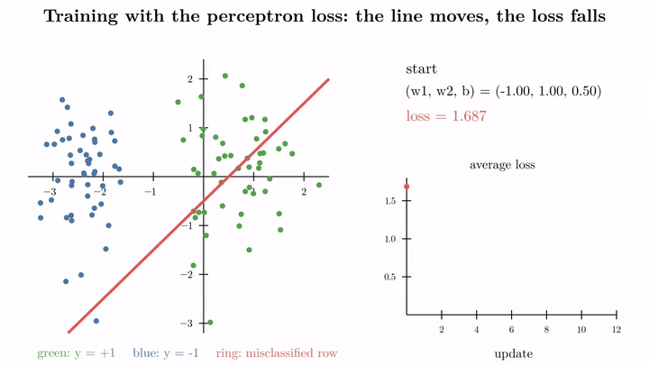
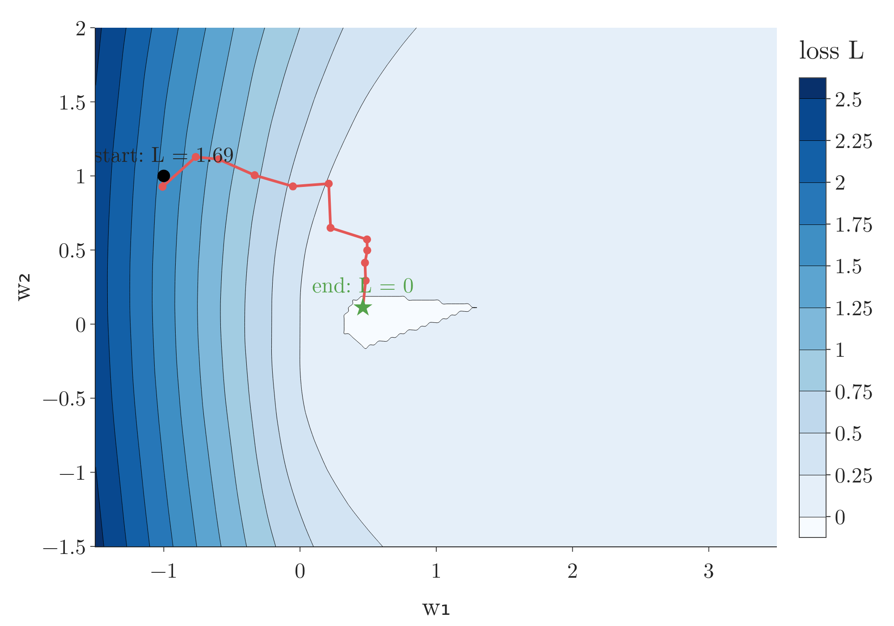
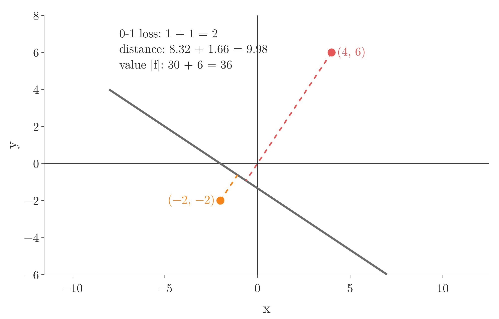
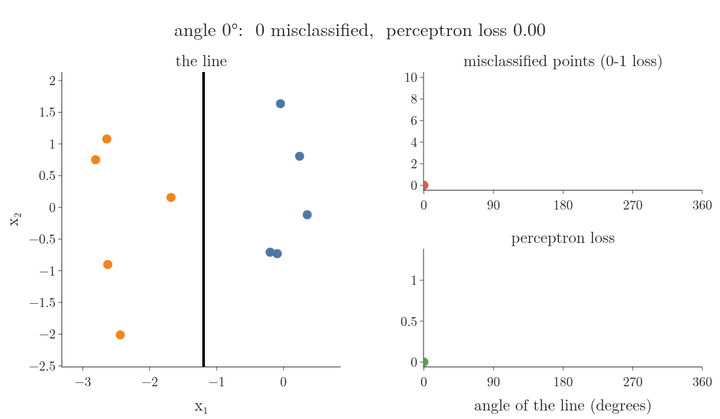
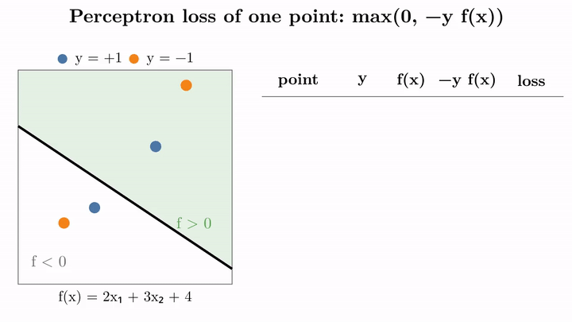
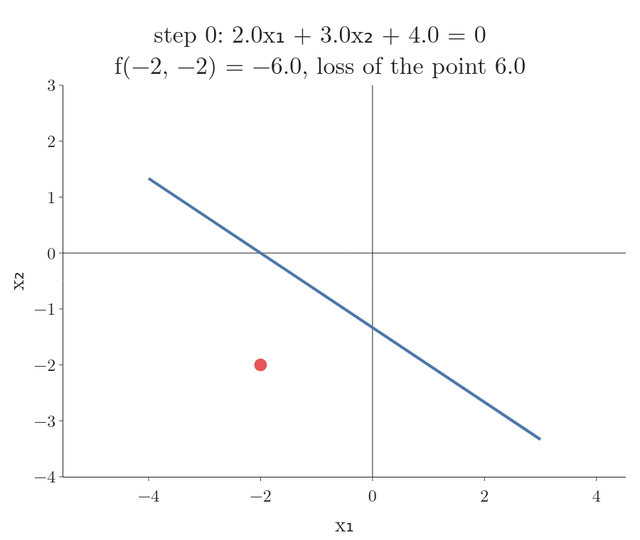
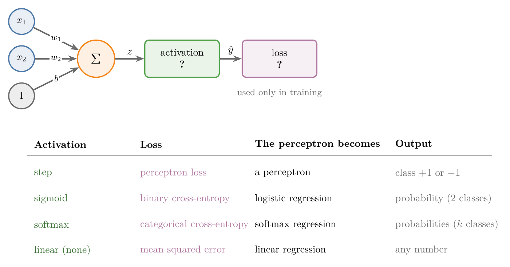

<!-- where-this-fits: generated by course_map/build_map.py; edit concepts.yaml, not this block -->
> **Where this fits:** Pipeline map step 8 (Model). See the [Course map](../../../00-course-map/00-course-map.md).
>
> 
>
> - **Builds on:** [Stochastic gradient descent](../../../ML/06-regression/ML-058-stochastic-gradient-descent/ML-058-stochastic-gradient-descent.md#3-how-stochastic-gradient-descent-works); [Perceptron trick](../../../ML/07-classification/ML-069-perceptron-trick/ML-069-perceptron-trick.md#5-the-perceptron-trick).
> - **Compare with:** [Hinge loss and soft margin](../../../ML/07-classification/ML-088-svm-soft-margin/ML-088-svm-soft-margin.md#8-why-soft-margin).
<!-- /where-this-fits -->

## 1. Overview

> **Key point:** A loss function gives every possible line one number: its error. Training a perceptron then means finding the w₁, w₂, b with the smallest loss, using gradient descent. Swapping the activation function (the rule that turns the weighted sum into the output) and the loss turns the same perceptron into logistic regression, softmax regression or linear regression.

{height=60%}

How to read Figure 1: the animation shows training one update at a time. The line over the points is the current decision boundary, and the average loss is shown alongside it. Look at the line turning until it separates the two classes, and at the loss falling to 0.

The [perceptron trick](../DL-005-perceptron-trick/DL-005-perceptron-trick.md#3-the-trick-in-one-picture) trained a perceptron by pulling a line towards misclassified points (points on the wrong side of the line). That line is the perceptron's **decision boundary** (G-555): points on one side are predicted as one class, points on the other side as the other class. In this Note, "the line" always means this decision boundary. This Note replaces the trick with a proper method: write down a loss, then minimise it. Figure 1 shows the result: the line moves and the loss falls to 0.

The last section shows why the perceptron is so useful as a building block. The perceptron's design lets us change two parts, the activation and the loss, and get a whole family of models.

## 2. Prerequisites

- The [perceptron](../DL-004-perceptron/DL-004-perceptron.md#3-the-parts-of-a-perceptron) and the [perceptron trick](../DL-005-perceptron-trick/DL-005-perceptron-trick.md#3-the-trick-in-one-picture).
- Loss functions and log loss: the [log loss](../../../ML/07-classification/ML-072-log-loss/ML-072-log-loss.md#62-the-loss-function).
- Gradient descent and partial derivatives: the [gradient descent](../../../ML/06-regression/ML-056-gradient-descent/ML-056-gradient-descent.md#2-the-idea) and the [stochastic gradient descent](../../../ML/06-regression/ML-058-stochastic-gradient-descent/ML-058-stochastic-gradient-descent.md#3-how-stochastic-gradient-descent-works).

## 3. What is wrong with the perceptron trick

> **Key point:** The trick cannot tell us how good a line is, and nothing guarantees it settles on a good one.

The perceptron trick usually finds a line that separates the classes. The trick has two weaknesses:

1. **The trick cannot quantify its result.** Two different lines can both separate the training data. Different random orders give different lines (see section 6 of the [perceptron code](../../../ML/07-classification/ML-070-perceptron-code/ML-070-perceptron-code.md#6-the-weakness-the-decision-boundary-stops-too-early)), and the trick has no number that says which one is better.
2. **The trick may not converge** (settle on one final line; see [converge](../../../ML/06-regression/ML-056-gradient-descent/ML-056-gradient-descent.md#5-the-learning-rate)). The trick only moves when it happens to pick a misclassified point, so a long run of correct picks leaves the line where it is. On data that no line can separate, it never stops changing at all (see the [problem with the perceptron](../DL-007-problem-with-perceptron/DL-007-problem-with-perceptron.md#4-what-the-perceptron-learns)).

ML algorithms avoid both problems with a [loss function](../../../ML/07-classification/ML-072-log-loss/ML-072-log-loss.md#5-the-cost-of-one-point): a single number that scores how good the current parameters are.

## 4. A loss function for a line

> **Key point:** The loss is a function of w₁, w₂ and b. Every line gets one number; the best line is the one with the smallest number.

A [loss function](../../../ML/07-classification/ML-072-log-loss/ML-072-log-loss.md#5-the-cost-of-one-point) measures how wrong a model is. For a perceptron with two inputs, the data is fixed, so the loss depends only on the three parameters:

$$L = L(w_1, w_2, b)$$

Changing any of $w_1$, $w_2$ or $b$ moves the line and changes $L$. Suppose one line gives $L = 25$ and, after moving it, the new line gives $L = 23$. The second line is better. Training means finding the $w_1$, $w_2$, $b$ where $L$ is smallest; that line is the final model.

Hold $b$ at its final value 0.5. Then the loss depends on two inputs only, so it is a surface: pick $(w_1, w_2)$ and read the height $L$ above it. For the 100 points of Figure 1, the loss of Section 6 gives one value for each such pair:

$$L(w_1, w_2) = \text{average loss of the 100 points}$$

For example, the start line of Figure 1 has $w_1 = -1$, $w_2 = 1$:

$$L(-1, 1) = 1.69$$

{height=45%}

Figure 2 shows the surface: a ramp that is high on the left, where $w_1$ is negative, and nearly flat on the right. On the right the loss is small (below 0.25) but not 0, because a few points near the line are still misclassified; it is exactly 0 only in a small patch, where the line separates all 100 points. The [contour map](../../../MA/06-calculus/MA-062-partial-derivatives-and-gradients/MA-062-partial-derivatives-and-gradients.md#11-reading-a-contour-map) in Figure 3 is this surface seen from above: each line joins points at the same height. Lines close together mean a steep slope; the small white patch is where $L = 0$.

{height=32%}

Figure 3 draws the same surface as a map: every spot is a line, and its shade is that line's loss. Watch the red path: it starts at $L = 1.69$ on the dark side and walks into the small white patch where $L = 0$.

Familiar examples: linear regression uses the mean squared error (see the [regression metrics](../../../ML/06-regression/ML-051-regression-metrics/ML-051-regression-metrics.md#3-mean-squared-error-mse)), logistic regression the [log loss](../../../ML/07-classification/ML-072-log-loss/ML-072-log-loss.md#62-the-loss-function), and the SVM the [hinge loss](../../../ML/07-classification/ML-088-svm-soft-margin/ML-088-svm-soft-margin.md#5-the-soft-margin-loss). We can also design our own, as the next section does.

> **Extra:** A loss read as a function of the parameters is also called a cost function (see the [convex and non-convex cost functions](../../../MA/07-optimisation/MA-065-convex-and-non-convex-cost-functions/MA-065-convex-and-non-convex-cost-functions.md#2-the-cost-function-is-a-function-of-the-parameters)).

## 5. Designing a loss for the perceptron

> **Key point:** Counting mistakes treats them all alike. Measuring how far each mistake is from the line is better, and putting the point into the line's equation gives a number proportional to that distance.

### 5.1 Count the mistakes

> **Key point:** The 0-1 loss counts misclassified points, so a point just over the line costs as much as one far away.

The simplest loss is the number of misclassified points. A line with 7 mistakes is worse than a line with 5. The mistake count is called the **0-1 loss** (G-48): each point costs 1 if it is misclassified and 0 if not.

The flaw of the 0-1 loss is that every mistake counts the same. A point just across the line is a small mistake; a point far on the wrong side is a big one. A good loss should weigh mistakes by their size.

> **Extra:** The 0-1 loss is also useless for gradient descent. Moving the line a little usually changes no point's class, so the loss stays flat and its slope is 0 almost everywhere: there is no direction to follow.

### 5.2 Use the distance

> **Key point:** Add up the perpendicular distances of the misclassified points from the line.

A better loss adds up the perpendicular distance of every misclassified point from the line. With two mistakes at distances $d_1 = 10$ and $d_2 = 13$, the loss is their sum:

$$L = 10 + 13 = 23$$

Big mistakes now count more than small ones, much as a speeding fine grows with how far over the limit a driver was, instead of being the same for 1 km/h and 50 km/h.

### 5.3 Use the value in the line's equation

> **Key point:** Put each misclassified point into Ax + By + C and add up the absolute values. The sum is proportional to the distance and needs only the line's own equation.

Computing distances takes some work. A simpler number does the same job: put the point into the left-hand side of the line's equation, as in the side test of the [perceptron trick](../../../ML/07-classification/ML-069-perceptron-trick/ML-069-perceptron-trick.md#32-positive-and-negative-sides).

1. **In words:** for every misclassified point, compute $Ax + By + C$, take its absolute value, and add them up.
2. **Formula:**
   $$L = \sum_{\text{misclassified}} \left| A x_i + B y_i + C \right|$$
3. **Example:** the line $2x + 3y + 4 = 0$ misclassifies the points $(4, 6)$ and $(-2, -2)$:
   $$|2 \times 4 + 3 \times 6 + 4| = |30| = 30$$
   $$|2 \times (-2) + 3 \times (-2) + 4| = |-6| = 6$$
   $$L = 30 + 6 = 36$$

The further a point is from the line, the bigger this value. The perceptron loss uses exactly this idea.

{height=30%}

Figure 4 compares the three losses on this example. The 0-1 loss charges both mistakes 1; the distance and the value both charge the far point $(4, 6)$ five times as much as the near one $(-2, -2)$:

$$\text{distance: } \frac{8.32}{1.66} = 5$$

$$\text{value: } \frac{30}{6} = 5$$

> **Extra:** The value is the distance times a fixed number. The distance from a point to the line $Ax + By + C = 0$ is $|Ax + By + C| / \sqrt{A^2 + B^2}$ (see the [equation of a hyperplane](../../../MA/05-linear-algebra/MA-051-equation-of-a-hyperplane/MA-051-equation-of-a-hyperplane.md#61-the-argument)). Here the divisor is

$$\sqrt{2^2 + 3^2} = 3.61$$

so the distances are

$$\frac{30}{3.61} = 8.32$$

$$\frac{6}{3.61} = 1.66$$

Dividing every term by the same 3.61 does not change which line is best.

### 5.4 The candidates on every line

> **Key point:** Turn the line a little: the count of mistakes usually stays the same, but the value-based loss changes. Only a loss that changes can tell gradient descent which way to turn the line.

Sections 5.1 to 5.3 scored one line. Figure 5 scores every line: a line through the centre of 10 of the Note's points (5 per class) turns through a full circle, and for each angle we compute the count of mistakes and the value-based loss, which section 6 names the perceptron loss.

{height=45%}

In Figure 5, watch the two curves grow as the line turns:

- **The red count moves in jumps.** Between two jumps it is flat: a small turn of the line changes no point's side, so the count cannot say whether the turn helped.
- **The green loss changes smoothly.** Every small turn that moves the line closer to or further from a misclassified point changes the loss, so the loss always says which way is better.

Both curves are 0 for the same lines, the ones that separate the two classes. The difference is on the way there: the green curve slopes down towards those lines, and gradient descent follows that slope.

## 6. The perceptron loss

> **Key point:** With labels −1 and +1, the loss of one point is max(0, −y f(x)): zero when the point is on its correct side, and |f(x)| when it is not.

### 6.1 The formula

> **Key point:** L = (1/n) Σ max(0, −yᵢ f(xᵢ)), where f(x) = w₁x₁ + w₂x₂ + b.

scikit-learn's documentation for `SGDClassifier` gives the loss it uses for the perceptron (scikit-learn User Guide, SGD). For this loss, the two classes are labelled $y = +1$ and $y = -1$, not 1 and 0.

1. **In words:** for each **observation** (G-1374) (one record, one row of the data table), multiply its label by its value $f(x)$ in the line's equation and flip the sign; keep it if it is positive, otherwise use 0; then average over all observations.
2. **Formula:** with $f(x_i) = w_1 x_{i1} + w_2 x_{i2} + b$ (observation $i$, **features** (G-772) 1 and 2, where a feature is an input variable, one column of the data table) and $n$ observations,
   $$L(w_1, w_2, b) = \frac{1}{n} \sum_{i=1}^{n} \max\big(0,\ -y_i\thinspace f(x_i)\big)$$
3. **Example:** for the line $2x + 3y + 4 = 0$ and the two misclassified points of Section 5.3, $(4, 6)$ with $y = -1$ and $(-2, -2)$ with $y = +1$:
   $$\text{point 1: } \max(0, -(-1)(30)) = 30$$
   $$\text{point 2: } \max(0, -(1)(-6)) = 6$$
   Average over the $n = 2$ points:
   $$L = \frac{30 + 6}{2} = 18$$

$f(x_i)$ is the perceptron's $z$ for observation $i$. The quantity $\max(0, s)$ means: $s$ if $s$ is positive, otherwise 0.

> **Extra:** The full formula in scikit-learn also adds a regularisation term $\alpha R(w)$, as in [Ridge regression](../../../ML/06-regression/ML-062-ridge-regression-intuition/ML-062-ridge-regression-intuition.md#3-the-idea-penalise-large-coefficients). We leave it out here (no regularisation).

### 6.2 What it does in each case

> **Key point:** Correctly classified points add 0; each misclassified point adds |f(x)|, which grows with its distance from the line.

A point can relate to the line in four ways:

| True label $y$ | Side of the line, sign of $f(x)$ | $-y f(x)$ | Loss of the point |
|---|---|---|---|
| $+1$ | positive | negative | 0 (correct) |
| $-1$ | negative | negative | 0 (correct) |
| $+1$ | negative | positive | $\lvert f(x) \rvert$ (mistake) |
| $-1$ | positive | positive | $\lvert f(x) \rvert$ (mistake) |

{height=60%}

Figure 6 runs the table on four points, one per row of the table. Watch each row fill in from left to right:

1. $(2, 2)$ with $y = +1$: $f = 14$, so $-y f = -14$, and $\max(0, -14) = 0$.
2. $(-4, -3)$ with $y = -1$: $f = -13$, so $-y f = -13$, and the loss is 0.
3. $(-2, -2)$ with $y = +1$: $f = -6$, so $-y f = +6$, and the loss is 6.
4. $(4, 6)$ with $y = -1$: $f = 30$, so $-y f = +30$, and the loss is 30.

The average over the four points:

$$L = \frac{0 + 0 + 6 + 30}{4} = 9$$

So the formula is the "value in the line's equation" loss of Section 5.3, written in one line with no if-statements. The label $y$ only has size 1, so it fixes the sign and the size comes from $f(x)$.

{height=38%}

Figure 7 plots the loss of one point against $s = y f(x)$ (the label times the value, positive when the point is correct). The perceptron loss (red) is 0 for every point on its correct side and rises steadily the further a point is on the wrong side.

> **Extra:** The SVM's [hinge loss](../../../ML/07-classification/ML-088-svm-soft-margin/ML-088-svm-soft-margin.md#5-the-soft-margin-loss) is $\max(0, 1 - s)$ (blue, dashed): the same shape shifted right by 1. A point must be correct by a margin ($s \geq 1$) before it costs nothing. The perceptron loss accepts any correct point, however close to the line. Once every point is on its correct side, every observation's gradient is 0 (section 7.1), so the updates stop at the first separating line reached, even one that passes very close to the points of one class.

### 6.3 Minimising it

> **Key point:** Training is argmin over w₁, w₂, b of L, solved with gradient descent.

Only $w_1$, $w_2$ and $b$ can change; the inputs $x_{i1}, x_{i2}$ and labels $y_i$ are fixed by the data. So training is

$$w_1, w_2, b = \underset{w_1, w_2, b}{\arg\min}\ L(w_1, w_2, b)$$

with $L$ the average perceptron loss of Section 6.1.

**argmin** (G-211) means "the values of the variables that make the expression smallest". We find them with gradient descent: start with any values, then repeat for a number of **epochs** (G-696) (an epoch is one pass over all the observations; see [epoch](../../../ML/06-regression/ML-056-gradient-descent/ML-056-gradient-descent.md#23-when-to-stop))

$$w_1 \leftarrow w_1 - \eta\thinspace\frac{\partial L}{\partial w_1}$$

$$w_2 \leftarrow w_2 - \eta\thinspace\frac{\partial L}{\partial w_2}$$

$$b \leftarrow b - \eta\thinspace\frac{\partial L}{\partial b}$$

with a **learning rate** (G-1068) $\eta$ such as 0.1, the size of each step (see the [gradient descent](../../../ML/06-regression/ML-056-gradient-descent/ML-056-gradient-descent.md#22-how-far-to-move)).

The symbol $\frac{\partial L}{\partial w_1}$ is the **partial derivative** (G-1457) of $L$ with respect to $w_1$: how much $L$ changes when $w_1$ alone is nudged up a little and the other parameters stay fixed. A small check with one point, $(-2, -2)$ with $y = +1$, on the line $w_1 = 2$, $w_2 = 3$, $b = 4$, whose loss is $\max(0, -f)$:

$$f = 2(-2) + 3(-2) + 4 = -6$$

$$L = \max(0, 6) = 6$$

Nudge $w_1$ from 2 to 2.01 and leave $w_2$ and $b$ alone:

$$f = 2.01(-2) + 3(-2) + 4 = -6.02$$

$$L = \max(0, 6.02) = 6.02$$

$$\frac{\partial L}{\partial w_1} \approx \frac{6.02 - 6}{2.01 - 2} = 2$$

So nudging $w_1$ up makes this point's loss rise by 2 per unit, and gradient descent therefore lowers $w_1$. Section 7.1 gets the same 2 from a rule instead of a nudge.

## 7. The gradient of the perceptron loss

> **Key point:** For a misclassified observation, $\partial L/\partial w_1 = -y x_1$, $\partial L/\partial w_2 = -y x_2$ and $\partial L/\partial b = -y$; for a correct observation, all three are 0.

### 7.1 The derivatives

> **Key point:** The chain rule splits the derivative into $\partial L/\partial f$, which is 0 or $-y$, times $\partial f/\partial w_1$, which is $x_1$.

Take the loss of one observation, $L_i = \max(0, -y_i f(x_i))$. By the [chain rule](../../../ML/07-classification/ML-073-sigmoid-derivative/ML-073-sigmoid-derivative.md#32-split-into-two-fractions),

$$\frac{\partial L_i}{\partial w_1} = \frac{\partial L_i}{\partial f} \cdot \frac{\partial f}{\partial w_1}$$

- $\partial f / \partial w_1 = x_{i1}$ (the nudge test above: $f$ moved by $-0.02$ for a nudge of 0.01 because $x_{i1} = -2$), because $f = w_1 x_{i1} + w_2 x_{i2} + b$.
- $\partial L_i / \partial f$ depends on which part of the max is active: 0 when $y_i f(x_i) \geq 0$ (the loss is the flat 0), and $-y_i$ when $y_i f(x_i) < 0$ (the loss is $-y_i f$).

Putting them together:

1. **In words:** a correct observation has no slope; a misclassified observation has slope $-y$ times the input (and $-y$ for the bias, whose input is 1).
2. **Formula:**
   $$\frac{\partial L_i}{\partial w_1} = \begin{cases} 0 & y_i f(x_i) \geq 0 \cr-y_i\thinspace x_{i1} & y_i f(x_i) < 0 \end{cases}$$
   $$\frac{\partial L_i}{\partial w_2} = \begin{cases} 0 & y_i f(x_i) \geq 0 \cr-y_i\thinspace x_{i2} & y_i f(x_i) < 0 \end{cases}$$
   $$\frac{\partial L_i}{\partial b} = \begin{cases} 0 & y_i f(x_i) \geq 0 \cr-y_i & y_i f(x_i) < 0 \end{cases}$$
3. **Example:** the line of Section 5.3 ($w_1 = 2$, $w_2 = 3$, $b = 4$) and the point $(-2, -2)$ with $y = +1$. Then $f = -6$, so $y f = -6 < 0$: misclassified, loss 6. The slopes, one per line:
   $$\frac{\partial L}{\partial w_1} = -y\thinspace x_1 = -1 \times (-2) = 2$$
   $$\frac{\partial L}{\partial w_2} = -y\thinspace x_2 = -1 \times (-2) = 2$$
   $$\frac{\partial L}{\partial b} = -y = -1$$
   One step with $\eta = 0.1$:
   $$w_1 = 2 - 0.1 \times 2 = 1.8$$
   $$w_2 = 3 - 0.1 \times 2 = 2.8$$
   $$b = 4 - 0.1 \times (-1) = 4.1$$
   The point's value becomes
   $$f = 1.8(-2) + 2.8(-2) + 4.1 = -5.1$$
   so its loss drops from 6 to 5.1.

{height=40%}

In Figure 8, watch the line turn and slide towards the point: the point's loss falls by 0.9 per step, 6, 5.1, 4.2 and so on, and turns to 0 at step 7, when the gradient becomes 0 and the updates stop.

> **Extra:** At exactly $y f = 0$ the max has a corner and no true derivative. Any slope between the two one-sided slopes, 0 and $-y x_1$, is a valid **subgradient** (G-1910) there: the slope of a line that touches the corner and stays below the loss. The code takes 0, because it updates only when $y f < 0$.

### 7.2 The update rule

> **Key point:** For each misclassified observation: w ← w + η y x. The update is the perceptron trick's update, now derived from a loss.

Subtracting $\eta$ times the slope gives, for a misclassified observation,

$$w_1 \leftarrow w_1 + \eta\thinspace y_i x_{i1}$$

$$w_2 \leftarrow w_2 + \eta\thinspace y_i x_{i2}$$

$$b \leftarrow b + \eta\thinspace y_i$$

and no change for a correct observation. Updating after every observation, instead of averaging over all observations first, is [stochastic gradient descent](../../../ML/06-regression/ML-058-stochastic-gradient-descent/ML-058-stochastic-gradient-descent.md#3-how-stochastic-gradient-descent-works).

> **Python:** Training with the perceptron loss.
>
> ```python
> def perceptron(X, y, lr=0.1, epochs=1000):
>     # y must hold -1 and +1
>     w1, w2, b = -1.0, 1.0, 0.5
>     for _ in range(epochs):
>         for i in range(X.shape[0]):
>             z = w1 * X[i, 0] + w2 * X[i, 1] + b
>             if y[i] * z < 0:          # misclassified
>                 w1 += lr * y[i] * X[i, 0]
>                 w2 += lr * y[i] * X[i, 1]
>                 b += lr * y[i]
>     return w1, w2, b
>
> y_pm = np.where(y == 1, 1, -1)       # 0/1 labels -> -1/+1
> ```
>
> `np.where(condition, a, b)` takes `a` where the condition holds and `b` elsewhere.

Figure 1 runs this on 100 points made with `make_classification` (`class_sep=15`, `random_state=41`), starting from the poor line with $w_1 = -1$, $w_2 = 1$, $b = 0.5$. In the first epoch, 12 observations are misclassified when visited; after those 12 updates the average loss is 0, and later epochs change nothing.

The loss is the average over all observations, while each update looks at one observation. So a single update can raise the total loss: here the first update moves it from 1.687 to 1.712. The trend is still steadily down.

> **Extra:** With labels $\pm 1$, $\eta\thinspace y\thinspace x$ is exactly the perceptron trick's $\eta(y - \hat{y})x$ up to a factor of 2: a positive point on the wrong side gets $+\eta x$, a negative one $-\eta x$. So the trick was gradient descent on the perceptron loss all along. What the loss adds is a number we can watch go down, and compare between lines.

> **Extra:** The labels must be $-1$ and $+1$. With `make_classification`'s labels 0 and 1, `y[i] * z` is 0 for every class-0 observation, so the condition `< 0` never holds and those observations never update the line. The model then learns only from class 1. From the start line of Figure 1 it ends with all 50 class-0 points misclassified; from the start $(1, 1, 1)$ it happens to work, because class 0 is already on the correct side of that line.

## 8. One perceptron, many models

> **Key point:** Keep the weighted sum; choose the activation and the loss. Step + perceptron loss is the perceptron, sigmoid + binary cross-entropy is logistic regression, softmax + categorical cross-entropy is softmax regression, and no activation + MSE is linear regression.

{height=45%}

The perceptron's design has two free slots (Figure 9): the activation function, which shapes the output, and the loss function, used in training. The weighted sum $z = w_1 x_1 + w_2 x_2 + b$ and the training method (gradient descent) stay the same.

- **Step + perceptron loss:** the perceptron of this Note. Output: a class, $+1$ or $-1$.
- **[Sigmoid](../../../ML/07-classification/ML-071-sigmoid-function/ML-071-sigmoid-function.md#4-the-sigmoid-function) + [binary cross-entropy](../../../ML/07-classification/ML-072-log-loss/ML-072-log-loss.md#62-the-loss-function):** output a probability between 0 and 1 for two classes. Sigmoid with binary cross-entropy is logistic regression. See [why not the squared error](../DL-014-dl-loss-functions/DL-014-dl-loss-functions.md#81-why-not-the-squared-error) for numbers showing why this loss suits a probability. Here $\hat y$ ("y hat") is the model's output, the predicted probability, and $\log$ is the natural logarithm. Two observations ($n = 2$), one with $y = 1$ and one with $y = 0$, both given $\hat y = 0.8$:
  $$\text{observation 1: } -\log(0.8) = 0.223$$
  $$\text{observation 2: } -\log(1 - 0.8)$$
  $$= -\log(0.2) = 1.609$$
  $$L = \frac{0.223 + 1.609}{2} = 0.916$$
  The same two lines are the general loss, with $n$ the number of observations:
  $$\ell_i = -\big[ y_i \log \hat y_i + (1 - y_i)\log(1 - \hat y_i) \big]$$
  $$L = \frac{1}{n}\sum_{i=1}^{n} \ell_i$$
  For $y_i = 1$ only the first term is left, for $y_i = 0$ only the second, which gives the two lines above.
- **[Softmax](../../../ML/07-classification/ML-078-softmax-regression/ML-078-softmax-regression.md#2-the-softmax-function) + categorical cross-entropy:** one output per class, probabilities that add to 1. Softmax with categorical cross-entropy is softmax regression, for more than two classes.
- **Linear (no activation) + mean squared error:** the output is $z$ itself, any number. No activation with mean squared error is linear regression, with loss $\frac{1}{n}\sum (y_i - \hat y_i)^2$ (see [simple linear regression](../../../ML/06-regression/ML-049-simple-linear-regression/ML-049-simple-linear-regression.md#34-the-best-fit-line)). For targets 3 and 1 and outputs 2.5 and 2:
  $$\text{target 3: } (3 - 2.5)^2 = 0.25$$
  $$\text{target 1: } (1 - 2)^2 = 1$$
  $$L = \frac{0.25 + 1}{2} = 0.625$$

So "a perceptron is logistic regression" is only true for one choice of the two slots: sigmoid and binary cross-entropy. The same flexibility carries over to every neuron of a neural network: regression networks end in a linear output, and classification networks in a sigmoid or softmax output.

> **Python:** scikit-learn's `SGDClassifier` trains the same linear model with any of these losses.
>
> ```python
> from sklearn.linear_model import SGDClassifier
>
> sgd = SGDClassifier(loss="perceptron", penalty=None,
>                     learning_rate="constant", eta0=0.1, random_state=0)
> sgd.fit(X, y)    # labels 0/1 are fine: it converts them itself
> ```
>
> `loss="log_loss"` gives logistic regression and `loss="hinge"` a linear SVM. The `Perceptron` class is this same model with `eta0=1` (scikit-learn docs, `Perceptron`).

On the 100 points, `Perceptron` and `SGDClassifier(loss="perceptron", eta0=0.1)` find the same line, one with weights ten times the other: $(2.35, -0.19, 2.0)$ and $(0.235, -0.019, 0.2)$. Multiplying all of $w_1$, $w_2$, $b$ by one positive number leaves the line $z = 0$ where it is. Both classify all 100 points correctly.

## 9. Summary

| Activation | Loss | Model | Output |
|---|---|---|---|
| step | perceptron loss $\max(0, -y f(x))$ | perceptron | class $\pm 1$ |
| sigmoid | binary cross-entropy | logistic regression | probability, 2 classes |
| softmax | categorical cross-entropy | softmax regression | probabilities, $k$ classes |
| linear (none) | mean squared error | linear regression | any number |

- The perceptron trick cannot score a line; a loss function can, so training becomes a search for the line with the smallest loss.
- Counting mistakes (0-1 loss) treats all mistakes alike; the value $|f(x)|$ grows with the distance from the line, so big mistakes cost more, and the loss changes smoothly as the line turns, which gives gradient descent a slope to follow.
- Perceptron loss, with labels $\pm 1$, so the sign of $y f(x)$ alone says whether a point is correct; correct points cost 0:

  $$L = \frac{1}{n}\sum_{i} \max(0, -y_i f(x_i))$$
- The loss's gradient for a misclassified observation is $-y x$ (and $-y$ for $b$), so SGD updates $w \leftarrow w + \eta\thinspace y\thinspace x$: the perceptron trick, derived.
- Changing the activation and the loss turns one perceptron into several classic models, because the weighted sum and the training by gradient descent stay the same.
- So a loss gives every line one number, gradient descent finds the line with the smallest loss, and swapping the two slots gives logistic, softmax or linear regression.

## 10. Sources

**Built from**

- CampusX, "Perceptron Loss Function | Hinge Loss | Binary Cross Entropy | Sigmoid Function", YouTube, https://www.youtube.com/watch?v=2_gCL5RAkHc

**Other references**

- scikit-learn User Guide, Stochastic Gradient Descent, Mathematical formulation.
- scikit-learn documentation, `sklearn.linear_model.Perceptron` (equivalent to `SGDClassifier(loss="perceptron", eta0=1, learning_rate="constant", penalty=None)`).

## 11. Key terms

| Term | Meaning |
|---|---|
| 0-1 loss | A loss that counts 1 for every misclassified point and 0 for every correct one |
| Perceptron loss | A loss for the perceptron that is 0 for a point on its correct side and $\lvert f(x) \rvert$ for a point on the wrong side, so worse mistakes cost more: $\max(0, -y f(x))$ per point, labels $\pm 1$. Minimising it trains the line. |
| argmin (G-211) | The values of the variables that make an expression smallest |
| Subgradient | A slope used at a corner of a function, where the ordinary derivative does not exist |
| SGDClassifier | scikit-learn's linear classifier that learns its weights by stochastic gradient descent (SGD), small steps from one row at a time, with a choice of loss (perceptron, log loss, hinge, ...). |
