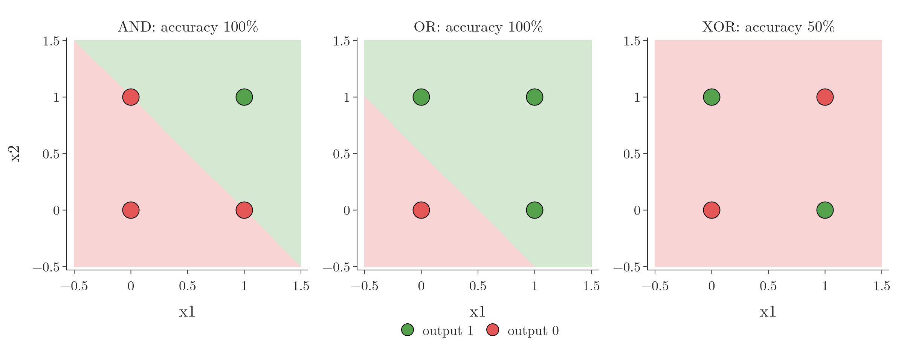
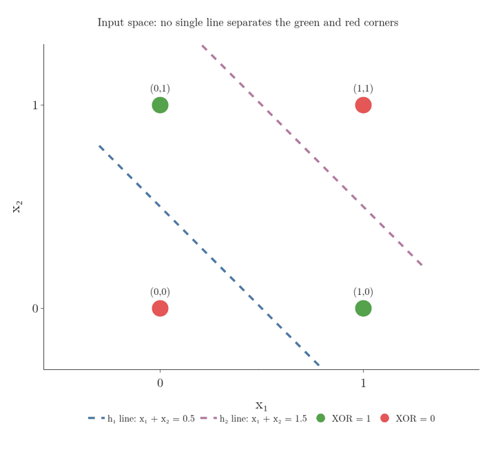

<!-- where-this-fits: generated by course_map/build_map.py; edit concepts.yaml, not this block -->
> **Where this fits:** Pipeline map step 8 (Model). See the [Course map](../../../00-course-map/00-course-map.md).
>
> 
>
> - **Builds on:** [Perceptron](../../../DL/01-basics/DL-004-perceptron/DL-004-perceptron.md#3-the-parts-of-a-perceptron).
> - **Leads to:** [Multi-layer perceptron (MLP)](../../../DL/01-basics/DL-009-mlp-intuition/DL-009-mlp-intuition.md#3-combining-two-perceptrons).
<!-- /where-this-fits -->

## 1. Overview

> **Key point:** A perceptron has one straight **decision boundary** (G-555; the line that splits the two classes). It learns AND and OR easily, but no line can separate XOR (exclusive or, defined in section 3), so on XOR (and on any data that needs a curved decision boundary) it fails, however long it trains.



A perceptron is a [line, plane or hyperplane](../DL-004-perceptron/DL-004-perceptron.md#7-what-a-perceptron-does-geometrically). This Note shows in code what that means for data that no line can split.

Figure 1 is the whole story: two easy tables and one impossible one. It has three panels, one per table. Each panel plots the four rows at the position $(x_1, x_2)$, a green dot where the output is 1 and a red dot where it is 0. The background colour is the perceptron's prediction: green where it says 1, red where it says 0, and the edge between them is its decision boundary. Look for a background edge that puts every green dot on the green side and every red dot on the red side: AND and OR have one, XOR has none.

The XOR weakness stalled perceptron research for years (see [the first AI winter](../DL-003-nn-types-history-applications/DL-003-nn-types-history-applications.md#31-the-perceptron-and-the-first-ai-winter)), and is the reason **multi-layer perceptrons** (G-1270; perceptrons stacked in layers, [built in the MLP section](../DL-009-mlp-intuition/DL-009-mlp-intuition.md#3-combining-two-perceptrons)) were needed.

## 2. Prerequisites

- [Parts of a perceptron](../DL-004-perceptron/DL-004-perceptron.md#3-the-parts-of-a-perceptron): a perceptron is a linear decision boundary.
- [The perceptron loss](../DL-006-perceptron-loss/DL-006-perceptron-loss.md#6-the-perceptron-loss): how a perceptron is trained.

## 3. Three tiny datasets: AND, OR and XOR

> **Key point:** Each table has two binary inputs and four rows. AND outputs 1 only when both inputs are 1; OR when at least one is; XOR when exactly one is.

The three datasets are the logic functions **AND**, **OR** (G-199) and **XOR** (G-2134; exclusive or: 1 when exactly one input is 1; also met in [the first AI winter](../DL-003-nn-types-history-applications/DL-003-nn-types-history-applications.md#31-the-perceptron-and-the-first-ai-winter)). Each has inputs $x_1, x_2 \in \lbrace0, 1\rbrace$, so there are only four possible rows. The table uses three terms:

- each row is one **observation** (G-1374; one record of the table);
- $x_1$ and $x_2$ are its two **features** (G-772; input variables);
- the AND, OR or XOR column is the **target** (G-1949; the output we predict).

| $x_1$ | $x_2$ | AND | OR | XOR |
|---|---|---|---|---|
| 0 | 0 | 0 | 0 | 0 |
| 0 | 1 | 0 | 1 | 1 |
| 1 | 0 | 0 | 1 | 1 |
| 1 | 1 | 1 | 1 | 0 |

Plotted, the four observations are the corners of a square (Figure 1):

- for AND, the single 1 sits in one corner;
- for OR, the single 0 sits in one corner;
- for XOR, the 1s sit on opposite corners, and so do the 0s.

> **Python:** Building the tables and training one perceptron per table.
>
> ```python
> import numpy as np
> from sklearn.linear_model import Perceptron
>
> X = np.array([[0, 0], [0, 1], [1, 0], [1, 1]])
> y_and = np.array([0, 0, 0, 1])
> y_or = np.array([0, 1, 1, 1])
> y_xor = np.array([0, 1, 1, 0])
>
> for y in (y_and, y_or, y_xor):
>     p = Perceptron(random_state=0).fit(X, y)
>     print(p.coef_, p.intercept_, p.score(X, y))
> ```

## 4. What the perceptron learns

> **Key point:** AND and OR get a separating line and 100% accuracy. XOR ends with all weights 0, no line at all, and 50% accuracy.

The three perceptrons give:

| Table | $w_1$ | $w_2$ | $b$ | Line | Accuracy |
|---|---|---|---|---|---|
| AND | 2 | 2 | $-2$ | $x_1 + x_2 = 1$ | 100% |
| OR | 2 | 2 | $-1$ | $x_1 + x_2 = 0.5$ | 100% |
| XOR | 0 | 0 | 0 | none | 50% |

For AND and OR, one line puts the 1s on one side and the 0s on the other (Figure 1, left and middle). For XOR, the Notebook prints the weights after each **epoch** (G-696; one full pass over the training data): they are back at $(0, 0, 0)$ every time. The [update for a misclassified observation](../DL-006-perceptron-loss/DL-006-perceptron-loss.md#72-the-update-rule) adds $y_i(x_{i1}, x_{i2}, 1)$ to the weight vector $(w_1, w_2, b)$ (a list of the three numbers), with labels $y_i = \pm 1$ (0 becomes $-1$). Start from $(0, 0, 0)$ and apply the update for each XOR observation in turn.

Observation $(0, 0)$, label $-1$:

$$(0, 0, 0) - (0, 0, 1) = (0, 0, -1)$$

Observation $(0, 1)$, label $+1$:

$$(0, 0, -1) + (0, 1, 1) = (0, 1, 0)$$

Observation $(1, 0)$, label $+1$:

$$(0, 1, 0) + (1, 0, 1) = (1, 1, 1)$$

Observation $(1, 1)$, label $-1$:

$$(1, 1, 1) - (1, 1, 1) = (0, 0, 0)$$

So when all four observations are misclassified in turn, as here, each epoch's updates cancel and the epoch ends where it began. Training stops with all weights at 0: the weighted sum $z = w_1x_1 + w_2x_2 + b$ is 0 everywhere, the whole plane gets one class, and only half the observations are right (Figure 1, right).

More epochs would not help. Whatever the perceptron does, its decision boundary is always one straight line.

Figure 2 tries every line. A line turns through almost a full circle (from 0 to 340 degrees), and at each angle it takes the position that classifies the most observations correctly.

{width=100%}

Watch the black ring: at every angle some corner is on the wrong side, and the count never passes 3 of 4. The Extra below proves that no line can do better.

> **Extra:** Why no line can separate XOR. A line works if $b < 0$ for $(0, 0)$, $w_2 + b \geq 0$ for $(0, 1)$, $w_1 + b \geq 0$ for $(1, 0)$, and $w_1 + w_2 + b < 0$ for $(1, 1)$. Adding the middle two gives $w_1 + w_2 + 2b \geq 0$, so $w_1 + w_2 + b \geq -b$. Since $b < 0$, $-b > 0$, so $w_1 + w_2 + b > 0$, which contradicts the last condition. No $w_1, w_2, b$ can satisfy all four.

### 4.1 Another way to see it: one input

> **Key point:** With one input, XOR becomes the pattern 0, 1, 0. A straight line can rise or fall, but it cannot rise and then fall.

The same failure shows with a single input. Suppose a drug is tested at three doses:

- a **low** dose does not work (0);
- a **medium** dose works (1);
- a **high** dose does not work (0).

We fit a straight line to the nine patients and predict "works" wherever the line is at 0.5 or above. Figure 3 turns the line through every slope and, at each slope, puts it at its best height.


1. **A rising line** is low on the left and high on the right. It gets the low and medium doses right, and wrongly says the high dose works.
2. **A falling line** makes the mirror mistake on the low dose.
3. **A flat line** gives every dose the same answer, so the medium dose is wrong.

At every slope the count stays at 2 of 3. The target goes up and then down, and a straight line changes direction never. The data needs a curve that bends; [two neurons combined](../DL-009-mlp-intuition/DL-009-mlp-intuition.md#3-combining-two-perceptrons) build such a curve for this same drug.

## 5. The same failure on larger data

> **Key point:** One sigmoid neuron separates two blobs perfectly but stays near 50% on XOR-shaped and circular data.

The **TensorFlow Playground** (G-1958; playground.tensorflow.org) is a website that trains small neural networks in the browser, with no code. Removing every **hidden layer** (G-890; a layer between input and output) leaves a single neuron. With a **sigmoid** (G-1798; a function that squashes any number into the range 0 to 1) activation, that neuron is **logistic regression** (G-1120; [one perceptron, many models](../DL-006-perceptron-loss/DL-006-perceptron-loss.md#8-one-perceptron-many-models)). On two separate clusters it finds a line almost at once; on XOR-shaped data its error stays high no matter how many epochs it runs.

The Notebook repeats this experiment in scikit-learn with `LogisticRegression`, which is exactly one sigmoid neuron:


- **Two blobs** (Figure 4, left): a line separates them, accuracy 100%. Colours are as in Figure 1: dots are the observations, the background is the prediction.
- **XOR quadrants** (middle): class 1 where $x_1$ and $x_2$ have the same sign. A line cuts across all four quadrants, accuracy 52%.
- **Circles** (right): one class inside a ring of the other. A line cannot enclose anything, accuracy 50%.

So the problem is not the four-row table: any data whose classes need a bent or closed decision boundary defeats a single neuron. Such data is called **non-linear data** (G-1335; [data that no straight line can split](../../../ML/07-classification/ML-089-kernel-trick-intuition/ML-089-kernel-trick-intuition.md#2-data-that-no-straight-line-can-split)): no line, plane or hyperplane separates its classes.

> **Extra:** Two ways out exist.
>
> 1. **Add a feature by hand.** Feed $x_1 x_2$ as a third input, like the **polynomial features** (G-1513; [powers and products of the inputs as new features](../../../ML/06-regression/ML-060-polynomial-regression/ML-060-polynomial-regression.md#3-adding-powers-as-new-features)) of linear regression (the Playground offers this input too). With it, one neuron reaches 99% on the XOR quadrants in the Notebook. On the four table observations, this expression equals XOR exactly:
>    $$x_1 + x_2 - 2x_1x_2$$
>    So the following is a plane in the three inputs $x_1, x_2, x_1x_2$:
>    $$z = x_1 + x_2 - 2x_1x_2 - 0.5$$
>    It puts the 1s at $z = 0.5$ and the 0s at $z = -0.5$.
> 2. **Add hidden layers**, so the network builds such features itself (next section).

## 6. The way forward

> **Key point:** Combining several perceptrons in layers gives curved decision boundaries: the multi-layer perceptron.

A single perceptron is a linear model, so it can only capture linear relationships. The fix is to use several perceptrons and feed their outputs into another one. The last frame of Figure 2 shows the idea with two lines, one per hidden perceptron: $x_1 + x_2 = 0.5$ (the OR line of section 4) and $x_1 + x_2 = 1.5$. The sum $x_1 + x_2$ is 0 for $(0, 0)$, 1 for $(0, 1)$ and $(1, 0)$, and 2 for $(1, 1)$, so exactly the two 1s fall between the lines. [Combining two perceptrons](../DL-009-mlp-intuition/DL-009-mlp-intuition.md#3-combining-two-perceptrons) gives a curved decision boundary, and [XOR with two hidden nodes](../DL-009-mlp-intuition/DL-009-mlp-intuition.md#51-xor-with-two-hidden-nodes) solves XOR on the Playground.

Figure 5 shows why the second perceptron layer then has an easy job. Each hidden perceptron outputs 0 or 1 (a step function: 1 when its weighted sum is 0 or more, else 0), so each observation gets a new pair of numbers, $(h_1, h_2)$. In the figure, the left panel is the input square with the two hidden lines; the right panel plots each observation at its new position $(h_1, h_2)$, with the same green and red dots.



1. **$h_1$ is the OR line.** It outputs 1 for every corner except $(0, 0)$.
2. **$h_2$ is the AND line.** It outputs 1 only for $(1, 1)$.
3. **The corners move.** $(0, 0)$ goes to $(0, 0)$, both $(0, 1)$ and $(1, 0)$ go to $(1, 0)$, and $(1, 1)$ goes to $(1, 1)$. The two green observations now sit at the same spot.
4. **One line is enough.** In the new positions, the line $h_1 - h_2 = 0.5$ has both green observations on one side and both red ones on the other. An output perceptron with this line classifies all four correctly.

The hidden layer has changed how the data is represented, into a form where the classes are linearly separable. Finding such a form from the data is **representation learning** (G-1670), and it is what the hidden layers of a multi-layer perceptron do.

## 7. Summary

| Data | Separable by a line? | Single perceptron or neuron |
|---|---|---|
| AND | yes | 100% |
| OR | yes | 100% |
| XOR (4 observations) | no | 50%, all weights end at 0 |
| Two blobs | yes | 100% |
| XOR quadrants | no | 52% |
| Circles | no | 50% |

- A perceptron can only have one straight decision boundary, so it can only split data that a line separates.
- XOR puts each class on opposite corners of a square: no line separates them, which a short proof confirms.
- More training never fixes this; more neurons, in layers, do, because a hidden layer moves the observations to new positions where one line separates the classes.
- So a single perceptron fails on XOR and on any data that needs a bent or closed boundary, however long it trains, and that failure is why multi-layer perceptrons were needed.

## 8. Sources

**Built from**

- CampusX, "Problem with Perceptron", YouTube, https://www.youtube.com/watch?v=Jp44b27VnOg
- StatQuest with Josh Starmer, "The Essential Main Ideas of Neural Networks", YouTube, https://www.youtube.com/watch?v=CqOfi41LfDw (the three-dose example of section 4.1)

## 9. Key terms

| Term | Meaning |
|---|---|
| AND, OR | Logic functions: 1 when both inputs are 1 (AND), or when at least one is (OR) |
| TensorFlow Playground | A website that trains small neural networks in the browser and shows their boundaries |
