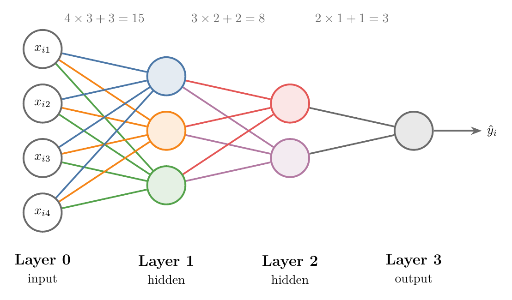
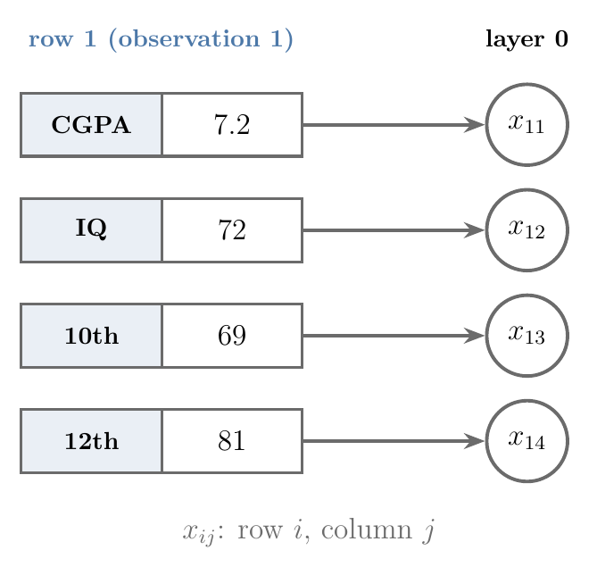
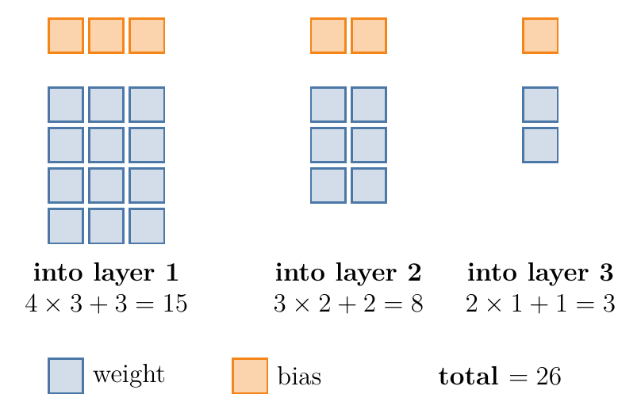
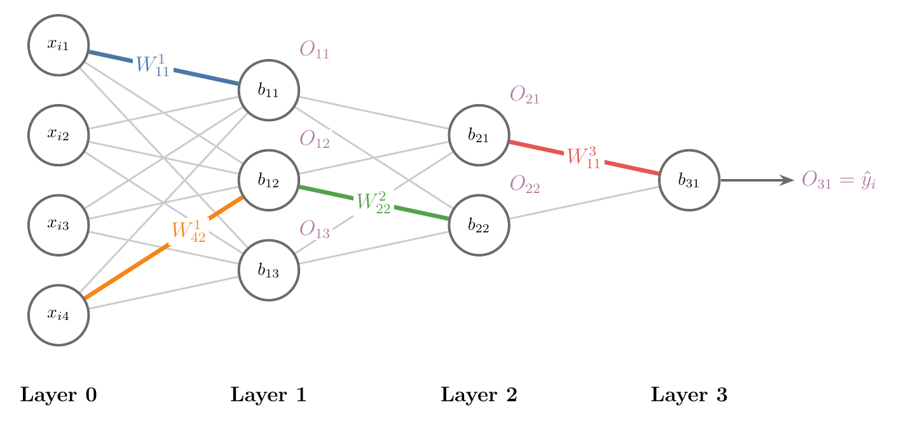
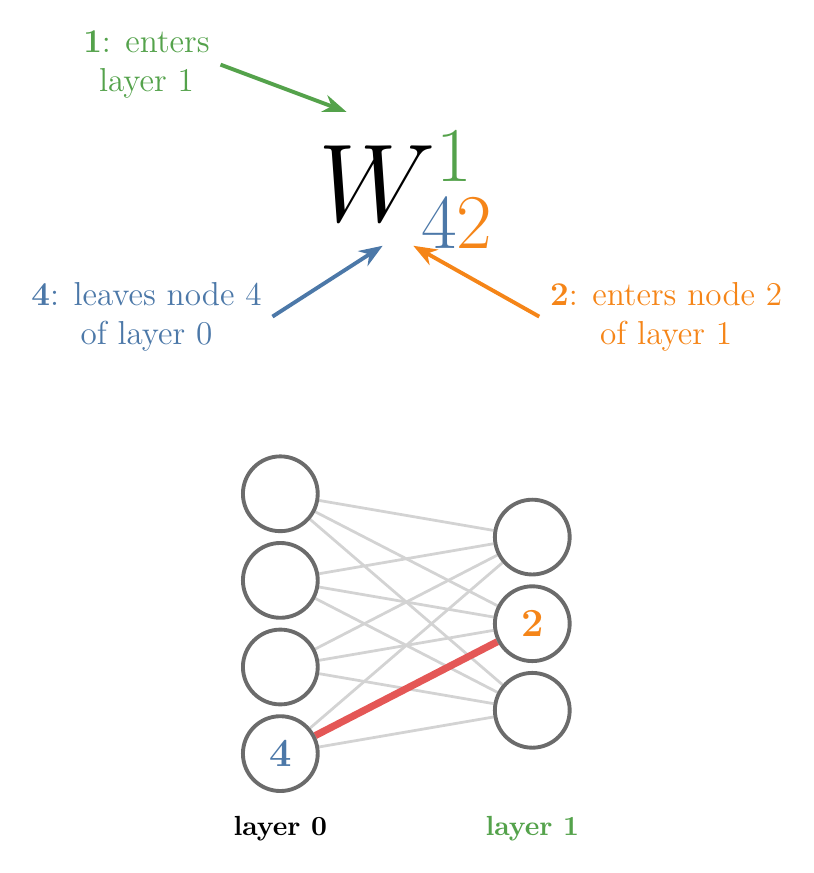
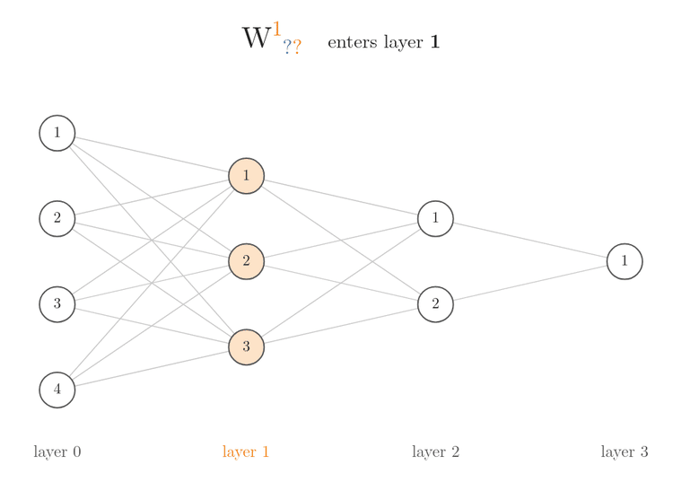

<!-- where-this-fits: generated by course_map/build_map.py; edit concepts.yaml, not this block -->
> **Where this fits:** Pipeline map step 8 (Model). See the [Course map](../../../00-course-map/00-course-map.md).
>
> 
>
> - **Leads to:** [Multi-layer perceptron (MLP)](../../../DL/01-basics/DL-009-mlp-intuition/DL-009-mlp-intuition.md#3-combining-two-perceptrons); [Forward propagation](../../../DL/01-basics/DL-010-forward-propagation/DL-010-forward-propagation.md#6-the-whole-network-in-one-formula).
<!-- /where-this-fits -->

## 1. Overview

> **Key point:** Before training a multi-layer perceptron, we count its trainable parameters and give every weight, bias and output a name that says exactly where it sits.

A **multi-layer perceptron (MLP)** (G-1270) is many **perceptrons** (G-1486) organised in **layers** (G-1056; see [multi-layer perceptrons](../DL-003-nn-types-history-applications/DL-003-nn-types-history-applications.md#21-multi-layer-perceptron-mlp)). Each perceptron multiplies its inputs by numbers called **weights** (G-2106) and adds one more number, its **bias** (G-287); both are explained in [inputs, weights and bias](../DL-004-perceptron/DL-004-perceptron.md#31-inputs-weights-and-bias). Even a small network has dozens of them. Training it with **backpropagation** (G-247; the method that adjusts every weight and bias to shrink the error, see [the steps of backpropagation](../DL-015-backpropagation-what/DL-015-backpropagation-what.md#4-the-steps-of-backpropagation)) means talking about each of them one at a time, so each needs an unambiguous name.

{height=42%}

This Note does two things, both on the network in Figure 1:

1. Count its **trainable parameters** (G-1065): the weights and biases that training must find.
2. Fix a standard **notation** for biases, outputs and weights.

## 2. The setup: layers and data

> **Key point:** Layers are numbered from 0 (the input layer) to the output layer; observation $i$ of the data enters the input layer as $x_{i1}, x_{i2}, \dots$

### 2.1 Numbering the layers

> **Key point:** Input layer 0, hidden layers 1 and 2, output layer 3.

The network in Figure 1 has four layers:

- **Layer 0**, the **input layer** (G-952): 4 nodes, one per **feature** (G-772; an input variable, one column of the data table). These nodes do no calculation; they only pass the values on.
- **Layer 1**, the first **hidden layer** (G-890): 3 perceptrons.
- **Layer 2**, the second hidden layer: 2 perceptrons.
- **Layer 3**, the **output layer** (G-1424): 1 perceptron, whose output is the prediction $\hat y_i$.

We describe such a network by its layer sizes: a **4-3-2-1 network**. Input, hidden and output layers are defined in [the parts of a neural network](../DL-002-what-is-deep-learning/DL-002-what-is-deep-learning.md#22-the-parts-of-a-neural-network).

### 2.2 Naming the inputs

> **Key point:** $x_{ij}$ is the value of feature $j$ for observation $i$: row $i$, column $j$ of the data table.

The data has $m$ **observations** (G-1374; records, one row of the table per student) and $n = 4$ features, plus the **target** (G-1949; the output we predict, here Placed):

| Row | CGPA | IQ | 10th marks | 12th marks | Placed |
|---|---|---|---|---|---|
| 1 | 7.2 | 72 | 69 | 81 | 1 |
| ... | ... | ... | ... | ... | ... |
| $i$ | $x_{i1}$ | $x_{i2}$ | $x_{i3}$ | $x_{i4}$ | $y_i$ |

The network takes the data one observation at a time. For observation $i$, the four values $x_{i1}, x_{i2}, x_{i3}, x_{i4}$ enter the four input nodes, and the network produces $\hat y_i$. For observation 1 above:

- 7.2 enters the first input node;
- 72 enters the second;
- 69 enters the third;
- 81 enters the fourth.

{width=55%}

Figure 2 shows the rule behind the names: the first index of $x_{ij}$ is the row, the second is the column.

## 3. Counting trainable parameters

> **Key point:** Between two layers there is one weight for every pair of nodes, and every node outside the input layer has one bias. The 4-3-2-1 network has 26 parameters.

A **trainable parameter** is a number the training algorithm must find: every weight and every bias. Knowing how many there are tells us how big the problem is, so it is the first thing to work out for any **architecture** (G-209; the layout of layers and nodes).

Every node in one layer connects to every node in the next. So between a layer of 4 nodes and a layer of 3 there are 12 weights:

$$4 \times 3 = 12$$

Each of the 3 receiving nodes is a perceptron with its own bias, which adds 3 more.

Counting layer by layer in Figure 1:

| Into layer | Weights | Biases | Total |
|---|---|---|---|
| 1 | $4 \times 3 = 12$ | 3 | 15 |
| 2 | $3 \times 2 = 6$ | 2 | 8 |
| 3 | $2 \times 1 = 2$ | 1 | 3 |
| **All** | 20 | 6 | **26** |

1. **In words:** for each layer after the input, multiply its number of nodes by the previous layer's number of nodes, add its number of nodes (the biases), and add up over all layers.
2. **Formula:** with $n_l$ nodes in layer $l$ and $L$ the output layer,
   $$\text{parameters} = \sum_{l=1}^{L} \left( n_{l-1}\thinspace n_l + n_l \right)$$
   The symbol $\sum_{l=1}^{L}$ means "add up the bracket for $l = 1$, then $l = 2$, and so on up to $l = L$". Here $L = 3$, so there are three brackets, one per layer after the input.
3. **Example:** with $n_0 = 4$, $n_1 = 3$, $n_2 = 2$, $n_3 = 1$:
   $$4 \times 3 + 3 = 15$$
   $$3 \times 2 + 2 = 8$$
   $$2 \times 1 + 1 = 3$$
   $$15 + 8 + 3 = 26$$

{width=75%}

Figure 3 is the formula drawn: each block is $n_{l-1} \times n_l$ weights plus a row of $n_l$ biases, and the squares add up to 26.

Training this network means finding good values for these 26 numbers.

> **Extra:** The count grows fast. A network for 28 × 28 pixel images (784 inputs) with one hidden layer of 128 nodes and 10 outputs already has 101,770 parameters:
>
> $$784 \times 128 = 100{,}352$$
> $$128 \times 10 = 1{,}280$$
> $$100{,}352 + 128 + 1{,}280 + 10 = 101{,}770$$
>
> Keras prints this count for every layer with `model.summary()` (see [building a network in Keras](../DL-011-customer-churn-ann/DL-011-customer-churn-ann.md#4-building-a-network-in-keras)), so it is worth being able to check it by hand.

## 4. Naming biases and outputs

> **Key point:** $b_{ij}$ is the bias of node $j$ in layer $i$, and $O_{ij}$ is that node's output. Both use the same two numbers: layer first, then node.

{height=36%}

### 4.1 Biases

> **Key point:** Layer number, then node number.

The bias of a node is written $b_{ij}$, where:

- $i$ is the layer number;
- $j$ is the position of the node in that layer, counted from the top.

In Figure 4:

- the three nodes of layer 1 have biases $b_{11}$, $b_{12}$ and $b_{13}$;
- the two nodes of layer 2 have $b_{21}$ and $b_{22}$;
- the output node has $b_{31}$.

The input layer has no biases, because its nodes do no calculation.

### 4.2 Outputs

> **Key point:** The output of node $j$ in layer $i$ is $O_{ij}$; it is the input to every node of the next layer.

The output of a node uses exactly the same two indices: $O_{ij}$. A node's output goes along every connection to the next layer, but it is one number, so all those connections carry the same $O_{ij}$.

- Node 1 of layer 1 sends $O_{11}$ to both nodes of layer 2.
- Node 2 of layer 2 sends $O_{22}$ to the output node.
- The output node gives $O_{31}$, which is the prediction $\hat y_i$.

## 5. Naming weights

> **Key point:** $W_{ij}^{k}$ is the weight going into layer $k$, leaving node $i$ of the previous layer and entering node $j$ of layer $k$.

A weight sits on a connection between two nodes, so it needs three numbers. The top number $k$ is a label (a layer number), not a power: $W_{42}^{1}$ is not $W_{42}$ to the power 1. The three numbers of $W_{ij}^{k}$ are:

- $k$ (top): the layer the weight **enters**;
- $i$ (first bottom index): the node it **leaves**, in layer $k - 1$;
- $j$ (second bottom index): the node it **enters**, in layer $k$.

{width=60%}

Figure 5 decodes one weight: $W_{42}^{1}$ is the red connection from node 4 of layer 0 into node 2 of layer 1.

Figure 6 reads five weights the same way, one index at a time.



For each weight, watch the order: first the top index picks the layer, then the first bottom index picks the node on the left end of the connection, then the second bottom index picks the node on the right end.

So $W_{ij}^{k}$ reads "into layer $k$, from node $i$ to node $j$". The four highlighted weights in Figure 4:

| Weight | Enters layer | Leaves node | Enters node |
|---|---|---|---|
| $W_{11}^{1}$ | 1 | 1 of layer 0 | 1 of layer 1 |
| $W_{42}^{1}$ | 1 | 4 of layer 0 | 2 of layer 1 |
| $W_{22}^{2}$ | 2 | 2 of layer 1 | 2 of layer 2 |
| $W_{11}^{3}$ | 3 | 1 of layer 2 | 1 of layer 3 |

The colours in Figure 1 follow the same idea. All the weights entering one node share that node's colour: the 4 blue weights are $W_{11}^{1}, W_{21}^{1}, W_{31}^{1}, W_{41}^{1}$, all entering node 1 of layer 1. The blue weights are the ones that node uses in its **weighted sum** (G-2119; each input times its weight, added up, as in [the summation](../DL-004-perceptron/DL-004-perceptron.md#32-the-summation)), together with its bias $b_{11}$.

> **Python:** The same parameters as NumPy arrays.
>
> ```python
> import numpy as np
>
> sizes = [4, 3, 2, 1]
> # W[k] has shape (nodes in layer k-1, nodes in layer k)
> # so W[k][i-1, j-1] is the weight W^k_ij
> W = {k: np.zeros((sizes[k-1], sizes[k])) for k in (1, 2, 3)}
> b = {k: np.zeros(sizes[k]) for k in (1, 2, 3)}
>
> sum(W[k].size + b[k].size for k in (1, 2, 3))   # 26
> ```
>
> Python counts from 0, so $W_{42}^{1}$ is `W[1][3, 1]`. Storing each layer's weights as one matrix is exactly what [forward propagation](../DL-010-forward-propagation/DL-010-forward-propagation.md#4-layer-1-as-one-matrix-product) (computing a prediction layer by layer) uses.

## 6. Summary

| Symbol | Meaning | Example | Why this form |
|---|---|---|---|
| $x_{ij}$ | Value of feature $j$ for observation $i$ | $x_{i3}$: the 10th marks of student $i$ | row $i$, column $j$ of the data table |
| $b_{ij}$ | Bias of node $j$ in layer $i$ | $b_{22}$: second node of layer 2 | every node outside the input layer has its own bias |
| $O_{ij}$ | Output of node $j$ in layer $i$ | $O_{31} = \hat y_i$ | one number, sent along every connection to the next layer |
| $W_{ij}^{k}$ | Weight into layer $k$, from node $i$ to node $j$ | $W_{42}^{1}$: input 4 to node 2 of layer 1 | a weight sits between two nodes, so it needs three numbers |

- Layers are numbered from 0 (input) to the output layer; layer 0 only passes the feature values on, so it has no biases.
- Parameters: for each layer after the input, (previous layer's nodes × this layer's nodes) weights plus one bias per node, added over the layers (section 3); the 4-3-2-1 network has 26, so training must find 26 numbers, the count Keras prints with `model.summary()`.
- Biases and outputs use (layer, node); weights add the layer they enter on top, because a weight sits on a connection and needs both of its ends.
- So before training, we know how many parameters the network has and can name each weight, bias and output by exactly where it sits.

## 7. Sources

**Built from**

- CampusX, "MLP Notation", YouTube, https://www.youtube.com/watch?v=H0_3SJh4Rqs

## 8. Key terms

Terms taught in this Note come first; linked terms are recaps, taught in the Note the link opens.

| Term | Meaning |
|---|---|
| $b_{ij}$ (G-23) | The number added to the weighted sum of node $j$ in layer $i$ before the activation (its bias), which lets the node shift its output. |
| $O_{ij}$ (G-33) | The one number that node $j$ in layer $i$ produces (its output), passed as input to every node of the next layer. |
| $W_{ij}^{k}$ (G-37) | The weight entering layer $k$, from node $i$ of layer $k-1$ to node $j$ of layer $k$. |
| 4-3-2-1 network (G-51) | A neural network named by its layer sizes, input first: 4 inputs, hidden layers of 3 and 2 nodes, and 1 output; the name gives the architecture in one line. |
| Layer number (G-1055) | The position of a layer, from 0 for the input layer to the output layer. |
| [Multi-layer perceptron (MLP)](../../../DL/01-basics/DL-003-nn-types-history-applications/DL-003-nn-types-history-applications.md#21-multi-layer-perceptron-mlp) (G-1270) | Many perceptrons organised in layers: input, hidden and output. |
| [Perceptron](../../../DL/01-basics/DL-004-perceptron/DL-004-perceptron.md#3-the-parts-of-a-perceptron) (G-1486) | The smallest building block of a neural network, one artificial neuron: it multiplies each input by a weight, adds the results and turns the sum into an output. |
| [Layer](../../../ML/01-foundations/ML-002-ai-vs-ml-vs-dl/ML-002-ai-vs-ml-vs-dl.md#53-layers-build-up-understanding) (G-1056) | A group of neurons in a neural network that all work on the output of the layer before; stacking layers lets the network find more complex patterns. |
| [Weight (in a network)](../../../DL/01-basics/DL-004-perceptron/DL-004-perceptron.md#31-inputs-weights-and-bias) (G-2106) | A number the network learns on the connection between two neurons; it sets how strongly one neuron's output counts in the next neuron's sum. |
| [Bias (of a model)](../../../ML/06-regression/ML-061-bias-variance/ML-061-bias-variance.md#2-bias) (G-287) | Error from a model being too simple to capture the true relationship. |
| [Backpropagation](../../../DL/01-basics/DL-015-backpropagation-what/DL-015-backpropagation-what.md#1-overview) (G-247) | The algorithm that computes the gradient of the loss with respect to every weight and bias by applying the chain rule backward from the output; gradient descent then uses these gradients to train the network. |
| [Learnable (trainable) parameters](../../../DL/04-cnn/DL-046-cnn-vs-ann/DL-046-cnn-vs-ann.md#51-counting-the-parameters-of-a-convolution-layer) (G-1065) | The weights and biases that training changes; for a convolution layer, the filter values and one bias per filter. |
| [Input layer](../../../DL/01-basics/DL-002-what-is-deep-learning/DL-002-what-is-deep-learning.md#22-the-parts-of-a-neural-network) (G-952) | The first layer of a neural network, with one node per input column; it takes in the data and passes the values on without calculating anything. |
| [Feature](../../../ML/01-foundations/ML-002-ai-vs-ml-vs-dl/ML-002-ai-vs-ml-vs-dl.md#52-features-chosen-by-us-or-learned) (G-772) | One piece of information about each example that a model uses (e.g. a student's CGPA). |
| [Hidden layer](../../../DL/01-basics/DL-002-what-is-deep-learning/DL-002-what-is-deep-learning.md#22-the-parts-of-a-neural-network) (G-890) | A layer of neurons between the input and output layers; it works on the output of the layer before and passes what it finds on, so the network can build up more complex patterns. |
| [Output layer](../../../DL/01-basics/DL-002-what-is-deep-learning/DL-002-what-is-deep-learning.md#22-the-parts-of-a-neural-network) (G-1424) | The last layer, which gives the prediction. |
| [Observation](../../../ML/01-foundations/ML-003-types-of-ml/ML-003-types-of-ml.md#21-learning-from-inputs-and-outputs) (G-1374) | One record of a dataset: one row of the data table. |
| [Target](../../../ML/01-foundations/ML-003-types-of-ml/ML-003-types-of-ml.md#21-learning-from-inputs-and-outputs) (G-1949) | The output column we predict, such as the class; also called the label. |
| [Architecture (of a network)](../../../DL/01-basics/DL-002-what-is-deep-learning/DL-002-what-is-deep-learning.md#54-architectures-and-transfer-learning) (G-209) | How a network's nodes are connected: how many, of what kind, and which connections. |
| [Weighted sum](../../../DL/06-transformers/DL-076-self-attention-geometric-intuition/DL-076-self-attention-geometric-intuition.md#6-step-3-a-weighted-sum-of-the-value-vectors) (G-2119) | In self-attention, the value vectors multiplied by their weights and added together; the result is the word's new, context-aware vector. |
