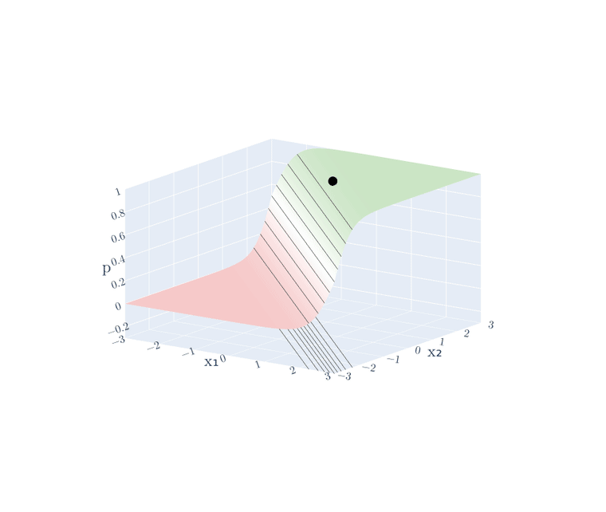
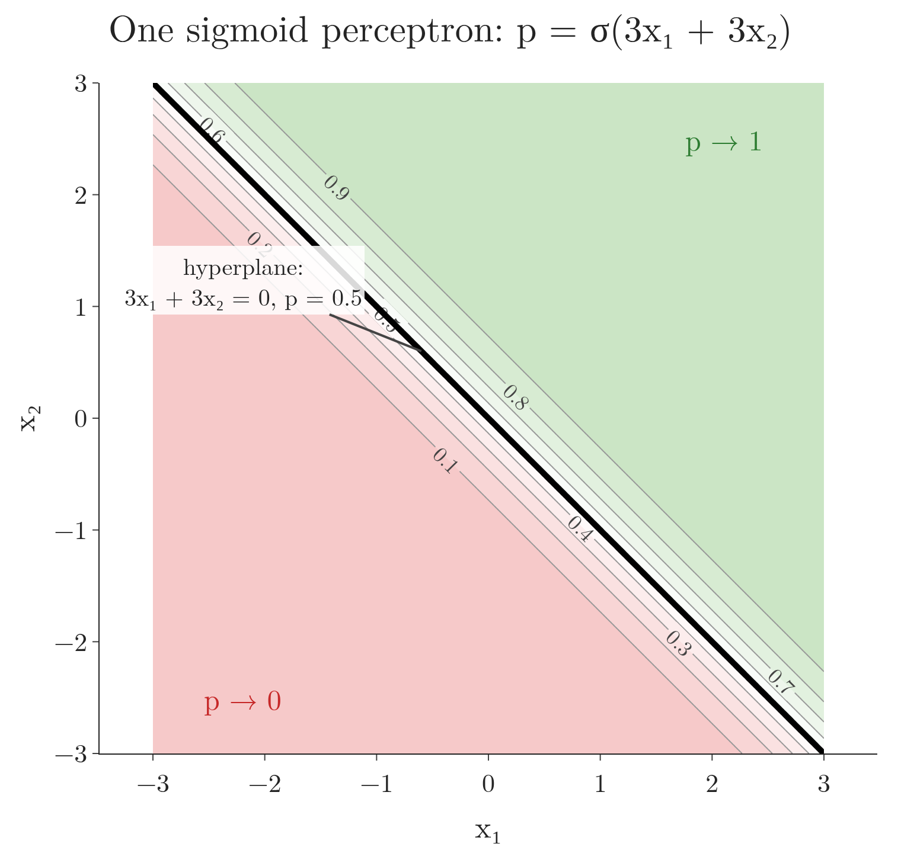
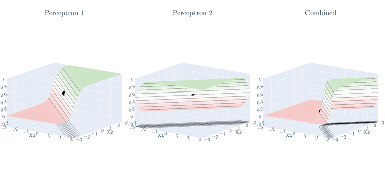
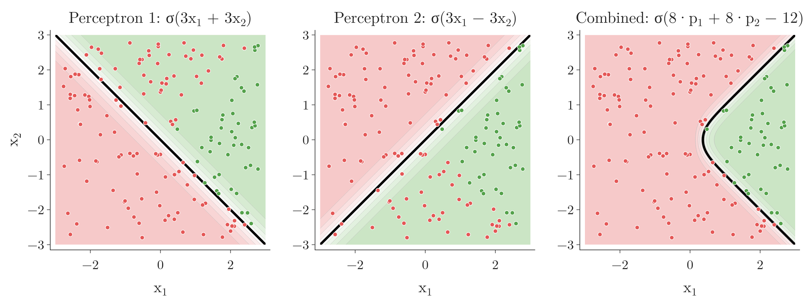
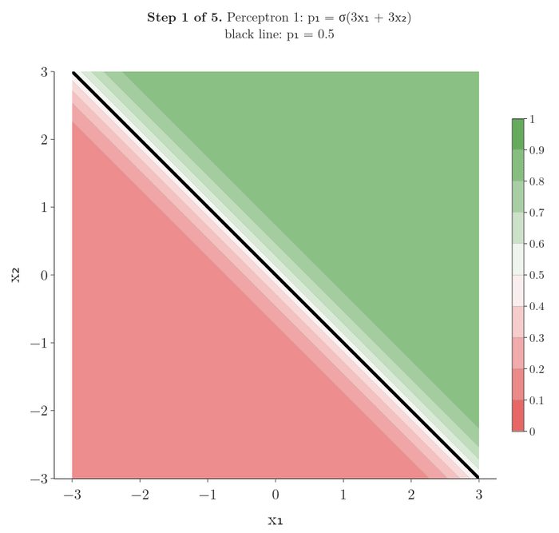
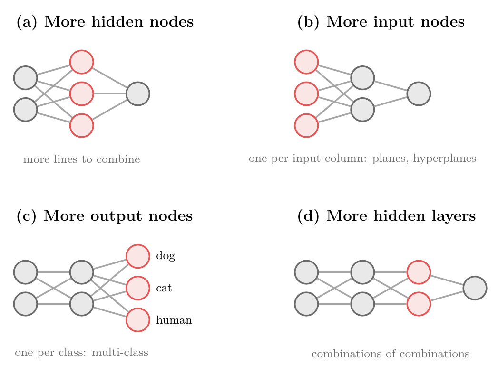
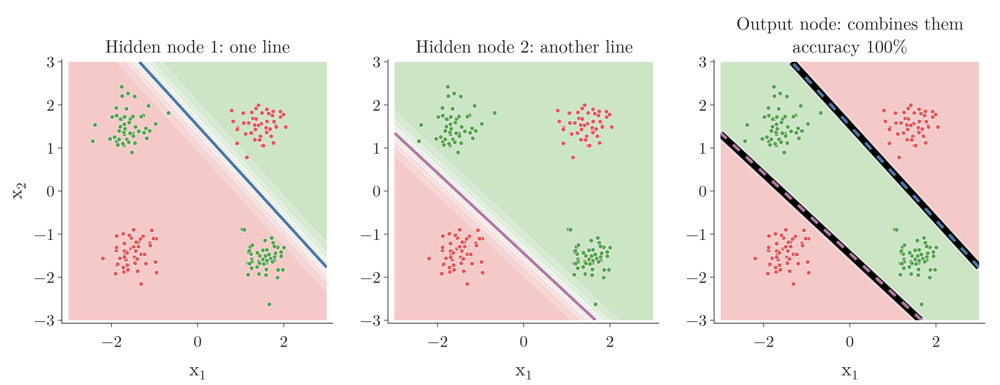
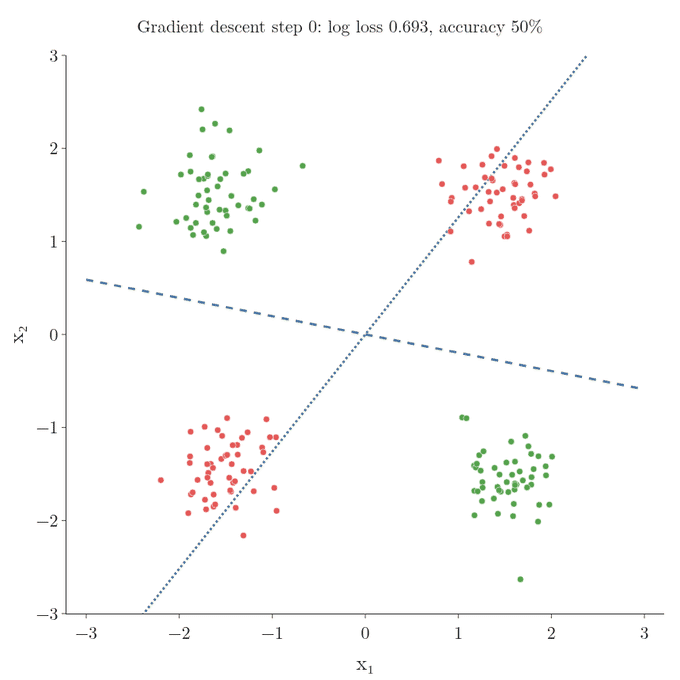
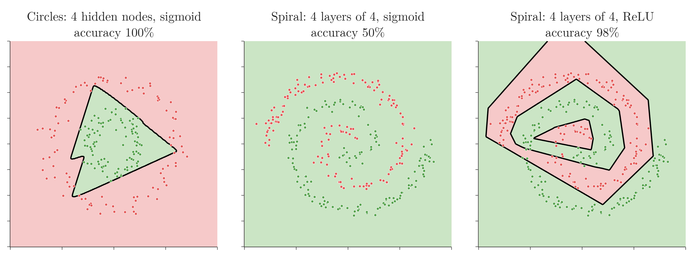

<!-- where-this-fits: generated by course_map/build_map.py; edit concepts.yaml, not this block -->
> **Where this fits:** Pipeline map steps 0 (Foundations), 8 (Model). See the [Course map](../../../00-course-map/00-course-map.md).
>
> 
>
> - **Builds on:** [Neural networks](../../../ML/01-foundations/ML-002-ai-vs-ml-vs-dl/ML-002-ai-vs-ml-vs-dl.md#51-neural-networks); [Sigmoid function](../../../ML/07-classification/ML-071-sigmoid-function/ML-071-sigmoid-function.md#4-the-sigmoid-function); [Types of neural networks](../../../DL/01-basics/DL-003-nn-types-history-applications/DL-003-nn-types-history-applications.md#2-types-of-neural-networks); [Perceptron](../../../DL/01-basics/DL-004-perceptron/DL-004-perceptron.md#3-the-parts-of-a-perceptron); [Problem with the perceptron (XOR)](../../../DL/01-basics/DL-007-problem-with-perceptron/DL-007-problem-with-perceptron.md#1-overview); [MLP notation and parameter count](../../../DL/01-basics/DL-008-mlp-notation/DL-008-mlp-notation.md#7-sources).
> - **Leads to:** [Keras workflow](../../../DL/01-basics/DL-011-customer-churn-ann/DL-011-customer-churn-ann.md#11-key-terms); [ANN for classification](../../../DL/01-basics/DL-011-customer-churn-ann/DL-011-customer-churn-ann.md#1-overview); [Backpropagation](../../../DL/01-basics/DL-015-backpropagation-what/DL-015-backpropagation-what.md#4-the-steps-of-backpropagation); [Activation functions](../../../DL/02-training/DL-027-activation-functions/DL-027-activation-functions.md#3-what-an-activation-function-is).
> - **Compare with:** [Convolutional neural network (CNN)](../../../DL/04-cnn/DL-040-cnn-intuition/DL-040-cnn-intuition.md#1-overview); [Recurrent neural network (RNN)](../../../DL/05-rnn/DL-055-why-rnn/DL-055-why-rnn.md#1-overview).
<!-- /where-this-fits -->

## 1. Overview

> **Key point:** One perceptron has one straight decision boundary, a hyperplane. Feeding the outputs of several perceptrons into another perceptron combines their hyperplanes into a curved decision boundary, and that combination is a multi-layer perceptron.

A single **perceptron** (G-1486) cannot separate data whose classes need a curved **decision boundary** (G-555; the line or curve between the regions given to each class), such as **XOR** (G-2134; see [why one perceptron cannot learn XOR](../DL-007-problem-with-perceptron/DL-007-problem-with-perceptron.md#3-three-tiny-datasets-and-or-and-xor)). The fix must be built from perceptrons themselves. This Note builds the **multi-layer perceptron (MLP)** (G-1270) from first principles: two perceptrons, one way to combine them, and then larger networks.

Throughout this Note every perceptron uses the **sigmoid** (G-1798) activation, not the **step function** (G-1889). The sigmoid is the function

$$\sigma(z) = \frac{1}{1 + e^{-z}}$$

which turns any number $z$ into a number between 0 and 1. For instance:

$$\sigma(0) = 0.5$$

$$\sigma(3) = 0.953$$

$$\sigma(-3) = 0.047$$

So each perceptron outputs a **probability** (G-1574) between 0 and 1, exactly like **logistic regression** (G-1120).

### 1.1 A first picture: one input

> **Key point:** Two hidden nodes each give one S-shaped curve. The output node multiplies each curve by a weight, adds them, and gets a curve that rises and then falls, which no single node can produce.

Before the two-feature case, here is the whole idea with one feature. A drug works only at a medium dose: low 0, medium 1, high 0. The [one-input version of XOR](../DL-007-problem-with-perceptron/DL-007-problem-with-perceptron.md#41-another-way-to-see-it-one-input) showed that no straight line fits this pattern. A network with one input, two sigmoid hidden nodes and one sigmoid output node does fit it. Figure 1 builds its curve step by step.


The numbers come from training this network on the nine patients (script `images/squiggle.py`):

1. **Hidden node 1** is the sigmoid of a weighted input (weight 11.6, bias $-8.5$):

   $$h_1 = \sigma(11.6 \times \text{dose} - 8.5)$$

   It is near 0 for low and medium doses and switches on for high doses.
2. **Hidden node 2** has a negative weight, so its curve is flipped: on for low doses, off for the rest.

   $$h_2 = \sigma(-11.6 \times \text{dose} + 3.2)$$

3. **The output node** multiplies both curves by $-13.3$, adds them, and adds its bias 6.3:

   $$z = -13.3\thinspace h_1 - 13.3\thinspace h_2 + 6.3$$

   Wherever a hidden node is on, $z$ is pulled far below 0. Only at medium doses are both off, and there $z$ stays near $+6.3$.
4. **The sigmoid** turns $z$ into the output $\hat{y} = \sigma(z)$. Here $\hat{y}$ ("y hat") is the network's predicted probability that the drug works.

| Dose | $h_1$ | $h_2$ | $z$ | $\hat{y}$ |
|---|---|---|---|---|
| 0.1 (low) | 0.001 | 0.881 | $-5.43$ | 0.004 |
| 0.5 (medium) | 0.066 | 0.066 | 4.54 | 0.989 |
| 0.9 (high) | 0.881 | 0.001 | $-5.42$ | 0.004 |

Reading the table row by row: $z$ is the output node's weighted sum and $\hat{y}$ its sigmoid. The weights on the input slide and flip each S-curve; the output weights stretch the curves; the output bias shifts the sum. Adding two such curves gives a new shape. The rest of this Note does the same thing with two features, where each S-curve becomes a probability map over the plane.

> **Extra:** Training does not always find these weights. From 20 random starting points, 12 reached all nine patients correct; Figure 1 uses the first of those. Section 5.2 returns to setups that fail to train.

## 2. One perceptron with a sigmoid

> **Key point:** A perceptron with a sigmoid gives every point a probability: 0.5 on its hyperplane, rising towards 1 on one side and falling towards 0 on the other.

With the sigmoid as activation and **binary cross-entropy** (G-303; the loss that scores a predicted probability) as loss, a perceptron is [logistic regression](../DL-006-perceptron-loss/DL-006-perceptron-loss.md#8-one-perceptron-many-models). The data uses three terms:

- each student is one **observation** (G-1374; one record, one row of the data table);
- CGPA $x_1$ and IQ $x_2$ are its two **features** (G-772; input variables, one column each);
- placed or not is the **target** (G-1949; the output we predict).

For one student the perceptron computes

$$\hat{y} = \sigma(w_1 x_1 + w_2 x_2 + b),$$

the probability that the student is placed. The probability of not being placed is $1 - \hat{y}$.

The [probability map of a sigmoid](../../../ML/07-classification/ML-071-sigmoid-function/ML-071-sigmoid-function.md#53-a-map-of-probabilities) draws this as a picture. On the line $w_1 x_1 + w_2 x_2 + b = 0$, the perceptron's **hyperplane** (G-911; a straight line when there are two features), the probability is 0.5. Lines parallel to it carry 0.6, 0.7, 0.8, ... on one side and 0.4, 0.3, ... on the other, so the probability changes gradually across the plane.

The perceptron's probability is a function of two inputs, so it is a surface: for every point $(x_1, x_2)$ the height is $p$. Take the perceptron

$$p = \sigma(3x_1 + 3x_2)$$

Two points on it:

$$p(0.5, 0.5) = \sigma(3 \cdot 0.5 + 3 \cdot 0.5)$$

$$p(0.5, 0.5) = \sigma(3) = 0.953$$

$$p(0, 0) = \sigma(0) = 0.5$$

{height=45%}

Figure 2 shows the surface: flat near 0 where both inputs are small, flat near 1 where both are large, and steep in a band across the middle, like a ramp. The contour map in Figure 3 (see [reading a contour map](../../../MA/06-calculus/MA-062-partial-derivatives-and-gradients/MA-062-partial-derivatives-and-gradients.md#11-reading-a-contour-map)) is this surface seen from above: each line joins points at the same height $p$. Lines close together mean a steep slope, and the line at $p = 0.5$ is the middle of the ramp.

{width=65%}

Figure 3 draws this map for the first perceptron of Figure 5 (section 3.1), the one of Figure 2:

- on the black line, the weighted sum $3x_1 + 3x_2$ is 0, so $p = \sigma(0) = 0.5$;
- moving up and right, $3x_1 + 3x_2$ grows and $p$ rises towards 1; at the point $(0.5, 0.5)$ it is $\sigma(3) = 0.953$;
- moving down and left, $p$ falls towards 0.

All the contour lines are parallel to the hyperplane, because $p$ depends on the point only through $3x_1 + 3x_2$.

## 3. Combining two perceptrons

> **Key point:** Two perceptrons give two probability maps; adding them and passing the sum through a sigmoid gives a new map whose 0.5 decision boundary is curved.

### 3.1 The idea: superimpose, then smooth

> **Key point:** Lay the two maps on top of each other, then smooth the result back into a probability.

Suppose the green points sit in a wedge, as in Figure 5. Perceptron 1 (left) separates them from the points below-left; perceptron 2 (middle) separates them from the points above-left. Neither line alone works: perceptron 1 misclassifies 44 of the 160 points, perceptron 2 misclassifies 40.

Before the maps, the surfaces. Each panel of Figure 4 is the height $p$ above the plane, for the three perceptrons of Figure 5. Their weights are our own, chosen to show the effect:

$$p_1 = \sigma(3x_1 + 3x_2)$$

$$p_2 = \sigma(3x_1 - 3x_2)$$

$$p = \sigma(8p_1 + 8p_2 - 12)$$

The third perceptron reads $p_1$ and $p_2$ instead of the features; sections 3.2 and 3.3 explain this way of combining them. At the point $(0, 0)$:

$$p_1(0, 0) = \sigma(0) = 0.5$$

$$p_2(0, 0) = \sigma(0) = 0.5$$

$$p(0, 0) = \sigma(8 \cdot 0.5 + 8 \cdot 0.5 - 12)$$

$$p(0, 0) = \sigma(-4) = 0.018$$

{height=40%}

Figure 4 shows the three surfaces. Perceptrons 1 and 2 are ramps that rise in different directions; the combination is high only where both ramps are high, so it is a raised plateau with a bent edge.

{height=30%}

Figure 5 is the three surfaces of Figure 4 seen from above (three maps, shaded green where the probability of green is high and red where it is low, with faint contour lines and the black 0.5 line), with the same colours: green where the probability of green is high, red where it is low. If we could lay the two maps on top of each other and smooth the result, we would get the right panel: a decision boundary that follows perceptron 2's line at the top, perceptron 1's line at the bottom, and bends round between them. The next two sections show the arithmetic that does this.

### 3.2 Adding the probabilities

> **Key point:** For each point, add the two perceptrons' probabilities and pass the sum through a sigmoid, so the result is again a probability.

Take one student. Perceptron 1 says the probability of placement is 0.7, perceptron 2 says 0.8. Adding them gives 1.5, which cannot be a probability. The sigmoid fixes that:

1. **In words:** add the two probabilities, then squeeze the sum back into the range 0 to 1 with the sigmoid.
2. **Formula:**
   $$\hat{y} = \sigma(p_1 + p_2)$$
3. **Example:** with $p_1 = 0.7$ and $p_2 = 0.8$,
   $$\hat{y} = \sigma(1.5) = \frac{1}{1 + e^{-1.5}} = 0.818$$

We repeat this for every point. Adding is the superimposing; the sigmoid is the smoothing.

### 3.3 Weights and a bias

> **Key point:** A **weighted sum** (G-2119) plus a bias lets one perceptron count more than the other, and lets us shift the result.

Plain adding treats both perceptrons equally. To make perceptron 1 count twice as much, we multiply its output by a weight of 10 and perceptron 2's by 5, and add a bias of 3:

1. **In words:** multiply each perceptron's probability by its weight, add the bias, and take the sigmoid.
2. **Formula:**
   $$\hat{y} = \sigma(w_1 p_1 + w_2 p_2 + b)$$
3. **Example:** with $w_1 = 10$, $w_2 = 5$, $b = 3$:
   $$z = 10 \times 0.7 + 5 \times 0.8 + 3$$

   $$z = 7 + 4 + 3 = 14$$

   $$\hat{y} = \sigma(14) = 0.99999917 \approx 1.000$$

Figure 5 uses this rule with $w_1 = w_2 = 8$ and $b = -12$. The bias $-12$ is what makes the combination demand **both** probabilities to be high:

| Point $(x_1, x_2)$ | $p_1$ | $p_2$ | $z = 8p_1 + 8p_2 - 12$ | $\hat{y}$ |
|---|---|---|---|---|
| $(1, 0)$ | 0.953 | 0.953 | 3.24 | 0.962 |
| $(0, 0)$ | 0.5 | 0.5 | $-4.00$ | 0.018 |

The point $(0, 0)$ lies on both lines, so each perceptron alone gives it 0.5. The combination gives it 0.018, firmly red: its decision boundary has bent away from both lines, which is the rounded tip in Figure 5.

Figure 6 replays sections 3.1 to 3.3 on the two perceptrons of Figure 5, one step per frame. Each frame is the top view of the surface of that step's value, as in Figure 5.

{width=80%}

1. **Frames 1 and 2:** each perceptron's map has straight, parallel contours.
2. **Frame 3, superimpose:** the plain sum $p_1 + p_2$ is high (near 2) only in the wedge on the right, where both maps are high. Its contours already bend, but its values are not probabilities.
3. **Frame 4, weights and bias:** the weighted sum with bias is
   $$z = 8p_1 + 8p_2 - 12$$
   It is above 0 only where $p_1 + p_2 > 1.5$. The black line $z = 0$ is curved.
4. **Frame 5, smooth:** the sigmoid squeezes $z$ into 0 to 1. The line $z = 0$ becomes the 0.5 decision boundary.

### 3.4 The combiner is a perceptron

> **Key point:** Weighted sum, bias, sigmoid: the combining step is itself a perceptron, whose inputs are the outputs of perceptrons 1 and 2.

Look again at $\sigma(w_1 p_1 + w_2 p_2 + b)$. This expression is exactly what a perceptron computes, except that its inputs are not features of the data but the outputs of two other perceptrons. So the whole model is three perceptrons connected together (Figure 7).

{height=34%}

- Perceptron 1 computes (CGPA is $x_1$, IQ is $x_2$):

  $$p_1 = \sigma(2 x_1 + 3 x_2 + 6)$$

- Perceptron 2 computes:

  $$p_2 = \sigma(5 x_1 + 4 x_2 + 3)$$

- Both read the same two inputs, so CGPA and IQ each connect to both of them.
- Perceptron 3 computes:

  $$\hat{y} = \sigma(10 p_1 + 5 p_2 + 3)$$

The nodes now sit in layers: an **input layer** (G-952; CGPA, IQ), a **hidden layer** (G-890; perceptrons 1 and 2) and an **output layer** (G-1424; perceptron 3). This layered network is a multi-layer perceptron. Why it can bend, step by step:

1. Each hidden perceptron gives a probability map whose 0.5 contour is a straight line.
2. The output perceptron adds the two maps with weights and a bias.
3. The sigmoid squeezes that sum back into 0 to 1. With the weights of Figure 5, the 0.5 contour of the result follows perceptron 1's line where perceptron 2 is near 1, follows perceptron 2's line where perceptron 1 is near 1, and bends round where both are in between (the rounded tip of Figure 5).

No single perceptron can do this, because its 0.5 contour is always one straight line.

> **Extra:** The sigmoid between the layers is essential. Without it, the hidden layer would output $2x_1 + 3x_2 + 6$ and $5x_1 + 4x_2 + 3$, and the output layer would add multiples of them: still a straight line. The general version is that [stacked linear layers collapse into one](../../../MA/05-linear-algebra/MA-054-matrix-multiplication-as-composition/MA-054-matrix-multiplication-as-composition.md#73-linear-layers-collapse-into-one).

## 4. Four ways to change the architecture

> **Key point:** We can add hidden nodes, input nodes, output nodes or hidden layers. Each answers a different need.

The **architecture** (G-209) of a neural network is how its nodes are arranged and connected: how many layers, how many nodes in each, and which nodes are joined by weights. Figure 8 shows four ways to change it, with the changed part in red.

{height=46%}

### 4.1 More nodes in a hidden layer

> **Key point:** Each extra hidden node adds one more hyperplane to combine, so the decision boundary can bend in more places.

With three hidden perceptrons instead of two (Figure 8a), the output perceptron combines three lines. The formula just gains a term. For hidden outputs 0.2, 0.3 and 0.4, weights 1, 2 and 3 and a bias of 10:

$$z = 1 \times 0.2 + 2 \times 0.3 + 3 \times 0.4 + 10$$

$$z = 0.2 + 0.6 + 1.2 + 10 = 12.0$$

$$\hat{y} = \sigma(12.0) = 0.99999$$

Each extra hidden node adds one more straight line to the combination, so the decision boundary can change direction in one more place. On the two circles of section 5.2, the accuracy rises with the number of hidden nodes: 66% with 1 node, 85% with 2, 99% with 3 and 100% with 4 (Notebook).

### 4.2 More nodes in the input layer

> **Key point:** One input node per feature; with three features, each hidden perceptron is a plane instead of a line.

The input layer has one node per feature, so we add input nodes only when the data gains a feature (Figure 8b). With 12th marks as a third feature, every point lives in 3D. Each hidden perceptron is then a **plane** (G-1502), and the output perceptron combines planes in exactly the same way. With four or more features the planes become hyperplanes (see [from a line to a hyperplane](../../../MA/05-linear-algebra/MA-051-equation-of-a-hyperplane/MA-051-equation-of-a-hyperplane.md#3-from-a-line-to-a-hyperplane)).

### 4.3 More nodes in the output layer

> **Key point:** For multi-class classification, one output node per class; the class with the highest output wins.

So far the output layer had one node. In **multi-class classification** (G-1266) there are more than two classes. To tell whether a photo shows a dog, a cat or a human, we give the output layer three nodes, one per class (Figure 8c). Each gives a score for its class, and we predict the class with the highest one.

> **Extra:** In practice the three output scores are turned into probabilities that add up to 1 with the **softmax function** (G-1830), exactly as in [softmax regression](../../../ML/07-classification/ML-078-softmax-regression/ML-078-softmax-regression.md#2-the-softmax-function) (Goodfellow et al. 2016, §6.2.2.3). Softmax with categorical cross-entropy is the combination described in [one perceptron, many models](../DL-006-perceptron-loss/DL-006-perceptron-loss.md#8-one-perceptron-many-models).

### 4.4 More hidden layers

> **Key point:** A second hidden layer combines the curved decision boundaries of the first, so the network can form even more complex shapes.

We can also add whole hidden layers (Figure 8d):

1. the first hidden layer still defines straight lines (hyperplanes);
2. the second combines those into curves;
3. the third combines curves into more complex shapes, and so on.

With enough hidden nodes, an MLP can approximate any continuous function: the **universal approximation theorem** (G-2052; see [universal approximation](../DL-003-nn-types-history-applications/DL-003-nn-types-history-applications.md#33-universal-approximation)). The theorem only says such weights exist; it does not promise that training finds them (Goodfellow et al. 2016, §6.4.1). The price is more parameters and longer training.

### 4.5 What a hidden node can detect

> **Key point:** A hidden node's weights are a pattern. Its weighted sum is large when the input matches the pattern, so each hidden node detects one simple feature, and later layers combine features into larger ones.

So far a hidden node was a line on a plane. With an image as input, the same weighted sum has a second reading. Take a $28 \times 28$ image of a digit: 784 pixels, each between 0 (white) and 1 (ink). A hidden node has one weight per pixel, so its weights can be drawn as a $28 \times 28$ grid too.


In Figure 9 we set the weights by hand to look for a horizontal stroke near the top:

1. **Positive weights on a strip.** Ink on the strip adds to the weighted sum.
2. **Negative weights around the strip.** Ink just above or below subtracts, so a large blob of ink does not count as a stroke.
3. **The 7** has a horizontal stroke on the strip: its weighted sum is 14.8, and after the sigmoid the node is fully on.
4. **The 1** only crosses the strip: its weighted sum is $-4.0$, and the node is off.

Such a node is an **edge detector** (G-2263). Stacking layers repeats the idea: nodes in the next layer take the edge detectors' outputs as inputs and can respond to a combination of edges, such as a loop or a long line; a later layer combines those into a whole digit (a 9 is a loop on top of a line). That layering is described in [layers extract features of rising complexity](../DL-002-what-is-deep-learning/DL-002-what-is-deep-learning.md#24-layers-extract-features-of-rising-complexity). In a trained network nobody sets these weights; training finds them. [What the filters look like](../../04-cnn/DL-052-visualizing-cnn/DL-052-visualizing-cnn.md#52-what-the-filters-look-like) shows the patterns a trained image network actually learns.

## 5. Seeing it work

> **Key point:** Two hidden nodes are enough for XOR. Each defines one straight line, and the output node keeps the strip between the two lines.

### 5.1 XOR with two hidden nodes

> **Key point:** Hidden node 1 and hidden node 2 each define a line; the output node says "class 1" only between them. All 200 points are classified correctly.

We return to XOR, the data no single perceptron can separate (see [why one perceptron cannot learn XOR](../DL-007-problem-with-perceptron/DL-007-problem-with-perceptron.md#3-three-tiny-datasets-and-or-and-xor)). Each of the four XOR inputs, centred as $(\pm 1.5, \pm 1.5)$, gets a small cloud of 50 noisy points. Class 1 (green) is where exactly one input is positive, as in the XOR table.

The network has 2 inputs, **2 sigmoid hidden nodes** and 1 sigmoid output node. We train it with plain [gradient descent](../../../ML/06-regression/ML-056-gradient-descent/ML-056-gradient-descent.md#2-the-idea) (G-862; repeated small steps downhill on the loss) on the [log loss](../../../ML/07-classification/ML-072-log-loss/ML-072-log-loss.md#62-the-loss-function) (G-303): **learning rate** (G-1068; the step size) 1, 5,000 steps, starting from small random weights. (How the gradients of the hidden weights are found is the topic of [the steps of backpropagation](../DL-015-backpropagation-what/DL-015-backpropagation-what.md#4-the-steps-of-backpropagation).)

{height=30%}

Figure 10 reads like Section 3, from left to right:

- **Hidden node 1** defines a line (its hyperplane) just below the top-right cluster: it says 1 only for the $(+,+)$ cluster.
- **Hidden node 2** defines a parallel line just above the bottom-left cluster: it says 1 for every cluster except $(-,-)$.
- **The output node** computes $\sigma(-12.6\thinspace h_1 + 12.2\thinspace h_2 - 5.8)$: class 1 when node 2 is on **and** node 1 is off. The region where both hold is exactly the strip between the two lines, where the two green clusters sit.

The accuracy is 100%. The same training from 100 different random starting weights also reached 100% every time (Notebook).

Figure 11 replays that training, frame by frame.



In Figure 11 the shading is the probability of class 1 at each spot (green: high, red: low), and the black line is the decision boundary, where that probability is 0.5. It is the top view of a probability surface like those of Figure 4.

1. **Steps 0 to about 1,500: a long flat stretch.** The weights start tiny (spread 0.01), so both hidden nodes output almost exactly 0.5 everywhere, and the log loss stays at 0.693, the loss of guessing 0.5 for every point. Each hidden weight's update is multiplied by the output node's weight to that node (the `dH` line of `TwoNodeNet.fit` in `images/playground.py`), and those output weights also start near 0.01, so the hidden weights grow only slowly.
2. **Steps 1,500 to 1,750: the escape.** Once the weights are large enough, the two hidden lines swing apart. The loss falls from 0.693 to 0.178, and the accuracy climbs from 54 to 74, 92 and then 100 percent.
3. **Steps 1,750 to 5,000: sharpening.** The lines settle on either side of the green clusters, and the output's probabilities get steeper. The loss keeps falling, to 0.003.

The trained network matches the textbook solution. Goodfellow et al. (§6.1) write down a network with two hidden units that solves the four XOR points (0 or 1 inputs) exactly. Its two units bend at two parallel lines. The hidden values are

$$h_1 = \max(0,\ x_1 + x_2)$$

$$h_2 = \max(0,\ x_1 + x_2 - 1)$$

and the output is $h_1 - 2h_2$. Here $\max(0, a)$ is $a$ when $a$ is positive and 0 otherwise. Working the four points through, one row each:

| $x_1$ | $x_2$ | $h_1$ | $h_2$ | $h_1 - 2h_2$ |
|---|---|---|---|---|
| 0 | 0 | 0 | 0 | $0 - 0 = 0$ |
| 0 | 1 | 1 | 0 | $1 - 0 = 1$ |
| 1 | 0 | 1 | 0 | $1 - 0 = 1$ |
| 1 | 1 | 2 | 1 | $2 - 2 = 0$ |

The output is 0, 1, 1, 0: it is high only along the strip around $x_1 + x_2 = 1$, where the two class-1 points sit, and drops back to 0 on either side.

> **Extra:** Our hidden nodes use the sigmoid, as everywhere in this Note. Goodfellow et al. use ReLU, an activation taught later. The picture is the same: two lines, and the output keeps the strip between them.

### 5.2 Other shapes

> **Key point:** On circles and spirals, small MLPs find the curved decision boundaries a single perceptron cannot. A poor setup still fails.

**TensorFlow Playground** (G-1958; first used in [what the perceptron learns](../DL-007-problem-with-perceptron/DL-007-problem-with-perceptron.md#4-what-the-perceptron-learns)) lets us build small networks in the browser and watch them train. Figure 12 repeats two more of its demos in Python, with scikit-learn's `MLPClassifier` (G-1246), so the results can be rerun from the Notebook.

{height=26%}

In Figure 12 the background shade is the probability of the green class at each spot (green: high, red: low), and the boundary between the two colours, where the probability is 0.5, is the decision boundary.

Reading the panels in order:

- **Circles, 4 hidden nodes:** 100%. Four lines combine into a closed shape around the inner circle. With fewer nodes it falls short: 66% with 1 node, 85% with 2, 99% with 3 (Notebook).
- **Spirals, 4 hidden layers of 4 sigmoid nodes:** 50%, no better than guessing. The network predicts one class everywhere.
- **Spirals, same layers with ReLU:** 98% in the figure. Changing only the activation function makes the deep network trainable.

Averaged over 5 random starts (adam solver, Notebook), the sigmoid network stays at 50% every time, while the ReLU network reaches 84% (73% to 98%). The sigmoid network stalls because of the **vanishing gradient** (G-2070):

1. To update a weight, training multiplies the gradient by the sigmoid's derivative once for every layer it passes back through.
2. That derivative is at most 0.25.
3. After four sigmoid layers, the gradient that reaches the first layer is tiny, so its weights barely change.

The effect is like a message passed down a long line of whisperers, each one quieter than the last. [The vanishing gradient problem](../DL-018-vanishing-exploding-gradients/DL-018-vanishing-exploding-gradients.md#3-the-vanishing-gradient-problem) works through it in detail.

The ReLU network escapes this. ReLU's derivative is 1 wherever its input is positive, so for every active node the gradient passes back through the layer without shrinking (Goodfellow et al. 2016, §6.3.1).

TensorFlow Playground also draws what each hidden node has learned. A first-layer node computes $\sigma(w_1x_1 + w_2x_2 + b)$, so its 0.5 decision boundary is always a straight line; the later layers combine those lines into curves, as in Figure 10.

> **Python:** An MLP in scikit-learn.
>
> ```python
> from sklearn.neural_network import MLPClassifier
>
> # one hidden layer with 4 nodes, sigmoid activation
> clf = MLPClassifier(hidden_layer_sizes=(4,),
>                     activation="logistic",
>                     solver="lbfgs", max_iter=5000,
>                     random_state=0)
> clf.fit(X, y)
> clf.score(X, y)      # 1.0 on the circles data
> ```
>
> `hidden_layer_sizes=(4, 4, 4, 4)` gives four hidden layers of 4 nodes. scikit-learn calls the sigmoid `"logistic"`. The input and output layers are sized automatically from `X` and `y`.

> **Extra:** **ReLU** (G-1668) is another activation function, the recommended default for hidden units in modern networks (Goodfellow et al. 2016, §6.3). The `solver` (G-1836; lbfgs or adam) is the method used to find the weights; adam is one of the **optimizers** (G-1401) covered later. The circles use lbfgs and the spirals adam, because each worked best on its data. Averaged over 5 random starts (Notebook): on the circles, lbfgs 97% against adam 47%; on the ReLU spirals, adam 84% against lbfgs 78%. Adam's 47% on the circles is a stopping problem, not a weak method: its loss sits at 0.693 on a flat stretch, like the start of Figure 11, and scikit-learn's default stopping rule (`n_iter_no_change=10`, `tol=1e-4`) ends training there after 41 to 274 steps. With `n_iter_no_change=5000` the same five runs reach 99 to 100% (Notebook).

## 6. Summary

| Change | What it adds | When |
|---|---|---|
| More hidden nodes | More lines to combine | Data with more non-linearity |
| More input nodes | Planes or hyperplanes instead of lines | Data with more features |
| More output nodes | One output per class | Multi-class classification |
| More hidden layers | Combinations of combinations | Very complex boundaries |

- A sigmoid perceptron gives every point a probability; its 0.5 line is a straight decision boundary, because the probability depends on the point only through the weighted sum.
- Combining perceptrons: $\hat{y} = \sigma(w_1 p_1 + w_2 p_2 + b)$, itself a perceptron, so a whole network is built from one repeated unit.
- Input layer, hidden layer, output layer: that is a multi-layer perceptron.
- The sigmoid between layers is what lets the combined decision boundary curve; without it, the layers add up to a straight line again.
- With one input, two hidden nodes give two S-curves; weighted and added, they make a curve that rises and falls, so the network fits the medium-dose pattern that no straight line fits.
- With an image as input, a hidden node's weights are a pattern, such as an edge, because its weighted sum is large only when the input matches the pattern; later layers combine such patterns.
- Two hidden nodes already solve XOR: two lines, and the output keeps the strip between them.
- With enough nodes and layers an MLP can approximate any continuous function; in practice the setup (size, activation, solver) decides whether training finds it, because the theorem only says good weights exist (deep sigmoid networks, for example, stall on vanishing gradients).
- So feeding several perceptrons into another one combines their straight boundaries into a curved one, and that layered combination is the multi-layer perceptron.

## 7. Sources

**Built from**

- CampusX, "Multi Layer Perceptron | MLP Intuition", YouTube, https://www.youtube.com/watch?v=qw7wFGgNCSU
- StatQuest with Josh Starmer, "The Essential Main Ideas of Neural Networks", YouTube, https://www.youtube.com/watch?v=CqOfi41LfDw (a curve built from two hidden nodes with one input, section 1.1)
- Sanderson, G. (3Blue1Brown), "But what is a neural network? | Deep learning chapter 1", 2017, https://www.youtube.com/watch?v=aircAruvnKk (a hidden node's weights as an edge detector; layers of edges, parts and digits; section 4.5)

**Other references**

- Goodfellow, Bengio and Courville, *Deep Learning*, MIT Press, 2016, §6.1 (a network with two hidden units that solves XOR), §6.2.2.3 (softmax output units), §6.3 (ReLU as the default hidden unit), §6.3.1 (the derivative of a ReLU is 1 wherever the unit is active, so gradients stay large), §6.4.1 (universal approximation: the weights exist, but training may not find them).

## 8. Key terms

| Term | Meaning |
|---|---|
| Combining perceptrons | Feeding several perceptrons' outputs, weighted and with a bias, into another perceptron, so their straight boundaries combine into a curved decision boundary; this is a multi-layer perceptron. |
| Edge detector (hidden node) (G-2263) | A node whose weights are positive on a strip of pixels and negative around it, so it switches on when that strip holds a stroke |
| Architecture (of a neural network) (G-209) | How the nodes are arranged in layers and connected by weights |
| Multi-class output layer | An output layer with one node per class; the highest output gives the prediction |
| MLPClassifier | scikit-learn's class for a classifier built from layers of perceptrons (a multi-layer perceptron). |
| hidden_layer_sizes | MLPClassifier setting: the number of nodes in each hidden layer, e.g. (4, 4) |
| ReLU | Rectified linear unit, the activation $\max(0, z)$: it passes a positive input unchanged and turns a negative one into 0; the usual default activation for hidden layers. |
