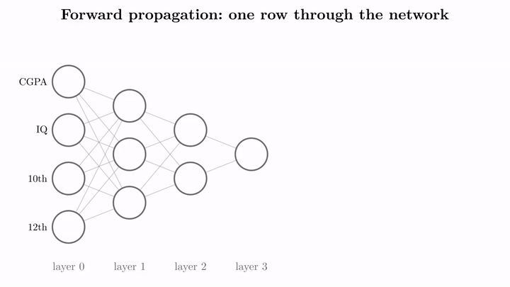
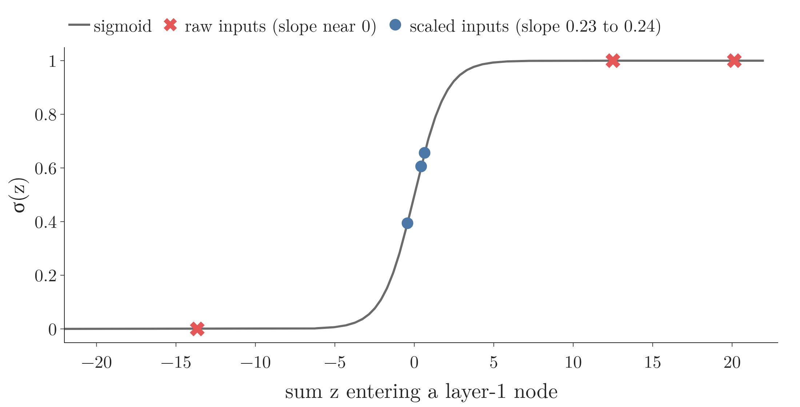
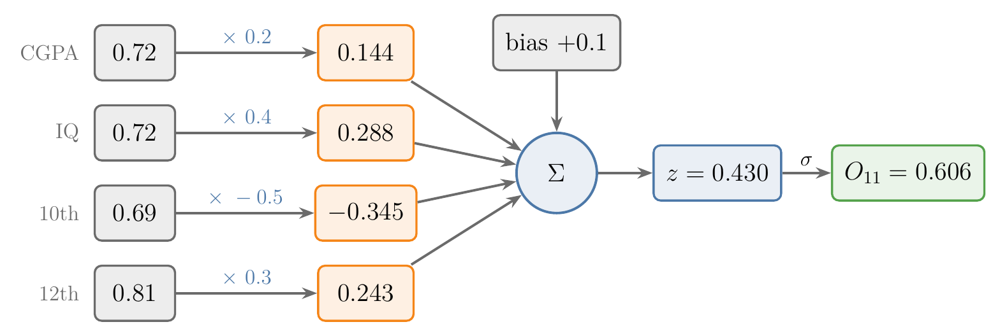
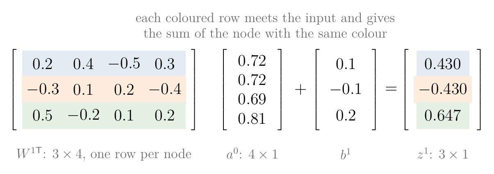
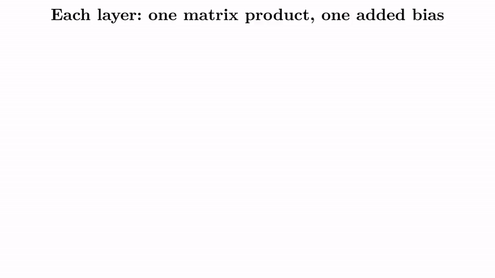
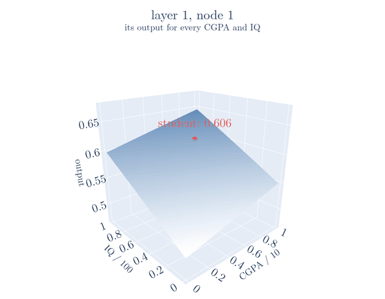

<!-- where-this-fits: generated by course_map/build_map.py; edit concepts.yaml, not this block -->
> **Where this fits:** Pipeline map step 8 (Model). See the [Course map](../../../00-course-map/00-course-map.md).
>
> 
>
> - **Builds on:** [Matrix multiplication as composition](../../../MA/05-linear-algebra/MA-054-matrix-multiplication-as-composition/MA-054-matrix-multiplication-as-composition.md#2-composition-one-transformation-after-another); [MLP notation and parameter count](../../../DL/01-basics/DL-008-mlp-notation/DL-008-mlp-notation.md#2-the-setup-layers-and-data).
> - **Leads to:** [Loss functions in deep learning](../../../DL/01-basics/DL-014-dl-loss-functions/DL-014-dl-loss-functions.md#3-why-the-loss-function-matters); [Backpropagation](../../../DL/01-basics/DL-015-backpropagation-what/DL-015-backpropagation-what.md#4-the-steps-of-backpropagation); [Recurrent neural network (RNN)](../../../DL/05-rnn/DL-055-why-rnn/DL-055-why-rnn.md#6-the-idea-behind-an-rnn).
<!-- /where-this-fits -->

## 1. Overview

> **Key point:** To predict, a network passes one observation forward, layer by layer. Each layer is one matrix product, one added bias and one sigmoid, however many nodes it has.

**Forward propagation** (G-797) is the computation that turns one **observation** (G-1374) (one record, one row of the data table) into a prediction, moving from the input layer through every hidden layer to the output layer. Forward propagation is how a trained network predicts. The same pass is also the first half of every training step:

1. the network predicts (forward propagation);
2. it measures its error;
3. **backpropagation** (G-247), the training algorithm of later Notes, sends that error backwards to update the weights (previewed in section 10 of the [Jacobian](../../../MA/06-calculus/MA-063-jacobian-and-matrix-gradients/MA-063-jacobian-and-matrix-gradients.md#10-preview-backpropagation-and-automatic-differentiation)).

{height=45%}

Figure 1 shows the whole computation for one student. Each circle is a node (one perceptron); the number inside is that node's output for this student; the layers go from left to right, and the equation shown with each layer is the computation that produced its numbers. The rest of this Note works through it, layer by layer, with every number.

## 2. The network and the observation

> **Key point:** The 4-3-2-1 network has 26 parameters. We feed it one student: CGPA 7.2, IQ 72, 10th marks 69, 12th marks 81.

We use the 4-3-2-1 network and the notation of the [MLP notation](../DL-008-mlp-notation/DL-008-mlp-notation.md#21-numbering-the-layers): 4 inputs, hidden layers of 3 and 2 nodes, and 1 output. The input layer holds the observation, the two hidden layers are the layers between input and output, and the output layer gives the prediction. Counting the weights and biases, which together are the **parameters** (G-1448) of the network:

$$\text{weights} = 4 \times 3 + 3 \times 2 + 2 \times 1 = 20$$

$$\text{biases} = 3 + 2 + 1 = 6$$

$$\text{total} = 20 + 6 = 26$$

Every node is a perceptron with a sigmoid activation. The **sigmoid** (G-1798) is the function

$$\sigma(z) = \frac{1}{1 + e^{-z}}$$

which turns any number $z$ into a number between 0 and 1 (for example $\sigma(0) = 0.5$), so every node output lies between 0 and 1.

The data has four **features** (G-772) (input variables, one column each) and the **target** (G-1949) *placed* (the output we predict). One observation enters the input layer:

| CGPA | IQ | 10th marks | 12th marks |
|---|---|---|---|
| 7.2 | 72 | 69 | 81 |

Before it enters, we scale the observation into the range 0 to 1: CGPA divided by 10, the others by 100. So the input is $a^{0} = (0.72,\ 0.72,\ 0.69,\ 0.81)$.

> **Extra:** Why scale first? With the raw values, the first hidden layer's sums are 20.1, $-13.7$ and 12.5, and the sigmoid turns them into 1.000, 0.000 and 1.000. Every node is pinned at an extreme. The sigmoid's slope there, $\sigma(z)(1 - \sigma(z))$ (see the [sigmoid derivative](../../../ML/07-classification/ML-073-sigmoid-derivative/ML-073-sigmoid-derivative.md#4-the-shape-of-the-derivative)), is only $1.8 \times 10^{-9}$, $1.2 \times 10^{-6}$ and $3.7 \times 10^{-6}$, so a small change to a weight hardly changes the node's output. Backpropagation multiplies every gradient through a node by this slope, so these weights would barely move in training. The [data scaling](../../02-training/DL-023-data-scaling-in-ann/DL-023-data-scaling-in-ann.md#4-why-unscaled-inputs-break-training) standardizes the inputs instead (see the [standardization](../../../ML/03-feature-engineering/ML-023-standardization/ML-023-standardization.md#42-the-formula)); dividing by 10 and 100 keeps the numbers here easy to follow.

{height=28%}

Figure 2 shows the Extra box as a picture. The horizontal axis is the sum $z$ of a node, and the height is $\sigma(z)$. Watch where the crosses sit. On the flat tails a change in $z$ barely moves $\sigma(z)$, so those nodes cannot learn; the scaled sums sit where the curve is steepest.

The weights are not trained here: we set them by hand to one decimal, so that every step can be checked with a calculator. Training would find better values; forward propagation works the same either way.

## 3. What one node computes

> **Key point:** Each node takes the outputs of the previous layer, multiplies each by its weight, adds its bias and applies the sigmoid.

Every node does what a single perceptron does (see the [perceptron](../DL-004-perceptron/DL-004-perceptron.md#3-the-parts-of-a-perceptron)), with the sigmoid as its activation. For node 1 of layer 1:

1. **In words:** multiply each input by the weight on its connection to this node, add them up, add the node's bias, and pass the total through the sigmoid.
2. **Formula:**
   $$z = W_{11}^{1}x_{1} + W_{21}^{1}x_{2}$$
   $$\quad + W_{31}^{1}x_{3} + W_{41}^{1}x_{4} + b_{11}$$
   $$O_{11} = \sigma(z)$$
3. **Example:** with weights $0.2, 0.4, -0.5, 0.3$ and bias $0.1$,
   $$0.2 \times 0.72 = 0.144$$
   $$0.4 \times 0.72 = 0.288$$
   $$-0.5 \times 0.69 = -0.345$$
   $$0.3 \times 0.81 = 0.243$$
   $$z = 0.144 + 0.288 - 0.345 + 0.243 + 0.1$$
   $$z = 0.430$$
   $$O_{11} = \sigma(0.430)$$
   $$O_{11} = \frac{1}{1 + e^{-0.430}}$$
   $$O_{11} = 0.606$$

{height=28%}

In Figure 3, follow the numbers left to right: the four products 0.144, 0.288, $-0.345$ and 0.243 plus the bias 0.1 give $z = 0.430$, and the sigmoid turns it into 0.606.

Doing this node by node works, but a large network has thousands of nodes. Linear algebra does a whole layer in one step.

## 4. Layer 1 as one matrix product

> **Key point:** Put the layer's weights in a matrix with one row per input node and one column per receiving node; then $z^{1} = W^{1\mathsf T} a^{0} + b^{1}$ gives all three sums at once.

### 4.1 The weight matrix

> **Key point:** Row $i$, column $j$ of $W^{1}$ holds $W_{ij}^{1}$: from input node $i$ to node $j$.

We collect the 12 weights entering layer 1 in a $4 \times 3$ matrix. Row $i$ holds the weights leaving input node $i$; column $j$ holds the weights entering node $j$:

$$W^{1} = \begin{bmatrix} W_{11}^{1} & W_{12}^{1} & W_{13}^{1} \cr W_{21}^{1} & W_{22}^{1} & W_{23}^{1} \cr W_{31}^{1} & W_{32}^{1} & W_{33}^{1} \cr W_{41}^{1} & W_{42}^{1} & W_{43}^{1} \end{bmatrix}$$

$$W^{1} = \begin{bmatrix} 0.2 & -0.3 & 0.5 \cr0.4 & 0.1 & -0.2 \cr-0.5 & 0.2 & 0.1 \cr0.3 & -0.4 & 0.2 \end{bmatrix}$$

$$b^{1} = \begin{bmatrix} 0.1 \cr-0.1 \cr0.2 \end{bmatrix}$$

The first column, $(0.2, 0.4, -0.5, 0.3)$, is exactly the four weights node 1 used in Section 3.

### 4.2 The product

> **Key point:** Transpose to $3 \times 4$, multiply by the $4 \times 1$ input, add the $3 \times 1$ bias: a $3 \times 1$ result, one number per node.

To get one sum per node, each column of $W^{1}$ must meet the input. The **transpose** (G-2012) $W^{1\mathsf T}$ turns the columns of $W^{1}$ into rows (a $4 \times 3$ matrix becomes $3 \times 4$), and then the product does exactly that (a matrix times a vector, see the [linear transformations](../../../MA/05-linear-algebra/MA-053-linear-transformations-and-matrices/MA-053-linear-transformations-and-matrices.md#73-neural-network-layers-and-pca), section 7.3).

1. **In words:** multiply the transposed weight matrix by the input vector, add the bias vector, then apply the sigmoid to every entry.
2. **Formula:**
   $$z^{1} = W^{1\mathsf T} a^{0} + b^{1}$$
   $$a^{1} = \sigma(z^{1})$$
   The shapes follow the shape rule of the [matrix multiplication](../../../MA/05-linear-algebra/MA-054-matrix-multiplication-as-composition/MA-054-matrix-multiplication-as-composition.md#71-the-shape-rule) (section 7.1):
   $$(3 \times 4)(4 \times 1) = 3 \times 1$$
   $$(3 \times 1) + (3 \times 1) = 3 \times 1$$
3. **Example:**
   $$W^{1\mathsf T} = \begin{bmatrix} 0.2 & 0.4 & -0.5 & 0.3 \cr-0.3 & 0.1 & 0.2 & -0.4 \cr0.5 & -0.2 & 0.1 & 0.2 \end{bmatrix}$$
   $$a^{0} = \begin{bmatrix} 0.72 \cr0.72 \cr0.69 \cr0.81 \end{bmatrix}$$
   $$W^{1\mathsf T} a^{0} = \begin{bmatrix} 0.330 \cr-0.330 \cr0.447 \end{bmatrix}$$
   $$b^{1} = \begin{bmatrix} 0.1 \cr-0.1 \cr0.2 \end{bmatrix}$$
   $$z^{1} = W^{1\mathsf T} a^{0} + b^{1}$$
   $$z^{1} = \begin{bmatrix} 0.330 \cr-0.330 \cr0.447 \end{bmatrix} + b^{1}$$
   $$z^{1} = \begin{bmatrix} 0.430 \cr-0.430 \cr0.647 \end{bmatrix}$$
   $$a^{1} = \sigma(z^{1}) = \begin{bmatrix} 0.606 \cr0.394 \cr0.656 \end{bmatrix}$$
   $$a^{1} = \begin{bmatrix} O_{11} \cr O_{12} \cr O_{13} \end{bmatrix}$$

{height=26%}

In Figure 4, match the colours: the blue row is the four weights of Figure 3, and it produces the same 0.430. One product computes all three nodes at once.

The first entry, 0.606, is the $O_{11}$ we computed by hand in Section 3. The vector $a^{1}$, the outputs of layer 1, is called the **activation** (G-164) of layer 1. The activation $a^{1}$ is the input to layer 2.

## 5. Layers 2 and 3

> **Key point:** The same step repeats: the previous layer's activation goes in, this layer's activation comes out, until the output layer gives $\hat{y}$.

### 5.1 Layer 2

> **Key point:** Shapes: $2 \times 3$ times $3 \times 1$ gives $2 \times 1$; the $2 \times 1$ bias adds to it.

Layer 2 has 6 weights, from 3 nodes to 2, in a $3 \times 2$ matrix:

$$W^{2} = \begin{bmatrix} 0.6 & -0.4 \cr-0.2 & 0.5 \cr0.3 & 0.7 \end{bmatrix}$$

$$b^{2} = \begin{bmatrix} 0.1 \cr-0.2 \end{bmatrix}$$

$$z^{2} = W^{2\mathsf T} a^{1} + b^{2}$$

$$W^{2\mathsf T} = \begin{bmatrix} 0.6 & -0.2 & 0.3 \cr-0.4 & 0.5 & 0.7 \end{bmatrix}$$

$$a^{1} = \begin{bmatrix} 0.606 \cr0.394 \cr0.656 \end{bmatrix}$$

$$W^{2\mathsf T} a^{1} = \begin{bmatrix} 0.482 \cr0.414 \end{bmatrix}$$

$$z^{2} = \begin{bmatrix} 0.482 \cr0.414 \end{bmatrix} + b^{2}$$

$$z^{2} = \begin{bmatrix} 0.582 \cr0.214 \end{bmatrix}$$

$$a^{2} = \sigma(z^{2}) = \begin{bmatrix} 0.641 \cr0.553 \end{bmatrix}$$

The two entries are $O_{21}$ and $O_{22}$.

### 5.2 Layer 3: the prediction

> **Key point:** Shapes: $1 \times 2$ times $2 \times 1$ gives $1 \times 1$; the $1 \times 1$ bias adds to it. A single number, the probability of placement.

The output layer has 2 weights and 1 bias:

$$W^{3} = \begin{bmatrix} 0.8 \cr-0.6 \end{bmatrix}$$

$$b^{3} = 0.2$$

$$z^{3} = W^{3\mathsf T} a^{2} + b^{3}$$

$$0.8 \times 0.641 = 0.513$$

$$-0.6 \times 0.553 = -0.332$$

$$z^{3} = 0.513 - 0.332 + 0.2$$

$$z^{3} = 0.381$$

$$a^{3} = \sigma(0.381) = 0.594$$

So $\hat{y} = O_{31} = 0.594$: the network gives this student a 59.4% probability of being placed. Since 0.594 is above 0.5, the network predicts *placed*. Four input numbers became one prediction, using nothing but matrix products, additions and sigmoids.

### 5.3 The shapes at a glance

> **Key point:** In every layer the inner sizes of the product match and drop out; what remains is one number per node of that layer.

{height=40%}

Figure 5 lines the three layers up. Watch the two grey numbers in each row: the number of columns of the transposed weight matrix must equal the number of entries of the incoming activation (4 and 4, then 3 and 3, then 2 and 2). Those inner sizes drop out, and the outer sizes, shown in green, give the shape of the result. The second half of Figure 5 previews section 6: each layer's formula wraps around the one before it.

## 6. The whole network in one formula

> **Key point:** The whole network is one nested formula: each layer's sigmoid wraps around the layer before it. More layers only make the chain longer.

A network works like an assembly line: each station (layer) takes what the previous station handed over, does the same kind of job on it, and passes the result on. Each layer applies the same rule to the activation of the layer before it:

$$a^{k} = \sigma\left(W^{k\mathsf T} a^{k-1} + b^{k}\right)$$

for each layer $k = 1, 2, 3$.

Substituting each activation into the next writes the whole network as one nested formula:

$$\hat{y} = a^{3} = \sigma\Big(W^{3\mathsf T}\thinspace\underbrace{\sigma\big(W^{2\mathsf T}\thinspace\underbrace{\sigma(W^{1\mathsf T} a^{0} + b^{1})} _{a^{1}} + b^{2}\big)} _{a^{2}} + b^{3}\Big)$$

The nested formula is what a neural network is, as a function: a chain of matrix products, each followed by a bias and an activation. However large the architecture, prediction stays this organised. The sigmoids between the matrices are essential: without them, the three matrices would collapse into one (see the [matrix multiplication](../../../MA/05-linear-algebra/MA-054-matrix-multiplication-as-composition/MA-054-matrix-multiplication-as-composition.md#73-linear-layers-collapse-into-one), section 7.3), and the network would be no more powerful than one perceptron.

> **Python:** Forward propagation with NumPy.
>
> ```python
> import numpy as np
>
> def sigmoid(z):
>     return 1 / (1 + np.exp(-z))
>
> a = np.array([0.72, 0.72, 0.69, 0.81])  # a0
> for W, b in [(W1, b1), (W2, b2), (W3, b3)]:
>     a = sigmoid(W.T @ a + b)            # one layer
> print(a)                                # [0.594]
> ```
>
> `W1` is the $4 \times 3$ array of Section 4.1 and `b1` the bias of length 3; `W.T` is the transpose and `@` the matrix product. The same three-line loop works for any number of layers.

> **Extra:** Libraries predict many observations at once. Stacking $n$ observations as the rows of an $n \times 4$ matrix $X$ (a 2D tensor, see the [tensors](../../../ML/01-foundations/ML-010-tensors/ML-010-tensors.md#2-what-a-tensor-is)), the first layer becomes
>
> $$A^{1} = \sigma(XW^{1} + b^{1})$$
> $$(n \times 4)(4 \times 3) = n \times 3$$
>
> a matrix with one row of activations per student (for $n = 2$ students, a $2 \times 3$ matrix).
>
> With rows instead of columns, no transpose is needed (as in section 7.1 of the [linear transformations](../../../MA/05-linear-algebra/MA-053-linear-transformations-and-matrices/MA-053-linear-transformations-and-matrices.md#71-one-matrix-for-the-whole-dataset)). scikit-learn's `MLPClassifier` and Keras both store each layer's weights with shape (nodes in, nodes out), exactly like our $W^{1}$, and use this row form: a Keras `Dense` layer computes `activation(dot(input, kernel) + bias)` (Keras docs, `Dense`). The Notebook loads our hand-set weights into both and gets the same 0.594.

### 6.1 Another way to see it: the forward pass for every input

> **Key point:** Run the forward pass for every possible input and plot the results: each node gives a surface over the inputs, and the output node's surface is the network's prediction everywhere.

So far one student went through the network and one number came out. The same forward pass can be run for every student we can imagine. Figure 6 does this for the two features CGPA and IQ, each from 0 to 1 after scaling, with the 10th and 12th marks held at this student's 0.69 and 0.81. For each pair (CGPA, IQ) we plot the output of one node as a height, which gives a surface (a sheet over the CGPA-IQ floor).

{height=40%}

In Figure 6, CGPA and IQ run along the two floor axes and the height is the node's output. Watch the red dot and the heights:

1. **Layer 1.** Each of the three nodes gives a tilted surface. The red dot sits at the heights 0.606, 0.394 and 0.656 of section 4.2.
2. **Layer 2.** Each of the two nodes combines the three surfaces of layer 1 into a new surface. The red dot sits at 0.641 and 0.553.
3. **Output.** The last node combines those two surfaces into the prediction surface, with the red dot at 0.594.

The output surface is the whole network seen as a function: for every input it gives the prediction. With our hand-set weights the surface is almost flat: it only runs from 0.589 to 0.596, so the prediction hardly depends on CGPA or IQ. Training changes the weights, which bends and tilts this surface until it is high for students who are placed and low for those who are not. The [MLP intuition](../DL-009-mlp-intuition/DL-009-mlp-intuition.md#3-combining-two-perceptrons) shows the surfaces of trained networks.

## 7. Summary

| Layer | Weights | Computation | Product shapes | Activation |
|---|---|---|---|---|
| 1 | $4 \times 3$ | $\sigma(W^{1\mathsf T} a^{0} + b^{1})$ | $(3 \times 4)(4 \times 1)$ | (0.606, 0.394, 0.656) |
| 2 | $3 \times 2$ | $\sigma(W^{2\mathsf T} a^{1} + b^{2})$ | $(2 \times 3)(3 \times 1)$ | (0.641, 0.553) |
| 3 | $2 \times 1$ | $\sigma(W^{3\mathsf T} a^{2} + b^{3})$ | $(1 \times 2)(2 \times 1)$ | $\hat{y} = 0.594$ |

- Forward propagation: one observation moves from the input layer to the output, layer by layer, because each layer needs the outputs of the layer before it.
- Each layer: weighted sums ($W^{\mathsf T} a$), plus bias, then sigmoid, so one matrix product handles every node of a layer, however many nodes it has.
- $W^{k}$ has one row per node of layer $k-1$ and one column per node of layer $k$, so column $j$ holds the weights entering node $j$.
- The whole network is one nested formula, each layer wrapped around the one before it (section 6), so more layers only make the chain longer.
- Backpropagation, next, uses this forward pass to compute the error and update the 26 parameters.

So a network turns one observation into a prediction by repeating the same step per layer: matrix product, bias, sigmoid, from the inputs to $\hat{y}$.

## 8. Sources

**Built from**

- CampusX, "Forward Propagation | How a neural network predicts output?", YouTube, https://www.youtube.com/watch?v=7MuiScUkboE
- StatQuest with Josh Starmer, "Neural Networks Pt. 4: Multiple Inputs and Outputs", YouTube, https://www.youtube.com/watch?v=83LYR-1IcjA (section 6.1: the forward pass as a surface over all inputs)

**Other references**

- Keras documentation, `keras.layers.Dense`.

## 9. Key terms

Terms taught in this Note come first; linked terms are recaps, taught in the Note the link opens.

| Term | Meaning |
|---|---|
| Forward propagation (G-797) | Passing one row of inputs through the network, layer by layer, to get the prediction. |
| Activation ($a^{k}$) (G-164) | The vector of outputs of layer $k$; $a^{0}$ is the input row. |
| Bias vector ($b^{k}$) (G-286) | A column holding one bias per node of layer $k$; it is added to the layer's weighted sums before the activation. |
| Weight matrix ($W^{k}$) (G-2109) | All weights entering layer $k$: one row per node of layer $k-1$, one column per node of layer $k$. |
| Weighted input ($z^{k}$) (G-2116) | The numbers a layer computes before its activation: each node's weighted sum of the previous layer's outputs plus its bias, $z^{k} = W^{k\mathsf T} a^{k-1} + b^{k}$. |
| [Observation](../../../ML/01-foundations/ML-003-types-of-ml/ML-003-types-of-ml.md#21-learning-from-inputs-and-outputs) (G-1374) | One record of a dataset: one row of the data table. |
| [Backpropagation](../../../DL/01-basics/DL-015-backpropagation-what/DL-015-backpropagation-what.md#1-overview) (G-247) | The algorithm that computes the gradient of the loss with respect to every weight and bias by applying the chain rule backward from the output; gradient descent then uses these gradients to train the network. |
| [Parameter (of a function)](../../../ML/02-getting-data/ML-014-working-with-csv/ML-014-working-with-csv.md#3-the-read_csv-function) (G-1448) | A named setting passed to a function, like `sep=";"`. |
| [Sigmoid function](../../../ML/07-classification/ML-071-sigmoid-function/ML-071-sigmoid-function.md#4-the-sigmoid-function) (G-1798) | An S-shaped function that squashes any number into the range 0 to 1, $\sigma(z) = 1/(1 + e^{-z})$; it turns a score into a probability, as in logistic regression. |
| [Feature](../../../ML/01-foundations/ML-002-ai-vs-ml-vs-dl/ML-002-ai-vs-ml-vs-dl.md#52-features-chosen-by-us-or-learned) (G-772) | One piece of information about each example that a model uses (e.g. a student's CGPA). |
| [Target](../../../ML/01-foundations/ML-003-types-of-ml/ML-003-types-of-ml.md#21-learning-from-inputs-and-outputs) (G-1949) | The output column we predict, such as the class; also called the label. |
| [Transpose](../../../ML/06-regression/ML-053-multiple-lr-maths/ML-053-multiple-lr-maths.md#41-two-rules-about-transposes) (G-2012) | A matrix or vector with rows and columns swapped; it turns a column vector $u$ into a row $u^{\mathsf T}$, so $u^{\mathsf T}x$ is the dot product. |
