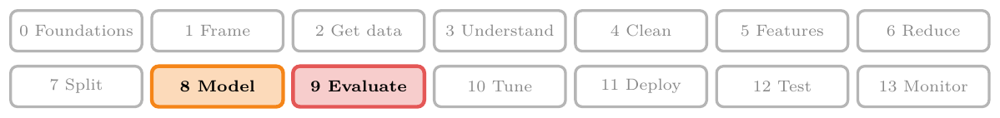
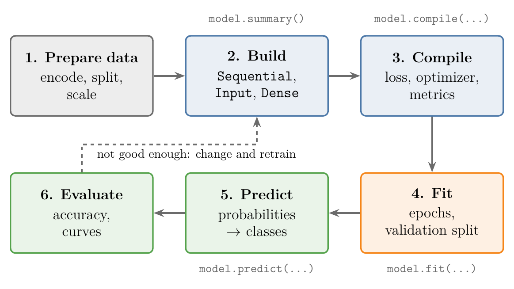
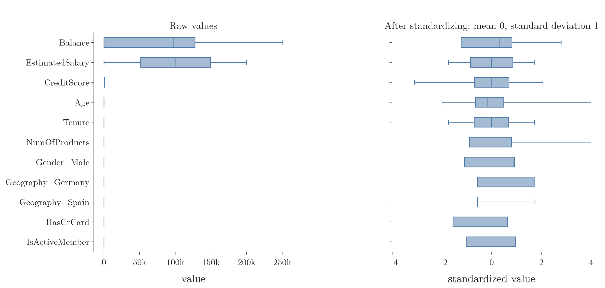
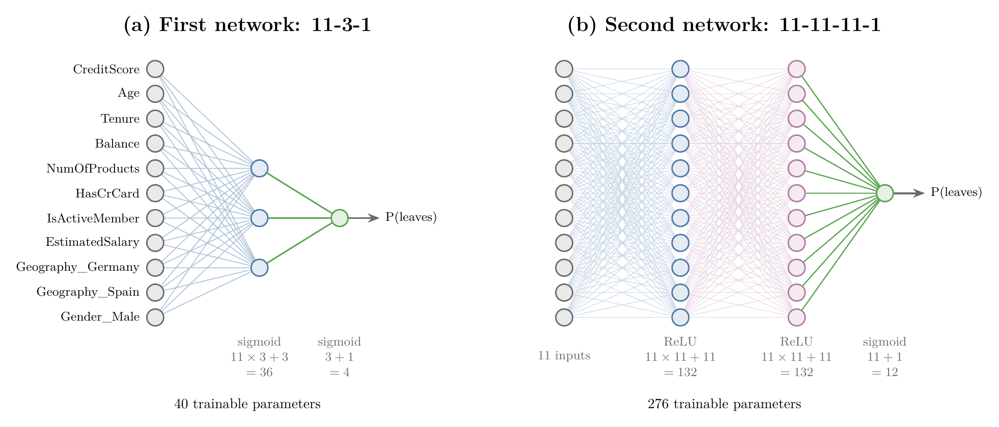
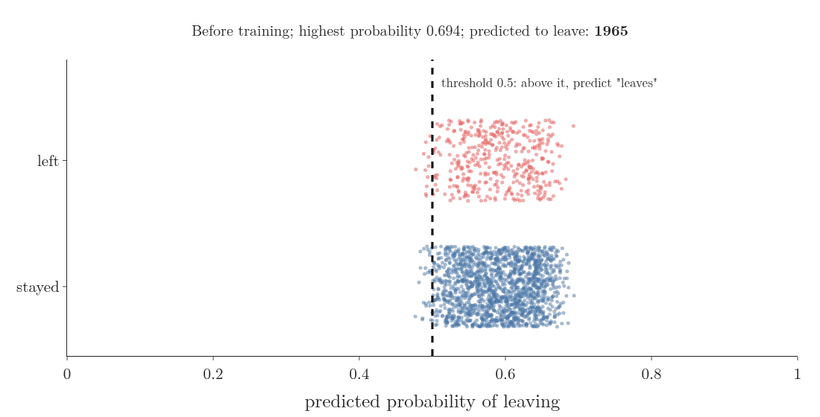
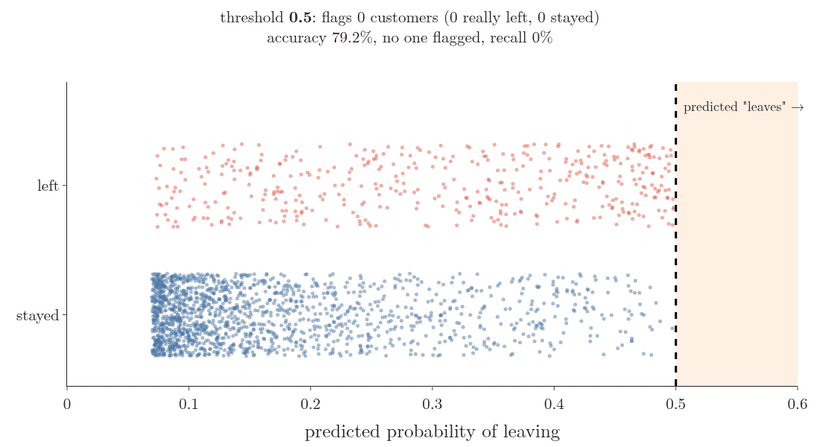
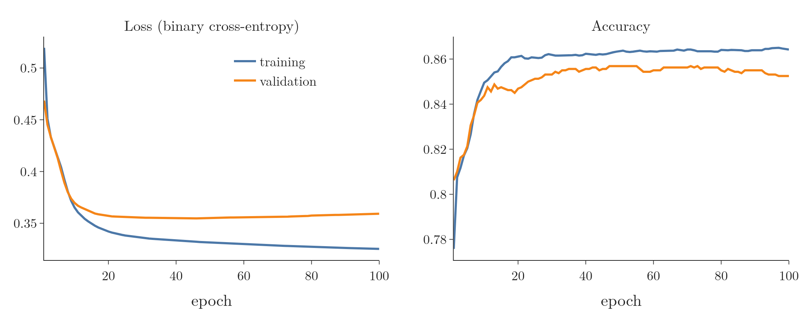

<!-- where-this-fits: generated by course_map/build_map.py; edit concepts.yaml, not this block -->
> **Where this fits:** Pipeline map steps 8 (Model), 9 (Evaluate). See the [Course map](../../../00-course-map/00-course-map.md).
>
> 
>
> - **Builds on:** [Overfitting](../../../ML/01-foundations/ML-007-challenges-in-ml/ML-007-challenges-in-ml.md#7-overfitting-and-underfitting); [Standardization](../../../ML/01-foundations/ML-009-mldlc/ML-009-mldlc.md#52-common-preprocessing-tasks); [Imbalanced data](../../../ML/01-foundations/ML-009-mldlc/ML-009-mldlc.md#62-what-we-do-during-eda); [One-hot encoding](../../../ML/01-foundations/ML-010-tensors/ML-010-tensors.md#62-3d-text); [Log loss (binary cross entropy)](../../../ML/07-classification/ML-072-log-loss/ML-072-log-loss.md#62-the-loss-function); [Confusion matrix](../../../ML/07-classification/ML-075-accuracy-confusion-matrix/ML-075-accuracy-confusion-matrix.md#4-the-confusion-matrix).
> - **Leads to:** [ANN for regression](../../../DL/01-basics/DL-013-graduate-admission-ann/DL-013-graduate-admission-ann.md#1-overview); [Backpropagation](../../../DL/01-basics/DL-015-backpropagation-what/DL-015-backpropagation-what.md#4-the-steps-of-backpropagation); [Vanishing gradient](../../../DL/01-basics/DL-018-vanishing-exploding-gradients/DL-018-vanishing-exploding-gradients.md#3-the-vanishing-gradient-problem); [Early stopping](../../../DL/02-training/DL-021-improving-a-neural-network/DL-021-improving-a-neural-network.md#36-epochs); [Keras Tuner](../../../DL/03-optimizers/DL-039-keras-tuner/DL-039-keras-tuner.md#5-the-keras-tuner-workflow-choosing-the-optimizer); [Image classification with a CNN (cats vs dogs)](../../../DL/04-cnn/DL-049-cat-vs-dog-cnn/DL-049-cat-vs-dog-cnn.md#3-the-dataset).
> - **Compare with:** [K-nearest neighbours](../../../ML/07-classification/ML-085-knn/ML-085-knn.md#1-overview); [ANN for regression](../../../DL/01-basics/DL-013-graduate-admission-ann/DL-013-graduate-admission-ann.md#1-overview).
<!-- /where-this-fits -->

## 1. Overview

> **Key point:** We build, train and improve our first neural network in Keras, on real bank data: which customers will leave the bank?

The Notes so far built the **multi-layer perceptron (MLP)** (G-1270) on paper:

- how it is organised (see the [MLP notation](../DL-008-mlp-notation/DL-008-mlp-notation.md#2-the-setup-layers-and-data));
- why it can form curved **decision boundaries** (G-555; see the [MLP intuition](../DL-009-mlp-intuition/DL-009-mlp-intuition.md#3-combining-two-perceptrons));
- how it predicts, by **forward propagation** (G-797; see the [forward propagation](../DL-010-forward-propagation/DL-010-forward-propagation.md#4-layer-1-as-one-matrix-product)).

How it *learns* its weights is **backpropagation** (G-247), the subject of later Notes (see [the steps of backpropagation](../DL-015-backpropagation-what/DL-015-backpropagation-what.md#4-the-steps-of-backpropagation)). Before that theory, three small projects show a network being built, trained and used in code:

| Project | Problem type | This Note? |
|---|---|---|
| Customer churn | Binary classification | yes |
| Handwritten digits (MNIST) | Multi-class classification | [MNIST](../DL-012-mnist-ann/DL-012-mnist-ann.md#4-the-network) |
| Graduate admissions | Regression | [graduate admission](../DL-013-graduate-admission-ann/DL-013-graduate-admission-ann.md#4-the-regression-network) |

The goal is to see every step of a Keras project once, not to build the best possible model, so that the training theory has something concrete to attach to.



Figure 1 shows the steps. Preparing the data is the same as in the [toy project](../../../ML/01-foundations/ML-012-toy-project/ML-012-toy-project.md#6-training-and-test-sets); the four Keras steps (build, compile, fit, predict) are new. The Notebook (`DL-011-customer-churn-ann.ipynb`) runs every step.

## 2. The churn data

> **Key point:** 10,000 bank customers, 13 possible features and one target, `Exited`: 1 if the customer left the bank.

**Churn** (G-387) means customers leaving a service (see the [framing an ML problem](../../../ML/01-foundations/ML-013-framing-ml-problem/ML-013-framing-ml-problem.md#31-churn-rate)). Banks, phone companies and streaming services all try to predict it, so that they can act before a customer goes. Our data holds 10,000 customers of one bank, 14 columns each:

- each customer is one **observation** (G-1374; one record, one row of the table);
- each input column is a **feature** (G-772; an input variable);
- `Exited` is the **target** (G-1949; the output we predict).

| Column | Meaning |
|---|---|
| RowNumber, CustomerId, Surname | Identifiers |
| CreditScore | How creditworthy the customer is |
| Geography | France, Germany or Spain |
| Gender | Male or Female |
| Age | Age in years |
| Tenure | Years with the bank |
| Balance | Account balance |
| NumOfProducts | Number of bank products used (cards, deposits, funds, ...) |
| HasCrCard | 1 if the customer has a credit card |
| IsActiveMember | 1 if the customer uses the account actively |
| EstimatedSalary | The bank's estimate of the yearly salary |
| Exited | **Target:** 1 if the customer left, 0 if not |

> **Extra:** The file is `Churn_Modelling.csv` (10,000 rows, 685 KB), published on Kaggle as a bank churn dataset; the copy in `data/` is the full file.

> **Python:** Loading and checking the data.
>
> ```python
> import pandas as pd
>
> df = pd.read_csv("data/Churn_Modelling.csv")
> df.shape                     # (10000, 14)
> df.info()                    # no missing values
> df.duplicated().sum()        # 0 duplicated rows
> df["Exited"].value_counts()  # 0: 7963, 1: 2037
> ```

The checks find no **missing values** (G-1234) and no duplicated rows (**duplicate rows**, G-648). About 8,000 customers stayed and 2,000 left, so the classes are imbalanced (**imbalanced data**, G-921), 4 to 1. The imbalance matters for reading accuracy, as Section 6 shows (see also the [imbalanced data](../../../ML/09-clustering-and-more/ML-127-imbalanced-data/ML-127-imbalanced-data.md#3-two-problems-with-imbalanced-data)).

The two text columns are balanced enough: France 5,014, Germany 2,509, Spain 2,477; male 5,457, female 4,543.

## 3. Preparing the inputs

> **Key point:** Drop the three identifier columns, one-hot encode Geography and Gender, split 80/20, then standardize.

### 3.1 Dropping and encoding

> **Key point:** Identifiers carry no pattern; text columns become 0/1 columns.

RowNumber, CustomerId and Surname identify a customer but say nothing about whether they will leave, so we drop them. A careful project would first check every other feature with **exploratory data analysis** (G-732); here we keep the remaining ten.

A network only takes numbers, so Geography and Gender are one-hot encoded (**one-hot encoding**, G-1379) with `get_dummies` (G-845) and `drop_first=True` (see the [one-hot encoding](../../../ML/03-feature-engineering/ML-026-one-hot-encoding/ML-026-one-hot-encoding.md#61-get_dummies), section 6). Geography becomes two columns, `Geography_Germany` and `Geography_Spain` (France is 0, 0), and Gender becomes one, `Gender_Male` (female is 0). The encoding leaves 11 features.

> **Python:** Dropping and encoding.
>
> ```python
> df = df.drop(columns=["RowNumber", "CustomerId", "Surname"])
> df = pd.get_dummies(df, columns=["Geography", "Gender"],
>                     drop_first=True, dtype=int)
> ```
>
> Since pandas 2, `get_dummies` writes `True`/`False`; `dtype=int` gives 0/1 instead.

### 3.2 Splitting and scaling

> **Key point:** 8,000 customers to train on, 2,000 to test; every feature standardized with the training set's mean and spread.

We separate X (11 columns) from y (`Exited`) and split 80/20 with `train_test_split` (a **train-test split**, G-1998), as in the [toy project](../../../ML/01-foundations/ML-012-toy-project/ML-012-toy-project.md#6-training-and-test-sets). The split leaves 8,000 training observations and 2,000 test observations.

The features live on very different scales: Balance and EstimatedSalary run to six digits, NumOfProducts is 1 to 4. With such inputs the weights take much longer to settle during training (the [forward propagation](../DL-010-forward-propagation/DL-010-forward-propagation.md#2-the-network-and-the-observation) section shows what raw inputs do to a sigmoid). So before a network sees any data we **standardize** (G-1875) every feature to mean 0, standard deviation 1 (see the [standardization](../../../ML/03-feature-engineering/ML-023-standardization/ML-023-standardization.md#41-the-idea-how-many-standard-deviations-from-the-mean)).



Figure 2 shows the problem and the fix:

- **Raw (left):** Balance reaches 250,899 and EstimatedSalary 199,971, while Age stops at 92, NumOfProducts at 4 and the 0/1 columns at 1. On a shared axis, nine of the eleven features are squashed against zero.
- **Standardized (right):** every feature is centred on 0 with a spread of about 1, so no feature dominates the weighted sums just because its numbers are big.

> **Python:** Split, then scale.
>
> ```python
> from sklearn.model_selection import train_test_split
> from sklearn.preprocessing import StandardScaler
>
> X = df.drop(columns="Exited")
> y = df["Exited"]
> X_train, X_test, y_train, y_test = train_test_split(
>     X, y, test_size=0.2, random_state=1)
>
> scaler = StandardScaler()
> X_train_scaled = scaler.fit_transform(X_train)
> X_test_scaled = scaler.transform(X_test)
> ```

The scaler learns the mean and standard deviation from the training set only (`fit_transform`) and reuses them on the test set (`transform`). If the test customers helped compute the mean, information from the test set would reach the model, and the test score would look better than it really is: **data leakage** (G-535; see [scaling the inputs](../../../ML/01-foundations/ML-012-toy-project/ML-012-toy-project.md#7-scaling-the-inputs); scikit-learn User Guide, Common pitfalls, §12.2).

## 4. Building a network in Keras

> **Key point:** A `Sequential` model is a stack of layers; each `Dense` layer is a row of perceptrons connected to every node of the layer before.

**Keras** (G-1003) is the high-level interface of TensorFlow for defining and training networks (see the [deep learning scope](../DL-001-dl-scope-and-prerequisites/DL-001-dl-scope-and-prerequisites.md#2-the-four-families-of-networks)). Keras has two ways to build a model:

- **Sequential model** (G-1776): layers stacked one after the other, each feeding the next. Every MLP is of this kind.
- **Functional (non-sequential) model:** layers wired in any pattern, for example with branches. The functional model (built with the **Functional API**, G-818) comes in later Notes (see [building a functional model](../../04-cnn/DL-054-keras-functional-api/DL-054-keras-functional-api.md#4-building-a-functional-model)).

### 4.1 The first architecture

> **Key point:** 11 inputs, one hidden layer of 3 sigmoid nodes, one sigmoid output node.

We start small:

- an **input layer** (G-952) of 11 nodes, one per feature;
- a **hidden layer** (G-890; a layer between input and output, see [the parts of a neural network](../DL-002-what-is-deep-learning/DL-002-what-is-deep-learning.md#22-the-parts-of-a-neural-network)) of 3 perceptrons;
- an **output layer** (G-1424) of 1 perceptron.

All of them use the **sigmoid** (G-1798) activation (a function that squeezes any number into the range 0 to 1; see [sigmoid](../../../ML/07-classification/ML-071-sigmoid-function/ML-071-sigmoid-function.md#4-the-sigmoid-function)), so the output is the probability that the customer leaves. Figure 3(a) shows this 11-3-1 network.



A **dense layer** (G-583; also **fully connected layer**) is a layer in which every node receives the output of every node in the layer before. Every layer of an MLP is dense, so in Keras each one is a `Dense`.

> **Python:** Building the 11-3-1 network.
>
> ```python
> import keras
> from keras import layers
>
> model = keras.Sequential([
>     keras.Input(shape=(11,)),               # 11 input columns
>     layers.Dense(3, activation="sigmoid"),  # hidden layer
>     layers.Dense(1, activation="sigmoid"),  # output layer
> ])
> ```
>
> `Dense(3, ...)` is a layer of 3 nodes. `keras.Input(shape=(11,))` tells the first layer how many features each observation has; Keras works out the inputs of every later layer by itself.

> **Extra:** Older code passes the input size to the first layer, `Dense(3, activation="sigmoid", input_dim=11)`, and imports from `tensorflow.keras`. Keras 3 still builds such a model but prints a warning asking for an `Input(shape)` object as the first layer instead. So we write `keras.Input` as the first item and `import keras` directly.

### 4.2 Counting the parameters with summary

> **Key point:** `model.summary()` lists each layer and its trainable parameters: 36 + 4 = 40.

`model.summary()` prints one line per layer. Keras does not list the input layer, because it has no parameters:

| Layer | Output shape | Param # |
|---|---|---|
| dense (Dense) | (None, 3) | 36 |
| dense_1 (Dense) | (None, 1) | 4 |
| **Total** | | **40** |

The counts follow the rule of the [MLP notation](../DL-008-mlp-notation/DL-008-mlp-notation.md#2-the-setup-layers-and-data): one weight per pair of connected nodes, one bias per node. Into the hidden layer:

$$11 \times 3 = 33 \text{ weights}$$

Add the 3 biases of the hidden nodes:

$$33 + 3 = 36$$

Into the output:

$$3 \times 1 = 3 \text{ weights}$$

Add the 1 bias of the output node:

$$3 + 1 = 4$$

Training must find these 40 numbers, the **trainable parameters** (G-1065). `None` in the output shape stands for the number of observations fed in at once, which can be anything.

## 5. Compiling and training

> **Key point:** `compile` chooses the loss and the optimizer; `fit` runs the training for a set number of epochs and prints the loss after each.

### 5.1 Compile: loss and optimizer

> **Key point:** Two classes and a sigmoid output: the loss is binary cross-entropy. The optimizer is Adam.

Compiling tells Keras how the model will be trained. Two settings are needed:

- **Loss:** the number that training makes smaller. For two classes with a sigmoid output it is **binary cross-entropy** (G-303), also called log loss (see the [log loss](../../../ML/07-classification/ML-072-log-loss/ML-072-log-loss.md#62-the-loss-function) and the [perceptron loss](../DL-006-perceptron-loss/DL-006-perceptron-loss.md#8-one-perceptron-many-models), section 8).
- **Optimizer** (G-1401; see [learning rate and optimizer](../../02-training/DL-021-improving-a-neural-network/DL-021-improving-a-neural-network.md#33-learning-rate-and-optimizer)): the method that updates the weights to reduce the loss, a variant of **gradient descent** (G-862). We use **Adam** (G-169), which is fairly robust to its settings (Goodfellow et al. 2016, §8.5.3); optimizers are taught in later Notes (see [what an optimizer does](../../03-optimizers/DL-032-optimizers-in-deep-learning/DL-032-optimizers-in-deep-learning.md#3-what-an-optimizer-does) and [Adam's update rule](../../03-optimizers/DL-038-adam/DL-038-adam.md#4-the-update-rule)).

> **Python:** Compiling.
>
> ```python
> model.compile(loss="binary_crossentropy", optimizer="adam")
> ```

### 5.2 Fit: epochs

> **Key point:** One epoch is one pass over all 8,000 training customers; after 10 epochs the loss fell from 0.71 to 0.43.

`fit` does the training. We give it the scaled training inputs, the training outputs and the number of **epochs** (G-696): how many times the network goes through the whole training set (see the [gradient descent](../../../ML/06-regression/ML-056-gradient-descent/ML-056-gradient-descent.md#23-when-to-stop)). We choose 10.

In plain words, `fit` repeats one small loop: show the network a few customers, measure how wrong it is, and change the weights a little. Figure 4 draws the loop.


1. **Predict:** forward propagation on one batch of 32 customers.
2. **Loss:** the binary cross-entropy between those 32 predictions and the true labels.
3. **Update:** the optimizer changes all 40 parameters a little, in the direction that lowers that loss.
4. **Repeat** with the next batch. After 250 batches every customer has been used once: one epoch is over, and Keras prints its loss.

> **Python:** Training for 10 epochs.
>
> ```python
> history1 = model.fit(X_train_scaled, y_train, epochs=10)
> ```

Keras prints one line per epoch. The loss falls quickly at first, then more slowly:

| Epoch | 1 | 2 | 3 | 5 | 10 |
|---|---|---|---|---|---|
| Loss | 0.713 | 0.569 | 0.502 | 0.455 | 0.430 |

What does the falling loss change? Figure 5 follows the network's predicted probability of leaving for each of the 2,000 test customers (`model.predict` after every epoch).



1. **Before training.** The random starting weights give every customer a probability around 0.6 (the highest is 0.694), so 1,965 of the 2,000 customers would be predicted to leave.
2. **Epochs 1 to 5.** The probabilities slide down together, and their average falls from 0.59 to 0.21, close to the share of customers who left in the data (2,037 of 10,000). That share is no accident: if a model gives every customer the same probability, the log loss is lowest when that probability equals the share of leavers.
3. **Epochs 6 to 10.** The probabilities start to spread out: leavers drift to the right and stayers to the left. The highest probability climbs back from 0.424 (after epoch 5) to 0.498.
4. **After epoch 10.** Not one probability has crossed 0.5, so with the threshold of section 6 the network predicts "stays" for every customer. Section 6.2 shows what that does to accuracy.

> **Extra:** Each epoch line also shows `250/250`. Keras does not update the weights once per epoch: by default it updates them after every **batch** (G-263) of 32 observations (Keras docs, `Model.fit`), which is **mini-batch gradient descent** (G-1222; see the [mini-batch gradient descent](../../../ML/06-regression/ML-059-mini-batch-gradient-descent/ML-059-mini-batch-gradient-descent.md#3-how-it-works)). The number of updates per epoch:
>
> $$\frac{8{,}000}{32} = 250$$
>
> The `batch_size` argument of `fit` changes this (the **batch size**, G-267).

### 5.3 Where the weights are stored

> **Key point:** Each layer keeps its weight matrix and its bias vector; `get_weights()` returns them.

After training, the 40 parameters live inside the model, one layer at a time. `model.layers[0]` is the hidden layer, `model.layers[1]` the output layer.

> **Python:** Reading the trained weights.
>
> ```python
> W1, b1 = model.layers[0].get_weights()
> W1.shape, b1.shape      # (11, 3), (3,)
> W2, b2 = model.layers[1].get_weights()
> W2.ravel(), b2          # [-0.734 -1.314 0.572], [-0.571]
> ```

The **weight matrix** (G-2109) has one row per input node and one column per receiving node, exactly the $W^{1}$ of the [forward propagation](../DL-010-forward-propagation/DL-010-forward-propagation.md#4-layer-1-as-one-matrix-product). It has 11 rows and 3 columns, so the number of weights is:

$$11 \times 3 = 33$$

Add the 3 biases:

$$33 + 3 = 36$$

This is the 36 of the summary.

## 6. Predicting and measuring accuracy

> **Key point:** `predict` gives probabilities; a threshold of 0.5 turns them into 0 or 1, and accuracy compares those with the true labels.

### 6.1 From probabilities to classes

> **Key point:** Above 0.5 means "will leave" (1); 0.5 or below means "stays" (0).

`model.predict` runs forward propagation on every test observation. Because the output node uses a sigmoid, each answer is a probability between 0 and 1, not a class: the first five test customers get 0.128, 0.146, 0.135, 0.113 and 0.102.

To get a class we pick a **threshold** (G-1970): a probability above it means 1, at or below it means 0. We use 0.5.

> **Python:** Predicting and thresholding.
>
> ```python
> import numpy as np
> from sklearn.metrics import accuracy_score
>
> y_log = model.predict(X_test_scaled)        # probabilities
> y_pred = np.where(y_log > 0.5, 1, 0)        # classes
> accuracy_score(y_test, y_pred)              # 0.7925
> ```
>
> `np.where(condition, a, b)` gives `a` where the condition holds and `b` elsewhere.

> **Extra:** 0.5 is only the default. The best threshold for a problem can be found from the **ROC curve** (G-1702; see the [ROC and AUC](../../../ML/07-classification/ML-077-roc-auc/ML-077-roc-auc.md#43-choosing-the-threshold)); a bank that would rather contact too many customers than miss leavers might choose a lower one.

### 6.2 Why 79% means nothing here

> **Key point:** 79.25% is exactly the share of customers who stay: the first network predicts "stays" for everyone.

A **confusion matrix** (G-449) is a table that counts the test customers by true class (rows) and predicted class (columns): the green diagonal holds correct predictions, the red cells mistakes (see [what accuracy hides](../../../ML/07-classification/ML-075-accuracy-confusion-matrix/ML-075-accuracy-confusion-matrix.md#41-what-accuracy-hides)).

The first network scores 79.25% **accuracy** (G-162; the share of correct predictions) on the 2,000 test customers. But 1,585 of them, 79.25%, stayed. A "model" that answers 0 for every customer scores the same.


Figure 6 (left) confirms it: the first network predicted "leaves" for nobody. After 10 epochs its probabilities run from 0.069 to 0.498: even the most likely leaver falls just short of the 0.5 threshold. Such a result is the trap of accuracy on imbalanced data, described in section 6 of the [accuracy and confusion matrix](../../../ML/07-classification/ML-075-accuracy-confusion-matrix/ML-075-accuracy-confusion-matrix.md#6-when-accuracy-misleads-imbalanced-data). The confusion matrix shows it at once; accuracy alone hides it.

> **Extra:** The exact result depends on the random starting weights. With four other seeds, the same network flags 35 to 128 customers as leaving and scores 79.9% to 80.7% (Notebook). Averaged over all five seeds it scores 80.1%, under one point above the 79.25% of always answering "stays". Either way, a network this small, trained for 10 epochs, has barely learned the pattern: trained for 100 epochs instead, it reaches 83.4%.

### 6.3 Moving the threshold

> **Key point:** The network's probabilities do rank the customers. A lower threshold turns that ranking into leavers found, at the price of false alarms.

The first network flags nobody only because the threshold sits at 0.5. Its probabilities still carry information: in Figure 5, the customers who left sit further right than those who stayed. Figure 7 keeps the trained network fixed and slides the threshold down.

{width=85%}

Two more scores describe each position (see [precision and recall](../../../ML/07-classification/ML-076-precision-recall-f1/ML-076-precision-recall-f1.md#22-the-formula)): **precision** (G-1547), the share of flagged customers who really left, and **recall** (G-1641), the share of the 415 leavers that were flagged.

| Threshold | Flagged | Really left | Accuracy | Precision | Recall |
|---|---|---|---|---|---|
| 0.5 | 0 | 0 | 79.2 percent | none flagged | 0 percent |
| 0.4 | 209 | 130 | 81.8 percent | 62 percent | 31 percent |
| 0.25 | 559 | 259 | 77.2 percent | 46 percent | 62 percent |
| 0.1 | 1,440 | 387 | 46.0 percent | 27 percent | 93 percent |

- **From 0.5 to 0.4:** the network finds 130 leavers, and the accuracy rises above the 79.25 percent of always answering "stays".
- **Lower still:** recall keeps rising, but more and more of the flagged customers are people who stayed, so precision and accuracy fall.

No retraining happened: the same 40 parameters give every row of the table. The threshold is a separate choice, made for the cost of each kind of mistake.

## 7. Improving the network

> **Key point:** Four things to try: more epochs, ReLU in the hidden layers, more nodes per hidden layer, more hidden layers.

### 7.1 Four changes

> **Key point:** Each change gives the network more time or more capacity; too much capacity leads to overfitting.

A first network is rarely the best one. We experiment with:

1. **More epochs:** more passes over the data, more time to find good weights. We go from 10 to 100.
2. **ReLU in the hidden layers:** hidden layers with the **ReLU** (G-1668) activation (it returns the weighted sum if positive and 0 otherwise) usually train better than sigmoid ones (see [ReLU on the spirals](../DL-009-mlp-intuition/DL-009-mlp-intuition.md#52-other-shapes); Goodfellow et al. 2016, §6.3). The output stays sigmoid, since we still want a probability. Activation functions get their own Notes later (see [what an activation function is](../../02-training/DL-027-activation-functions/DL-027-activation-functions.md#3-what-an-activation-function-is)).
3. **More nodes per hidden layer:** 11 instead of 3.
4. **More hidden layers:** two instead of one.

Changes 3 and 4 add parameters, so the network can fit more complex patterns. Too many, and it starts to memorise the training observations instead of learning the pattern: **overfitting** (G-1429; see the [challenges in ML](../../../ML/01-foundations/ML-007-challenges-in-ml/ML-007-challenges-in-ml.md#71-overfitting) and the [bias-variance](../../../ML/06-regression/ML-061-bias-variance/ML-061-bias-variance.md#5-the-trade-off)). Finding the right size takes experiments.

### 7.2 The second architecture

> **Key point:** 11-11-11-1 with ReLU: 132 + 132 + 12 = 276 parameters.

Figure 3(b) shows the new network. Counting its parameters:

1. **In words:** for each layer, weights from every node before plus one bias per node.
2. **Formula:** $n_{l-1}\thinspace n_l + n_l$ per layer, added up.
3. **Example:**

   First hidden layer:

   $$11 \times 11 + 11 = 132$$

   Second hidden layer:

   $$11 \times 11 + 11 = 132$$

   Output layer:

   $$11 \times 1 + 1 = 12$$

   Total:

   $$132 + 132 + 12 = 276$$


`model.summary()` prints the same 276.

> **Python:** The second network.
>
> ```python
> model2 = keras.Sequential([
>     keras.Input(shape=(11,)),
>     layers.Dense(11, activation="relu"),
>     layers.Dense(11, activation="relu"),
>     layers.Dense(1, activation="sigmoid"),
> ])
> ```

### 7.3 Tracking accuracy and a validation set

> **Key point:** `metrics=["accuracy"]` reports accuracy every epoch; `validation_split=0.2` holds back 20% of the training observations and reports the loss and accuracy on them too.

Two additions make training easier to watch:

- **`metrics=["accuracy"]`** in `compile`: Keras reports the accuracy after each epoch, next to the loss. A **metric** (G-1215) is only reported; training does not minimise it.
- **`validation_split=0.2`** in `fit`: Keras sets aside 20% of the 8,000 training observations as a **validation set** (G-2067; a similar held-out check is the [out-of-bag score](../../../ML/08-trees-and-ensembles/ML-107-oob-score/ML-107-oob-score.md#2-out-of-bag-observations)). Keras trains on the other 6,400 and, after each epoch, measures the loss and accuracy on the 1,600 it never trains on.

> **Python:** Compiling and training with both.
>
> ```python
> model2.compile(loss="binary_crossentropy", optimizer="adam",
>                metrics=["accuracy"])
> history = model2.fit(X_train_scaled, y_train, epochs=100,
>                      validation_split=0.2)
> ```

Each epoch line now has four numbers. For the last epoch:

| loss | accuracy | val_loss | val_accuracy |
|---|---|---|---|
| 0.325 | 0.864 | 0.359 | 0.853 |

We want the loss to fall and the accuracy to rise on **both** sets. If the training accuracy keeps rising while the validation accuracy stalls or falls, the network is overfitting. Here training (86.4%) is a little ahead of validation (85.3%): a slight gap.

> **Extra:** `validation_split` takes the **last** 20% of the rows, not a random 20% (Keras docs, `Model.fit`). Our rows were already shuffled by `train_test_split`, so that is fine; on data sorted by date or by class, shuffle first or pass `validation_data=(X_val, y_val)` instead.

On the test set the second network scores **86.45%**, against 79.25%. Figure 6 (right) shows what changed: it now finds 189 of the 415 customers who left, while wrongly flagging only 45 who stayed.

## 8. Training curves

> **Key point:** `fit` returns a History object: the loss and accuracy of every epoch, on both sets. Plotting them shows how training went and whether it overfits.

`fit` returns a **History** object (G-900). Its `.history` attribute is a dictionary with one list per quantity, one value per epoch: `loss`, `accuracy`, `val_loss` and `val_accuracy`. Plotting these lists against the epoch number gives the **training curves** (G-2001; also **learning curves**) in Figure 8.



Reading Figure 8:

- **Loss (left):** both losses fall fast for about 10 epochs, then slowly. The training loss keeps falling to the end; the validation loss is lowest around epoch 40 (0.355) and then creeps up to 0.359.
- **Accuracy (right):** both rise together at first; after about 20 epochs training accuracy stays roughly 1 point above validation accuracy.

The gap between the two curves measures overfitting. Here it is small, but it is opening: more epochs would not help. Techniques that close such a gap come in later Notes: **regularisation** (G-1659; see [the penalty term](../../02-training/DL-026-regularization-in-dl/DL-026-regularization-in-dl.md#5-the-penalty-term)), **dropout** (G-639; see [how dropout works](../../02-training/DL-024-dropout/DL-024-dropout.md#4-how-dropout-works)) and **early stopping** (G-656; see [early stopping in Keras](../../02-training/DL-022-early-stopping/DL-022-early-stopping.md#4-early-stopping-in-keras)).

> **Python:** Plotting the curves with Plotly.
>
> ```python
> import plotly.graph_objects as go
>
> h = history.history
> fig = go.Figure()
> fig.add_scatter(y=h["loss"], name="training loss")
> fig.add_scatter(y=h["val_loss"], name="validation loss")
> fig.show()
> ```

## 9. Summary

| Step | First network | Second network |
|---|---|---|
| Architecture | 11-3-1 | 11-11-11-1 |
| Hidden activation | sigmoid | ReLU |
| Parameters | 40 | 276 |
| Epochs | 10 | 100, with 20% validation |
| Test accuracy | 79.25% (predicts "stays" for all) | 86.45% |

- Prepare as usual: drop identifiers, one-hot encode, split, standardize, because identifiers say nothing about leaving and features on very different scales slow training down; the scaler is fit on the training set only, so no test information leaks into training.
- Keras: `Sequential` + `Dense` layers, `summary`, `compile` (loss, optimizer, metrics), `fit` (epochs, validation split), `predict`; the same steps carry over to the MNIST and admission projects.
- Binary classification: one sigmoid output node, binary cross-entropy loss, threshold 0.5 on the probability, because the sigmoid gives a probability of leaving between 0 and 1.
- On imbalanced data, compare accuracy with always predicting the majority class, and look at the confusion matrix, because the first network scored 79.25% by predicting "stays" for everyone.
- The threshold is a choice: lowering it trades precision for recall without retraining.
- Improve by changing epochs, activation, nodes and layers; watch the training curves for a gap that signals overfitting.

So the opening question, which customers will leave, is answered by the second network with 86.45% test accuracy, above the 79.25% of predicting "stays" for all.

## 10. Sources

**Built from**

- CampusX, "Customer Churn Prediction using ANN | Keras and Tensorflow | Deep Learning Classification", YouTube, https://www.youtube.com/watch?v=9wmImImmgcI

**Other references**

- Keras documentation, `Model.fit`, keras.io/api/models/model_training_apis (`batch_size` defaults to 32; `validation_split` takes the last samples, before shuffling).
- scikit-learn User Guide, "Common pitfalls and recommended practices", §12.2 Data leakage, scikit-learn.org/stable/common_pitfalls.html (preprocessing is learnt from the training data only; never call `fit` on the test data).
- Goodfellow, Bengio and Courville, *Deep Learning*, MIT Press, 2016, §6.3 (rectified linear units as the default hidden unit), §8.5.3 (Adam is fairly robust to the choice of its settings).

## 11. Key terms

| Term | Meaning |
|---|---|
| Keras workflow | Build, compile, fit, predict: the four steps of every Keras model |
| Sequential model | A Keras model whose layers form one stack, each feeding the next |
| Dense (fully connected) layer | A layer whose every node receives the output of every node in the layer before |
| `keras.Input` (G-97) | The first item of a Sequential model; gives the shape of one input observation |
| `model.summary()` | Prints each layer's output shape and number of trainable parameters |
| Compile | Choosing the loss, the optimizer and the metrics before training |
| Adam | An optimizer, the rule that updates a network's weights to reduce the loss: a variant of gradient descent that keeps running averages of past gradients and of their squares, giving each weight its own step size; fairly robust to its settings, so a common default. |
| `fit` | Trains the model on given inputs and outputs for a number of epochs |
| Batch (G-263) | The observations used for one weight update; Keras uses 32 by default |
| `get_weights()` (G-85) | Returns a layer's weight matrix and bias vector |
| Threshold (classification) | The probability above which a prediction counts as class 1 |
| Metric (G-1215) | A score reported during training, such as accuracy, that training does not minimise |
| `validation_split` | The share of the training observations Keras holds back as a validation set |
| History object | The object Keras' `fit` returns: its `.history` holds the loss and metrics of every epoch, used to draw the training curves. |
| Training curves (learning curves) | Loss or accuracy plotted against the epoch, for the training and validation sets; they show how the model improves as training goes on and when the two sets start to differ. |
