<!-- where-this-fits: generated by course_map/build_map.py; edit concepts.yaml, not this block -->
> **Where this fits:** Pipeline map steps 8 (Model), 9 (Evaluate). See the [Course map](../../../00-course-map/00-course-map.md).
>
> 
>
> - **Builds on:** [Categorical and sparse categorical cross-entropy](../../../MA/08-likelihood/MA-072-mle-in-machine-learning/MA-072-mle-in-machine-learning.md#5-a-categorical-target-gives-the-cross-entropy); [ANN for classification](../../../DL/01-basics/DL-011-customer-churn-ann/DL-011-customer-churn-ann.md#4-building-a-network-in-keras); [Keras workflow](../../../DL/01-basics/DL-011-customer-churn-ann/DL-011-customer-churn-ann.md#4-building-a-network-in-keras); [Training curves (History)](../../../DL/01-basics/DL-011-customer-churn-ann/DL-011-customer-churn-ann.md#8-training-curves).
> - **Compare with:** [K-nearest neighbours](../../../ML/07-classification/ML-085-knn/ML-085-knn.md#2-how-knn-predicts); [ANN for regression](../../../DL/01-basics/DL-013-graduate-admission-ann/DL-013-graduate-admission-ann.md#4-the-regression-network).
<!-- /where-this-fits -->

## 1. Overview

> **Key point:** The same Keras steps as for churn, now with 10 classes: a Flatten layer turns each image into 784 inputs, and an output layer of 10 softmax nodes gives one probability per digit.

A person reads a sloppy handwritten 3 at a glance, in any handwriting. Writing down rules that do the same, pixel by pixel, is very hard, so we let a network learn the rules from examples.

The [customer churn network](../DL-011-customer-churn-ann/DL-011-customer-churn-ann.md#41-the-first-architecture) was built for **binary** classification: one output node, two classes. Here the task is **multi-class** classification: an image shows one handwritten digit, and the network must say which of the 10 digits, 0 to 9, it is.

The Keras workflow is unchanged: [build, compile, fit, predict](../DL-011-customer-churn-ann/DL-011-customer-churn-ann.md#1-overview). Four things are new:

1. **Input:** an image, not a row of a table; a **Flatten** layer turns it into one row.
2. **Output layer:** 10 nodes with the **softmax** activation (a function that turns 10 scores into 10 probabilities that add up to 1; section 4.2).
3. **Loss:** sparse categorical cross-entropy (the loss for many classes, with labels kept as plain digits; section 5.1).
4. **Prediction:** the digit with the highest probability, found with **argmax** (G-212).

After training, section 9 opens the network up to see what it learned. The goal is to see how a network handles more than two classes, not to reach the best accuracy. The Notebook (`DL-012-mnist-ann.ipynb`) runs every step.

## 2. The MNIST data

> **Key point:** 70,000 images of handwritten digits, 28 × 28 pixels each, with values 0 to 255. Keras ships them already split: 60,000 for training, 10,000 for testing.

**MNIST** (G-1249) is a set of 70,000 grey images of handwritten digits, each 28 × 28 = 784 pixels (see [pixels as columns](../../../ML/03-feature-engineering/ML-022-what-is-feature-engineering/ML-022-what-is-feature-engineering.md#81-pixels-as-columns-the-mnist-dataset) and [the MNIST data](../../../ML/05-dimensionality/ML-048-pca-mnist/ML-048-pca-mnist.md#2-the-mnist-data)). MNIST is so widely used that Keras includes it.

> **Python:** Loading MNIST from Keras.
>
> ```python
> import keras
>
> (X_train, y_train), (X_test, y_test) = \
>     keras.datasets.mnist.load_data()
> X_train.shape    # (60000, 28, 28)
> X_test.shape     # (10000, 28, 28)
> y_train[:3]      # [5 0 4]
> ```
>
> `load_data()` downloads the data once and returns it already split into training and test sets, so no `train_test_split` is needed.

`X_train` is a 3D array, a 3D [tensor](../../../ML/01-foundations/ML-010-tensors/ML-010-tensors.md#2-what-a-tensor-is) (a table of numbers with any number of axes; here 3 axes): 60,000 images, each a $28 \times 28$ grid of numbers. Each number is one pixel's brightness, from 0 (blank) to 255 (full ink), stored row by row. Each image is one **observation** (G-1374) (one record, one row of the data table), and each pixel is one **feature** (G-772) (an input variable, one column of the table): 784 features per image. `y_train` holds the **label** (G-1032) of each image, the **target** (G-1949) (the output we predict): the digit the image shows.

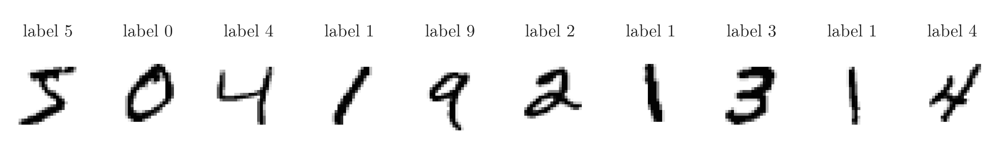

Figure 1 draws the first 10 training images, each as a grid of grey squares: dark where the pixel value is large (ink), light where it is 0. The title above each image is its label. The first three are a 5, a 0 and a 4, matching `y_train[:3]`.

> **Python:** Drawing one image with Plotly.
>
> ```python
> import plotly.express as px
>
> px.imshow(X_train[0], color_continuous_scale="gray_r")
> ```

## 3. Scaling the pixels

> **Key point:** Divide every pixel by 255, the largest possible value, so that all inputs lie between 0 and 1.

As with the churn data, a network trains faster when its inputs share a small range. Pixels already share one range, 0 to 255, so we only shrink it:

1. **In words:** divide each pixel by the largest possible value, 255.
2. **Formula:**
   $$x_{\text{scaled}} = \frac{x}{255}$$
3. **Example:** three pixels.
   $$255 / 255 = 1$$
   $$0 / 255 = 0$$
   $$51 / 255 = 0.2$$
   So a full-ink pixel (255) becomes 1, a blank pixel (0) stays 0, and a light-grey pixel (51) becomes 0.2.

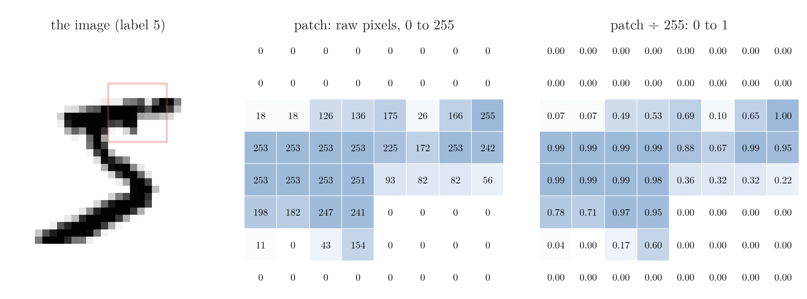{height=26%}

In Figure 2, compare the two grids cell by cell: every number keeps its place and its shading, only the scale changes, so 255 becomes 1.00 and 126 becomes 0.49. Dividing by 255 is [min-max scaling](../../../ML/03-feature-engineering/ML-024-normalization/ML-024-normalization.md#4-min-max-scaling) with a known minimum of 0 and maximum of 255.

> **Python:** Scaling the pixels.
>
> ```python
> X_train = X_train / 255
> X_test = X_test / 255
> ```

## 4. The network

> **Key point:** Flatten (784 inputs), a hidden layer of 128 ReLU nodes, an output layer of 10 softmax nodes: 101,770 trainable parameters.

### 4.1 Flatten: from an image to a row

> **Key point:** A Flatten layer lays the 28 rows of pixels side by side, giving one row of 784 numbers.

A **Dense layer** (G-583; a layer in which every node is connected to every input of the layer) takes a flat list of numbers, but each image is a $28 \times 28$ grid. **Flatten** reshapes any multi-dimensional input into one dimension: first the 28 pixels of row 1, then the 28 of row 2, and so on to row 28. The count of numbers:

$$28 \times 28 = 784$$

Flatten does exactly the same as [turning each image into one table row](../../../ML/05-dimensionality/ML-048-pca-mnist/ML-048-pca-mnist.md#2-the-mnist-data) before PCA, but inside the network.

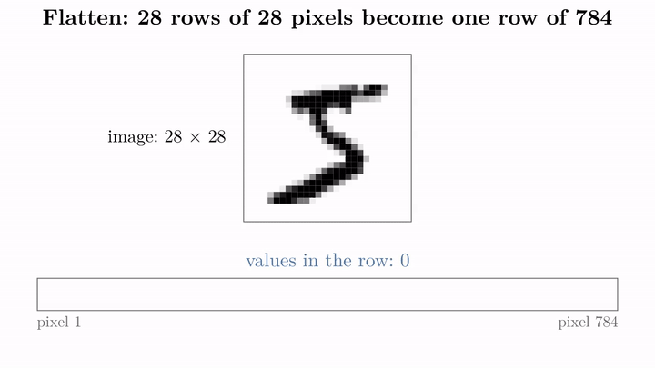{height=60%}

In Figure 3, watch the orange box move down the image: each row it marks is appended to the right end of the strip, and the counter grows by 28. After the last row the strip holds all 784 values, and each value goes to its own input node. An input node does nothing more than hold that one number, the brightness of its pixel.

Flatten only rearranges numbers, so it has no weights and nothing to train.

### 4.2 The architecture

> **Key point:** One input per pixel, 128 hidden nodes, one output node per digit.

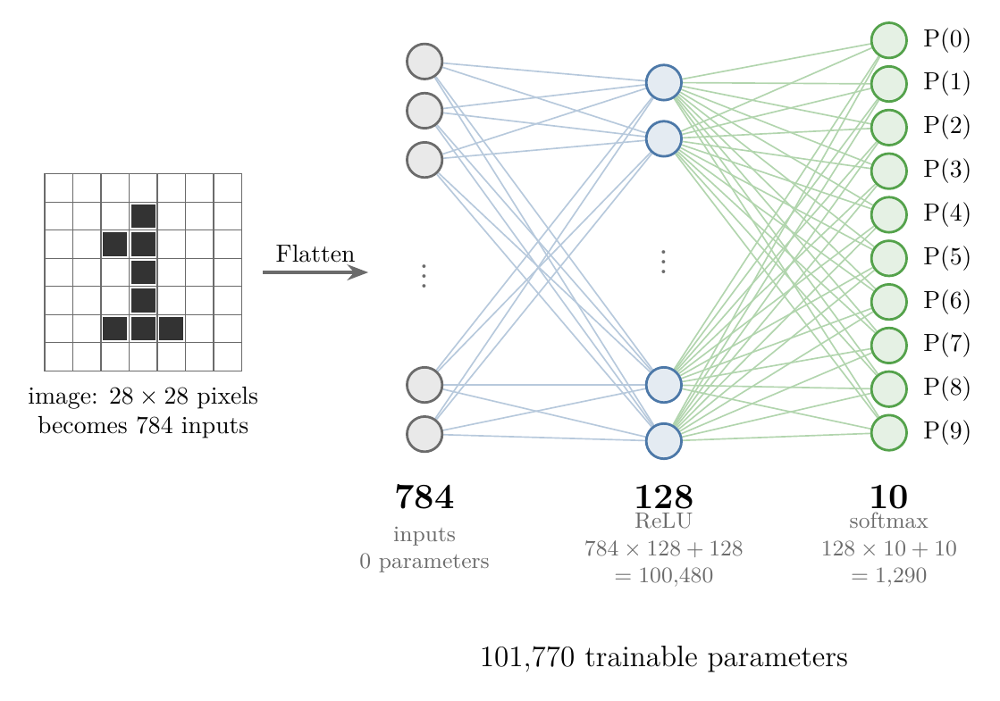{height=42%}

Figure 4 shows the network:

- **Input layer:** 784 nodes, one per pixel.
- **Hidden layer:** 128 nodes with the **ReLU** activation (G-1668; a node outputs its weighted sum $z$ if $z$ is positive and 0 otherwise, so ReLU(3) = 3 and ReLU($-2$) = 0), the usual default for hidden layers (Goodfellow et al. 2016, §6.3; see [ReLU](../../02-training/DL-027-activation-functions/DL-027-activation-functions.md#8-relu) among the activation functions).
- **Output layer:** 10 nodes, one per class.

With more than two classes the output layer has **one node per class**, and the class whose node gives the highest probability is the prediction (see [more nodes in the output layer](../DL-009-mlp-intuition/DL-009-mlp-intuition.md#43-more-nodes-in-the-output-layer)). The 10 nodes use **softmax**, which turns their 10 scores into 10 probabilities that add up to 1 (see [the softmax function](../../../ML/07-classification/ML-078-softmax-regression/ML-078-softmax-regression.md#2-the-softmax-function)). So for every image the network gives P(0), P(1), ..., P(9).

> **Python:** Building the network.
>
> ```python
> from keras import layers
>
> model = keras.Sequential([
>     keras.Input(shape=(28, 28)),            # one image
>     layers.Flatten(),                        # 28 x 28 -> 784
>     layers.Dense(128, activation="relu"),    # hidden layer
>     layers.Dense(10, activation="softmax"),  # one node per digit
> ])
> ```
>
> The input shape is now `(28, 28)`, one image. The Dense layers work out their own number of inputs from the layer before.

### 4.3 Counting the parameters

> **Key point:** 100,480 parameters into the hidden layer and 1,290 into the output layer: over 100,000 numbers to learn.

`model.summary()` lists:

| Layer | Output shape | Param # |
|---|---|---|
| flatten (Flatten) | (None, 784) | 0 |
| dense (Dense) | (None, 128) | 100,480 |
| dense_1 (Dense) | (None, 10) | 1,290 |
| **Total** | | **101,770** |

With the [counting rule for trainable parameters](../DL-008-mlp-notation/DL-008-mlp-notation.md#3-counting-trainable-parameters) (weights plus one bias per node):

Hidden layer (784 inputs, 128 nodes):

$$784 \times 128 = 100{,}352 \text{ weights}$$
$$100{,}352 + 128 = 100{,}480$$

Output layer (128 inputs, 10 nodes):

$$128 \times 10 = 1{,}280 \text{ weights}$$
$$1{,}280 + 10 = 1{,}290$$

The 784-128-10 network is the one previewed in the Extra box of that section. Over 100,000 weights and biases is already far more than the 276 of the churn network, though small by deep learning standards.

## 5. Compiling and training

> **Key point:** Sparse categorical cross-entropy takes the labels as plain digits 0 to 9; categorical cross-entropy needs them one-hot encoded. Otherwise they are the same loss.

### 5.1 The loss for many classes

> **Key point:** Both losses are categorical cross-entropy; "sparse" only means the labels stay as integers.

With a softmax output, the loss is **categorical cross-entropy** (G-349): the average of $-\log$ of the probability the network gives the true class (see [one loss for all classes](../../../ML/07-classification/ML-078-softmax-regression/ML-078-softmax-regression.md#42-the-real-approach-one-loss-for-all-classes) and [one perceptron, many models](../DL-006-perceptron-loss/DL-006-perceptron-loss.md#8-one-perceptron-many-models)). For one image of a 5, the loss is small when P(5) is high and large when P(5) is low:

$$P(5) = 0.9:\ -\ln 0.9 = 0.105$$

$$P(5) = 0.1:\ -\ln 0.1 = 2.30$$

Keras offers the loss in two forms, which differ only in how the labels are written:

| Loss | Labels | Label of a "5" |
|---|---|---|
| categorical cross-entropy | one-hot vectors | [0, 0, 0, 0, 0, 1, 0, 0, 0, 0] |
| sparse categorical cross-entropy | plain integers | 5 |

Our labels are integers 0 to 9, so the sparse form saves a one-hot encoding step (see [how one-hot encoding works](../../../ML/03-feature-engineering/ML-026-one-hot-encoding/ML-026-one-hot-encoding.md#2-how-one-hot-encoding-works)). The loss values are identical (see [categorical cross-entropy](../DL-014-dl-loss-functions/DL-014-dl-loss-functions.md#9-categorical-cross-entropy) among the loss functions).

> **Python:** Compiling, and the one-hot alternative.
>
> ```python
> model.compile(loss="sparse_categorical_crossentropy",
>               optimizer="adam")
>
> # only needed for categorical_crossentropy:
> keras.utils.to_categorical(5, 10)  # [0. 0. 0. 0. 0. 1. 0. 0. 0. 0.]
> ```

The optimizer is again Adam (see [Adam](../../03-optimizers/DL-038-adam/DL-038-adam.md#1-overview) among the optimizers).

### 5.2 Training

> **Key point:** 10 epochs with 20% of the training images held back for validation.

An **epoch** (G-696) is one pass of the network over all its training images; a **batch** (G-263) is the small group of images used for one weight update ([fit and epochs](../DL-011-customer-churn-ann/DL-011-customer-churn-ann.md#52-fit-epochs)). Each update is done by **backpropagation**: the network predicts, measures the loss, then changes every weight and bias with gradient descent so that the loss gets smaller ([backpropagation](../DL-015-backpropagation-what/DL-015-backpropagation-what.md#4-the-steps-of-backpropagation)). The **validation split** holds back part of the training data to measure the loss on images the network does not train on ([tracking accuracy and a validation set](../DL-011-customer-churn-ann/DL-011-customer-churn-ann.md#73-tracking-accuracy-and-a-validation-set)).

> **Python:** Training.
>
> ```python
> history1 = model.fit(X_train, y_train, epochs=10,
>                      validation_split=0.2)
> ```

Keras trains on 80% of the images and validates on the other 20%:

$$60{,}000 \times 0.8 = 48{,}000 \text{ training}$$

$$60{,}000 \times 0.2 = 12{,}000 \text{ validation}$$

`fit` was given no `batch_size`, so Keras uses its default of 32 images per batch (Keras docs, `Model.fit`). The number of weight updates per epoch:

$$48{,}000 / 32 = 1{,}500$$

The output shows this as `1500/1500`. The training loss falls from 0.280 after the first epoch to 0.014 after the tenth. The validation loss is lowest after epoch 4 (0.088) and has risen to 0.099 by epoch 10: a first sign of overfitting.

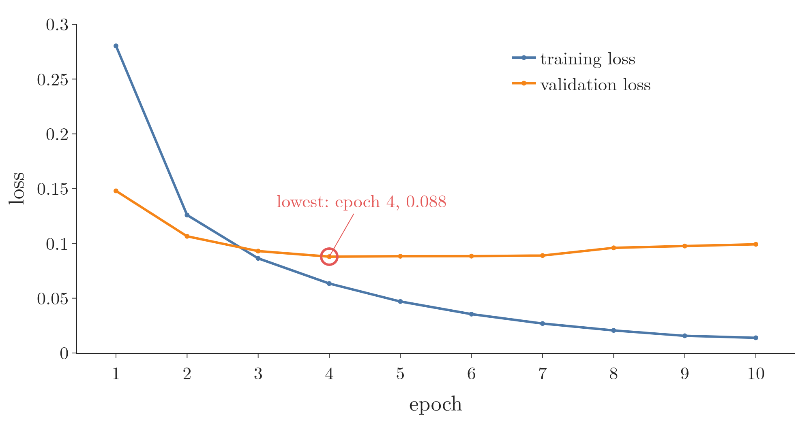{height=28%}

Figure 5 plots the loss (the average error, lower is better) against the epoch number, one line for the training images and one for the validation images. Watch the gap open: the training loss keeps falling to 0.014, while the validation loss flattens after epoch 4 and then creeps up.

## 6. Predicting with argmax

> **Key point:** `predict` gives 10 probabilities per image; the position of the largest one is the predicted digit.

`model.predict(X_test)` returns an array of shape (10000, 10): for each test image, the probability of each digit. For the first test image, P(7) is almost exactly 1 and the other nine are almost 0.

To turn the 10 probabilities into one digit we take the position of the largest: **argmax**. Since position $k$ holds P($k$), the position *is* the digit.

1. **In words:** the predicted class is the index of the largest probability.
2. **Formula:**
   $$\hat{y} = \arg\max_{k}\ P(k), \quad k = 0, 1, \dots, 9$$
3. **Example:** if an image gets P(1) = 0.03, P(2) = 0.90, P(7) = 0.05 and 0.02 shared among the rest, the largest is at position 2, so $\hat{y} = 2$.

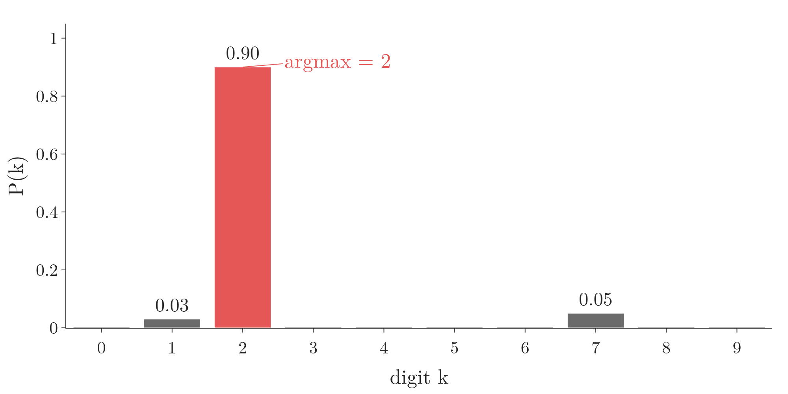{height=26%}

Figure 6 draws the example: argmax ignores how much bigger the tallest bar is and returns only its position, 2.

> **Python:** From probabilities to digits.
>
> ```python
> from sklearn.metrics import accuracy_score
>
> y_prob = model.predict(X_test)      # shape (10000, 10)
> y_pred = y_prob.argmax(axis=1)      # [7 2 1 ...]
> accuracy_score(y_test, y_pred)      # 0.9769
> ```
>
> `axis=1` takes the argmax across each row, one answer per image.

The first network gets **97.69%** of the 10,000 test images right. For comparison, KNN on all 784 pixels reached 96.8% in [KNN on all 784 features](../../../ML/05-dimensionality/ML-048-pca-mnist/ML-048-pca-mnist.md#3-knn-on-all-784-features), on a different split of MNIST. KNN compares each new image with every stored image (33,600 there), while the network only passes the image once through its two layers. A plain network with one hidden layer and no tuning already does better.

> **Extra:** Image data is the home ground of the **convolutional neural network (CNN)** (G-484), which looks at small patches of pixels instead of treating every pixel as a separate input. CNNs reach over 99% on MNIST: LeNet-5 had a test error of 0.95% (LeCun et al. 1998). CNNs are taught in [what makes a network a CNN](../../04-cnn/DL-040-cnn-intuition/DL-040-cnn-intuition.md#3-what-makes-a-network-a-cnn).

## 7. A bigger network and its training curves

> **Key point:** An extra hidden layer and 25 epochs make the training accuracy reach 99.7%, but the test accuracy barely moves (97.72%): the network overfits.

### 7.1 The second network

> **Key point:** 784-128-32-10, with accuracy tracked: 104,938 parameters.

To try to improve, we add a second hidden layer of 32 ReLU nodes, train for 25 epochs and track accuracy with `metrics=["accuracy"]` (see [tracking accuracy and a validation set](../DL-011-customer-churn-ann/DL-011-customer-churn-ann.md#73-tracking-accuracy-and-a-validation-set)).

Parameters per layer (inputs times nodes, plus one bias per node):

$$784 \times 128 + 128 = 100{,}480$$

$$128 \times 32 + 32 = 4{,}128$$

$$32 \times 10 + 10 = 330$$

$$100{,}480 + 4{,}128 + 330 = 104{,}938$$

> **Python:** The second network.
>
> ```python
> model2 = keras.Sequential([
>     keras.Input(shape=(28, 28)),
>     layers.Flatten(),
>     layers.Dense(128, activation="relu"),
>     layers.Dense(32, activation="relu"),
>     layers.Dense(10, activation="softmax"),
> ])
> model2.compile(loss="sparse_categorical_crossentropy",
>                optimizer="adam", metrics=["accuracy"])
> history = model2.fit(X_train, y_train, epochs=25,
>                      validation_split=0.2)
> ```

The test accuracy is **97.72%**, almost the same as the first network's 97.69%. More capacity and more epochs did not help.

### 7.2 Reading the curves

> **Key point:** The training loss keeps falling while the validation loss climbs after epoch 3: a clear case of overfitting.

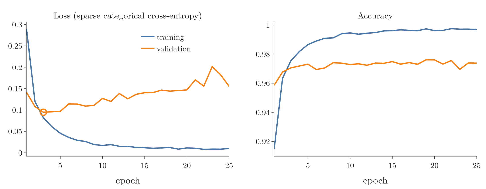

Figure 7 has two panels, both with the epoch on the horizontal axis. Left: the loss; right: the accuracy (the share of images classified correctly). Each has a training line and a validation line. The two panels explain the result:

- **Loss (left):** the training loss falls to about 0.01. The validation loss is lowest after epoch 3 (0.095), then rises, to 0.155 by epoch 25.
- **Accuracy (right):** training accuracy climbs to 99.7%, validation accuracy stays around 97 to 97.6%.

After epoch 3 the network keeps getting better on the images it trains on and worse on images it has not seen. The network is memorising the training set: **overfitting** (G-1429) (see [variance](../../../ML/06-regression/ML-061-bias-variance/ML-061-bias-variance.md#3-variance)). A student who memorises last year's answer sheet scores full marks on that sheet and still fails a new paper; the validation images are the new paper. The churn network showed a small gap; here it is large. [Regularization, dropout and stopping training at the right epoch](../../02-training/DL-021-improving-a-neural-network/DL-021-improving-a-neural-network.md#44-overfitting) fix this.

> **Extra:** If an accuracy curve is requested but `metrics=["accuracy"]` was not given to `compile`, `history.history` has no `accuracy` key and the plot fails with a `KeyError`. The model must be compiled again with the metric and retrained.

## 8. Where the network goes wrong

> **Key point:** 228 of the 10,000 test images are misclassified; the most common mistake is a 4 read as a 9.

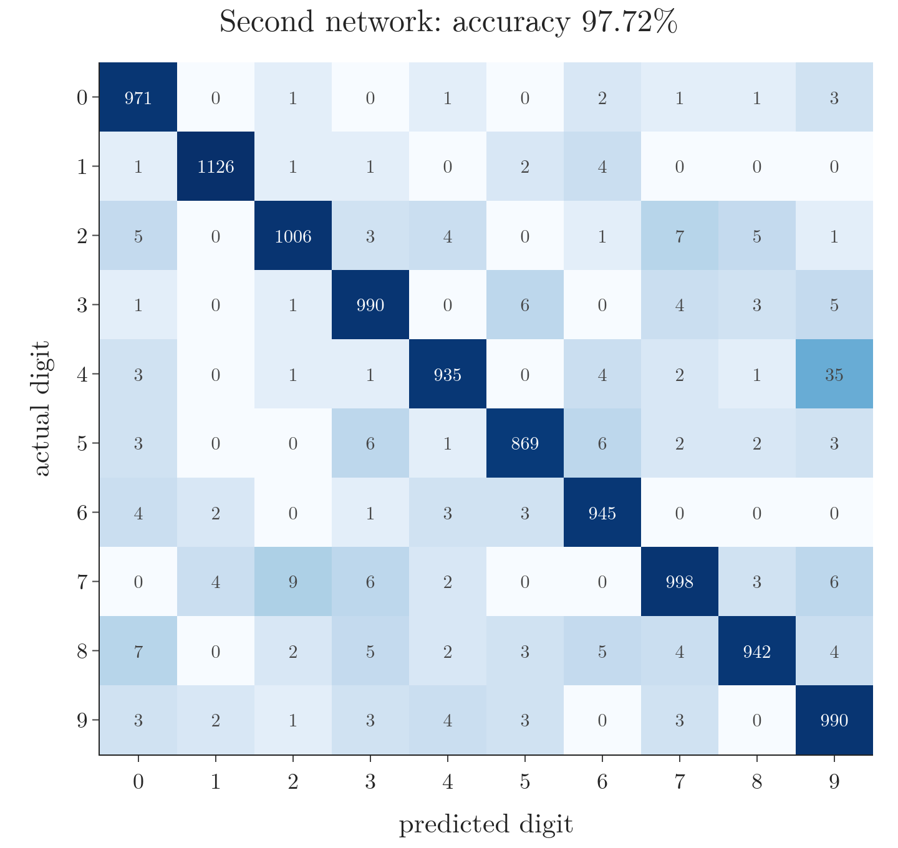{height=48%}

Figure 8 is the 10 × 10 confusion matrix (a table of counts; see [more than two classes](../../../ML/07-classification/ML-075-accuracy-confusion-matrix/ML-075-accuracy-confusion-matrix.md#5-more-than-two-classes)). Each row is the actual digit, each column the predicted digit, and each cell counts the test images with that pair, shaded darker for larger counts. The diagonal holds the correct predictions. The largest off-diagonal cells are the most common mistakes:

| Actual | Predicted | Count |
|---|---|---|
| 4 | 9 | 35 |
| 7 | 2 | 9 |
| 2 | 7 | 7 |
| 8 | 0 | 7 |

These pairs look alike when handwritten: a 4 with a closed top resembles a 9, a 2 with a straight base resembles a 7. Figure 9 shows five of the misclassified test images, each with its actual and predicted digit; several are hard to read even for a person.

> **Extra:** Are the confused digits close in raw pixels? A nearest-centroid classifier, which compares each test image only with the average image of each digit, makes the network's top mistake too: 4 read as 9 is the 2nd most common of its 79 different (actual, predicted) error pairs. But 7 read as 2 is only 30th and 2 read as 7 only 36th, so not every confusion comes from two digits with similar average images (Notebook).

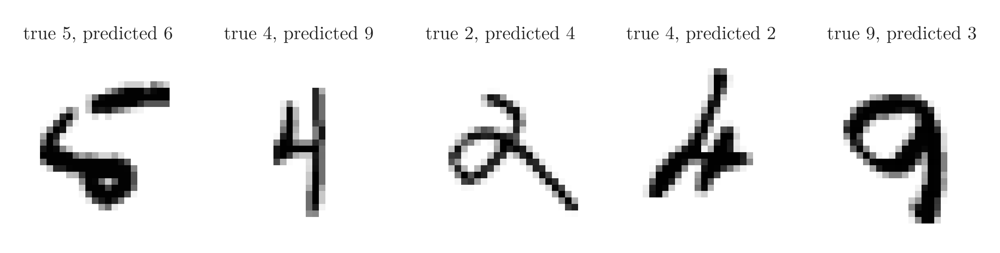

## 9. What the network really learned

> **Key point:** High accuracy does not mean the network sees digits the way we do. Its hidden nodes do not look for clean strokes, and it gives a confident answer even to random noise.

### 9.1 The hidden nodes as pictures

> **Key point:** Each hidden node has one weight per pixel, so its 784 weights can be drawn as a 28 × 28 picture of what the node responds to.

A natural hope is that each hidden node learns one piece of a digit, such as a stroke or a loop, and that the output layer combines the pieces. We can check this hope on the first network. Each of its 128 hidden nodes has 784 incoming weights, one per pixel. Drawn in the shape of the image, the weights show which pixels raise the node's sum (positive weight, blue) and which lower it (negative weight, red).

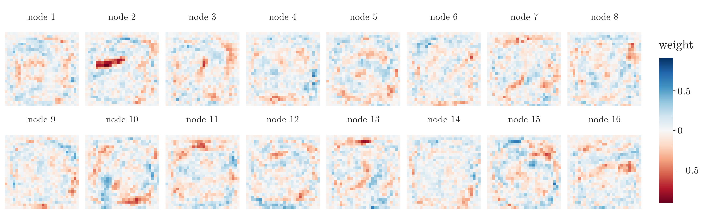{height=30%}

Figure 10 draws each weight as one square, at the position of its pixel. In the figure, look for strokes and loops. A few nodes show a short streak, but most pictures are blotchy patches of blue and red with no clear shape. The network reaches 97.69% with detectors that a person cannot read.

### 9.2 Noise in, confident answer out

> **Key point:** Fed random noise, the network still names a digit, with a probability near 1. Softmax has no way to answer "none of these".

The second check feeds the network an image that shows no digit at all: every pixel is a random number between 0 and 1.

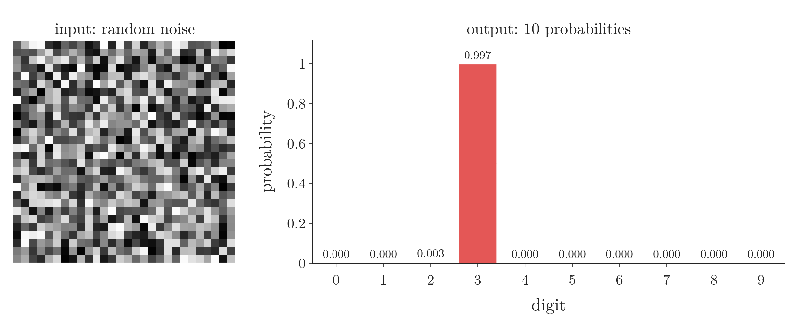{height=30%}

Figure 11 shows the noise image (left) and, on the right, one bar per digit giving the network's probability for it. The network says the noise is a 3, with probability 0.997. The noise image of Figure 11 is not a lucky pick: over 1,000 noise images the median top probability is 0.984, and 72% of the images get a top probability above 0.9. For real test images the median top probability rounds to 1.000, so the network is nearly as sure about noise as about real digits. It calls 771 of the 1,000 noise images a 3 and 193 a 5 (Notebook).

Two things cause this behaviour:

1. **Softmax must pick.** The 10 probabilities always add up to 1 (section 4.2), so the network cannot give a low score to every digit.
2. **The training data held only digits.** Every training image was a clear, centred digit, and the loss rewarded confident answers. Nothing taught the network what a non-digit looks like.

So a high test accuracy shows that the network separates the 10 digits well. It does not show that the network knows what a digit is. Networks built for images, the CNNs (see [what makes a network a CNN](../../04-cnn/DL-040-cnn-intuition/DL-040-cnn-intuition.md#3-what-makes-a-network-a-cnn)), look at small patches of pixels and raise the accuracy, but they also end in a softmax layer, so they too must pick one of the 10 digits for a noise image.

## 10. Predicting a single image

> **Key point:** `predict` expects a batch of images, so one image is reshaped from (28, 28) to (1, 28, 28) first.

Keras models always predict a batch of observations. A single image has shape (28, 28); `reshape(1, 28, 28)` turns it into a batch of one.

> **Python:** Predicting one test image.
>
> ```python
> p = model2.predict(X_test[0].reshape(1, 28, 28))
> p.argmax(axis=1)     # [7]: the first test image is a 7
> ```

The first two test images, a 7 and a 2, are both predicted correctly, each with a probability that rounds to 1.

## 11. Summary

| | Churn (binary) | MNIST (multi-class) |
|---|---|---|
| Input | 11 features, standardized | 28 × 28 image, divided by 255, flattened |
| Output layer | 1 node, sigmoid | 10 nodes, softmax |
| Loss | binary cross-entropy | sparse categorical cross-entropy |
| Prediction | probability > 0.5 | argmax of 10 probabilities |
| Test accuracy | 86.45% | 97.69% (first), 97.72% (second) |

- MNIST: 60,000 training and 10,000 test images of 28 × 28 pixels, loaded with `keras.datasets.mnist.load_data()`, so the test score comes from 10,000 images the network never trained on.
- Divide pixels by 255, because a network trains faster when its inputs share a small range; a Flatten layer turns each image into 784 inputs, because a Dense layer takes a flat list of numbers.
- Multi-class output: one softmax node per class; predict with `argmax(axis=1)`, because softmax gives one probability per digit and the position of the largest is the digit.
- Sparse categorical cross-entropy for integer labels, categorical cross-entropy for one-hot labels, so labels kept as plain digits 0 to 9 need no one-hot encoding.
- A bigger network trained longer overfitted: training loss down, validation loss up after epoch 3, so watch the validation loss, not only the training loss.
- The hidden nodes' weights show no clear strokes, and random noise gets a confident answer (a 3 with probability 0.997): accuracy alone does not show what a network learned.

So a network handles 10 classes with the same Keras steps as churn; only the input (Flatten), the output layer (10 softmax nodes), the loss and the prediction (argmax) change.

## 12. Sources

**Built from**

- CampusX, "Handwritten Digit Classification using ANN | MNIST Dataset", YouTube, https://www.youtube.com/watch?v=3xPT2Pk0Jds
- 3Blue1Brown, "But what is a neural network? | Deep learning chapter 1", YouTube, https://www.youtube.com/watch?v=aircAruvnKk (the task and the input nodes holding pixel values)
- 3Blue1Brown, "Gradient descent, how neural networks learn | Deep Learning Chapter 2", YouTube, https://www.youtube.com/watch?v=IHZwWFHWa-w (section 9: the hidden weights as pictures, and the noise test)

**Other references**

- LeCun, Bottou, Bengio and Haffner, "Gradient-Based Learning Applied to Document Recognition", *Proceedings of the IEEE*, 1998.
- Goodfellow, Bengio and Courville, *Deep Learning*, MIT Press, 2016, §6.3 (rectified linear units as the default hidden unit).

## 13. Key terms

Terms taught in this Note come first; linked terms are recaps, taught in the Note the link opens.

| Term | Meaning |
|---|---|
| argmax (G-212) | The position of the largest value; on 10 class probabilities, the predicted class. |
| `keras.datasets.mnist` (G-101) | Keras's built-in copy of MNIST, already split 60,000 / 10,000. |
| Flatten layer (G-788) | A layer that reshapes a multi-dimensional input into one dimension; no parameters. |
| Softmax output layer (G-1832) | An output layer with one node per class whose outputs are probabilities adding up to 1. |
| Sparse categorical cross-entropy (G-1839) | The same loss as categorical cross-entropy, but it takes the labels as plain integers (such as the digits 0 to 9) instead of one-hot vectors, so the labels need no encoding. |
| [MNIST](../../../ML/03-feature-engineering/ML-022-what-is-feature-engineering/ML-022-what-is-feature-engineering.md#81-pixels-as-columns-the-mnist-dataset) (G-1249) | A dataset of about 70,000 handwritten-digit images of 28 × 28 pixels. |
| [Observation](../../../ML/01-foundations/ML-003-types-of-ml/ML-003-types-of-ml.md#21-learning-from-inputs-and-outputs) (G-1374) | One record of a dataset: one row of the data table. |
| [Feature](../../../ML/01-foundations/ML-002-ai-vs-ml-vs-dl/ML-002-ai-vs-ml-vs-dl.md#52-features-chosen-by-us-or-learned) (G-772) | One piece of information about each example that a model uses (e.g. a student's CGPA). |
| [Label](../../../ML/01-foundations/ML-003-types-of-ml/ML-003-types-of-ml.md#21-learning-from-inputs-and-outputs) (G-1032) | The answer an example comes with, the value a model learns to predict, such as the digit an image shows; another name for the target or output. |
| [Target](../../../ML/01-foundations/ML-003-types-of-ml/ML-003-types-of-ml.md#21-learning-from-inputs-and-outputs) (G-1949) | The output column we predict, such as the class; also called the label. |
| [Dense (fully connected) layer](../../../DL/01-basics/DL-011-customer-churn-ann/DL-011-customer-churn-ann.md#41-the-first-architecture) (G-583) | A layer whose every node receives the output of every node in the layer before. |
| [ReLU](../../../DL/02-training/DL-027-activation-functions/DL-027-activation-functions.md#8-relu) (G-1668) | Rectified linear unit, the activation $\max(0, z)$: it passes a positive input unchanged and turns a negative one into 0; the usual default activation for hidden layers. |
| [Categorical cross entropy](../../../ML/07-classification/ML-078-softmax-regression/ML-078-softmax-regression.md#42-the-real-approach-one-loss-for-all-classes) (G-349) | The loss for classification with more than two classes and a softmax output: the average of minus the log of the probability given to the true class, $-\sum_j y_j \log \hat y_j$ per row with one-hot labels; it is small when the true class gets a high probability. |
| [Epoch](../../../DL/01-basics/DL-005-perceptron-trick/DL-005-perceptron-trick.md#7-loops-and-epochs) (G-696) | One full update of the parameters using the whole training set. |
| [Batch (mini-batch)](../../../ML/06-regression/ML-059-mini-batch-gradient-descent/ML-059-mini-batch-gradient-descent.md#1-overview) (G-263) | A small group of training observations used for one update; Keras uses 32 by default. |
| [Convolutional neural network (CNN)](../../../DL/04-cnn/DL-040-cnn-intuition/DL-040-cnn-intuition.md#1-overview) (G-484) | A neural network that slides small filters over its input to find patterns such as edges, using at least one convolutional layer; the standard network for images. |
| [Overfitting](../../../ML/01-foundations/ML-007-challenges-in-ml/ML-007-challenges-in-ml.md#71-overfitting) (G-1429) | Learning the training data too closely, noise included; fails on new data. |
| [`to_categorical`](../../../DL/05-rnn/DL-063-lstm-next-word-prediction/DL-063-lstm-next-word-prediction.md#52-one-hot-targets) (G-151) | Keras function that turns integer class labels into 0/1 vectors with a single 1 at the label's position (one-hot encoding). |
