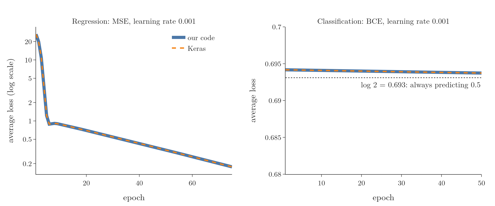
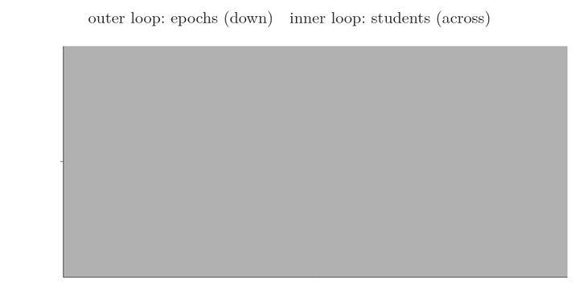
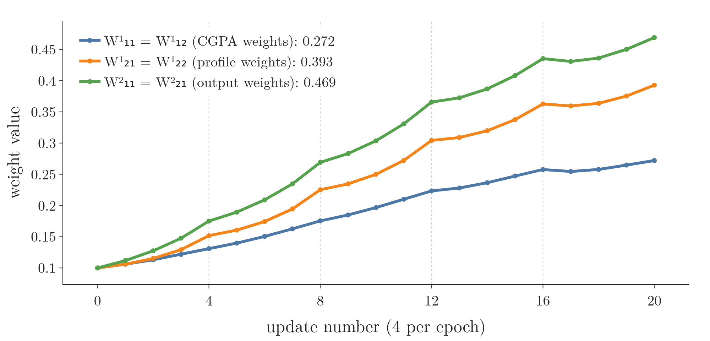
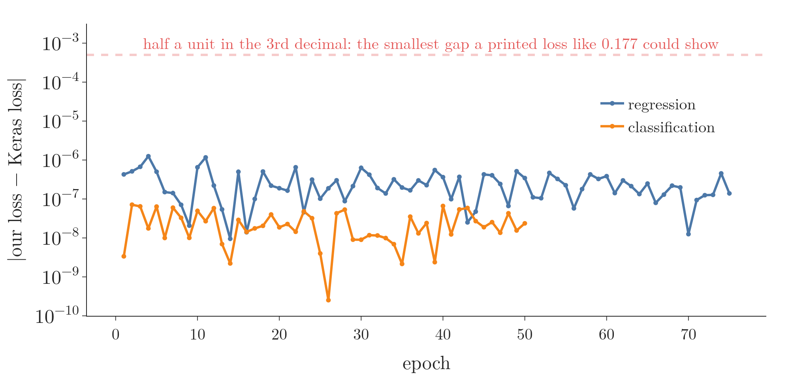
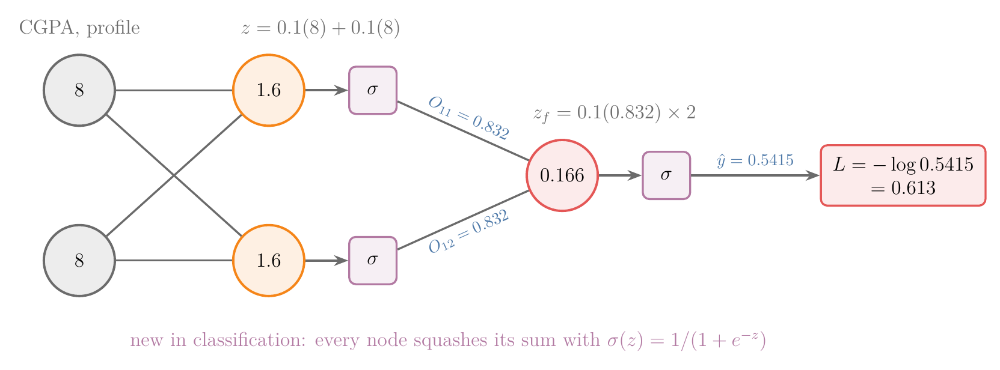
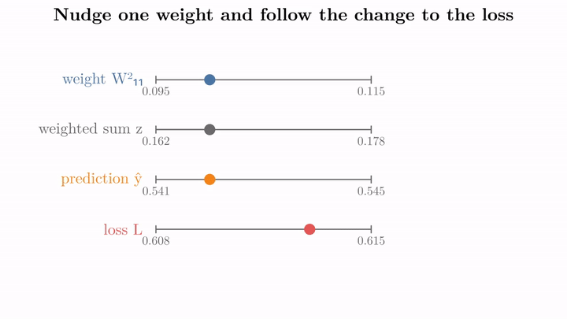
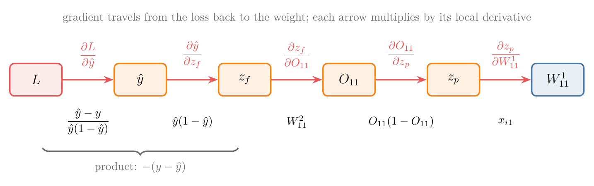
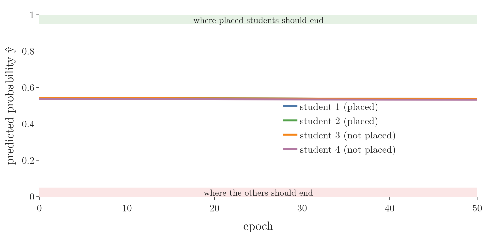
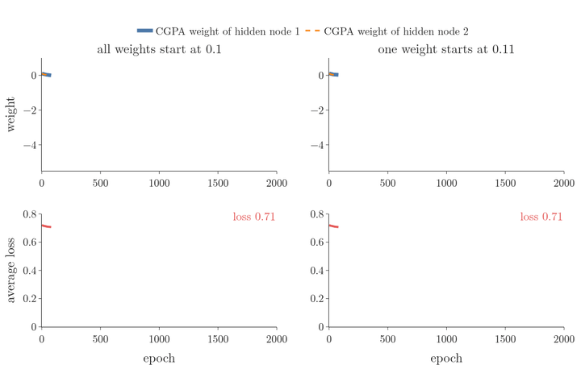

<!-- where-this-fits: generated by course_map/build_map.py; edit concepts.yaml, not this block -->
> **Where this fits:** Pipeline map step 8 (Model). See the [Course map](../../../00-course-map/00-course-map.md).
>
> 
>
> - **Builds on:** [Gradient descent](../../../ML/06-regression/ML-056-gradient-descent/ML-056-gradient-descent.md#7-gradient-descent-as-a-class); [Sigmoid function](../../../ML/07-classification/ML-071-sigmoid-function/ML-071-sigmoid-function.md#4-the-sigmoid-function); [Derivatives of one variable](../../../MA/06-calculus/MA-061-derivatives-of-one-variable/MA-061-derivatives-of-one-variable.md#1-overview); [Partial derivatives and gradients](../../../MA/06-calculus/MA-062-partial-derivatives-and-gradients/MA-062-partial-derivatives-and-gradients.md#12-the-gradient-on-the-map); [Forward propagation](../../../DL/01-basics/DL-010-forward-propagation/DL-010-forward-propagation.md#1-overview); [Loss functions in deep learning](../../../DL/01-basics/DL-014-dl-loss-functions/DL-014-dl-loss-functions.md#13-sources).
> - **Leads to:** [Vanishing gradient](../../../DL/01-basics/DL-018-vanishing-exploding-gradients/DL-018-vanishing-exploding-gradients.md#3-the-vanishing-gradient-problem); [Improving a neural network](../../../DL/02-training/DL-021-improving-a-neural-network/DL-021-improving-a-neural-network.md#1-overview); [Weight initialisation](../../../DL/02-training/DL-029-weight-initialization/DL-029-weight-initialization.md#1-overview); [Optimizers in deep learning](../../../DL/03-optimizers/DL-032-optimizers-in-deep-learning/DL-032-optimizers-in-deep-learning.md#8-sources); [Backpropagation in a CNN](../../../DL/04-cnn/DL-047-backpropagation-in-cnn/DL-047-backpropagation-in-cnn.md#1-overview); [Backpropagation through time (BPTT)](../../../DL/05-rnn/DL-059-backpropagation-through-time/DL-059-backpropagation-through-time.md#1-overview).
<!-- /where-this-fits -->

## 1. Overview

> **Key point:** We turn the algorithm into code twice: for regression (linear nodes, squared error) and for classification (sigmoid nodes, binary cross-entropy). Our code and Keras, started from the same weights, produce the same losses to every printed digit.

[Backpropagation](../DL-015-backpropagation-what/DL-015-backpropagation-what.md#4-the-steps-of-backpropagation) was built, with its [9 derivatives](../DL-015-backpropagation-what/DL-015-backpropagation-what.md#6-the-nine-derivatives), for a 2-2-1 regression network (2 inputs, 2 hidden nodes, 1 output). This Note runs it:

1. **Regression:** the same network and data, trained for several epochs (an epoch is one full pass over the data) with our own NumPy code, then with Keras.
2. **Classification:** the same architecture with **sigmoid** (a function that squashes any number into the range 0 to 1) activations and **binary cross-entropy** (G-303; [the loss for two classes](../../../ML/07-classification/ML-072-log-loss/ML-072-log-loss.md#62-the-loss-function)). The derivatives change, so we derive them, then train again.

{height=33%}

Figure 1 plots the average loss (vertical axis) against the epoch (horizontal axis): regression on the left, classification on the right. Our code is the solid blue line and Keras the dashed orange line. The left panel's vertical axis is logarithmic: each labelled step up (0.2, 0.5, 1, 2, 5, ...) multiplies the loss instead of adding to it, so the fall from 26 to 0.2 fits on one picture. In both problems the two lines lie on top of each other. Keras runs the same backpropagation we write by hand.

## 2. Prerequisites

- [The steps of backpropagation](../DL-015-backpropagation-what/DL-015-backpropagation-what.md#4-the-steps-of-backpropagation) and [the nine derivatives](../DL-015-backpropagation-what/DL-015-backpropagation-what.md#6-the-nine-derivatives): the algorithm, the network and the regression derivatives.
- [The derivative of the sigmoid](../../../ML/07-classification/ML-073-sigmoid-derivative/ML-073-sigmoid-derivative.md#33-the-result) and [the gradient of the logistic loss](../../../ML/07-classification/ML-074-logistic-gradient-descent/ML-074-logistic-gradient-descent.md#5-the-gradient), for the classification derivatives.

## 3. The regression algorithm, in loops

> **Key point:** An outer loop over epochs, an inner loop over the 4 students; inside: forward, loss, update all 9 parameters. At the end of each epoch, average the 4 losses.

The data and network are those of [the backpropagation example](../DL-015-backpropagation-what/DL-015-backpropagation-what.md#3-the-data-and-the-network): four students, each one **observation** (one record, one row of the data table). CGPA and profile score are the two **features** (input variables), and the package is the **target** (the output we predict). The network is a 2-2-1 network with linear nodes (each node outputs its weighted sum unchanged), all weights 0.1 and biases 0. The algorithm:

1. Initialise the parameters.
2. For each of 5 epochs:
   - for each student, in order:
     a. predict $\hat{y}$ with forward propagation;
     b. compute the loss $(y - \hat{y})^2$;
     c. update the 9 parameters with $W \leftarrow W - \eta\thinspace\partial L/\partial W$, where the step size $\eta = 0.001$ is the **learning rate** (G-1068).
   - print the average of the 4 losses: the loss of the **epoch** (G-696), one full pass over the data.

{height=34%}

Figure 2 runs the two loops. The inner loop fills a row from left to right, one student at a time; the outer loop moves down one row per epoch. Watch every row come out lighter than the one above: after one epoch of updates, every student's loss is lower than in the epoch before.

Students are taken in order here. In practice the observations are usually picked in a random order each epoch, which [stochastic gradient descent in a network](../../02-training/DL-020-gradient-descent-in-neural-networks/DL-020-gradient-descent-in-neural-networks.md#5-stochastic-gradient-descent-in-a-network) returns to.

## 4. The regression code

> **Key point:** Four small functions: initialise, forward, update, train. The update function is the 9 derivative formulas, one line per group.

### 4.1 Initialising and predicting

> **Key point:** One weight matrix and one bias vector per layer; forward propagation keeps the hidden outputs, because the update needs them.

> **Python:** Initialisation and forward propagation.
>
> ```python
> import numpy as np
>
> def initialize_parameters(layer_dims):
>     # weights 0.1, biases 0; W[l] has shape (nodes in l-1, nodes in l)
>     return {l: [np.full((layer_dims[l-1], layer_dims[l]), 0.1),
>                 np.zeros(layer_dims[l])]
>             for l in range(1, len(layer_dims))}
>
> def forward_regression(x, params):
>     a1 = params[1][0].T @ x + params[1][1]       # O11, O12
>     y_hat = params[2][0].T @ a1 + params[2][1]   # O21
>     return y_hat[0], a1
> ```
>
> `initialize_parameters([2, 2, 1])` creates a $2 \times 2$ matrix $W^{1}$, a bias vector of length 2, a $2 \times 1$ matrix $W^{2}$ and one bias: the 9 parameters. Each layer is the [matrix product of forward propagation](../DL-010-forward-propagation/DL-010-forward-propagation.md#42-the-product) (`@` in NumPy, `.T` the transpose), without the sigmoid.

For student 1 (CGPA 8, profile score 8) the function returns the prediction $\hat{y} = 0.32$ and the hidden outputs $a^{1} = (1.6, 1.6)$, the vector of the two hidden nodes' outputs $O_{11}$ and $O_{12}$. We keep $a^{1}$ because the derivatives of the output weights are $-2(y - \hat{y})\thinspace O_{11}$ and $-2(y - \hat{y})\thinspace O_{12}$.

### 4.2 Updating the parameters

> **Key point:** Compute $g = -2(y - \hat{y})$ once (the [derivative of the loss](../DL-015-backpropagation-what/DL-015-backpropagation-what.md#62-the-output-layer-three-derivatives)); every update is $g$ times the parameter's own factors.

> **Python:** The 9 updates.
>
> ```python
> def update_regression(params, x, y, y_hat, a1, lr):
>     g = -2 * (y - y_hat)                   # dL/dy_hat
>     W2 = params[2][0][:, 0].copy()         # keep the old W2
>     params[2][0][:, 0] -= lr * g * a1       # W2_11, W2_21
>     params[2][1][0] -= lr * g               # b21
>     params[1][0] -= lr * np.outer(x, g * W2)  # four W1
>     params[1][1] -= lr * g * W2             # b11, b12
> ```
>
> `-=` changes the arrays in place, so `params` holds the new values afterwards. The copy of `W2` matters: the hidden-layer derivatives use the weights from before this update.

The minus signs in the formulas and the minus of the update rule cancel: every update here adds $\eta \cdot 2(y - \hat{y})$ times the parameter's factors.

### 4.3 Training

> **Key point:** Five epochs bring the average loss from 26.35 down to 1.22.

> **Python:** The training loop.
>
> ```python
> def train_regression(X, Y, epochs=5, lr=0.001):
>     params, history = initialize_parameters([2, 2, 1]), []
>     for epoch in range(epochs):
>         losses = []
>         for x, y in zip(X, Y):           # one student at a time
>             y_hat, a1 = forward_regression(x, params)
>             losses.append((y - y_hat) ** 2)
>             update_regression(params, x, y, y_hat, a1, lr)
>         history.append(np.mean(losses))  # loss of the epoch
>     return params, history
> ```

The first epoch is exactly the one [worked by hand](../DL-015-backpropagation-what/DL-015-backpropagation-what.md#7-one-update-with-real-numbers): losses 13.54, 21.29, 30.43 and 40.12, average 26.35. Then:

| Epoch | 1 | 2 | 3 | 4 | 5 |
|---|---|---|---|---|---|
| Average loss | 26.35 | 19.86 | 10.88 | 3.78 | 1.22 |

After 5 epochs the weights have moved from 0.1 to $W_{11}^{1} = W_{12}^{1} = 0.272$, $W_{21}^{1} = W_{22}^{1} = 0.393$, $W_{11}^{2} = W_{21}^{2} = 0.469$, with biases 0.028 (hidden) and 0.122 (output). The predictions are 5.14, 5.25, 5.36 and 5.84 LPA for packages of 4, 5, 6 and 7 (LPA: lakh rupees per year; one lakh is 100,000). They are in the right range and rising in the right order, but still too close together. After 75 epochs the average loss is 0.177 (Figure 1, left).

{height=30%}

Figure 3 plots the weight value (vertical axis) after each of the 20 updates (horizontal axis), one line per distinct weight. The lines rise, because the gradient is negative while the prediction is below the target. The one small dip, at update 17 (student 1 of epoch 5), happens because student 1's prediction is by then above its package of 4, so its gradient is positive and the update pulls the weights down. The pairs stay equal: $W_{11}^{1} = W_{12}^{1}$ and $W_{21}^{1} = W_{22}^{1}$, since both hidden nodes start the same and receive the same updates.

## 5. The same training in Keras

> **Key point:** Same architecture, same starting weights, plain SGD (stochastic gradient descent: update after one observation) with the same learning rate, one observation per update, no shuffling: Keras gives the same losses and weights.

> **Python:** The regression network in Keras, with our starting weights.
>
> ```python
> import keras
>
> model = keras.Sequential([
>     keras.Input(shape=(2,)),
>     keras.layers.Dense(2, activation="linear"),
>     keras.layers.Dense(1, activation="linear"),
> ])
> model.set_weights([np.full((2, 2), 0.1), np.zeros(2),
>                    np.full((2, 1), 0.1), np.zeros(1)])
> model.compile(optimizer=keras.optimizers.SGD(learning_rate=0.001),
>               loss="mse")
> model.fit(X, Y, epochs=5, batch_size=1, shuffle=False)
> ```
>
> `model.summary()` shows 9 trainable parameters. Keras normally starts from random weights; `get_weights` returns the arrays in the order kernel, bias, kernel, bias, and `set_weights` overwrites them. `batch_size=1` (G-62) updates after every row, as our loop does; `shuffle=False` (G-143) keeps the rows in order. `keras.optimizers.SGD` (G-104) is plain gradient descent with a fixed learning rate.

Keras prints the epoch losses 26.346, 19.859, 10.882, 3.777 and 1.224, and ends with exactly our weights (0.272, 0.393, 0.469, ...). The two curves in Figure 1 (left) coincide for all 75 epochs.

{height=30%}

Figure 4 plots the absolute gap between the two losses at each epoch. The vertical axis is logarithmic: each gridline is ten times the one below. It measures how close "coincide" is. The largest gap is 0.0000013 (regression) and 0.00000007 (classification), hundreds of times smaller than the 0.0005 that would change a loss printed to three decimals.

> **Extra:** Every setting must match to get identical numbers. By default `fit` shuffles the rows every epoch and uses batches of 32 rows, so with default settings Keras follows a different path and ends at a slightly different loss. With an optimizer such as Adam instead of plain SGD, the steps themselves change.

## 6. The classification problem

> **Key point:** Same architecture, but every node uses a sigmoid and the loss is binary cross-entropy. Two extra steps appear in forward propagation: each weighted sum goes through the sigmoid.

Now the output is whether the student is placed (1) or not (0):

| Student | CGPA | Profile score | Placed |
|---|---|---|---|
| 1 | 8 | 8 | 1 |
| 2 | 7 | 9 | 1 |
| 3 | 6 | 10 | 0 |
| 4 | 5 | 5 | 0 |

Two things change:

- **Activations:** every node computes its weighted sum $z$ (its inputs times the weights, plus the bias) and then outputs $\sigma(z)$, as in [forward propagation](../DL-010-forward-propagation/DL-010-forward-propagation.md#3-what-one-node-computes).
- **Loss:** [binary cross-entropy](../../../ML/07-classification/ML-072-log-loss/ML-072-log-loss.md#62-the-loss-function), the right loss for two classes with a sigmoid output ([why not squared error](../DL-014-dl-loss-functions/DL-014-dl-loss-functions.md#81-why-not-the-squared-error)). Here $y$ is the target (1 placed, 0 not) and $\hat{y}$ the predicted probability of being placed, and $\log$ is the natural logarithm:
  $$L = -y\log\hat{y} - (1 - y)\log(1 - \hat{y})$$

The algorithm (loops, forward, loss, update) stays the same. Only the derivatives change.

For student 1, with all weights 0.1 and biases 0:

Both hidden nodes have the same weights, so both get the same weighted sum and the same output:

$$z_{11} = 0.1 \times 8 + 0.1 \times 8 = 1.6$$

$$O_{11} = O_{12} = \sigma(1.6) = 0.832$$

The output node's weighted sum, $z_f$, then gives the prediction:

$$z_f = 0.1 \times 0.832 + 0.1 \times 0.832 = 0.166$$

$$\hat{y} = \sigma(0.166) = 0.5415$$

The prediction is a probability: the network says student 1 is placed with probability 0.5415. Then, with $y = 1$:

$$L = -\log 0.5415 = 0.613$$

{height=26%}

Figure 5 shows where the two new steps sit: the purple $\sigma$ boxes after each weighted sum.

## 7. The classification derivatives

> **Key point:** The sigmoid and the log cancel: $\partial L/\partial z_f = -(y - \hat{y})$. The output layer then looks like regression with $-1$ in place of $-2$; the hidden layer gains a factor $O(1 - O)$ from its own sigmoid.

### 7.1 The output layer

> **Key point:** Three links, $L \to \hat{y} \to z_f \to W_{11}^{2}$ ($z_f$ is the output node's weighted sum); the first two multiply to $-(y - \hat{y})$.

Before the algebra, here is what a chain of derivatives means. Nudge the output weight $W_{11}^{2}$ a little. The weighted sum $z_f$ of the output node moves, then the prediction $\hat{y}$ moves, then the loss $L$ moves. Each quantity moves by a fixed multiple of the one before it, and those multiples are the factors of the [chain rule](../../../MA/06-calculus/MA-062-partial-derivatives-and-gradients/MA-062-partial-derivatives-and-gradients.md#6-the-chain-rule-with-several-variables).

{height=60%}

In Figure 6, watch the dots move one after another:

1. The weight rises by 0.01, and $z_f$ rises by 0.0083: $z_f$ moves 0.832 times as far, because the weight is multiplied by the hidden output $O_{11} = 0.832$.
2. $\hat{y}$ rises by 0.0021: it moves 0.248 times as far as $z_f$, the slope of the sigmoid at this point.
3. $L$ falls by 0.0038: it moves 1.84 times as far as $\hat{y}$, in the opposite direction, the slope of the loss.

Multiplying the three gives the change of the loss per unit change of the weight:

$$0.832 \times 0.248 \times (-1.84) = -0.38$$

Section 7.3 computes the exact derivative, $-0.3815$. The rest of this section finds each factor as a formula.

{width=100%}

Figure 7 draws the chain as boxes joined by arrows, from the loss on the left to the weight on the right (the gradient travels along the arrows from the loss back to the weight). Each arrow carries the local derivative (how much one box moves per unit move of the previous one); the derivative of the loss with respect to the weight is the product of the arrows.

Call $z_f = W_{11}^{2} O_{11} + W_{21}^{2} O_{12} + b_{21}$ the weighted sum of the output node, so $\hat{y} = \sigma(z_f)$. A change in $W_{11}^{2}$ changes $z_f$, then $\hat{y}$, then $L$:

$$\frac{\partial L}{\partial W_{11}^{2}} = \frac{\partial L}{\partial \hat{y}} \cdot \frac{\partial \hat{y}}{\partial z_f} \cdot \frac{\partial z_f}{\partial W_{11}^{2}}$$

The first two factors (Figure 7, left):

- Differentiating the loss:
  $$\frac{\partial L}{\partial \hat{y}} = -\frac{y}{\hat{y}} + \frac{1 - y}{1 - \hat{y}}$$
  $$= \frac{-y(1 - \hat{y}) + (1 - y)\hat{y}}{\hat{y}(1 - \hat{y})} \qquad \text{(common denominator)}$$
  $$= \frac{-y + y\hat{y} + \hat{y} - y\hat{y}}{\hat{y}(1 - \hat{y})}$$
  $$= \frac{\hat{y} - y}{\hat{y}(1 - \hat{y})}$$
- The sigmoid's derivative (derived in [the result](../../../ML/07-classification/ML-073-sigmoid-derivative/ML-073-sigmoid-derivative.md#33-the-result)):
  $$\frac{\partial \hat{y}}{\partial z_f} = \hat{y}(1 - \hat{y})$$

Multiplied, the $\hat{y}(1 - \hat{y})$ cancels, the same simplification as in [the first part of the logistic gradient](../../../ML/07-classification/ML-074-logistic-gradient-descent/ML-074-logistic-gradient-descent.md#51-the-first-part):

$$\frac{\partial L}{\partial z_f} = \hat{y} - y = -(y - \hat{y})$$

The last factor is the same as in regression: $\partial z_f/\partial W_{11}^{2} = O_{11}$, $\partial z_f/\partial W_{21}^{2} = O_{12}$, $\partial z_f/\partial b_{21} = 1$. So:

$$\frac{\partial L}{\partial W_{11}^{2}} = -(y - \hat{y})\thinspace O_{11}$$

$$\frac{\partial L}{\partial W_{21}^{2}} = -(y - \hat{y})\thinspace O_{12}$$

$$\frac{\partial L}{\partial b_{21}} = -(y - \hat{y})$$

These are the regression formulas with $-1$ in place of $-2$.

### 7.2 The hidden layer

> **Key point:** Two more links: $z_f \to O_{11}$ gives $W_{11}^{2}$; $O_{11} \to z_p$ gives the sigmoid derivative $O_{11}(1 - O_{11})$.

For $W_{11}^{1}$ the chain is five links long (Figure 7). With $z_p = W_{11}^{1} x_{i1} + W_{21}^{1} x_{i2} + b_{11}$ the weighted sum of hidden node 1, so $O_{11} = \sigma(z_p)$:

$$\frac{\partial L}{\partial W_{11}^{1}} = \underbrace{\frac{\partial L}{\partial \hat{y}}\thinspace\frac{\partial \hat{y}}{\partial z_f}} _{-(y - \hat{y})} \cdot \underbrace{\frac{\partial z_f}{\partial O_{11}}} _{W_{11}^{2}}$$

$$\cdot \underbrace{\frac{\partial O_{11}}{\partial z_p}} _{O_{11}(1 - O_{11})} \cdot \underbrace{\frac{\partial z_p}{\partial W_{11}^{1}}} _{x_{i1}}$$

The other five follow the same pattern. Only the last factor changes within a node ($x_{i1}$, $x_{i2}$ or 1), and the second node uses $W_{21}^{2}$ and $O_{12}$:

| Parameter | $\partial L / \partial(\text{parameter})$ |
|---|---|
| $W_{11}^{1}$, $W_{21}^{1}$, $b_{11}$ | $-(y - \hat{y})\thinspace W_{11}^{2}\thinspace O_{11}(1 - O_{11}) \times x_{i1},\ x_{i2},\ 1$ |
| $W_{12}^{1}$, $W_{22}^{1}$, $b_{12}$ | $-(y - \hat{y})\thinspace W_{21}^{2}\thinspace O_{12}(1 - O_{12}) \times x_{i1},\ x_{i2},\ 1$ |

Compared with regression, each hidden derivative has one extra factor, $O(1 - O)$: the derivative of the hidden node's own sigmoid.

> **Extra:** Here each hidden node feeds a single output node, so only one path leads from it to the loss. When a hidden node feeds several nodes of the next layer, a change in its output reaches the loss along every one of those paths, and its derivative is the sum over the paths (the [chain rule with two paths](../../../MA/06-calculus/MA-062-partial-derivatives-and-gradients/MA-062-partial-derivatives-and-gradients.md#61-one-outer-input-two-paths)). With two output nodes, whose weighted sums are $z_{f1}$ and $z_{f2}$:
> $$\frac{\partial L}{\partial O_{11}} = \frac{\partial L}{\partial z_{f1}}\thinspace W_{11}^{2} + \frac{\partial L}{\partial z_{f2}}\thinspace W_{12}^{2}$$
> Deeper and wider networks, and [recurrent networks trained through time](../../05-rnn/DL-059-backpropagation-through-time/DL-059-backpropagation-through-time.md#61-three-paths), use this sum at every hidden node.

### 7.3 Student 1 in numbers

> **Key point:** $-(y - \hat{y}) = -0.4585$; output weights get $-0.381$, hidden weights $-0.0513$.

{width=100%}

In Figure 8, watch the running product along the bottom: each step back multiplies the gradient by one number, and the two small factors, 0.1 and 0.140, shrink it from $-0.4585$ to $-0.0513$.

1. **In words:** compute $-(y - \hat{y})$ once, then multiply by each parameter's factors.
2. **Formula:** the formulas of Sections 7.1 and 7.2.
3. **Example:** $y = 1$, $\hat{y} = 0.5415$, $O_{11} = 0.832$:
   $$-(y - \hat{y}) = -(1 - 0.5415) = -0.4585$$
   $$\frac{\partial L}{\partial W_{11}^{2}} = -0.4585 \times 0.832 = -0.3815$$
   $$\frac{\partial L}{\partial b_{21}} = -0.4585$$
   $$O_{11}(1 - O_{11}) = 0.832 \times 0.168 = 0.140$$
   $$\frac{\partial L}{\partial W_{11}^{1}} = -0.4585 \times 0.1 \times 0.140 \times 8$$
   $$\frac{\partial L}{\partial W_{11}^{1}} = -0.0513$$
   $$\frac{\partial L}{\partial b_{11}} = -0.0064$$

The hidden-layer gradients are about 7 times smaller than the output-layer ones: the factors $W_{11}^{2} = 0.1$ and $O_{11}(1 - O_{11}) = 0.14$ shrink them. Each sigmoid between a weight and the loss multiplies its gradient by at most 0.25, an effect called the [vanishing gradient](../DL-018-vanishing-exploding-gradients/DL-018-vanishing-exploding-gradients.md#3-the-vanishing-gradient-problem).

> **Python:** The classification gradients.
>
> ```python
> def sigmoid(z):
>     return 1 / (1 + np.exp(-z))
>
> def gradients_classification(params, x, y, y_hat, a1):
>     d_out = -(y - y_hat)                  # dL/dz_f
>     W2 = params[2][0][:, 0]
>     d_hidden = d_out * W2 * a1 * (1 - a1)  # dL/dz_p, per node
>     return {"W2": d_out * a1, "b2": d_out,
>             "W1": np.outer(x, d_hidden), "b1": d_hidden}
> ```
>
> `d_hidden` holds, for each hidden node, the derivative of the loss with respect to that node's weighted sum ($\partial L/\partial z$, G-16). Every weight entering the node multiplies it by its own input. In the Notebook, `tf.GradientTape` returns the same 9 numbers.

## 8. Training the classifier

> **Key point:** The loss starts at 0.694 and is still 0.694 after 50 epochs. Keras, from the same start, does exactly the same: the code is right, and this network is stuck.

Training with the same loops and $\eta = 0.001$:

| Epoch | 1 | 2 | 50 |
|---|---|---|---|
| Our code | 0.6942 | 0.6942 | 0.6937 |
| Keras | 0.6942 | 0.6942 | 0.6937 |

The loss barely moves, and every student gets a probability of about 0.54 (Figure 9).

{height=30%}

In Figure 9, all four lines lie on top of each other at about 0.54 and stay flat: the placed students never rise towards 1, and the others never fall towards 0. Is the code wrong? The same network in Keras (sigmoid activations, `loss="binary_crossentropy"`, same weights and settings) gives the same numbers to four digits (Figure 1, right). So backpropagation is computed correctly; the network is simply not learning.

The loss sits next to $\log 2 = 0.693$, the binary cross-entropy of predicting 0.5 for everyone: the network has learned nothing beyond "two students are placed, two are not". Two causes add up:

- **A tiny learning rate** with tiny hidden gradients (Section 7.3): the weights hardly move.
- **Identical hidden nodes:** every weight starts at 0.1, so both hidden nodes stay the same, and the network acts as if it had one hidden node. Two hidden nodes with the same inputs need different starting weights to "break symmetry" (Goodfellow et al. 2016, §8.4); two hidden nodes stuck as copies of each other are the **symmetry problem** (G-1933); the Notebook confirms that the two columns of $W^{1}$ are still equal after training. Two twins given the same lessons in the same order give the same answers on every exam.

{height=50%}

Figure 10 shows the symmetry problem at work, with the larger learning rate 0.1 so that the weights move. Watch the blue and orange lines in the top row:

- **Left, all weights 0.1:** the two lines lie on top of each other for all 2,000 epochs. The two hidden nodes receive the same updates and never separate. The loss stops at 0.49.
- **Right, one weight 0.11:** a difference of 0.01 in one starting weight is enough. The two lines drift apart, each hidden node learns its own job, and after a bumpy stretch the loss falls to 0.04. All four students are then classified correctly, with probabilities 0.96, 0.96, 0.02 and 0.03.

> **Extra:** With every weight starting at 0.1, $\eta = 0.1$ and 2,000 epochs (Figure 10, left), the loss falls to 0.49: students 1 and 2 get about 0.66 and student 3 gets 0.01, but student 4 still gets 0.66 instead of a low value. The two hidden nodes are still equal, so the network still acts as if it had a single hidden node. With $\eta = 0.5$ the steps are too big: the loss goes up in 36 of the 2,000 epochs, reaches its lowest value, 0.705, at epoch 194, and ends higher, at 0.76 (Notebook). Starting weights, learning rate and the sigmoid's small slope are problems that [improving a neural network](../../02-training/DL-021-improving-a-neural-network/DL-021-improving-a-neural-network.md#4-fixing-the-four-problems) addresses.

## 9. Summary

| | Regression | Classification |
|---|---|---|
| Activations | linear everywhere | sigmoid everywhere |
| Loss | $(y - \hat{y})^2$ | $-y\log\hat{y} - (1 - y)\log(1 - \hat{y})$ |
| $\partial L/\partial z$ at the output | $-2(y - \hat{y})$ | $-(y - \hat{y})$ |
| Output-layer gradient | $-2(y - \hat{y})\thinspace O_{1j}$ | $-(y - \hat{y})\thinspace O_{1j}$ |
| Hidden-layer gradient | $-2(y - \hat{y})\thinspace W_{j1}^{2}\thinspace x_{ik}$ | $-(y - \hat{y})\thinspace W_{j1}^{2}\thinspace O_{1j}(1 - O_{1j})\thinspace x_{ik}$ |
| Training here | 26.35 to 1.22 in 5 epochs | stuck at 0.694 |

- The code is the algorithm: initialise, then epochs of forward, loss, update, row by row, so writing it once in NumPy shows exactly what Keras does.
- Our NumPy code and Keras (`SGD`, `batch_size=1`, `shuffle=False`, same starting weights) give identical losses and weights, because Keras runs the same backpropagation we write by hand.
- For a sigmoid output with binary cross-entropy, $\partial L/\partial z = \hat{y} - y$, because the sigmoid and the log cancel.
- Each sigmoid on the way back adds a factor $O(1 - O)$, which shrinks the gradient.
- Correct backpropagation can still fail to learn: starting weights and the learning rate matter, because a tiny learning rate with tiny hidden gradients barely moves the weights (the classifier stayed at 0.694).
- Hidden nodes that start with identical weights stay identical, so the network acts as if it had one hidden node; a difference of 0.01 in one starting weight breaks the symmetry.

So the algorithm runs as written: our code matches Keras, and when training stalls the cause is the start (weights, learning rate), not the derivatives.

## 10. Sources

**Built from**

- CampusX, "Backpropagation Part 2 | The How | Complete Deep Learning Playlist", YouTube, https://www.youtube.com/watch?v=ma6hWrU-LaI
- Sanderson, G. (3Blue1Brown), "Backpropagation calculus", *Neural Networks*, chapter 5, 3blue1brown.com/lessons/backpropagation-calculus (the chain rule as a product of local derivatives along the network; Figures 6 and 8 recreate the idea on our own network and numbers).

**Other references**

- Goodfellow, I., Bengio, Y. and Courville, A., *Deep Learning*, MIT Press, 2016, §8.4 (Parameter Initialization Strategies: initial parameters must break symmetry between hidden units). deeplearningbook.org

## 11. Key terms

| Term | Meaning |
|---|---|
| `set_weights` / `get_weights` (G-85) | Keras methods to write and read a model's weights and biases, as a list of arrays |
| `batch_size=1` | Keras setting that updates the weights after every single row |
| `shuffle=False` | Keras setting that keeps the rows in their original order in every epoch |
| `keras.optimizers.SGD` | Plain gradient descent in Keras, with a fixed learning rate |
| $\partial L/\partial z$ | The derivative of the loss with respect to a node's weighted sum; every weight entering the node multiplies it by its own input |
