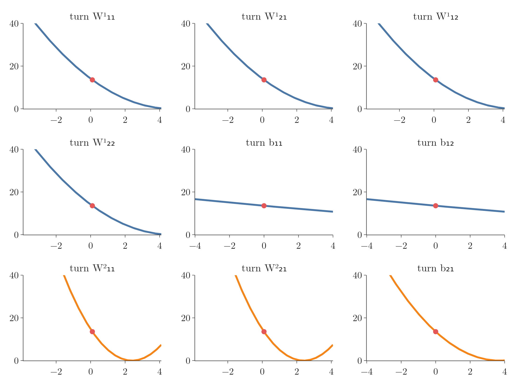
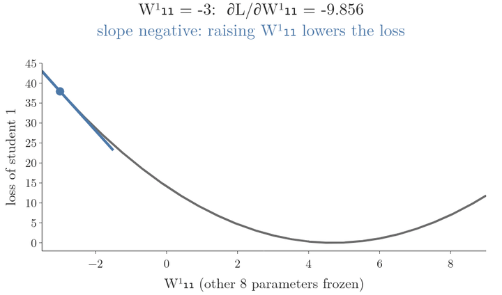
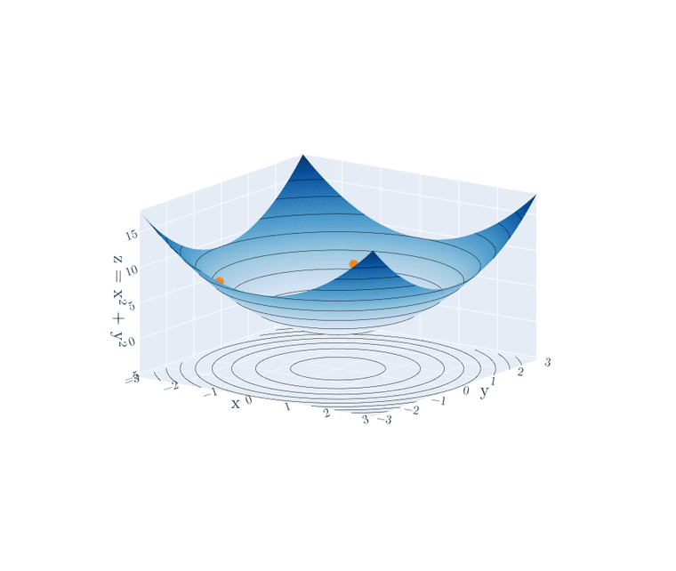
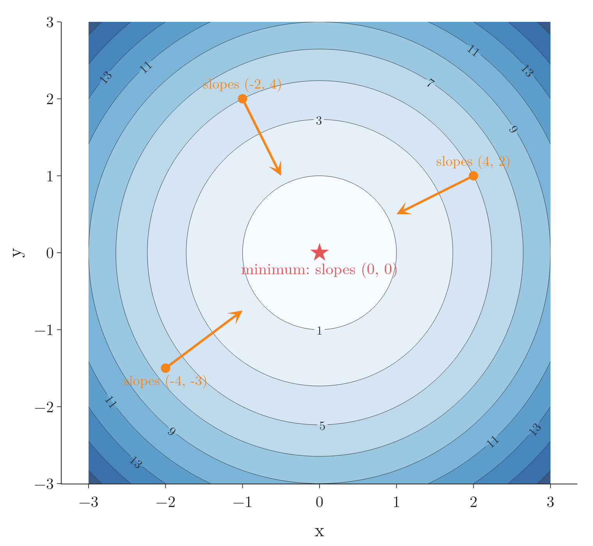
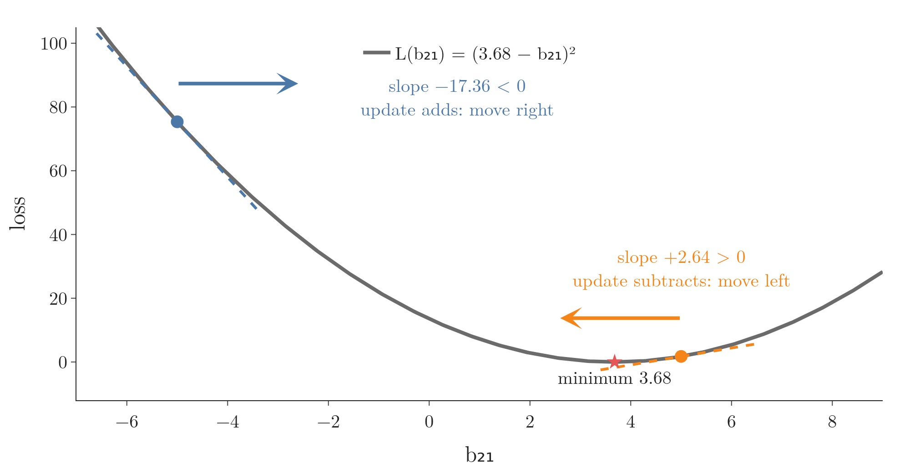
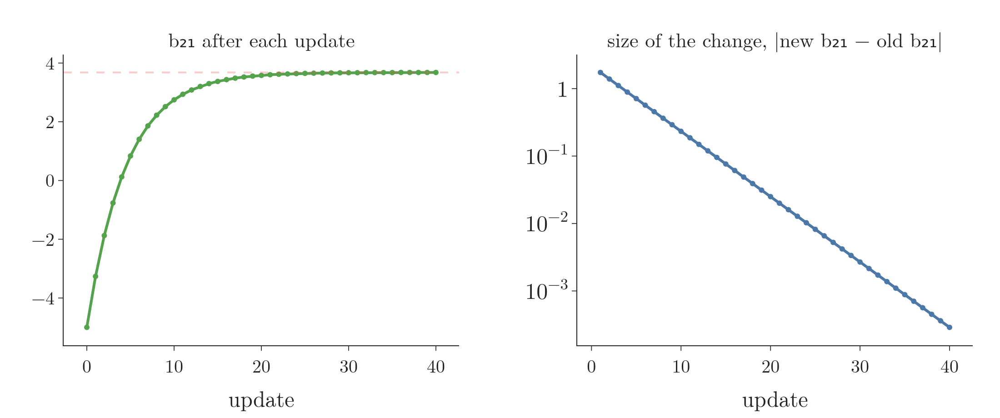
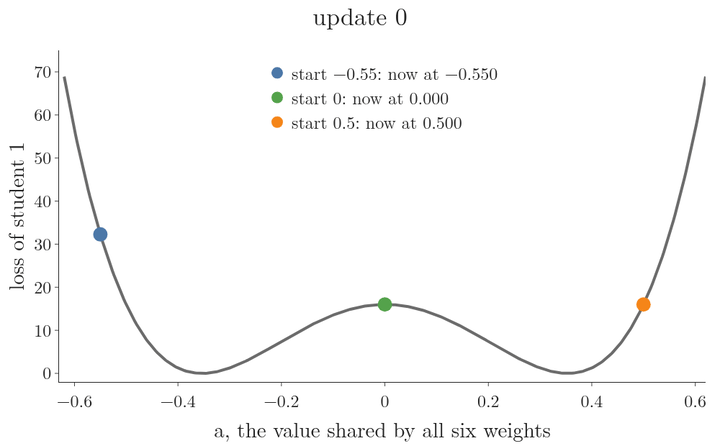

<!-- where-this-fits: generated by course_map/build_map.py; edit concepts.yaml, not this block -->
> **Where this fits:** Pipeline map steps 8 (Model), 10 (Tune). See the [Course map](../../../00-course-map/00-course-map.md).
>
> 
>
> - **Builds on:** [Feature scaling](../../../ML/01-foundations/ML-006-instance-vs-model-based/ML-006-instance-vs-model-based.md#31-how-it-works); [Best-fit line and squared error](../../../ML/06-regression/ML-049-simple-linear-regression/ML-049-simple-linear-regression.md#34-the-best-fit-line); [Sigmoid function](../../../ML/07-classification/ML-071-sigmoid-function/ML-071-sigmoid-function.md#4-the-sigmoid-function); [Derivatives of one variable](../../../MA/06-calculus/MA-061-derivatives-of-one-variable/MA-061-derivatives-of-one-variable.md#1-overview); [Partial derivatives and gradients](../../../MA/06-calculus/MA-062-partial-derivatives-and-gradients/MA-062-partial-derivatives-and-gradients.md#12-the-gradient-on-the-map); [Hessian and multivariate Taylor](../../../MA/06-calculus/MA-064-hessian-and-multivariate-taylor/MA-064-hessian-and-multivariate-taylor.md#5-the-hessian).
> - **Leads to:** [Vanishing gradient](../../../DL/01-basics/DL-018-vanishing-exploding-gradients/DL-018-vanishing-exploding-gradients.md#3-the-vanishing-gradient-problem); [Batch gradient descent](../../../DL/02-training/DL-020-gradient-descent-in-neural-networks/DL-020-gradient-descent-in-neural-networks.md#4-batch-gradient-descent-in-a-network); [Stochastic gradient descent](../../../DL/02-training/DL-020-gradient-descent-in-neural-networks/DL-020-gradient-descent-in-neural-networks.md#5-stochastic-gradient-descent-in-a-network); [Mini-batch gradient descent](../../../DL/02-training/DL-020-gradient-descent-in-neural-networks/DL-020-gradient-descent-in-neural-networks.md#8-the-path-to-the-minimum); [Improving a neural network](../../../DL/02-training/DL-021-improving-a-neural-network/DL-021-improving-a-neural-network.md#1-overview); [Scaling inputs for neural networks](../../../DL/02-training/DL-023-data-scaling-in-ann/DL-023-data-scaling-in-ann.md#1-overview).
> - **Compare with:** [Ordinary least squares (closed form)](../../../ML/06-regression/ML-050-linear-regression-maths/ML-050-linear-regression-maths.md#2-two-ways-to-find-m-and-b); [Normal equation](../../../ML/06-regression/ML-054-multiple-lr-code/ML-054-multiple-lr-code.md#1-overview).
<!-- /where-this-fits -->

## 1. Overview

> **Key point:** The loss of a network is one function of all its weights and biases. Each derivative tells how the loss responds to one parameter, in size and sign. Stepping against it, by a small enough learning rate times its size, walks every parameter downhill until the slope reaches zero.

The [steps of backpropagation](../DL-015-backpropagation-what/DL-015-backpropagation-what.md#4-the-steps-of-backpropagation) and the [backpropagation code](../DL-016-backpropagation-how/DL-016-backpropagation-how.md#4-the-regression-code) showed what backpropagation does and how to code it. All the learning happens in one line, the update

$$W_{\text{new}} = W_{\text{old}} - \eta\thinspace\frac{\partial L}{\partial W}$$

This Note explains why that line works. In plain words, training is like walking downhill in fog: we cannot see the whole valley, but we can feel the slope under our feet, and a small step against the slope goes down (section 8 shows what a too-large step does). The Note reuses ideas from earlier Notes (derivatives, gradients, minima, the learning rate) and applies them to the 2-2-1 regression network.

{height=58%}

How to read Figure 1: the curve is the loss for each value of one parameter, $b_{21}$ (horizontal axis: the value, vertical axis: the loss). Each line of dots is one run of 10 updates from $b_{21} = -5$ on the curve, one run per learning rate. Look at where each run ends: near the bottom of the curve, or bouncing away from it.

## 2. Prerequisites

- The [2-2-1 network and its data](../DL-015-backpropagation-what/DL-015-backpropagation-what.md#3-the-data-and-the-network): the 2-2-1 network, the four students and the 9 derivatives.
- [Gradient descent](../../../ML/06-regression/ML-056-gradient-descent/ML-056-gradient-descent.md#2-the-idea), including its learning rate and stopping rule.
- [Derivatives](../../../MA/06-calculus/MA-061-derivatives-of-one-variable/MA-061-derivatives-of-one-variable.md#4-the-derivative-shrinking-the-step-to-zero) and [partial derivatives and gradients](../../../MA/06-calculus/MA-062-partial-derivatives-and-gradients/MA-062-partial-derivatives-and-gradients.md#3-partial-derivatives).

## 3. The loss is a function of all nine parameters

> **Key point:** Write $\hat{y}$ out in full and the inputs and $y$ become constants: what is left is a function of the 6 weights and 3 biases. Training is turning 9 knobs until the loss is smallest.

For the regression network, $L = (y - \hat{y})^2$. The package $y$ comes from the data, so for a given student it is a constant. Only $\hat{y}$ can vary, and $\hat{y}$ is built from the hidden outputs:

$$\hat{y} = W_{11}^{2} O_{11} + W_{21}^{2} O_{12} + b_{21}$$

Each hidden output is a weighted sum of the two features plus a bias:

$$O_{11} = W_{11}^{1} x_{i1} + W_{21}^{1} x_{i2} + b_{11}$$
$$O_{12} = W_{12}^{1} x_{i1} + W_{22}^{1} x_{i2} + b_{12}$$

Putting these two lines into the formula for $\hat{y}$ writes the whole network as one formula:

$$\hat{y} = W_{11}^{2}\big(W_{11}^{1} x_{i1} + W_{21}^{1} x_{i2} + b_{11}\big)$$
$$\qquad + W_{21}^{2}\big(W_{12}^{1} x_{i1} + W_{22}^{1} x_{i2} + b_{12}\big)$$
$$\qquad + b_{21}$$

In this formula $x_{i1}$ and $x_{i2}$ are the two **features** of student $i$ (input variables, one column of the data table each: CGPA and profile score), so they are constants. Everything else is a parameter:

$$L = L\big(W_{11}^{1}, W_{12}^{1}, W_{21}^{1}, W_{22}^{1},$$
$$\qquad b_{11}, b_{12}, W_{11}^{2}, W_{21}^{2}, b_{21}\big)$$

$y = f(x)$ is a function of one variable; the loss is a function of nine. These nine numbers are the network's **trainable parameters** (G-1065): the values training is allowed to change. Picture the network as a box with 9 knobs, one per trainable parameter: turning any of them changes the loss, and training turns all of them until the loss is as small as possible.

{height=48%}

Figure 2 turns each knob on its own: in each panel the horizontal axis is the value of that one parameter and the vertical axis is student 1's loss. Every curve passes through the same red dot, the starting loss 13.54, but each falls at its own rate. The hidden biases $b_{11}$ and $b_{12}$ barely move it: their slope at the start is only $-0.736$, against $-5.888$ for the first-layer weights and $-11.776$ for the output weights (the [nine gradients](../DL-015-backpropagation-what/DL-015-backpropagation-what.md#71-the-nine-gradients) computed earlier). The knob picture is the idea that [the cost is a function of the parameters](../../../MA/07-optimisation/MA-065-convex-and-non-convex-cost-functions/MA-065-convex-and-non-convex-cost-functions.md#2-the-cost-function-is-a-function-of-the-parameters), here for this network.

## 4. What the gradient is

> **Key point:** One derivative per parameter, each with the others held fixed. For our loss that is 9 partial derivatives; together they are the gradient.

For a function of one variable, such as $y = x^2 + x$, the derivative is $dy/dx = 2x + 1$. For a function of several variables, such as $z = x^2 + y^2$, we take one **partial derivative** per variable, holding the others fixed: $\partial z/\partial x = 2x$ and $\partial z/\partial y = 2y$. The **gradient** collects them all (see [collecting the partial derivatives](../../../MA/06-calculus/MA-062-partial-derivatives-and-gradients/MA-062-partial-derivatives-and-gradients.md#41-collecting-the-partial-derivatives)).

So "computing the gradient of the loss" means computing its 9 partial derivatives, one per knob: exactly the [9 formulas](../DL-015-backpropagation-what/DL-015-backpropagation-what.md#6-the-nine-derivatives) derived earlier. Geometrically, each one is the slope of the loss along one of 9 directions.

With many parameters there is no picture of the whole loss surface, but each number in the gradient still has a plain meaning:

- its **sign** says whether that parameter should go down (positive) or up (negative) to lower the loss;
- its **size** says how strongly the loss reacts to that parameter, compared with the others.

{height=40%}

In Figure 3, read the first frame as a list of instructions. All nine bars are negative, so every parameter should rise. The output weights have the longest bars ($-16.89$) and the hidden biases the shortest ($-1.03$): at this point a small change to an output weight changes the loss about 16 times as much as the same change to a hidden bias. Then watch the bars over the epochs: by epoch 10 they are small and positive, and they are all within $\pm 0.1$ after 1,000 epochs. A gradient near zero means no parameter has a direction left that lowers the loss: training has stopped moving, usually at the bottom of a valley (section 9; section 9.1 shows a flat hilltop, where the slope is also zero).

> **Extra:** A gradient is more than "a fancy word for a derivative". The gradient is the vector of all partial derivatives, and as an arrow it points in the direction in which the loss rises fastest (see [the gradient as an arrow on the contour map](../../../MA/06-calculus/MA-062-partial-derivatives-and-gradients/MA-062-partial-derivatives-and-gradients.md#42-the-gradient-as-an-arrow-on-the-contour-map)). Gradient descent steps along the opposite arrow, which is where its name comes from.

## 5. What a derivative tells us

> **Key point:** A derivative is a rate of change. Its size says how strongly the loss reacts, and its sign says in which direction.

A derivative is a **rate of change**: $dy/dx = 2$ means that increasing $x$ by a small amount increases $y$ by twice that amount; $dy/dx = -2$ means $y$ decreases by twice that amount. Both the size and the sign carry information (see [what the sign of the derivative tells us](../../../MA/06-calculus/MA-061-derivatives-of-one-variable/MA-061-derivatives-of-one-variable.md#43-what-the-sign-of-the-derivative-tells-us)).

A derivative at a point is the slope there. For $y = x^2 + x$, $dy/dx = 2x + 1$; at $x = 5$ it is 11, so near $x = 5$ the function rises 11 times as fast as $x$.

For the network, $\partial L/\partial W_{11}^{1}$ says how the loss responds to a small change in $W_{11}^{1}$. For student 1 at the start it is $-5.888$: raising $W_{11}^{1}$ by 0.001 lowers the loss by about 0.006.

{height=40%}

Figure 4 slides the tangent along the loss curve of $W_{11}^{1}$. Watch the slope's sign: negative (blue) left of the bottom, zero at $W_{11}^{1} = 4.7$, positive (orange) to the right; and its size: steep far from the bottom, flat near it.

## 6. Minimum by setting the derivatives to zero

> **Key point:** At a minimum every slope is zero. For $z = x^2 + y^2$ we can solve that by hand; for a network's loss we cannot, so we walk downhill instead.

At the lowest point of a smooth curve the slope is zero. For $y = x^2$, $dy/dx = 2x = 0$ gives $x = 0$. With two variables, $z = x^2 + y^2$, both partial derivatives must be zero: $2x = 0$ and $2y = 0$, so the minimum is at $(0, 0)$ (Figures 5 and 6).

The function $z = x^2 + y^2$ gives one height for every pair $(x, y)$:

$$z(2, 1) = 2^2 + 1^2 = 5$$
$$z(0, 0) = 0^2 + 0^2 = 0$$

{height=45%}

Figure 5 shows the surface: a bowl whose lowest point is at $(0, 0)$ and whose walls get steeper away from the centre. The [contour map](../../../MA/06-calculus/MA-062-partial-derivatives-and-gradients/MA-062-partial-derivatives-and-gradients.md#11-reading-a-contour-map) in Figure 6 is this bowl seen from above: each ring joins points at the same height. Rings close together mean a steep wall, and the centre ring is the lowest point.

{height=40%}

In Figure 6, every arrow, minus the pair of slopes, points towards the centre; at the centre both slopes are zero and there is nowhere lower to go.

For our network the same idea says: set all 9 partial derivatives to zero and solve. But those 9 equations are tangled together through products such as $W_{11}^{2} W_{11}^{1}$, and for any real network there are thousands of them, with no formula for the solution: networks are trained with iterative, gradient-based methods instead (Goodfellow et al. 2016, §6.2). So instead of solving, we start somewhere and walk downhill with gradient descent, as [gradient descent](../../../ML/06-regression/ML-056-gradient-descent/ML-056-gradient-descent.md#2-the-idea) does for linear regression.

## 7. Why we subtract the derivative

> **Key point:** A positive slope means the loss rises as the parameter rises, so we lower the parameter; a negative slope means the opposite. The minus sign handles both cases in one rule.

### 7.1 One parameter at a time

> **Key point:** Freeze the other 8 parameters: for student 1 the loss in $b_{21}$ alone is the parabola $(3.68 - b_{21})^2$, lowest at $b_{21} = 3.68$.

To see the update in action, freeze 8 of the 9 parameters at their starting values (weights 0.1, other biases 0) and keep only $b_{21}$ free. For student 1 the forward pass gives $0.32 + b_{21}$, so

$$L(b_{21}) = \big(4 - (0.32 + b_{21})\big)^2 = (3.68 - b_{21})^2$$

The loss $L(b_{21})$ is a parabola with its lowest point at $b_{21} = 3.68$ (Figure 1). Its slope is

$$\frac{\partial L}{\partial b_{21}} = -2(3.68 - b_{21})$$

### 7.2 The sign decides the direction

> **Key point:** At $b_{21} = -5$ the slope is $-17.36$, so the update adds to $b_{21}$; at $b_{21} = 5$ it is $+2.64$, so the update subtracts.

The algorithm cannot see the curve; it only knows the slope where it stands. Two cases:

- **Slope positive** (at $b_{21} = 5$, the slope is $+2.64$): raising $b_{21}$ raises the loss. We must lower $b_{21}$, and $b_{21} - \eta \times 2.64$ does.
- **Slope negative** (at $b_{21} = -5$, the slope is $-17.36$): raising $b_{21}$ lowers the loss. We must raise $b_{21}$, and subtracting a negative number adds: $b_{21} - \eta \times (-17.36)$ equals $b_{21} + 17.36\thinspace\eta$.

{height=32%}

The update rule needs a slope to work with. A loss that moves only in jumps, such as a count of mistakes, is flat almost everywhere and gives no direction (see [counting the mistakes](../DL-006-perceptron-loss/DL-006-perceptron-loss.md#51-count-the-mistakes)). Smooth activations and smooth losses are used so that every small change of a parameter changes the loss a little.

The minus sign does the right thing in both cases (Figure 7): we always move against the slope, in the direction of the **negative gradient** (the **gradient**, G-863, with its sign flipped). The step is also proportional to the slope's size: big where the curve is steep and far from the minimum, small near the bottom where it flattens.

## 8. Why we need a learning rate

> **Key point:** Without a learning rate ($\eta = 1$), $b_{21}$ jumps between $-5$ and 12.36 forever. $\eta = 0.1$ settles in; $\eta = 0.01$ crawls; $\eta = 1.1$ blows up.

Starting from $b_{21} = -5$, where the slope is $-17.36$:

1. **In words:** the new value is the old value minus the learning rate times the slope.
2. **Formula:** $b_{21} \leftarrow b_{21} - \eta\thinspace\partial L/\partial b_{21}$.
3. **Example:** with $\eta = 1$, the first step is
   $$b_{21} = -5 - (-17.36)$$
   $$b_{21} = 12.36$$
   There the slope is
   $$-2(3.68 - 12.36) = 17.36$$
   so the next value is
   $$12.36 - 17.36 = -5$$
   back at the start. With $\eta = 0.1$ the first step is
   $$b_{21} = -5 + 0.1 \times 17.36$$
   $$b_{21} = -3.264$$
   a smaller and safer step.

Figure 1 runs 10 updates with four learning rates:

- $\eta = 0.01$: $-5,\ -4.83,\ -4.66,\ -4.49, \dots$, and $-3.41$ after 10 steps. Tiny steps: slow.
- $\eta = 0.1$: $-5,\ -3.26,\ -1.88,\ -0.76, \dots$, and 2.75 after 10 steps. The steps shrink as the slope flattens, and $b_{21}$ converges to 3.68.
- $\eta = 1$: $-5,\ 12.36,\ -5,\ 12.36, \dots$ The value zigzags across the bowl forever.
- $\eta = 1.1$: $-5,\ 14.10,\ -8.82,\ 18.68, \dots$, and $-50.06$ after 10 steps. Each jump overshoots more: the updates diverge.

Multiplying the slope by a small factor such as 0.1 or 0.01 turns the zigzag into small steps. As we near the minimum the slope shrinks, so the steps shrink with it. Too small a learning rate wastes time; too large overshoots and can run away. The learning rate (G-1068) is a **hyperparameter** (G-910), a setting we choose rather than learn, to tune (see [the learning rate](../../../ML/06-regression/ML-056-gradient-descent/ML-056-gradient-descent.md#5-the-learning-rate)).

> **Extra:** On this parabola the update is $b_{21} - 3.68 \leftarrow (1 - 2\eta)(b_{21} - 3.68)$: each step multiplies the distance to the minimum by $1 - 2\eta$. The factor is 0.8 for $\eta = 0.1$ (shrinks), $-1$ for $\eta = 1$ (same size, flipped side), and $-1.2$ for $\eta = 1.1$ (grows). Any $\eta$ above 1 diverges here; how large a rate is safe depends on how steep the loss is.

In the real network all 9 parameters move at once, each against its own slope. The loss surface has 9 dimensions instead of one, but the reasoning is the same along every direction.

Two parameters give a loss surface, not a curve. Its height is the mean loss (over the four students) for each pair $(W_{21}^{1}, b_{21})$, shown on a log scale ($\log_{10}$ of the loss, so that the long valley is visible). At the start $(0.1, 0)$:

$$\text{mean loss} = 28.0$$
$$\log_{10} 28.0 = 1.45$$

{height=45%}

Figure 8 shows the surface: a valley that is steep across and almost flat along its floor. The contour map on the left of Figure 9 is this surface seen from above (see Figure 5 for how to read it): each line joins points at the same height, lines close together mean a steep slope, and the star is the lowest point.

{height=50%}

Figure 9 shows two parameters moving together, each against its own slope. Watch the first step: the ball drops straight into the long valley (mean loss 28.0 to 1.8) and the predictions jump up to the real packages. After that the slope along the valley is gentle, so the steps are small and the ball slides slowly towards the star: the mean loss is 0.25 after 100 steps and settles at 0.045 near step 1,000.

## 9. When to stop: convergence

> **Key point:** At the minimum the slope is zero, so $W_{\text{new}} = W_{\text{old}}$: updates stop changing anything. In practice we run a fixed number of epochs.

The algorithm has **converged** (**convergence**, G-469) when the updates stop changing the parameters: $W_{\text{new}} \approx W_{\text{old}}$. Convergence happens when $\eta\thinspace\partial L/\partial W \approx 0$, that is, when the slope is close to zero: usually we are at a minimum (section 9.1 shows the exception, a flat hilltop).

{height=30%}

Figure 10 shows convergence on $L(b_{21})$. On the right panel's log scale each gridline down is ten times smaller than the one above (1, 0.1, 0.01, 0.001). Each change is 0.8 times the one before, so on this scale the changes fall on a straight line, from 1.7 at the first update to 0.0003 at the 40th, while $b_{21}$ flattens onto 3.68.

So the "right" loop is "repeat until convergence". In practice we write a loop over a fixed number of epochs, such as 100 or 1,000, chosen large enough for the loss to settle (the [stopping rules](../../../ML/06-regression/ML-056-gradient-descent/ML-056-gradient-descent.md#23-when-to-stop) of gradient descent).

### 9.1 Where we end depends on where we start

> **Key point:** A network's loss can have more than one valley. Gradient descent rolls into the valley on whose side it starts, and it cannot move at all from a point where the slope is exactly zero.

The parabola of section 7 has one valley. A network's loss can have several. To see this on our network, tie all six weights to one shared value $a$ and keep the biases at 0. For student 1 each hidden node outputs $8a + 8a = 16a$, so the prediction is

$$\hat{y} = a \times 16a + a \times 16a$$
$$\hat{y} = 32a^2$$

and the loss is

$$L(a) = (4 - 32a^2)^2$$

The loss $L(a)$ is 0 where $32a^2 = 4$, at $a = -0.354$ and at $a = +0.354$: two valleys, with a hilltop at $a = 0$ between them.

{height=40%}

In Figure 11, the same rule gives three different results:

- The ball that starts at $-0.55$ rolls into the left valley and stops at $-0.354$.
- The ball that starts at 0.5 rolls into the right valley and stops at $+0.354$.
- The ball that starts at exactly 0 never moves. The slope on the hilltop is zero, so the update changes nothing.

So a slope of zero means "no direction is downhill from here", which is true at the bottom of any valley and also on a flat hilltop. Here the two valleys are equally deep. In general they are not, and gradient descent can settle in a **local minimum** (G-1110), a valley that is not the deepest one (see [what goes wrong with a non-convex loss](../../../MA/07-optimisation/MA-065-convex-and-non-convex-cost-functions/MA-065-convex-and-non-convex-cost-functions.md#4-what-goes-wrong-with-a-non-convex-loss)). The starting values of the weights decide which valley is reached, which is one reason why the starting values of the weights matter.

## 10. Summary

| Question | Answer |
|---|---|
| What is the loss a function of? | All weights and biases; data and $y$ are constants |
| What is the gradient? | The partial derivatives of the loss, one per parameter (9 here) |
| What does each derivative say? | How the loss changes with that parameter: size and sign |
| Why subtract it? | To move against the slope, downhill, whichever its sign |
| Why a learning rate? | To take small steps: $\eta = 1$ zigzags, $\eta = 1.1$ diverges, $\eta = 0.1$ converges |
| When to stop? | When updates no longer change the parameters; in practice after a fixed number of epochs |

- Writing $\hat{y}$ out shows $L$ as one function of the 9 parameters, so training is a search over those 9 numbers for the lowest loss.
- We cannot solve "all derivatives = 0" for a network, so we walk downhill.
- The minus sign moves each parameter the right way; the slope's size makes steps shrink near the minimum.
- On $L(b_{21}) = (3.68 - b_{21})^2$ each update multiplies the distance to the minimum by $1 - 2\eta$, which is why $\eta = 0.1$ converges, $\eta = 1$ zigzags and $\eta = 1.1$ diverges.
- Each gradient component's sign says which way to move that parameter, and its size says how much that parameter matters right now.
- A loss can have several valleys; where gradient descent ends depends on where it starts.

So the update line works because it steps every parameter against its own slope, by a step small enough not to overshoot.

## 11. Sources

**Built from**

- CampusX, "Backpropagation Part 3 | The Why | Complete Deep Learning Playlist", YouTube, https://www.youtube.com/watch?v=6xO-x8y0YSY
- 3Blue1Brown, "Gradient descent, how neural networks learn | Deep Learning Chapter 2", YouTube, https://www.youtube.com/watch?v=IHZwWFHWa-w (the gradient read as the importance of each parameter, section 4; the ball rolling downhill and the several valleys, sections 8 and 9.1)

**Other references**

- Goodfellow, Bengio and Courville, *Deep Learning*, MIT Press, 2016, §6.2 (non-convex losses; iterative gradient-based training).

## 12. Key terms

| Term | Meaning |
|---|---|
| Rate of change | How much one quantity changes per unit change of another; the meaning of a derivative |
| Negative gradient | The gradient with its sign flipped: the direction in which the loss falls fastest |
| Divergence (G-628) | Updates that overshoot more and more, so the parameter and the loss run away |
| Convergence (G-469) | The state where updates no longer change the parameters because the slope is about zero |
| Local minimum | A valley of the loss that is lower than everything near it, but not the lowest overall |
