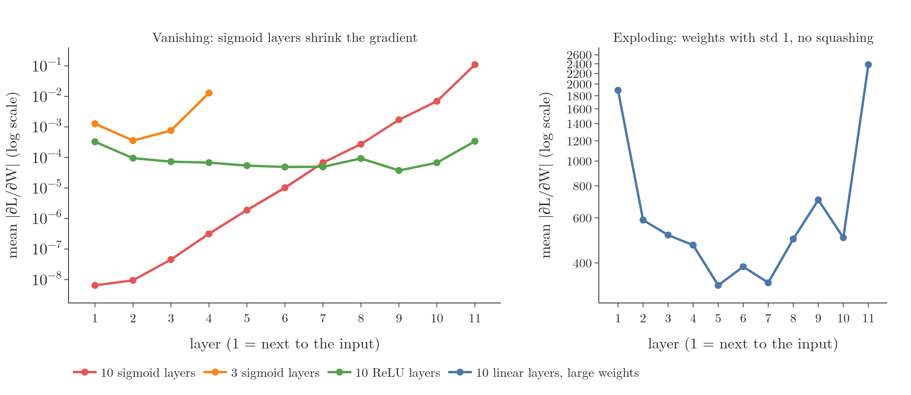
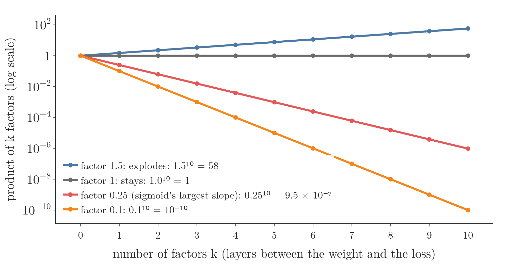
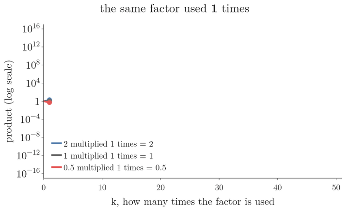
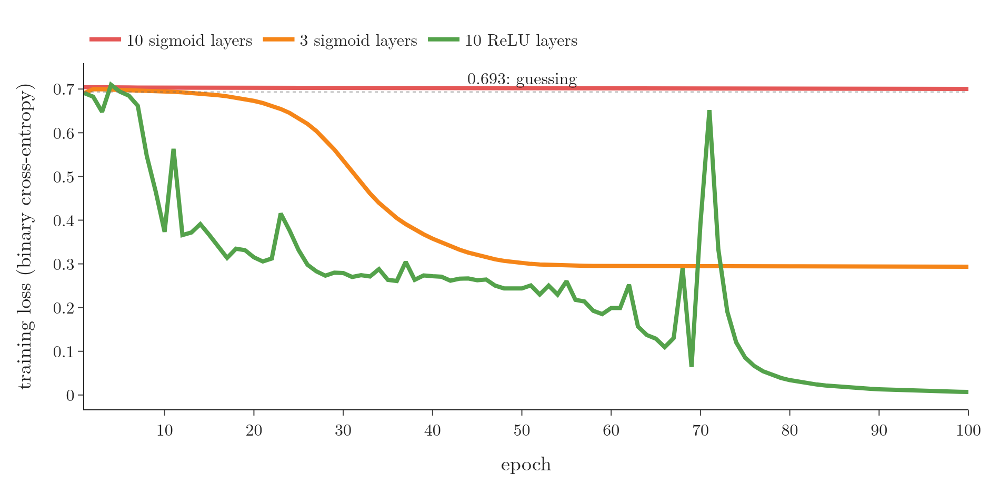
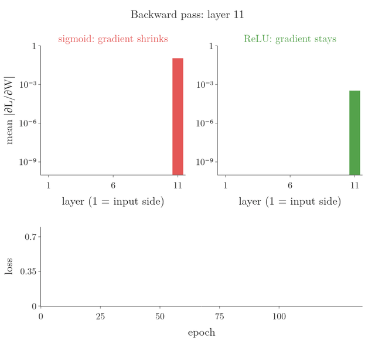
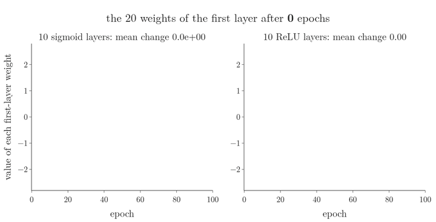
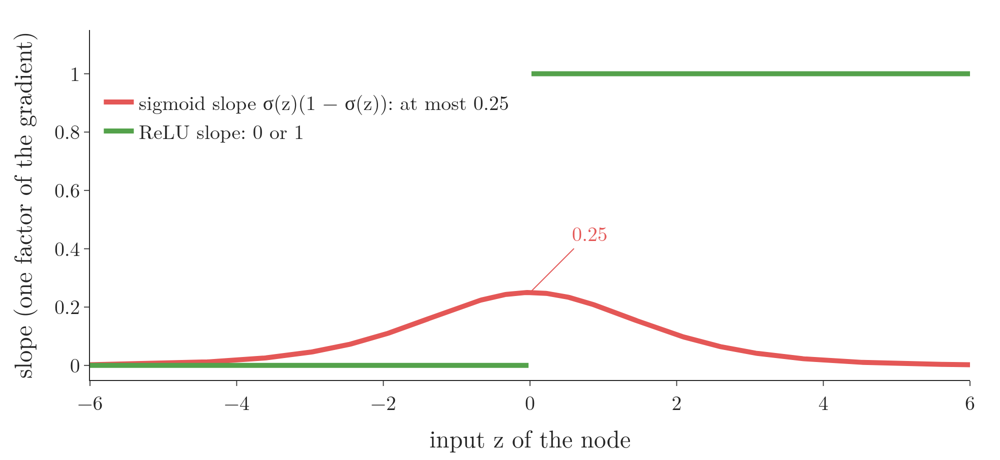
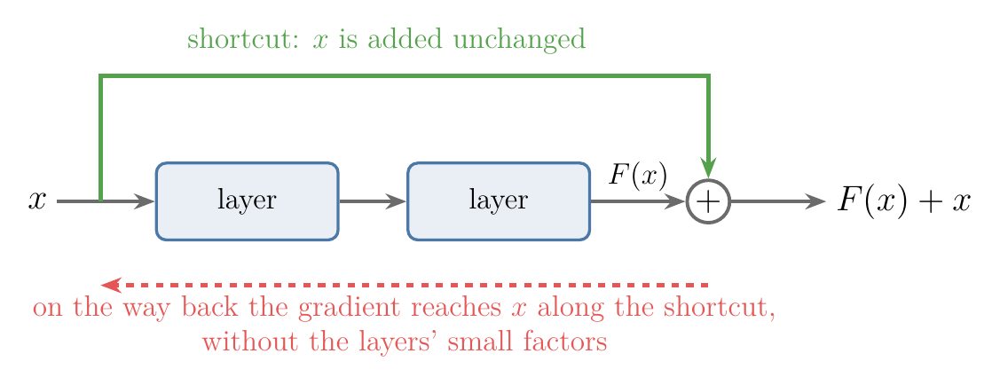
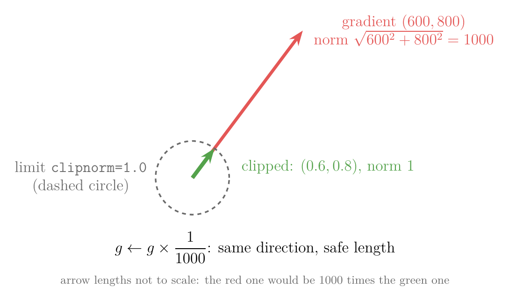

<!-- where-this-fits: generated by course_map/build_map.py; edit concepts.yaml, not this block -->
> **Where this fits:** Pipeline map step 8 (Model). See the [Course map](../../../00-course-map/00-course-map.md).
>
> 
>
> - **Builds on:** [Training curves (History)](../../../DL/01-basics/DL-011-customer-churn-ann/DL-011-customer-churn-ann.md#8-training-curves); [Backpropagation](../../../DL/01-basics/DL-015-backpropagation-what/DL-015-backpropagation-what.md#4-the-steps-of-backpropagation); [Activation functions](../../../DL/02-training/DL-027-activation-functions/DL-027-activation-functions.md#3-what-an-activation-function-is).
> - **Leads to:** [Backpropagation](../../../DL/01-basics/DL-019-mlp-memoization/DL-019-mlp-memoization.md#52-backpropagation-stores-one-number-per-node); [Improving a neural network](../../../DL/02-training/DL-021-improving-a-neural-network/DL-021-improving-a-neural-network.md#1-overview); [Dying ReLU problem](../../../DL/02-training/DL-028-relu-variants/DL-028-relu-variants.md#3-the-dying-relu-problem); [Weight initialisation](../../../DL/02-training/DL-029-weight-initialization/DL-029-weight-initialization.md#1-overview); [Skip connections](../../../DL/04-cnn/DL-054-keras-functional-api/DL-054-keras-functional-api.md#43-a-skip-connection); [Recurrent neural network (RNN)](../../../DL/05-rnn/DL-055-why-rnn/DL-055-why-rnn.md#1-overview).
> - **Compare with:** [Tanh](../../../DL/02-training/DL-027-activation-functions/DL-027-activation-functions.md#7-tanh); [Leaky ReLU, PReLU, ELU and SELU](../../../DL/02-training/DL-028-relu-variants/DL-028-relu-variants.md#51-leaky-relu).
<!-- /where-this-fits -->

## 1. Overview

> **Key point:** Backpropagation multiplies many factors together to get the gradient of an early layer. If they are mostly below 1 (as with sigmoid), the gradient vanishes and the early layers stop learning; if they are mostly above 1, it explodes and training breaks.

In backpropagation every weight receives an update proportional to the derivative of the loss with respect to it. In a deep network, the derivative for a weight near the input is a long product, with one factor per layer between it and the loss. Two things can go wrong:

- **Vanishing gradient problem** (**vanishing gradient**, G-2070): the factors are small, the product is vanishingly small, and the weight hardly changes. In the worst case the network stops training. (A **gradient** is the list of slopes of the loss, one for each weight; a large one means a large update.)
- **Exploding gradient problem** (**exploding gradient**, G-731): the factors are large, the product is huge, and the updates throw the weights around at random.

{height=38%}

Figure 1 shows both on real networks. This Note explains:

- why gradients vanish (section 3) or explode (section 7);
- how to spot a vanishing gradient in Keras (sections 4 and 5);
- five ways to fix it (section 6).

## 2. Prerequisites

- [The steps of backpropagation](../DL-015-backpropagation-what/DL-015-backpropagation-what.md#4-the-steps-of-backpropagation) and [backpropagation in code](../DL-016-backpropagation-how/DL-016-backpropagation-how.md#3-the-regression-algorithm-in-loops): gradients as chain-rule products (the chain rule multiplies the slopes of the steps between a weight and the loss).
- [The derivative of the sigmoid](../../../ML/07-classification/ML-073-sigmoid-derivative/ML-073-sigmoid-derivative.md#4-the-shape-of-the-derivative): the sigmoid slope is never above 0.25.

  $$\sigma'(z) = \sigma(z)(1 - \sigma(z)) \le 0.25$$

## 3. The vanishing gradient problem

> **Key point:** Three facts: a product of many numbers below 1 is tiny; it only happens in deep networks; and it comes from activations such as sigmoid and tanh whose slopes are small.

### 3.1 Multiplying small numbers

> **Key point:** $0.1^{10} = 10^{-10}$ and $0.25^{10} \approx 10^{-6}$: the more factors below 1, the smaller the product.

The whole problem rests on one fact of arithmetic. Multiply numbers that are all below 1, and the product is smaller than any of them; the more factors, the smaller it gets. Ten factors of 0.1 give $0.1^{10} = 10^{-10}$ (Figure 2).

{height=32%}

On the log scale of Figure 2 (equal distances up stand for equal multiplications: each labelled tick is 100 times the one below it) each product is a straight line. Watch where the lines end after 10 factors. Below 1, every factor cuts the product by the same ratio, so it ends at $9.5 \times 10^{-7}$ for 0.25 and $10^{-10}$ for 0.1. Above 1, every factor raises it, to 58 for 1.5.
 Think of a message passed back along a line of ten people, each repeating it at a quarter of the volume they heard: the person at the far end hears almost nothing.

The same arithmetic can be seen with a single factor used again and again (Figure 3).

{height=32%}

In Figure 3, watch the three lines leave 1. A factor of 2 gives 16 after 4 uses and $1.1 \times 10^{15}$ after 50. A factor of 0.5 gives $8.9 \times 10^{-16}$ after 50. A factor of exactly 1 stays at 1. So vanishing and exploding gradients are one mechanism: a long product whose factors sit on one side of 1. [The problems with RNNs](../../05-rnn/DL-060-problems-with-rnn/DL-060-problems-with-rnn.md#4-why-the-vanishing-gradient-through-time) meet exactly this case, because a recurrent network reuses the same weight at every time step.

Two more conditions make this a problem in practice:

- **Depth:** the problem only appears in **deep neural networks** (G-570), with many hidden layers, because only they have long chains of factors.
- **Activation:** the problem appears with **sigmoid** or **tanh**. Both squash a huge input range into a small output range (0 to 1, or $-1$ to 1), so their slopes are small.

### 3.2 Where the small factors come from

> **Key point:** Every sigmoid between a weight and the loss contributes its derivative, at most 0.25, to that weight's gradient.

In the classification network of [backpropagation in code](../DL-016-backpropagation-how/DL-016-backpropagation-how.md#7-the-classification-derivatives), the gradient of a first-layer weight was

$$\frac{\partial L}{\partial W_{11}^{1}} = -(y - \hat{y}) \cdot W_{11}^{2} \cdot O_{11}(1 - O_{11}) \cdot x_{i1}$$

The factor $O_{11}(1 - O_{11})$ is the slope of the hidden node's sigmoid. The slope is never more than 0.25, and close to 0 when the node is saturated near 0 or 1 (see [the shape of the derivative](../../../ML/07-classification/ML-073-sigmoid-derivative/ML-073-sigmoid-derivative.md#4-the-shape-of-the-derivative)). Each extra sigmoid layer between the weight and the loss adds one more such factor, together with a weight.

1. **In words:** for a weight $k$ sigmoid layers away from the output, the gradient carries $k$ sigmoid slopes, each at most 0.25.
2. **Formula:** with weights near 1, roughly
   $$\left|\frac{\partial L}{\partial W}\right| \lesssim |\text{output error}| \times 0.25^{k} \times |\text{input}|$$
   Here $\lesssim$ reads "is at most about", the "output error" is the slope of the loss that the output layer receives, and the "input" is the value that enters the weight $W$.
3. **Example:** with $k = 10$ layers:

   $$0.25^{10} = 9.5 \times 10^{-7}$$

   The gradient is at most about a millionth of what the output layer sees.

### 3.3 What a tiny gradient does to the update

> **Key point:** A weight of 1 with learning rate 0.01 and gradient 0.0001 becomes 0.999999: no real change, so no learning.

The update is $W_{\text{new}} = W_{\text{old}} - \eta\thinspace\partial L/\partial W$:

$$W_{\text{new}} = 1 - 0.01 \times 0.0001 = 0.999999$$

The weight has effectively not changed. If the early weights do not change, the loss does not fall either: it stays where it was at the start. The early layers, which are supposed to learn the basic patterns, learn nothing, and backpropagation cannot converge.

Hochreiter (1991) and Bengio et al. (1994) identified vanishing gradients as a main obstacle to training deep and recurrent networks, at a time when almost every network used sigmoid or tanh (see [the second AI winter](../DL-003-nn-types-history-applications/DL-003-nn-types-history-applications.md#34-the-second-ai-winter)).

## 4. Seeing it in Keras

> **Key point:** A network with 10 sigmoid hidden layers on the moons data: first-layer gradients around $10^{-8}$, weights unchanged after an epoch, and a loss stuck at 0.70 for 100 epochs.

### 4.1 The experiment

> **Key point:** 250 points of `make_moons`, 10 hidden layers of 10 sigmoid nodes, plain SGD with learning rate 0.5.

The data is `make_moons` from scikit-learn: 250 points in two interleaved half-moons. Each point is one **observation** (one record, one row of the data table), with two **features** (input variables, its coordinates) and a **target** (the output we predict), its class 0 or 1. The points are split 200 for training and 50 for testing. The network has 10 hidden layers of 10 sigmoid nodes and one sigmoid output node, trained with binary cross-entropy.

> **Python:** A deep sigmoid network.
>
> ```python
> import keras
> from sklearn.datasets import make_moons
>
> X, y = make_moons(n_samples=250, noise=0.05, random_state=42)
>
> model = keras.Sequential(
>     [keras.Input(shape=(2,))]
>     + [keras.layers.Dense(10, activation="sigmoid")
>        for _ in range(10)]                       # 10 hidden layers
>     + [keras.layers.Dense(1, activation="sigmoid")])
> model.compile(optimizer=keras.optimizers.SGD(learning_rate=0.5),
>               loss="binary_crossentropy", metrics=["accuracy"])
> ```
>
> The list comprehension `[... for _ in range(10)]` builds 10 identical layers; `+` joins the lists. Plain SGD makes every update exactly the learning rate times the gradient, so the gradient's size shows directly in the weights.

### 4.2 The gradient of each layer

> **Key point:** The last layer's gradients average 0.11; the first layer's average $6 \times 10^{-9}$: a factor of 17 million.

`tf.GradientTape` gives the exact gradient of the loss with respect to every weight. Averaging the size of the gradients in each layer (Figure 1, red):

| Layer | 1 (input side) | 3 | 5 | 7 | 9 | 11 (output) |
|---|---|---|---|---|---|---|
| Mean $\lvert\partial L/\partial W\rvert$ | $6.4 \times 10^{-9}$ | $5 \times 10^{-8}$ | $1.9 \times 10^{-6}$ | $6.8 \times 10^{-5}$ | $1.7 \times 10^{-3}$ | 0.11 |

From the output back to the input, each layer in the middle of the network divides the gradient by about 4 to 7, as the sigmoid's slope (at most 0.25) predicts. On a log scale the red line is almost straight: shrinking by a constant factor per layer.

### 4.3 The weights do not move, the loss does not fall

> **Key point:** After one epoch, no first-layer weight changed by more than $4 \times 10^{-8}$; after 100 epochs the loss is 0.700 and the test accuracy 46%.

We store the 20 weights of the first layer (2 inputs × 10 nodes), train for one epoch, and read them again. They agree to six decimals: the largest change among the 20 is $3.7 \times 10^{-8}$.

Over 100 epochs (Figure 4, red) the training loss goes from 0.704 to 0.700, next to 0.693, the loss of guessing 0.5 for every point. The test accuracy is 46%, no better than guessing. The first-layer weights moved by $3 \times 10^{-7}$ on average in all that time.

{height=36%}

> **Extra:** One way to read a gradient off the weights is $(W_{\text{old}} - W_{\text{new}})/\eta$. The formula only works for plain SGD and a single update. Keras' default optimizer is Adam, whose steps are scaled per weight and are not proportional to the gradient; Adam's step is about the learning rate whatever the gradient's size (Kingma and Ba 2015, §2.1), so even tiny gradients produce visible weight changes, which hides the problem in the weights (but not in the loss). `tf.GradientTape` gives the true gradient with any optimizer.

## 5. How to recognise it

> **Key point:** The loss stays flat from epoch to epoch, and the weights of the early layers stay the same.

Two signs:

1. **The loss does not change.** Keras prints the loss after every epoch. If it stays at its starting value, as in Figure 4, the gradients may be vanishing.
2. **The weights do not change.** Plot a weight such as $W_{11}^{1}$ against the epoch. A flat line means it is not being updated. Tools such as TensorBoard draw these plots automatically during training.

Figure 5 shows both signs at once. Watch the red bars: in the backward pass each sigmoid layer cuts the gradient again, and during training the first layer's bar stays near $10^{-9}$ while the red loss stays flat at 0.70.

{width=100% height=58%}

{height=50%}

Figure 6 is the second sign on its own. On the left every line is flat: after 100 epochs the 20 weights have moved by $3 \times 10^{-7}$ on average, so the first layer is still at its random starting values. On the right the lines of the ReLU network spread out, by 0.62 on average: that layer is learning.

In Figure 5, the ReLU gradients are about the same size in every layer throughout. They grow while the network learns and shrink after epoch 75 because the loss is then close to 0: every gradient carries the output error $(y - \hat{y})$ as a factor (section 3.2), and that error is almost 0 once the network fits the data.

## 6. Five ways to fix it

> **Key point:** Fewer layers; ReLU instead of sigmoid; better starting weights; batch normalisation; residual connections. The first two are shown here; the others have their own Notes later.

### 6.1 Reduce the depth

> **Key point:** With 3 hidden layers instead of 10, the first-layer gradients are only 10 times smaller than the last, and the network learns: loss 0.29, test accuracy 92%.

Fewer layers mean fewer factors in each product. The same experiment with 3 sigmoid hidden layers (Figure 1 and Figure 4, orange):

- the first layer's gradients average $1.3 \times 10^{-3}$, only 10 times smaller than the output layer's;
- the loss falls from 0.691 to 0.293 in 100 epochs, and the test accuracy is 92%;
- the first-layer weights moved by 0.59 on average.

Reducing depth works, but it is rarely the answer. We make networks deep to capture complex patterns; a shallow network may not be able to represent them. Reducing depth is reasonable only when the data is not very complex.

### 6.2 Use ReLU

> **Key point:** ReLU outputs $\max(0, z)$; its slope is 0 or 1, never a fraction, so it does not shrink the gradient. With 10 ReLU layers the loss reaches 0.007 and the test accuracy 100%.

**ReLU** (rectified linear unit, G-1668) is the activation $\text{ReLU}(z) = \max(0, z)$: 0 for negative inputs, the input itself for positive ones. ReLU squashes only the negative side; positive values pass through unchanged.

The slope of ReLU is 0 for $z < 0$ and 1 for $z > 0$. A product of 1s stays 1, so the factors on the way back no longer shrink the gradient.

{height=28%}

Figure 7 puts the two slopes side by side. Each slope is one factor of the gradient for every layer it sits in: the red curve can only shrink the product, the green line at 1 passes it on unchanged.
 Keeping 10 hidden layers but switching them to ReLU (the output stays sigmoid for binary cross-entropy):

- the gradients are about the same size in every layer, between $4 \times 10^{-5}$ and $3 \times 10^{-4}$ (Figure 1, green);
- the loss falls from 0.691 to 0.007 in 100 epochs, and the test accuracy is 100% (Figure 4, green);
- the first-layer weights moved by 0.62 on average.

The spikes in the green curve come from the large learning rate of 0.5, chosen so that plain SGD moves at all in the sigmoid networks. Retrained with smaller rates, the ReLU network has fewer spikes: 3 at 0.1 and none at 0.05 (Notebook).

> **Python:** The only change is the activation.
>
> ```python
> keras.layers.Dense(10, activation="relu")
> ```

ReLU has its own weakness, the **dying ReLU** (G-650): a node whose input stays negative has slope 0, so its weights get no updates and it stays dead. Variants such as **Leaky ReLU** keep a small slope for negative inputs. Both are taught later: [the dying ReLU problem](../../02-training/DL-028-relu-variants/DL-028-relu-variants.md#3-the-dying-relu-problem) and [Leaky ReLU](../../02-training/DL-028-relu-variants/DL-028-relu-variants.md#51-leaky-relu).

### 6.3 Initialise the weights properly

> **Key point:** Starting weights scaled to the size of each layer (Glorot/Xavier, He) keep the backward signal from shrinking or growing.

Random starting weights that are too small make every factor small. Initialisation schemes such as **Glorot (Xavier)** and **He** choose the spread of the random weights from the number of nodes, so that signals keep roughly the same size from layer to layer (Glorot and Bengio 2010; He et al. 2015). They are taught later, in [Xavier (Glorot) initialisation](../../02-training/DL-030-xavier-he-initialization/DL-030-xavier-he-initialization.md#4-xavier-glorot-initialisation) and [He initialisation](../../02-training/DL-030-xavier-he-initialization/DL-030-xavier-he-initialization.md#5-he-initialisation).

### 6.4 Batch normalisation

> **Key point:** A layer that re-scales the values flowing between layers, keeping them in the range where the slopes are large.

**Batch normalisation** (G-266) is a type of layer placed between layers of a network. The layer re-centres and re-scales its inputs during training, which keeps the activations away from the flat ends of sigmoid and tanh (Ioffe and Szegedy 2015). Batch normalisation is taught later, in [how batch normalisation works during training](../../02-training/DL-031-batch-normalization/DL-031-batch-normalization.md#4-how-batch-normalisation-works-during-training).

### 6.5 Residual networks

> **Key point:** Shortcut connections let the gradient skip over layers.

A **residual block** adds a layer's input directly to its output, so the gradient has a path that bypasses the layer's small factors (He et al. 2016). Networks built from such blocks, the **ResNet** family, come later with convolutional networks: [a skip connection](../../04-cnn/DL-054-keras-functional-api/DL-054-keras-functional-api.md#43-a-skip-connection) in Keras.

{height=22%}

In Figure 8, the green shortcut carries $x$ around the two layers to the sum; on the way back, the gradient follows it to $x$ without passing through the layers.

## 7. The exploding gradient problem

> **Key point:** The opposite case: factors above 1 multiply into a huge gradient, the updates become huge, and the loss jumps around or becomes undefined. The problem is most common in recurrent networks; gradient clipping is the standard fix.

### 7.1 Multiplying large numbers

> **Key point:** $1.5^{10} = 58$. A gradient of 1000 with learning rate 0.1 moves a weight from 1 to $-99$ in one step.

If the factors are above 1, the product grows with every one: $1.5^{10} = 58$ (Figure 2, blue). Large weights between layers act exactly this way. The update then throws the weight far away:

1. **In words:** a huge gradient times the learning rate gives a huge step.
2. **Formula:** $W_{\text{new}} = W_{\text{old}} - \eta\thinspace\partial L/\partial W$.
3. **Example:** with $W_{\text{old}} = 1$, $\eta = 0.1$ and $\partial L/\partial W = 1000$:
   $$W_{\text{new}} = 1 - 0.1 \times 1000 = -99$$

The next step can be even larger. The weights jump around at random, the loss does not decrease, and the model stops training. Such runaway updates are the **exploding gradient problem**. Exploding gradients show up most in recurrent neural networks, which multiply by the same weights at every time step (Pascanu et al. 2013); see [the exploding gradient in RNNs](../../05-rnn/DL-060-problems-with-rnn/DL-060-problems-with-rnn.md#6-unstable-training-the-exploding-gradient).

### 7.2 An exploding network in Keras

> **Key point:** 10 linear hidden layers with weights of standard deviation 1: gradients of 300 to 2,400 in every layer, and a loss of NaN after the first epoch.

We build 10 hidden layers of 10 nodes again, now with linear activations (no squashing) and starting weights drawn with standard deviation 1. Each layer then roughly triples the signal (about $\sqrt{10}$) in both directions.

- The gradients (Figure 1, right) are between 330 and 2,400 in every layer, against $10^{-4}$ for the ReLU network.
- Trained with plain SGD and learning rate 0.01, the loss is `nan` ("not a number") from the first epoch: the numbers overflowed.

### 7.3 Gradient clipping

> **Key point:** Rescale any gradient whose size exceeds a limit before the update. The same network then trains: loss 12,155 to 2,049 in 5 epochs.

**Gradient clipping** (G-861) caps the gradient before the update: if its overall size (its norm) is larger than a chosen limit, it is scaled down to that limit, keeping its direction (Pascanu et al. 2013, §3.2).

> **Python:** Clipping in Keras.
>
> ```python
> opt = keras.optimizers.SGD(learning_rate=0.01, clipnorm=1.0)
> ```
>
> `clipnorm=1.0` scales each weight array's gradient down so its norm is at most 1.

{height=30%}

In Figure 9, the red gradient $(600, 800)$ has norm 1000, above the limit 1:

$$\sqrt{600^2 + 800^2} = 1000$$

Dividing both parts by 1000:

$$600 / 1000 = 0.6$$

$$800 / 1000 = 0.8$$

The clipped gradient $(0.6, 0.8)$ still points the same way, so the update still goes downhill, but its step is 1000 times shorter.

With clipping the same network produces finite numbers: the loss falls from 12,155 to 2,049 over 5 epochs. Still enormous, because the starting weights are bad, but it decreases instead of breaking. Proper initialisation and batch normalisation also help against exploding gradients.

## 8. Summary

| | Vanishing gradient | Exploding gradient |
|---|---|---|
| Cause | product of many factors below 1 | product of many factors above 1 |
| Typical source | sigmoid or tanh in a deep network | large weights; recurrent networks |
| Symptom | early weights frozen, loss flat | huge jumps, loss erratic or NaN |
| Here | first layer $6 \times 10^{-9}$ vs last 0.11; loss stuck at 0.70 | gradients 330 to 2,400; loss NaN |
| Fixes | fewer layers, ReLU, initialisation, batch normalisation, residual blocks | gradient clipping, initialisation, batch normalisation |

- The update is proportional to the gradient; a gradient near 0 means no learning.
- Each sigmoid layer multiplies the gradient by at most 0.25, so early layers in a deep sigmoid network barely learn.
- Watch the loss per epoch, and the early weights, to detect it, because a vanishing gradient shows as a flat loss and early weights that stay at their starting values.
- 3 sigmoid layers or 10 ReLU layers learn the moons data; 10 sigmoid layers cannot, because ReLU's slope is 0 or 1, never a fraction, so it does not shrink the gradient.

So whether an early layer learns depends on the long product of factors behind its gradient: mostly below 1 and it vanishes, mostly above 1 and it explodes.

## 9. Sources

**Built from**

- CampusX, "Vanishing Gradient Problem in ANN | Exploding Gradient Problem | Code Example", YouTube, https://www.youtube.com/watch?v=uCrevbBh0zM
- StatQuest with Josh Starmer, "Recurrent Neural Networks (RNNs), Clearly Explained!!!", YouTube, https://www.youtube.com/watch?v=AsNTP8Kwu80 (section 3.1: one factor used many times, 2 and 0.5 to the power 50)

**Other references**

- Glorot, X. and Bengio, Y., "Understanding the difficulty of training deep feedforward neural networks", AISTATS 2010.
- He, K., Zhang, X., Ren, S. and Sun, J., "Delving Deep into Rectifiers", ICCV 2015 (He initialisation).
- He, K., Zhang, X., Ren, S. and Sun, J., "Deep Residual Learning for Image Recognition", CVPR 2016.
- Ioffe, S. and Szegedy, C., "Batch Normalization: Accelerating Deep Network Training by Reducing Internal Covariate Shift", ICML 2015.
- Kingma and Ba, "Adam: A Method for Stochastic Optimization", ICLR 2015, §2.1.
- Pascanu, Mikolov and Bengio, "On the difficulty of training recurrent neural networks", ICML 2013.
- Hochreiter, "Untersuchungen zu dynamischen neuronalen Netzen", diploma thesis, TU Munich, 1991; Bengio, Simard and Frasconi, "Learning long-term dependencies with gradient descent is difficult", *IEEE Transactions on Neural Networks*, 1994.

## 10. Key terms

| Term | Meaning |
|---|---|
| Deep neural network (G-570) | A neural network with many hidden layers |
| Exploding gradient | Gradients growing huge as they pass back through many layers, making updates erratic |
| ReLU | The activation $\max(0, z)$; slope 0 for negative inputs and 1 for positive ones |
| Dying ReLU (G-650) | A ReLU node whose input stays negative, so its slope and updates stay 0 |
| Leaky ReLU | A ReLU variant with a small slope for negative inputs, so nodes do not die |
| Glorot (Xavier) and He initialisation | Ways to choose the spread of random starting weights from the layer sizes |
| Batch normalisation | A layer placed between layers of a network that re-centres and re-scales its inputs during training; this keeps the activations away from the flat ends of sigmoid and tanh, which helps against vanishing gradients. |
| Residual block | A block whose input is added to its output, giving the gradient a shortcut |
| Gradient clipping | Capping the gradient before each update: if its overall size (its norm) is above a chosen limit, it is scaled down to that limit with its direction kept, so exploding gradients cannot make huge weight jumps. |
| `make_moons` | scikit-learn function that generates two interleaving half-moon classes |
