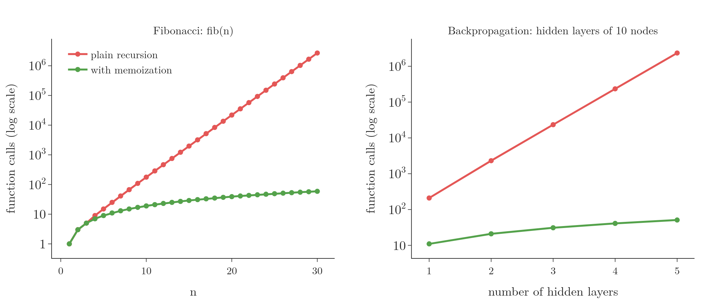
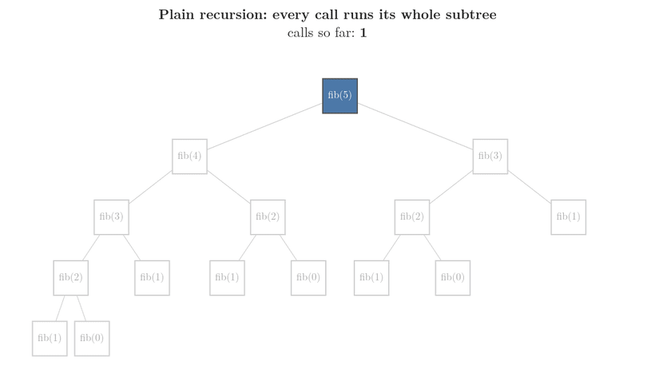
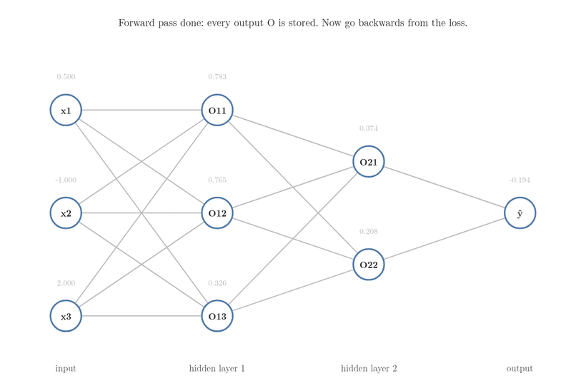

<!-- where-this-fits: generated by course_map/build_map.py; edit concepts.yaml, not this block -->
> **Where this fits:** Pipeline map step 0 (Foundations). See the [Course map](../../../00-course-map/00-course-map.md).
>
> 
>
> - **Builds on:** [Jacobian and matrix gradients](../../../MA/06-calculus/MA-063-jacobian-and-matrix-gradients/MA-063-jacobian-and-matrix-gradients.md#4-the-jacobian).
<!-- /where-this-fits -->

## 1. Overview

> **Key point:** Memoization stores the result of a computation the first time and looks it up afterwards. Backpropagation is the chain rule plus memoization: the derivative at each node is computed once, stored, and reused by every weight behind it.

**Memoization** (G-1210) is a computer-science technique that speeds up a program by storing the results of expensive function calls and returning the stored result when the same inputs come again. Memoization trades a little memory for a lot of time.

This Note does two things:

1. Shows memoization on its classic example, the Fibonacci numbers.
2. Takes a network with **two** hidden layers, where a first-layer weight reaches the loss along several paths, and shows how storing intermediate **derivatives** (G-595; slopes, see [the derivative](../../../MA/06-calculus/MA-061-derivatives-of-one-variable/MA-061-derivatives-of-one-variable.md#4-the-derivative-shrinking-the-step-to-zero)) keeps **backpropagation** (G-247; finding the slope of the loss for every weight, see [the steps of backpropagation](../DL-015-backpropagation-what/DL-015-backpropagation-what.md#4-the-steps-of-backpropagation)) fast.

{height=34%}

Figure 1 shows the payoff: without memoization the work grows exponentially; with it, almost linearly.

## 2. Prerequisites

- [What backpropagation does](../DL-015-backpropagation-what/DL-015-backpropagation-what.md#4-the-steps-of-backpropagation) and [how its derivatives are computed](../DL-016-backpropagation-how/DL-016-backpropagation-how.md#3-the-regression-algorithm-in-loops): the chain-rule derivatives of a one-hidden-layer network.
- The chain rule with several paths: [the chain rule with several variables](../../../MA/06-calculus/MA-062-partial-derivatives-and-gradients/MA-062-partial-derivatives-and-gradients.md#6-the-chain-rule-with-several-variables).
- The computation graph: [the preview of backpropagation](../../../MA/06-calculus/MA-063-jacobian-and-matrix-gradients/MA-063-jacobian-and-matrix-gradients.md#10-preview-backpropagation-and-automatic-differentiation).

## 3. Memoization on the Fibonacci numbers

> **Key point:** Plain recursion recomputes the same Fibonacci numbers over and over: 2.7 million calls for fib(30). Storing each answer in a dictionary cuts that to 59.

### 3.1 The plain recursive version

> **Key point:** fib(n) = fib(n − 1) + fib(n − 2), with fib(0) = fib(1) = 1. Short and correct, but very slow.

In the Fibonacci sequence each term is the sum of the two before it: 1, 1, 2, 3, 5, 8, 13, ... Counting from fib(0) = fib(1) = 1, a recursive function computes it directly.

> **Python:** Fibonacci by recursion.
>
> ```python
> def fib(n):
>     if n == 0 or n == 1:
>         return 1
>     return fib(n - 1) + fib(n - 2)   # the function calls itself
>
> fib(5), fib(10), fib(12)             # 8, 89, 233
> ```
>
> A function that calls itself is **recursive** (**recursion**, G-1648). Every call for $n \ge 2$ makes two more calls, until they reach 0 or 1.

The recursive version works, but it slows down sharply as $n$ grows: fib(30) already needs 2,692,537 calls (0.22 seconds), and each further step of $n$ multiplies the work by about 1.6. At $n = 40$ it would take about half a minute; $n = 100$ would take millions of years.

### 3.2 Why it is slow

> **Key point:** fib(5) computes fib(3) twice and fib(2) three times; for large $n$ the same subtrees are recomputed millions of times.

{height=32%}

Figure 2 draws all the calls made by fib(5). fib(5) needs fib(4) and fib(3); fib(4) needs fib(3) again, and so on. fib(3) is computed twice and fib(2) three times: 15 calls for a single answer. For fib(48) the tree would be astronomically large, almost all of it repeats.

> **Extra:** Let $C(n)$ be the number of calls. Each call counts itself plus the calls of its two children:
>
> $$C(n) = 1 + C(n-1) + C(n-2)$$
>
> $$C(0) = C(1) = 1$$
>
> Then $C(n) + 1$ follows the Fibonacci rule and starts at 2:
>
> $$C(n) + 1 = 2\thinspace\text{fib}(n)$$
>
> $$C(n) = 2\thinspace\text{fib}(n) - 1$$
>
> The count grows like $1.618^n$ (the golden ratio): **exponential time** (G-734), where each extra step multiplies the work by a constant factor.

### 3.3 The memoized version

> **Key point:** Keep a dictionary of answers. Before computing fib(n), look it up; after computing it, store it.

> **Python:** Fibonacci with memoization.
>
> ```python
> def fib_memo(n, d):
>     if n in d:                 # computed before: look it up
>         return d[n]
>     d[n] = fib_memo(n - 1, d) + fib_memo(n - 2, d)   # store
>     return d[n]
>
> fib_memo(30, {0: 1, 1: 1})     # 1346269, in 59 calls
> ```
>
> `d` is a **dictionary** (G-603): it maps each `n` already computed to its answer. `n in d` checks whether the key is there.

Figure 3 runs fib(5) both ways on the tree of Figure 2, call by call.



1. **Plain recursion** visits all 15 boxes.
2. **With memoization,** the first walk down the left edge computes fib(2), fib(3), fib(4) and fib(5) once each (blue) and stores them.
3. **Every other request is a lookup** (orange): fib(1) and fib(0) are in the dictionary from the start, and the second requests for fib(2) and fib(3) find the stored answers.
4. **The subtrees under a lookup are skipped** (grey). The total is 9 calls instead of 15: 4 computed, 5 looked up.

For fib(5) the saving is small. It grows fast with $n$: fib(30) now needs 59 calls instead of 2,692,537, and fib(100) only 199 (Figure 1, left). Each value is computed once; every later request is a lookup. The cost is the memory for the dictionary, one entry per value. Memoization is the core of **dynamic programming** (G-652), a family of algorithms built on reusing solutions to overlapping sub-problems (Cormen et al. 2009, Ch. 15).

> **Extra:** Python's standard library does this in one line: putting `@functools.lru_cache(maxsize=None)` above `def fib(n):` stores every result automatically (Python docs, `functools`).

## 4. Derivatives in a network with two hidden layers

> **Key point:** In a 3-3-2-1 network, the output-layer weights need one chain, the middle-layer weights a longer one, and the first-layer weights two chains added together, because $O_{11}$ reaches the output through both nodes of layer 2.

### 4.1 The network

> **Key point:** 3 inputs, hidden layers of 3 and 2 nodes, 1 output: 23 trainable parameters.

{height=34%}

The [network of the first backpropagation example](../DL-015-backpropagation-what/DL-015-backpropagation-what.md#3-the-data-and-the-network) had one hidden layer. Figure 4 adds a second: 3 inputs, hidden layers of 3 and 2 nodes, and 1 output. The network has 23 **trainable parameters** (G-1065; see [counting trainable parameters](../DL-008-mlp-notation/DL-008-mlp-notation.md#3-counting-trainable-parameters)): weights plus biases, layer by layer.

$$(3 \times 3) + 3 = 12$$

$$(3 \times 2) + 2 = 8$$

$$(2 \times 1) + 1 = 3$$

$$12 + 8 + 3 = 23$$

The hidden nodes use the sigmoid, the output is linear, and the loss is $(y - \hat{y})^2$; the same reasoning works for classification. For numbers we take one **observation** (G-1374; one record, one row of the data table) $x = (0.5, -1, 2)$ with $y = 1$ and fixed random weights. **Forward propagation** (G-797; computing the prediction layer by layer, see [forward propagation](../DL-010-forward-propagation/DL-010-forward-propagation.md#3-what-one-node-computes)) gives these values:

$$O_{11} = 0.783$$

$$O_{21} = 0.374$$

$$O_{22} = 0.208$$

$$\hat{y} = -0.194$$

The loss slope at the output follows. The symbol $\partial L/\partial \hat{y}$ reads "how fast the loss $L$ changes when only $\hat{y}$ changes" (a **partial derivative**, see [partial derivatives](../../../MA/06-calculus/MA-062-partial-derivatives-and-gradients/MA-062-partial-derivatives-and-gradients.md#3-partial-derivatives)):

$$\partial L/\partial \hat{y} = -2(y - \hat{y})$$

$$\partial L/\partial \hat{y} = -2(1 - (-0.194))$$

$$\partial L/\partial \hat{y} = -2.387$$

### 4.2 A weight of the output layer

> **Key point:** one link, as before:
>
> $$\partial L/\partial W_{11}^{3} = \partial L/\partial \hat{y} \cdot O_{21}$$

$W_{11}^{3}$ connects $O_{21}$ to the output, so

$$\frac{\partial L}{\partial W_{11}^{3}} = \frac{\partial L}{\partial \hat{y}} \cdot \frac{\partial \hat{y}}{\partial W_{11}^{3}}$$

$$\frac{\partial L}{\partial W_{11}^{3}} = -2.387 \times 0.374$$

$$\frac{\partial L}{\partial W_{11}^{3}} = -0.893$$

### 4.3 A weight of the middle layer

> **Key point:** Through $O_{21}$ only: $\partial L/\partial \hat{y} \cdot \partial \hat{y}/\partial O_{21} \cdot \partial O_{21}/\partial W_{11}^{2}$.

$W_{11}^{2}$ connects $O_{11}$ to node $O_{21}$. Changing it changes $O_{21}$, which changes $\hat{y}$, which changes $L$:

$$\frac{\partial L}{\partial W_{11}^{2}} = \frac{\partial L}{\partial \hat{y}} \cdot \frac{\partial \hat{y}}{\partial O_{21}} \cdot \frac{\partial O_{21}}{\partial W_{11}^{2}}$$

The second factor is the weight, and the third is the sigmoid slope times the input:

$$\partial \hat{y}/\partial O_{21} = W_{11}^{3}$$

$$\partial O_{21}/\partial W_{11}^{2} = O_{21}(1 - O_{21})\thinspace O_{11}$$

The network's numbers are $W_{11}^{3} = -0.366$, $O_{21} = 0.374$ and $O_{11} = 0.783$. One factor per line:

$$\frac{\partial L}{\partial \hat{y}} = -2.387$$

$$\frac{\partial \hat{y}}{\partial O_{21}} = W_{11}^{3} = -0.366$$

$$\frac{\partial O_{21}}{\partial W_{11}^{2}} = 0.374 \times (1 - 0.374) \times 0.783$$

$$\frac{\partial O_{21}}{\partial W_{11}^{2}} = 0.2341 \times 0.783$$

$$\frac{\partial O_{21}}{\partial W_{11}^{2}} = 0.183$$

$$\frac{\partial L}{\partial W_{11}^{2}} = (-2.387) \times (-0.366) \times 0.183$$

$$\frac{\partial L}{\partial W_{11}^{2}} = 0.874 \times 0.183$$

$$\frac{\partial L}{\partial W_{11}^{2}} = 0.160$$

Every one of the 6 middle-layer weights follows the same pattern.

### 4.4 A weight of the first layer: two paths

> **Key point:** $O_{11}$ feeds both $O_{21}$ and $O_{22}$, so its effect on the loss is the sum over both paths.

Now take $W_{11}^{1}$. The weight changes $O_{11}$, but $O_{11}$ goes **forward along two paths** (Figure 4): into $O_{21}$ (path a) and into $O_{22}$ (path b). Both end at $\hat{y}$.

When a variable affects a function through two intermediate variables, the **chain rule** (G-371) multiplies along each path and **adds the paths** (see [the chain rule with several variables](../../../MA/06-calculus/MA-062-partial-derivatives-and-gradients/MA-062-partial-derivatives-and-gradients.md#6-the-chain-rule-with-several-variables)). A small instance first: $f(x) = x^2$ and $g(x) = 3x$ feed $h(f, g) = f \cdot g$, and we want the slope at $x = 2$. The pieces at $x = 2$, one per line:

$$f = 2^2 = 4, \quad g = 3 \times 2 = 6$$

$$df/dx = 2x = 4, \quad dg/dx = 3$$

$$\partial h/\partial f = g = 6$$

$$\partial h/\partial g = f = 4$$

Each path multiplies the slope of $h$ by the slope of its middle variable:

$$\text{path through } f: \quad 6 \times 4 = 24$$

$$\text{path through } g: \quad 4 \times 3 = 12$$

$$\frac{dh}{dx} = 24 + 12 = 36$$

Check: multiply the two functions first.

$$h = x^2 \cdot 3x$$

$$h = 3x^3$$

The slope is then:

$$\frac{dh}{dx} = 9x^2$$

$$\frac{dh}{dx} = 9 \times 4 = 36 \quad (x = 2)$$

In general, for $h(f(x), g(x))$:

$$\frac{dh}{dx} = \frac{\partial h}{\partial f}\frac{df}{dx} + \frac{\partial h}{\partial g}\frac{dg}{dx}$$

Applied here:

1. **In words:** follow each path from $L$ back to $W_{11}^{1}$, multiply the derivatives along it, and add the two products.
2. **Formula:** one product per path, then the sum:
   $$\text{path a} = \frac{\partial L}{\partial \hat{y}}\thinspace\frac{\partial \hat{y}}{\partial O_{21}}\thinspace\frac{\partial O_{21}}{\partial O_{11}}$$
   $$\text{path b} = \frac{\partial L}{\partial \hat{y}}\thinspace\frac{\partial \hat{y}}{\partial O_{22}}\thinspace\frac{\partial O_{22}}{\partial O_{11}}$$
   $$\frac{\partial L}{\partial W_{11}^{1}} = (\text{a} + \text{b})\thinspace\frac{\partial O_{11}}{\partial W_{11}^{1}}$$
   Each step through a sigmoid node is that node's slope times the weight in between, for example:
   $$\frac{\partial O_{21}}{\partial O_{11}} = O_{21}(1 - O_{21})\thinspace W_{11}^{2}$$
   The last factor is the slope of $O_{11}$ times the input:
   $$\frac{\partial O_{11}}{\partial W_{11}^{1}} = O_{11}(1 - O_{11})\thinspace x_1$$
3. **Example:** the factors are
   - $\partial L/\partial \hat{y} = -2.387$;
   - the slope of $O_{21}$: $0.2341$;
   - the slope of $O_{22}$: $0.1647$;
   - $W_{11}^{3} = -0.366$ and $W_{21}^{3} = -0.272$;
   - $W_{11}^{2} = -0.633$ (from $O_{11}$ to $O_{21}$);
   - $W_{12}^{2} = -0.312$ (from $O_{11}$ to $O_{22}$);
   - the input $x_1 = 0.5$.

   The sigmoid slope of $O_{11}$ is:

   $$0.783 \times (1 - 0.783) = 0.170$$

   Path a, one product per line:
   $$-2.387 \times (-0.366) = 0.874$$
   $$0.874 \times 0.2341 = 0.2046$$
   $$0.2046 \times (-0.633) = -0.1295$$
   Path b:
   $$-2.387 \times (-0.272) = 0.650$$
   $$0.650 \times 0.1647 = 0.1070$$
   $$0.1070 \times (-0.312) = -0.0334$$
   Add the two paths, then finish the chain:
   $$-0.1295 + (-0.0334) = -0.1629$$
   $$-0.1629 \times 0.170 \times 0.5 = -0.0138$$
   Path a alone contributes:

   $$-0.1295 \times 0.170 \times 0.5 = -0.0110$$

   Path b contributes $-0.0028$. The two add to the same $-0.0138$.

`tf.GradientTape` (TensorFlow's tool that computes derivatives automatically) returns $-0.893$, $0.160$ and $-0.0138$ for the three weights, matching the hand formulas (Notebook).

The other 8 first-layer weights need the same two-path sum. With only two hidden layers, one derivative is already a sum of products of five factors. With ten hidden layers, the number of paths from a first-layer node to the output is the product of all the later layer widths: for widths of 10, that is $10^9$ paths.

## 5. Where memoization comes in

> **Key point:** Many of these products share their first factors. Working backwards from the loss, we compute $\partial L/\partial O$ for each node once, store it, and reuse it for every weight behind that node.

### 5.1 The repeated pieces

> **Key point:** $\partial L/\partial \hat{y}$ appears in all 23 derivatives; $\partial L/\partial O_{21}$ in every weight that reaches the loss through $O_{21}$.

Look at what the formulas of Section 4 share:

- $\partial L/\partial \hat{y}$ appears in every one of the 23 derivatives.
- $(\partial L/\partial \hat{y})(\partial \hat{y}/\partial O_{21})$, the derivative of the loss with respect to $O_{21}$, appears in the 3 weights entering $O_{21}$ and in path a of all 9 first-layer weights.
- The sum path a + path b of Section 4.4 is the derivative of the loss with respect to $O_{11}$, $\partial L/\partial O_{11}$. It appears in all 3 weights entering $O_{11}$.

Computed naively, each derivative rebuilds these pieces from scratch, exactly as fib recomputes fib(3).

### 5.2 Backpropagation stores one number per node

> **Key point:** $\partial L/\partial O$ for a node = the sum, over the nodes it feeds, of their stored $\partial L/\partial O$ times slope times weight. One pass from the output back gives all of them.

The memoized method keeps one stored number per node: the derivative of the loss with respect to that node's output. Going backwards, layer by layer:

1. **In words:** a node's derivative is built from the stored derivatives of the nodes it feeds; each weight's derivative is then its node's stored derivative times the node's slope times the weight's input.
2. **Formula:** for node $j$ of layer $l$, with sigmoid slope $s_{l+1,k} = O_{l+1,k}(1 - O_{l+1,k})$ (or 1 for the linear output),
   $$\frac{\partial L}{\partial O_{lj}} = \sum_{k} \frac{\partial L}{\partial O_{l+1,k}}\thickspace s_{l+1,k}\thickspace W_{jk}^{l+1}$$

   $$\frac{\partial L}{\partial W_{ij}^{l}} = \frac{\partial L}{\partial O_{lj}}\thickspace s_{lj}\thickspace O_{l-1,i}$$
3. **Example:** $\partial L/\partial O_{11}$ is computed once, from the stored $\partial L/\partial O_{21} = 0.874$ and $\partial L/\partial O_{22} = 0.650$:
   $$0.874 \times 0.2341 \times (-0.633) = -0.1295$$

   $$0.650 \times 0.1647 \times (-0.312) = -0.0334$$

   $$-0.1295 + (-0.0334) = -0.163$$
   Then all three weights entering $O_{11}$ reuse it, and the two-path sum of Section 4.4 is never repeated.

Figure 5 runs this backward pass on the network of Figure 4, with the numbers of Section 4.



1. **Output.** $\partial L/\partial \hat{y} = -2.387$ is computed and stored (Section 4.1).
2. **Layer 2.** $O_{21}$ and $O_{22}$ each multiply the stored $-2.387$ by the output's slope (1, linear) and their weight to the output: 0.874 and 0.650, stored.
3. **Layer 1.** Each node adds the stored values of the two nodes it feeds, each times that node's sigmoid slope and the connecting weight: $-0.163$, $-0.120$ and $-0.089$, stored. The two paths of Section 4.4 are added here, once, inside $\partial L/\partial O_{11}$.
4. **A weight.** Take the stored value of $O_{11}$, times its slope, times its input $x_1$:

   $$\partial L/\partial W_{11}^{1} = -0.1628 \times 0.170 \times 0.5$$

   $$\partial L/\partial W_{11}^{1} = -0.0138$$

   The result is the same as the two-path sum of Section 4.4, but no product was built twice.

Six node values were computed in all, one per node; Section 5.3 counts what plain recursion would need.

> **Python:** Plain recursion versus memoization.
>
> ```python
> from functools import lru_cache
>
> def dL_dO(l, j):                   # derivative at node j of layer l
>     if l == L:                     # the output node
>         return -2 * (y - O[L][0])
>     return sum(node(l + 1, k) * slope[l + 1][k] * W[l + 1][j, k]
>                for k in range(sizes[l + 1]))
>
> node = dL_dO                       # plain: recomputes every time
> node = lru_cache(maxsize=None)(dL_dO)   # memoized: computes once
> ```
>
> The recursion calls `node`, so switching `node` between the two lines switches the whole computation between plain and memoized. Both give identical gradients.

### 5.3 How much work it saves

> **Key point:** For the 3-3-2-1 network: 59 node evaluations without memoization, 6 with. With 5 hidden layers of 10 nodes: 2,345,610 against 51.

Counting how often a node's derivative is evaluated to get all the weight gradients:

| Network | Plain recursion | Memoized |
|---|---|---|
| 3-3-2-1 (Figure 4) | 59 | 6 |
| 1 hidden layer of 10 | 210 | 11 |
| 3 hidden layers of 10 | 23,410 | 31 |
| 5 hidden layers of 10 | 2,345,610 | 51 |

Each extra hidden layer multiplies the plain count by about 10 (the layer width), while the memoized count grows by 10: one evaluation per node (Figure 1, right). The gap is the same exponential-versus-linear gap as Fibonacci.

The price is memory: the forward pass must keep every node's output, and the backward pass every node's derivative, until the update is done. The small cost in space buys an enormous saving in time.

## 6. Backpropagation = chain rule + memoization

> **Key point:** The maths is the chain rule; the efficiency is memoization. Keras and TensorFlow implement exactly this on the computation graph.

Backpropagation combines two ideas:

- **The chain rule** (mathematics) says what each derivative is: a sum, over paths, of products of local derivatives.
- **Memoization** (computer science) computes those derivatives efficiently: each shared piece is computed once, stored and reused, working backwards from the loss.

On the **computation graph** (G-434; a diagram with one node per intermediate value, see [the preview of backpropagation](../../../MA/06-calculus/MA-063-jacobian-and-matrix-gradients/MA-063-jacobian-and-matrix-gradients.md#10-preview-backpropagation-and-automatic-differentiation)), this is the **backward pass** (G-249): keep every intermediate value going forward, then go backward once, multiplying local derivatives and adding where paths meet. Libraries such as Keras and TensorFlow do this automatically, so the whole **gradient** (G-863) costs only a small multiple of one forward pass, typically 2 to 3 times (Baydin et al. 2018, §3).

> **Extra:** Storing every activation is why training a network needs much more memory than using it to predict: prediction can throw each layer's outputs away as soon as the next layer is computed, while training must keep them for the backward pass (Chen et al. 2016).

## 7. Summary

| | Fibonacci | Backpropagation |
|---|---|---|
| Repeated sub-problem | fib($k$) for smaller $k$ | $\partial L/\partial O$ of each node |
| Plain recursion | 2,692,537 calls for fib(30) | 2,345,610 node evaluations, 5 layers of 10 |
| Memoized | 59 calls | 51 node evaluations |
| What is stored | one value per $n$ | each node's output (forward) and derivative (backward) |

- Memoization stores the results of expensive calls and reuses them: memory for time.
- With two hidden layers, a first-layer weight reaches the loss along several paths, and its derivative is the sum of the path products, so computing each path separately repeats the same pieces.
- Many derivatives share the same pieces; computing $\partial L/\partial O$ once per node, from the output backwards, removes all repetition.
- Backpropagation is the chain rule applied with memoization, which is why it needs 51 node evaluations instead of 2,345,610 here.

## 8. Sources

**Built from**

- CampusX, "MLP Memoization | Complete Deep Learning Playlist", YouTube, https://www.youtube.com/watch?v=rW0eeTXas4k

**Other references**

- Python documentation, `functools.lru_cache`.
- Cormen, Leiserson, Rivest and Stein, *Introduction to Algorithms*, 3rd ed., MIT Press, 2009, Ch. 15 (dynamic programming; memoization in §15.3).
- Baydin, Pearlmutter, Radul and Siskind, "Automatic Differentiation in Machine Learning: a Survey", *JMLR*, 2018, §3 (cost and storage of reverse mode).
- Chen, Xu, Zhang and Guestrin, "Training Deep Nets with Sublinear Memory Cost", arXiv:1604.06174, 2016 (stored activations dominate training memory).

## 9. Key terms

Terms taught in this Note come first; linked terms are recaps, taught in the Note the link opens.

| Term | Meaning |
|---|---|
| Memoization (G-1210) | Storing the result of a function call and returning the stored result when the same input comes again. |
| Recursion (G-1648) | A function that calls itself on smaller inputs. |
| Exponential time (G-734) | Work that is multiplied by a constant factor with every step of the input size. |
| Dynamic programming (G-652) | Solving a problem by storing the answer to each overlapping sub-problem the first time it is computed and looking it up afterwards, so no work is repeated; memoization is one form of it. |
| `lru_cache` (G-109) | Python's built-in tool that stores a function's results automatically, so a repeated call reuses them (memoization). |
| Path (in a network) (G-1464) | A route from a node to the output along connections; a derivative sums its products over all paths. |
| [Derivative](../../../MA/06-calculus/MA-061-derivatives-of-one-variable/MA-061-derivatives-of-one-variable.md#41-from-secant-to-tangent) (G-595) | The slope of a function at a point: how fast the output changes as the input changes there. It is zero at the lowest point of a smooth curve, which is how training finds a minimum. |
| [Backpropagation](../../../DL/01-basics/DL-015-backpropagation-what/DL-015-backpropagation-what.md#1-overview) (G-247) | The algorithm that computes the gradient of the loss with respect to every weight and bias by applying the chain rule backward from the output; gradient descent then uses these gradients to train the network. |
| [Dictionary (Python)](../../../ML/02-getting-data/ML-016-fetching-data-from-api/ML-016-fetching-data-from-api.md#5-reading-the-reply) (G-603) | A lookup table from keys to values, written `{key: value}`. |
| [Learnable (trainable) parameters](../../../DL/04-cnn/DL-046-cnn-vs-ann/DL-046-cnn-vs-ann.md#51-counting-the-parameters-of-a-convolution-layer) (G-1065) | The weights and biases that training changes; for a convolution layer, the filter values and one bias per filter. |
| [Observation](../../../ML/01-foundations/ML-003-types-of-ml/ML-003-types-of-ml.md#21-learning-from-inputs-and-outputs) (G-1374) | One record of a dataset: one row of the data table. |
| [Forward propagation](../../../DL/01-basics/DL-010-forward-propagation/DL-010-forward-propagation.md#1-overview) (G-797) | Passing one row of inputs through the network, layer by layer, to get the prediction. |
| [Chain rule](../../../ML/07-classification/ML-073-sigmoid-derivative/ML-073-sigmoid-derivative.md#2-two-rules-we-need) (G-371) | To differentiate a function of a function, multiply the outer derivative by the inner derivative. |
| [Computation graph](../../../MA/06-calculus/MA-063-jacobian-and-matrix-gradients/MA-063-jacobian-and-matrix-gradients.md#10-preview-backpropagation-and-automatic-differentiation) (G-434) | A function broken into elementary steps, each a node, with arrows for the flow of values. Backpropagation walks it backwards, applying the chain rule one step at a time. |
| [Backward pass](../../../DL/04-cnn/DL-048-backpropagation-cnn-layers/DL-048-backpropagation-cnn-layers.md#1-overview) (G-249) | Computing the gradient of the loss for every tensor, from the output back to the input. |
| [Gradient (of the loss)](../../../DL/01-basics/DL-015-backpropagation-what/DL-015-backpropagation-what.md#1-overview) (G-863) | How fast the loss changes with each weight and bias, collected in one vector (the partial derivatives of the loss); it points in the direction in which the loss rises fastest. |
