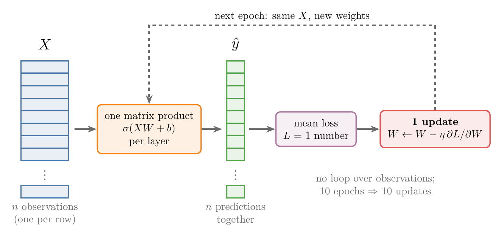
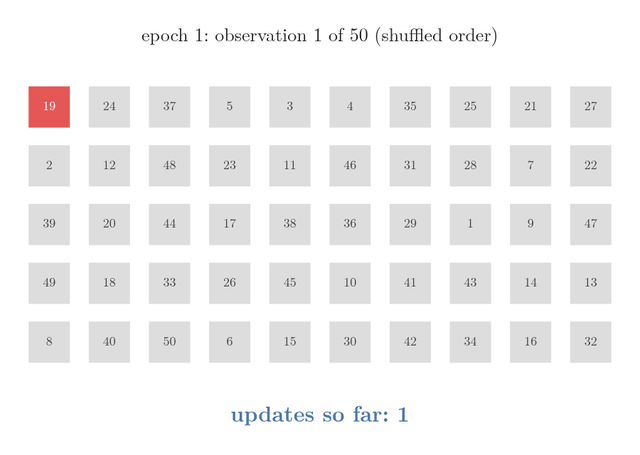
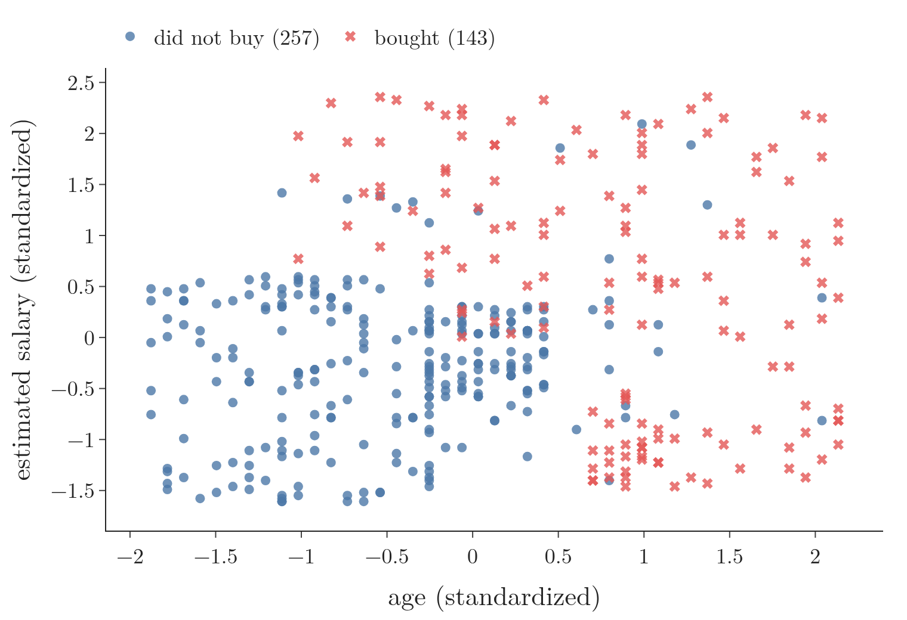

<!-- where-this-fits: generated by course_map/build_map.py; edit concepts.yaml, not this block -->
> **Where this fits:** Pipeline map step 8 (Model). See the [Course map](../../../00-course-map/00-course-map.md).
>
> 
>
> - **Builds on:** [Feature scaling](../../../ML/01-foundations/ML-006-instance-vs-model-based/ML-006-instance-vs-model-based.md#31-how-it-works); [Best-fit line and squared error](../../../ML/06-regression/ML-049-simple-linear-regression/ML-049-simple-linear-regression.md#34-the-best-fit-line); [Learning rate](../../../ML/06-regression/ML-056-gradient-descent/ML-056-gradient-descent.md#5-the-learning-rate); [Convex and non-convex loss](../../../ML/06-regression/ML-056-gradient-descent/ML-056-gradient-descent.md#8-the-shape-of-the-loss-function-matters); [Derivatives of one variable](../../../MA/06-calculus/MA-061-derivatives-of-one-variable/MA-061-derivatives-of-one-variable.md#1-overview); [Partial derivatives and gradients](../../../MA/06-calculus/MA-062-partial-derivatives-and-gradients/MA-062-partial-derivatives-and-gradients.md#12-the-gradient-on-the-map).
> - **Leads to:** [Scaling inputs for neural networks](../../../DL/02-training/DL-023-data-scaling-in-ann/DL-023-data-scaling-in-ann.md#1-overview); [L1 and L2 regularisation in neural networks](../../../DL/02-training/DL-026-regularization-in-dl/DL-026-regularization-in-dl.md#10-key-terms); [Batch normalisation](../../../DL/02-training/DL-031-batch-normalization/DL-031-batch-normalization.md#4-how-batch-normalisation-works-during-training); [Optimizers in deep learning](../../../DL/03-optimizers/DL-032-optimizers-in-deep-learning/DL-032-optimizers-in-deep-learning.md#8-sources).
> - **Compare with:** [Ordinary least squares (closed form)](../../../ML/06-regression/ML-050-linear-regression-maths/ML-050-linear-regression-maths.md#2-two-ways-to-find-m-and-b); [Normal equation](../../../ML/06-regression/ML-054-multiple-lr-code/ML-054-multiple-lr-code.md#1-overview); [SGD with momentum](../../../DL/03-optimizers/DL-034-sgd-with-momentum/DL-034-sgd-with-momentum.md#9-momentum-on-real-data-mnist).
<!-- /where-this-fits -->

## 1. Overview

> **Key point:** Batch, stochastic and mini-batch gradient descent differ only in how many **observations** (G-1374) (records, one row of the data table each) feed each update. In Keras one setting chooses between them: `batch_size`. Big batches finish an epoch faster; small batches get further per epoch, on a noisier path.

A network learns by looking at observations and then changing its weights. The question of this Note is how many observations it should look at before each change: all of them, one, or a small group.

The three variants of gradient descent are taught in [batch gradient descent](../../../ML/06-regression/ML-057-batch-gradient-descent/ML-057-batch-gradient-descent.md#1-overview), [stochastic gradient descent](../../../ML/06-regression/ML-058-stochastic-gradient-descent/ML-058-stochastic-gradient-descent.md#3-how-stochastic-gradient-descent-works) and [mini-batch gradient descent](../../../ML/06-regression/ML-059-mini-batch-gradient-descent/ML-059-mini-batch-gradient-descent.md#3-how-it-works):

An **epoch** (G-696) is one full pass over the training data.

- **Batch:** one update per epoch, from all $n$ observations.
- **Stochastic (SGD):** $n$ updates per epoch, one per observation.
- **Mini-batch:** one update per batch of observations, typically 32.

The three variants trade the accuracy of each update against the time it takes. This Note places them inside the **backpropagation** (G-247) algorithm of a neural network and runs all three in Keras on the same network and data. Figure 1 shows how the choice cuts the rows into updates: each row of blocks is one value of `batch_size`, each block is one batch of observations, and the number of blocks is the number of updates in one epoch.

{width=100%}

## 2. Prerequisites

- The [backpropagation what](../../01-basics/DL-015-backpropagation-what/DL-015-backpropagation-what.md#4-the-steps-of-backpropagation): the training loop of a network.
- The [gradient descent](../../../ML/06-regression/ML-056-gradient-descent/ML-056-gradient-descent.md#2-the-idea) and the three Notes above on its variants.

## 3. Where gradient descent sits in backpropagation

> **Key point:** The update step of backpropagation is gradient descent. Updating after every single observation, as in the backpropagation Notes, is stochastic gradient descent.

Gradient descent minimises the loss, a function of all the weights and biases, by moving each parameter against its gradient by a **learning rate** (G-1068) (see the [backpropagation why](../../01-basics/DL-017-backpropagation-why/DL-017-backpropagation-why.md#8-why-we-need-a-learning-rate)). In backpropagation this is the update step:

$$W_{\text{new}} = W_{\text{old}} - \eta\thinspace\frac{\partial L}{\partial W}$$

Here $W$ is one weight, $L$ is the loss, $\frac{\partial L}{\partial W}$ is the gradient (the slope of the loss with respect to $W$) and $\eta$ is the learning rate. For example, with $W_{\text{old}} = 0.5$, slope $2$ and $\eta = 0.1$:

$$0.1 \times 2 = 0.2$$

$$W_{\text{new}} = 0.5 - 0.2 = 0.3$$

The loop of the [backpropagation what](../../01-basics/DL-015-backpropagation-what/DL-015-backpropagation-what.md#4-the-steps-of-backpropagation) picks one observation, predicts, computes the loss and updates, then moves to the next observation. With 50 observations, the loop makes 50 updates in every epoch. Updating after every observation is **stochastic gradient descent** (G-1892). The other variants change only how many observations go into each update.

## 4. Batch gradient descent in a network

> **Key point:** No inner loop: predict all observations at once with one matrix product, average the loss over them, update once. Updates = epochs.

**Batch gradient descent** (G-264) (also **vanilla gradient descent** (G-2069), the plain version) uses the whole training set for every update:

1. For each epoch:
   a. predict all $n$ observations at once with forward propagation;
   b. compute the loss averaged over all $n$ observations;
   c. compute the gradients of that average and update every weight and bias once.

Step (a) needs no loop over observations. Stacking the observations as the rows of a matrix $X$, each layer becomes one matrix product $\sigma(XW + b)$ (see the Extra at the end of section 6 of the [forward propagation](../../01-basics/DL-010-forward-propagation/DL-010-forward-propagation.md#6-the-whole-network-in-one-formula)), which returns all $n$ predictions together. With 10 epochs the weights are updated exactly 10 times: **the number of updates equals the number of epochs**.

{width=100%}

In Figure 2, follow the arrows once round the loop: there is exactly one red update box per pass, so the update count can only grow with the epochs.

> **Python:** Batch gradient descent, as pseudocode.
>
> ```python
> for epoch in range(10):
>     y_hat = forward(X, params)    # all n observations, one matrix product
>     loss = mean_loss(y, y_hat)    # one number for all observations
>     params = params - lr * gradient(loss, params)   # 1 update
> ```

## 5. Stochastic gradient descent in a network

> **Key point:** Shuffle, then update after every observation: $n$ updates per epoch. With 50 observations and 10 epochs, 500 updates.

1. For each epoch:
   - shuffle the observations;
   - for each of the $n$ observations: predict it, compute its loss, update every parameter.
   - report the average loss of the epoch.

With 50 observations and 10 epochs the weights are updated 500 times, against 10 times for batch gradient descent:

$$10 \times 50 = 500$$

The observations are shuffled each epoch so that their order cannot bias the updates (see the [stochastic gradient descent](../../../ML/06-regression/ML-058-stochastic-gradient-descent/ML-058-stochastic-gradient-descent.md#3-how-stochastic-gradient-descent-works)).

Why update on a single observation at all? Because one batch update is expensive on large data. Each update needs the derivative of every parameter for every observation it uses:

1. **In words:** terms per update = number of parameters × number of observations in the update.
2. **Formula:**
   $$\text{terms per update} = p \times m$$
   with $p$ parameters and $m$ observations per update.
3. **Example:** a model with 23,000 parameters and 1 million observations needs, for one batch update:
   $$23{,}000 \times 1{,}000{,}000$$
   $$= 23 \text{ billion terms}$$
   With one observation per update the cost is
   $$23{,}000 \times 1 = 23{,}000 \text{ terms}$$
   a million times less.

One observation is a usable stand-in for the whole data because real data is redundant: many observations look alike, so their gradients point in similar directions. Section 8 shows single-observation steps reaching the same place as full-batch steps.

A second benefit: when a new observation arrives, stochastic gradient descent can take one more step on it, without starting again from the whole data (see the [online learning](../../../ML/01-foundations/ML-005-online-learning/ML-005-online-learning.md#2-what-online-learning-is)).

{height=50%}

In Figure 3, watch the counter climb by one per square, and the order of the IDs change when epoch 2 starts: after 10 shuffled passes the count reaches 500.

## 6. Choosing the variant in Keras: `batch_size`

> **Key point:** `batch_size` = number of training observations gives batch gradient descent; 1 gives stochastic; anything between gives mini-batch. The default is 32.

Keras has no separate switch for the three variants. `model.fit` takes a `batch_size`, the number of observations used for each update:

| `batch_size` | Variant | Updates per epoch on 320 observations |
|---|---|---|
| 320 (all observations) | batch | 1 |
| 32 (the default) | mini-batch | 10 |
| 1 | stochastic | 320 |

The progress bar Keras prints during training counts the updates: `1/1` per epoch with `batch_size=320`, `320/320` with `batch_size=1`.

> **Python:** One network, three variants.
>
> ```python
> model.compile(optimizer=keras.optimizers.SGD(learning_rate=0.01),
>               loss="binary_crossentropy", metrics=["accuracy"])
> model.fit(X_train, y_train, epochs=10, batch_size=320)  # batch
> model.fit(X_train, y_train, epochs=10, batch_size=1)    # stochastic
> model.fit(X_train, y_train, epochs=10, batch_size=32)   # mini-batch
> ```
>
> Plain `SGD` as the optimizer makes each update exactly the learning rate times the gradient, so `batch_size` alone decides which variant runs. (Keras calls the optimizer SGD whatever the **batch size** (G-267).)

The experiments below use the Social Network Ads data: 400 customers with their age and estimated salary, and the **target** (G-1949) (the output we predict): whether they bought a product. The two **features** (G-772) (input variables) are standardized (salary is in tens of thousands, age in tens; see the [standardization](../../../ML/03-feature-engineering/ML-023-standardization/ML-023-standardization.md#42-the-formula)), and a random 320 of the 400 observations are used for training (the other 80 are the **test** data, used only to measure the trained network in section 8). The network has two hidden layers of 10 ReLU nodes (a ReLU node returns its weighted sum if that is positive and 0 otherwise) and one sigmoid output node (it squashes its sum into 0 to 1, a probability of buying): 151 parameters. Section 7 instead trains on all 400 observations with the last 20 percent (80) held back as **validation** data: observations the network does not train on, so it again trains on 320. The accuracy on them is the **validation accuracy**. Every run starts from the same weights.

{height=40%}

Figure 4 shows what the network must learn: the buyers (red) sit mostly at older ages or at high salaries, the non-buyers at young ages and lower salaries.

## 7. Which is faster?

> **Key point:** For the same number of epochs, batch gradient descent finishes first (1.0 s against 15 s for 10 epochs). But stochastic gets much further in those epochs (validation accuracy 96% against 53%).

The question "which is faster?" has two answers, depending on what we count.

**Time for a fixed number of epochs.** Training for 10 epochs:

| `batch_size` | Updates per epoch | Time for 10 epochs (varies slightly per run) |
|---|---|---|
| 320 (batch) | 1 | 1.0 s |
| 32 (mini-batch) | 10 | 1.3 s |
| 1 (stochastic) | 320 | 15.0 s |

Every update has a fixed cost, so 320 updates per epoch take far longer than 1. Batch gradient descent completes its epochs fastest.

**Progress in a fixed number of epochs.** Training on all 400 observations, with the last 20% held back for validation (`validation_split=0.2`), for 10 epochs:

| `batch_size` | Training loss after 10 epochs | Validation accuracy |
|---|---|---|
| 320 (batch) | 0.705 | 52.5% |
| 32 (mini-batch) | 0.590 | 62.5% |
| 1 (stochastic) | 0.255 | 96.2% |

In the same 10 epochs, stochastic gradient descent made 3,200 updates and batch gradient descent 10. More updates move the weights further towards a solution, so stochastic gradient descent **converges** (G-469; reaches a good solution) in far fewer epochs.

Both statements are true, which is why sources disagree about which is "faster": batch finishes each epoch faster, stochastic makes more progress in each epoch.

{height=50%}

In Figure 5, watch the bars as much as the curves: after 10 epochs stochastic gradient descent has made 3,200 updates and batch gradient descent 10, and the loss curves are ordered the same way, stochastic lowest and batch highest, for all 100 epochs.

## 8. The path to the minimum

> **Key point:** Batch gradient descent lowers the loss smoothly; stochastic zigzags, because each step follows one random observation. The noise can shake it out of a local minimum, but stops it from settling exactly.

The network of section 6 has 151 weights, too many to draw. To see the paths, this section uses a smaller model on the same data: a single sigmoid neuron with one weight for age ($w_1$) and one for salary ($w_2$), trained on the first 320 observations. The loss of this one-neuron model depends on two weights, so it is a surface: for each pair $(w_1, w_2)$ the height is the loss on those 320 observations (bias held at its best value). Two points on it:

$$L(-1.5, 3.5) = 1.08 \quad \text{(the common start)}$$

$$L(1.94, 1.29) = 0.33 \quad \text{(the lowest point)}$$

{height=45%}

Figure 6 shows the surface: a bowl. In the side views it rises steeply towards the start point (low age weight $w_1$, high salary weight $w_2$) and is nearly flat around its lowest point. The [contour map](../../../MA/06-calculus/MA-062-partial-derivatives-and-gradients/MA-062-partial-derivatives-and-gradients.md#11-reading-a-contour-map) in Figure 7 is this bowl seen from above: each line joins points at the same loss. Lines close together mean a steep slope; the centre is the lowest point (the star).

{height=75%}

Figure 7 draws the three paths on a loss surface that has only two weights, so that it can be seen. Watch the three dots over the 15 epochs:

- **Batch (blue):** a smooth line, one step per epoch. No step ever raises the loss, but after 15 epochs and 15 updates the loss is still 0.68, far from the star.
- **Mini-batch (orange):** a slightly wobbly line, 10 steps per epoch. It reaches the star's loss, 0.33, by epoch 15, and 29 of its 150 steps raised the loss a little.
- **Stochastic (red):** a staggering walk, 320 steps per epoch. It is near the star within the first epoch (loss 0.33), but then keeps wandering around the star: 2,633 of its 4,800 steps raised the loss.

Every stochastic step used one customer only, and the walk still ends where the full-data steps are heading. The customers are redundant enough for one of them to point roughly the right way.

The same behaviour shows in the full network of section 6.

{height=33%}

Figure 8 (left) trains each variant for 100 epochs:

| `batch_size` | Loss after 100 epochs | Test accuracy |
|---|---|---|
| 320 (batch) | 0.613 | 78.8% |
| 32 (mini-batch) | 0.288 | 85.0% |
| 1 (stochastic) | 0.194 | 87.5% |

Measured once per epoch, all three curves look smooth. The difference shows when we measure after every update (Figure 8, right). Over its first 320 updates, stochastic gradient descent made the loss on the whole training set **rise** 60 times: each step follows the gradient of one random observation, which points only roughly downhill. **Mini-batch gradient descent** (G-1222), averaging 32 observations per step, never made it rise.

Batch gradient descent walks smoothly into the valley of the loss; stochastic gradient descent staggers in. Think of asking for directions: batch asks the whole town and takes the average answer before each step, so every step is good but slow to get; stochastic asks one passer-by per step, so the steps come fast but some point the wrong way. The noise has two sides (see section 5 of the [stochastic gradient descent](../../../ML/06-regression/ML-058-stochastic-gradient-descent/ML-058-stochastic-gradient-descent.md#5-a-noisy-path)):

- **Advantage:** a network's loss has many **local minima** (dips that are lowest only in their own neighbourhood; see the [convex and non-convex cost functions](../../../MA/07-optimisation/MA-065-convex-and-non-convex-cost-functions/MA-065-convex-and-non-convex-cost-functions.md#4-what-goes-wrong-with-a-non-convex-loss)). Smooth batch descent stays in the first dip it reaches; the random jumps of SGD can carry it out of a poor dip towards a better one.
- **Disadvantage:** near the minimum it keeps jumping around instead of settling, so the answer is approximate.

## 9. Vectorisation and memory

> **Key point:** Batch gradient descent replaces the loop over observations with one matrix product, which is fast, but needs every observation in memory at once; on very large data that is impossible.

Batch gradient descent needs no loop over observations because one matrix product computes all predictions. Replacing a loop by operations on whole arrays is **vectorisation** (G-2083) (see the [batch gradient descent](../../../ML/06-regression/ML-057-batch-gradient-descent/ML-057-batch-gradient-descent.md#33-all-derivatives-at-once)). Libraries run these products in optimised code, much faster than a Python loop.

The downside is memory. To multiply all observations at once, all observations must be loaded at once. A dataset of 10 crore (100 million) observations does not fit in a computer's memory, so batch gradient descent cannot run on it. Stochastic gradient descent needs only one observation at a time, but cannot use vectorisation at all.

{height=40%}

In Figure 9, watch the two lines cross: moving right buys fewer, vectorised updates at the price of memory, and mini-batch (orange) sits near the crossing, with 32 observations in memory and 10 updates per epoch.

## 10. Mini-batch: the middle ground

> **Key point:** Batches of, say, 32 observations: vectorised within each batch, only one batch in memory, $n/32$ updates per epoch, and a much smoother path than SGD. Mini-batch is what deep learning uses almost everywhere.

Mini-batch gradient descent cuts the shuffled observations into batches and updates once per batch (see the [mini-batch gradient descent](../../../ML/06-regression/ML-059-mini-batch-gradient-descent/ML-059-mini-batch-gradient-descent.md#3-how-it-works)). With 320 observations and batches of 32, that is 10 batches and 10 updates per epoch. On every count it sits between the other two:

| | Batch | Mini-batch | Stochastic |
|---|---|---|---|
| Time per epoch | fastest | middle | slowest |
| Progress per epoch | slowest | middle | fastest |
| Path of the loss | smooth | slightly noisy | jagged |
| Vectorised | yes | yes, within a batch | no |
| Memory | all observations | one batch | one observation |

Each batch is vectorised, only one batch has to be in memory, and the average over 32 observations removes most of SGD's noise. Mini-batch's balance is why Keras uses mini-batches by default (`batch_size` defaults to 32; Keras docs, `Model.fit`), and why "gradient descent" in deep learning almost always means mini-batch (Goodfellow et al. 2016, §8.1.3).

## 11. Two practical questions about `batch_size`

> **Key point:** Powers of 2 are customary for hardware efficiency but not required. When the batch size does not divide the number of observations, the last batch is simply smaller.

### 11.1 Why powers of 2?

> **Key point:** 16, 32, 64, ... suit how hardware processes arrays; any value works.

Batch sizes in examples are nearly always 16, 32, 64 or 128. Computer memory and processors, GPUs especially, handle arrays of these sizes efficiently, so they can run slightly faster (Goodfellow et al. 2016, §8.1.3; see also the Extra in section 5 of the [mini-batch gradient descent](../../../ML/06-regression/ML-059-mini-batch-gradient-descent/ML-059-mini-batch-gradient-descent.md#5-choosing-the-batch-size)). Powers of 2 are a convention, not a rule: 10, 15 or 100 work just as well.

### 11.2 When the batch size does not divide the number of observations

> **Key point:** 400 observations with `batch_size=150` give batches of 150, 150 and 100: 3 updates per epoch.

With 400 observations and `batch_size=150`, the division gives 2.67 batches:

$$400 / 150 = 2.67$$

Keras rounds up and makes 3 (Figure 1):

- two full batches of 150 observations;
- one last batch with the remaining 100 observations.

So there are 3 updates per epoch, the last from fewer observations. With `batch_size=250` there are 2 updates (250 and 150 observations), and with the default 32 there are 13 (twelve of 32 and one of 16). In general, the number of updates per epoch is the number of observations divided by the batch size, rounded up. The symbol $\lceil\ \rceil$ means "round up", and $n$ is the number of observations. For $n = 320$ with batch size 32 and then 250:

$$\lceil 320 / 32 \rceil = \lceil 10 \rceil = 10$$
$$\lceil 320 / 250 \rceil = \lceil 1.28 \rceil = 2$$

## 12. Summary

| `batch_size` | Variant | Updates per epoch | 10 epochs here | Validation accuracy after 10 epochs |
|---|---|---|---|---|
| $n$ | batch | 1 | 1.0 s | 52.5% |
| 32 | mini-batch | $\lceil n/32 \rceil$ | 1.3 s | 62.5% |
| 1 | stochastic | $n$ | 15.0 s | 96.2% |

- The update step of backpropagation is gradient descent; the variants differ only in observations per update.
- In Keras, `batch_size` chooses the variant; the default, 32, is mini-batch.
- Batch finishes epochs fastest; stochastic needs the fewest epochs to converge.
- Stochastic's path is jagged: it can escape local minima but never settles exactly.
- One batch update costs parameters × observations terms; one observation per update cuts that cost, and works because data is redundant.
- Batch is vectorised but needs all observations in memory; mini-batch keeps the vectorisation with one batch in memory.
- A batch size that does not divide the number of observations leaves a smaller last batch.

## 13. Sources

**Built from**

- CampusX, "Gradient Descent in Neural Networks | Batch vs Stochastics vs Mini Batch Gradient Descent", YouTube, https://www.youtube.com/watch?v=7z6yXpYk7sw
- StatQuest with Josh Starmer, "Stochastic Gradient Descent, Clearly Explained!!!", YouTube, https://www.youtube.com/watch?v=vMh0zPT0tLI (section 5: the count of terms per update, redundancy in the data, and one more step on new data)

**Other references**

- Keras documentation, `Model.fit` (`batch_size` default 32; `validation_split` takes the last fraction of the data).
- Goodfellow, Bengio and Courville, *Deep Learning*, MIT Press, 2016, §8.1.3 (minibatch algorithms; power-of-2 batch sizes on GPUs).

## 14. Key terms

| Term | Meaning |
|---|---|
| Vanilla gradient descent | Another name for batch gradient descent, the plain version |
| `batch_size` | Keras setting: the number of observations used for each update; $n$, 1 or in between gives batch, stochastic or mini-batch |
| Updates per epoch | $\lceil n / \text{batch size} \rceil$: the number of batches in one pass over the data |
| `validation_split` | Keras setting that holds back the last fraction of the observations to measure the model during training |
| Convergence speed | How many epochs a method needs to reach a good solution, as opposed to the time per epoch |
