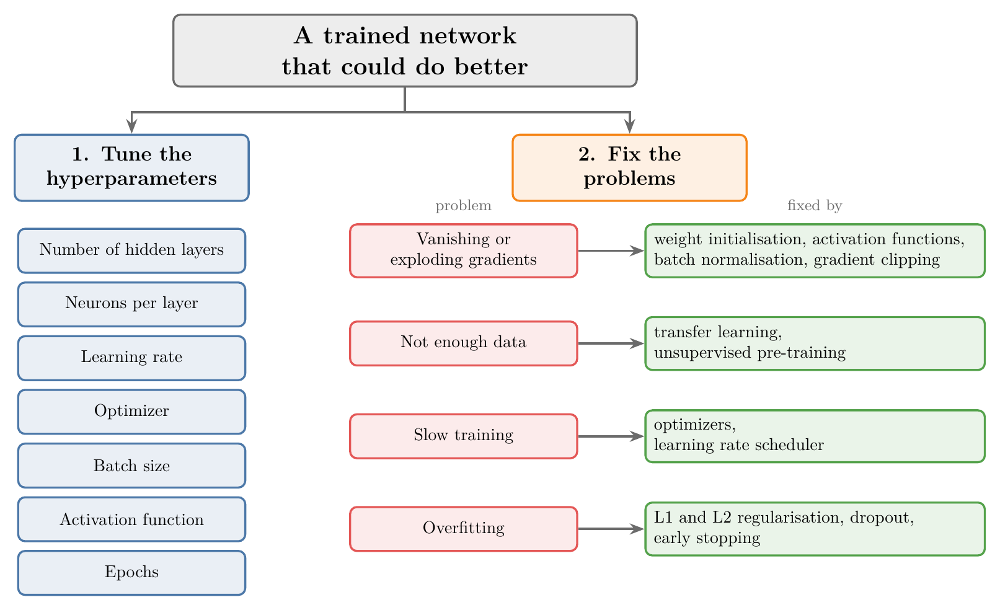
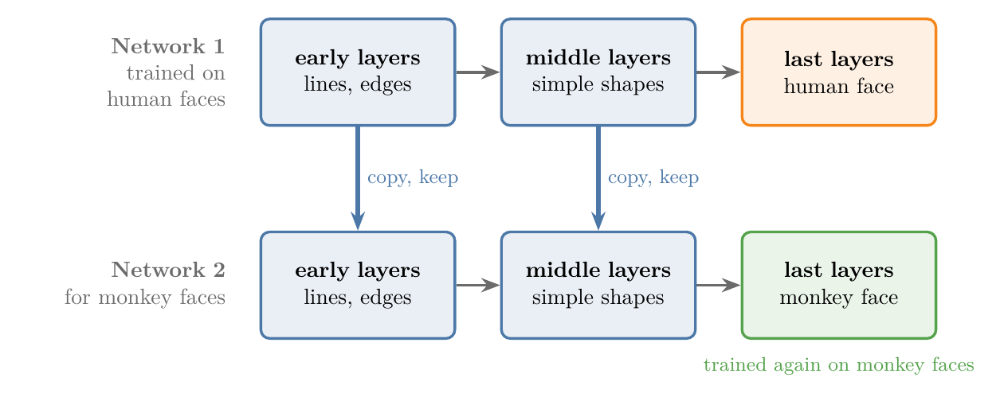
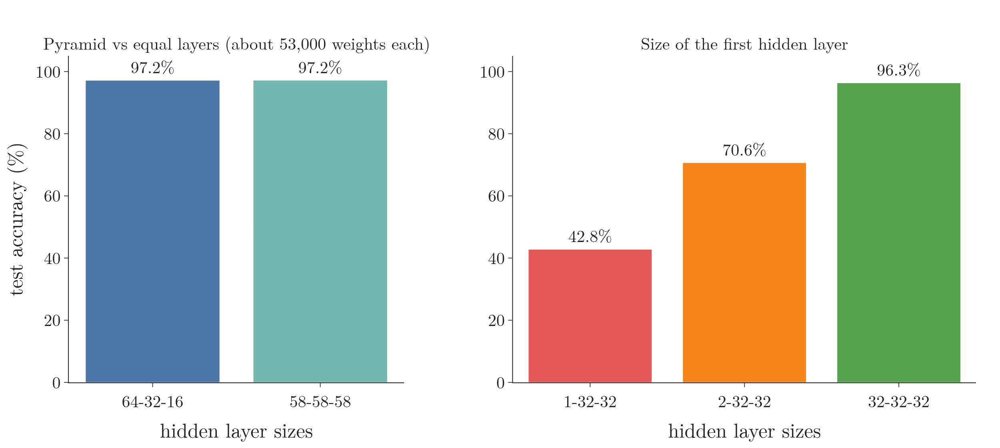
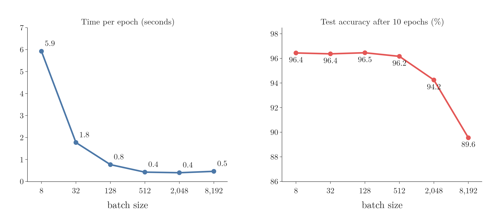
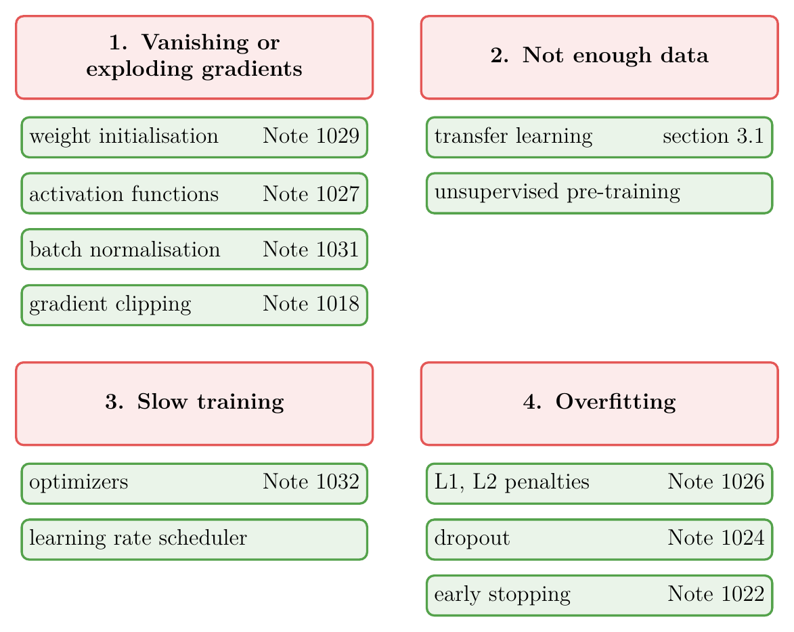

<!-- where-this-fits: generated by course_map/build_map.py; edit concepts.yaml, not this block -->
> **Where this fits:** Pipeline map step 10 (Tune). See the [Course map](../../../00-course-map/00-course-map.md).
>
> 
>
> - **Builds on:** [Overfitting](../../../ML/01-foundations/ML-007-challenges-in-ml/ML-007-challenges-in-ml.md#7-overfitting-and-underfitting); [Training curves (History)](../../../DL/01-basics/DL-011-customer-churn-ann/DL-011-customer-churn-ann.md#8-training-curves); [Backpropagation](../../../DL/01-basics/DL-015-backpropagation-what/DL-015-backpropagation-what.md#4-the-steps-of-backpropagation); [Vanishing gradient](../../../DL/01-basics/DL-018-vanishing-exploding-gradients/DL-018-vanishing-exploding-gradients.md#3-the-vanishing-gradient-problem); [Scaling inputs for neural networks](../../../DL/02-training/DL-023-data-scaling-in-ann/DL-023-data-scaling-in-ann.md#1-overview); [Dropout](../../../DL/02-training/DL-024-dropout/DL-024-dropout.md#4-how-dropout-works).
> - **Leads to:** [Keras Tuner](../../../DL/03-optimizers/DL-039-keras-tuner/DL-039-keras-tuner.md#5-the-keras-tuner-workflow-choosing-the-optimizer).
<!-- /where-this-fits -->

## 1. Overview

> **Key point:** A network gets better in two ways: choose its hyperparameters well, and fix the four problems that break training (vanishing or exploding gradients (gradients are the slopes that tell each weight how to change), too little data, slow training, overfitting).

Building a network in Keras and reaching some accuracy is easy, as the churn, MNIST and admission projects showed. The hard part is taking a network from, say, 90% to 92%. This Note is a map of the techniques that do that; each technique gets its own Note.

{height=45%}

Figure 1 shows the plan:

1. **Tune the hyperparameters** (section 3):
   - the number of hidden layers;
   - the neurons per layer;
   - the learning rate;
   - the optimizer;
   - the batch size;
   - the activation function;
   - the number of epochs.
2. **Fix the problems** (section 4): even with good hyperparameters, a network can train badly. Four problems cause most of it, and each has known fixes.

## 2. Prerequisites

- The [customer churn](../../01-basics/DL-011-customer-churn-ann/DL-011-customer-churn-ann.md#5-compiling-and-training): a Keras network, its training curves and a validation set.
- The [gradient descent in neural networks](../DL-020-gradient-descent-in-neural-networks/DL-020-gradient-descent-in-neural-networks.md#3-where-gradient-descent-sits-in-backpropagation): batch, stochastic and mini-batch gradient descent, and `batch_size`.
- The [vanishing and exploding gradients](../../01-basics/DL-018-vanishing-exploding-gradients/DL-018-vanishing-exploding-gradients.md#3-the-vanishing-gradient-problem).

## 3. Tuning the hyperparameters

> **Key point:** Seven settings that we choose before training decide much of a network's performance.

A **hyperparameter** (G-910) is a setting of an algorithm chosen before training (see the [pipelines](../../../ML/03-feature-engineering/ML-028-pipelines/ML-028-pipelines.md#9-hyperparameter-tuning-with-a-pipeline)); the network does not learn it. In a Keras network, we choose seven of them every time we write the code. Setting them well already improves performance, without any further technique.

### 3.1 Number of hidden layers

> **Key point:** Several narrow hidden layers usually beat one wide one. Keep adding layers until the network starts to overfit (learns the training data too closely, section 4.4).

A network has three kinds of layer:

- the **input layer** (G-952), where the data enters;
- the **output layer** (G-1424), where the prediction comes out;
- the **hidden layers** (G-890) in between.

How many hidden layers to use is the first question.

In theory one hidden layer with many neurons can capture complex patterns. In practice, several hidden layers with fewer neurons each usually work better: deeper models can need far fewer units and often generalise better (**generalisation**, G-838: doing well on new data; Goodfellow et al. 2016, §6.4.1). For example, three hidden layers of 32 neurons give better results in more problems than one hidden layer of 512 neurons. Figure 2 (a) and (b) shows the two shapes.

The reason is **representation learning** (G-1670; see the [what is deep learning](../../01-basics/DL-002-what-is-deep-learning/DL-002-what-is-deep-learning.md#23-the-technical-definition-representation-learning)):

1. the first hidden layers pick up primitive features such as lines and edges;
2. the middle layers combine them into shapes;
3. the last layers combine shapes into complex patterns such as a face.

A deep network captures this hierarchy naturally; one wide layer has to learn everything in a single step.

The hierarchy has a second benefit, **transfer learning** (G-2005; also from the [what is deep learning](../../01-basics/DL-002-what-is-deep-learning/DL-002-what-is-deep-learning.md#54-architectures-and-transfer-learning)):

- Suppose a network was trained to recognise human faces, and a new project needs monkey faces.
- At the primitive level (lines, edges, simple shapes) the two kinds of face look alike.
- So instead of training a new network from scratch, we keep the trained early layers and retrain only the last layers on monkey faces.

{width=85%}

Figure 3 shows the reuse: the copied layers already detect lines, edges and simple shapes, so the new network only has to learn the last step. The [transfer learning](../../04-cnn/DL-053-transfer-learning/DL-053-transfer-learning.md#3-why-transfer-learning) does this in code.

How many layers, then: 3, 30 or 300? We keep adding hidden layers while the results improve, and stop as soon as the network starts to overfit (section 4.4).

### 3.2 Neurons per layer

> **Key point:** The input and output layers are fixed by the data and the problem. For hidden layers, use a sufficient number of neurons: start generous and cut back if the network overfits.

Two layers are already decided:

- **Input layer:** one neuron per **feature** (G-772; an input variable, one column of the data table). A placement problem with the features CGPA and IQ has 2 input neurons.
- **Output layer:** one neuron for **regression** (G-1655) and for binary classification; one neuron per class for **multi-class classification** (G-1266).

For the hidden layers there is no hard and fast rule; people go by experience. An older rule of thumb was the **pyramid structure** (G-1594): fewer neurons in each later hidden layer, for example 64, then 32, then 16. The logic was that there are many primitive features and fewer combined ones.

Experiments later showed that the pyramid makes little difference: three equal hidden layers perform about the same as a 64-32-16 pyramid with the same number of weights (Figure 4, left). So the pyramid is an option, not a rule.

What does matter is that every layer has a **sufficient** number of neurons. Figure 2 (c) shows why. With 2 inputs and a first hidden layer of only 1 neuron, that one neuron has to carry every primitive feature; whatever it ignores is lost, and later layers cannot recover it. So we start with more neurons than we think we need, and reduce them only if the network overfits.

Figure 4 tests both points on the MNIST handwritten digits (see the [MNIST](../../01-basics/DL-012-mnist-ann/DL-012-mnist-ann.md#4-the-network)): networks with ReLU hidden layers, trained for 10 epochs with Adam, each the average of 3 random starts.

- **Pyramid or not (left).** A 64-32-16 pyramid and three equal layers of 58, both with about 53,000 weights, score 97.2 percent each: the shape makes no difference here.
- **A starved first layer (right).** With 32 neurons in the first hidden layer the network scores 96.3 percent. With 2 it scores 70.6 percent, and with 1 only 42.8 percent, although the two layers after it still have 32 neurons each. Whatever the first layer cannot pass on, the later layers never see.

### 3.3 Learning rate and optimizer

> **Key point:** The learning rate sets the step size of gradient descent; the optimizer is the rule that turns gradients into weight updates. Both mainly decide how fast training goes.

The **learning rate** (G-1068) decides how big each **gradient descent** (G-862) step is. Too low, and training is slow; too high, and the steps overshoot and the results are poor (see the [backpropagation why](../../01-basics/DL-017-backpropagation-why/DL-017-backpropagation-why.md#8-why-we-need-a-learning-rate)).

An **optimizer** (G-1401) is the rule that turns the gradients into weight updates. Plain gradient descent is one; in practice we use improved versions, such as **Adam** (G-169), that reach a good solution faster. Since both settings mainly change the training speed, they come up again under slow training (section 4.3).

### 3.4 Batch size

> **Key point:** Small batches (8 to 32) train slowly but generalise well; large batches (up to about 8,192) train fast but are less stable. A learning rate warm-up can give large batches the good results too.

**Mini-batch gradient descent** (G-1222) updates the weights after every `batch_size` observations (see the [gradient descent in neural networks](../DL-020-gradient-descent-in-neural-networks/DL-020-gradient-descent-in-neural-networks.md#6-choosing-the-variant-in-keras-batchsize)). The **batch size** (G-267) is a hyperparameter, and there are two schools of thought:

| | Small batches (8 to 32) | Large batches (up to about 8,192) |
|---|---|---|
| Training speed | slow | fast |
| Training | stable | less stable |
| Results on new data | better, a proven approach | often worse (Keskar et al. 2017) |

The upper limit of a large batch depends on the memory of the **GPU** (G-856).

Figure 5 measures the first and third rows of the table on MNIST, with the 32-32-32 network of Figure 4 trained for 10 epochs at each batch size.

- **Speed (left).** With batches of 8, one epoch is 7,500 weight updates and takes 5.9 seconds. With batches of 512 it is 118 updates and takes 0.4 seconds; beyond that the GPU is already busy and the time stops falling.
- **Results (right).** Batches of 8 to 512 all reach about 96 percent. Batches of 2,048 reach 94.2 percent and batches of 8,192 only 89.6 percent.

Part of that drop is simple counting: in 10 epochs, batches of 8,192 make only 80 weight updates, against 75,000 for batches of 8. A larger learning rate with a warm-up, below, is how large batches make up for the missing updates.

To keep the speed of large batches and still get good results, some researchers use a **learning rate warm-up** (G-1071): the learning rate starts very small in the first epochs and is then increased quickly. Training with large batches and a warm-up is both fast and accurate.

A practical order follows. First try large batches with a warm-up; if it works, we have speed and accuracy. If it does not, fall back to small batches, which are slower but reliably give good results.

> **Extra:** Changing the learning rate during training is the job of a **learning rate scheduler** (G-1070; section 4.3). The warm-up idea comes from Goyal and colleagues (Goyal et al. 2017, §2.2), who trained an image network with batches of 8,192 images in one hour by warming up over the first 5 epochs and scaling the learning rate in proportion to the batch size.

### 3.5 Activation function

> **Key point:** The choice of activation function decides, among other things, whether gradients vanish.

**Sigmoid** (G-1798) was the **activation function** (G-165) of the early Notes. Switching the hidden layers to another function, **ReLU** (G-1668) above all, is one of the fixes for the **vanishing gradient** (G-2070; section 4.1). The options are compared in the [activation functions](../DL-027-activation-functions/DL-027-activation-functions.md#3-what-an-activation-function-is).

### 3.6 Epochs

> **Key point:** Set a large number of epochs and let early stopping end training when the validation results stop improving.

How long should we train? Some people try 100 epochs, then 500, then 1,000. The better answer is to set a large number of **epochs** (G-696) and use **early stopping** (G-656; see the [batch gradient descent](../../../ML/06-regression/ML-057-batch-gradient-descent/ML-057-batch-gradient-descent.md#5-early-stopping)): during training, Keras watches the results on the validation data and stops once they no longer improve. In Keras it is a **callback** (G-341), taught in [early stopping](../DL-022-early-stopping/DL-022-early-stopping.md#4-early-stopping-in-keras).

## 4. Fixing the four problems

> **Key point:** Vanishing or exploding gradients, not enough data, slow training and overfitting. Each has its own set of fixes.

{width=85%}

Figure 6 is the right half of Figure 1 as a reading list: each fix points to the Note that teaches it.

### 4.1 Vanishing and exploding gradients

> **Key point:** Fixes: better weight initialisation, other activation functions, batch normalisation, and gradient clipping for exploding gradients.

With sigmoid in a deep network, the gradients shrink layer by layer on the way back, and the early layers stop learning; with factors above 1 they explode instead (**exploding gradient**, G-731; see the [vanishing and exploding gradients](../../01-basics/DL-018-vanishing-exploding-gradients/DL-018-vanishing-exploding-gradients.md#3-the-vanishing-gradient-problem)). Four fixes:

- **Weight initialisation:** start the **weights** (G-2106) from well-chosen random values instead of all 1 or 0.1 (see the [weight initialisation](../DL-029-weight-initialization/DL-029-weight-initialization.md#3-why-the-starting-weights-matter)).
- **Activation function:** replace sigmoid with ReLU or one of its variants (see the [activation functions](../DL-027-activation-functions/DL-027-activation-functions.md#8-relu)).
- **Batch normalisation** (G-266): a more recent technique, widely used today (see the [batch normalisation](../DL-031-batch-normalization/DL-031-batch-normalization.md#4-how-batch-normalisation-works-during-training)).
- **Gradient clipping** (G-861): caps the size of the gradients; it is used for exploding gradients only (see the [vanishing and exploding gradients](../../01-basics/DL-018-vanishing-exploding-gradients/DL-018-vanishing-exploding-gradients.md#73-gradient-clipping)).

> **Extra:** Keras does not start from equal weights. A `Dense` layer draws its starting weights at random from the Glorot uniform scheme (**Glorot initialisation**, G-850) and sets its biases to 0 (Keras docs, `Dense`).

### 4.2 Not enough data

> **Key point:** Deep learning is data hungry. Without enough data, reuse a network trained on similar data (transfer learning), or pre-train on unlabelled data.

The biggest difference between ML and DL is that deep learning needs a lot of data: it is **data hungry** (G-534; see the [what is deep learning](../../01-basics/DL-002-what-is-deep-learning/DL-002-what-is-deep-learning.md#41-data)). Two techniques help when we have too little:

- **Transfer learning** (section 3.1): reuse a network that someone trained on a large, similar dataset, at least its early layers.
- **Unsupervised pre-training** (G-2059): first train the early layers on plenty of unlabelled data, then train the whole network on the few labelled **observations** (G-1374; records, one row of the data table each).

### 4.3 Slow training

> **Key point:** Better optimizers and a learning rate scheduler make training faster, and often the results better too.

Two techniques speed up training:

- **Optimizers** other than plain gradient descent, such as Adam, which the Keras projects already used.
- A learning rate scheduler, which changes the learning rate as the epochs go by, like the warm-up of section 3.4.

### 4.4 Overfitting

> **Key point:** A network with millions of weights easily overfits. Fixes: L1 and L2 regularisation, dropout, and early stopping.

**Overfitting** (G-1429) means learning the training data too closely, noise included, so that the model fails on new data (see the [bias-variance](../../../ML/06-regression/ML-061-bias-variance/ML-061-bias-variance.md#5-the-trade-off)). A deep network has many parameters, some have millions of weights, so it tends to overfit. Three fixes have their own Notes:

- **L1 and L2 regularisation** (G-1026, G-1029), as for linear models (see the [ridge regression](../../../ML/06-regression/ML-062-ridge-regression-intuition/ML-062-ridge-regression-intuition.md#3-the-idea-penalise-large-coefficients)), adapted to networks in [regularisation in deep learning](../DL-026-regularization-in-dl/DL-026-regularization-in-dl.md#5-the-penalty-term).
- **Dropout** (G-639): switch off random neurons during training (see the [dropout](../DL-024-dropout/DL-024-dropout.md#4-how-dropout-works)).
- **Early stopping** (section 3.6, and the [early stopping](../DL-022-early-stopping/DL-022-early-stopping.md#4-early-stopping-in-keras)).

## 5. Summary

| Route | What to do | Main effect |
|---|---|---|
| Hidden layers | several narrow layers; stop adding when it overfits | captures a hierarchy of features |
| Neurons per layer | sufficient, start generous; pyramid optional | no feature lost early |
| Learning rate, optimizer | tune; use Adam and similar | training speed |
| Batch size | large with warm-up, else 8 to 32 | speed against generalisation |
| Activation function | ReLU and its variants in hidden layers | avoids vanishing gradients |
| Epochs | many, with early stopping | trains just long enough |
| Vanishing or exploding gradients | initialisation, activation, batch normalisation, clipping | early layers learn |
| Not enough data | transfer learning, unsupervised pre-training | needs less labelled data |
| Slow training | optimizers, learning rate scheduler | faster training |
| Overfitting | L1 and L2 regularisation, dropout, early stopping | better results on new data |

- Hyperparameters first: good values alone already improve a network.
- Deep and narrow beats shallow and wide; it also makes transfer learning possible.
- Never starve a layer of neurons: what an early layer drops is lost for good.
- The four problems each have their own Notes, starting with early stopping.

## 6. Sources

**Built from**

- CampusX, "How to Improve the Performance of a Neural Network", YouTube, https://www.youtube.com/watch?v=Ue_6n1yT_R8

**Other references**

- Goodfellow, Bengio and Courville, *Deep Learning*, MIT Press, 2016, §6.4.1 (depth reduces the number of units needed; deeper models generalise better in their experiments).
- Keskar et al., "On Large-Batch Training for Deep Learning: Generalization Gap and Sharp Minima", ICLR 2017 (large batches give worse results on new data).
- Goyal et al., "Accurate, Large Minibatch SGD: Training ImageNet in 1 Hour", arXiv:1706.02677, 2017 (linear scaling of the learning rate; 5-epoch warm-up; batches of 8,192).
- Keras documentation, `keras.layers.Dense` (defaults `kernel_initializer="glorot_uniform"`, `bias_initializer="zeros"`).

## 7. Key terms

| Term | Meaning |
|---|---|
| Pyramid structure | Hidden layers with fewer neurons in each later layer, such as 64-32-16; an old rule of thumb, not needed |
| Optimizer | The rule that turns gradients into weight updates, such as plain gradient descent or Adam |
| Learning rate warm-up | Starting training with a very small learning rate and raising it over the first epochs |
| Learning rate scheduler (G-1070) | A rule that changes the learning rate as training goes on |
| Unsupervised pre-training | Training a network's early layers on unlabelled data before training it on the labelled data |
