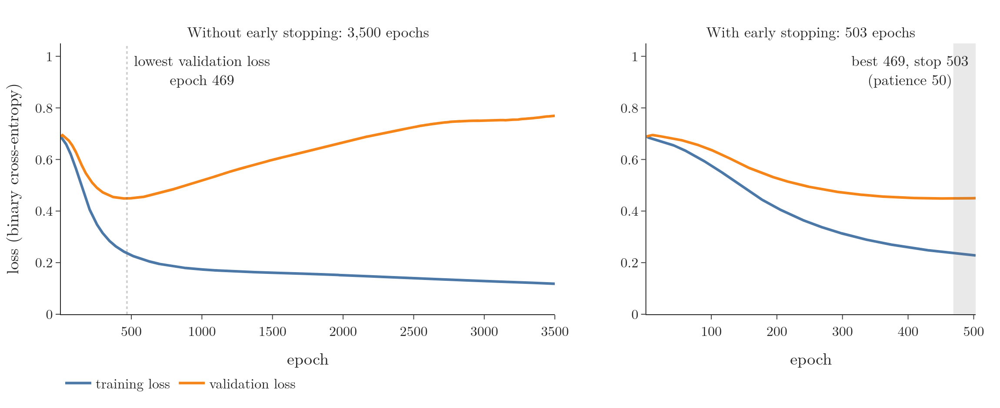
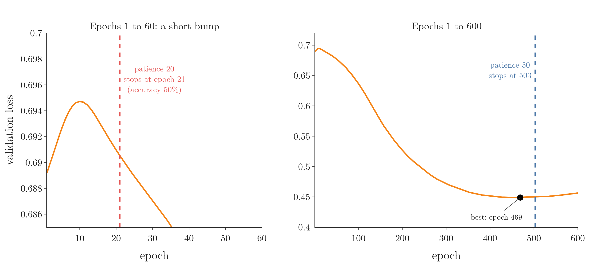

<!-- where-this-fits: generated by course_map/build_map.py; edit concepts.yaml, not this block -->
> **Where this fits:** Pipeline map steps 8 (Model), 9 (Evaluate), 10 (Tune). See the [Course map](../../../00-course-map/00-course-map.md).
>
> 
>
> - **Builds on:** [Early stopping](../../../ML/06-regression/ML-057-batch-gradient-descent/ML-057-batch-gradient-descent.md#5-early-stopping); [Keras workflow](../../../DL/01-basics/DL-011-customer-churn-ann/DL-011-customer-churn-ann.md#4-building-a-network-in-keras); [Training curves (History)](../../../DL/01-basics/DL-011-customer-churn-ann/DL-011-customer-churn-ann.md#8-training-curves).
<!-- /where-this-fits -->

## 1. Overview

> **Key point:** Instead of guessing the number of epochs, we set a large number and let Keras stop training once the validation loss stops improving.

Every call to `fit` needs a number of **epochs** (G-696; full passes over the training data): 100, 1,000, 10,000? Training too long is not harmless. On some data the network starts to overfit (**overfitting**, G-1429): its results keep improving on the training data and get worse on new data. Think of baking a cake: we do not trust a fixed timer, we check the cake and take it out when it is done. **Early stopping** (G-656; first met in [stopping gradient descent early](../../../ML/06-regression/ML-057-batch-gradient-descent/ML-057-batch-gradient-descent.md#5-early-stopping)) means stopping training when the score on held-out data is best; this Note shows how Keras does it for us (Goodfellow et al. 2016, §7.8).



In Figure 1 the horizontal axis is the epoch and the vertical axis is the loss. The blue line is the loss on the training data, and the orange line is the **validation loss**: the loss on held-out data (observations not used to adjust the weights). Watch where the orange line turns upward. The Note has three parts:

1. section 3 trains a network for 3,500 epochs and watches it overfit;
2. section 4 adds the `EarlyStopping` callback;
3. section 5 explains its settings.

The Notebook (`DL-022-early-stopping.ipynb`) runs every step.

## 2. Prerequisites

- [`fit`, epochs and training curves](../../01-basics/DL-011-customer-churn-ann/DL-011-customer-churn-ann.md#52-fit-epochs), with validation data.
- [Variance and overfitting](../../../ML/06-regression/ML-061-bias-variance/ML-061-bias-variance.md#3-variance).
- [The fixes for overfitting](../DL-021-improving-a-neural-network/DL-021-improving-a-neural-network.md#44-overfitting): where early stopping fits among them.

## 3. Training too long

> **Key point:** After 3,500 epochs, the training loss is still falling but the validation loss has risen since epoch 469: the network overfits.

### 3.1 The data and the network

> **Key point:** 100 points in two noisy circles; one hidden layer of 256 ReLU nodes.

The data comes from scikit-learn's `make_circles` (G-110): 100 points, an inner circle (class 1) inside an outer one (class 0), with noise. The data uses three terms:

- each point is an **observation** (G-1374; one record, one row of the data table);
- its two coordinates are the **features** (G-772; the input variables);
- its class, 0 or 1, is the **target** (G-1949; the output we predict).

We use 50 points for training and 50 for validation.

The network has three layers:

- an **input layer** (G-952) of 2 nodes, one per feature;
- one **hidden layer** (G-890) of 256 **ReLU** (G-1668) nodes (a ReLU node returns its weighted sum if that is positive and 0 otherwise);
- a **sigmoid** (G-1798) output node (it squashes its sum into 0 to 1, the probability of class 1).

The **trainable parameters** (G-1065) are the weights and biases:

$$2 \times 256 + 256 = 768 \text{ in the hidden layer}$$

$$256 \times 1 + 1 = 257 \text{ in the output node}$$

$$768 + 257 = 1{,}025$$

The network is compiled with **Adam** (G-169; the rule that updates the weights) and **binary cross-entropy** (G-303; the loss for two classes).

> **Python:** The data and the network.
>
> ```python
> from sklearn.datasets import make_circles
>
> X, y = make_circles(n_samples=100, noise=0.1, random_state=1)
> X_train, X_test, y_train, y_test = train_test_split(
>     X, y, test_size=0.5, random_state=2)
>
> model = keras.Sequential([
>     keras.Input(shape=(2,)),
>     keras.layers.Dense(256, activation="relu"),
>     keras.layers.Dense(1, activation="sigmoid"),
> ])
> model.compile(optimizer="adam", loss="binary_crossentropy",
>               metrics=["accuracy"])
> ```

### 3.2 3,500 epochs

> **Key point:** The gap between the two curves keeps widening after epoch 469.

We train for 3,500 epochs, passing the **validation set** (G-2067; the 50 held-back points, used to measure the model but never to adjust its weights) as `validation_data` (`validation_split` would work too, see [tracking a validation set](../../01-basics/DL-011-customer-churn-ann/DL-011-customer-churn-ann.md#73-tracking-accuracy-and-a-validation-set)). With `verbose=0` Keras prints nothing during training.

> **Python:** Training for 3,500 epochs.
>
> ```python
> history = model.fit(X_train, y_train, epochs=3500,
>                     validation_data=(X_test, y_test), verbose=0)
> ```

Figure 1 (left) plots both losses:

| Epoch | Training loss | Validation loss | Validation accuracy |
|---|---|---|---|
| 1 | 0.690 | 0.689 | 50% |
| 469 | 0.237 | **0.449** (lowest) | 76% |
| 1,000 | 0.174 | 0.518 | 74% |
| 2,000 | 0.151 | 0.668 | 70% |
| 3,500 | 0.118 | 0.769 | 74% |

Up to epoch 469 the validation loss (orange) falls. After that it rises, while the training loss (blue) keeps falling. The widening gap between the curves says the network is overfitting: it keeps fitting the 50 training points better at the expense of new points.

So the right number of epochs here was about 470. The other 3,000 epochs cost time and made the model worse.

> **Extra:** The **decision boundary** (G-555; the line where the predicted class switches) hardly changes after epoch 469 (Figure 2): what grows is the network's confidence. Its predicted probabilities move towards 0 and 1, and every validation point on the wrong side then costs more loss. Growing confidence is why the validation loss rises by 70% while the validation accuracy only moves between 70% and 76%. The Notebook checks both halves of this story: the two models give the same class on 98% of the plotted area, and the average distance of a validation prediction from 0.5 grows from 0.30 to 0.42. A misclassified validation point now costs 2.74 on average instead of 1.25.


In Figure 2 and in the right panel of Figure 3, the background colour is the class the network predicts there: orange for class 0 (the outer ring), blue for class 1 (the inner cluster). The black line is the decision boundary, where the prediction switches class. These are predicted classes, not a loss surface.

## 4. Early stopping in Keras

> **Key point:** An `EarlyStopping` object passed to `fit` as a callback stops training once the validation loss has not improved for a set number of epochs.

### 4.1 Callbacks

> **Key point:** A callback is an object whose code Keras runs at set points in training, for example after every epoch.

Keras implements early stopping as a **callback** (G-341): an object whose code Keras runs at set points during training, here after every epoch. After each epoch, the `EarlyStopping` callback checks whether the monitored score has improved. If it has not improved for long enough, it stops training (Keras docs, EarlyStopping). Keras has other callbacks too, such as one that changes the learning rate during training.

### 4.2 The same network with early stopping

> **Key point:** Same model, same compile; only `callbacks=[callback]` is new. Training stops at epoch 503, 34 epochs after the best one.

We build and compile exactly the same network, with the same starting weights. Then we create an `EarlyStopping` object and pass it to `fit` in a list.

> **Python:** Adding the callback.
>
> ```python
> from keras.callbacks import EarlyStopping
>
> callback = EarlyStopping(
>     monitor="val_loss",
>     min_delta=0.00001,
>     patience=50,
>     verbose=1,
>     mode="auto",
>     baseline=None,
>     restore_best_weights=False,
> )
> history = model.fit(X_train, y_train, epochs=3500,
>                     validation_data=(X_test, y_test),
>                     verbose=0, callbacks=[callback])
> # Epoch 503: early stopping
> ```
>
> `epochs=3500` is now only an upper limit. `callbacks` takes a list, so several callbacks can run together.

Training stops by itself at epoch 503 (Figure 1, right). The best validation loss, 0.449, was at epoch 469, the same epoch as in the long run. But the drops after epoch 453 were each smaller than `min_delta` (0.00001), so they did not count as improvements. Keras then:

1. counted from epoch 453;
2. waited 50 epochs for a real improvement;
3. saw none, and stopped.

Figure 3 replays this run. The black dot marks the best epoch as Keras counts it, with `min_delta`: epoch 453, not 469. Watch the patience counter: it stays at 0 while the validation loss keeps falling, climbs once the curve flattens, and stops training at 50. The second part lets the same run go on to epoch 3,500: the validation loss rises, while the decision boundary barely changes.

{width=100%}

The result:

| | Epochs | Validation loss | Validation accuracy |
|---|---|---|---|
| 3,500 epochs | 3,500 | 0.769 | 74% |
| Early stopping | 503 | 0.450 | 76% |

The model trained in 14% of the epochs is better on the validation data. In Figure 2 its decision boundary is a smoother version of the long-trained one. With real data, this is how we train: set a generous upper limit and leave the decision to early stopping.

## 5. The settings of `EarlyStopping`

> **Key point:** `monitor` says what to watch, `min_delta` how much counts as an improvement, `patience` how long to wait, `restore_best_weights` whether to go back to the best epoch.

The table follows the Keras documentation (Keras docs, EarlyStopping).

| Setting | Meaning | Our value |
|---|---|---|
| `monitor` | the quantity to watch | `"val_loss"` |
| `min_delta` | the smallest change that counts as an improvement | 0.00001 |
| `patience` | how many epochs without improvement before stopping | 50 |
| `verbose` | 1 prints the epoch at which training stopped | 1 |
| `mode` | `"min"`, `"max"` or `"auto"`: whether lower or higher is better | `"auto"` |
| `baseline` | a value the monitored quantity must beat, or training stops | `None` |
| `restore_best_weights` | at the end, put back the weights of the best epoch | `False` |

### 5.1 monitor and mode

> **Key point:** Usually the validation loss; `mode="auto"` works out from the name whether lower or higher is better.

We almost always monitor a score on the validation data, because that is where overfitting shows. The validation loss is the usual choice; the validation accuracy also works.

For a loss, lower is better, so training stops when it stops decreasing (`mode="min"`). For an accuracy, higher is better, so training stops when it stops increasing (`mode="max"`). With `mode="auto"` Keras works this out from the name of the monitored quantity, which is right in almost every case.

### 5.2 min_delta and patience

> **Key point:** Patience lets training ride out short bumps; too little patience stops training too early.

`min_delta` sets how much the monitored quantity must improve to count. A drop of the validation loss smaller than `min_delta` counts as no improvement.

**Patience** (G-1466) is the number of epochs without improvement that Keras waits before stopping. With `patience=3`, it waits 3 epochs; with `patience=5`, 5. Waiting matters because the validation loss does not move smoothly: it can rise for a few epochs and then fall again.

Our data shows this. In the first epochs the validation loss rises a little, from 0.6892 at epoch 1 to 0.6947 at epoch 10, before it starts its long fall. With `patience=20` the Notebook stops at epoch 21 with 50% validation accuracy, before the network has learned anything. With `patience=50` it waits out this bump.



In Figure 4 the horizontal axis is the epoch and the vertical axis is the validation loss. Figure 4 shows why epoch 21. The best validation loss so far is still the one of epoch 1, 0.6892: the loss rose until epoch 10 and at epoch 21 it is falling again but has not yet got back below 0.6892. So epochs 2 to 21 are 20 epochs "without improvement", and patience 20 is used up just as the network starts to learn. Patience 50 lasts long enough for the loss to beat its epoch-1 value (at epoch 25), and then the counter only runs out after the true best epoch, 469.

### 5.3 baseline

> **Key point:** Stop if the monitored quantity does not beat a given value; rarely used.

`baseline` is a value the monitored quantity must beat. If it does not improve on the baseline within the patience window, training stops. Choosing such a number needs a good understanding of the data, so it is usually left at `None`.

### 5.4 restore_best_weights

> **Key point:** With `True`, the model ends with the weights of the best epoch, not the last one.

When training stops at epoch 503, the model holds the weights of epoch 503, not of the best epoch 469. With `restore_best_weights=True`, Keras keeps a copy of the best weights and puts them back at the end.

Here the difference is tiny: validation loss 0.449 with the restored weights against 0.450 without, because the loss barely moved in those 34 epochs. With a larger patience or a faster-rising validation loss, the difference grows, so `True` is a sensible choice to try.

## 6. Summary

| | Without early stopping | With early stopping |
|---|---|---|
| Epochs | fixed, chosen by guessing | upper limit; Keras stops |
| Here | 3,500 epochs, validation loss 0.769 | 503 epochs, validation loss 0.450 |
| Risk | overfitting, wasted time | stopping too early if patience is small |

- Training too long overfits: the training loss falls while the validation loss rises.
- `EarlyStopping` is a callback: it checks the validation loss after every epoch and stops when it has not improved for `patience` epochs, so training ends soon after the best epoch without guessing.
- Monitor a validation score, because that is where overfitting shows; leave `mode="auto"`, because Keras works out from the name whether lower or higher is better.
- Give it enough patience to ride out short bumps; consider `restore_best_weights=True`, so the model ends with the weights of the best epoch, not the last one.

So the number of epochs no longer has to be guessed: set a large limit and let the validation loss decide when to stop (503 epochs here instead of 3,500).

## 7. Sources

**Built from**

- CampusX, "Early Stopping In Neural Networks | End to End Deep Learning Course", YouTube, https://www.youtube.com/watch?v=Ygvskt5HadI

**Other references**

- Goodfellow, I., Bengio, Y. and Courville, A., *Deep Learning*, MIT Press, 2016, §7.8 "Early Stopping" (stop when the validation error has not improved for a set number of steps).
- Keras documentation, Callbacks API: EarlyStopping, keras.io/api/callbacks/early_stopping (the meaning of `monitor`, `min_delta`, `patience`, `mode`, `baseline` and `restore_best_weights`).

## 8. Key terms

Terms taught in this Note come first; linked terms are recaps, taught in the Note the link opens.

| Term | Meaning |
|---|---|
| Callback (G-341) | An object whose code Keras runs at set points during training, for example after every epoch. |
| Patience (G-1466) | How many passes over the training data (epochs) in a row without improvement training waits before early stopping ends it. |
| `EarlyStopping` (G-76) | The Keras callback that stops training when a monitored quantity stops improving. |
| `min_delta` (G-118) | The smallest change of the monitored quantity that counts as an improvement. |
| `restore_best_weights` (G-135) | `EarlyStopping` setting that puts back the weights of the best epoch at the end. |
| [Epoch](../../../DL/01-basics/DL-005-perceptron-trick/DL-005-perceptron-trick.md#7-loops-and-epochs) (G-696) | One full update of the parameters using the whole training set. |
| [Overfitting](../../../ML/01-foundations/ML-007-challenges-in-ml/ML-007-challenges-in-ml.md#71-overfitting) (G-1429) | Learning the training data too closely, noise included; fails on new data. |
| [Early stopping](../../../ML/06-regression/ML-057-batch-gradient-descent/ML-057-batch-gradient-descent.md#5-early-stopping) (G-656) | Stopping training when the score on held-out data is best, before full convergence; this keeps coefficients small, so it also acts as regularisation. |
| [`make_circles`](../../../DL/02-training/DL-027-activation-functions/DL-027-activation-functions.md#41-an-experiment-linear-activations-on-circles) (G-110) | scikit-learn function that generates two concentric rings of observations, one ring per class. |
| [Observation](../../../ML/01-foundations/ML-003-types-of-ml/ML-003-types-of-ml.md#21-learning-from-inputs-and-outputs) (G-1374) | One record of a dataset: one row of the data table. |
| [Feature](../../../ML/01-foundations/ML-002-ai-vs-ml-vs-dl/ML-002-ai-vs-ml-vs-dl.md#52-features-chosen-by-us-or-learned) (G-772) | One piece of information about each example that a model uses (e.g. a student's CGPA). |
| [Target](../../../ML/01-foundations/ML-003-types-of-ml/ML-003-types-of-ml.md#21-learning-from-inputs-and-outputs) (G-1949) | The output column we predict, such as the class; also called the label. |
| [Input layer](../../../DL/01-basics/DL-002-what-is-deep-learning/DL-002-what-is-deep-learning.md#22-the-parts-of-a-neural-network) (G-952) | The first layer of a neural network, with one node per input column; it takes in the data and passes the values on without calculating anything. |
| [Hidden layer](../../../DL/01-basics/DL-002-what-is-deep-learning/DL-002-what-is-deep-learning.md#22-the-parts-of-a-neural-network) (G-890) | A layer of neurons between the input and output layers; it works on the output of the layer before and passes what it finds on, so the network can build up more complex patterns. |
| [ReLU](../../../DL/02-training/DL-027-activation-functions/DL-027-activation-functions.md#8-relu) (G-1668) | Rectified linear unit, the activation $\max(0, z)$: it passes a positive input unchanged and turns a negative one into 0; the usual default activation for hidden layers. |
| [Sigmoid function](../../../ML/07-classification/ML-071-sigmoid-function/ML-071-sigmoid-function.md#4-the-sigmoid-function) (G-1798) | An S-shaped function that squashes any number into the range 0 to 1, $\sigma(z) = 1/(1 + e^{-z})$; it turns a score into a probability, as in logistic regression. |
| [Learnable (trainable) parameters](../../../DL/04-cnn/DL-046-cnn-vs-ann/DL-046-cnn-vs-ann.md#51-counting-the-parameters-of-a-convolution-layer) (G-1065) | The weights and biases that training changes; for a convolution layer, the filter values and one bias per filter. |
| [Adam](../../../DL/03-optimizers/DL-038-adam/DL-038-adam.md#4-the-update-rule) (G-169) | An optimizer, the rule that updates a network's weights to reduce the loss: a variant of gradient descent that keeps running averages of past gradients and of their squares, giving each weight its own step size; fairly robust to its settings, so a common default. |
| [Binary cross entropy (log loss)](../../../ML/07-classification/ML-072-log-loss/ML-072-log-loss.md#62-the-loss-function) (G-303) | The loss function of logistic regression for two classes: per row $-y\log a - (1 - y)\log(1 - a)$, averaged over the rows (the average cross entropy). |
| [Validation set](../../../DL/01-basics/DL-011-customer-churn-ann/DL-011-customer-churn-ann.md#73-tracking-accuracy-and-a-validation-set) (G-2067) | Data held back from training to check and tune a model before the final test. |
| [Decision boundary](../../../ML/01-foundations/ML-006-instance-vs-model-based/ML-006-instance-vs-model-based.md#41-learning-a-decision-boundary) (G-555) | A line or curve that separates the classes in classification. |
