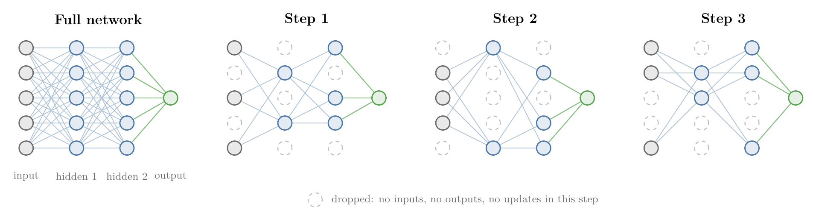
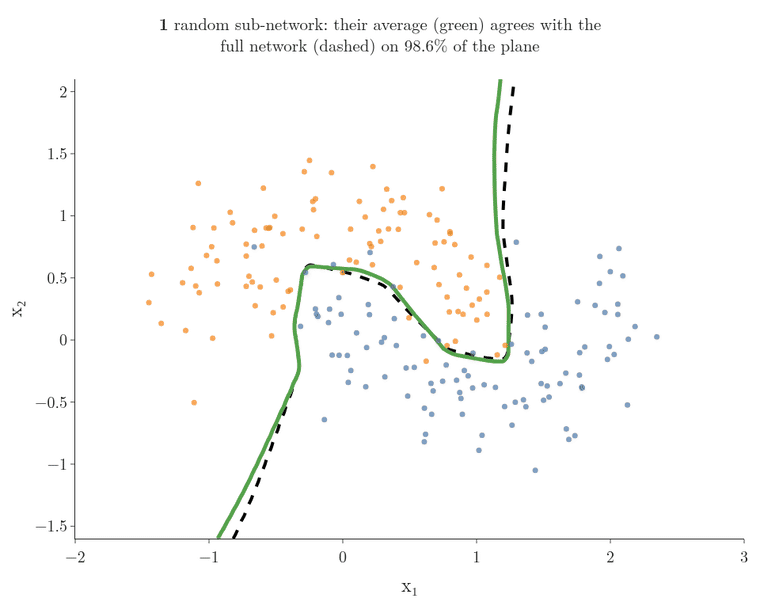
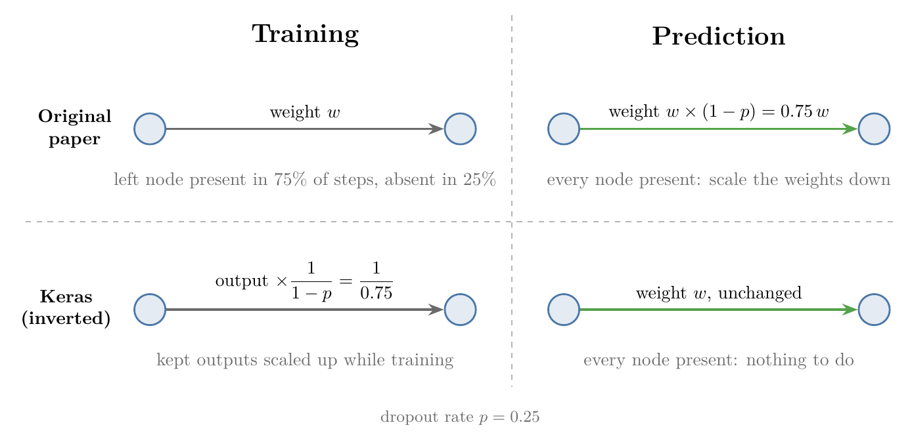

<!-- where-this-fits: generated by course_map/build_map.py; edit concepts.yaml, not this block -->
> **Where this fits:** Pipeline map step 8 (Model). See the [Course map](../../../00-course-map/00-course-map.md).
>
> 
>
> - **Builds on:** Overfitting ([Note ML-007](../../../ML/01-foundations/ML-007-challenges-in-ml/ML-007-challenges-in-ml.md)); Regularisation ([Note ML-062](../../../ML/06-regression/ML-062-ridge-regression-intuition/ML-062-ridge-regression-intuition.md)).
> - **Compare with:** Random forest ([Note ML-108](../../../ML/08-trees-and-ensembles/ML-108-feature-importance/ML-108-feature-importance.md)); L1 and L2 regularisation in neural networks ([Note DL-026](../../../DL/02-training/DL-026-regularization-in-dl/DL-026-regularization-in-dl.md)); Batch normalisation ([Note DL-031](../../../DL/02-training/DL-031-batch-normalization/DL-031-batch-normalization.md)).
<!-- /where-this-fits -->

## 1. Overview

> **Key point:** Dropout fights overfitting by switching off a random set of nodes at every training step, so the network trains a different, smaller sub-network each time. At prediction time every node is back.

Neural networks overfit easily (**overfitting**, G-1429), and **dropout** (G-639) is one of the most used remedies. Dropout was proposed by Nitish Srivastava, Geoffrey Hinton and colleagues (Hinton et al. 2012; Srivastava et al. 2014), and since then it has become a standard part of training networks.



Figure 1 shows the idea. This Note explains:

- how dropout works (section 4);
- why switching nodes off helps (section 5);
- what happens at prediction time (section 6).

Code for regression and classification is in the [dropout code Note](../DL-025-dropout-code/DL-025-dropout-code.md).

## 2. Prerequisites

- The [bias-variance Note](../../../ML/06-regression/ML-061-bias-variance/ML-061-bias-variance.md): overfitting.
- The [random forest Note](../../../ML/08-trees-and-ensembles/ML-102-random-forest-intro/ML-102-random-forest-intro.md): column sampling and voting.
- The [improving a neural network Note](../DL-021-improving-a-neural-network/DL-021-improving-a-neural-network.md): where dropout sits among the fixes.

## 3. Overfitting in neural networks

> **Key point:** Many layers of many fully connected nodes can capture every small pattern of the training data, noise included. Five fixes: more data, a simpler network, early stopping, regularisation, dropout.

Overfitting is learning the training data too closely, noise included, so that the model does well on the training data and poorly on new data (see the [bias-variance Note](../../../ML/06-regression/ML-061-bias-variance/ML-061-bias-variance.md)). In a classification problem, an overfitted model has a wiggly **decision boundary** (G-555; the line or curve separating the classes) that wraps around every training point; a good model has a smoother decision boundary that captures the real pattern.

Neural networks are prone to overfitting, for three reasons:

- they have several layers, each with many nodes;
- the layers are all fully connected (**dense layers**, G-583);
- they are trained for many **epochs** (G-696).

Such a complex **architecture** (G-209) can capture tiny patterns that only exist in the training data.

The possible fixes:

1. **Add more data.** The more varied data the network sees, the better it generalises (**generalisation**, G-838).
2. **Reduce the complexity** of the network: for example 7 hidden layers instead of 10, or 64 nodes per layer instead of 128.
3. **Early stopping** (G-656): stop training where overfitting starts (see the [early stopping Note](../DL-022-early-stopping/DL-022-early-stopping.md)).
4. **Regularisation** (G-1659), L1 or L2, as in Ridge and Lasso (see the [regularisation in deep learning Note](../DL-026-regularization-in-dl/DL-026-regularization-in-dl.md)).
5. **Dropout**, the subject of this Note.

## 4. How dropout works

> **Key point:** At each training step, every node of the input and hidden layers is switched off with probability p, the dropout rate. The output layer is never dropped.

### 4.1 Switching nodes off

> **Key point:** A dropped node has no connections in that step: it sends nothing, receives nothing, and its weights are not updated.

Take a binary classification problem with 5 **features** (G-772; input variables, one column of the data table each). The network (Figure 1, left) has:

- an **input layer** (G-952) of 5 nodes;
- two **hidden layers** (G-890) of 5 nodes each;
- an **output layer** (G-1424) of 1 node.

With **dropout**, before each training step we randomly switch off some nodes of the input layer and of the hidden layers. A switched-off node is cut from the network for that step: its weights and bias play no part in the prediction, and **backpropagation** (G-247) does not update them. In Figure 1, step 1 drops 2 input nodes, 3 nodes of the first hidden layer and 2 of the second. Step 2 draws a new random set: some of the dropped nodes come back and others go.

So each step trains a different network on the data. Every one of them is a smaller **sub-network** (G-1909) of the full network, using a subset of its nodes and the same shared weights.

{width=100%}

In Figure 2, watch the crosses jump between steps: 4, 3, 1 and then 7 of the 15 droppable nodes are off, because every node is dropped independently (section 4.2). The last frame previews prediction time (section 6).

> **Extra:** The masks are redrawn for every forward pass, which in Keras means for every **mini-batch** (G-263; and each **observation** (G-1374), one record, in the batch gets its own mask), not once per epoch (Keras docs, `Dropout`). With 10 epochs of 100 mini-batches, the network trains on about 1,000 different sub-networks, not 10.

### 4.2 The dropout rate

> **Key point:** p is the probability of dropping each node; it can differ from layer to layer.

The **dropout rate** (G-638) $p$ is the fraction of a layer's nodes to drop. With $p = 0.5$, each node of that layer is switched off with probability 0.5, so on average half the layer is gone in each step. With $p = 0.25$, each node is switched off with probability 0.25, so on average one node in four is gone; with a layer of 100 nodes that is about 25 nodes. Each layer can have its own rate; typical values come in the [dropout code Note](../DL-025-dropout-code/DL-025-dropout-code.md).

## 5. Why switching nodes off helps

> **Key point:** Three views of the same effect: a smaller network each step; no node can rely on one input; and many sub-networks vote, like a random forest.

Breaking the network on purpose sounds like it should make it worse. In practice it makes it better: in the original experiments, dropout improved even strong networks by about 1 to 2 percentage points (Srivastava et al. 2014, §6), which is a big jump when the accuracy is already 95%.

### 5.1 A smaller network in every step

> **Key point:** Fewer active nodes means fewer connections, so less capacity to fit tiny details.

There are two ways to reduce overfitting in a network: reduce the number of nodes, or stop nodes from focusing on one particular pattern. Dropout does both.

Every sub-network is smaller than the full one. Fewer nodes mean fewer connections and so fewer possibilities to fit small details of the training data. Each step, the network simply does not have the resources to capture very fine patterns.

### 5.2 No node can rely on one input

> **Key point:** Since any input may vanish in the next step, a node spreads its weights over all its inputs instead of leaning on one.

Take one node of the second hidden layer, receiving input from 4 nodes of the first. Depending on the data, it may start to rely mostly on one of them: one large weight and three small ones. The node is then focused on one particular pattern.

With dropout, that favourite input is missing in some steps. The node cannot know whether it will be there in the next step, so it has to make use of the other three too. Its attention is divided over all its inputs, the weights become more balanced, and the network ignores small, isolated patterns in favour of the overall pattern of the data.

A company analogy helps. Suppose every morning, a random half of the employees is told to stay at home. Each employee can no longer depend on one particular colleague (the only tester, say) and learns to work with several. The company as a whole becomes more resilient: insensitive to the absence of any one person. For a company this may cost productivity; for a neural network it works.

### 5.3 An ensemble, like a random forest

> **Key point:** Dropout trains a huge number of sub-networks that share their weights; prediction combines them, as a random forest combines its trees.

A **random forest** (G-1611) trains many **decision trees** (G-561), each on a random sample of the features (**column sampling**, G-413; see the [random forest Note](../../../ML/08-trees-and-ensembles/ML-102-random-forest-intro/ML-102-random-forest-intro.md), section 5.3), and lets them vote. The trees differ a little from each other, and the vote of the **ensemble** (G-690) overfits much less than any one tree.

Dropout does the same with networks. Each training step trains a different sub-network on the data; at prediction time their knowledge is combined. And the number of possible sub-networks is enormous:

1. **In words:** every droppable node is either present or absent, 2 options each, so $n$ droppable nodes give $2^n$ sub-networks.
2. **Formula:**
   $$\text{number of sub-networks} = 2^{n}$$
3. **Example:** a network with 4 inputs, 4 hidden nodes and 1 output has $n = 8$ droppable nodes (the output is never dropped): $2^8 = 256$ sub-networks. The network of Figure 1 has $n = 15$: $2^{15} = 32{,}768$.

With so many possibilities, the same sub-network is very unlikely to come up twice in training. Training for 100 steps trains 100 different networks, close relatives because they share weights, and the final network behaves like their ensemble (Srivastava et al. 2014, §1). The ensemble view is why dropout is often compared with a random forest.

Figure 3 checks the ensemble view on a trained network. A network with two hidden layers of 128 ReLU nodes and $p = 0.5$ after each was trained on 200 points of `make_moons` (two interleaved half-moons, the data of the [regularisation in deep learning Note](../DL-026-regularization-in-dl/DL-026-regularization-in-dl.md)). Then we pick sub-networks: for each one, a single random set of nodes is switched off, and the same sub-network classifies every point of the plane.



In Figure 3, each line is a decision boundary: the places where a network's output is 0.5, so the predicted class switches from one side to the other. No background is coloured here, and the lines are not contours of a loss surface.

- **Single sub-networks (grey)** all follow the two moons where the training points are, but disagree far from them, for example at the bottom left and top right.
- **Their average (green)** settles as more sub-networks are added. With 20 or more, it agrees with the full network on 99.8 percent of the plane.
- **The full network (dashed)** therefore behaves like the vote of many sub-networks, without running any of them separately. Section 6 explains the scaling that makes this work.

## 6. Dropout at prediction time

> **Key point:** Dropout is applied only during training. At prediction every node is present, and each weight is multiplied by $1 - p$ to make up for it.

During testing and prediction no node is dropped: every node and every connection is active. Using every node creates a mismatch. During training, a node was present only part of the time, so the nodes after it got used to receiving its signal only that often. At prediction it is always present.

The fix is to scale the weights down by the probability that the node was present.

1. **In words:** a node dropped with probability $p$ was present in a fraction $1 - p$ of the training steps; its outgoing weights are multiplied by $1 - p$ at prediction.
2. **Formula:**
   $$w_{\text{test}} = w \times (1 - p)$$
3. **Example:** with $p = 0.25$, a node is present in about 75 of 100 training steps. A weight $w = 0.8$ learned in training becomes
   $$w_{\text{test}} = 0.8 \times (1 - 0.25) = 0.6$$
   On average, the next node then receives the same signal at prediction as it did during training.

Figure 4 (top row) shows this. We never have to do it by hand: Keras handles it behind the scenes.



> **Extra:** Keras uses **inverted dropout** (G-970; Figure 4, bottom). During training it divides the output of every kept node by $1 - p$; at prediction it does nothing (Keras docs, `Dropout`). Both versions give the next layer the same average input.

> **Python:** A `Dropout(0.25)` layer on a row of eight 1s.
>
> ```python
> import keras, numpy as np
> keras.utils.set_random_seed(0)
> drop = keras.layers.Dropout(0.25)
> x = np.ones((1, 8), "float32")
> drop(x, training=True)   # [1.333 1.333 1.333 0 1.333 0 1.333 1.333]
> drop(x, training=False)  # [1 1 1 1 1 1 1 1]
> ```
>
> In training, two of the eight values are dropped and the others become $1/0.75 = 1.333$. `fit` passes `training=True` automatically; `predict` and `evaluate` pass `training=False`.

## 7. Summary

| | During training | During prediction |
|---|---|---|
| Nodes | each input and hidden node dropped with probability $p$ | all present |
| Network | a different random sub-network every step | the full network |
| Weights (original paper) | $w$ | $w \times (1 - p)$ |
| Keras (inverted dropout) | kept outputs divided by $1 - p$ | unchanged |

- Dropout switches off random nodes at each training step; the output layer is never dropped.
- A smaller network each step, and no node can rely on a single input: both reduce overfitting.
- With $n$ droppable nodes there are $2^n$ sub-networks; dropout trains an ensemble of them, like a random forest.
- At prediction every node is back, with its weights scaled by $1 - p$ (Keras does the equivalent automatically).

## 8. Sources

**Built from**

- CampusX, "Dropout Layer in Deep Learning | Dropouts in ANN | End to End Deep Learning", YouTube, https://www.youtube.com/watch?v=gyTlcHVeBjM

**Other references**

- Hinton, Srivastava, Krizhevsky, Sutskever and Salakhutdinov, "Improving neural networks by preventing co-adaptation of feature detectors", arXiv:1207.0580, 2012.
- Srivastava, Hinton, Krizhevsky, Sutskever and Salakhutdinov, "Dropout: A Simple Way to Prevent Neural Networks from Overfitting", *JMLR*, 2014: §1 ($2^n$ thinned networks, approximate averaging), §6 (results).
- Keras documentation, `keras.layers.Dropout` (applied at each training step; kept inputs scaled by $1/(1 - \text{rate})$).

## 9. Key terms

| Term | Meaning |
|---|---|
| Dropout | Switching off a random set of input and hidden nodes at every training step, to reduce overfitting |
| Dropout rate ($p$) | The probability that each node of a layer is switched off in a training step |
| Sub-network | The smaller network left after some nodes are switched off; it shares the full network's weights |
| Inverted dropout | Dropout that scales the kept outputs up by $1/(1-p)$ during training, so prediction needs no change; what Keras does |
