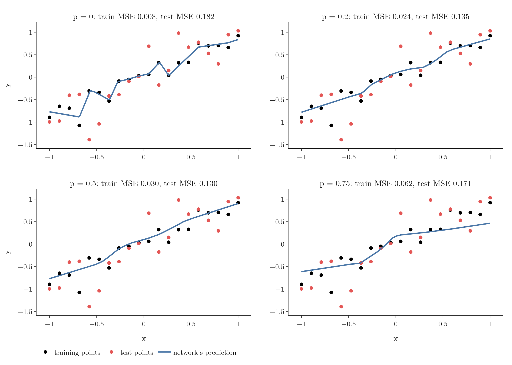
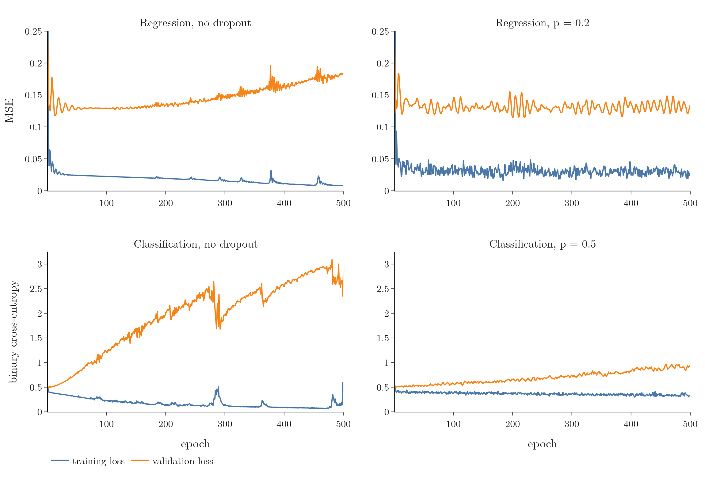
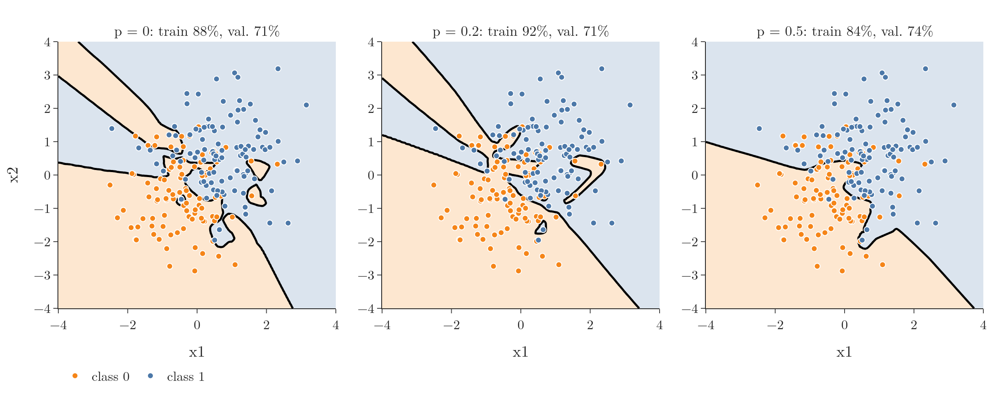
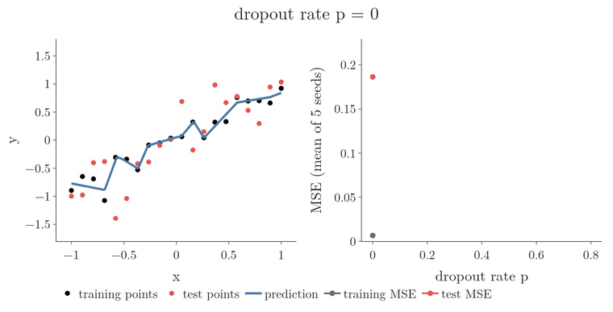

<!-- where-this-fits: generated by course_map/build_map.py; edit concepts.yaml, not this block -->
> **Where this fits:** Pipeline map step 8 (Model). See the [Course map](../../../00-course-map/00-course-map.md).
>
> 
>
> - **Builds on:** [Overfitting](../../../ML/01-foundations/ML-007-challenges-in-ml/ML-007-challenges-in-ml.md#7-overfitting-and-underfitting); [Regularisation](../../../ML/06-regression/ML-062-ridge-regression-intuition/ML-062-ridge-regression-intuition.md#1-overview); [Multi-layer perceptron (MLP)](../../../DL/01-basics/DL-003-nn-types-history-applications/DL-003-nn-types-history-applications.md#21-multi-layer-perceptron-mlp).
> - **Leads to:** [Keras Tuner](../../../DL/03-optimizers/DL-039-keras-tuner/DL-039-keras-tuner.md#5-the-keras-tuner-workflow-choosing-the-optimizer); [Image classification with a CNN (cats vs dogs)](../../../DL/04-cnn/DL-049-cat-vs-dog-cnn/DL-049-cat-vs-dog-cnn.md#3-the-dataset); [Keras functional API](../../../DL/04-cnn/DL-054-keras-functional-api/DL-054-keras-functional-api.md#1-overview).
> - **Compare with:** [Random forest](../../../ML/08-trees-and-ensembles/ML-108-feature-importance/ML-108-feature-importance.md#5-feature-importance-in-a-random-forest); [L1 and L2 regularisation in neural networks](../../../DL/02-training/DL-026-regularization-in-dl/DL-026-regularization-in-dl.md#10-key-terms); [Batch normalisation](../../../DL/02-training/DL-031-batch-normalization/DL-031-batch-normalization.md#4-how-batch-normalisation-works-during-training).
<!-- /where-this-fits -->

## 1. Overview

> **Key point:** A `Dropout` layer after each hidden layer turns the theory into one line of Keras. On two small problems it smooths the model, shrinks the gap between training and validation loss, and improves the score on new data.

[How dropout works](../DL-024-dropout/DL-024-dropout.md#4-how-dropout-works) explained **dropout** (G-639): switch off a random fraction $p$ of the nodes at every training step. This Note applies it to two small problems, one regression and one classification, and then asks how to choose $p$.



Every number in the tables is the average of 5 training runs with different random seeds; the figures show one of those runs, so the numbers in a figure's panel titles differ a little from the tables (for example, Figure 3's left panel shows 88% training accuracy for that run, against the 5-run average of 95%). Each panel of Figure 1 plots the network's output $y$ (vertical axis) against its input $x$ (horizontal axis). The question for each panel is how closely the blue curve follows the black points, and whether it also fits the red points it never saw. Figure 1 is the main result:

- without dropout, the network bends to pass through every training point;
- with $p = 0.2$ or $0.5$, the network follows the trend;
- with $p = 0.75$, the network no longer fits the data well.

The Notebook (`DL-025-dropout-code.ipynb`) runs every step.

## 2. Prerequisites

- [How dropout works](../DL-024-dropout/DL-024-dropout.md#4-how-dropout-works): switching nodes off at each training step.
- [Training curves](../../01-basics/DL-011-customer-churn-ann/DL-011-customer-churn-ann.md#8-training-curves): loss against epochs for training and validation data.
- [A regression network](../../01-basics/DL-013-graduate-admission-ann/DL-013-graduate-admission-ann.md#41-the-linear-output-node): a network with a linear output node and the MSE loss.

## 3. Dropout for regression

> **Key point:** Without dropout: training MSE 0.006, test MSE 0.186. With $p = 0.2$: 0.024 and 0.134. Training gets worse, testing gets better, and the gap shrinks.

### 3.1 The data and the network

> **Key point:** 20 noisy points on the line $y = x$; two hidden layers of 128 ReLU nodes; 500 epochs.

The data is made up. Each **observation** (G-1374; one record, one row of the data table) is a point with:

- one **feature** (G-772; input variable) $x$;
- a **target** (G-1949; the output we predict) $y$.

There are 20 training points with $x$ evenly spaced from $-1$ to $1$ and $y = x$ plus random noise, and 20 test points at the same $x$ values with fresh noise. The true relationship is a straight line, so a good model is close to a line.

The network is deliberately too big for 20 points:

- an input node;
- two **hidden layers** (G-890) of 128 **ReLU** (G-1668) nodes;
- a **linear** (G-1089) output node.

The network is compiled with **Adam** (G-169; **learning rate** (G-1068) 0.01) and the **mean squared error** (G-1201) as loss (see [mean squared error](../../01-basics/DL-014-dl-loss-functions/DL-014-dl-loss-functions.md#5-mean-squared-error)), and trained for 500 **epochs** (G-696). Training for that long on so little data invites **overfitting** (G-1429).

### 3.2 Without dropout

> **Key point:** The prediction zigzags through the training points; the test MSE is about 30 times the training MSE.

| | Training MSE | Test MSE |
|---|---|---|
| No dropout | 0.006 | 0.186 |

The network fits its 20 training points almost exactly, but its error on the test points is about 30 times larger. Figure 1 (top left) shows why: the blue curve bends to pass through the black training points, and these bends mean nothing for the red test points.

Figure 2 (top left) gives the second sign. Each panel plots the loss (vertical axis) against the epoch (horizontal axis). The training loss (blue) is the loss on the training points. The validation loss (orange) is the loss on data held out from training (here the 20 test points). The validation loss is lowest early on, then rises steadily, while the training loss (blue) keeps falling. The gap between them is overfitting.



### 3.3 With dropout

> **Key point:** One `Dropout(0.2)` layer after each hidden layer; everything else is the same.

The new model has the same layers, with a **`Dropout` layer** after each hidden layer. `Dropout(0.2)` switches off each node of the layer before it with probability 0.2 at each training step. We do not put dropout after the output layer, because every sub-network must still give a full prediction (see [the output layer is never switched off](../DL-024-dropout/DL-024-dropout.md#41-switching-nodes-off)).

> **Python:** The regression network with dropout.
>
> ```python
> model = keras.Sequential([
>     keras.Input(shape=(1,)),
>     keras.layers.Dense(128, activation="relu"),
>     keras.layers.Dropout(0.2),
>     keras.layers.Dense(128, activation="relu"),
>     keras.layers.Dropout(0.2),
>     keras.layers.Dense(1, activation="linear"),
> ])
> model.compile(optimizer=keras.optimizers.Adam(learning_rate=0.01),
>               loss="mse")
> model.fit(X_train, y_train, epochs=500,
>           validation_data=(X_test, y_test))
> ```
>
> A `Dropout` layer has no weights of its own; it only acts on the outputs of the layer before it, and only during training.

| | Training MSE | Test MSE |
|---|---|---|
| No dropout | 0.006 | 0.186 |
| $p = 0.2$ | 0.024 | 0.134 |

The training error rose, and the test error fell by a quarter. In Figure 1 (top right) the curve is much smoother: it reacts less to the small ups and downs of the training points and follows the overall trend. In Figure 2 (top right) the validation loss no longer climbs and the gap between the curves stays the same over the 500 epochs.

> **Extra:** The training loss that Keras prints during `fit` is computed with dropout switched on, on the shrunken **sub-networks** (G-1909), so it is noisier and higher than the loss of the full network. The table's training MSE comes from `evaluate`, which runs the full network with dropout off (Keras FAQ, training versus testing loss). Dropout during training is why the blue curve in Figure 2 (top right) is jagged.

## 4. Dropout for classification

> **Key point:** Without dropout: 95% training accuracy, 69% validation accuracy and a wiggly decision boundary. With $p = 0.5$: 85% and 74%, a smoother decision boundary, and a validation loss three times smaller.

### 4.1 The data and the network

> **Key point:** Two overlapping clouds of 200 points each; the same network with a sigmoid output.

The data is again made up: two clouds of points with two features, class 1 centred at $(0.6, 0.6)$ and class 0 at $(-0.6, -0.6)$, each with standard deviation 1 (a typical distance of a point from its cloud's centre). The clouds overlap, so some points of each class sit in the other's region: a straight line separates them reasonably, but not perfectly. There are 200 training points and 200 validation points.

The network is the same as in section 3, with 2 inputs and a **sigmoid** (G-1798) output node for binary classification, trained with **binary cross-entropy** (G-303) for 500 epochs.

### 4.2 The results

> **Key point:** $p = 0.2$ is not enough here; $p = 0.5$ removes most of the small islands.

| Dropout rate | Training accuracy | Validation accuracy | Final validation loss |
|---|---|---|---|
| 0 | 95% | 69% | 2.80 |
| 0.2 | 91% | 70% | 1.76 |
| 0.5 | 85% | 74% | 0.86 |

Without dropout (Figure 3, left), the **decision boundary** (G-555; the line or curve separating the two classes) is irregular: it builds small islands and long fingers to capture individual points of one class in the other's region. The islands and fingers come from the noise of the training data and will not hold on new data. The validation loss climbs from 0.5 to almost 3 (Figure 2, bottom left), while the training loss keeps falling.



In Figure 3, the background colour is the class the network predicts at that spot: orange for class 0, blue for class 1. The black line is the decision boundary, where the prediction switches class.

With $p = 0.2$ the validation loss is lower, but the decision boundary still has islands and the validation accuracy barely improves (69% to 70%). The overfitting tendency is reduced, not removed.

With $p = 0.5$ the decision boundary (Figure 3, right) is much simpler: one main dividing line with only small bends near the overlap. The validation accuracy rises from 69% to 74%, and the validation loss falls from 2.80 to 0.86. In Figure 2 (bottom right) the gap between the curves still grows slowly, but far less than without dropout.

Dropout is a form of **regularisation** (G-1659; any method that reduces overfitting, such as the [penalty on large weights](../../../ML/06-regression/ML-062-ridge-regression-intuition/ML-062-ridge-regression-intuition.md#3-the-idea-penalise-large-coefficients)); because it works by random choices, it is sometimes called **regularisation by randomisation** (G-1657).

## 5. Choosing the dropout rate

> **Key point:** Too small a $p$ leaves overfitting; too large a $p$ underfits. Try values between 0.2 and 0.5.

Figure 1 shows all four rates on the regression problem:

| Dropout rate | Training MSE | Test MSE | In Figure 1 |
|---|---|---|---|
| 0 | 0.006 | 0.186 | zigzags through the training points: overfitting |
| 0.2 | 0.024 | 0.134 | smoother |
| 0.5 | 0.029 | 0.128 | smoother still, close to a line |
| 0.75 | 0.053 | 0.165 | too flat at the right end: underfitting |

1. **In words:** as $p$ grows, the training error always rises. The test error first falls, then rises again.
2. **The rule:** small $p$ overfits; large $p$ underfits (**underfitting**, G-2035). The best $p$ is in between.
3. **Example:** here the test MSE is lowest at $p = 0.5$ (0.128). At $p = 0.75$, three out of four nodes are dropped at each step, the curve can no longer reach the points at the right end, and the test MSE climbs back to 0.165.

Figure 4 sweeps $p$ from 0 to 0.8 in steps of 0.1 (5 seeds per rate). Watch the two curves on the right part ways: the training MSE (grey) only rises, while the test MSE (red) drops at once, stays low from 0.1 to 0.5 with its minimum at 0.5, and climbs again from 0.6 as the fit on the left turns flat.

{width=100%}

The same holds for classification: $p = 0.2$ was too little, $p = 0.5$ worked. The **dropout rate** (G-638) is a **hyperparameter** (G-910), so the final choice comes from trying a few values.

## 6. Practical tips

> **Key point:** Raise $p$ if the network overfits, lower it if it underfits; try dropout on the last hidden layer first; typical rates are 0.2 to 0.5.

1. **Overfitting: increase $p$. Underfitting: decrease $p$.** This follows directly from section 5.
2. **Start with the last hidden layer.** Many well-performing architectures put dropout only after the last hidden layer. So rather than adding dropout everywhere at once, try it there first, check the effect, then add it to other layers. The last hidden layers are usually the largest, so they are where dropout does most to limit the model: AlexNet's last two hidden layers hold more than 40 million parameters, and dropout is applied to them (d2l §8.1.2.3, §8.1.4). Layers near the input usually get a lower rate (d2l §5.6.2.1).
3. **Typical rates by type of network:**

| Network | Typical dropout rate |
|---|---|
| Convolutional networks (CNNs) | 40% to 50% on the fully connected layers |
| Recurrent networks (RNNs) | 20% to 30% |
| ANNs (multi-layer perceptrons) | 10% to 50%, depending on the problem |

Rates above 50% rarely help.

Why the rates differ:
- **CNNs:** the rate is for the large fully connected layers at the end. The original dropout paper's convolutional network dropped 50% of the fully connected nodes, but only 10% to 25% in the earlier layers (Srivastava et al. 2014, §6.1.2).
- **RNNs:** the recurrence passes each step's state to the next step, so dropout noise gets amplified over time and hurts learning (Zaremba et al. 2014, §2). A study of RNN models found that 50% lowered accuracy and advised 20% to 40% (Gajbhiye et al. 2018, §4.4).

> **Extra:** The original dropout paper used a lower rate on the input layer than on the hidden layers: it kept input nodes with probability 0.8 ($p = 0.2$) and hidden nodes with probability 0.5 ($p = 0.5$) (Srivastava et al. 2014, Appendix A.4). Dropping too many inputs throws away information that no later layer can recover.

## 7. Drawbacks

> **Key point:** Training converges more slowly, and the loss changes from step to step, which makes gradients (the slopes of the loss, which tell each weight how to change) harder to check and the network harder to debug.

Dropout has two main costs:

1. **Slower convergence** (G-472). Each step trains only part of the network, so the network takes longer to reach good weights and biases. Experiments show training with dropout needs more epochs: the original paper reports that a dropout network typically takes 2 to 3 times longer to train (Srivastava et al. 2014, §9).
2. **A loss that keeps changing.** At each training step the loss is computed from a different sub-network, because a different set of nodes is missing, so in effect the loss function itself changes every step. The changing loss makes the gradients (the slopes of the loss, which tell each weight how to change) hard to interpret and debugging harder: when training goes wrong, it is difficult to tell whether something is broken or the loss is just jumping around (compare the jagged blue curves of Figure 2).

Apart from these, dropout has few downsides, and it usually helps. For the mathematics, the original paper (Srivastava et al. 2014, about 30 pages) is worth reading once.

## 8. Summary

| | No dropout | $p$ = 0.2 | $p$ = 0.5 | $p$ = 0.75 |
|---|---|---|---|---|
| Regression: training MSE | 0.006 | 0.024 | 0.029 | 0.053 |
| Regression: test MSE | 0.186 | 0.134 | **0.128** | 0.165 |
| Classification: training accuracy | 95% | 91% | 85% | |
| Classification: validation accuracy | 69% | 70% | **74%** | |

- In Keras, dropout is a `Dropout(p)` layer placed after the layer whose nodes it drops; never after the output layer, because every sub-network must still give a full prediction.
- Dropout raises the training error and lowers the test error: smoother curves and decision boundaries, smaller gaps between the training curves.
- Small $p$ overfits, large $p$ underfits, because at $p$ = 0.75 three nodes in four are gone each step and the network can no longer fit the data; try 0.2 to 0.5, starting with the last hidden layer, because the large layers near the output are where dropout limits the model most; RNNs take lower rates, because the recurrence amplifies dropout noise.
- The price: slower training and a loss that is harder to monitor, because each step trains only part of the network and the loss comes from a different sub-network every step.

So one `Dropout` line, with $p$ between 0.2 and 0.5, lowered the error on new data in both problems here.

## 9. Sources

**Built from**

- CampusX, "Dropout Layers in ANN | Code Example | Regression | Classification", YouTube, https://www.youtube.com/watch?v=tgIx04ML7-Y

**Other references**

- Srivastava, Hinton, Krizhevsky, Sutskever and Salakhutdinov, "Dropout: A Simple Way to Prevent Neural Networks from Overfitting", *JMLR*, 2014, Appendix A.4 (dropout rates), §6.1.2 (convolutional network: 10% to 25% dropout in the input and convolutional layers, 50% in the fully connected layers), §9 (longer training time).
- Zhang, A., Lipton, Z. C., Li, M. and Smola, A. J. *Dive into Deep Learning*, d2l.ai, §5.6.2.1 (a lower dropout probability closer to the input layer), §8.1.2.3 and §8.1.4 (AlexNet controls the complexity of its fully connected layers with dropout; those last two layers hold more than 40 million parameters).
- Zaremba, W., Sutskever, I. and Vinyals, O. (2014). Recurrent Neural Network Regularization. arXiv:1409.2329. §2 (conventional dropout works badly in RNNs because the recurrence amplifies noise).
- Gajbhiye, A., Jaf, S., Al Moubayed, N., McGough, A. S. and Bradley, S. (2018). An Exploration of Dropout with RNNs for Natural Language Inference. *ICANN 2018*. arXiv:1810.08606. §4.4 (a 0.5 rate lowered accuracy; a range of 0.2 to 0.4 is advised).
- Keras FAQ, "Why is my training loss much higher than my testing loss?" (dropout is off at test time; the training loss is averaged over the epoch's batches).

## 10. Key terms

| Term | Meaning |
|---|---|
| `Dropout` layer | Keras layer that switches off a fraction $p$ of the previous layer's outputs at each training step; inactive at prediction |
| Regularisation by randomisation | A name for dropout: reducing overfitting through random choices during training |
