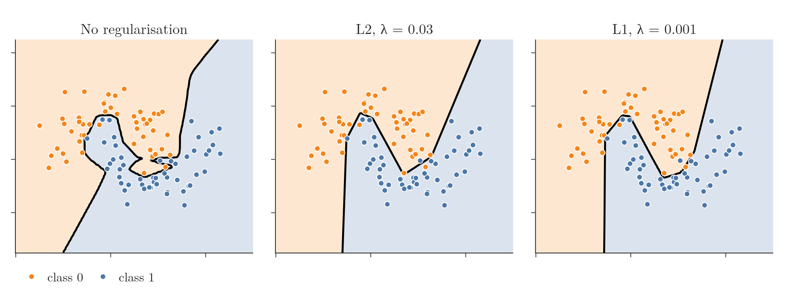
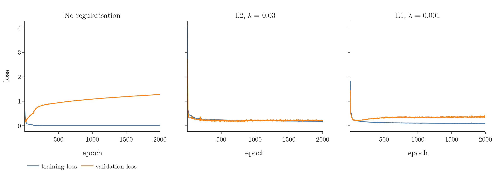
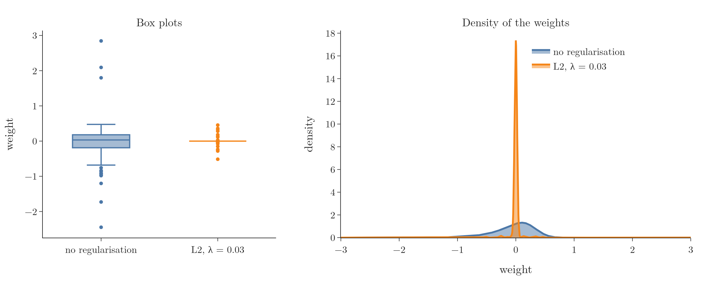
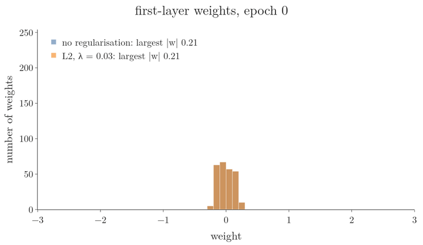
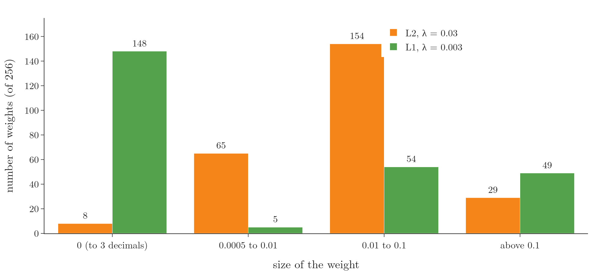
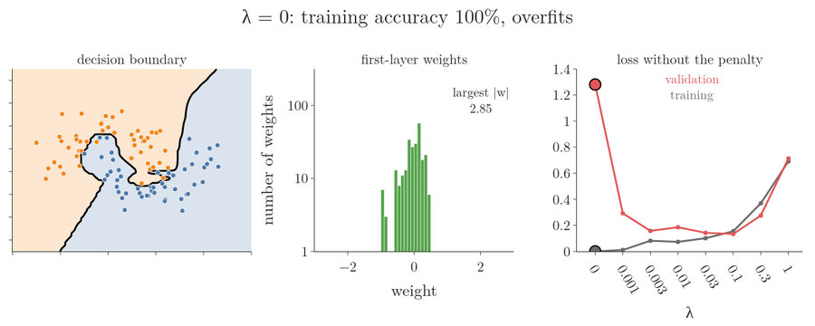

<!-- where-this-fits: generated by course_map/build_map.py; edit concepts.yaml, not this block -->
> **Where this fits:** Pipeline map steps 8 (Model), 9 (Evaluate). See the [Course map](../../../00-course-map/00-course-map.md).
>
> 
>
> - **Builds on:** [Train-test split](../../../ML/01-foundations/ML-012-toy-project/ML-012-toy-project.md#6-training-and-test-sets); [Gradient descent](../../../ML/06-regression/ML-056-gradient-descent/ML-056-gradient-descent.md#7-gradient-descent-as-a-class); [Vector magnitude, distance and scalar operations](../../../MA/05-linear-algebra/MA-049-magnitude-distance-and-scalar-operations/MA-049-magnitude-distance-and-scalar-operations.md#2-magnitude-the-distance-from-the-origin); [Multi-layer perceptron (MLP)](../../../DL/01-basics/DL-003-nn-types-history-applications/DL-003-nn-types-history-applications.md#21-multi-layer-perceptron-mlp).
> - **Leads to:** [Hyperparameter tuning](../../../DL/03-optimizers/DL-039-keras-tuner/DL-039-keras-tuner.md#3-the-problem-too-many-choices); [Keras Tuner](../../../DL/03-optimizers/DL-039-keras-tuner/DL-039-keras-tuner.md#5-the-keras-tuner-workflow-choosing-the-optimizer); [Image classification with a CNN (cats vs dogs)](../../../DL/04-cnn/DL-049-cat-vs-dog-cnn/DL-049-cat-vs-dog-cnn.md#3-the-dataset); [Data augmentation](../../../DL/04-cnn/DL-050-data-augmentation/DL-050-data-augmentation.md#1-overview); [Transfer learning (feature extraction and fine-tuning)](../../../DL/04-cnn/DL-053-transfer-learning/DL-053-transfer-learning.md#3-why-transfer-learning); [Keras functional API](../../../DL/04-cnn/DL-054-keras-functional-api/DL-054-keras-functional-api.md#1-overview).
> - **Compare with:** [Polynomial regression](../../../ML/06-regression/ML-060-polynomial-regression/ML-060-polynomial-regression.md#1-overview); [Ridge regression](../../../ML/06-regression/ML-065-ridge-key-points/ML-065-ridge-key-points.md#1-overview); [Lasso regression](../../../ML/06-regression/ML-067-lasso-sparsity/ML-067-lasso-sparsity.md#1-overview); [Decision surface and boundary](../../../ML/07-classification/ML-085-knn/ML-085-knn.md#5-decision-surfaces); [Underfitting](../../../ML/07-classification/ML-085-knn/ML-085-knn.md#6-how-k-controls-overfitting-and-underfitting); [Dropout](../../../DL/02-training/DL-025-dropout-code/DL-025-dropout-code.md#3-dropout-for-regression).
<!-- /where-this-fits -->

## 1. Overview

> **Key point:** Adding a penalty on the size of the weights to the loss pushes every weight towards 0 at each update. The network becomes simpler and overfits less. In Keras it is one argument per layer: `kernel_regularizer`.

Regularisation was taught for linear models: Ridge adds the squared coefficients to the loss, Lasso their absolute values (see [penalising large coefficients](../../../ML/06-regression/ML-062-ridge-regression-intuition/ML-062-ridge-regression-intuition.md#3-the-idea-penalise-large-coefficients) and [Lasso on one feature](../../../ML/06-regression/ML-066-lasso-regression/ML-066-lasso-regression.md#2-one-feature-the-slope-reaches-exactly-0)). The **loss** is the number that scores how wrong the predictions are, and training makes it small by changing the weights. The same idea works for neural networks, where it is used whenever a network overfits.



In every decision-boundary figure of this Note, the background colour is the class the network predicts at that spot: orange for class 0, blue for class 1. The black line is the **decision boundary** (G-555), where the prediction switches class. These are predicted classes, not a loss surface.

Figure 1 shows the effect. This Note covers:

- why networks overfit (section 3);
- the ways to fight it (section 4);
- the penalty and why it shrinks the weights (sections 5 and 6);
- the Keras code with its results (section 7).

The Notebook (`DL-026-regularization-in-dl.ipynb`) runs every step.

## 2. Prerequisites

- [Ridge: penalising large coefficients](../../../ML/06-regression/ML-062-ridge-regression-intuition/ML-062-ridge-regression-intuition.md#3-the-idea-penalise-large-coefficients), [the ridge gradient](../../../ML/06-regression/ML-064-ridge-gradient-descent/ML-064-ridge-gradient-descent.md#2-the-gradient) and [Lasso](../../../ML/06-regression/ML-066-lasso-regression/ML-066-lasso-regression.md#2-one-feature-the-slope-reaches-exactly-0).
- [Bias and variance](../../../ML/06-regression/ML-061-bias-variance/ML-061-bias-variance.md#3-variance): overfitting and underfitting.
- [Loss versus cost function](../../01-basics/DL-014-dl-loss-functions/DL-014-dl-loss-functions.md#4-loss-function-versus-cost-function).

## 3. Why neural networks overfit

> **Key point:** Each neuron can contribute one more line to the decision boundary. With hundreds of neurons, the boundary can bend around every training point.

Overfitting means a model does very well on the training data and poorly on new data: it memorises the training data, minor patterns included, instead of learning the concept (see [variance](../../../ML/06-regression/ML-061-bias-variance/ML-061-bias-variance.md#3-variance)). Like a student who learns every formula by heart without understanding: new questions in the exam go badly.

Complex models such as neural networks or very deep decision trees are prone to it, because their training aims to make no mistake on the training data. The main cause is the complexity of the network: many nodes, all connected to each other.

Figure 2 makes this concrete. A network with one hidden layer is trained on the same 100 points, with more and more neurons in that layer.


How to read Figure 2: one panel per network, from 1 neuron to 1,000. The black line is the decision boundary of each. Look at how it changes from a straight line in the first panel to a line that wraps around single points in the last.

| Hidden neurons | Training accuracy | Decision boundary |
|---|---|---|
| 1 | 86% | a straight line |
| 10 | 94% | a few straight segments |
| 50 | 96% | more segments, following the moons |
| 1,000 | 100% | bends and pockets around single points |

Why does the decision boundary bend more as we add neurons? Figure 3 shows it step by step on the same 100 points.


- **The line that separates the two classes.** The black line in every panel splits the plane into an orange side and a blue side. The model predicts class 0 on one side and class 1 on the other. This separating line is the **decision boundary** (G-555).
- **What one hidden neuron does.** A neuron with the **ReLU** activation (G-1668) outputs 0 on one side of a straight line and a growing positive value on the other side. That straight line is the neuron's **hyperplane** (G-911): the dashed grey lines in Figure 3 (a worked example follows this list).
- **1 neuron.** The output can only turn one neuron's value up or down, so the decision boundary is a single straight line, parallel to that neuron's hyperplane (top left). A perceptron gives the same kind of boundary.
- **Many neurons.** Between the dashed lines no neuron switches on or off, so the decision boundary runs straight there. It can change direction only where it meets a dashed line. A boundary made of straight segments joined at bends is **piecewise linear** (G-1496; Goodfellow et al. 2016, §6.3.1 and §6.4.1).
- **Counting the segments.** In our runs the decision boundary has 1, 8, 30 and 383 straight segments for 1, 10, 50 and 1,000 neurons (Notebook). With 10 or 50 neurons, a few dozen segments are enough to follow the two moons.
- **Too many segments.** With 1,000 neurons there are so many places to bend that the decision boundary wraps small pockets around single training points. The four circled points are fitted only by the 1,000-neuron network. The model has learned the noise in these 100 points, not the moon shape: this is **overfitting** (G-1429).

**A hyperplane on numbers.** Take a neuron with weights 1 and −1 on the two features $x_1$ and $x_2$, and bias 0. Its input is

$$1 \times x_1 + (-1) \times x_2 + 0 = x_1 - x_2$$

At two points:

$$(3, 1): \quad 3 - 1 = 2 > 0, \quad \text{ReLU passes } 2$$

$$(1, 3): \quad 1 - 3 = -2 < 0, \quad \text{ReLU outputs } 0$$

The hyperplane is where the input is exactly 0:

$$x_1 - x_2 = 0, \quad \text{that is} \quad x_1 = x_2$$

In general a neuron with weights $\mathbf{w}$ (the list of its weights, here $(1, -1)$), features $\mathbf{x}$ (here $(x_1, x_2)$) and bias $b$ has the hyperplane

$$\mathbf{w} \cdot \mathbf{x} + b = 0$$

where $\mathbf{w} \cdot \mathbf{x}$ multiplies the lists entry by entry and adds: here $1 \times x_1 + (-1) \times x_2$.

How many different shapes a model can fit is its **capacity** (G-344). More hidden neurons mean more capacity, and a model with more capacity than the data needs "can overfit by memorizing properties of the training set" (Goodfellow et al. 2016, §5.2).

So one way to fix overfitting is to remove nodes. Removing does not have to be literal: if a node's weights are pushed close to 0, the node barely contributes, and the network behaves like a smaller, simpler one. Pushing weights towards 0 is what regularisation does.

## 4. Ways to reduce overfitting

> **Key point:** Two routes: more data (collect it, or create it by data augmentation), or a simpler model (dropout, early stopping, regularisation).

An overfitted network has more capacity than its data needs (section 3). So there are two ways out: give it more data, or make the model simpler.

| Route | Technique | Note |
|---|---|---|
| More data | collect more observations | |
| More data | data augmentation | [augmentation by random changes](../../../MA/03-distributions/MA-029-uniform-and-log-normal/MA-029-uniform-and-log-normal.md#23-where-the-continuous-uniform-appears) |
| Simpler model | dropout | [how dropout works](../DL-024-dropout/DL-024-dropout.md#4-how-dropout-works) |
| Simpler model | early stopping | [training too long](../DL-022-early-stopping/DL-022-early-stopping.md#3-training-too-long) |
| Simpler model | L1, L2 or L1 + L2 regularisation | this Note |

More data helps because the network sees the bigger picture and stops focusing on small details. Data is costly, though, so we often create extra observations (records, rows of the data table) from existing ones: **data augmentation** (G-531; see [augmentation by random changes](../../../MA/03-distributions/MA-029-uniform-and-log-normal/MA-029-uniform-and-log-normal.md#23-where-the-continuous-uniform-appears)) makes changed copies of examples, such as cropped, flipped or rotated images of a dog. Data augmentation is used mostly with images and convolutional networks.

On the simpler-model route, **dropout** (G-639) switches off random nodes during training, and **early stopping** (G-656) ends training before the network starts to memorise. **Regularisation** (G-1659) keeps every node but penalises large weights; it is the subject of this Note.

There are three kinds of regularisation: L1, L2, and both together. In deep learning, L2 is used almost always: unless we want L1's zero weights to pick out features, L2 can be expected to give better results than L1, because it prefers many small weights, so the network uses all of its inputs a little rather than a few of them a lot (CS231n, Neural Networks Part 2, Regularization). This Note focuses on L2 and shows L1 for comparison.

## 5. The penalty term

> **Key point:** Make large weights cost something: add to the usual cost a fine that grows with the squares of the weights. Biases are not fined.

Training normally has one goal: make the error on the training data as small as possible. Regularisation gives it a second goal: keep the weights small. We add to the cost a fine that grows with the size of the weights, the **penalty term** (G-1476). A weight may now grow only if the drop in error is worth more than the rise in the fine.

Why do small weights help? A weight multiplies its input. With a large weight, a small change in the input gives a large change in the output, so the prediction can jump between two neighbouring training points: the pockets of Figure 2. With a small weight the output changes little. The prediction is less sensitive to the input, and the decision boundary stays smooth. The [penalised line through two points](../../../ML/06-regression/ML-062-ridge-regression-intuition/ML-062-ridge-regression-intuition.md#3-the-idea-penalise-large-coefficients) shows the same effect on a straight line: the penalised line is flatter, so it reacts less to a change in the feature. Section 7.7 measures the effect on our network.

### 5.1 L2 regularisation

> **Key point:** Square every weight of the network, add the squares up, scale the total by a small strength factor, and add it to the cost.

Training finds the weights and biases that minimise a **cost function** (G-492): the average of the loss over the $n$ observations, such as the mean squared error for regression or binary cross-entropy for classification (see [loss versus cost function](../../01-basics/DL-014-dl-loss-functions/DL-014-dl-loss-functions.md#4-loss-function-versus-cost-function)). **L2 regularisation** (G-1029) adds the squared weights to it as the penalty term.

1. **In words:** square every weight, add the squares up, multiply by a small factor that sets the strength, and add the result to the cost.
2. **Example:** a network with 10 weights, of which four are $0.5, -1, 2$ and $0.1$ and the other six are 0. The strength is $\lambda = 0.03$ and there are $n = 100$ observations. One square per line:
   $$0.5^2 = 0.25$$
   $$(-1)^2 = 1$$
   $$2^2 = 4$$
   $$0.1^2 = 0.01$$
   $$\text{sum} = 0.25 + 1 + 4 + 0.01 = 5.26$$
   $$\text{factor} = \frac{\lambda}{2n} = \frac{0.03}{2 \times 100}$$
   $$= 0.00015$$
   $$\text{penalty} = 0.00015 \times 5.26 = 0.00079$$
   If the plain cost is, say, 0.20, the cost with the penalty is

   $$0.20 + 0.00079 = 0.20079$$
3. **Formula:** with $k$ weights $w_1$ to $w_k$, and $L(y_i, \hat y_i)$ the loss on observation $i$ (its target $y_i$ against the prediction $\hat y_i$):
   $$J = \frac{1}{n}\sum_{i=1}^{n} L(y_i, \hat y_i) + \frac{\lambda}{2n}\sum_{j=1}^{k} w_j^{2}$$
   Here $\sum_{j=1}^{k} w_j^2$ means $w_1^2 + w_2^2 + \dots + w_k^2$. Check: $k = 10$, $\lambda = 0.03$, $n = 100$ and the weights above give a penalty of 0.00079.

Some points about this formula:

- **$\lambda$** (lambda, G-2150) sets the strength of the penalty. It is a **hyperparameter** (G-910): we choose it, training does not learn it. Larger $\lambda$ means stronger regularisation; too large, and the network moves from overfitting to **underfitting** (G-2035), where it is too simple even for the training data (section 7.7 shows both ends). With $\lambda = 0$ the penalty vanishes and we are back to the plain cost.
- **$n$** is the number of observations. The 2 is only for convenience: it cancels when we differentiate. Some books leave it out.
- **Biases are never penalised**, only weights. A weight sets how an input and a node interact, so fitting it needs many varied observations; a bias only shifts one node's output and needs little data. Leaving the biases free therefore adds little overfitting, while penalising them can make the network underfit (Goodfellow et al. 2016, §7.1).

In a network the weights live in layers, so the sum is often written per layer. Take a tiny network with 2 inputs, 2 hidden nodes and 1 output. Layer 1 holds 4 weights, from each input to each hidden node; layer 2 holds 2, from each hidden node to the output. Give layer 1 the four weights above and layer 2 the weights 0.3 and −0.4. Layer by layer:

$$\text{layer 1:} \quad 0.25 + 1 + 4 + 0.01 = 5.26$$

$$\text{layer 2:} \quad 0.3^2 + (-0.4)^2$$

$$= 0.09 + 0.16 = 0.25$$

$$\text{all layers:} \quad 5.26 + 0.25 = 5.51$$

Write $w_{ij}^{(l)}$ for the weight from node $i$ of layer $l-1$ to node $j$ of layer $l$; in the tiny network, $w_{11}^{(1)} = 0.5$ is the weight from input 1 to hidden node 1. With $M$ layers of weights ($M = 2$ here), the penalty is

$$\frac{\lambda}{2n}\sum_{l=1}^{M}\sum_{i}\sum_{j}\left(w_{ij}^{(l)}\right)^{2}$$

The outer sum runs over the layers, the two inner sums over every weight of one layer. Check: for the tiny network the three sums give 5.51, as above. We write $M$ for the number of layers because $L$ is already the loss.

The per-layer form is the same sum, every weight squared once; it just matches how the weights are stored, which makes it the natural form in code.

### 5.2 L1 regularisation and both together

> **Key point:** L1 uses absolute values instead of squares and gives a sparse model; L1 + L2 combines both.

**L1 regularisation** (G-1026) replaces the squares with absolute values: the size of each weight, ignoring its sign. On the four weights of section 5.1, with the same factor 0.00015:

$$|0.5| + |-1| + |2| + |0.1|$$

$$= 0.5 + 1 + 2 + 0.1 = 3.6$$

$$\text{penalty} = 0.00015 \times 3.6 = 0.00054$$

The sum of absolute values is the L1 norm of the weights. In general:

$$J = \frac{1}{n}\sum_{i=1}^{n} L(y_i, \hat y_i) + \frac{\lambda}{2n}\sum_{j=1}^{k} |w_j|$$

As with Lasso, L1 can push weights to exactly 0, giving a **sparse model** (G-1844; see [why Lasso reaches 0](../../../ML/06-regression/ML-067-lasso-sparsity/ML-067-lasso-sparsity.md#41-why-lasso-reaches-0)); in a network, a node whose weights are all 0 is eliminated. L2, like Ridge, makes weights small but never exactly 0 (see [coefficients shrink but never reach 0](../../../ML/06-regression/ML-065-ridge-key-points/ML-065-ridge-key-points.md#2-point-1-coefficients-shrink-but-never-reach-0)). Using both penalties together is the idea of Elastic Net (see [the loss function of Elastic Net](../../../ML/06-regression/ML-068-elastic-net/ML-068-elastic-net.md#2-the-loss-function)).

## 6. Why the weights shrink: weight decay

> **Key point:** With the L2 penalty, every update first shrinks each weight by a fixed fraction, then takes the usual step. The weights decay towards 0.

The penalty is added to the loss, but how does that make the weights small? The answer is in the gradient descent update (see [gradient descent in a network](../DL-020-gradient-descent-in-neural-networks/DL-020-gradient-descent-in-neural-networks.md#3-where-gradient-descent-sits-in-backpropagation)): each update moves a weight against its gradient, by a step set by the **learning rate** (G-1068) $\eta$. The penalty adds its own gradient to that step, and this extra gradient always points towards 0.

**One update on numbers.** Take the setting of Figure 4 below: one weight $w$, a data loss that pulls $w$ towards 2,

$$L = \frac{(w - 2)^2}{2}$$

learning rate $\eta = 0.1$ and penalty strength $\lambda = 0.5$. Start at $w = 1$ (Figure 4 uses the same loss and settings but starts the weight at 0.2).

The slope of the data loss is $w - 2$:

$$\frac{\partial L}{\partial w} = 1 - 2 = -1$$

The slope of the penalty $(\lambda/2)\thinspace w^2$ is $\lambda w$:

$$\lambda w = 0.5 \times 1 = 0.5$$

The total slope:

$$-1 + 0.5 = -0.5$$

The gradient descent step:

$$w_{\text{new}} = 1 - 0.1 \times (-0.5)$$

$$= 1 + 0.05 = 1.05$$

Without the penalty the step would have been

$$1 - 0.1 \times (-1) = 1.1$$

so the penalty held the weight back by 0.05.

**The same update, in general.** For one observation the loss with the penalty is the data loss plus the penalty (no $n$, since this is the loss of a single observation, not the cost):

$$L_{\text{reg}} = L + \frac{\lambda}{2}\sum_j w_j^2$$

Differentiate with respect to one weight $w$. Every other weight's square is a constant and drops out, leaving only its own term:

$$\frac{\partial}{\partial w}\left(\frac{\lambda}{2}w^2\right) = \frac{\lambda}{2} \times 2w = \lambda w$$

So the slope of $L_{\text{reg}}$ is

$$\frac{\partial L_{\text{reg}}}{\partial w} = \frac{\partial L}{\partial w} + \lambda w$$

Put it in the gradient descent update, one step per line:

$$w_{\text{new}} = w_{\text{old}} - \eta\left(\frac{\partial L}{\partial w} + \lambda w_{\text{old}}\right)$$

$$= w_{\text{old}} - \eta\lambda\thinspace w_{\text{old}} - \eta\thinspace\frac{\partial L}{\partial w}$$

$$= (1 - \eta\lambda)\thinspace w_{\text{old}} - \eta\thinspace\frac{\partial L}{\partial w}$$

This is the same update as for Ridge (see [the update rule](../../../ML/06-regression/ML-064-ridge-gradient-descent/ML-064-ridge-gradient-descent.md#23-the-update-rule-and-one-update-on-numbers); Goodfellow et al. 2016, §7.1.1). In words: first shrink the weight by the factor $1 - \eta\lambda$, then take the ordinary gradient descent step.

Check on the numbers above: the factor is

$$1 - 0.1 \times 0.5 = 0.95$$

$$w_{\text{new}} = 0.95 \times 1 - 0.1 \times (-1)$$

$$= 0.95 + 0.1 = 1.05$$

the same 1.05. A second example, with $\eta = 0.1$ and $\lambda = 0.03$: the factor is

$$1 - 0.1 \times 0.03 = 0.997$$

and a weight of 2 becomes

$$0.997 \times 2 = 1.994$$

before the usual step is subtracted.

The last form is the update without regularisation, except that $w_{\text{old}}$ is first multiplied by $1 - \eta\lambda$. Since $\eta$ and $\lambda$ are positive, this factor is below 1, and it acts at every update of every epoch. So the weights keep moving towards 0. They get very small but never reach exactly 0.

Because the weight shrinks by a fixed factor at each step, L2 regularisation is often called **weight decay** (G-2108) in neural networks, and $1 - \eta\lambda$ the **weight decay factor** (G-2107).

Figure 4 shows the two forces on one weight. To make the decay visible in 60 steps it uses a large $\lambda = 0.5$ with $\eta = 0.1$, so the factor is 0.95, as computed above.

**Left: the penalty alone.** With no gradient from the data, the weight is only multiplied by 0.95 at every step, down to 0.09 after 60 steps. The first two steps:

$$0.95 \times 2 = 1.9$$

$$0.95 \times 1.9 = 1.805$$

**Right: the penalty and the data.** The data loss from the example above pulls $w$ towards 2. Without the penalty (blue) the weight reaches 2. With it (orange) the weight stops where the two pulls cancel, the penalty's pull $\lambda w$ equal to the data's pull $2 - w$:

$$0.5\thinspace w = 2 - w$$

$$1.5\thinspace w = 2$$

$$w = 2 / 1.5 = 1.33$$

{width=100%}

So the penalty does not drive every weight to 0. A weight the data needs settles at a smaller value; a weight the data does not need decays away.

> **Extra:** Strictly, weight decay means multiplying the weights by $1 - \eta\lambda$ directly, outside the gradient. With plain gradient descent this is exactly L2 regularisation, as shown above. With Adam it is not: Adam divides each weight's step by the size of that weight's recent gradients, and with L2 the penalty's gradient gets divided too, so the penalty acts more strongly on some weights than on others (Loshchilov and Hutter 2019, §2). They showed that true weight decay works better with Adam; Keras offers it as `keras.optimizers.AdamW`, and every Keras optimizer accepts a `weight_decay` argument (Keras docs, Optimizers).

## 7. Regularisation in Keras

> **Key point:** Pass `kernel_regularizer=regularizers.L2(0.03)` (G-106) to each hidden `Dense` layer. The boundary becomes smooth, the validation loss stops rising, and the weights shrink into the range $-0.5$ to $0.5$.

### 7.1 The data and the network

> **Key point:** 100 points of `make_moons` with noise 0.25; two hidden layers of 128 ReLU nodes; 2,000 epochs.

The data is `make_moons` from scikit-learn: 100 points in two noisy half-moons. Each point is an **observation** (G-1374; one record of the data); its two coordinates are the **features** (G-772; input variables), and its moon, 0 or 1, is the **target** (G-1949; the output we predict). The network has an input layer of 2 nodes, two hidden layers of 128 ReLU nodes and one sigmoid output node:

| Layer | Parameters |
|---|---|
| Hidden layer 1 | $2 \times 128 + 128 = 384$ |
| Hidden layer 2 | $128 \times 128 + 128 = 16{,}512$ |
| Output layer | $128 + 1 = 129$ |
| Total | 17,025 |

Seventeen thousand parameters for 100 points: plenty of room to overfit. The network is compiled with Adam (an optimizer: the rule that updates the weights; learning rate 0.01) and binary cross-entropy, and trained for 2,000 epochs (passes over the training data; see [fit and epochs](../../01-basics/DL-011-customer-churn-ann/DL-011-customer-churn-ann.md#52-fit-epochs)), deliberately long, with `validation_split=0.2` (20% of the points are held back to measure the loss on points the network does not train on).

### 7.2 Without regularisation

> **Key point:** 100% training accuracy, a boundary full of pockets, and a validation loss that climbs to 1.28.

The network reaches 100% training accuracy. Its decision boundary (Figure 1, left) twists into pockets and narrow fingers to capture single points: clear overfitting. The training curves show it too (Figure 5, left): the training loss drops to almost 0 while the validation loss is lowest at epoch 14 and then rises steadily, to 1.28 after 2,000 epochs.



Figure 5 has three panels, one per network. In each, the horizontal axis is the epoch and the vertical axis is the loss (lower is better); one line is the loss on the training points, the other the loss on the validation points.

### 7.3 With L2

> **Key point:** Only `kernel_regularizer` is new; training and validation loss now run side by side.

> **Python:** The same network with L2 regularisation.
>
> ```python
> from keras import regularizers
>
> model = keras.Sequential([
>     keras.Input(shape=(2,)),
>     keras.layers.Dense(128, activation="relu",
>                        kernel_regularizer=regularizers.L2(0.03)),
>     keras.layers.Dense(128, activation="relu",
>                        kernel_regularizer=regularizers.L2(0.03)),
>     keras.layers.Dense(1, activation="sigmoid"),
> ])
> ```
>
> The **kernel** (G-2274) is Keras' name for a layer's weight matrix; `kernel_regularizer` penalises the weights only, which matches the rule that biases are not penalised. A separate `bias_regularizer` exists but is rarely used.

The decision boundary (Figure 1, middle) is now a clean shape of a few straight segments that follows the two moons, which should do much better on new data. In Figure 5 (middle) the training and validation curves move side by side for all 2,000 epochs:

| | Training accuracy | Validation accuracy | Final validation loss |
|---|---|---|---|
| No regularisation | 100% | 95% | 1.28 |
| L2, $\lambda = 0.03$ | 95% | 95% | 0.21 |
| L1, $\lambda = 0.001$ | 96% | 95% | 0.34 |

The validation set has only 20 points, so the accuracies are equal (19 of 20 right). The validation loss shows the difference: without regularisation the network is confidently wrong on its mistakes; with L2 it is not.

> **Extra:** Keras' `L2(0.03)` adds $0.03 \times \sum w^2$ to the loss of each batch: no $1/2$ and no $1/n$. The Notebook checks this on a small matrix with the weights $0.5, -1, 2, 0.1$ of section 5.1, whose squares add to 5.26:
>
> $$0.03 \times 5.26 = 0.158$$
>
> against 0.00079 with the $\lambda/(2n)$ of section 5.1. So a Keras $\lambda$ is not the same number as the $\lambda$ of the formula in section 5; when moving a value between books and code, check which convention is used.

### 7.4 The weights shrink

> **Key point:** Without regularisation the 256 first-layer weights range from $-2.45$ to $2.85$; with L2, from $-0.52$ to $0.46$, most of them close to 0.

`model.get_weights()` returns every weight and bias array of the network. The first one, `get_weights()[0]`, holds the weights of the first hidden layer, with shape $(2, 128)$: 2 inputs times 128 nodes, 256 weights.

> **Python:** Reading the first-layer weights.
>
> ```python
> W1 = model.get_weights()[0]   # shape (2, 128)
> w = W1.reshape(256)           # one flat array of 256 weights
> w.min(), w.max()
> ```

Figure 6 compares the two networks.



How to read Figure 6. A **box plot** (left) shows where the middle half of the values lie: the box runs from the 25th to the 75th percentile, the line inside it is the median, and the dots beyond the whiskers are outliers. A **density curve** (right) shows where the values are concentrated: the higher the curve at a value, the more weights lie near it.

| | Smallest weight | Largest weight |
|---|---|---|
| No regularisation | $-2.45$ | 2.85 |
| L2, $\lambda = 0.03$ | $-0.52$ | 0.46 |

Without regularisation, 90% of the weights lie between about $-0.8$ and $0.4$, with outliers out to $-2.45$ and $2.85$. With L2 the whole range has shrunk: the box collapses to a line at 0, and the density curve (orange) is one tall peak at 0, while the unregularised one (blue) is spread out. The weights have decayed.

Figure 7 shows the decay as it happens. Both networks start from the same weights, all between $-0.21$ and $0.21$. Watch the blue weights spread out as the network fits the training points, while the orange ones are pulled back into a tall spike at 0. With L2 the largest weight grows to 0.68 by epoch 300, then shrinks to 0.52 by epoch 2,000: the penalty keeps pulling it back.

{width=90%}

Section 7.6 asks whether any of these weights become exactly 0.

### 7.5 L1

> **Key point:** Swap `L2` for `L1`; $\lambda$ needs retuning. Here $\lambda = 0.001$ works, with a little more overfitting than L2.

Switching to L1 only needs `regularizers.L1(...)` in place of `regularizers.L2(...)`. The L1 penalty needs its own value of $\lambda$, found by trying a few (hyperparameter tuning). With $\lambda = 0.001$ (Figure 1, right) the boundary is clean, but the validation loss creeps up from about epoch 100 (Figure 5, right): a little more overfitting than with L2. Its first-layer weights range from $-1.88$ to $1.19$.

### 7.6 Sparse or only small: L1 against L2

> **Key point:** With plain gradient descent, L1 sets more than half of the first-layer weights to 0 and keeps the others fairly large. L2 shrinks every weight but leaves almost none at 0.

Section 5.2 said that L1 makes weights exactly 0 and L2 only makes them small. The reason is the size of the pull towards 0:

- **L2** pulls each weight in proportion to its size (section 6). As a weight gets small, so does the pull, so the weight never quite reaches 0.
- **L1** pulls every weight with the same strength, $\lambda$, however small the weight already is. So a weight the data does not need is pushed all the way to 0.

Think of walking towards a wall. L2 halves the remaining distance at every step: we get very close, but never touch the wall. L1 takes a step of fixed length every time: we arrive. The constant pull is the textbook reason why the Lasso gives sparse models and Ridge does not (ESL §3.4.3; Goodfellow et al. 2016, §7.1.2).

To see this cleanly, we train the same network on the same data with plain gradient descent (`keras.optimizers.SGD`, learning rate 0.01) instead of Adam, once with `L2(0.03)` and once with `L1(0.003)`. Only the penalty changes. The numbers are averages over 3 random starts.



| | Weights that are 0 (to three decimals) | Largest weight (size) | Validation accuracy |
|---|---|---|---|
| L2, $\lambda = 0.03$ | 3% | 0.24 | 90% |
| L1, $\lambda = 0.003$ | 56% | 0.63 | 90% |

Figure 8 shows the difference at a glance. Almost no L2 weight is 0: most are small, between 0.01 and 0.1. The L1 weights split into two groups: more than half are 0, while more of the others stay above 0.1 than with L2 (49 against 29). Both networks score the same 90% on the validation points, but the L1 network does it with fewer than half of its first-layer weights: a sparse model.

> **Extra:** Why not Adam? With Adam the picture changes, and it can even reverse. In section 7.4, with Adam, 92% of the L2 network's first-layer weights ended below 0.001, against 49% for L1. Adam moves every weight by about the learning rate at every step, whatever the size of the gradient (Kingma and Ba 2015, §2.1). So even L2's small pull on an unneeded weight gives a full-size step towards 0, while an L1 weight overshoots 0 by a full step and keeps swinging around it. Loshchilov and Hutter (2019, §2) describe the cause: under Adam, the penalty's gradient is divided by each weight's past gradient size, so weights with large gradients are regularised less and weights with small gradients relatively more. The Notebook confirms that only the optimizer is responsible:
>
> | Optimizer | L2: weights below 0.001 | L1: weights below 0.001 |
> |---|---|---|
> | SGD, $\eta = 0.01$ | 7% | 19% |
> | Adam, $\eta = 0.01$ | 92% | 49% |
>
> (This check uses `L1(0.001)`, the value of section 7.5, so its SGD numbers differ from the table above.) Adam's uneven treatment of L2 is one reason Keras offers AdamW, with true weight decay (section 6).

### 7.7 How strong should the penalty be

> **Key point:** Too small a $\lambda$ leaves the network overfitting; too large a $\lambda$ makes it underfit. The best value lies in between and is found by trying several.

To see what $\lambda$ does, we train the network of section 7.1 eight times, changing only $\lambda$ in `L2(λ)`, from 0 to 1. Figure 9 steps through the eight networks. The middle panel counts the weights in each 0.1-wide bin on a logarithmic axis: each gridline is ten times the one below (1, 10, 100), so a bin holding a single weight is still visible next to a bin holding 200. Watch three things together: the decision boundary gets smoother, the weights are squeezed towards 0, and the validation loss first falls and then rises again.

{width=100%}

| $\lambda$ | Training accuracy | Training loss | Validation loss | Largest weight (size) | Sensitivity |
|---|---|---|---|---|---|
| 0 | 100% | 0.00 | 1.28 | 2.85 | 0.058 |
| 0.001 | 100% | 0.01 | 0.29 | 1.05 | 0.057 |
| 0.003 | 95% | 0.08 | 0.16 | 1.02 | 0.042 |
| 0.01 | 98% | 0.07 | 0.19 | 0.52 | 0.047 |
| 0.03 | 95% | 0.10 | 0.14 | 0.52 | 0.045 |
| 0.1 | 93% | 0.15 | 0.13 | 0.41 | 0.041 |
| 0.3 | 86% | 0.37 | 0.28 | 0.23 | 0.025 |
| 1 | 54% | 0.69 | 0.71 | 0.00 | 0.000 |

Both losses in the table are the binary cross-entropy alone, so the rows can be compared: the loss Keras reports also contains the penalty, and the Notebook subtracts it. The table reads in three parts:

- **$\lambda$ of 0 or 0.001: overfitting.** The training loss is almost 0, the validation loss is high, and the weights are large.
- **$\lambda$ from 0.003 to 0.1: a good fit.** The validation loss is at its lowest, 0.13 to 0.19, and close to the training loss.
- **$\lambda$ of 0.3 or 1: underfitting.** The penalty now outweighs the data. At $\lambda = 1$ every weight has decayed to about 0, the network predicts the same class everywhere, and even the training accuracy is 54%.

The last column tests the reason given in section 5. The **sensitivity** (G-2275) is how much the predicted probability changes, on average, when one of the 100 data points (training and validation) is moved by 0.1 along one of its two features. The Notebook moves every point four ways: +0.1 and −0.1 along $x_1$, +0.1 and −0.1 along $x_2$. For one point, with illustrative numbers: the network predicts 0.80 at the point, and 0.86, 0.75, 0.82 and 0.79 at the four moved copies. The four changes, one per line:

$$|0.86 - 0.80| = 0.06$$

$$|0.75 - 0.80| = 0.05$$

$$|0.82 - 0.80| = 0.02$$

$$|0.79 - 0.80| = 0.01$$

$$\text{sum} = 0.06 + 0.05 + 0.02 + 0.01 = 0.14$$

$$\text{average} = 0.14 / 4 = 0.035$$

Here $|\ldots|$ is the size of a change, ignoring its sign. The Notebook averages these changes over all 100 points and all four moves, which gives the last column. It falls from 0.058 without a penalty to about 0.045 in the good range and 0.025 at $\lambda = 0.3$: smaller weights make the prediction react less to small changes in the input.

In practice $\lambda$ is chosen like any hyperparameter: try several values and keep the one with the best validation score (see [the Keras Tuner workflow](../../03-optimizers/DL-039-keras-tuner/DL-039-keras-tuner.md#5-the-keras-tuner-workflow-choosing-the-optimizer)).

## 8. Summary

| | Penalty added to the cost | Effect on weights | In deep learning |
|---|---|---|---|
| L2 | $\lambda/(2n)\sum w^2$ | shrink towards 0, never exactly 0 (weight decay) | the usual choice |
| L1 | $\lambda/(2n)\sum \lvert w \rvert$ | many pushed to 0: a sparse model | less used: without a need to drop inputs, L2's many small weights usually do better |
| L1 + L2 | both | both | occasionally |

- Networks overfit because many neurons can draw many small pieces of boundary.
- More data, dropout, early stopping and regularisation all reduce overfitting.
- Smaller weights make the prediction less sensitive to small changes in the input, so the boundary is smoother.
- L2 regularisation multiplies every weight by $1 - \eta\lambda$ before each update; biases are not penalised, because a bias only shifts one node and penalising it risks underfitting.
- $\lambda$ sets the strength: too small overfits, too large underfits.
- In Keras: `kernel_regularizer=regularizers.L2(λ)` on each hidden layer. Here it turned a validation loss of 1.28 into 0.21 and shrank the weights from $\pm 2.8$ to $\pm 0.5$.

So when a network overfits, a weight penalty is a one-argument fix: smaller weights give a smoother boundary that does better on new data.

## 9. Sources

**Built from**

- CampusX, "Regularization in Deep Learning | L2 Regularization in ANN | L1 Regularization | Weight Decay in ANN", YouTube, https://www.youtube.com/watch?v=4xRonrhtkzc
- StatQuest with Josh Starmer, "Regularization Part 1: Ridge (L2) Regression", YouTube, https://www.youtube.com/watch?v=Q81RR3yKn30 (a smaller slope makes predictions less sensitive to the input; larger $\lambda$ shrinks the slope further)

**Other references**

- Loshchilov and Hutter, "Decoupled Weight Decay Regularization", ICLR 2019, §2 (L2 regularisation and weight decay differ under Adam).
- Kingma and Ba, "Adam: A Method for Stochastic Optimization", ICLR 2015, Algorithm 1 and §2.1 (the step size is about the learning rate).
- Keras documentation, Optimizers, keras.io/api/optimizers (`weight_decay` argument of every optimizer; `AdamW`).
- Stanford CS231n course notes, "Neural Networks Part 2: Setting up the Data and the Loss", section "Regularization", cs231n.github.io/neural-networks-2 (L2 prefers diffuse weights, so the network uses all of its inputs a little; without a need for feature selection, L2 can be expected to beat L1).
- Hastie, Tibshirani and Friedman, *The Elements of Statistical Learning*, 2nd ed., 2009, §3.4.3 (why the Lasso gives zeros and Ridge does not).
- Goodfellow, Bengio and Courville, *Deep Learning*, MIT Press, 2016, §5.2 (capacity, overfitting and underfitting), §6.3.1 and §6.4.1 (rectified linear units give piecewise linear functions), §7.1 (only the weights are penalised: biases need less data to fit, and penalising them can cause underfitting), §7.1.1 (L2, weight decay) and §7.1.2 (L1 and sparsity).

## 10. Key terms

| Term | Meaning |
|---|---|
| Decision boundary | The line or curve separating the inputs a classifier assigns to different classes |
| Hyperplane | A flat boundary $\mathbf{w} \cdot \mathbf{x} + b = 0$; a straight line when there are two features |
| Piecewise linear | Made of straight segments joined at bends; the shape of a ReLU network's decision boundary |
| Capacity | A model's ability to fit a wide variety of functions; too much capacity for the data leads to overfitting |
| Penalty term | The extra term added to the cost to discourage large weights |
| $\lambda$ (lambda) (G-2150) | The strength of the penalty; a hyperparameter |
| Weight decay | Another name for L2 regularisation in neural networks: every update shrinks each weight by a fixed factor |
| Sensitivity (G-2275) | How much the prediction changes when the input changes a little |
| Weight decay factor | The number $1 - \eta\lambda$, a little below 1, by which L2 regularisation multiplies every weight at each update, so the weights shrink a little every step. |
| `kernel_regularizer` | Keras `Dense` setting that adds a penalty on the size of the layer's weights (L1 or L2) to the loss. |
| Kernel (G-2274) | Keras' name for a layer's weight matrix |
| `get_weights` (G-85) | Keras method that returns every weight and bias array of a model |
| AdamW | Adam with weight decay (shrinking the weights a little) applied directly to the weights, not through the loss. |
