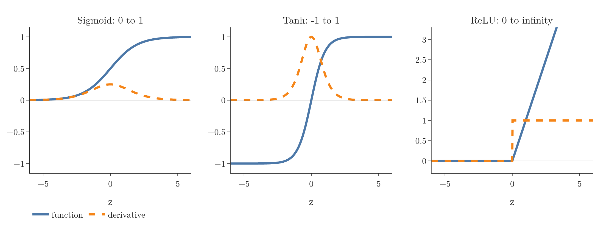
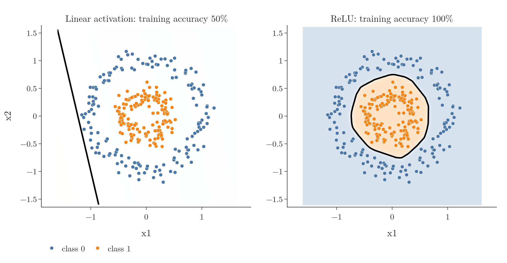
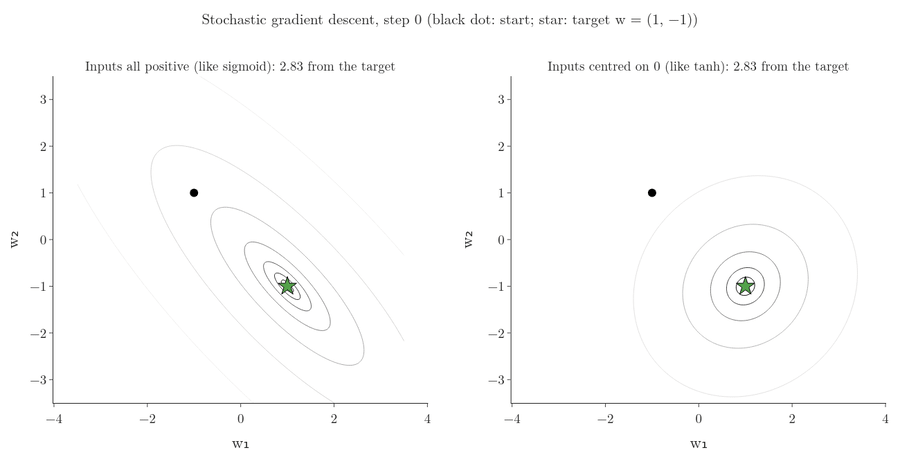
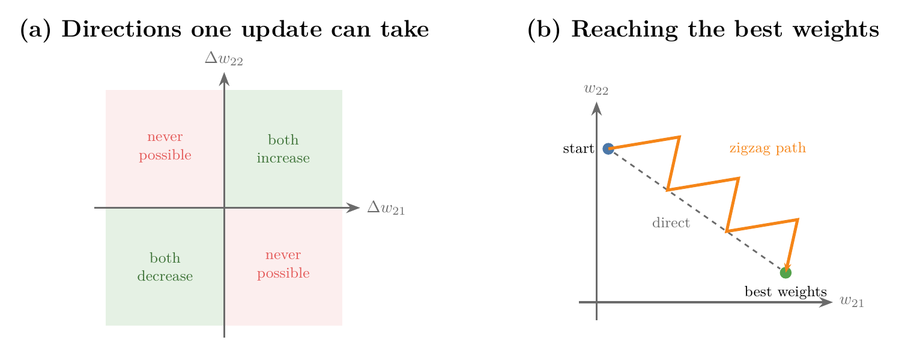
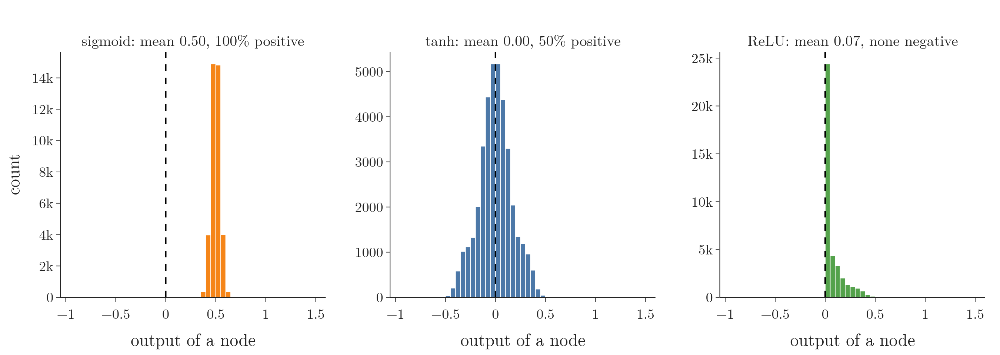
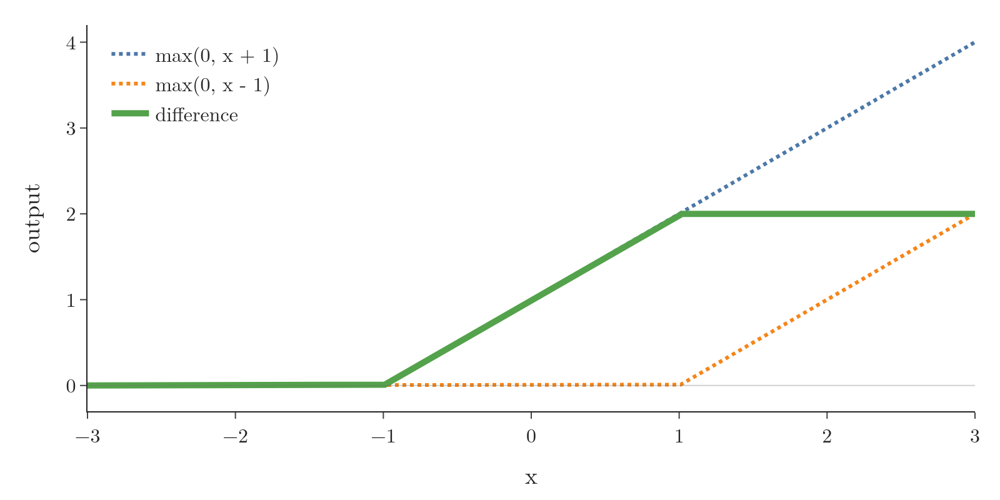
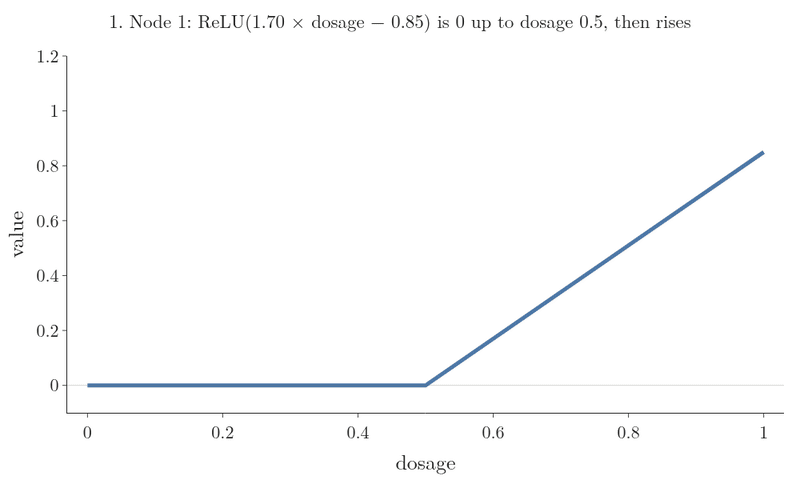

<!-- where-this-fits: generated by course_map/build_map.py; edit concepts.yaml, not this block -->
> **Where this fits:** Pipeline map step 8 (Model). See the [Course map](../../../00-course-map/00-course-map.md).
>
> 
>
> - **Builds on:** Perceptron ([Note DL-004](../../../DL/01-basics/DL-004-perceptron/DL-004-perceptron.md)); Vanishing gradient ([Note DL-018](../../../DL/01-basics/DL-018-vanishing-exploding-gradients/DL-018-vanishing-exploding-gradients.md)).
> - **Leads to:** Dying ReLU problem ([Note DL-028](../../../DL/02-training/DL-028-relu-variants/DL-028-relu-variants.md)); Vanishing gradient ([Note DL-029](../../../DL/02-training/DL-029-weight-initialization/DL-029-weight-initialization.md)); Xavier and He initialisation ([Note DL-030](../../../DL/02-training/DL-030-xavier-he-initialization/DL-030-xavier-he-initialization.md)); Recurrent neural network (RNN) ([Note DL-055](../../../DL/05-rnn/DL-055-why-rnn/DL-055-why-rnn.md)); GELU activation ([Note DL-087](../../../DL/06-transformers/DL-087-decoder-only-gpt/DL-087-decoder-only-gpt.md)).
> - **Compare with:** Leaky ReLU, PReLU, ELU and SELU ([Note DL-028](../../../DL/02-training/DL-028-relu-variants/DL-028-relu-variants.md)).
<!-- /where-this-fits -->

## 1. Overview

> **Key point:** An activation function is the non-linear step inside every node. Without it a deep network is only a linear model. Sigmoid and tanh squash their input and slow deep networks down; ReLU does not squash positive values and is the default for hidden layers today.

Every node of a neural network computes a **weighted sum** (G-2119) $z$ of its inputs plus a **bias** (G-287), then passes $z$ through a function. This function, the **activation function** (G-165), decides how strongly the node "fires". This Note answers three questions:

- **Why** a network needs a non-linear activation at all.
- **What** makes an activation function good: five properties.
- **How** the three classic functions, sigmoid, tanh and ReLU, score on those properties.

{width=100%}

Figure 1 shows the three functions side by side. Most of this Note is about what their shapes, and the shapes of their slopes, do to training.

## 2. Prerequisites

- The [perceptron Note](../../01-basics/DL-004-perceptron/DL-004-perceptron.md): weighted sum, bias and activation function.
- The [sigmoid Note](../../../ML/07-classification/ML-071-sigmoid-function/ML-071-sigmoid-function.md) and the [sigmoid derivative Note](../../../ML/07-classification/ML-073-sigmoid-derivative/ML-073-sigmoid-derivative.md): $\sigma(z) = 1/(1 + e^{-z})$ and $\sigma'(z) = \sigma(z)(1 - \sigma(z)) \le 0.25$.
- The [vanishing and exploding gradients Note](../../01-basics/DL-018-vanishing-exploding-gradients/DL-018-vanishing-exploding-gradients.md): why small slopes stop early layers from learning.
- The [backpropagation how Note](../../01-basics/DL-016-backpropagation-how/DL-016-backpropagation-how.md): gradients as chain-rule products.

## 3. What an activation function is

> **Key point:** A node computes $z = \sum w_i x_i + b$ and outputs $a = g(z)$. The function $g$ is the activation function: a gate deciding whether, and how much, the node is activated.

Take a network with two inputs, one hidden layer of two nodes and one output node. The first hidden node computes the weighted sum of its inputs plus its bias:

$$z = w_1 x_1 + w_2 x_2 + b_1$$

The node then outputs $a = g(z)$. The function $g$ is the [activation function](../../01-basics/DL-004-perceptron/DL-004-perceptron.md), also called the **transfer function** (G-2004). With $n$ inputs the output is $a = g\left(\sum_{i=1}^{n} w_i x_i + b\right)$, where $\sum$ means "add up the terms for $i = 1$ to $n$".

A worked case: weights $w_1 = 2$ and $w_2 = -1$, bias $b_1 = 0.5$, inputs $x_1 = 3$ and $x_2 = 1$, and a sigmoid for $g$:

$$z = 2 \times 3 + (-1) \times 1 + 0.5 = 5.5$$
$$a = g(5.5) = \frac{1}{1 + e^{-5.5}} = 0.996$$

We can picture $g$ as a gate between what flows into a node and what flows out. The gate decides whether the node is activated and, if so, how strongly. The **sigmoid** (G-1798) and the [softmax](../../../ML/07-classification/ML-078-softmax-regression/ML-078-softmax-regression.md) (G-1830) are two activation functions already met; this Note adds **tanh** (G-1947) and **ReLU** (G-1668).

## 4. Why a network needs a non-linear activation

> **Key point:** Without a non-linear activation, any number of layers collapses into one linear layer: the network's decision boundary is a straight line, however deep it is.

### 4.1 An experiment: linear activations on circles

> **Key point:** Two hidden layers of 32 nodes with linear activations reach 50% accuracy on two circles, the same as guessing. With ReLU the same network reaches 100%.

The data is `make_circles` (G-110) from scikit-learn. Each **observation** (G-1374; one record, one row of the data table) has:

- two **features** (G-772; input variables) $x_1$ and $x_2$, its position on the plane;
- a **target** (G-1949; the output we predict): class 1 for the inner ring, class 0 for the outer ring.

There are 300 observations, 150 per class. No straight line separates the two rings. We train the same network twice for 200 **epochs** (G-696):

- two hidden layers of 32 nodes with `activation="linear"`, which means $g(z) = z$, the same as no activation at all;
- the same two layers with `activation="relu"`.

The output node is a sigmoid in both, because this is binary classification.

{width=100%}

In Figure 2, the background shade is the probability the network gives to class 1 at that spot: light orange where it favours class 1, light blue where it favours class 0, white at 0.5. The black line is the decision boundary, where the probability is 0.5. The dots are the training points (blue: class 0, orange: class 1).

Figure 2 shows the result. The linear network ends with a loss of 0.694 and 50% training accuracy, which is exactly guessing: its **decision boundary** (G-555), the line between the regions given to each class, can only be straight, and the best straight one is useless here. The ReLU network ends at 100%, with a decision boundary that bends around the inner ring.

> **Python:** The only difference between the two models is one argument.
>
> ```python
> keras.layers.Dense(32, activation="linear")  # no bend
> keras.layers.Dense(32, activation="relu")    # bends
> ```

### 4.2 The algebra: linear layers collapse

> **Key point:** Two linear layers $W_2(W_1 a_0 + b_1) + b_2$ equal one layer $W' a_0 + b'$. The output is a degree-1 function of the input.

Stacked matrices without an activation multiply into a single matrix (see the [matrix multiplication Note](../../../MA/05-linear-algebra/MA-054-matrix-multiplication-as-composition/MA-054-matrix-multiplication-as-composition.md)). The bias terms add only a shift, so they do not change that.

1. **In words:** the first layer computes $a_1 = W_1 a_0 + b_1$; the second feeds that into $a_2 = W_2 a_1 + b_2$; multiplying out gives one weight matrix and one bias.
2. **Formula:**
   $$a_2 = W_2(W_1 a_0 + b_1) + b_2 = \underbrace{W_2 W_1} _{W'}\thinspace a_0 + \underbrace{W_2 b_1 + b_2} _{b'}$$
3. **Example:** with single numbers $W_1 = 2$, $b_1 = 1$, $W_2 = 3$, $b_2 = -1$:
   $$a_2 = 3(2x + 1) - 1 = 6x + 2$$
   Two layers, and the result is still a straight line in $x$.

The Notebook checks the collapse on the trained linear network of Figure 2. The network's three weight matrices multiply into one $2 \times 1$ matrix $W'$, and one layer with $W'$ and $b'$ gives the same predictions to within $6 \times 10^{-8}$. A network with linear activations is therefore [linear regression](../../../ML/06-regression/ML-052-multiple-linear-regression/ML-052-multiple-linear-regression.md) (G-1094; regression output) or [logistic regression](../../../ML/07-classification/ML-071-sigmoid-function/ML-071-sigmoid-function.md) (G-1120; sigmoid output), however many layers it has.

With a non-linear $g$, such as the sigmoid, $g(W_1 a_0 + b_1)$ is no longer a degree-1 expression. Feeding it into the next layer gives a relationship between input and output that is not a polynomial of degree 1, so the network can follow non-linear patterns. Capturing non-linear patterns is the whole reason activation functions exist.

## 5. Properties of an ideal activation function

> **Key point:** A good activation function is non-linear, differentiable, cheap to compute, zero-centred and non-saturating. No classic function has all five.

### 5.1 Non-linear

> **Key point:** Non-linearity is what lets a network capture non-linear patterns. Non-linearity is the one property that cannot be dropped.

The relationship between $z$ and $g(z)$ must not be a straight line, as section 4 showed. With a non-linear activation, the [universal approximation theorem](../../01-basics/DL-003-nn-types-history-applications/DL-003-nn-types-history-applications.md) (G-2052) says that enough nodes and layers can approximate any pattern in the data.

### 5.2 Differentiable

> **Key point:** Gradient descent needs the derivative of the activation at every step, so it must exist.

**Backpropagation** (G-247) multiplies the activation's **derivative** (G-595) into every **gradient** (G-863) (see the [backpropagation how Note](../../01-basics/DL-016-backpropagation-how/DL-016-backpropagation-how.md)). Without a derivative there is no gradient, no update and no training.

The property is important but not strict. ReLU has no derivative at exactly $z = 0$ and is still the most used activation (section 8.2 explains how this is handled).

### 5.3 Computationally inexpensive

> **Key point:** The function and its derivative are computed for every node, every observation and every epoch; a slow function makes training slow.

A network with a million nodes trained on a million observations for 100 epochs evaluates its activation this many times:

$$10^6 \text{ nodes} \times 10^6 \text{ observations} \times 100 \text{ epochs} = 10^{14}$$

Functions built from a simple comparison are faster than those built from exponentials.

### 5.4 Zero-centred

> **Key point:** Outputs with mean about 0, some positive and some negative, act like normalised inputs to the next layer and make training converge faster.

A **zero-centred** activation function (G-2148) gives outputs whose mean over a layer is around 0. Training converges faster when the inputs are normalised (see the [standardization Note](../../../ML/03-feature-engineering/ML-023-standardization/ML-023-standardization.md)), and the outputs of one layer are the inputs of the next. Tanh is zero-centred; section 6.3 shows what goes wrong when an activation is not.

Figure 4 shows the effect on the simplest case: one node $\hat y = w_1 a_1 + w_2 a_2$ learning, one observation at a time, a target that needs $w_1 = 1$ and $w_2 = -1$. The inputs $a_1, a_2$ are 200 random values between 0.1 and 0.9, like sigmoid outputs (left), or the same values minus 0.5, centred on 0 like tanh outputs (right). Both start from $(-1, 1)$ with the same learning rate, 2.5.

The loss of this node is a surface over the two weights. For a pair $(w_1, w_2)$ the height is the mean squared error over the 200 observations, drawn as $\log_{10}(L + 0.001)$ so that the region near the minimum is visible. Two points on it, for either kind of input:

$$L(-1, 1) = 0.50 \quad \text{(the start)}, \qquad L(1, -1) = 0 \quad \text{(the target)}$$


Figure 3 shows the two surfaces: both are bowls with the target at the bottom. The left bowl is a long, narrow valley tilted across the weights; the right bowl is round. The [contour map](../../../MA/06-calculus/MA-062-partial-derivatives-and-gradients/MA-062-partial-derivatives-and-gradients.md) in Figure 4 (grey lines) is each bowl seen from above: each line joins points at the same loss; lines close together mean a steep slope, and the centre is the target.



1. **Each step's direction.** Here $y$ is the target and $\hat y$ the node's output. The gradient of the squared error has one part for each weight:
   $$\frac{\partial L}{\partial w_1} = (\hat y - y)\thinspace a_1$$
   $$\frac{\partial L}{\partial w_2} = (\hat y - y)\thinspace a_2$$
   With positive inputs, both parts have the sign of $\hat y - y$, so every orange step moves both weights up or both down: along a diagonal.
2. **The valley.** With positive inputs the loss forms a long, narrow valley (left contours). Steps along the diagonal keep overshooting across it.
3. **The result.** After 20 steps the positive-input node is still 1.01 away from the target; the centred one is 0.10 away. Centred inputs make the loss contours round, so the steps head straight for the target (LeCun et al. 1998, §4.3).

### 5.5 Non-saturating

> **Key point:** A saturating function squeezes any input into a fixed range, so its slope goes to 0 at the ends. The flat ends cause the vanishing gradient problem.

A **saturating function** (G-1741) squeezes an input from $-\infty$ to $\infty$ into a bounded range and flattens out there. The sigmoid squeezes into 0 to 1, tanh into $-1$ to 1. A **non-saturating function** (G-1339) has no such ceiling: ReLU, $\max(0, z)$, grows as large as its input.

Where a function is flat its slope is near 0, and a product of many near-zero slopes is the [vanishing gradient](../../01-basics/DL-018-vanishing-exploding-gradients/DL-018-vanishing-exploding-gradients.md) (G-2070). The vanishing gradient appears with saturating activations, which is why non-saturation matters.

## 6. Sigmoid

> **Key point:** The sigmoid gives a probability, is non-linear and differentiable; but it saturates, is not zero-centred and needs an exponential. Today it is used only in the output layer for binary classification.

### 6.1 Shape and slope

> **Key point:** Output 0.5 at $z = 0$, near 0 or 1 for large $|z|$. Its derivative peaks at 0.25 and is almost 0 outside $-3$ to 3.

The [sigmoid](../../../ML/07-classification/ML-071-sigmoid-function/ML-071-sigmoid-function.md) is $\sigma(z) = 1/(1 + e^{-z})$ (Figure 1, left). For a large $z$ it is close to 1, for a very negative $z$ close to 0, and $\sigma(0) = 0.5$.

Its [derivative](../../../ML/07-classification/ML-073-sigmoid-derivative/ML-073-sigmoid-derivative.md) $\sigma(z)(1 - \sigma(z))$ is largest at $z = 0$, where it is 0.25. Between $-3$ and 3 it is reasonably large; outside, it is close to 0. At $z = 3$ it is 0.045 and at $z = 5$ only 0.0066.

### 6.2 Advantages

> **Key point:** Output reads as a probability; non-linear; differentiable everywhere.

1. **Probability output.** The output lies between 0 and 1, so it can be read as a probability. For this reason we put a sigmoid in the output node for binary classification: near 1 means "yes", near 0 means "no".
2. **Non-linear.** The exponential makes it non-linear, so it can capture non-linear patterns.
3. **Differentiable everywhere,** with a derivative that is easy to write in terms of the function itself.

### 6.3 Disadvantages

> **Key point:** Saturation causes the vanishing gradient; all-positive outputs force every weight into a node to move in the same direction; the exponential is slow.

**1. Saturating, so the gradient vanishes.** The update is $w_{\text{new}} = w_{\text{old}} - \eta\thinspace\partial L/\partial w$. If $z$ is outside about $-3$ to 3, the sigmoid's slope is near 0, the gradient is near 0 and $w_{\text{new}} \approx w_{\text{old}}$: no training. In a deep network these small slopes multiply from layer to layer (see the [vanishing gradients Note](../../01-basics/DL-018-vanishing-exploding-gradients/DL-018-vanishing-exploding-gradients.md)).

$z$ becomes large in two ways:

- **Large inputs.** Usually not the cause, because we scale the inputs first.
- **Large weights and biases.** If the starting weights are big, $z$ is big and the node starts saturated (see the [weight initialisation Note](../DL-029-weight-initialization/DL-029-weight-initialization.md)).

Saturation is the main reason the sigmoid has disappeared from hidden layers (Goodfellow et al. 2016, §6.3.2).

**2. Not zero-centred, so training is slow.** Every sigmoid output is positive. Take two sigmoid nodes, with outputs $a_{21}$ and $a_{22}$, feeding one output node through weights $w_{21}$ and $w_{22}$:

$$z_{31} = w_{21}\thinspace a_{21} + w_{22}\thinspace a_{22} + b_{31}$$

1. **In words:** by the **chain rule** (G-371), the gradient of each weight is a factor shared by both, times that weight's input.
2. **Formula:** with the shared factor $\delta = \dfrac{\partial L}{\partial \hat{y}} \cdot \dfrac{\partial \hat{y}}{\partial z_{31}}$,
   $$\frac{\partial L}{\partial w_{21}} = \delta \cdot a_{21}, \qquad \frac{\partial L}{\partial w_{22}} = \delta \cdot a_{22}$$
3. **Example:** with $\delta = -0.5$ and sigmoid outputs $a_{21} = 0.6$, $a_{22} = 0.3$, the gradients are $-0.30$ and $-0.15$: both negative. Had $a_{22}$ been a tanh output of $-0.3$, they would be $-0.30$ and $+0.15$.

Because $a_{21}$ and $a_{22}$ are both positive, both gradients take the sign of $\delta$. So in one update the weights into a node either all increase or all decrease; they can never move in opposite directions.

{width=95%}

Figure 5 shows the consequence. If reaching the minimum needs $w_{21}$ to grow while $w_{22}$ shrinks, no single step can do that. Gradient descent zigzags, like driving to a place on our left when we are not allowed to turn left, and it converges slowly (LeCun et al. 1998).

The Notebook checks the sign rule with one hidden layer of 10 nodes feeding a sigmoid output, for one observation. With sigmoid hidden nodes, the 10 gradients of the output node's weights all have the same sign (`++++++++++`). With tanh hidden nodes they are mixed (`-+-+++++-+`).

**3. Computationally expensive.** Each evaluation needs an exponential. In the Notebook, 10 million sigmoids take about 650 ms, against 135 ms for ReLU.

In short, the sigmoid is rarely used in hidden layers today. The sigmoid stays in the output layer for binary classification.

## 7. Tanh

> **Key point:** Tanh is a stretched sigmoid with range $-1$ to 1. Tanh is zero-centred, which fixes the sigmoid's slow training, but it still saturates and still needs exponentials.

### 7.1 Shape and slope

> **Key point:** $\tanh(z) = (e^{z} - e^{-z})/(e^{z} + e^{-z})$, with derivative $1 - \tanh^2(z)$, peaking at 1.

1. **In words:** the **hyperbolic tangent (tanh)** is an S-shaped curve like the sigmoid, but from $-1$ to 1, passing through 0 at $z = 0$.
2. **Formula:**
   $$\tanh(z) = \frac{e^{z} - e^{-z}}{e^{z} + e^{-z}}, \qquad \tanh'(z) = 1 - \tanh^2(z)$$
3. **Example:** at $z = 1$, $e^{1} = 2.718$ and $e^{-1} = 0.368$, so
   $$\tanh(1) = \frac{2.718 - 0.368}{2.718 + 0.368} = \frac{2.350}{3.086} = 0.762, \qquad \tanh'(1) = 1 - 0.762^2 = 0.42$$

Like the sigmoid, its derivative is written in terms of the function itself. The derivative's peak is 1 instead of 0.25, and the curve is steeper (Figure 1, middle).

> **Extra:** Tanh is a rescaled sigmoid: $\tanh(z) = 2\sigma(2z) - 1$. To see it, multiply the top and bottom of $2\sigma(2z) - 1$ by $e^{z}$:
> $$2\sigma(2z) - 1 = \frac{2}{1 + e^{-2z}} - 1 = \frac{1 - e^{-2z}}{1 + e^{-2z}} = \frac{e^{z} - e^{-z}}{e^{z} + e^{-z}} = \tanh(z)$$
> The Notebook confirms the identity numerically. The steeper middle of tanh also means tanh flattens sooner: at $z = 3$ its slope is 0.0099, against the sigmoid's 0.045.

### 7.2 Advantages and disadvantages

> **Key point:** Gains zero-centred outputs; keeps saturation and exponentials.

Advantages:

1. **Non-linear**, so it captures non-linear patterns.
2. **Differentiable** everywhere.
3. **Zero-centred.** Outputs are both positive and negative. The gradients of the weights into a node can then have different signs, and training is faster than with the sigmoid (LeCun et al. 1998, §4.4). In the Notebook, over all 300 observations, a 128-node tanh layer has mean output 0.000 with half the values positive, while a sigmoid layer has mean 0.500 with every value positive.



Figure 6 shows those layer outputs. The sigmoid's values all sit above 0, around 0.5. The tanh values spread evenly on both sides of 0, so the next layer receives inputs centred on 0, as in the right half of Figure 4. ReLU's values are 0 or positive, never negative: ReLU is not zero-centred either (section 8.2).

Disadvantages:

1. **Saturating.** For large $|z|$ the slope is 0, so tanh also suffers from the vanishing gradient.
2. **Computationally expensive**, because of the exponentials (about 270 ms for 10 million values in the Notebook).

Tanh fixed the sigmoid's slow training from non-zero-centred outputs, but not the vanishing gradient.

## 8. ReLU

> **Key point:** ReLU, $\max(0, z)$, is non-linear, does not saturate for positive $z$, is cheap and converges faster than sigmoid and tanh. Its weaknesses: no derivative at 0, not zero-centred, and dying nodes.

[ReLU](../../01-basics/DL-018-vanishing-exploding-gradients/DL-018-vanishing-exploding-gradients.md) (rectified linear unit) is $\max(0, z)$: 0 for negative $z$, $z$ itself for positive $z$ (Figure 1, right). ReLU is the most used activation in hidden layers today, the recommended default (Goodfellow et al. 2016, §6.3).

### 8.1 Advantages

> **Key point:** Non-linear (two ReLUs already make a bend), non-saturating on the positive side, no exponential, faster convergence.

**1. Non-linear.** ReLU looks like two straight segments, which makes some people think it is linear. A linear function would be $f(z) = z$ everywhere; $\max(0, z)$ has a corner, so it is not. Combining ReLUs builds more complex shapes:

1. **In words:** subtract one shifted ReLU from another.
2. **Formula:** $f(x) = \max(0, x + 1) - \max(0, x - 1)$
3. **Example:** $f(-2) = 0 - 0 = 0$; $f(0) = 1 - 0 = 1$; $f(3) = 4 - 2 = 2$. Flat, then rising, then flat again.

{width=80%}

Figure 7 shows the result: a curve with two corners. The ReLU decision boundary in Figure 2 is built the same way, from straight segments joined at corners: it is **piecewise linear** (G-1496).

**How the bends fit data.** A network makes the same move with its own weights. Take a drug that works at a medium dosage and fails at a low and a high one: three observations, dosage 0, 0.5 and 1, with targets 0, 1 and 0. A network with two ReLU hidden nodes and a ReLU before the output fits them in six steps, one per frame of Figure 8:

1. **Node 1** computes $\max(0,\ 1.70 \times \text{dosage} - 0.85)$: flat at 0 up to dosage 0.5, then a rising line.
2. **Its output weight, $-40.8$,** flips the bent line and stretches it downwards.
3. **Node 2,** times its output weight, gives the straight line $34.0 \times \text{dosage}$.
4. **The output node adds the two:** a wedge with its corner at dosage 0.5.
5. **The output bias, $-16$,** moves the wedge down until only its tip is above 0.
6. **The final ReLU** sets every negative value to 0. A narrow peak is left.

{width=95%}

Check the three observations:

| Dosage | Node 1 $\times\ (-40.8)$ | Node 2 line | Sum $- 16$ | After the final ReLU |
|---|---|---|---|---|
| 0 | 0 | 0 | $-16$ | 0 |
| 0.5 | 0 | 17.0 | 1.0 | 1.0 |
| 1 | $0.85 \times (-40.8) = -34.7$ | 34.0 | $-16.7$ | 0 |

Each ReLU node contributes one bent line. The weights and biases slide, flip and stretch these lines, and their sum is a new shape with one corner per node. More nodes give more corners, so the network can follow more complicated patterns.

**2. Non-saturating in the positive region.** For positive $z$ the output grows without limit and the slope stays 1, so the gradient does not vanish there.

**3. Computationally inexpensive.** Computing it is one comparison, and its derivative is 0 or 1. No exponentials.

**4. Faster convergence** than sigmoid and tanh. On the CIFAR-10 images, a four-layer ReLU network reached a 25% training error about six times faster than the same network with tanh (Krizhevsky et al. 2012, §3.1, Figure 1).

### 8.2 Disadvantages

> **Key point:** No derivative at exactly 0 (we just pick one), outputs never negative (batch normalisation helps), and nodes that can die.

**1. Not differentiable at $z = 0$.** The two segments meet at a corner, which has no single slope. In code we simply choose one: slope 0 for $z < 0$, slope 1 for $z > 0$, and one of the two at exactly 0.

**2. Not zero-centred.** Like the sigmoid's, ReLU's outputs are never negative, with the same effect on the gradient signs as in section 6.3. [Batch normalisation](../DL-031-batch-normalization/DL-031-batch-normalization.md) (G-266) addresses this: it normalises the values passed between layers.

**3. The dying ReLU problem** (G-650). A node whose $z$ stays negative outputs 0 with slope 0, so it stops learning (see section 6.2 of the [vanishing gradients Note](../../01-basics/DL-018-vanishing-exploding-gradients/DL-018-vanishing-exploding-gradients.md)). The causes and the fixes are in the [ReLU variants Note](../DL-028-relu-variants/DL-028-relu-variants.md). The same Note (section 6.3) introduces GELU and SiLU, the smooth versions of ReLU used in transformers.

> **Python:** Choosing activations in Keras.
>
> ```python
> model = keras.Sequential([
>     keras.Input(shape=(2,)),
>     keras.layers.Dense(32, activation="relu"),  # hidden: ReLU
>     keras.layers.Dense(32, activation="tanh"),  # or tanh
>     keras.layers.Dense(1, activation="sigmoid")])  # output
> ```
>
> The strings `"sigmoid"`, `"tanh"`, `"relu"` and `"linear"` pick the function for every node of that layer.

## 9. Summary

| Property | Sigmoid | Tanh | ReLU |
|---|---|---|---|
| Formula | $1/(1+e^{-z})$ | $(e^{z}-e^{-z})/(e^{z}+e^{-z})$ | $\max(0, z)$ |
| Range | 0 to 1 | $-1$ to 1 | 0 to $\infty$ |
| Largest slope | 0.25 | 1 | 1 |
| Non-linear | yes | yes | yes |
| Differentiable | everywhere | everywhere | except at 0 |
| Zero-centred | no | yes | no |
| Saturating | yes | yes | not for $z > 0$ |
| Cost (10 million values) | about 650 ms | about 270 ms | about 135 ms |
| Used today | output, binary classification | some hidden layers | most hidden layers |

- Without a non-linear activation, any network is a linear model (50% vs 100% on the circles).
- An ideal activation is non-linear, differentiable, cheap, zero-centred and non-saturating.
- Saturating functions (sigmoid, tanh) cause the vanishing gradient.
- All-positive outputs (sigmoid, ReLU) make the weights into a node move together, so training zigzags.
- ReLU is the default for hidden layers; its dying-node problem leads to the ReLU variants.

## 10. Sources

**Built from**

- CampusX, "Activation Functions in Deep Learning | Sigmoid, Tanh and Relu Activation Function", YouTube, https://www.youtube.com/watch?v=7LcUkgzx3AY
- StatQuest with Josh Starmer, "Neural Networks Pt. 3: ReLU In Action!!!", YouTube, https://www.youtube.com/watch?v=68BZ5f7P94E (the dosage example of section 8.1: two ReLU nodes building a shape, Figure 8)

**Other references**

- LeCun, Y., Bottou, L., Orr, G. B. and Müller, K.-R. (1998). Efficient BackProp. In *Neural Networks: Tricks of the Trade*, Springer, section 4.3 (all-positive inputs make the weight updates zigzag) and section 4.4 (symmetric sigmoids such as tanh converge faster than the logistic sigmoid).
- Krizhevsky, A., Sutskever, I. and Hinton, G. E. (2012). ImageNet Classification with Deep Convolutional Neural Networks. NeurIPS, section 3.1 (ReLU trains several times faster than tanh).
- Goodfellow, I., Bengio, Y. and Courville, A. (2016). *Deep Learning*, MIT Press, section 6.3 (ReLU as the default hidden unit; sigmoid hidden units discouraged because they saturate).

## 11. Key terms

| Term | Meaning |
|---|---|
| Transfer function | Another name for the activation function |
| Linear activation | $g(z) = z$, the same as no activation; Keras' `activation="linear"` |
| Zero-centred activation | An activation whose outputs average about 0, positive and negative |
| Saturating function | A function that squeezes any input into a bounded range, so its slope goes to 0 at the ends |
| Non-saturating function | A function with no upper limit on its output, such as ReLU for positive inputs |
| Tanh (hyperbolic tangent) | The activation $(e^{z}-e^{-z})/(e^{z}+e^{-z})$, an S-curve from $-1$ to 1 with derivative $1 - \tanh^2(z)$ |
| Observation | One record of the data: one row of the data table |
| Feature | An input variable: one column of the data table, such as $x_1$ |
| Target | The output we predict, such as the class |
| `make_circles` | scikit-learn function that generates two concentric rings of observations, one ring per class |
