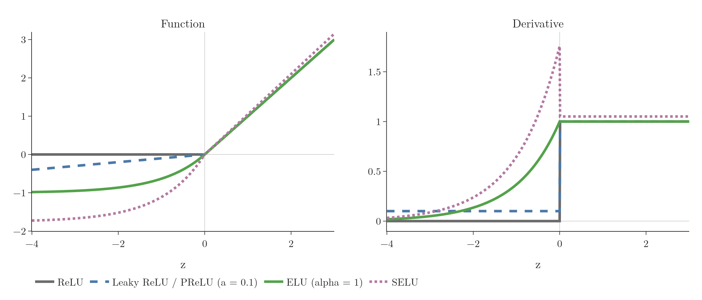
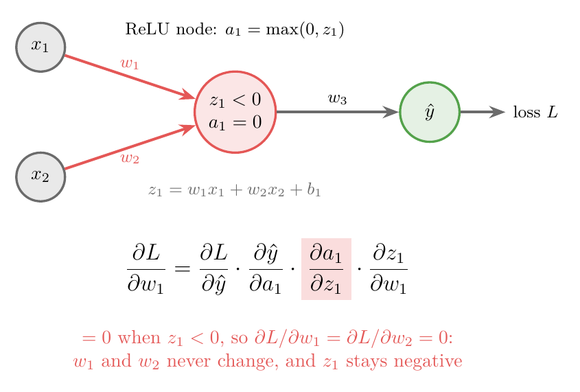
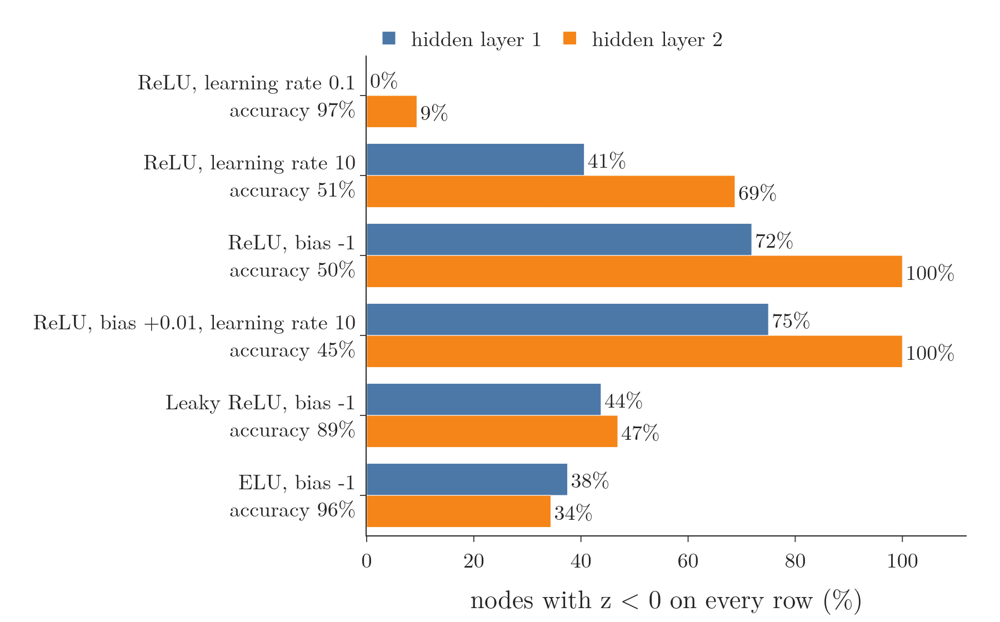
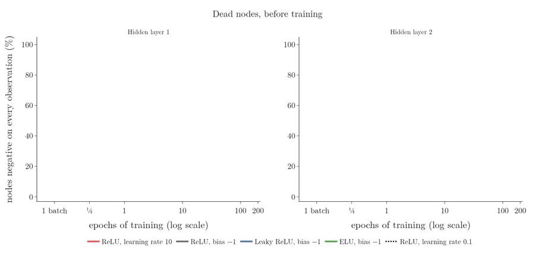
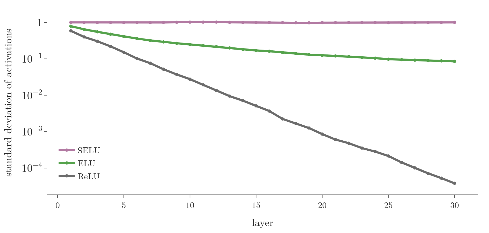

<!-- where-this-fits: generated by course_map/build_map.py; edit concepts.yaml, not this block -->
> **Where this fits:** Pipeline map step 8 (Model). See the [Course map](../../../00-course-map/00-course-map.md).
>
> 
>
> - **Builds on:** Vanishing gradient ([Note DL-018](../../../DL/01-basics/DL-018-vanishing-exploding-gradients/DL-018-vanishing-exploding-gradients.md)); Activation functions ([Note DL-027](../../../DL/02-training/DL-027-activation-functions/DL-027-activation-functions.md)).
<!-- /where-this-fits -->

## 1. Overview

> **Key point:** A ReLU node whose weighted sum stays negative outputs 0 with slope 0, so it never learns again: it is dead. Four variants give negative inputs a non-zero output and slope, which keeps every node alive.

**ReLU** (G-1668) is the default **activation function** (G-165) for **hidden layers** (G-890; see the [activation functions Note](../DL-027-activation-functions/DL-027-activation-functions.md)). ReLU's biggest weakness is the **dying ReLU problem** (G-650). This Note covers:

- what a dead node is, why it happens and why it is permanent;
- three fixes, the third being a change of activation;
- two **linear variants** (G-1098; Leaky ReLU, Parametric ReLU), which change ReLU's negative side by a straight line;
- two **non-linear variants** (G-1336; ELU, SELU), which use an exponential curve there.

{width=100%}

Figure 1 shows all five functions. The five agree for positive $z$ (SELU is scaled up slightly) and differ only for negative $z$.

## 2. Prerequisites

- The [activation functions Note](../DL-027-activation-functions/DL-027-activation-functions.md): ReLU, saturation, zero-centred outputs.
- The [backpropagation how Note](../../01-basics/DL-016-backpropagation-how/DL-016-backpropagation-how.md): gradients as chain-rule products.

## 3. The dying ReLU problem

> **Key point:** A dead node outputs 0 for every input. With more than half the nodes dead, the network cannot capture the patterns in the data; with all of them dead, there is no network left.

A **dead neuron** (G-551) is a node whose output is 0 for every input. The dead node's output no longer depends on the input, so it carries no information and learns nothing. Worse, it stays dead for the rest of training: in effect it has been removed from the network.

How much this matters depends on how many nodes die:

- **A few dead nodes:** the network has less **capacity** (G-344; the range of functions it can fit), but it still works.
- **More than half:** the network runs at less than half its size and cannot represent the patterns in the data well.
- **All of them:** the network outputs a constant. There is no point in training it.

### 3.1 Why a dead node stops learning

> **Key point:** If $z_1 < 0$, then $a_1 = 0$ and $\partial a_1/\partial z_1 = 0$. The zero slope appears in the gradient of every weight into the node, so none of them is updated.

Take a small network for regression: two inputs, one hidden ReLU node, one output node (Figure 2). The hidden node computes

$$z_1 = w_1 x_1 + w_2 x_2 + b_1, \qquad a_1 = \max(0, z_1)$$

{width=70%}

**Backpropagation** (G-247) reaches $w_1$ through the chain $L \to \hat{y} \to a_1 \to z_1 \to w_1$:

1. **In words:** the gradient of $w_1$ is a product of four factors, one of which is ReLU's slope.
2. **Formula:**
   $$\frac{\partial L}{\partial w_1} = \frac{\partial L}{\partial \hat{y}} \cdot \frac{\partial \hat{y}}{\partial a_1} \cdot \frac{\partial a_1}{\partial z_1} \cdot \frac{\partial z_1}{\partial w_1}$$
   The gradient of $w_2$ has the same first three factors.
3. **Example:** with $w_1 = -0.8$, $w_2 = -0.5$, $b_1 = 0.1$ and inputs $x_1 = 0.6$, $x_2 = 0.4$:
   $$z_1 = -0.48 - 0.20 + 0.1 = -0.58 < 0, \qquad \frac{\partial a_1}{\partial z_1} = 0$$
   The last factor is $\partial z_1/\partial w_1 = x_1 = 0.6$. The product for $w_1$, factor by factor:
   $$\frac{\partial L}{\partial w_1} = \frac{\partial L}{\partial \hat{y}} \cdot \frac{\partial \hat{y}}{\partial a_1} \cdot 0 \cdot 0.6 = 0$$
   So $\partial L/\partial w_1 = \partial L/\partial w_2 = 0$, and $w_{\text{new}} = w_{\text{old}} - \eta \cdot 0 = w_{\text{old}}$.

Neither weight changes. If $z_1$ is negative for every **observation** (G-1374; every record of the data), the node never gets an update again: it is dead.

### 3.2 What makes $z$ negative

> **Key point:** Two causes: a learning rate so high that one update throws the weights negative, and a large negative bias.

**1. A high learning rate** (G-1068). Suppose that for the first observation $z_1$ is positive, so the gradient is not 0. With a very large learning rate, $\eta\thinspace\partial L/\partial w$ is a big number. Subtracting it from a small weight makes $w_1$ and $w_2$ strongly negative, and in the next round $z_1$ is negative for every observation.

**2. A large negative bias.** If $b_1$ is very negative, $z_1 = w_1 x_1 + w_2 x_2 + b_1$ is negative however the inputs vary. The bias can start out negative, or it can be pushed there by updates, again usually because the learning rate is high.

### 3.3 Why a dead node stays dead

> **Key point:** The weights and bias no longer change, and the scaled inputs are too small to bring $z$ back above 0.

Once $z_1$ is negative for every observation, nothing can make $z_1$ positive again:

- the weights and the bias get no updates, so they stay as they are;
- only the **features** (G-772) $x_1$, $x_2$ (the input variables) change from observation to observation, and they are scaled into a small range, so they cannot outweigh a large negative bias or negative weights.

For these two reasons a dead node is called permanently dead.

### 3.4 Dead nodes in practice

> **Key point:** On the moons data, a learning rate of 10 kills 41% and 69% of the nodes in two hidden layers, and a bias of $-1$ kills 72% and 100%; accuracy drops to guessing. Leaky ReLU and ELU with the same bias reach 89% and 96%.

The Notebook trains a network with two hidden layers of 32 nodes on 500 standardised observations of `make_moons` (G-111; two features, two classes), with plain **stochastic gradient descent (SGD)** (G-1892) for 200 **epochs** (G-696). The Notebook then counts the nodes whose $z$ is negative for every training observation.

{width=95%}

Figure 3 shows the results:

- **ReLU, learning rate 0.1:** almost no dead nodes (0% and 9%), accuracy 97%.
- **ReLU, learning rate 10:** 41% and 69% dead, accuracy 51%. The nodes were already dead after the first epoch; the shares did not change in the 199 epochs after it.
- **ReLU, bias $-1$:** 72% and 100% dead from the very start, and still the same after 200 epochs. Accuracy 50%.

The deaths are permanent. Training the learning-rate-10 network for 20 more epochs changes the weights into its 13 dead first-layer nodes by exactly 0, as section 3.1 predicts.

Figure 4 follows the same runs through training, on a log scale so that the first epoch is visible.



1. **Learning rate 10 (red).** The nodes die during the very first epoch. After 8 of its 16 batches, 41% of the first-layer nodes are negative everywhere; after that the share never moves again.
2. **Bias $-1$ with ReLU (grey).** 72% and 100% of the nodes start negative everywhere and stay so for all 200 epochs: a flat line.
3. **Bias $-1$ with Leaky ReLU (blue) and ELU (green).** The same nodes start negative, but their slope is not 0, so their weights keep changing. The ELU shares start falling within 3 epochs; the Leaky ReLU shares from epoch 8 in the first layer and epoch 11 in the second, where they drop from 100% to 38% by epoch 27.
4. **Learning rate 0.1 (dotted).** Few nodes are ever negative everywhere.

## 4. Three ways to prevent dead nodes

> **Key point:** Use a lower learning rate, start the biases at a small positive value such as 0.01, or replace ReLU with one of its variants.

1. **A lower learning rate.** In Figure 3, changing only the learning rate, from 10 to 0.1, lowers the dead shares from 41% and 69% to 0% and 9%.
2. **A positive starting bias.** Starting every bias at a small positive value, such as 0.01 or 0.1, makes it very likely that every ReLU node starts active for most inputs (Goodfellow et al. 2016, §6.3.1, suggests 0.1).
3. **A ReLU variant.** The root cause is that ReLU's slope is exactly 0 for $z < 0$. The variants keep everything good about ReLU but give the negative side a slope.

> **Extra:** A positive bias guards the start, not against a learning rate that is too high. Averaged over 5 seeds in the Notebook, a bias of $+0.01$ with learning rate 10 still ends with 49% and 80% dead nodes (bias 0: 49% and 89%), and accuracy stays near 50%. At learning rate 0.1, a starting bias of $+0.1$ lowers the share of second-layer nodes that start dead from 5.6% to 3.1%, and the share dead after training from 7.5% to 5.6%.

> **Python:** Setting the starting bias in Keras.
>
> ```python
> keras.layers.Dense(
>     32, activation="relu",
>     bias_initializer=keras.initializers.Constant(0.01))
> ```

## 5. Linear variants

> **Key point:** Leaky ReLU and Parametric ReLU replace the 0 on the negative side by a straight line $az$ with a small slope $a$.

The **linear variants** of ReLU change only the negative side, and change it to a straight line.

### 5.1 Leaky ReLU

> **Key point:** $f(z) = z$ for $z \ge 0$ and $0.01z$ for $z < 0$. Its slope on the negative side is 0.01 instead of 0, so a small gradient always flows.

1. **In words:** the **Leaky ReLU** (G-1064) keeps positive values and multiplies negative ones by 0.01 (Maas et al. 2013).
2. **Formula:**
   $$f(z) = \begin{cases} z & z \ge 0 \cr0.01\thinspace z & z < 0 \end{cases} \qquad f'(z) = \begin{cases} 1 & z \ge 0 \cr0.01 & z < 0 \end{cases}$$
3. **Example:** $f(5) = 5$ and $f(-5) = -0.05$. At $z = -5$ ReLU's slope would be 0; Leaky ReLU's is 0.01.

Because $\partial a/\partial z$ is never 0, the gradient in section 3.1 is never exactly 0. The weights keep changing a little, and a node can climb back out of the negative region: with a starting bias of $-1$, the share of first-layer nodes negative on every observation falls from 72% to 44% during training. In Figure 3, Leaky ReLU (Keras' `"leaky_relu"`, slope 0.2) with a starting bias of $-1$ reaches 89% accuracy, where ReLU stayed at 50%.

Advantages:

1. **Non-saturating** (G-1339) on both sides: the output is unbounded in both directions.
2. **Easy to compute:** no exponentials.
3. **No dying ReLU problem.**
4. **Close to zero-centred** (G-2148): outputs can be negative as well as positive, though not symmetric.

The only questionable point of Leaky ReLU is the constant: why 0.01 and not some other value? The value 0.01 was chosen by experiment. Parametric ReLU lets the data choose it instead.

> **Extra:** Keras does not use 0.01 by default (Keras documentation). The string `activation="leaky_relu"` uses slope 0.2, and the layer `keras.layers.LeakyReLU()` uses 0.3. To get 0.01, write `keras.layers.LeakyReLU(negative_slope=0.01)`.

### 5.2 Parametric ReLU (PReLU)

> **Key point:** Like Leaky ReLU, but the negative slope $a$ is a trainable parameter, learned per node along with the weights.

1. **In words:** the **Parametric ReLU (PReLU)** (G-1452) multiplies negative inputs by a slope $a$ that is learned during training.
2. **Formula:**
   $$f(z) = \begin{cases} z & z \ge 0 \cr a\thinspace z & z < 0 \end{cases}$$
3. **Example:** if training sets $a = 0.25$, then $f(-2) = -0.5$; with $a = 0.01$ it would be Leaky ReLU, with $a = 0$ plain ReLU.

The slope $a$ is a parameter like a weight, found by gradient descent from the data. The slope $a$ is not a **hyperparameter** (G-910) that we set. Everything else, advantages included, is as for Leaky ReLU. The extra flexibility can help: the paper that introduced PReLU reports better **ImageNet** (G-920) accuracy than with ReLU (He et al. 2015).

> **Python:** PReLU is a separate layer after a `Dense` layer without activation.
>
> ```python
> keras.layers.Dense(8),
> keras.layers.PReLU(),   # one learnable a per node
> ```
>
> Here the PReLU layer adds 8 trainable parameters, one slope per node. In Keras each starts at 0, so the network begins as a ReLU network (He et al. 2015 started them at 0.25).

> **Extra:** Nothing keeps the learned slope small. On the moons data the 8 slopes came out between $-1.5$ and $3.4$. A negative $a$ makes the function V-shaped, which is still a valid non-linear activation.

## 6. Non-linear variants

> **Key point:** ELU and SELU use an exponential curve for negative $z$ that flattens out at a negative value. Outputs are close to zero-centred and there are no dead nodes.

The **non-linear variants** of ReLU use a curve, not a straight line, on the negative side.

### 6.1 ELU

> **Key point:** $f(z) = z$ for $z \ge 0$ and $\alpha(e^{z} - 1)$ for $z < 0$. Smooth, close to zero-centred, no dead nodes, often better test results than ReLU; slower because of the exponential.

1. **In words:** the **ELU** (G-674; exponential linear unit; Clevert et al. 2016) is ReLU for positive $z$ and an exponential curve for negative $z$ that levels off at $-\alpha$.
2. **Formula:**
   $$f(z) = \begin{cases} z & z \ge 0 \cr\alpha\thinspace(e^{z} - 1) & z < 0 \end{cases} \qquad f'(z) = \begin{cases} 1 & z \ge 0 \cr f(z) + \alpha & z < 0 \end{cases}$$
3. **Example:** with $\alpha = 1$ and $z = -1$:
   $$f(-1) = e^{-1} - 1 = 0.368 - 1 = -0.632, \qquad f'(-1) = -0.632 + 1 = 0.368$$

The negative-side slope comes from differentiating: $\frac{d}{dz}\thinspace\alpha(e^{z} - 1) = \alpha e^{z} = f(z) + \alpha$. A larger $\alpha$ pulls the negative side further down.

Advantages:

1. **Close to zero-centred**, so it converges faster.
2. **Better generalisation** (G-838): in experiments it often gives better results on test data than ReLU (Clevert et al. 2016).
3. **No dying ReLU problem:** the slope is above 0 for every $z$ ($\alpha e^{z} > 0$ on the negative side). In Figure 3, ELU with a starting bias of $-1$ reaches 96%.
4. **Continuous and differentiable everywhere** (with $\alpha = 1$, which Figure 1 uses): there is no corner at 0.

Disadvantage: it needs an exponential, so it is slower to compute than ReLU. Faster convergence partly makes up for it, because fewer epochs are needed.

### 6.2 SELU

> **Key point:** SELU is ELU multiplied by a fixed $\lambda \approx 1.0507$, with fixed $\alpha \approx 1.6733$. Its outputs keep mean 0 and standard deviation 1 from layer to layer: it is self-normalising.

1. **In words:** the **SELU** (G-1766; scaled exponential linear unit; Klambauer et al. 2017) is ELU with a specific $\alpha$, multiplied by a scale $\lambda$.
2. **Formula:**
   $$f(z) = \lambda \begin{cases} z & z \ge 0 \cr\alpha\thinspace(e^{z} - 1) & z < 0 \end{cases} \qquad \lambda \approx 1.0507,\ \alpha \approx 1.6733$$
3. **Example:**
   $$f(1) = 1.0507, \qquad f(-1) = 1.0507 \times 1.6733 \times (0.368 - 1) = -1.111$$

$\lambda$ and $\alpha$ are fixed constants, not trainable parameters. The two constants were derived so that the function has one special property.

The special property is being **self-normalising** (G-1765): the outputs of a SELU layer have mean about 0 and standard deviation about 1, and the next layer keeps them there. Normalised values between layers make the network converge fast, and SELU also generalises well in experiments.

{width=85%}

Figure 5 shows this in the Notebook. Standard-normal inputs pass through 30 layers with the same random weights for each activation. With SELU the standard deviation is 1.00 at layer 1 and still 1.00 at layer 30. With ReLU it is 0.59 at layer 1 and $4 \times 10^{-5}$ at layer 30.

The disadvantage of SELU is adoption. SELU is used in few places so far, for three reasons:

- SELU is recent (2017);
- its paper has 9 pages plus a 93-page appendix of proofs;
- less research builds on it.

> **Extra:** Self-normalisation rests on assumptions in the paper: inputs with mean 0 and variance 1, and weights drawn with variance $1/\text{inputs}$ (Klambauer et al. 2017). Keras' documentation for `selu` therefore asks for `kernel_initializer="lecun_normal"` (as in Figure 5) and for `AlphaDropout` instead of ordinary dropout, which the paper shows disturbs the mean and variance. Starting weights are the subject of the [weight initialisation Note](../DL-029-weight-initialization/DL-029-weight-initialization.md).

> **Python:** ELU and SELU in Keras.
>
> ```python
> keras.layers.Dense(32, activation="elu")
> keras.layers.Dense(32, activation="selu",
>                    kernel_initializer="lecun_normal")
> ```

### 6.3 GELU and SiLU: smooth versions of ReLU

> **Key point:** GELU is $z\thinspace\Phi(z)$ and SiLU is $z\thinspace\sigma(z)$: the input times a number between 0 and 1 that grows with the input. Both look like ReLU with a smooth bend and a small dip below 0. Transformers use them.

ReLU makes a hard choice: it keeps $z$ when $z$ is positive and replaces it by 0 when $z$ is negative. A softer rule makes the same choice at random, with odds that depend on $z$:

1. **Keep or drop.** The node's value $z$ is kept with probability $p(z)$ and replaced by 0 otherwise. This is [dropout](../DL-024-dropout/DL-024-dropout.md) (G-639) with a rate that depends on the input.
2. **The odds follow the input.** A large positive $z$ is almost always kept; a very negative $z$ is almost always dropped.
3. **Take the average.** Over many random choices the average output is $z \times p(z) + 0 \times (1 - p(z)) = z\thinspace p(z)$. Using this average as the activation function needs no randomness at all.

The **GELU** (G-834; Gaussian error linear unit) uses for $p$ the standard normal **cumulative distribution function** (G-515) $\Phi(z)$ (G-18): the probability that a standard normal value is below $z$. For example, $\Phi(0) = 0.50$ because half of the values are below 0, and $\Phi(1) = 0.84$ because 84 percent are below 1.

1. **In words:** the input times the probability of keeping it.
2. **Formula:**
   $$\text{GELU}(z) = z\thinspace\Phi(z)$$
3. **Example:**

| $z$ | $-2$ | $-1$ | 0 | 1 | 2 |
|---|---|---|---|---|---|
| $\Phi(z)$, probability of being kept | 0.02 | 0.16 | 0.50 | 0.84 | 0.98 |
| GELU, $z\thinspace\Phi(z)$ | $-0.05$ | $-0.16$ | 0 | 0.84 | 1.95 |

{width=100%}

Figure 6 builds the curve from these five values. Watch the red dot on the left: its height is the number that multiplies the input on the right.

The **SiLU** (G-2266) (sigmoid linear unit, also called **Swish**) uses the **sigmoid** (G-1798) for $p$, a curve of almost the same shape as $\Phi$: $\text{SiLU}(z) = z\thinspace\sigma(z)$. For example $\text{SiLU}(-1) = -1 \times 0.269 = -0.27$ and $\text{SiLU}(1) = 0.73$.

Compared with ReLU (last frame of Figure 6):

- **For large positive $z$** both are almost $z$, like ReLU, so they do not saturate there.
- **For negative $z$** the output is a small negative number, not 0: GELU dips to $-0.17$ and returns towards 0. The slope is not exactly 0, so a node with a slightly negative $z$ still receives a gradient.
- **At 0** the curve bends smoothly; there is no corner.

GELU is the activation inside GPT's feed-forward layers; its use there is in section 6.4 of the [GPT Note](../../06-transformers/DL-087-decoder-only-gpt/DL-087-decoder-only-gpt.md).

## 7. Summary

| | ReLU | Leaky ReLU | PReLU | ELU | SELU |
|---|---|---|---|---|---|
| Negative side | 0 | $0.01z$ | $az$, $a$ learned | $\alpha(e^{z}-1)$ | $\lambda\alpha(e^{z}-1)$ |
| Kind | | linear variant | linear variant | non-linear variant | non-linear variant |
| Slope for $z < 0$ | 0 | 0.01 | $a$ | $f(z) + \alpha$ | $\lambda\alpha e^{z}$ |
| Dead nodes | yes | no | no | no | no |
| Zero-centred | no | close | close | close | yes (self-normalising) |
| Exponential | no | no | no | yes | yes |
| Main drawback | dying | slope 0.01 is arbitrary | | slower | not widely adopted |

- A ReLU node with $z < 0$ for every observation has slope 0, gets no updates and is dead for good.
- Causes: a high learning rate and a large negative bias. Fixes: a lower learning rate, a bias starting at 0.01, or a variant.
- Linear variants (Leaky ReLU, PReLU) put a straight line on the negative side; non-linear ones (ELU, SELU) a curve.
- SELU keeps activations at mean 0 and standard deviation 1 across layers.
- GELU, $z\thinspace\Phi(z)$, and SiLU, $z\thinspace\sigma(z)$, are smooth versions of ReLU: the input times a keep-probability that grows with the input.

## 8. Sources

**Built from**

- CampusX, "Relu Variants Explained | Leaky Relu | Parametric Relu | Elu | Selu | Activation Functions Part 2", YouTube, https://www.youtube.com/watch?v=2OwWs7Hzr9g
- StatQuest with Josh Starmer, "The GELU, SiLU and SwiGLU activation functions, clearly explained!!!", YouTube, https://www.youtube.com/watch?v=2FaI2Fen1mQ (section 6.3: GELU and SiLU as the average of input-dependent dropout, Figure 6)

**Other references**

- Clevert, D.-A., Unterthiner, T. and Hochreiter, S. (2016). Fast and Accurate Deep Network Learning by Exponential Linear Units (ELUs). ICLR 2016. arXiv:1511.07289.
- He, K., Zhang, X., Ren, S. and Sun, J. (2015). Delving Deep into Rectifiers: Surpassing Human-Level Performance on ImageNet Classification. ICCV 2015. arXiv:1502.01852.
- Goodfellow, I., Bengio, Y. and Courville, A. (2016). *Deep Learning*, MIT Press, section 6.3.1 (a small positive starting bias keeps ReLU units active at the start).
- Keras API documentation: `LeakyReLU`, `PReLU`, `selu` (keras.io/api).
- Klambauer, G., Unterthiner, T., Mayr, A. and Hochreiter, S. (2017). Self-Normalizing Neural Networks. NeurIPS 2017. arXiv:1706.02515.
- Maas, A. L., Hannun, A. Y. and Ng, A. Y. (2013). Rectifier Nonlinearities Improve Neural Network Acoustic Models. ICML 2013 Workshop on Deep Learning for Audio, Speech and Language Processing.

## 9. Key terms

| Term | Meaning |
|---|---|
| Dying ReLU problem | ReLU nodes ending up with a negative weighted sum for every input, so they output 0 and stop learning |
| Observation | One record of the data: one row of the data table |
| Feature | An input variable, such as $x_1$: one column of the data table |
| Dead neuron | A node whose output is 0 for every input; it gets no updates and stays that way |
| Linear variants of ReLU | ReLU variants with a straight line on the negative side: Leaky ReLU and PReLU |
| Non-linear variants of ReLU | ReLU variants with a curve on the negative side: ELU and SELU |
| Leaky ReLU | $z$ for $z \ge 0$, $0.01z$ for $z < 0$ |
| Parametric ReLU (PReLU) | Leaky ReLU whose negative slope $a$ is learned during training, one per node |
| ELU | Exponential linear unit: $z$ for $z \ge 0$, $\alpha(e^{z} - 1)$ for $z < 0$ |
| SELU | Scaled ELU, $\lambda \approx 1.0507$ times ELU with $\alpha \approx 1.6733$; self-normalising |
| GELU | Gaussian error linear unit, $z\thinspace\Phi(z)$: the input times the standard normal probability of a value below it; a smooth version of ReLU |
| SiLU (Swish) (G-2266) | Sigmoid linear unit, $z\thinspace\sigma(z)$: the input times its sigmoid; close to GELU |
| Self-normalising | Keeping the activations of every layer at mean 0 and standard deviation 1 without a separate normalisation step |
