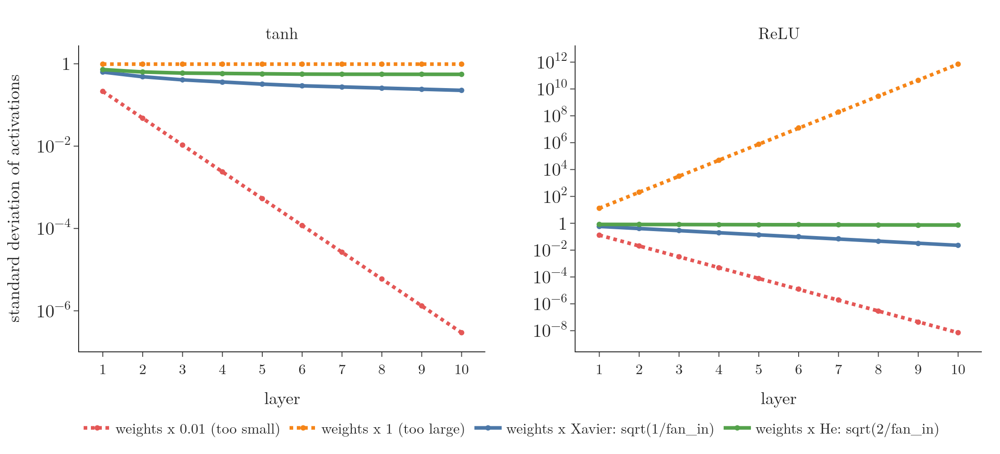
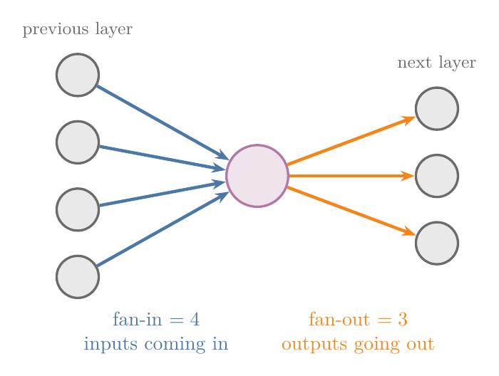
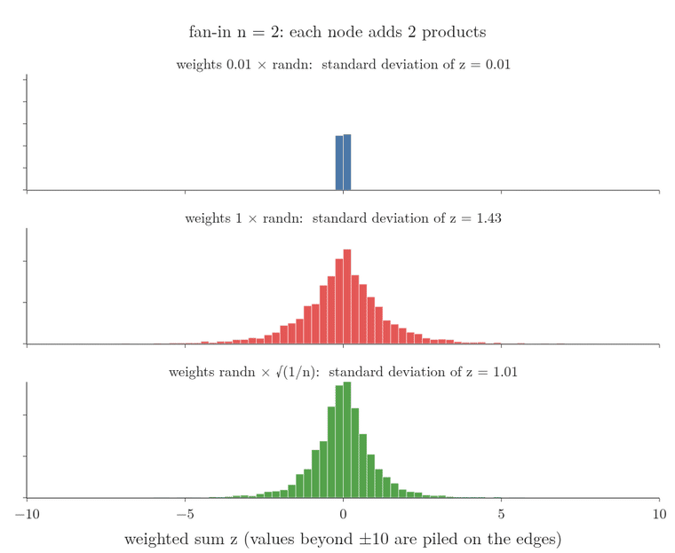
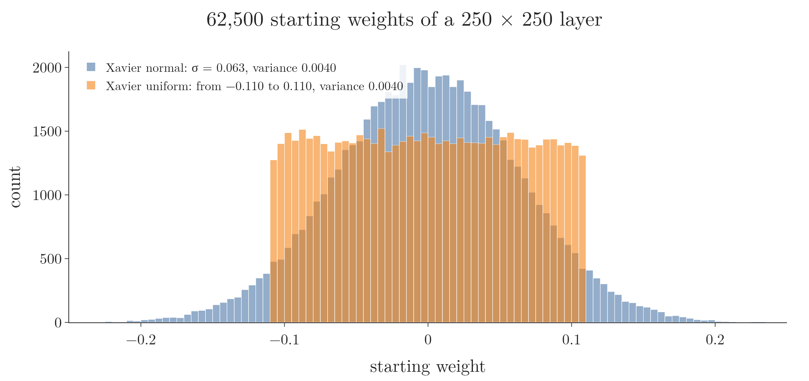
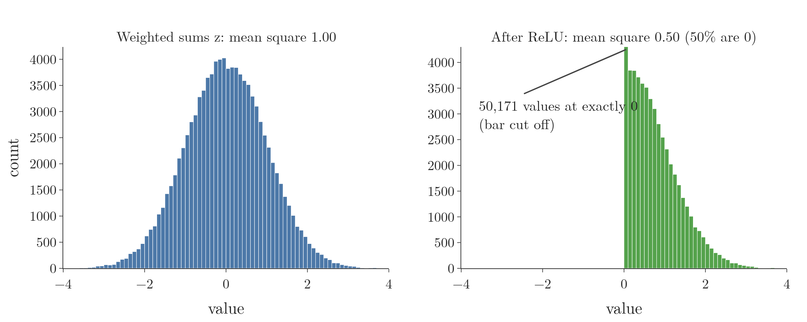

<!-- where-this-fits: generated by course_map/build_map.py; edit concepts.yaml, not this block -->
> **Where this fits:** Pipeline map step 8 (Model). See the [Course map](../../../00-course-map/00-course-map.md).
>
> 
>
> - **Builds on:** [Sigmoid function](../../../ML/07-classification/ML-071-sigmoid-function/ML-071-sigmoid-function.md#4-the-sigmoid-function); [Training curves (History)](../../../DL/01-basics/DL-011-customer-churn-ann/DL-011-customer-churn-ann.md#8-training-curves); [Backpropagation](../../../DL/01-basics/DL-015-backpropagation-what/DL-015-backpropagation-what.md#4-the-steps-of-backpropagation); [Exploding gradient and gradient clipping](../../../DL/01-basics/DL-018-vanishing-exploding-gradients/DL-018-vanishing-exploding-gradients.md#7-the-exploding-gradient-problem); [Activation functions](../../../DL/02-training/DL-027-activation-functions/DL-027-activation-functions.md#3-what-an-activation-function-is).
> - **Leads to:** [Skip connections](../../../DL/04-cnn/DL-054-keras-functional-api/DL-054-keras-functional-api.md#43-a-skip-connection); [Long-term dependency problem](../../../DL/05-rnn/DL-060-problems-with-rnn/DL-060-problems-with-rnn.md#3-the-long-term-dependency-problem).
> - **Compare with:** [Exploding gradient and gradient clipping](../../../DL/02-training/DL-029-weight-initialization/DL-029-weight-initialization.md#1-overview).
<!-- /where-this-fits -->

## 1. Overview

> **Key point:** Draw the starting weights at random with a spread set by the number of inputs to each node: variance $1/\text{fan-in}$ (Xavier, for tanh and sigmoid) or $2/\text{fan-in}$ (He, for ReLU). The signal then keeps roughly the same size through every layer.

[Weight initialisation](../DL-029-weight-initialization/DL-029-weight-initialization.md#3-why-the-starting-weights-matter) showed what fails:

- zeros and constants make every node identical, so the weights must be random;
- random weights that are too small make the signal die out;
- random weights that are too large make the signal saturate or explode.

So the spread must be in between.

This Note gives the two standard answers:

- **Xavier initialisation**, also called **Glorot initialisation** (G-850; Xavier Glorot is one person), for **tanh** (G-1947) and **sigmoid** (G-1798);
- **He initialisation** (G-850), after Kaiming He, for ReLU and its variants.

Each comes in a **normal** version (weights from a **normal distribution**, G-1343) and a **uniform** version (weights from a **uniform distribution**, G-2043), and Keras has all four built in.

{width=100%}

Figure 1 shows the effect. Only the scale of the random weights changes between the lines. The vertical axis is a log scale: equal distances mean equal multiplication, and each labelled gridline is 100 times the one below it (1, $10^{-2}$, $10^{-4}$, ...). A falling straight line is a signal that shrinks by the same factor at every layer.

The Xavier tanh line still drifts down, from 0.63 at layer 1 to 0.32 at layer 5 and 0.23 at layer 10. Xavier keeps the weighted sum the same size as its input, but tanh then shrinks every value a little, because $|\tanh z|$ is smaller than $|z|$. Near 0 tanh is almost a straight line through the origin, so as the signal gets smaller the shrinking slows down: the line flattens, while the 0.01 line keeps falling to 0.

## 2. Prerequisites

- [The four starts that fail](../DL-029-weight-initialization/DL-029-weight-initialization.md#4-do-not-start-every-weight-at-zero).
- [Variance](../../../MA/01-descriptive-stats/MA-006-measures-of-dispersion/MA-006-measures-of-dispersion.md#4-variance) and [standard deviation](../../../MA/01-descriptive-stats/MA-006-measures-of-dispersion/MA-006-measures-of-dispersion.md#5-standard-deviation): the average squared distance from the mean, and its square root.
- [Tanh](../DL-027-activation-functions/DL-027-activation-functions.md#7-tanh) and [ReLU](../DL-027-activation-functions/DL-027-activation-functions.md#8-relu).

## 3. The spread must depend on the number of inputs

> **Key point:** A node adds up $n$ products $w_i x_i$. The more inputs, the larger the sum, so each weight must be smaller. Setting the weights' variance to $1/n$ cancels the effect of $n$.

### 3.1 What went wrong with fixed scales

> **Key point:** With 250 inputs, weights of $\pm 0.01$ give a $z$ near 0; weights of $\pm 3$ give a $z$ that can reach $\pm 250$. A fixed scale cannot suit every layer size.

Take a hidden layer whose nodes each receive 250 inputs. The layer's 250 × 250 weights were drawn in two ways in the previous Note:

- `np.random.randn(250, 250) * 0.01`: weights around $\pm 0.01$. Multiplied by inputs around $\pm 1$ and summed, they give a small $z$, which the activation turns into almost 0.
- `np.random.randn(250, 250) * 1`: weights mostly between $-3$ and 3. The sum of 250 such products can be anywhere from about $-250$ to 250, and the activation saturates.

The trouble comes from the sum $z = \sum w_i x_i$: its size grows with the number of terms. So no fixed constant works; the scale has to depend on the network's **architecture** (G-209), through the number of inputs to each node.

### 3.2 Fan-in and fan-out

> **Key point:** Fan-in is the number of inputs coming into a node (the size of the previous layer); fan-out is the number of outputs leaving it.

{width=50%}

Two numbers describe where a layer sits (Figure 2):

- **Fan-in** (G-754): the number of inputs coming into each node of the layer, which is the number of nodes in the previous layer.
- **Fan-out** (G-755): the number of outputs going out of each node, which is the number of nodes in the next layer.

For a Keras `Dense` layer with weight matrix of shape (inputs, nodes), fan-in is the number of rows and fan-out the number of columns.

### 3.3 Variance $1/\text{fan-in}$

> **Key point:** Many inputs: smaller weights, so the sum stays moderate. Few inputs: larger weights, so the sum is not too small.

The rule is to draw the weights with **variance** (G-2074) $1/n$, where $n$ is the fan-in. The **standard deviation** (G-1871) is then $\sqrt{1/n}$, and that is the number we multiply the **standard normal** (G-1873) numbers by.

1. **In words:** multiply standard normal numbers by $\sqrt{1/\text{fan-in}}$.
2. **Formula:**
   $$W = \texttt{randn} \times \sqrt{\frac{1}{\text{fan-in}}}$$
   $$\text{Var}(W) = \frac{1}{\text{fan-in}}$$
3. **Example:** with 250 inputs the standard deviation is
   $$\sqrt{1/250} = 0.063$$
   so the weights are mostly between about $-0.19$ and 0.19. With only 2 inputs:
   $$\sqrt{1/2} = 0.71$$
   Fewer inputs, larger weights.

The intuition is a balance. If there are many inputs, each weight is made small so that the sum $\sum w_i x_i$ does not grow too big. If there are few inputs, each weight is made larger so that the sum is not too small. Think of a chain of loudspeakers, each feeding the next: if every speaker turns the sound down, the last one is silent; if every one turns it up, the last one distorts. Each speaker's volume knob must be set so that the sound leaves it as loud as it came in.

Figure 3 tests the rule. One node adds $n$ products $w_i x_i$ with standard normal inputs, and we draw 4,000 such weighted sums for each of three ways of scaling the weights, while the fan-in $n$ grows from 2 to 1,000.

{width=90%}

Watch the width of each histogram as $n$ grows:

- **$0.01 \times$ randn (top):** $z$ stays a needle at 0. Its standard deviation is 0.01 with 2 inputs and still only 0.32 with 1,000.
- **$1 \times$ randn (middle):** the histogram flattens and runs off the axis. The standard deviation grows from 1.43 to 15.7 with 250 inputs and 31.8 with 1,000.
- **randn $\times \sqrt{1/n}$ (bottom):** the histogram keeps the same shape for every $n$, with standard deviation 1.01, 1.00 and 1.00 for 2, 250 and 1,000 inputs.

Only the scale that depends on the fan-in gives every layer size a weighted sum of the same size.

> **Extra:** Why exactly $1/n$? Start with one product $w x$, where $w$ and $x$ are independent, each with mean 0. Its variance is the product of the two variances (see [variance of a random variable](../../../MA/02-probability/MA-012-expected-value-and-variance/MA-012-expected-value-and-variance.md#4-variance-of-a-random-variable); $E[\cdot]$ is the expected value, the average):
> $$\text{Var}(wx) = E[w^2x^2] - (E[wx])^2$$
> $$E[w^2x^2] = E[w^2]\thinspace E[x^2]$$
> $$= \text{Var}(w)\thinspace\text{Var}(x)$$
> $$E[wx] = E[w]\thinspace E[x] = 0$$
> $$\text{Var}(wx) = \text{Var}(w)\thinspace\text{Var}(x)$$
> Variances of independent terms add. A small instance: $n = 4$ inputs, with $\text{Var}(w) = 1$ and $\text{Var}(x) = 1$ for each. Each product has variance
> $$1 \times 1 = 1$$
> and the sum of 4 of them has variance
> $$1 + 1 + 1 + 1 = 4$$
> In general
> $$\text{Var}(z) = \text{Var}\Big(\sum_{i=1}^{n} w_i x_i\Big)$$
> $$= n\thinspace\text{Var}(w)\thinspace\text{Var}(x)$$
> Choosing the weights' variance $1/n$ gives $z$ the same variance as $x$: the signal leaves the layer the same size it came in. The Notebook checks it with 500 inputs of variance 1:
>
> - weights' variance 0.0001 gives $\text{Var}(z) = 0.053$ (predicted 0.05);
> - weights' variance 1 gives 457 (predicted 500);
> - weights' variance $1/500$ gives 0.93 (predicted 1).

## 4. Xavier (Glorot) initialisation

> **Key point:** Normal: standard deviation $\sqrt{1/\text{fan-in}}$, or the common variant $\sqrt{2/(\text{fan-in} + \text{fan-out})}$. Uniform: between $\pm\sqrt{6/(\text{fan-in} + \text{fan-out})}$. Use it with tanh and sigmoid.

**Xavier initialisation** (Glorot initialisation) draws the starting weights with the spread of section 3.3. Glorot and Bengio (2010) designed it for, and tested it on, tanh networks.

### 4.1 Xavier normal

> **Key point:** Weights from a normal distribution with mean 0 and standard deviation $\sqrt{1/\text{fan-in}}$, or $\sqrt{2/(\text{fan-in} + \text{fan-out})}$.

1. **In words:** standard normal numbers times $\sqrt{1/\text{fan-in}}$. A widely used variant averages fan-in and fan-out.
2. **Formula:**
   $$s = \sqrt{\frac{1}{\text{fan-in}}}$$
   or
   $$s = \sqrt{\frac{2}{\text{fan-in} + \text{fan-out}}}$$
   Here $s$ is the standard deviation of the weights (this Note avoids $\sigma$ for it, because $\sigma$ is the sigmoid in other Notes of the series).
3. **Example:** a layer with fan-in 250 and fan-out 250:
   $$\sqrt{\frac{1}{250}} = 0.063$$
   $$\sqrt{\frac{2}{250 + 250}} = \sqrt{0.004} = 0.063$$
   For equal fan-in and fan-out the two agree. With fan-in 2 and fan-out 10 they differ:
   $$\sqrt{\frac{1}{2}} = 0.71$$
   $$\sqrt{\frac{2}{2 + 10}} = 0.41$$

The variant with fan-in plus fan-out is the one used more often, and the one Keras calls `glorot_normal`.

> **Extra:** The $\sqrt{1/\text{fan-in}}$ version is often called **LeCun initialisation** (G-1077; LeCun et al. 1998; Keras: `lecun_normal`), the start SELU needs (see [ReLU variants](../DL-028-relu-variants/DL-028-relu-variants.md#6-non-linear-variants)). Glorot and Bengio (2010) proposed the averaged version, their "normalized initialization": $1/\text{fan-in}$ keeps the forward signal steady, $1/\text{fan-out}$ keeps the backward gradient steady, and $2/(\text{fan-in} + \text{fan-out})$ is a compromise between the two.

### 4.2 Xavier uniform

> **Key point:** Weights from a uniform distribution between $-L$ and $L$, where $L$ is the square root of 6 over the sum of fan-in and fan-out.

1. **In words:** every value between $-L$ and $L$ is equally likely.
2. **Formula:**
   $$W \sim \text{Uniform}(-L, L)$$
   $$L = \sqrt{\frac{6}{\text{fan-in} + \text{fan-out}}}$$
3. **Example:** fan-in 250, fan-out 250:
   $$L = \sqrt{\frac{6}{500}} = \sqrt{0.012} = 0.110$$
   so the weights lie between $-0.110$ and 0.110.



Figure 4 draws both versions for this layer. The normal weights pile up near 0 and thin out towards $\pm 0.2$; the uniform weights spread evenly between $-0.110$ and 0.110 and stop there. Their variances are the same, 0.0040, so a layer receives signals of the same size from either.

> **Extra:** The 6 comes from the variance of a uniform distribution: values spread evenly between $-L$ and $L$ have density $1/(2L)$ and mean 0, so their variance is the area-weighted average of $x^2$:
>
> $$\int_{-L}^{L} \frac{x^2}{2L}\thinspace dx = \frac{L^2}{3}$$
>
> Setting this equal to the normal version's variance gives
>
> $$\frac{L^2}{3} = \frac{2}{\text{fan-in} + \text{fan-out}}$$
>
> $$L^2 = \frac{6}{\text{fan-in} + \text{fan-out}}$$
>
> So Xavier uniform has exactly the same variance as Xavier normal; only the shape differs. Above:
>
> $$\frac{0.110^2}{3} = 0.004$$
>
> which is the variance $0.063^2$ of the normal version.

## 5. He initialisation

> **Key point:** Like Xavier, with 2 in place of 1: standard deviation $\sqrt{2/\text{fan-in}}$ (normal) or limit $\sqrt{6/\text{fan-in}}$ (uniform). Use it with ReLU.

**He initialisation** is Xavier with the variance doubled. He et al. (2015) designed it for ReLU: in their experiments a 30-layer ReLU network trained with it, while with Xavier's spread the same network stalled.

### 5.1 He normal and He uniform

> **Key point:** Normal: standard deviation $s$ is the square root of 2 over the fan-in. Uniform: limit $L$ is the square root of 6 over the fan-in.

1. **In words:** standard normal numbers times $\sqrt{2/\text{fan-in}}$; or uniform numbers between $\pm\sqrt{6/\text{fan-in}}$.
2. **Formula:**
   $$s = \sqrt{\frac{2}{\text{fan-in}}}$$
   $$L = \sqrt{\frac{6}{\text{fan-in}}}$$
3. **Example:** fan-in 250:
   $$s = \sqrt{\frac{2}{250}} = 0.089$$
   $$L = \sqrt{\frac{6}{250}} = 0.155$$
   Both have the same variance:
   $$\text{normal: } s^2 = \frac{2}{250} = 0.008$$
   $$\text{uniform: } \frac{L^2}{3} = \frac{0.155^2}{3} = 0.008$$
   (A uniform spread between $-L$ and $L$ has variance $L^2/3$; see the Extra of section 4.2.)

Why twice as much? Figure 5 shows what ReLU does to the size of the signal.



- **Before ReLU (left):** the weighted sums are spread evenly on both sides of 0, with mean square 1.00.
- **After ReLU (right):** every negative value has become 0, about half of them. The positive half is unchanged, so the mean square is now 0.50.
- **Over many layers:** a layer with Xavier's variance passes on a signal that ReLU then halves, so the signal halves at every layer. Doubling the weights' variance, $2/\text{fan-in}$, puts back exactly what ReLU removes.

> **Extra:** Why the 2? ReLU sets every negative $z$ to 0. If $z$ is symmetric around 0, the positive half keeps its $z^2$ and the negative half contributes 0, so $E[\text{ReLU}(z)^2] = \tfrac{1}{2}E[z^2]$: the size (mean square) of the signal halves at every layer. Doubling the weights' variance makes up for exactly that loss (He et al. 2015). Figure 1 shows it: with ReLU, Xavier's spread lets the standard deviation fall from 0.59 to 0.023 over 10 layers, while He's keeps it between 0.83 and 0.73.

### 5.2 Which one to use

> **Key point:** Tanh or sigmoid: Xavier. ReLU and its variants: He.

| Initialisation | Normal: standard deviation | Uniform: limit $L$ | Use with |
|---|---|---|---|
| Xavier (Glorot) | $\sqrt{1/\text{fan-in}}$ or $\sqrt{2/(\text{fan-in} + \text{fan-out})}$ | $\sqrt{6/(\text{fan-in} + \text{fan-out})}$ | tanh, sigmoid |
| He | $\sqrt{2/\text{fan-in}}$ | $\sqrt{6/\text{fan-in}}$ | ReLU and variants |

Both rules come from the variance argument of section 3.3 and were tested in the papers that introduced them (Glorot and Bengio 2010; He et al. 2015). For applying them, the four formulas and this pairing are enough.

## 6. Xavier and He in Keras

> **Key point:** Pass `kernel_initializer="glorot_normal"`, `"glorot_uniform"`, `"he_normal"` or `"he_uniform"` to each `Dense` layer. The default is `glorot_uniform`, with biases starting at 0.

### 6.1 Xavier by hand

> **Key point:** The four-layer tanh network that stayed at loss 0.693 with weights of 0.01 now reaches 0.002 and 100% accuracy.

We reuse the network of [the weights do not move in Keras](../DL-029-weight-initialization/DL-029-weight-initialization.md#63-in-keras-the-weights-do-not-move):

- **data:** 300 standardised `make_moons` (G-111) **observations** (G-1374; records), each with two **features** (G-772; input variables) and a class as **target** (G-1949; the output we predict);
- **network:** four hidden layers of 10 tanh nodes;
- **training:** plain **SGD** (G-1892) with **learning rate** (G-1068) 0.1, 100 **epochs** (G-696).

The 0.01-scale network, started from weights of $0.01 \times$ standard normal, never moved from a loss of 0.6934.

Now every weight matrix is drawn as standard normal numbers times $\sqrt{1/\text{fan-in}}$. For the first layer, which has 2 inputs:

$$\sqrt{1/2} = 0.71$$

For the layers after it, which have 10 inputs:

$$\sqrt{1/10} = 0.32$$

The biases start at 0.

> **Python:** Xavier normal by hand.
>
> ```python
> new = []
> for w in model.get_weights():
>     if w.ndim == 2:              # a weight matrix
>         fan_in = w.shape[0]      # rows = inputs
>         new.append(np.random.randn(*w.shape)
>                    * np.sqrt(1 / fan_in))
>     else:                        # a bias vector
>         new.append(np.zeros_like(w))
> model.set_weights(new)
> ```

The loss falls from 0.650 to 0.0023, and the training accuracy is 100%. The weights move: one first-layer weight goes from 0.58 to 2.04. Figure 6 (left) shows the **decision boundary** (G-555), the line between the two predicted classes, following the moons.

### 6.2 With Keras' initialisers

> **Key point:** One argument per layer. All four initialisers train the network to 100% training accuracy here.

> **Python:** **He normal** (G-881) for a ReLU layer.
>
> ```python
> keras.layers.Dense(10, activation="relu",
>                    kernel_initializer="he_normal")
> ```
>
> `kernel_initializer` sets how the layer's weight matrix (Keras calls it the kernel) starts. The other options are `"he_uniform"` (G-882), `"glorot_normal"` and `"glorot_uniform"`; `bias_initializer` does the same for the biases.

The same four-layer network with each initialiser, 100 epochs of plain SGD:

| Activation | Initialiser | Loss at start | Loss at end | Training accuracy |
|---|---|---|---|---|
| ReLU | `he_normal` | 0.770 | 0.0020 | 100% |
| ReLU | `he_uniform` | 0.590 | 0.0012 | 100% |
| tanh | `glorot_normal` | 0.714 | 0.0032 | 100% |
| tanh | `glorot_uniform` | 0.564 | 0.0021 | 100% |

{width=100%}

In Figure 6, the background shade is the probability the network gives to class 1 at that spot: light orange where it favours class 1, light blue where it favours class 0, white at 0.5. The black line is the decision boundary, where the probability is 0.5. The dots are the training points (blue: class 0, orange: class 1).

On such a small problem every good start works. The differences show in deep networks: in He et al. (2015), Xavier and He starts both trained a 22-layer ReLU network, but only He trained a 30-layer one. Trying the combinations on our own data shows which works best there.

**The default.** If we do not pass `kernel_initializer`, a `Dense` layer uses `glorot_uniform`, and its biases start at 0 (`zeros`). Zero biases are safe because the random weights already make every node different, so the biases are not needed to break the [symmetry](../DL-029-weight-initialization/DL-029-weight-initialization.md#43-sigmoid-every-node-becomes-the-same-node) (nodes that start equal stay equal) (CS231n notes, "Neural Networks Part 2"). Keras' default explains why the networks of the earlier Notes trained without our choosing anything.

> **Extra:** Keras' normal versions draw from a **truncated normal** (G-2023) distribution: values more than two standard deviations from 0 are redrawn (Keras documentation). Redrawing alone would shrink the spread, yet the measured standard deviation still matches the formula, so Keras compensates for the cut. The Notebook checks all four on a 1000 × 100 layer: `glorot_normal` has standard deviation 0.0426, matching the formula
>
> $$\sqrt{2/1100} = 0.0426$$
>
> and `he_uniform` reaches at most 0.0775, matching
>
> $$\sqrt{6/1000} = 0.0775$$

## 7. Summary

| Start | Spread | Signal through 10 layers (Figure 1) |
|---|---|---|
| $0.01 \times$ randn | fixed, too small | dies out (tanh and ReLU) |
| $1 \times$ randn | fixed, too large | tanh saturates; ReLU explodes to $10^{11}$ |
| Xavier | variance $1/\text{fan-in}$ | tanh stays in range (0.63 to 0.23) |
| He | variance $2/\text{fan-in}$ | ReLU stays steady (0.83 to 0.73) |

- Xavier (Glorot): $\sqrt{1/\text{fan-in}}$ or $\sqrt{2/(\text{fan-in} + \text{fan-out})}$; uniform limit $\sqrt{6/(\text{fan-in} + \text{fan-out})}$. For tanh and sigmoid, because it keeps each weighted sum the same size as its input.
- He: $\sqrt{2/\text{fan-in}}$; uniform limit $\sqrt{6/\text{fan-in}}$. For ReLU, because ReLU sets about half the values to 0 and the 2 makes up for that loss.
- In Keras: `kernel_initializer=...` per layer; the default is `glorot_uniform`, so a ReLU layer needs `he_normal` or `he_uniform` passed by hand.
- The starting weights must be random, with a spread that depends on the fan-in, because a node adds up fan-in products: the more inputs, the smaller each weight must be.

## 8. Sources

**Built from**

- CampusX, "Xavier/Glorat And He Weight Initialization in Deep Learning", YouTube, https://www.youtube.com/watch?v=nwVOSgcrbQI

**Other references**

- Glorot, X. and Bengio, Y. (2010). Understanding the difficulty of training deep feedforward neural networks. AISTATS 2010, PMLR 9:249-256 (equation 12: the variance $2/(n_i + n_{i+1})$).
- He, K., Zhang, X., Ren, S. and Sun, J. (2015). Delving Deep into Rectifiers: Surpassing Human-Level Performance on ImageNet Classification. ICCV 2015. arXiv:1502.01852 (section 2.2 and Figures 2 and 3).
- Keras API documentation: layer weight initializers (`GlorotNormal`, `HeNormal`, `TruncatedNormal`), keras.io/api/layers/initializers.
- Stanford CS231n course notes, "Neural Networks Part 2: Setting up the Data and the Loss", cs231n.github.io/neural-networks-2 (weight initialisation: biases can start at zero because the random weights break the symmetry).
- LeCun, Y., Bottou, L., Orr, G. B. and Müller, K.-R. (1998). Efficient BackProp. In *Neural Networks: Tricks of the Trade*, Springer (equation 16: standard deviation $m^{-1/2}$ for fan-in $m$).

## 9. Key terms

| Term | Meaning |
|---|---|
| Fan-in | The number of inputs coming into a node, equal to the size of the previous layer. Xavier and He initialisation use it to set the spread of the starting weights. |
| Fan-out | The number of outputs leaving a node, equal to the size of the next layer. Xavier initialisation uses it, with fan-in, to set the spread of the starting weights. |
| Xavier (Glorot) normal | Starting weights drawn from a normal distribution whose spread is set by the layer's size, standard deviation $\sqrt{1/\text{fan-in}}$ or $\sqrt{2/(\text{fan-in} + \text{fan-out})}$, so the signal keeps its size from layer to layer. |
| Xavier (Glorot) uniform | Starting weights drawn evenly between $\pm\sqrt{6/(\text{fan-in} + \text{fan-out})}$, a range set by the layer's size, so the signal keeps its size from layer to layer. |
| He normal | A way to set starting weights for ReLU layers: draw them from a normal distribution with standard deviation $\sqrt{2/\text{fan-in}}$, so the signal keeps roughly the same size from layer to layer. |
| He uniform | A way to set starting weights for ReLU layers: draw them evenly between $-\sqrt{6/\text{fan-in}}$ and $+\sqrt{6/\text{fan-in}}$, so the signal keeps roughly the same size from layer to layer. |
| LeCun initialisation | A way to pick a network's random starting weights: draw them from a normal distribution with standard deviation $\sqrt{1/\text{fan-in}}$ (fan-in is the number of inputs to a node), so the signal keeps a steady spread from layer to layer; the start SELU needs (Keras `lecun_normal`). |
| `kernel_initializer` | The `Dense` argument that chooses how a layer's weight matrix starts; default `glorot_uniform` |
| Truncated normal | A normal distribution with values beyond two standard deviations redrawn |
