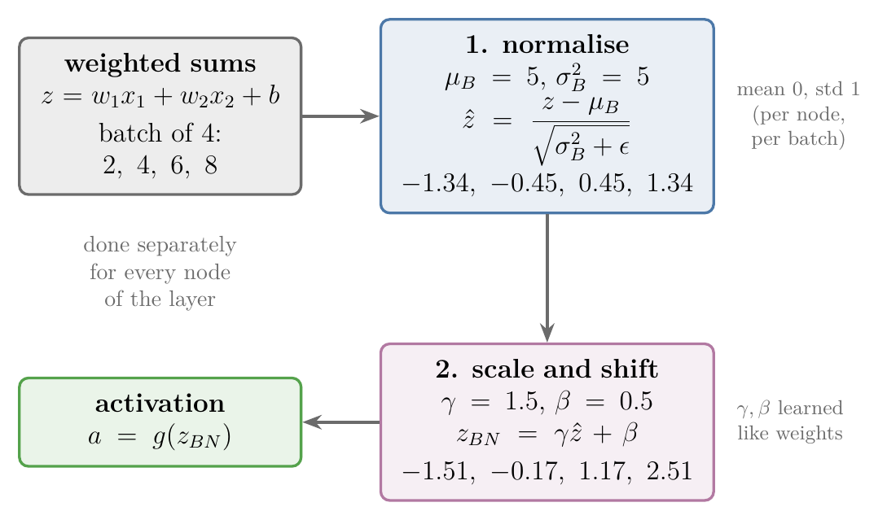
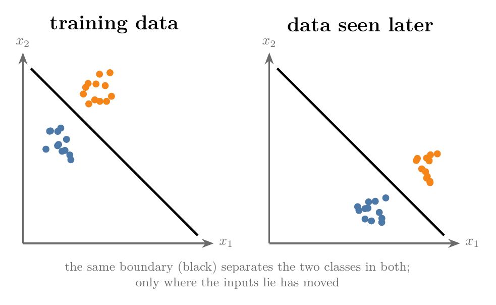
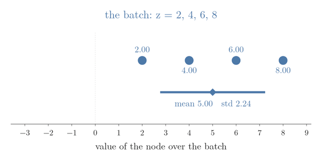
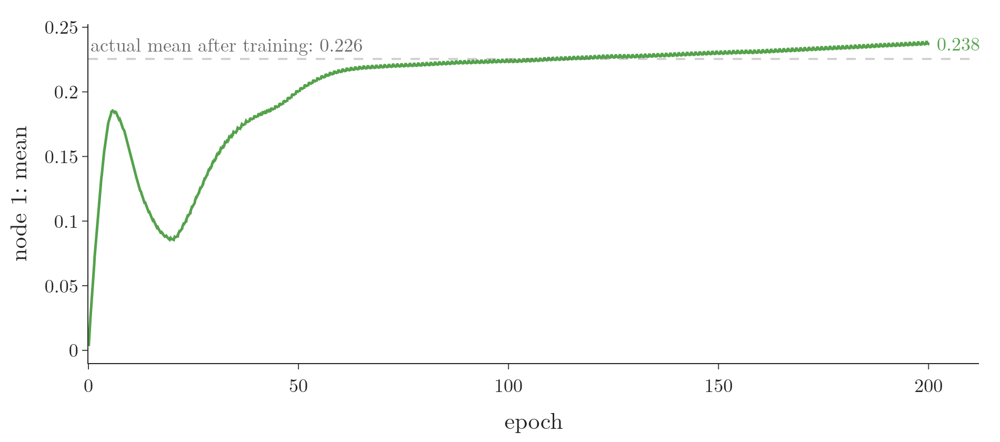
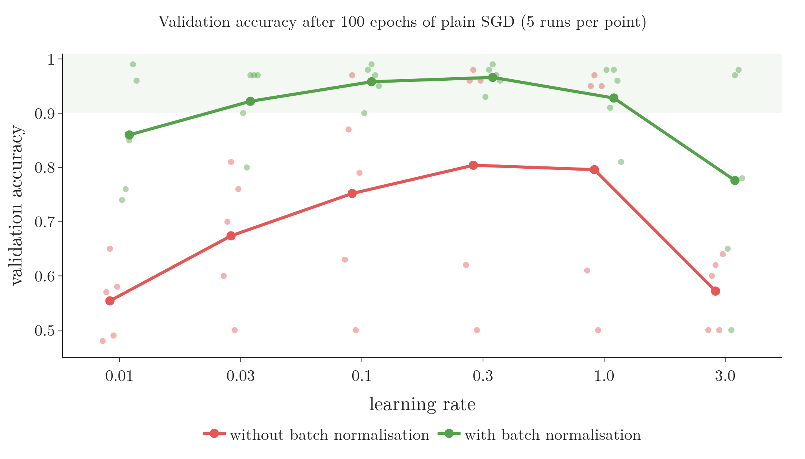
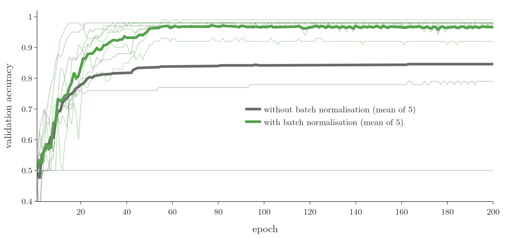

<!-- where-this-fits: generated by course_map/build_map.py; edit concepts.yaml, not this block -->
> **Where this fits:** Pipeline map steps 5 (Engineer features), 8 (Model). See the [Course map](../../../00-course-map/00-course-map.md).
>
> 
>
> - **Builds on:** Feature scaling ([Note ML-006](../../../ML/01-foundations/ML-006-instance-vs-model-based/ML-006-instance-vs-model-based.md)); Train-test split ([Note ML-012](../../../ML/01-foundations/ML-012-toy-project/ML-012-toy-project.md)); Descriptive statistics ([Note ML-018](../../../ML/02-getting-data/ML-018-understanding-your-data/ML-018-understanding-your-data.md)); Mini-batch gradient descent ([Note ML-059](../../../ML/06-regression/ML-059-mini-batch-gradient-descent/ML-059-mini-batch-gradient-descent.md)); Exponentially weighted moving average (EWMA) ([Note DL-033](../../../DL/03-optimizers/DL-033-exponentially-weighted-moving-average/DL-033-exponentially-weighted-moving-average.md)).
> - **Compare with:** Normalization ([Note ML-024](../../../ML/03-feature-engineering/ML-024-normalization/ML-024-normalization.md)); Dropout ([Note DL-025](../../../DL/02-training/DL-025-dropout-code/DL-025-dropout-code.md)); Layer normalisation ([Note DL-080](../../../DL/06-transformers/DL-080-layer-normalization/DL-080-layer-normalization.md)).
<!-- /where-this-fits -->

## 1. Overview

> **Key point:** Batch normalisation standardises the values inside a hidden layer, node by node, using the mean and variance of the current mini-batch, then lets the network rescale them with two learned numbers, $\gamma$ and $\beta$. Training becomes faster and more stable.

**Batch normalisation** (G-266; BN; Ioffe and Szegedy 2015) is an algorithmic method that makes the training of deep neural networks faster and more stable. We already standardise the inputs of a network to mean 0 and **standard deviation** (G-1871) 1 (see the [data scaling Note](../DL-023-data-scaling-in-ann/DL-023-data-scaling-in-ann.md)). But the outputs of each hidden layer are the inputs of the next one, and nobody scales those.

Batch normalisation scales those hidden-layer outputs, inside the network. For a chosen hidden layer, it takes the values of each node over the current **mini-batch** (G-263) and brings them to mean 0 and standard deviation 1. The normalisation step is applied right before or right after the **activation function** (G-165).

{width=80%}

Figure 1 shows the whole computation for one node. This Note covers:

- why it helps (section 3);
- how it works during training (section 4);
- how it works during prediction (section 5);
- its benefits (section 6);
- how to add it in Keras (section 7).

## 2. Prerequisites

- The [standardization Note](../../../ML/03-feature-engineering/ML-023-standardization/ML-023-standardization.md): $(x - \bar{x})/\sigma$ gives mean 0 and standard deviation 1.
- The [gradient descent in neural networks Note](../DL-020-gradient-descent-in-neural-networks/DL-020-gradient-descent-in-neural-networks.md): mini-batches and `batch_size`.
- The [backpropagation how Note](../../01-basics/DL-016-backpropagation-how/DL-016-backpropagation-how.md): how weights are updated.

## 3. Why normalise inside the network

> **Key point:** Two reasons. Normalised inputs make the loss surface round and training fast, so normalising every layer's inputs should help too. And it reduces internal covariate shift: the inputs of each layer keep changing as the earlier weights change.

### 3.1 Normalised inputs train faster

> **Key point:** Inputs on different scales stretch the loss into a narrow valley, which forces a small learning rate. Normalised inputs make it round, so larger steps are safe.

Take two **features** (G-772; input variables, the columns of the data table) on very different scales, such as CGPA (single digits) and IQ (around 100). Standardising them centres both at 0 with standard deviation 1. As section 9 of the [gradient descent Note](../../../ML/06-regression/ML-056-gradient-descent/ML-056-gradient-descent.md) shows, this changes the shape of the loss:

- **Not normalised:** the contours of the loss are long, narrow ellipses, stretched in one direction. A large **learning rate** (G-1068) would overshoot in the steep direction, so we must keep it small, and progress along the flat direction is slow. Training is slow, or unstable.
- **Normalised:** the contours are nearly round, the same in every direction. We can reach the minimum quickly and stably.

The outputs of a hidden layer are the inputs of the next layer. If normalising the network's inputs makes training fast and stable, normalising each hidden layer's outputs should help in the same way. Normalising hidden-layer outputs is the first idea behind batch normalisation.

### 3.2 Covariate shift

> **Key point:** When the distribution of the inputs changes, but the relationship between inputs and output does not, a model trained on the old inputs can still fail. Such a change is covariate shift.

**Covariate shift** (G-497) is a change in the distribution of the features between the data a model was trained on and the data it sees later, while the relationship between input and output stays the same.

{width=80%}

In Figure 2, the **decision boundary** (G-555) between the two classes, the line that separates them, is the same before and after. Only the region where the inputs lie has moved. A model trained only on the left-hand data has never seen the right-hand region, so it may perform badly there, and we would have to retrain it.

A standard example: a network trained to tell roses from other flowers, where every rose in the training images happens to be red. At test time it sees yellow, white and pink roses. What makes a rose a rose has not changed, but the inputs have, and the model performs poorly.

### 3.3 Internal covariate shift

> **Key point:** Inside a network, every layer's inputs are the previous layer's outputs, and those change at every update. Each layer chases a moving target, which makes training slow and unstable.

The paper that introduced batch normalisation defines **internal covariate shift** (G-963) as the change in the distribution of a network's activations due to the change in its parameters during training (Ioffe and Szegedy 2015).

Take a deep network and look at only its later layers, as if they were a network of their own. Their inputs are the outputs of an earlier hidden layer. The earlier layer's outputs depend on the earlier weights, and the earlier weights change at every update. So the distribution of the later layers' inputs keeps changing during training, and the later layers must keep re-adapting to it.

Internal covariate shift is like a game of whispers along a line of children: the first is told "P", passes on "B", the next turns it into "knees", then "cheese", then "fleece". Each layer passes information on, but because every layer's weights keep changing, what reaches the end has drifted a long way.

Batch normalisation fixes the mean and standard deviation of every node's values at each normalised layer. The later layers then get a stable distribution to work on. Without it, a network suffering from internal covariate shift needs a low learning rate and very careful weight initialisation (**initialisation**, G-947) to train at all (Ioffe and Szegedy 2015).

Figure 3 shows what the second hidden layer receives in the circles network of section 7, for all 500 observations, while it trains. Watch the bars against their grey starting position. Without batch normalisation the values drift and spread: the three nodes' means grow from 0.37, 0.20 and 0.43 to 0.83, 0.94 and 0.75, and their spreads from about 0.3 to 0.6 up to about 0.9. With batch normalisation every node stays centred near 0 with spread near 1, moving only as far as its $\gamma$ and $\beta$ have learned to move it (Notebook).

{width=100% height=50%}

> **Extra:** Later research (Santurkar et al. 2018) questioned whether reducing internal covariate shift is really why batch normalisation works. Their experiments point instead to the first reason: it makes the loss surface smoother, so larger steps are safe. The benefits in section 6 hold either way.

## 4. How batch normalisation works during training

> **Key point:** Batch normalisation works with mini-batches, on one chosen layer at a time, and on each node of that layer separately: compute the batch mean and variance, normalise, then scale by $\gamma$ and shift by $\beta$.

### 4.1 Three facts to keep in mind

> **Key point:** Mini-batch gradient descent; layer by layer and optional per layer; every node on its own.

1. **Batch normalisation needs mini-batches.** Batch normalisation is used with [mini-batch gradient descent](../DL-020-gradient-descent-in-neural-networks/DL-020-gradient-descent-in-neural-networks.md) (G-1222): its statistics come from the observations of the current batch.
2. **Batch normalisation is applied layer by layer.** We can apply it to one, some or all hidden layers; it is optional for each.
3. **Batch normalisation works on each node separately.** In a normalised layer, every node's values are normalised on their own, with their own statistics and their own $\gamma$ and $\beta$.

### 4.2 Where it sits in a node

> **Key point:** A node computes $z$, then its activation. Batch normalisation goes in between (the more common choice) or after the activation.

Take 100 students with CGPA and IQ, predicting placement, and a hidden layer of two nodes. The first node computes

$$z_{11} = w_1 \cdot \text{CGPA} + w_2 \cdot \text{IQ} + b_{11}$$

and then its activation $a_{11} = g(z_{11})$. With batch normalisation on this layer, we first normalise $z_{11}$ and only then apply the activation. The alternative, applying the activation first and then normalising $a_{11}$, also exists; normalising $z$ is the more popular choice, the one in the original paper (Ioffe and Szegedy 2015), and the one followed here.

### 4.3 Step 1: normalise with the batch's statistics

> **Key point:** With a batch of $m$ observations, each node has $m$ values of $z$. Their mean $\mu_B$ and variance $\sigma_B^2$ standardise them.

With **batch size** (G-267) 4, four students enter the network together. Their $4 \times 2$ input matrix times the $2 \times 2$ **weight matrix** (G-2109), plus the biases, gives a $4 \times 2$ matrix: four values of $z$ for each of the two nodes, one per student. Each node's four values are normalised separately.

1. **In words:** subtract the batch mean of the node's $z$ values and divide by their standard deviation. A tiny $\epsilon$ prevents division by 0 when all values are equal.
2. **Formula:**
   $$\mu_B = \frac{1}{m}\sum_{i=1}^{m} z_i, \qquad \sigma_B^2 = \frac{1}{m}\sum_{i=1}^{m} (z_i - \mu_B)^2, \qquad \hat z_i = \frac{z_i - \mu_B}{\sqrt{\sigma_B^2 + \epsilon}}$$
3. **Example:** one node's values over the batch are $z = 2, 4, 6, 8$.
   $$\mu_B = \frac{2 + 4 + 6 + 8}{4} = 5, \qquad \sigma_B^2 = \frac{9 + 1 + 1 + 9}{4} = 5, \qquad \sigma_B = 2.236$$
   $$\hat{z} = \frac{2 - 5}{2.236},\ \frac{4 - 5}{2.236},\ \frac{6 - 5}{2.236},\ \frac{8 - 5}{2.236} = -1.34,\ -0.45,\ 0.45,\ 1.34$$
   The new values have mean 0 and standard deviation 1.

### 4.4 Step 2: scale and shift with $\gamma$ and $\beta$

> **Key point:** $z_{BN} = \gamma\hat{z} + \beta$, with $\gamma$ and $\beta$ learned by gradient descent, one pair per node. The two parameters let the network choose a different mean and spread if that works better.

After normalising, each value is multiplied by a parameter $\gamma$ (gamma) and shifted by a parameter $\beta$ (beta):

1. **In words:** scale the normalised value, then shift it.
2. **Formula:**
   $$z_{BN} = \gamma\thinspace\hat{z} + \beta$$
3. **Example:** with $\gamma = 1.5$ and $\beta = 0.5$, the values above become
   $$1.5 \times (-1.34) + 0.5 = -1.51,\quad -0.17,\quad 1.17,\quad 2.51$$
   which have mean 0.5 and standard deviation 1.5.

$z_{BN}$ then goes into the activation function, giving $a_{11}$. Keras' `BatchNormalization` layer, given the same $\gamma$ and $\beta$, returns exactly these four numbers (Notebook).

Figure 4 plays the two steps on these four values. Watch the bar under the dots:

1. subtracting the mean slides it to 0;
2. dividing by the standard deviation squeezes it to width 1 on each side;
3. $\gamma$ and $\beta$ then stretch and move it.

{width=95%}

**$\gamma$ and $\beta$ are learnable parameters** (G-1065). They are trained by **backpropagation** (G-247) like weights and biases, for example $\gamma_{\text{new}} = \gamma_{\text{old}} - \eta\thinspace\partial L/\partial\gamma$. Every step above is differentiable, so their gradients exist. In Keras $\gamma$ starts at 1 and $\beta$ at 0, so at first the layer only normalises. Each node has its own $\gamma$ and $\beta$.

**Why undo the normalisation?** Scaling and shifting is the opposite of normalising, which looks strange. If training found $\gamma = \sqrt{\sigma_B^2 + \epsilon}$ and $\beta = \mu_B$, the two steps would cancel and give back the original $z$ (the Notebook gets $2, 4, 6, 8$ back). The possible cancelling is the point: mean 0 and standard deviation 1 may not suit every layer and every dataset. $\gamma$ and $\beta$ give the network the flexibility to keep the normalisation, or to choose another distribution, or to switch it off.

### 4.5 In a deep network

> **Key point:** Think of batch normalisation as a layer between two layers. The layer holds 2 learnable parameters per node, updated by backpropagation like any weight.

Keras treats batch normalisation as a layer of its own, placed after the layer whose values it normalises. For a hidden layer of two nodes, the batch normalisation layer holds 4 learnable parameters: $\gamma$ and $\beta$ for each node. **Forward propagation** (G-797) passes through it, and backpropagation updates its $\gamma$ and $\beta$ along with every weight and bias.

## 5. Batch normalisation during prediction

> **Key point:** A single query point has no batch to average over. During training the layer keeps moving averages of each node's mean and variance; for prediction it uses those instead.

During training the mean and variance come from the batch. For a prediction we usually have one **observation** (G-1374; one record), the query point, and its own "batch mean" is just itself. Where do $\mu$ and $\sigma$ come from?

The answer is the **exponentially weighted moving average** (G-735; EWMA), taught with the optimizers. With 100 observations and batch size 4 there are 25 batches per epoch, and each produces its own $\mu_B$ and $\sigma_B^2$. After every batch, the layer updates a running average of them, which leans towards recent batches. When training ends, the last values of these moving averages are used to normalise every prediction.

1. **In words:** keep most of the old average and mix in a little of the new batch value.
2. **Formula** (Keras' version, momentum 0.99; Keras documentation; these running values are the **moving mean and moving variance**, G-1265):
   $$\mu_{\text{moving}} \leftarrow 0.99\thinspace\mu_{\text{moving}} + 0.01\thinspace\mu_B$$
   and the same for the variance.
3. **Example:** with a moving mean of 5.0 and a new batch mean of 6.0:
   $$0.99 \times 5.0 = 4.95$$
   $$0.01 \times 6.0 = 0.06$$
   $$4.95 + 0.06 = 5.01$$

So every node in a batch normalisation layer stores 4 numbers:

| Parameter | Learned by | Used during |
|---|---|---|
| $\gamma$ | backpropagation (trainable) | training and prediction |
| $\beta$ | backpropagation (trainable) | training and prediction |
| moving mean | moving average (non-trainable) | prediction |
| moving variance | moving average (non-trainable) | prediction |

A batch normalisation layer on 3 nodes therefore has $3 \times 4 = 12$ parameters, 6 trainable and 6 non-trainable (**non-trainable parameters**, G-1341: stored values that gradient descent does not update).

In the Notebook, after training, the first batch normalisation layer's moving means are 0.238, 0.222, 1.495, against the actual means over all 500 observations of 0.226, 0.227, 1.485: a close match.

{width=95%}

Figure 5 shows how the first of these moving means got there. It starts at 0, follows the batch means as training changes the layer, and ends at 0.238, close to the actual 0.226.

> **Extra:** The two modes really differ. Keras runs a model in training mode inside `fit()` and in prediction mode in `predict()`. Feeding one observation in training mode would use that single observation's own mean and a variance of 0, so $\hat{z} = 0$ and only $\beta$ survives. In the Notebook the same observation gets 0.53 that way, and 0.79 in prediction mode.

## 6. Advantages

> **Key point:** More stable training, faster training (higher learning rates), a mild regularising effect, and less dependence on the starting weights.

1. **More stable training.** We can choose **hyperparameters** (G-910) from a wider range of values and the network still trains. A wide safe range matters when tuning hyperparameters.
2. **Faster training.** Because the loss is better shaped, a larger learning rate is safe, and the network gets near a good solution in fewer epochs. On **ImageNet** (G-920), the original paper's network with batch normalisation and a raised learning rate needed 14 times fewer training steps to reach the same accuracy (Ioffe and Szegedy 2015).
3. **A mild regularising effect.** Each node's mean and variance come from the current batch, so they change a little from batch to batch, and so do the activations. The small random noise reduces **overfitting** (G-1429) slightly. Usually the effect is a side benefit that does not replace [dropout](../DL-024-dropout/DL-024-dropout.md), although Ioffe and Szegedy (2015) could remove dropout from their network.
4. **Less impact of weight initialisation.** Without normalisation the loss is stretched, and a poor start (see the [weight initialisation Note](../DL-029-weight-initialization/DL-029-weight-initialization.md)) takes a long way to recover. With a better-shaped loss, the minimum can be reached from many different starts, so the choice of starting weights matters less (Ioffe and Szegedy 2015).

Figure 6 tests the first two advantages on the circles networks of section 7, trained with plain SGD at six learning rates, 5 runs each.



- **Without batch normalisation (red),** the best learning rate, 0.3, reaches a mean of 0.80, and at every rate at least one run stays near 0.50, no better than guessing.
- **With batch normalisation (green),** the mean is above 0.9 for every learning rate from 0.03 to 1.0: a hundred-fold range in which the choice hardly matters.
- **At learning rate 3,** both get worse. Batch normalisation widens the safe range; it does not remove the upper limit.

Batch normalisation also addresses ReLU's outputs not being zero-centred (see section 8.2 of the [activation functions Note](../DL-027-activation-functions/DL-027-activation-functions.md)): the next layer receives values centred on $\beta$, which starts at 0.

## 7. Batch normalisation in Keras

> **Key point:** Add `keras.layers.BatchNormalization()` after a hidden layer. On concentric circles, it raised the mean validation accuracy over 5 runs from 0.78 to 0.84 after 20 epochs, and from 0.85 to 0.97 after 200.

### 7.1 Adding the layer

> **Key point:** One line per hidden layer; the output layer gets none.

> **Python:** Two hidden layers, each followed by batch normalisation.
>
> ```python
> model = keras.Sequential([
>     keras.Input(shape=(2,)),
>     keras.layers.Dense(3, activation="relu"),
>     keras.layers.BatchNormalization(),
>     keras.layers.Dense(2, activation="relu"),
>     keras.layers.BatchNormalization(),
>     keras.layers.Dense(1, activation="sigmoid")])
> ```

`model.summary()` shows the parameters:

| Layer | Parameters | Of which non-trainable |
|---|---|---|
| Dense, 3 nodes | 9 | 0 |
| BatchNormalization | 12 ($3 \times 4$) | 6 |
| Dense, 2 nodes | 8 | 0 |
| BatchNormalization | 8 ($2 \times 4$) | 4 |
| Dense, 1 node | 3 | 0 |
| **Total** | **40** | **10** |

The 10 non-trainable parameters are the moving means and variances: 6 in the first batch normalisation layer and 4 in the second.

> **Extra:** Written this way, `Dense(3, activation="relu")` applies ReLU first and batch normalisation normalises the activations: the "after the activation" option of section 4.2. To normalise $z$ before the activation, as in section 4, split the layer:
> ```python
> keras.layers.Dense(3, use_bias=False),
> keras.layers.BatchNormalization(),
> keras.layers.Activation("relu"),
> ```
> The bias can be dropped because the mean subtraction cancels it and $\beta$ already shifts every value (Ioffe and Szegedy 2015).

### 7.2 With and without batch normalisation

> **Key point:** Same data, same network, 5 runs each: batch normalisation reaches 80% mean validation accuracy at epoch 17 instead of 23, and ends at 0.97 instead of 0.85.

The setup:

- **data:** `make_circles` (G-110), 500 observations on two concentric circles, with two features and the circle as **target** (G-1949; the output we predict), standardised, a classic dataset that is hard to separate;
- **models:** the one above, and the same without its two batch normalisation layers;
- **training:** **Adam** (G-169) for 200 **epochs** (G-696), batch size 32, holding back 20% of the observations as a **validation set** (G-2067).

A network this small depends a lot on its random start (without batch normalisation the 5 runs end anywhere between 0.50 and 0.98), so each model is trained 5 times with different seeds.

{width=95%}

Figure 7 and the Notebook give:

| | Without | With batch normalisation |
|---|---|---|
| Mean validation accuracy, epoch 20 | 0.78 | 0.84 |
| First epoch with mean $\geq$ 0.80 | 23 | 17 |
| Mean validation accuracy, epoch 200 | 0.85 | 0.97 |
| Runs ending below 0.90 | 2 of 5 (0.50, 0.79) | 0 of 5 |

Batch normalisation learns faster, and it trains more reliably: without it one run never left 0.50 and another stopped at 0.79. On a dataset this small the effect is modest. Batch normalisation is used most in **convolutional networks** (G-484), where the gains are larger, as in the 14-fold reduction of training steps on ImageNet (Ioffe and Szegedy 2015).

## 8. Summary

| | Training | Prediction |
|---|---|---|
| Mean and variance | of the current mini-batch, per node | moving averages kept during training |
| $\gamma$, $\beta$ | learned by backpropagation | fixed, as learned |
| Parameters per node | 2 trainable ($\gamma$, $\beta$) | 2 non-trainable (moving mean, moving variance) |

- Batch normalisation standardises each node's values over the mini-batch, then applies $\gamma\hat{z} + \beta$.
- Reasons: normalised inputs make the loss round, and every layer's inputs keep shifting during training (internal covariate shift).
- Batch normalisation is applied layer by layer, to the nodes of the chosen layer, before or after the activation.
- Benefits: stable and faster training, a mild regularising effect, less dependence on the starting weights.
- In Keras: `keras.layers.BatchNormalization()` after a hidden layer; 4 parameters per node, 2 of them trainable.

## 9. Sources

**Built from**

- CampusX, "Batch Normalization in Deep Learning | Batch Learning in Keras", YouTube, https://www.youtube.com/watch?v=2AscwXePInA

**Other references**

- Ioffe, S. and Szegedy, C. (2015). Batch Normalization: Accelerating Deep Network Training by Reducing Internal Covariate Shift. ICML 2015. arXiv:1502.03167.
- Keras API documentation: `BatchNormalization` layer, keras.io/api/layers/normalization_layers/batch_normalization.
- Santurkar, S., Tsipras, D., Ilyas, A. and Madry, A. (2018). How Does Batch Normalization Help Optimization? NeurIPS 2018. arXiv:1805.11604.

## 10. Key terms

| Term | Meaning |
|---|---|
| Batch normalisation | A layer that standardises each node's values over the current mini-batch, then scales by $\gamma$ and shifts by $\beta$ |
| Observation | One record of the data: one row of the data table |
| Feature | An input variable, such as CGPA: one column of the data table |
| Covariate shift | A change in the distribution of a model's inputs while the input-output relationship stays the same |
| Internal covariate shift | The change in the distribution of a network's activations caused by its parameters changing during training |
| $\gamma$ (scale) and $\beta$ (shift) | The two learnable parameters per node of a batch normalisation layer; start at 1 and 0 in Keras |
| Moving mean and moving variance | Running averages of each node's batch mean and variance, kept during training and used for prediction |
| Non-trainable parameter | A stored number that gradient descent does not update, such as a moving mean |
| $\epsilon$ (epsilon) | A tiny number added to the variance to avoid dividing by 0; 0.001 in Keras |
| `BatchNormalization` | The Keras layer for batch normalisation |
