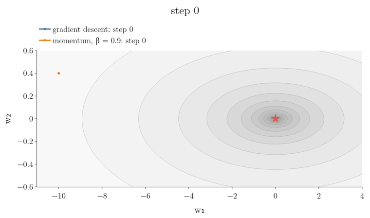
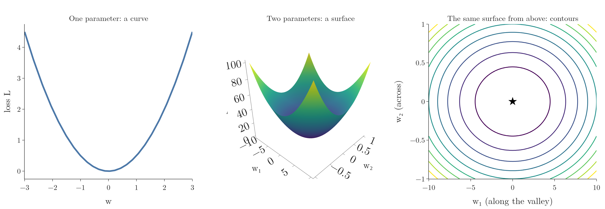
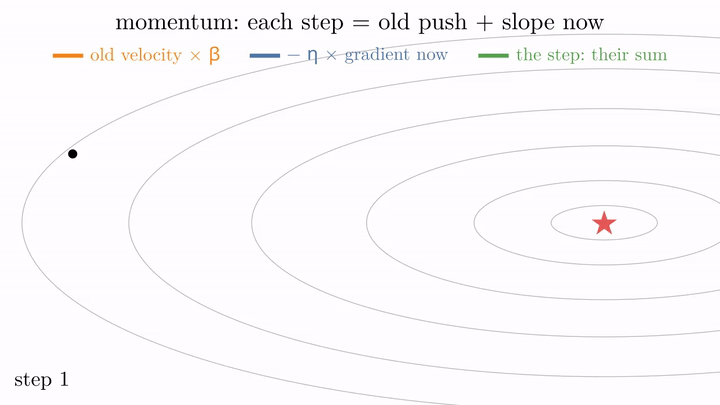
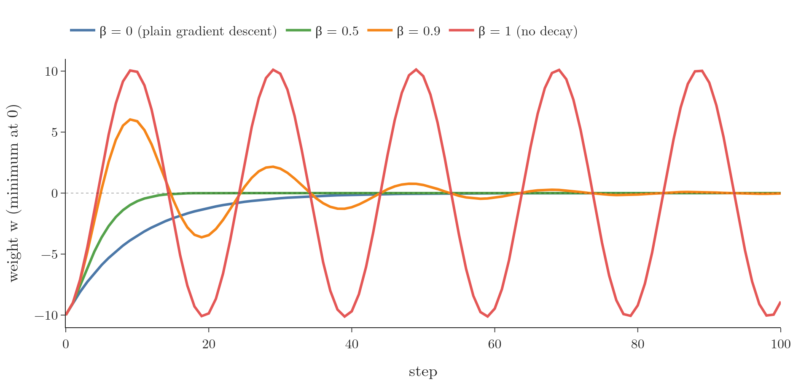

<!-- where-this-fits: generated by course_map/build_map.py; edit concepts.yaml, not this block -->
> **Where this fits:** Pipeline map step 8 (Model). See the [Course map](../../../00-course-map/00-course-map.md).
>
> 
>
> - **Builds on:** [Convex sets and convex optimisation](../../../MA/07-optimisation/MA-067-convex-sets-and-functions/MA-067-convex-sets-and-functions.md#2-convex-sets); [Optimizers in deep learning](../../../DL/03-optimizers/DL-032-optimizers-in-deep-learning/DL-032-optimizers-in-deep-learning.md#1-overview); [Exponentially weighted moving average (EWMA)](../../../DL/03-optimizers/DL-033-exponentially-weighted-moving-average/DL-033-exponentially-weighted-moving-average.md#3-two-rules-behind-the-ewma).
> - **Leads to:** [Nesterov accelerated gradient (NAG)](../../../DL/03-optimizers/DL-035-nesterov-accelerated-gradient/DL-035-nesterov-accelerated-gradient.md#1-overview); [Adam](../../../DL/03-optimizers/DL-038-adam/DL-038-adam.md#6-adam-on-the-students-data).
> - **Compare with:** [Stochastic gradient descent](../../../DL/02-training/DL-020-gradient-descent-in-neural-networks/DL-020-gradient-descent-in-neural-networks.md#5-stochastic-gradient-descent-in-a-network); [Nesterov accelerated gradient (NAG)](../../../DL/03-optimizers/DL-035-nesterov-accelerated-gradient/DL-035-nesterov-accelerated-gradient.md#1-overview).
<!-- /where-this-fits -->

## 1. Overview

> **Key point:** Momentum remembers the recent slopes and moves by their running average, called the velocity. When many slopes agree, the steps grow and training speeds up; the price is that the weights shoot past the minimum and swing before settling.

**Momentum** (G-1258; Polyak 1964) is the first improved **optimizer** (G-1401). Plain **gradient descent** (G-862) forgets every gradient as soon as it has used it. Momentum remembers them: if the last few gradients all point the same way, it becomes confident and moves faster in that direction, like a ball gathering speed as it rolls downhill.

{width=95%}

Figure 1 is a **contour map** (the surface seen from above; each line joins points of equal loss; [how to read a contour map](../../../MA/06-calculus/MA-062-partial-derivatives-and-gradients/MA-062-partial-derivatives-and-gradients.md#11-reading-a-contour-map)), with the same surface in 3D at its right (height = the loss; the lines on it are the lines of the map). The surface is the [narrow valley of one learning rate for every direction](../DL-032-optimizers-in-deep-learning/DL-032-optimizers-in-deep-learning.md#53-one-learning-rate-for-every-direction) (its Figure 4 tilts it from the side view to this top view). The loss of the two weights $w_1$ and $w_2$ is

$$L(w_1, w_2) = \tfrac12\left(w_1^2 + 100\thinspace w_2^2\right)$$

and at the starting point $(-10, 0.4)$ used throughout:

$$L(-10, 0.4) = \tfrac12(100 + 16)$$

$$= 58$$

It is a long, narrow valley with steep sides and a gently sloping floor. On the map, lines close together mean steep (across the valley), lines far apart mean flat (along it), and the star is the lowest point.

Figure 1 shows the main benefit. On a narrow valley, gradient descent needs 424 steps to get close to the minimum; momentum needs 59. The idea of momentum returns in **NAG** (G-1315) and **Adam** (G-169), which makes it one of the most important optimizers to understand.

## 2. Prerequisites

- [The weak spots of plain gradient descent](../DL-032-optimizers-in-deep-learning/DL-032-optimizers-in-deep-learning.md#5-five-weak-spots-of-plain-gradient-descent).
- [The exponentially weighted moving average](../DL-033-exponentially-weighted-moving-average/DL-033-exponentially-weighted-moving-average.md#4-the-formula) (EWMA): a running average that moves a small part of the way towards each new value, with the constant $\beta$ setting how fast old values fade.
- [The contour plot of a loss surface](../../../ML/06-regression/ML-056-gradient-descent/ML-056-gradient-descent.md#6-both-parameters-m-and-b-together).

## 3. Three ways to draw a loss

> **Key point:** One parameter: a curve. Two parameters: a surface in 3D. The same surface seen from above: a contour plot, where colour or rings show the height.

The loss is a function of the weights and biases, so we can draw it against them, just as we draw $y = f(x)$. We can only see up to 3 dimensions, so the pictures in this Note use one or two parameters:

- **One parameter, a 2D graph.** A single node with one weight $w$ and no bias: the loss is a curve over $w$.
- **Two parameters, a 3D graph.** Add a second parameter (a bias $b$, or a second weight as in Figure 2): the loss is a surface over the plane of the two parameters, with the loss as height.
- **A contour plot** (G-468). The same surface seen from above, as in [both parameters together](../../../ML/06-regression/ML-056-gradient-descent/ML-056-gradient-descent.md#6-both-parameters-m-and-b-together). Each ring joins points of equal loss, and colour or shading shows the height that the top view loses.

Reading a contour plot takes practice ([how to read a contour map](../../../MA/06-calculus/MA-062-partial-derivatives-and-gradients/MA-062-partial-derivatives-and-gradients.md#11-reading-a-contour-map)). Where the surface is flat, the height changes slowly, so the rings lie far apart. Where it is steep, they crowd together.



Figure 2 draws all three. The contour plot on the right shows the valley of Figure 1: its rings look round only because the $w_2$ axis is stretched ten times. The loss climbs as fast over 1 unit of $w_2$ as over 10 units of $w_1$, so across the valley the rings are packed ten times closer.

## 4. Why plain gradient descent struggles

> **Key point:** Deep learning losses are non-convex. Local minima, saddle points with their flat surroundings, and high curvature all slow plain gradient descent down or trap it.

The losses of neural networks are non-convex (**non-convex functions**, G-1333: losses with more than one dip; [what goes wrong with a non-convex loss](../../../MA/07-optimisation/MA-065-convex-and-non-convex-cost-functions/MA-065-convex-and-non-convex-cost-functions.md#4-what-goes-wrong-with-a-non-convex-loss)), which makes the minimum hard to reach for three reasons:

1. **Local minima** (G-1110): a dip where the slope is zero. Starting from an unlucky point, gradient descent stops there and returns a sub-optimal solution.
2. **Saddle points** (G-1718): the surface rises in one direction and falls in another, and the slope changes very slowly over a wide flat region. Updates are proportional to the slope, so they become tiny there and training slows down.
3. **High curvature** (G-521): a bend with a small radius, such as the steep sides of a narrow valley. Gradient descent zigzags across the bend instead of following it.

![Plain gradient descent on the three obstacles. Left: from w = −3 it stops in the small dip (learning rate 0.05). Middle: on the saddle L = w₁² − w₂², starting almost on the ridge, its steps shrink to almost nothing near the flat centre before it slides off. Right: on the narrow valley (learning rate 0.019) it zigzags across the steep sides. Bottom: the saddle and the valley as 3D surfaces, same contour levels and same paths (blue on the saddle, red on the valley); the colours mark height, red high and blue low on the saddle, dark low and light high on the valley.](images/obstacles.png)

Figure 3 shows each obstacle with plain gradient descent. The middle and right maps are contour maps; the row below draws the same two surfaces in 3D, so the saddle can be seen rising one way and falling the other, and the valley as a trough:

- **Local minimum (left):** the curve of section 8, from $w = -3$. The steps stop at $w = -1.83$, in the small dip, although a deeper minimum lies to the right.
- **Saddle point (middle):** the first step has length 0.30; near the flat centre the steps shrink to 0.008, about 40 times shorter, before the path slowly slides off along the falling direction.
- **High curvature (right):** across the valley the slope is steep, so every step overshoots to the other side, while the progress along the valley is small.

Batch, stochastic and mini-batch gradient descent handle these poorly ([their paths to the minimum](../../02-training/DL-020-gradient-descent-in-neural-networks/DL-020-gradient-descent-in-neural-networks.md#8-the-path-to-the-minimum)). Momentum was designed for exactly these situations (Goodfellow et al. 2016, §8.3.2):

- high curvature;
- small but consistent gradients;
- noisy gradients.

## 5. The idea: confidence builds speed

> **Key point:** If the past gradients keep pointing the same way, move faster that way. Like a ball rolling downhill, the parameters gather speed.

**An everyday picture.** We drive from A to B and do not know the way, so we ask people. If four people in four places all point in the same direction, we become confident and drive faster that way. If two point forward and two point back, we still go forward, but slowly.

**A physics picture.** A ball rolling down a hill gathers speed as it goes. Momentum in physics is mass times velocity; with a unit mass, momentum is simply the velocity (Goodfellow et al. 2016, §8.3.2). The optimizer keeps a **velocity** (G-2085) $v$: the direction and speed with which the parameters move, built from the history of past updates.

Figure 7 (section 8) plays this picture: two balls on the same curve, the one with momentum gathering speed. Figure 1 shows the same speed-up on a loss surface.

The single most important benefit of momentum is speed: it usually reaches a good solution faster than plain gradient descent.

## 6. The update rule

> **Key point:** Each step keeps a fraction of the previous step, 0.9 of it as a rule, and adds the step plain gradient descent would take now. The weight moves by that sum, the velocity.

**The gradient.** At the current weight $w_t$ (the weight after $t$ steps) the loss has a slope, the **gradient** (G-863) $\nabla L(w_t)$. Take the bowl

$$L(w) = \tfrac{1}{2}w^2$$

Its slope at $w$ is $w$ itself, so at $w_0 = -10$

$$\nabla L(w_0) = -10$$

The minus sign says the loss falls to the right. Plain gradient descent, with **learning rate** (G-1068) $\eta = 0.1$, moves against the slope by $\eta$ times it:

$$w_1 = w_0 - \eta\thinspace\nabla L(w_0)$$

$$= -10 - 0.1 \times (-10)$$

$$= -10 + 1 = -9$$

**Momentum on the same bowl.** Momentum keeps a **velocity** $v$, which starts at $v_0 = 0$. Each step:

1. keep $\beta = 0.9$ of the old velocity;
2. add the plain gradient step $\eta\thinspace\nabla L$ at the current weight;
3. move the weight by the new velocity.

Step 1, at $w_0 = -10$:

$$\text{kept:} \quad 0.9 \times 0 = 0$$

$$\text{new push:} \quad 0.1 \times (-10) = -1$$

$$v_1 = 0 + (-1) = -1$$

$$w_1 = -10 - (-1) = -9$$

Step 2, at $w_1 = -9$:

$$\text{kept:} \quad 0.9 \times (-1) = -0.9$$

$$\text{new push:} \quad 0.1 \times (-9) = -0.9$$

$$v_2 = -0.9 + (-0.9) = -1.8$$

$$w_2 = -9 - (-1.8) = -7.2$$

Plain gradient descent would be at

$$w_2 = -9 - 0.1 \times (-9) = -8.1$$

Momentum's second step, 1.8, is twice as long as gradient descent's 0.9, because the first step's push is still there (Notebook).

**The rule.** For any loss:

$$v_t = \beta\thinspace v_{t-1} + \eta\thinspace\nabla L(w_t)$$

$$w_{t+1} = w_t - v_t$$

with $v_0 = 0$ and $\beta$ between 0 and 1, usually 0.9 (Goodfellow et al. 2016, algorithm 8.2). Plain gradient descent is the same rule without the kept part:

$$w_{t+1} = w_t - \eta\thinspace\nabla L(w_t)$$

Check: $\beta = 0.9$, $\eta = 0.1$, $v_0 = 0$ and $w_0 = -10$ give $v_1 = -1$, $w_1 = -9$, $v_2 = -1.8$, $w_2 = -7.2$, the steps above.

The term $\beta v_{t-1}$ is the momentum. To compute $v_{t-1}$ we needed $v_{t-2}$, which needed $v_{t-3}$, and so on: the velocity carries the whole history of past gradients. Momentum accumulates an exponentially decaying moving average (an **EWMA**, G-735) of past gradients and continues to move in their direction (Goodfellow et al. 2016, §8.3.2).

> **Extra:** If every gradient is the same number $g$, the velocity grows until it settles at a **terminal velocity** (G-1961) (Goodfellow et al. 2016, eq. 8.17). On a tilted plane with $g = 1$, $\eta = 0.1$ and $\beta = 0.9$:
>
> $$v_1 = 0.9 \times 0 + 0.1 = 0.1$$
>
> $$v_2 = 0.9 \times 0.1 + 0.1 = 0.19$$
>
> $$v_3 = 0.9 \times 0.19 + 0.1 = 0.271$$
>
> and so on, until the velocity stops changing. A velocity that stops changing is its own next value:
>
> $$v = 0.9v + 0.1$$
>
> so
>
> $$v - 0.9v = 0.1$$
>
> $$0.1v = 0.1$$
>
> $$v = 1.0$$
>
> In general the terminal velocity is
>
> $$v = \frac{\eta g}{1 - \beta}$$
>
> $$= \frac{0.1 \times 1}{1 - 0.9}$$
>
> $$= 1.0$$
>
> So with $\beta = 0.9$ momentum's steps become 10 times longer than plain gradient descent's 0.1 (Notebook: the steps grow from 0.1 to 1.0). This is the [EWMA's rough window of $1/(1-\beta)$ values](../DL-033-exponentially-weighted-moving-average/DL-033-exponentially-weighted-moving-average.md#6-why-older-values-get-less-weight) again. Our velocity adds $\eta\thinspace\nabla L$ rather than the EWMA's $(1-\beta)\thinspace\nabla L$; that only rescales the learning rate.

Each step now has two parts: the push of the past velocity, and the current gradient. When both point the same way, the step is long.

{width=95%}

Figure 4 draws each step as these two arrows placed head to tail. Watch the arrows: across the valley the orange and blue arrows often point opposite ways and cancel, while along the valley the orange arrow, the remembered push, carries most of the motion. Momentum damps the zig-zag across a narrow valley and builds speed along it (Goh 2017).

### 6.1 Why the zigzag fades and speed builds

> **Key point:** Across a narrow valley the gradients keep flipping sign, so they partly cancel in the velocity. Along the valley they agree, so they add up.

In a narrow valley, plain gradient descent can bounce between the steep walls, because each step follows the current slope, which points mostly across the valley (Goodfellow et al. 2016, §8.3.2, figure 8.5). With momentum:

- **Across the valley,** the gradient changes sign as the weight swings from wall to wall. In the velocity, those opposite pushes partly cancel, so the weight stops flipping at every step.
- **Along the valley,** every gradient points the same way. Those components add up, so the velocity grows and the steps lengthen.

Whether gradient descent bounces depends on the step size. On the valley of Figure 1 the slope across the valley, in the $w_2$ direction, is 100 times the position:

$$\text{slope across} = 100\thinspace w_2$$

One gradient descent step across the valley is therefore

$$w_2 \leftarrow w_2 - \eta \times 100\thinspace w_2$$

$$= (1 - 100\eta)\thinspace w_2$$

so each step multiplies $w_2$ by the factor $1 - 100\eta$. Three learning rates:

| Learning rate $\eta$ | Factor $1 - 100\eta$ | What $w_2$ does |
|---|---|---|
| 0.01 (Figure 1) | 1 − 1 = 0 | lands exactly on the valley floor after one step and stays there; no zigzag, only a slow crawl along $w_1$ |
| 0.019 | 1 − 1.9 = −0.9 | flips sign at every step and shrinks: a zigzag, $0.4 \to -0.36 \to 0.324 \to -0.292$ (Notebook) |
| above 0.02 | below 1 − 2 = −1 | flips sign and grows: the run blows up |

For $\eta = 0.019$, one step per line:

$$-0.9 \times 0.4 = -0.36$$

$$-0.9 \times (-0.36) = 0.324$$

$$-0.9 \times 0.324 = -0.292$$

{width=95%}

Figure 5 puts the three runs side by side (Notebook):

- **Gradient descent, $\eta = 0.019$:** $w_2$ changes sign at all 20 of the first 20 steps, moving 0.334 per step on average.
- **Momentum, $\eta = 0.01$:** $w_2$ changes sign 8 times and moves 0.189 per step. At step 3, for example, the remembered velocity term is $+0.324$ and the new gradient term is $-0.36$; they nearly cancel, so the step across is only 0.036. The swing still fades slowly: by steps 40 to 49, $|w_2|$ is still up to 0.05, against 0.006 for the zigzagging gradient descent.
- **Along the valley,** momentum covers the distance to the minimum in about 24 steps, overshoots, and comes back; both gradient descent runs are still far away after 60 steps.

**Why the swing across lingers but the run along is fast.** Take the across direction alone and follow momentum's first three steps from $w_2 = 0.4$, with $\eta = 0.01$, $\beta = 0.9$ and the slope across $100\thinspace w_2$:

$$v_1 = 0.9 \times 0 + 0.01 \times 100 \times 0.4 = 0.4$$

$$w_2 = 0.4 - 0.4 = 0$$

$$v_2 = 0.9 \times 0.4 + 0.01 \times 100 \times 0 = 0.36$$

$$w_2 = 0 - 0.36 = -0.36$$

$$v_3 = 0.9 \times 0.36 + 0.01 \times 100 \times (-0.36)$$

$$= 0.324 - 0.36 = -0.036$$

$$w_2 = -0.36 + 0.036 = -0.324$$

The remembered push carries $w_2$ past the floor, and only slowly does the gradient turn it round: the swing across fades over many steps. Along the valley the slopes all point the same way, so the same remembering adds them up and the steps grow, as in the Extra above.

> **Extra:** How fast does the swing shrink? Write each velocity as a difference of positions, $v_t = w_t - w_{t+1}$, and call the slope's steepness in one direction its **curvature** (G-521) $\lambda$: the slope is $\lambda w$, with $\lambda = 100$ across the valley and $\lambda = 1$ along it. ($\lambda$ here is a curvature; in [L2 regularisation](../../02-training/DL-026-regularization-in-dl/DL-026-regularization-in-dl.md#51-l2-regularisation) $\lambda$ is the penalty strength.) The update rule becomes, one step per line:
>
> $$w_t - w_{t+1} = \beta\thinspace(w_{t-1} - w_t) + \eta\lambda\thinspace w_t$$
>
> $$w_{t+1} = w_t + \beta\thinspace w_t - \eta\lambda\thinspace w_t - \beta\thinspace w_{t-1}$$
>
> $$w_{t+1} = (1 + \beta - \eta\lambda)\thinspace w_t - \beta\thinspace w_{t-1}$$
>
> Across the valley:
>
> $$\eta\lambda = 0.01 \times 100 = 1$$
>
> $$w_{t+1} = (1 + 0.9 - 1)\thinspace w_t - 0.9\thinspace w_{t-1}$$
>
> $$= 0.9\thinspace w_t - 0.9\thinspace w_{t-1}$$
>
> Check on the steps above, with $w_1 = 0$ and $w_2 = -0.36$:
>
> $$w_3 = 0.9 \times (-0.36) - 0.9 \times 0$$
>
> $$= -0.324$$
>
> Each new position depends on the last two, so the size of the swing is set by the two roots $z$ (the solutions) of this equation (Goh 2017, "The dynamics of momentum"):
>
> $$z^2 - (1 + \beta - \eta\lambda)z + \beta = 0$$
>
> The roots multiply to $\beta$. When
>
> $$(1 + \beta - \eta\lambda)^2 < 4\beta$$
>
> they are complex numbers of equal size, so each has size $\sqrt{\beta}$: the weight swings, and the swing shrinks by that factor per step:
>
> $$\sqrt{0.9} = 0.95$$
>
> The condition holds in both directions, with $4\beta = 3.6$:
>
> $$\text{across: } (1.9 - 1)^2 = 0.81 < 3.6$$
>
> $$\text{along: } (1.9 - 0.01)^2 = 3.57 < 3.6$$
>
> Along the valley gradient descent at $\eta = 0.01$ shrinks the distance only by a factor $1 - \eta\lambda$ per step:
>
> $$1 - 0.01 \times 1 = 0.99$$
>
> So momentum's 0.95 is far faster there. Across the valley, 0.95 is slower than the factor 0.9 of gradient descent at $\eta = 0.019$, which is why the orange swing in Figure 5 lingers. On this valley the gain from momentum is the speed along it.

Momentum increases the step for directions whose gradients point the same way and reduces it for directions whose gradients change sign (Ruder 2016, §4.1). On the valley of Figure 1 from $(-10, 0.4)$, with $\eta = 0.01$ for both, after 20 steps gradient descent has moved $w_1$ from $-10$ to $-8.18$, while momentum is already at $-1.18$, close to the minimum at 0 (Notebook). To bring the loss below 0.01:

| Optimizer | Steps |
|---|---|
| Gradient descent, $\eta = 0.01$ | 424 |
| Gradient descent, $\eta = 0.019$ (its largest safe value) | 223 |
| Momentum, $\eta = 0.01$, $\beta = 0.9$ | 59 |

## 7. The role of $\beta$

> **Key point:** $\beta = 0$ is plain gradient descent. $\beta$ close to 1 remembers the past for long: more speed, more overshooting. $\beta = 1$ never forgets and never settles. Usual values: 0.5, 0.9, 0.99.

$\beta$ is the **decay factor** (G-553): it decides how fast the influence of past velocities dies away. An old gradient's contribution is multiplied by $\beta$ at every step, so recent gradients count most, exactly as in an EWMA. With $\beta = 0.9$ the velocity behaves roughly like an average of the last 10 gradients:

$$\frac{1}{1 - \beta} = \frac{1}{1 - 0.9} = 10$$

- **$\beta = 0$:** the momentum term disappears, $v_t = \eta\thinspace\nabla L(w_t)$, and the update is plain gradient descent.
- **$\beta = 1$:** nothing decays. Like a ball on a frictionless surface, the parameters keep swinging back and forth forever without settling.
- **In practice:** 0.5, 0.9 or 0.99 (Goodfellow et al. 2016, §8.3.2).

{width=95%}

Figure 6 shows all four. With $\beta = 1$, the weight is still swinging between about $-10$ and 10 after 100 steps (Notebook).

> **Extra:** Goodfellow et al. (2016, §8.3.2) explain the decay as friction. The velocity's decay acts like viscous drag, a force proportional to $-v$, as if the particle moved through syrup. Without it ($\beta = 1$) the particle would slide down one side of the valley and up the other forever, like a hockey puck on frictionless ice.

## 8. Escaping a local minimum, and the cost: overshooting

> **Key point:** The speed that carries momentum through a small dip also carries it past the true minimum. Momentum swings back and forth before settling, and those swings waste time.

{width=95%}

Figure 7 shows two effects on the curve

$$L(w) = \frac{(w^2 - 4)^2}{8} - 0.6w$$

starting at $w = -3$, where the loss is about 4.9:

1. **Faster.** The orange ball gains speed as it rolls; the blue ball moves at the pace of the slope.
2. **Out of a local minimum.** The blue ball stops in the small dip near $w = -1.83$ (loss 1.15). The orange ball has enough speed to climb out, crosses the bump, and ends in the global minimum near $w = 2.14$ (loss $-1.24$) (Notebook).

The same speed has a price: **overshooting** (G-1430). The orange ball does not stop at the **global minimum** (G-848): it shoots past to $w = 2.85$, comes back, and swings with shrinking amplitude before settling. In Figure 6, $\beta = 0.9$ crosses the minimum again and again for the same reason. As the decay factor makes the old velocities fade, the swings die out, but the time spent swinging is wasted.

Momentum is still faster than plain gradient descent, but these oscillations make it slower than optimizers that damp them. The biggest problem of momentum is its momentum. The next optimizer, Nesterov accelerated gradient, reduces the swings.

> **Extra:** Escaping a dip is not guaranteed. On this curve it depends on the settings: with $\beta = 0.5$, momentum also stops in the small dip (Notebook). A ball escapes only if it has gathered enough speed before reaching the bump.

## 9. Momentum on real data: MNIST

> **Key point:** On handwritten digits, adding momentum 0.9 to SGD with the same learning rate reached plain SGD's 20-epoch loss by epoch 4.

The setup:

- **data:** the **MNIST** (G-1249) handwritten digits ([the MNIST data](../../01-basics/DL-012-mnist-ann/DL-012-mnist-ann.md#2-the-mnist-data)), 10,000 training images, each with 784 pixel **features** (G-772; input variables) and the digit as **target** (G-1949; the output we predict), and the 10,000 test images for validation (checking accuracy on images the network did not train on);
- **network:** hidden layers of 128 and 64 **ReLU** (G-1668; each node outputs its input if positive, else 0) nodes and a **softmax** (G-1830; turns the 10 output scores into 10 probabilities that add to 1) output;
- **training:** mini-batch SGD (**mini-batch gradient descent**, G-1222) with **learning rate** (G-1068) 0.01, **batch size** (G-267) 64 and 20 **epochs** (G-696); only the momentum changes, 0 or 0.9.

Each is trained with 3 seeds and the curves are averaged.

{width=90%}

In Figure 8 each curve is the training loss after each pass over the 10,000 training images (an epoch). A **log scale** axis: each labelled line (such as 0.1 and 1) is 10 times the one below it, the small numbers between mark 2, 3, … times that line, so equal vertical distances mean equal ratios, and a straight line down is a steady percentage drop per step. A lower curve means a better fit.

Figure 8 and the Notebook give:

| | Plain SGD | SGD with momentum 0.9 |
|---|---|---|
| Training loss, epoch 1 | 1.94 | 0.85 |
| Training loss, epoch 5 | 0.48 | 0.18 |
| Training loss, epoch 20 | 0.24 | 0.021 |
| Validation accuracy, epoch 20 | 0.917 | 0.950 |

Momentum gets to plain SGD's final loss of 0.24 by epoch 4. Its terminal steps are up to 10 times longer when the gradients agree (the terminal velocity Extra in section 6), so it covers the same ground in far fewer epochs.

### 9.1 Momentum in Keras

> **Key point:** Pass `momentum` to Keras' `SGD`: 0 is plain SGD, 0.9 is SGD with momentum.

> **Python:** SGD with momentum in Keras.
>
> ```python
> import keras
> opt = keras.optimizers.SGD(learning_rate=0.01, momentum=0.9)
> model.compile(optimizer=opt, loss="sparse_categorical_crossentropy",
>               metrics=["accuracy"])
> ```

`momentum` is $\beta$, and its default is 0. With `momentum=0.9` and `nesterov=False` (the default) Keras uses the update of section 6.

> **Extra:** Keras writes the same update with the sign of $v$ flipped: $v \leftarrow \beta v - \eta g$, then $w \leftarrow w + v$ (Keras `SGD` documentation). Both give the same weights.

## 10. Summary

| | Plain gradient descent | SGD with momentum |
|---|---|---|
| Step | $\eta\thinspace\nabla L(w_t)$ | $v_t = \beta v_{t-1} + \eta\thinspace\nabla L(w_t)$ |
| Memory of past gradients | none | EWMA, about $1/(1-\beta)$ steps |
| Narrow valley (our example) | 424 steps | 59 steps |
| Small local dip | stops in it | can roll through |
| Near the minimum | arrives directly | overshoots and swings |

- Momentum adds a velocity, an exponentially decaying average of past gradients, to gradient descent.
- Gradients that agree add up (speed); gradients that flip sign cancel (less zigzag).
- $\beta = 0$ is plain gradient descent; $\beta = 1$ never settles; 0.9 is the usual value, because $\beta$ sets how long the velocity remembers past gradients: never at 0, forever at 1.
- The speed can carry it out of a small local minimum, and also past the global minimum: overshooting is its main weakness.
- In Keras: `SGD(learning_rate=..., momentum=0.9)`.

So momentum speeds up training wherever the slopes agree (424 steps down to 59 on the valley), at the price of swings near the minimum.

## 11. Sources

**Built from**

- CampusX, "SGD with Momentum Explained in Detail with Animations | Optimizers in Deep Learning Part 2", YouTube, https://www.youtube.com/watch?v=vVS4csXRlcQ

**Other references**

- Goh, G. (2017). Why momentum really works. *Distill*, distill.pub/2017/momentum. Introduction: momentum's added inertia damps oscillations and carries the descent through narrow valleys (the statement cited with Figure 4). The two-arrow drawing, data and code are our own.
- Goodfellow, I., Bengio, Y. and Courville, A. (2016). *Deep Learning*. MIT Press. §8.3.2 Momentum (algorithm 8.2, eq. 8.17, the physical analogy).
- Polyak, B. T. (1964). Some methods of speeding up the convergence of iteration methods. *USSR Computational Mathematics and Mathematical Physics* 4(5), 1–17.
- Ruder, S. (2016). An overview of gradient descent optimization algorithms. arXiv:1609.04747. §4.1 Momentum.
- Keras API documentation: `SGD` optimizer, keras.io/api/optimizers/sgd.

## 12. Key terms

| Term | Meaning |
|---|---|
| Momentum (optimizer) | Gradient descent that keeps part of its past movement: each step follows an average of past gradients in which older ones count less and less (a velocity, an exponentially decaying average). |
| Velocity $v$ | The direction and size of the current move, built from past gradients: $v_t = \beta v_{t-1} + \eta\thinspace\nabla L(w_t)$ |
| Decay factor $\beta$ | In momentum, the share of the previous update (the velocity) kept at each step; 0 gives plain gradient descent, usually 0.9. |
| Terminal velocity | The step size momentum reaches when every gradient is the same: $\eta g/(1-\beta)$ |
| Overshooting | Moving past the minimum because of the built-up velocity, then swinging back |
| Gradient $\nabla L(w_t)$ (G-863) | The slope of the loss at the current weight; for $L = w^2/2$ at $w = -10$ it is $-10$ |
| Curvature $\lambda$ (G-521) | How steep the slope grows in one direction; 100 across the valley, 1 along it |
| Contour plot | A loss surface seen from above, with rings joining points of equal loss |
| Feature | An input variable, such as one pixel of an image |
| Target | The output we predict, such as the digit |
