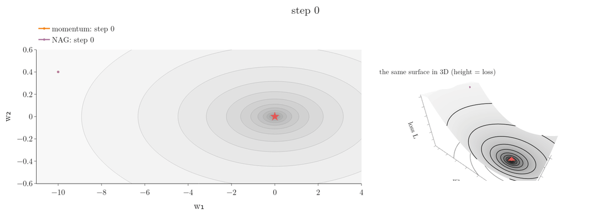
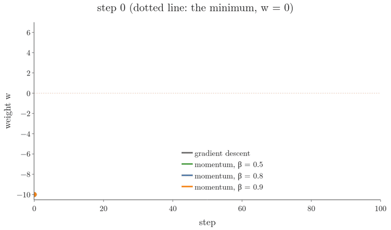
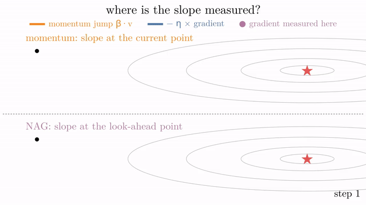
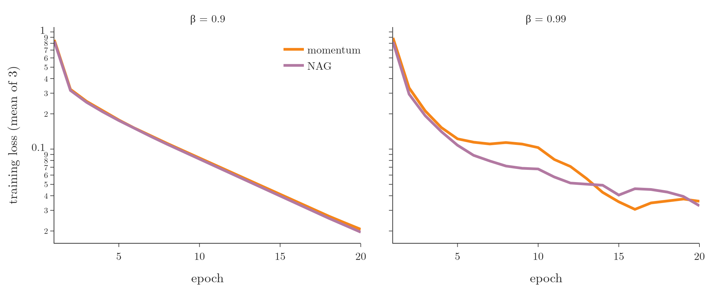

<!-- where-this-fits: generated by course_map/build_map.py; edit concepts.yaml, not this block -->
> **Where this fits:** Pipeline map step 8 (Model). See the [Course map](../../../00-course-map/00-course-map.md).
>
> 
>
> - **Builds on:** Optimizers in deep learning ([Note DL-032](../../../DL/03-optimizers/DL-032-optimizers-in-deep-learning/DL-032-optimizers-in-deep-learning.md)); SGD with momentum ([Note DL-034](../../../DL/03-optimizers/DL-034-sgd-with-momentum/DL-034-sgd-with-momentum.md)).
> - **Compare with:** SGD with momentum ([Note DL-034](../../../DL/03-optimizers/DL-034-sgd-with-momentum/DL-034-sgd-with-momentum.md)).
<!-- /where-this-fits -->

## 1. Overview

> **Key point:** NAG is momentum with one change: it first takes the momentum jump, then measures the gradient at the point where that jump lands (the look-ahead point), and corrects from there. Seeing the slope ahead lets it brake before the minimum, so it overshoots less than momentum.

**Nesterov accelerated gradient** (G-1315; NAG; Nesterov 1983, adapted to deep learning by Sutskever et al. 2013) is a small upgrade of [momentum](../DL-034-sgd-with-momentum/DL-034-sgd-with-momentum.md) (G-1258). Momentum's speed is its strength, but near the minimum the same speed makes it overshoot and swing (**overshooting**, G-1430). NAG damps those swings.

{width=95%}

Figure 1 shows the difference. On this valley momentum needs 59 steps to bring the loss below 0.01; NAG needs 25.

## 2. Prerequisites

- The [SGD with momentum Note](../DL-034-sgd-with-momentum/DL-034-sgd-with-momentum.md): the velocity $v_t = \beta v_{t-1} + \eta\thinspace\nabla L(w_t)$, and overshooting.
- The [EWMA Note](../DL-033-exponentially-weighted-moving-average/DL-033-exponentially-weighted-moving-average.md): the decay factor $\beta$.

## 3. Momentum's problem: oscillations

> **Key point:** Momentum reaches the neighbourhood of the minimum fast, then wastes many steps swinging past it. A smaller $\beta$ reduces the swings, but also the speed.

Momentum covers the early part of the road quickly: in the valley of Figure 1 it is close to the minimum within about 20 steps. Then it crosses the minimum, comes back, crosses again, and only settles once its velocity has died away.

Figure 2 shows the swings on the simplest loss, the bowl $L(w) = w^2/2$, from $w = -10$ with **learning rate** (G-1068) 0.1.

{width=95%}

| | First within 1 of the minimum | Furthest past the minimum | Stays within 0.1 from step |
|---|---|---|---|
| Gradient descent | step 22 | 0 | 44 |
| Momentum, $\beta = 0.5$ | step 9 | 0 | 15 |
| Momentum, $\beta = 0.8$ | step 5 | 3.32 | 42 |
| Momentum, $\beta = 0.9$ | step 5 | 6.04 | 81 |

- **Getting near is fast.** With $\beta = 0.9$ or 0.8, momentum is within 1 of the minimum after 5 steps; gradient descent needs 22.
- **Settling is slow.** With $\beta = 0.9$ the weight shoots 6.04 past the minimum and keeps swinging until step 81, later than plain gradient descent (step 44).
- **A smaller $\beta$ swings less.** With $\beta = 0.5$ there is no overshoot at all and the run settles by step 15.

Lowering the **decay factor** (G-553) $\beta$ tames the swings, at the cost of some speed at the start (9 steps instead of 5 to get near). On the more complex, non-convex losses of neural networks (**non-convex functions**, G-1333) the **oscillations** (G-1410) cost even more time. NAG offers another fix: keep the speed, and reduce the oscillations.

## 4. Two pushes at once, or one after the other

> **Key point:** Momentum adds the momentum jump and the gradient step, both computed at the current point. NAG first makes the momentum jump, then computes the gradient where it lands.

Write momentum's update in one line by putting $v_t$ into $w_{t+1} = w_t - v_t$:

$$w_{t+1} = w_t - \beta\thinspace v_{t-1} - \eta\thinspace\nabla L(w_t)$$

Each step has two parts: the push of the past **velocity** (G-2085), $\beta v_{t-1}$, and the push of the current gradient, $\eta\thinspace\nabla L(w_t)$. Plain gradient descent has only the second. Momentum computes both at the current point $w_t$ and applies them together.

NAG changes only **where the gradient is computed**. NAG first applies the momentum part alone, which takes it to a **look-ahead point** (G-1127). It computes the gradient there and then moves on, or back, according to that gradient (Goodfellow et al. 2016, §8.3.3).

{width=100%}

Figure 3 shows one step near the minimum. Hinton's lecture slides put the difference in one line: first make a big jump in the direction of the previous accumulated gradient, then measure the gradient where you end up and make a correction; it is better to correct a mistake after you have made it (Hinton 2012, lecture 6c).

## 5. The update rule

> **Key point:** Look-ahead $w_{\text{la}} = w_t - \beta v_{t-1}$; velocity $v_t = \beta v_{t-1} + \eta\thinspace\nabla L(w_{\text{la}})$; update $w_{t+1} = w_t - v_t$. Only the point where the gradient is taken changes.

1. **In words:** find where the momentum jump alone would take us. Take the gradient there. Build the velocity from the old velocity and that gradient, and move from the current point.
2. **Formula:**
   $$w_{\text{la}} = w_t - \beta\thinspace v_{t-1}$$
   $$v_t = \beta\thinspace v_{t-1} + \eta\thinspace\nabla L(w_{\text{la}})$$
   $$w_{t+1} = w_t - v_t$$
3. **Example:** the same start as for momentum: $L(w) = w^2/2$ (gradient $w$), $w_0 = -10$, $\eta = 0.1$, $\beta = 0.9$, $v_0 = 0$.
   - Step 1: the look-ahead is $w_0 - 0.9 \times 0 = -10$, so $v_1 = 0.1 \times (-10) = -1$ and $w_1 = -9$, the same as momentum.
   - Step 2: the look-ahead is $-9 - 0.9 \times (-1) = -8.1$. Its gradient is $-8.1$, not $-9$, so
   $$v_2 = 0.9 \times (-1) + 0.1 \times (-8.1) = -1.71, \qquad w_2 = -9 - (-1.71) = -7.29$$
   Momentum reached $-7.2$. NAG's step is a little shorter, because the slope at the look-ahead point is gentler (Notebook).

Putting $v_t$ into the last line gives the whole step: $w_{t+1} = w_t - \beta v_{t-1} - \eta\thinspace\nabla L(w_{\text{la}})$. It is the distance to the look-ahead point plus a gradient step taken from the look-ahead point.

{width=95%}

Figure 4 applies the rule on the valley of Figure 1. Watch step 2: momentum measures the slope at a point on the valley floor, where nothing pushes back, so the jump carries it across; NAG measures at the look-ahead point on the far wall, whose slope points back and cancels the swing.

## 6. Why NAG overshoots less

> **Key point:** When momentum is about to carry the weights past the minimum, the slope at the look-ahead point already points back. NAG feels that and brakes one step earlier.

Follow a ball rolling down towards the minimum on a curve.

**Momentum.** At every point it computes the momentum and the slope at that same point. Far from the minimum, both push forward and the ball speeds up. Past the minimum the slope turns and pushes back, but the built-up momentum dominates, so the ball keeps going: it overshoots, makes a U-turn, comes back, makes a smaller U-turn, and so on until it stops.

**NAG.** Near the minimum, the momentum jump alone already lands past the minimum. The slope there points back, so the gradient step pulls the ball back towards the minimum, and it stops much nearer to it. NAG makes smaller U-turns and settles sooner. NAG has a sense of where it is going, so it slows down before the hill slopes up again (Ruder 2016, §4.2).

If the momentum jump is a poor move that increases the loss, the gradient at the look-ahead point points back towards $w_t$ more strongly than the gradient at $w_t$ itself, which gives a larger and more timely correction to the velocity. On an oblong bowl, momentum swings strongly across the steep direction while NAG avoids these swings almost entirely (Sutskever et al. 2013, §2.1).

{width=100%}

Figure 5 (left) and Figure 1 measure the effect (Notebook):

| | Momentum | NAG |
|---|---|---|
| Bowl: furthest past the minimum | 6.04 | 3.55 |
| Bowl: stays within 0.1 of the minimum from step | 81 | 42 |
| Valley: steps until the loss is below 0.01 | 59 | 25 |

> **Extra:** On convex problems (**convex functions**, G-476) with exact gradients, Nesterov's method provably converges faster than plain gradient descent: the excess loss falls like $1/k^2$ after $k$ steps instead of $1/k$ (Nesterov 1983; Goodfellow et al. 2016, §8.3.3). With noisy mini-batch gradients that guarantee is lost (Goodfellow et al. 2016, §8.3.3); the benefit that remains in practice is the damping seen here.

## 7. The weakness: less momentum to escape a dip

> **Key point:** The damping that removes overshooting also removes some of the extra push. Where momentum rolls out of a small local minimum, NAG can stay stuck in it.

Damping the oscillations has a possible downside. On a loss with a small dip on the way to a deeper one, momentum may build up enough speed to roll over the bump and out of the dip; NAG brakes earlier, so it may not gain that speed and can settle in the **local minimum** (G-1110).

Figure 5 (right) shows exactly this on the curve $L(w) = (w^2 - 4)^2/8 - 0.6w$: with the same settings, momentum ends in the **global minimum** (G-848) near $w = 2.14$ and NAG in the local one near $-1.83$. Over 12 settings (two starts, three learning rates, two values of $\beta$), momentum reached the global minimum in 8 and NAG in 4, and NAG never escaped where momentum did not (Notebook). On such losses another optimizer may do better.

## 8. NAG on real data: MNIST

> **Key point:** On MNIST with $\beta = 0.9$, momentum and NAG train almost identically. With $\beta = 0.99$, where momentum's swings matter more, NAG's training is steadier and ends slightly lower.

We repeat the **MNIST** (G-1249) experiment of the [momentum Note](../DL-034-sgd-with-momentum/DL-034-sgd-with-momentum.md):

- **data:** 10,000 training images, each with 784 pixel **features** (G-772; input variables) and the digit as **target** (G-1949; the output we predict), and the 10,000 test images for validation;
- **network:** hidden layers of 128 and 64 **ReLU** (G-1668) nodes;
- **training:** learning rate 0.01, **batch size** (G-267) 64, 20 **epochs** (G-696), 3 seeds.

Only `nesterov` changes, at $\beta = 0.9$ and at $\beta = 0.99$.

{width=100%}

Figure 6 and the Notebook give, as means over the 3 seeds:

| | $\beta = 0.9$: momentum | $\beta = 0.9$: NAG | $\beta = 0.99$: momentum | $\beta = 0.99$: NAG |
|---|---|---|---|---|
| Training loss, epoch 5 | 0.177 | 0.175 | 0.122 | 0.108 |
| Training loss, epoch 20 | 0.021 | 0.020 | 0.036 | 0.033 |
| Validation accuracy, epoch 20 | 0.950 | 0.949 | 0.944 | 0.946 |
| Epochs where the loss went up | 0 | 0 | 4 | 1 |

With $\beta = 0.9$ the two are practically the same: the gradient at the look-ahead point is almost the gradient at the current point. With $\beta = 0.99$ momentum's velocity is ten times longer-lived, its training loss went up from one epoch to the next in 4 epochs, against 1 for NAG, and NAG ends with a slightly lower loss and slightly higher validation accuracy. The differences are small and vary from seed to seed: in one of the three seeds momentum ended lower (Notebook).

Sutskever et al. (2013, §2.1) found the same pattern: NAG changes the velocity in a quicker and more responsive way, which lets it behave more stably than momentum in many situations, especially for higher values of $\beta$.

## 9. Momentum and NAG in Keras

> **Key point:** Keras' `SGD` class covers all three: `momentum=0` is plain SGD, `momentum=0.9` is momentum, and `momentum=0.9, nesterov=True` is NAG.

> **Python:** Three optimizers from one class.
>
> ```python
> import keras
> sgd = keras.optimizers.SGD(learning_rate=0.01, momentum=0.0)
> mom = keras.optimizers.SGD(learning_rate=0.01, momentum=0.9)
> nag = keras.optimizers.SGD(learning_rate=0.01, momentum=0.9,
>                            nesterov=True)
> ```

`momentum` is the decay factor $\beta$, usually 0.9 or 0.5; `nesterov` switches the look-ahead on.

> **Extra:** Keras never computes the gradient at a separate look-ahead point. Its weights are the look-ahead point itself: write $u_t = w_t - \beta v_{t-1}$, so $w_t = u_t + \beta v_{t-1}$. One step per line:
> $$u_{t+1} = w_{t+1} - \beta v_t$$
> $$= (w_t - v_t) - \beta v_t \qquad \text{(since } w_{t+1} = w_t - v_t\text{)}$$
> $$= u_t + \beta v_{t-1} - v_t - \beta v_t \qquad \text{(replace } w_t\text{)}$$
> $$= u_t + \beta v_{t-1} - \left(\beta v_{t-1} + \eta\thinspace\nabla L(u_t)\right) - \beta v_t \qquad \text{(put in } v_t\text{)}$$
> $$u_{t+1} = u_t - \beta\thinspace v_t - \eta\thinspace\nabla L(u_t)$$
>
> This is a step that needs only the gradient at the stored weights. With $m = -v$ this is Keras' rule $m \leftarrow \beta m - \eta g$, $w \leftarrow w + \beta m - \eta g$ (Keras `SGD` documentation). The Notebook checks it: Keras' weights $-10, -8.1, -5.75, -3.27, \dots$ are exactly our look-ahead points.

## 10. Summary

| | Momentum | NAG |
|---|---|---|
| Gradient taken at | the current point $w_t$ | the look-ahead point $w_t - \beta v_{t-1}$ |
| Near the minimum | overshoots, large swings | brakes earlier, small swings |
| Bowl $L = w^2/2$: furthest past the minimum | 6.04 | 3.55 |
| Valley: steps to loss < 0.01 | 59 | 25 |
| Small local dip | more push to roll out | can stay stuck |
| Keras | `SGD(momentum=0.9)` | `SGD(momentum=0.9, nesterov=True)` |

- NAG is momentum with the gradient measured after the momentum jump, at the look-ahead point.
- Seeing the slope ahead lets NAG correct the velocity before it overshoots, so it oscillates less and often converges faster.
- The same damping can leave it in a small local minimum that momentum would roll out of.
- On MNIST it matches momentum at $\beta = 0.9$ and is slightly steadier at $\beta = 0.99$.

## 11. Sources

**Built from**

- CampusX, "Nesterov Accelerated Gradient (NAG) Explained in Detail | Animations | Optimizers in Deep Learning", YouTube, https://www.youtube.com/watch?v=rKG9E6rce1c

**Other references**

- Goodfellow, I., Bengio, Y. and Courville, A. (2016). *Deep Learning*. MIT Press. §8.3.3 Nesterov momentum.
- Hinton, G. (2012). *Neural Networks for Machine Learning*, Coursera, lecture 6c: The momentum method (slides).
- Nesterov, Y. (1983). A method for solving the convex programming problem with convergence rate $O(1/k^2)$. *Soviet Mathematics Doklady* 27, 372–376.
- Ruder, S. (2016). An overview of gradient descent optimization algorithms. arXiv:1609.04747. §4.2 Nesterov accelerated gradient.
- Sutskever, I., Martens, J., Dahl, G. and Hinton, G. (2013). On the importance of initialization and momentum in deep learning. ICML 2013. §2.1.
- Keras API documentation: `SGD` optimizer (`momentum`, `nesterov`), keras.io/api/optimizers/sgd.

## 12. Key terms

| Term | Meaning |
|---|---|
| Nesterov accelerated gradient (NAG) | Momentum that computes the gradient at the look-ahead point instead of the current point |
| Look-ahead point | Where the momentum jump alone would take the weights: $w_t - \beta v_{t-1}$ |
| Oscillation | Swinging back and forth past the minimum before settling |
| Damping | Reducing the size of the oscillations |
| Feature | An input variable, such as one pixel of an image |
| Target | The output we predict, such as the digit |
