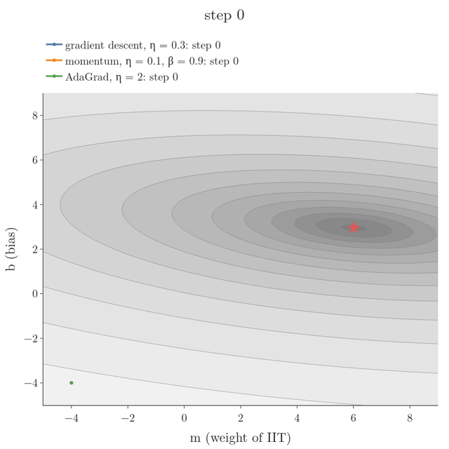
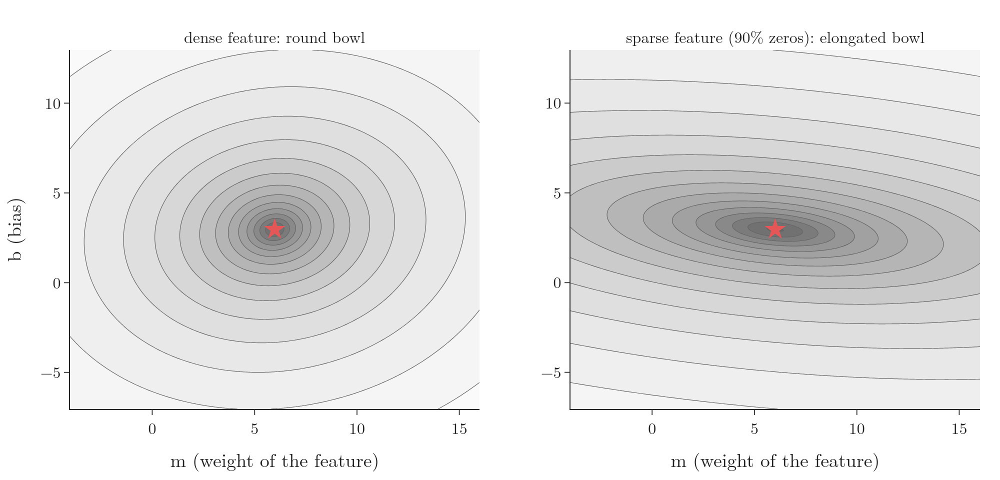
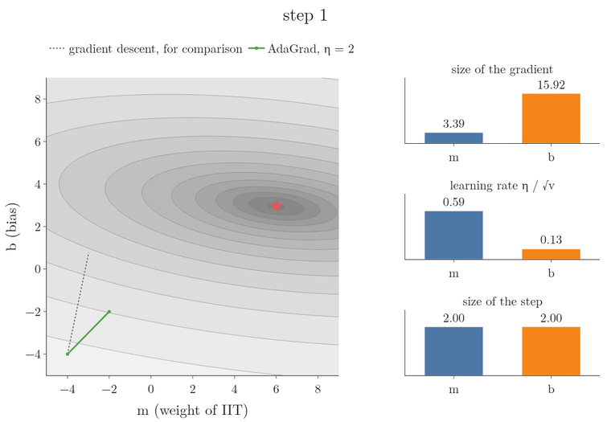

<!-- where-this-fits: generated by course_map/build_map.py; edit concepts.yaml, not this block -->
> **Where this fits:** Pipeline map step 8 (Model). See the [Course map](../../../00-course-map/00-course-map.md).
>
> 
>
> - **Builds on:** Learning rate ([Note ML-056](../../../ML/06-regression/ML-056-gradient-descent/ML-056-gradient-descent.md)); Optimizers in deep learning ([Note DL-032](../../../DL/03-optimizers/DL-032-optimizers-in-deep-learning/DL-032-optimizers-in-deep-learning.md)).
> - **Leads to:** RMSProp ([Note DL-037](../../../DL/03-optimizers/DL-037-rmsprop/DL-037-rmsprop.md)).
<!-- /where-this-fits -->

## 1. Overview

> **Key point:** AdaGrad gives every parameter its own learning rate: the global rate divided by the square root of the sum of that parameter's past squared gradients. Parameters with large gradients get small steps, parameters with small gradients (such as the weights of sparse features) get large ones. The price: the sum only grows, so the steps keep shrinking.

**AdaGrad** (G-168), short for *adaptive gradient* (Duchi et al. 2011), does not keep the learning rate fixed. AdaGrad adapts the **learning rate** (G-1068) to the situation, separately for every parameter. Every optimizer so far, from **batch gradient descent** (G-264) to [momentum](../DL-034-sgd-with-momentum/DL-034-sgd-with-momentum.md) (G-1258) and [NAG](../DL-035-nesterov-accelerated-gradient/DL-035-nesterov-accelerated-gradient.md) (G-1315), uses one learning rate for all parameters; AdaGrad is the first that does not.

{width=80%}

Figure 1 shows where this matters: a loss shaped like a stretched bowl, produced by a feature that is mostly zeros.

## 2. Prerequisites

- The [optimizers Note](../DL-032-optimizers-in-deep-learning/DL-032-optimizers-in-deep-learning.md): the weak spot "one learning rate for every direction".
- The [SGD with momentum Note](../DL-034-sgd-with-momentum/DL-034-sgd-with-momentum.md): momentum's path and its overshooting.
- The [multiple linear regression maths Note](../../../ML/06-regression/ML-053-multiple-lr-maths/ML-053-multiple-lr-maths.md): the gradient of the squared error.

## 3. When AdaGrad helps

> **Key point:** Two situations: features on very different scales, and sparse features, which are mostly zeros. Scaling fixes the first, so the second is the real use.

1. **Features on very different scales.** For example CGPA (0 to 10) and salary (up to lakhs of rupees) as two **features** (G-772; input variables, the columns of the data table). In practice we standardise such features first (see the [data scaling Note](../../02-training/DL-023-data-scaling-in-ann/DL-023-data-scaling-in-ann.md)), so this case matters less.
2. **Sparse features.** A **sparse feature** (G-1841) is one whose values are mostly zero. Take students described by IQ, CGPA and whether they studied at an IIT, with the salary package as the **target** (G-1949; the output we predict). Very few students go to an IIT, so the IIT feature is 0 for almost everyone. Yet it is an important feature: an IIT student tends to get a much higher package. On data with such features, AdaGrad gives better results.

AdaGrad performs larger updates for infrequent features and smaller updates for frequent ones, which is why it is well suited to **sparse data** (G-1840; Ruder 2016, §4.3).

## 4. The problem: a sparse feature stretches the loss

> **Key point:** With a sparse feature, the loss changes slowly along that feature's weight and quickly along the others. The bowl becomes elongated, and gradient descent wastes time moving along the steep direction first.

We use a small made-up dataset, since no real dataset shows the effect this cleanly in two parameters: 100 students, each an **observation** (G-1374; one record, one row of the table), with one feature, IIT (1 for 10 students, 0 for the other 90), and the package in lakh rupees as target. The model is a single node, $\hat{y} = m \cdot \text{IIT} + b$, with the squared error as loss. Its best values are $m = 6.01$ and $b = 2.96$: about 3 lakh rupees, plus 6 for an IIT student.

{width=100%}

Figure 2 compares the two shapes. With a normal, dense feature the contours are nearly circles: the loss changes at a similar rate in both directions. With the sparse feature they are long ellipses: moving $b$ changes the loss a lot, moving $m$ changes it little. This is the **elongated bowl** (G-673).

### 4.1 Gradient descent and momentum on the elongated bowl

> **Key point:** Both go down the $b$ direction first, then turn and crawl along $m$. A direct route to the minimum would be shorter.

Starting from $(m, b) = (-4, -4)$, gradient descent ($\eta = 0.3$) first moves almost only in $b$: after 10 steps $b$ is at 3.54, already past its best value, while $m$ has only reached 0.74. Then it slowly travels along $m$ (Figure 1, blue). Momentum ($\eta = 0.1$, $\beta = 0.9$) does the same, faster, and overshoots in $b$ before turning (orange). Both paths look like an "L"; a straight line to the minimum would be shorter (Notebook).

### 4.2 Why: a sparse feature gives small gradients

> **Key point:** The gradient for $m$ sums error $\times$ IIT over the rows, and IIT is 0 in 90% of them. The gradient for $b$ sums error $\times$ 1 over every row. So $m$'s gradient is small and $b$'s is large.

Think of the bias as the weight of a second input that is always 1. For the squared error $L = \frac{1}{n}\sum (y_i - \hat y_i)^2$, the **chain rule** (G-371) gives

$$\frac{\partial L}{\partial m} = -\frac{2}{n}\sum_{i=1}^{n} (y_i - \hat y_i)\thinspace x_i, \qquad \frac{\partial L}{\partial b} = -\frac{2}{n}\sum_{i=1}^{n} (y_i - \hat y_i) \times 1$$

For every student with $x_i = 0$, the term in $\partial L/\partial m$ is 0. With 90 of 100 students at 0, only 10 terms remain, so the sum is small and every update of $m$ is small. In $\partial L/\partial b$ every term counts, so the sum, and every update of $b$, is large. At the start $(-4, -4)$ the gradients are $\partial L/\partial m = -3.39$ and $\partial L/\partial b = -15.92$ (Notebook).

The move in the $(m, b)$ plane is the sum of the two updates. A large update in $b$ and a small one in $m$ point the path almost straight along $b$, which is the "L" of Figure 1.

The path turns once $b$ is close to its best value. After 10 steps of gradient descent the gradients are $\partial L/\partial b = 0.10$ and $\partial L/\partial m = -0.94$: almost nothing is left to gain along $b$, so the small gradient of $m$ now sets the direction, and the path crawls along $m$ (computed with `images/shared.py`).

To head straight for the minimum, the two updates must be of comparable size.

## 5. The idea: shrink the learning rate where the gradients are large

> **Key point:** The gradient cannot be changed, but the learning rate can. Give each parameter its own learning rate: small where its gradients have been large, large where they have been small.

The update is learning rate times gradient. The gradient is what it is, so AdaGrad changes the other factor: a **separate learning rate for every parameter**.

- A parameter whose gradients are large, like $b$, gets a small learning rate, so its update stays moderate.
- A parameter whose gradients are small, like $m$, keeps a large learning rate, so its update is not tiny.

The two updates then become comparable, and the path heads for the minimum. AdaGrad scales each parameter's learning rate in inverse proportion to the square root of the sum of all its past squared gradients (Goodfellow et al. 2016, §8.5.1).

{width=95%}

Figure 3 shows the idea at work. Watch the right-hand bars: $b$'s gradient is the larger one, so its sum $v$ grows faster and its learning rate drops to about a quarter of $m$'s; the two updates stay about the same size, and the path heads straight for the minimum.

## 6. The update rule

> **Key point:** $v_t = v_{t-1} + (\nabla L)^2$ and $w_{t+1} = w_t - \dfrac{\eta}{\sqrt{v_t} + \epsilon}\thinspace\nabla L$, separately for every parameter.

1. **In words:** for each parameter, keep a running sum $v$ of its squared gradients. Divide the learning rate by the square root of that sum before making the usual gradient step.
2. **Formula:**
   $$v_t = v_{t-1} + \left(\nabla L(w_t)\right)^2, \qquad w_{t+1} = w_t - \frac{\eta}{\sqrt{v_t} + \epsilon}\thinspace\nabla L(w_t)$$
   with $v_0 = 0$, computed separately for every parameter.
3. **Example:** the students data from $(m, b) = (-4, -4)$ with $\eta = 2$. The first gradients are $-3.39$ for $m$ and $-15.92$ for $b$:
   $$v_1 = (3.39^2,\ 15.92^2) = (11.5,\ 253.5), \qquad \frac{\eta}{\sqrt{v_1}} = \left(\frac{2}{3.39},\ \frac{2}{15.92}\right) = (0.59,\ 0.126)$$
   Each parameter then moves by $0.59 \times 3.39 = 2$ and $0.126 \times 15.92 = 2$. On the first step, every parameter moves by exactly $\eta$, whatever the size of its gradient. Afterwards the sums differ, but $m$ keeps a learning rate about 4 times larger than $b$'s: 0.333 against 0.081 after 500 steps (Notebook).

The parts of the formula:

- **$\epsilon$** is a tiny number, such as $10^{-7}$, that only prevents division by zero when $v_t = 0$.
- **$v_t$** is the sum of all the past squared gradients of this parameter.
- **Why square?** Gradients can be positive or negative; we want their size, not their direction, so every gradient adds a positive amount.

AdaGrad changes only one thing in the gradient descent update: it divides the learning rate by $\sqrt{v_t}$. A parameter with large past gradients is divided by a large number and gets a small learning rate; one with small past gradients is divided by a small number and keeps most of it.

With this rule, AdaGrad reaches the minimum of Figure 1 in 44 steps, against 61 for gradient descent and 64 for momentum, along a path that heads for the minimum instead of making an "L" (Notebook). The learning rates differ ($\eta = 2$, 0.3 and 0.1) because each method has its own working range; the shape of the path is the point.

## 7. Sparse features in real data: movie reviews

> **Key point:** In text data most words are rare. On movie reviews, AdaGrad's learning rate for the rarest words ended 11 times larger than for the most common ones, and their weights 11 times larger than with SGD.

The **IMDB dataset** (G-923) of movie reviews (Maas et al. 2011) is labelled positive or negative. The setup:

- **features:** each review becomes 5,000 features; feature $j$ is 1 if the review contains the $j$-th most common word, else 0;
- **data:** 10,000 reviews for training and 10,000 for validation; 97.5% of all feature values are 0, and 63% of the words appear in fewer than 1% of the reviews (Notebook);
- **model:** **logistic regression** (G-1120), one **sigmoid** (G-1798) node;
- **training:** 10 **epochs** (G-696) with **batch size** (G-267) 64 and learning rate 0.1, by **SGD** (G-1892) and by AdaGrad, 3 seeds each; AdaGrad's sums start at 0, as in the formula.

{width=100%}

Figure 4 and the Notebook give:

| Words that appear in | Words | AdaGrad's median learning rate | Mean \|weight\|, SGD | Mean \|weight\|, AdaGrad |
|---|---|---|---|---|
| under 0.3% of reviews | 376 | 2.39 | 0.027 | 0.297 |
| 0.3–1% | 2,765 | 1.56 | 0.038 | 0.279 |
| 1–10% | 1,635 | 0.76 | 0.088 | 0.253 |
| over 10% | 224 | 0.21 | 0.114 | 0.142 |

A rare word appears in few mini-batches, so its gradient is usually 0 and its sum $v$ stays small; its learning rate stays large, 11 times larger for the rarest words than for the most common ones. With SGD, the same rare words get almost no updates: their weights stay near their small starting values, while AdaGrad gives them weights ten times larger.

AdaGrad also fits the training data much faster: training loss 0.099 after 10 epochs, against 0.258 for SGD. Validation accuracy is about the same, 0.864 against 0.867: on this small training set, the faster fit does not turn into better predictions on new reviews.

## 8. The weakness: the learning rate only goes down

> **Key point:** $v_t$ is a sum of squares, so it never shrinks. Every step makes the learning rates smaller. Large early gradients cut them for good, and on long runs the updates can become too small to reach the minimum.

The sum $v_t$ can only grow. So each parameter's learning rate $\eta/\sqrt{v_t}$ can only fall, and it never recovers. Large gradients early in training, when the weights are far from good values, fill $v_t$ quickly and cut the learning rates for the rest of training.

{width=100%}

Figure 5 shows the effect. With $\eta = 0.5$, the first large gradients cut $m$'s learning rate from 0.147 to 0.055 within 10 steps and to 0.029 by step 500; $b$'s falls from 0.031 to 0.007. The steps become so small that after 500 steps AdaGrad is still 0.35 away from the minimum (Notebook).

For training deep networks, the accumulation of squared gradients from the beginning of training can cause a premature and excessive decrease in the **effective learning rate** (G-662; the learning rate after AdaGrad's division); AdaGrad performs well for some deep learning models but not all (Goodfellow et al. 2016, §8.5.1). Once the learning rate has become infinitesimally small, the algorithm can no longer learn anything new (Ruder 2016, §4.3). This is why AdaGrad is rarely used for complex neural networks. Its idea survives in **RMSProp** (G-1697) and **Adam** (G-169), which fix the shrinking.

> **Extra:** On a convex problem (a **convex function**, G-476) such as linear regression, AdaGrad does come with convergence guarantees (Duchi et al. 2011; Goodfellow et al. 2016, §8.5.1), and with a large enough $\eta$ it converges quickly, as the $\eta = 2$ run shows. The trouble is that the right $\eta$ depends on how large the early gradients happen to be.

## 9. AdaGrad in Keras

> **Key point:** `keras.optimizers.Adagrad(learning_rate=...)`. Keras starts every sum at 0.1 instead of 0.

> **Python:** AdaGrad in Keras.
>
> ```python
> import keras
> opt = keras.optimizers.Adagrad(learning_rate=0.01)
> model.compile(optimizer=opt, loss="binary_crossentropy",
>               metrics=["accuracy"])
> ```

Keras' defaults are `learning_rate=0.001`, `initial_accumulator_value=0.1` (the starting $v_0$) and `epsilon=1e-7`, which it adds inside the square root (Keras `Adagrad` documentation). Starting at 0.1 keeps the first steps from being exactly $\eta$ when a gradient is tiny.

## 10. Summary

| | Gradient descent | AdaGrad |
|---|---|---|
| Learning rate | one $\eta$ for every parameter | $\eta/(\sqrt{v_t} + \epsilon)$, its own for each parameter |
| $v_t$ | none | sum of all past squared gradients |
| Elongated bowl (sparse feature) | "L"-shaped path | heads for the minimum |
| Sparse features | rare features learn slowly | rare features get larger steps |
| Long runs | fixed step size | steps keep shrinking, may stall |

- AdaGrad divides the learning rate by the square root of the sum of past squared gradients, per parameter.
- Large past gradients mean a small learning rate; small ones keep it large. Updates in all directions become comparable.
- It suits sparse data, where rare features need larger updates.
- Its learning rates only fall; large early gradients cut them for good, which makes it unsuited to most deep networks.
- RMSProp and Adam keep the idea and fix the shrinking.

## 11. Sources

**Built from**

- CampusX, "AdaGrad Explained in Detail with Animations | Optimizers in Deep Learning Part 4", YouTube, https://www.youtube.com/watch?v=nqL9xYmhEpg

**Other references**

- Duchi, J., Hazan, E. and Singer, Y. (2011). Adaptive subgradient methods for online learning and stochastic optimization. *Journal of Machine Learning Research* 12, 2121–2159.
- Goodfellow, I., Bengio, Y. and Courville, A. (2016). *Deep Learning*. MIT Press. §8.5 and §8.5.1 AdaGrad (algorithm 8.4).
- Ruder, S. (2016). An overview of gradient descent optimization algorithms. arXiv:1609.04747. §4.3 Adagrad.
- Maas, A. L., Daly, R. E., Pham, P. T., Huang, D., Ng, A. Y. and Potts, C. (2011). Learning word vectors for sentiment analysis. ACL 2011 (the IMDB review dataset).
- Keras API documentation: `Adagrad` optimizer, keras.io/api/optimizers/adagrad.

## 12. Key terms

| Term | Meaning |
|---|---|
| AdaGrad | An optimizer that gives each parameter its own learning rate, $\eta/(\sqrt{v_t}+\epsilon)$, where $v_t$ sums its past squared gradients |
| Adaptive learning rate | A learning rate that changes during training according to the gradients seen so far |
| Sparse feature | A feature whose values are mostly zero, such as "studied at an IIT" |
| Elongated bowl | A loss surface stretched in one direction, with long elliptical contours |
| Effective learning rate | The learning rate a parameter actually gets after AdaGrad's division: $\eta/(\sqrt{v_t}+\epsilon)$ |
| $\epsilon$ (epsilon) | A tiny number that prevents division by zero |
| Feature | An input variable: one column of the data table |
| Target | The output we predict |
| Observation | One record: one row of the data table |
