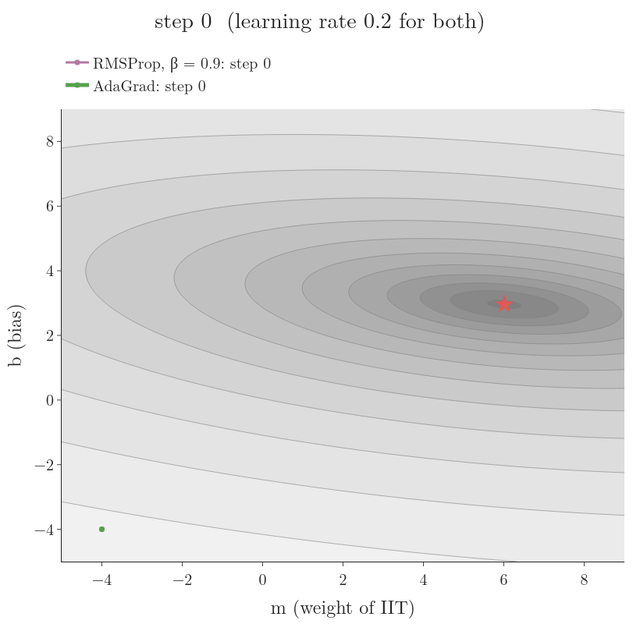
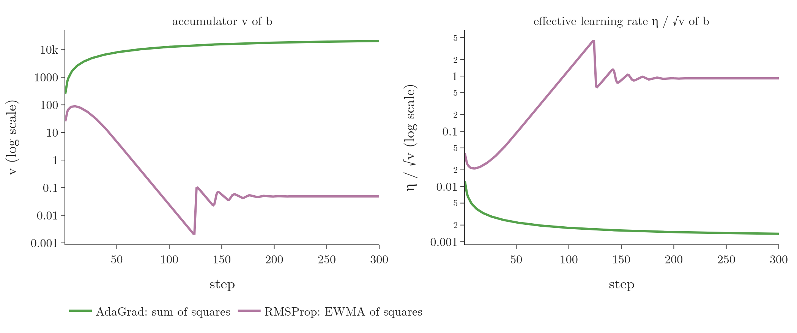

<!-- where-this-fits: generated by course_map/build_map.py; edit concepts.yaml, not this block -->
> **Where this fits:** Pipeline map step 8 (Model). See the [Course map](../../../00-course-map/00-course-map.md).
>
> 
>
> - **Builds on:** [Optimizers in deep learning](../../../DL/03-optimizers/DL-032-optimizers-in-deep-learning/DL-032-optimizers-in-deep-learning.md#8-sources); [Exponentially weighted moving average (EWMA)](../../../DL/03-optimizers/DL-033-exponentially-weighted-moving-average/DL-033-exponentially-weighted-moving-average.md#3-two-rules-behind-the-ewma); [AdaGrad](../../../DL/03-optimizers/DL-036-adagrad/DL-036-adagrad.md#3-when-adagrad-helps).
> - **Leads to:** [Adam](../../../DL/03-optimizers/DL-038-adam/DL-038-adam.md#6-adam-on-the-students-data).
> - **Compare with:** [Adam](../../../DL/03-optimizers/DL-038-adam/DL-038-adam.md#6-adam-on-the-students-data).
<!-- /where-this-fits -->

## 1. Overview

> **Key point:** RMSProp replaces AdaGrad's sum of squared gradients with an exponentially weighted moving average of them. Old gradients fade away, so their average cannot grow without limit and the learning rate does not shrink to nothing.

**RMSProp** (G-1697), short for *root mean square propagation* (Hinton 2012, lecture 6e), is an improvement of [AdaGrad](../DL-036-adagrad/DL-036-adagrad.md#6-the-update-rule) (G-168; divides each parameter's learning rate by the root of the sum of its past squared gradients). It keeps AdaGrad's good idea, a separate **learning rate** (G-1068) for every parameter, and removes its weakness: learning rates that only ever fall.

{width=80%}

Figure 1 is a **contour map** (the surface seen from above; each line joins points of equal loss; [how to read a contour map](../../../MA/06-calculus/MA-062-partial-derivatives-and-gradients/MA-062-partial-derivatives-and-gradients.md#11-reading-a-contour-map)), with the same surface in 3D at its right (height = the loss; the lines on it are the lines of the map). The surface is the loss of the students data, a bowl stretched along $m$ (built, and tilted from the side to the top view, in [a sparse feature stretches the loss](../DL-036-adagrad/DL-036-adagrad.md#4-the-problem-a-sparse-feature-stretches-the-loss)):

$$L(m, b) = \frac{1}{100}\sum_{i=1}^{100}\left(y_i - (m\thinspace x_i + b)\right)^2$$

At the start of the paths:

$$L(-4, -4) = 72.63$$

Here $x_i$ is the IIT value (0 or 1) of student $i$ and $y_i$ their package.

Lines close together mean steep (across the bowl, along $b$), lines far apart mean flat (along $m$), and the star is the lowest point, $L(6.01, 2.96) = 0.23$.

Figure 1 shows the difference on the students data. With the same learning rate, RMSProp brings the loss within 0.01 of its minimum in 68 steps; AdaGrad has not got there after 300.

## 2. Prerequisites

- [AdaGrad's per-parameter learning rates](../DL-036-adagrad/DL-036-adagrad.md#6-the-update-rule), [the elongated bowl](../DL-036-adagrad/DL-036-adagrad.md#4-the-problem-a-sparse-feature-stretches-the-loss), and [the learning rate that only goes down](../DL-036-adagrad/DL-036-adagrad.md#8-the-weakness-the-learning-rate-only-goes-down).
- [The exponentially weighted moving average](../DL-033-exponentially-weighted-moving-average/DL-033-exponentially-weighted-moving-average.md#4-the-formula) and [why old values fade](../DL-033-exponentially-weighted-moving-average/DL-033-exponentially-weighted-moving-average.md#6-why-older-values-get-less-weight).

## 3. AdaGrad's problem, in one formula

> **Key point:** AdaGrad's $v_t$ adds up every squared gradient since the first step. After many steps $v_t$ is huge, $\eta/\sqrt{v_t}$ is tiny, and the updates almost stop.

Recall the data: 100 students, the sparse IIT feature (a **sparse feature**, G-1841: mostly 0) and the package as **target** (G-1949; the output we predict). Its loss is an **elongated bowl** (G-673) over the weight $m$ and the bias $b$, and AdaGrad heads for the minimum by giving each parameter its own learning rate. But AdaGrad divides $\eta$ by $\sqrt{v_t}$, where

$$v_t = v_{t-1} + (\nabla L)^2$$

is the sum of all past squared gradients. Every step adds a positive amount, so $v_t$ only grows. After many steps the learning rate of a parameter such as $b$ becomes so small that its updates are almost zero, and AdaGrad stops short of the minimum.

With $\eta = 0.2$, AdaGrad's $v$ for $b$ grows from 253 after the first step to 2,171 after 10 steps and 20,654 after 300. Its learning rate $0.2/\sqrt{v}$ falls from 0.0126 to 0.0014, and after 300 steps $(m, b)$ is only at $(1.50, 1.22)$, far from the best $(6.01, 2.96)$ (Notebook).

{width=95%}

Figure 2 (left) shows the problem as a pile: no block of AdaGrad's stack ever leaves, so $v$ climbs to 20,654 and the learning rate falls to 0.0014. The right panel previews the fix of section 4, where old blocks melt away.

The whole problem comes from one fact: $v_t$ uses every gradient of the past, so it can only grow. We need a $v_t$ that does not grow without limit.

## 4. The fix: an average that forgets

> **Key point:** RMSProp makes $v_t$ an EWMA of the squared gradients. Recent gradients count most and old ones fade, so $v_t$ follows the current size of the gradients instead of piling up history.

RMSProp changes only the line that computes $v_t$:

1. **In words:** keep an **exponentially weighted moving average** (G-735) of each parameter's squared gradient, then divide the learning rate by its square root, as AdaGrad does.
2. **Formula:**
   $$v_t = \beta\thinspace v_{t-1} + (1-\beta)\thinspace\left(\nabla L(w_t)\right)^2$$
   $$w_{t+1} = w_t - \frac{\eta}{\sqrt{v_t} + \epsilon}\thinspace\nabla L(w_t)$$
   with $v_0 = 0$ and $\beta$ usually 0.9 (Hinton 2012).
3. **Example:** three squared gradients $g_1^2 = 9$, $g_2^2 = 4$, $g_3^2 = 1$ with $\beta = 0.9$:
   $$v_1 = 0.1 \times 9 = 0.9$$
   $$v_2 = 0.9 \times 0.9 + 0.1 \times 4$$
   $$= 0.81 + 0.4 = 1.21$$
   $$v_3 = 0.9 \times 1.21 + 0.1 \times 1$$
   $$= 1.089 + 0.1 = 1.189$$
   AdaGrad's sum would be (Notebook):
   $$9 + 4 + 1 = 14$$

Unrolling the average, as in [why older values get less weight](../DL-033-exponentially-weighted-moving-average/DL-033-exponentially-weighted-moving-average.md#6-why-older-values-get-less-weight), shows the weights:

$$v_3 = (1-\beta)\left(\beta^2 g_1^2 + \beta\thinspace g_2^2 + g_3^2\right)$$

The oldest squared gradient is multiplied by $\beta^2$, the newest by 1. Since $\beta < 1$, old gradients are forgotten little by little and recent ones count most. So $v_t$ never shoots up: it stays about the size of the recent squared gradients, the learning rate does not become tiny, and the updates continue.

RMSProp modifies AdaGrad by changing the gradient accumulation into an exponentially weighted moving average; it discards history from the extreme past so that it can converge rapidly after finding a convex bowl, as if it were an instance of AdaGrad started inside that bowl (Goodfellow et al. 2016, §8.5.2).

The name says what the method does: the denominator $\sqrt{v_t}$ is the **root** of a (weighted) **mean** of the **squared** gradients.

{width=100%}

In Figure 3 the vertical axes are on a log scale (each gridline 10 times the previous one), so a rise from 1 to 100 looks the same as a rise from 100 to 10,000. The left panel is $v$, the right the learning rate $\eta/\sqrt{v}$.

Figure 3 shows both accumulators for $b$. AdaGrad's $v$ keeps growing; RMSProp's rises at the start, when the gradients are large, then falls as they shrink. RMSProp's learning rate for $b$ stays useful, and the path of Figure 1 reaches the minimum.

> **Extra:** RMSProp's step is $\eta g/\sqrt{v}$, and $\sqrt{v}$ is about the size of the recent gradients, so near the minimum each step stays roughly of size $\eta$ even when the gradients are tiny. With a constant learning rate the weights then keep jittering around the minimum: in the last 100 of 300 steps RMSProp stays within 0.11 of the best $(m, b)$ but does not settle exactly (Notebook). A small $\eta$, such as Keras' default 0.001, or a [learning-rate schedule](../../../ML/06-regression/ML-058-stochastic-gradient-descent/ML-058-stochastic-gradient-descent.md#6-learning-schedules) (lowering $\eta$ during training) keeps the jitter small.

## 5. Convex and non-convex losses

> **Key point:** On a simple convex bowl, AdaGrad can do fine with a large enough learning rate. Its shrinking learning rate hurts most in deep networks, whose losses are non-convex. RMSProp works in both.

On a convex problem (a **convex function**, G-476) such as **linear regression** (G-1094; fitting a straight line), AdaGrad and RMSProp can follow very similar paths: with a large enough learning rate AdaGrad converges, as in [AdaGrad's $\eta = 2$ run](../DL-036-adagrad/DL-036-adagrad.md#8-the-weakness-the-learning-rate-only-goes-down). The difference shows in neural networks. There the path crosses many different regions before reaching a bowl, and AdaGrad may have shrunk its learning rate too much before it gets there (Goodfellow et al. 2016, §8.5.2).

### 5.1 AdaGrad against RMSProp on MNIST

> **Key point:** Same network, same learning rate 0.001, only the accumulator differs. After 30 epochs AdaGrad's training loss is still 0.24; RMSProp's is 0.0001.

The setup:

- **data:** the **MNIST** (G-1249) handwritten digits ([the MNIST data](../../01-basics/DL-012-mnist-ann/DL-012-mnist-ann.md#2-the-mnist-data)), 10,000 training images, each with 784 pixel **features** (G-772; input variables) and the digit as target (the output we predict), and the 10,000 test images for validation (checking accuracy on images the network did not train on);
- **network:** hidden layers of 128 and 64 **ReLU** (G-1668; each node outputs its input if positive, else 0) nodes and a softmax output (10 probabilities, one per digit);
- **training:** both optimizers use learning rate 0.001 (Keras' default for both), **batch size** (G-267) 64, accumulators starting at 0, and 30 **epochs** (G-696), with 3 seeds each.

After every epoch we record the median **effective learning rate** (G-662) $\eta/\sqrt{v}$ over all weights.

{width=100%}

In Figure 4 the left panel is the training loss after each epoch and the right panel the learning rate RMSProp and AdaGrad actually use; each curve is the mean over 3 seeds. The vertical axes are on a log scale (each labelled power of ten is 10 times the one below; the small numbers between mark 2, 3, … times it), so equal vertical distances mean equal ratios. On the left a lower curve is better.

Figure 4 and the Notebook give:

| | AdaGrad | RMSProp |
|---|---|---|
| Training loss, epoch 1 | 1.28 | 0.56 |
| Training loss, epoch 10 | 0.33 | 0.029 |
| Training loss, epoch 30 | 0.24 | 0.0001 |
| Validation accuracy, epoch 30 | 0.920 | 0.956 |
| Median $\eta/\sqrt{v}$, epoch 1 $\to$ 30 | 0.067 $\to$ 0.013 | 0.99 $\to$ 3.2 |

AdaGrad's median learning rate falls by a factor of 5 over the 30 epochs, and its loss levels off: it drops from 0.33 to only 0.24 between epochs 10 and 30. RMSProp's median learning rate does not fall at all; it rises as the gradients become small near the minimum, and its training loss keeps dropping, to 0.0001. Validation accuracy follows: 0.956 against 0.920 (Notebook).

> **Extra:** A larger learning rate helps AdaGrad but does not remove the gap. With $\eta$ = 0.01, 0.03 and 0.1 (seed 0), its training loss after 30 epochs is 0.016, 0.0014 and 0.0013, still above RMSProp's 0.0001 at $\eta = 0.001$. Its validation accuracy at $\eta = 0.03$, 0.961, is even a little above RMSProp's 0.956: with a well-chosen learning rate AdaGrad does well on this small network, in line with AdaGrad performing well for some deep learning models but not all (Goodfellow et al. 2016, §8.5.1) (Notebook).

## 6. Strengths and limits

> **Key point:** RMSProp is an effective, widely used optimizer for deep networks. RMSProp was the usual choice before Adam, and it is a natural next try when Adam does not give good results.

RMSProp has been shown empirically to be an effective and practical optimization algorithm for deep neural networks, and it is one of the go-to methods of deep learning practitioners (Goodfellow et al. 2016, §8.5.2). Before Adam appeared, it was the optimizer most networks were trained with. It still competes with Adam: if Adam does not give good results on a problem, RMSProp is a natural next try.

Two limits are worth knowing:

- Compared with AdaGrad, it adds a **hyperparameter** (G-910; a setting chosen before training), $\beta$, which sets how long the average remembers (Goodfellow et al. 2016, §8.5.2).
- Its average starts at $v_0 = 0$ with no correction, so early in training $v_t$ is pulled towards 0 (Goodfellow et al. 2016, §8.5.3), the [start-up effect of a zero start](../DL-033-exponentially-weighted-moving-average/DL-033-exponentially-weighted-moving-average.md#4-the-formula).

**Adam** (G-169) fixes the second and adds **momentum** (G-1258), and usually performs a little better, which is why RMSProp is used less today ([Adam's bias correction](../DL-038-adam/DL-038-adam.md#5-bias-correction)).

> **Extra:** RMSProp was never published as a paper; it comes from Hinton's 2012 Coursera lecture slides, which suggest $\beta = 0.9$ (Hinton 2012, lecture 6e; Ruder 2016, §4.5).

## 7. RMSProp in Keras

> **Key point:** `keras.optimizers.RMSprop(learning_rate=0.001, rho=0.9)`. Keras calls $\beta$ `rho`.

> **Python:** RMSProp in Keras.
>
> ```python
> import keras
> opt = keras.optimizers.RMSprop(learning_rate=0.001, rho=0.9)
> model.compile(optimizer=opt, loss="sparse_categorical_crossentropy",
>               metrics=["accuracy"])
> ```

The defaults are `learning_rate=0.001`, `rho=0.9` and `epsilon=1e-7`, added inside the square root (Keras `RMSprop` documentation).

## 8. Summary

| | AdaGrad | RMSProp |
|---|---|---|
| $v_t$ | $v_{t-1} + g_t^2$ (sum of all) | $\beta v_{t-1} + (1-\beta) g_t^2$ (EWMA) |
| Old gradients | count forever | fade by $\beta$ per step |
| $v_t$ over time | only grows | follows the recent gradient size |
| Learning rate $\eta/\sqrt{v_t}$ | only falls | can recover |
| Students data, $\eta = 0.2$ | not there after 300 steps | 68 steps |
| MNIST, 30 epochs, $\eta = 0.001$ | loss 0.24 | loss 0.0001 |

- RMSProp is AdaGrad with the sum of squared gradients replaced by their EWMA, because AdaGrad's sum can only grow and its learning rate only fall.
- Old gradients fade, so the accumulator stays the size of the recent gradients and the learning rate does not collapse.
- It keeps AdaGrad's per-parameter learning rates, so it still handles elongated bowls and sparse features.
- It works well in deep networks and was the standard choice before Adam, so it is the natural next try when Adam does not give good results; usual values $\beta = 0.9$, $\eta = 0.001$.

## 9. Sources

**Built from**

- CampusX, "RMSProp Explained in Detail with Animations | Optimizers in Deep Learning Part 5", YouTube, https://www.youtube.com/watch?v=p0wSmKslWi0

**Other references**

- Goodfellow, I., Bengio, Y. and Courville, A. (2016). *Deep Learning*. MIT Press. §8.5.2 RMSProp (algorithm 8.5).
- Hinton, G. (2012). *Neural Networks for Machine Learning*, Coursera, lecture 6e: rmsprop: divide the gradient by a running average of its recent magnitude (slides).
- Ruder, S. (2016). An overview of gradient descent optimization algorithms. arXiv:1609.04747. §4.5 RMSprop.
- Keras API documentation: `RMSprop` optimizer, keras.io/api/optimizers/rmsprop.

## 10. Key terms

| Term | Meaning |
|---|---|
| RMSProp | An optimizer that divides each parameter's step by the root of a running average (EWMA) of its recent squared gradients, $v_t = \beta v_{t-1} + (1-\beta)g_t^2$; old gradients fade, so unlike AdaGrad the learning rate does not shrink to nothing. |
| Root mean square | The square root of the average of squared values: the typical size of the gradients |
| Accumulator $v_t$ | The running record of squared gradients that divides the learning rate |
| `rho` | Keras' name for RMSProp's decay factor $\beta$; default 0.9 |
| Feature | An input variable, such as one pixel of an image |
| Target | The output we predict, such as the digit |
