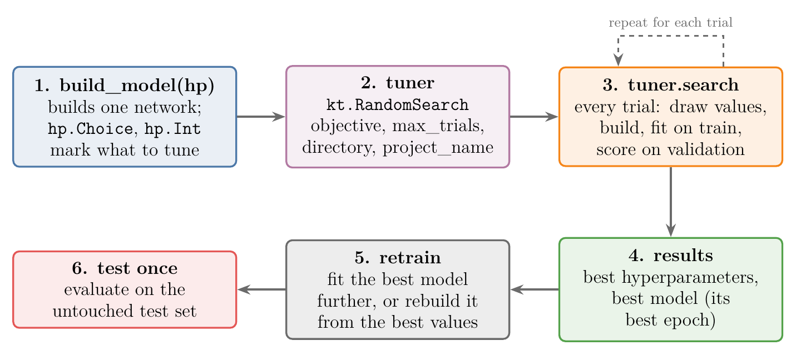
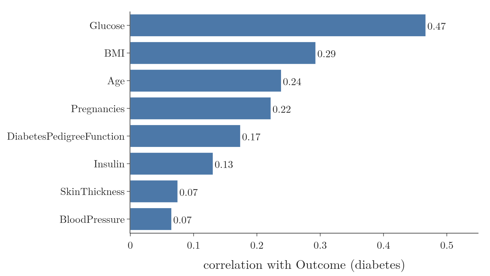
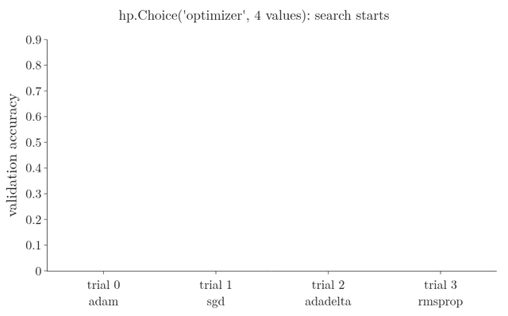
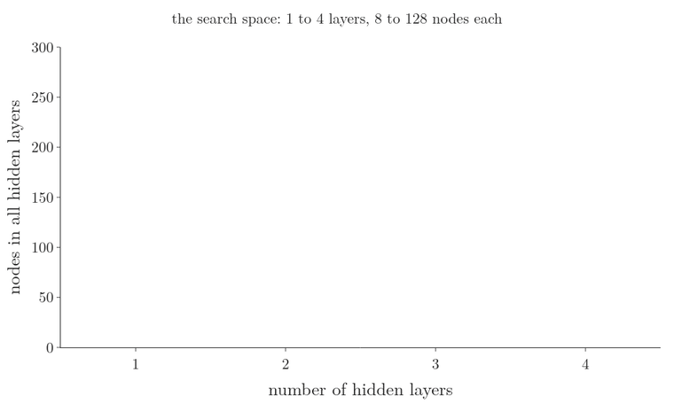
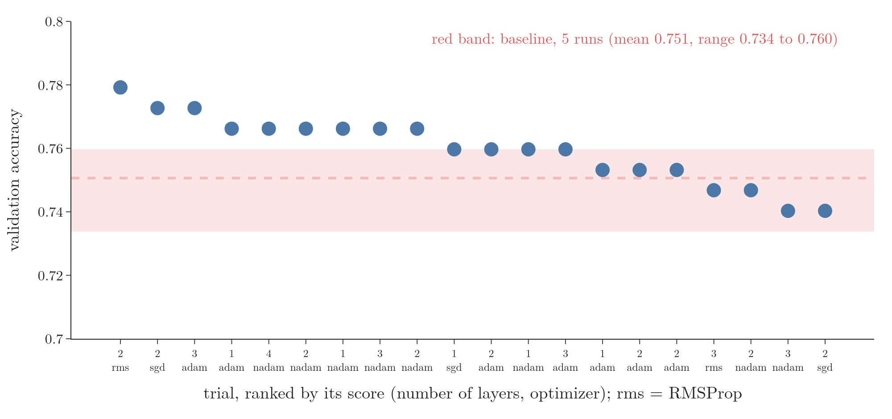
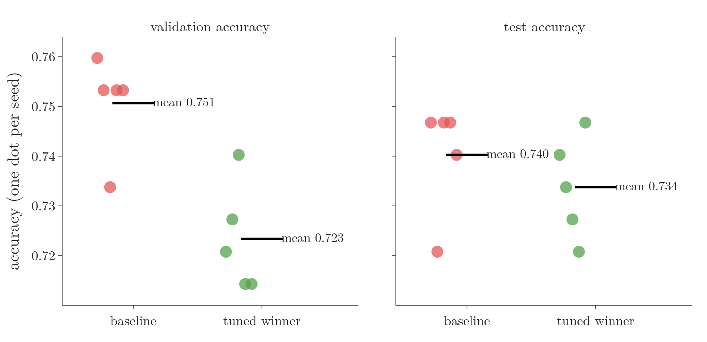
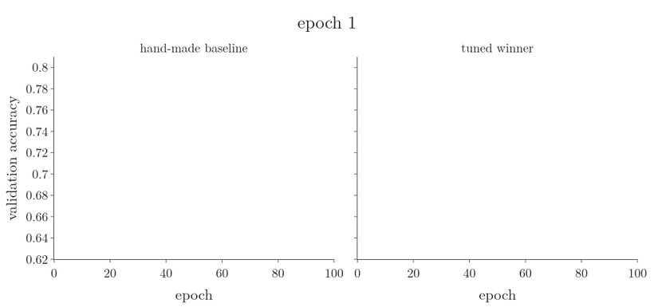
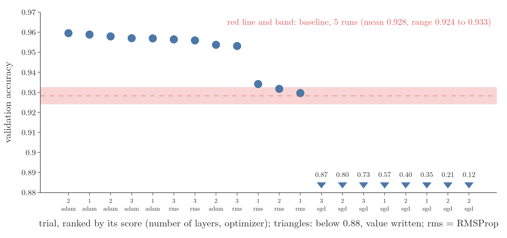
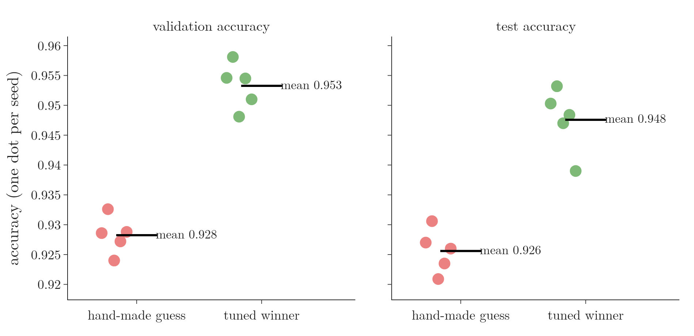

<!-- where-this-fits: generated by course_map/build_map.py; edit concepts.yaml, not this block -->
> **Where this fits:** Pipeline map step 10 (Tune). See the [Course map](../../../00-course-map/00-course-map.md).
>
> 
>
> - **Builds on:** Overfitting ([Note ML-007](../../../ML/01-foundations/ML-007-challenges-in-ml/ML-007-challenges-in-ml.md)); Keras workflow ([Note DL-011](../../../DL/01-basics/DL-011-customer-churn-ann/DL-011-customer-churn-ann.md)).
> - **Compare with:** Grid and random search ([Note ML-112](../../../ML/08-trees-and-ensembles/ML-112-adaboost-hyperparameters/ML-112-adaboost-hyperparameters.md)).
<!-- /where-this-fits -->

## 1. Overview

> **Key point:** Keras Tuner automates the choices we make by hand when we build a network. We write one function that builds a model and marks each choice as a hyperparameter; a tuner then builds, trains and scores many versions and returns the best.

Every network we have built so far rested on guesses: how many hidden layers, how many nodes in each, which activation, which optimizer, which batch size. We cannot know the best answers without trying them. **Keras Tuner** (G-1001) (the Python package `keras_tuner`) is a library that tries them for us.

{width=100%}

Figure 1 shows the whole workflow. We follow it four times on the Pima diabetes data, each time tuning more:

1. the optimizer (section 5);
2. the number of nodes (section 6);
3. the number of layers (section 7);
4. everything at once (section 8).

Then we test the result on a larger dataset, MNIST (section 10).

## 2. Prerequisites

- The [how to improve a neural network Note](../../02-training/DL-021-improving-a-neural-network/DL-021-improving-a-neural-network.md): the hyperparameters of a network.
- The [Optuna Note](../../../ML/09-clustering-and-more/ML-128-optuna/ML-128-optuna.md): grid, random and Bayesian search, and the diabetes data.
- The [customer churn ANN Note](../../01-basics/DL-011-customer-churn-ann/DL-011-customer-churn-ann.md): building, compiling and fitting a Keras model, and the **validation set** (G-2067).
- The [dropout Note](../../02-training/DL-024-dropout/DL-024-dropout.md) and the [activation functions Note](../../02-training/DL-027-activation-functions/DL-027-activation-functions.md).

## 3. The problem: too many choices

> **Key point:** A network has many hyperparameters, and the right values depend on the data. Trying them by hand is slow trial and error; Keras Tuner turns it into a search.

A **hyperparameter** (G-910) is a setting chosen before training that the network does not learn (see the [pipelines Note](../../../ML/03-feature-engineering/ML-028-pipelines/ML-028-pipelines.md)). For a network, the main ones are:

- number of hidden layers;
- number of nodes in each hidden layer;
- activation function of each layer;
- optimizer (see the [optimizers Note](../DL-032-optimizers-in-deep-learning/DL-032-optimizers-in-deep-learning.md));
- batch size, the number of epochs and the **dropout** (G-639) rate.

Until now we picked these from intuition. **Hyperparameter tuning** (G-909) tries several values and keeps the ones that score best (the [Optuna Note](../../../ML/09-clustering-and-more/ML-128-optuna/ML-128-optuna.md), section 2). For scikit-learn models we used `GridSearchCV` and `RandomizedSearchCV` (the [random forest tuning Note](../../../ML/08-trees-and-ensembles/ML-106-random-forest-tuning/ML-106-random-forest-tuning.md)). Keras Tuner does the same job for Keras networks.

## 4. The data and a hand-made baseline

> **Key point:** 768 patients, 8 medical measurements, diabetes yes or no. A one-layer network chosen by hand reaches a validation accuracy of 0.760; that is the number to beat.

### 4.1 The Pima diabetes data

> **Key point:** A small, well-known binary classification dataset; every feature is numeric.

We use the Pima diabetes data of the [ROC Note](../../../ML/07-classification/ML-077-roc-auc/ML-077-roc-auc.md) and the [Optuna Note](../../../ML/09-clustering-and-more/ML-128-optuna/ML-128-optuna.md). Each **observation** (G-1374) (one record, a row of the table) is a woman. Each has 8 **features** (G-772) (input variables, one column each), such as the number of pregnancies, glucose, blood pressure, insulin, BMI and age. The **target** (G-1949) (the output we predict) is `Outcome`: 1 for diabetes, 0 for none.

The correlation of each feature with the target shows that all of them carry some signal. Glucose is the strongest (0.47), then BMI (0.29) and age (0.24); blood pressure and skin thickness are the weakest (0.07 each). We keep all 8, since the goal here is tuning, not feature selection.

{height=35%}

Figure 2 shows that no single feature decides the answer: glucose leads with 0.47, and every other feature adds a weaker signal.

### 4.2 Three sets: train, validation, test

> **Key point:** The tuner chooses by the validation score, so the validation set takes part in the choice. A separate test set, used once at the end, gives the honest score.

We split the 768 observations three ways, keeping the share of diabetes the same in each:

| Set | Observations | Used for |
|---|---|---|
| training | 460 (60%) | fitting the weights |
| validation | 154 (20%) | scoring each trial, choosing the best |
| test | 154 (20%) | one final, honest score |

A standard scaler is fitted on the training set only and applied to all three (the [toy project Note](../../../ML/01-foundations/ML-012-toy-project/ML-012-toy-project.md) explains why).

Why three sets? The tuner picks the model with the highest validation score. After many trials, the winner's validation score is partly luck: it is the best of many noisy numbers. If we also reported that same set as the final score, information from it would have leaked into the choice of the model (**data leakage**, G-535; see [toy project Note](../../../ML/01-foundations/ML-012-toy-project/ML-012-toy-project.md)). The **test set** (G-1962) has played no part in any choice, so its score is honest.

### 4.3 The baseline network

> **Key point:** One hidden layer of 32 ReLU nodes, a sigmoid output, Adam, batch size 32, 100 epochs: validation accuracy 0.760.

> **Python:** The hand-made baseline.
>
> ```python
> model = keras.Sequential([
>     keras.Input(shape=(8,)),
>     keras.layers.Dense(32, activation="relu"),
>     keras.layers.Dense(1, activation="sigmoid")])
> model.compile(optimizer="adam",
>               loss="binary_crossentropy", metrics=["accuracy"])
> model.fit(X_train, y_train, batch_size=32, epochs=100,
>           validation_data=(X_val, y_val))
> ```

After 100 epochs the validation accuracy is 0.760. Every number in that model (1 layer, 32 nodes, ReLU, Adam) was a guess. The rest of this Note asks whether a search finds better ones.

## 5. The Keras Tuner workflow: choosing the optimizer

> **Key point:** Three steps: a function `build_model(hp)` that marks the choices, a tuner object, and `tuner.search(...)`. Then we read off the best hyperparameters and the best model.

### 5.1 Step 1: the model-building function

> **Key point:** `build_model(hp)` (G-68) builds and compiles one network. Wherever a value should be tuned, we ask `hp` for it instead of writing a number.

Keras Tuner calls our function again and again, once per **trial** (G-2016) (one model built, trained and scored with one set of hyperparameter values). It passes in `hp`, a `HyperParameters` object. Calling `hp.Choice(name, values=[...])` (G-90) both declares a hyperparameter and returns the value to use in this trial (Keras Tuner guide).

> **Python:** Only the optimizer is tuned; the rest is fixed.
>
> ```python
> import keras_tuner as kt
>
> def build_model(hp):
>     model = keras.Sequential([
>         keras.Input(shape=(8,)),
>         keras.layers.Dense(32, activation="relu"),
>         keras.layers.Dense(1, activation="sigmoid")])
>     optimizer = hp.Choice("optimizer",
>         values=["adam", "sgd", "rmsprop", "adadelta"])
>     model.compile(optimizer=optimizer,
>         loss="binary_crossentropy", metrics=["accuracy"])
>     return model
> ```

Every hyperparameter has a name, here `"optimizer"`; the results are reported under that name. The four optimizers are taught in their own Notes: SGD with [momentum](../DL-034-sgd-with-momentum/DL-034-sgd-with-momentum.md) or without, [RMSProp](../DL-037-rmsprop/DL-037-rmsprop.md) and [Adam](../DL-038-adam/DL-038-adam.md); Adadelta is a relative of RMSProp (Ruder 2016, section 4.4).

### 5.2 Step 2: the tuner object

> **Key point:** `kt.RandomSearch` (G-129) draws random combinations of the hyperparameter values, up to `max_trials` of them, and keeps the one with the best `objective`.

> **Python:** A random-search tuner.
>
> ```python
> tuner = kt.RandomSearch(
>     build_model,                  # the function above
>     objective="val_accuracy",     # what to maximise
>     max_trials=5,                 # at most 5 models
>     seed=0,                       # same draws every run
>     directory="my_dir",           # where results are saved
>     project_name="optimizer",     # sub-folder of directory
>     overwrite=True)               # start afresh
> ```

`RandomSearch` is the counterpart of scikit-learn's `RandomizedSearchCV`, not of `GridSearchCV`: it draws random combinations instead of trying every one (Keras Tuner guide). Keras Tuner also has `BayesianOptimization` and `Hyperband` tuners (Keras Tuner guide); the idea behind Bayesian search is in the [Optuna Note](../../../ML/09-clustering-and-more/ML-128-optuna/ML-128-optuna.md).

The **objective** (G-1373) is the metric the tuner optimises; the argument `objective` names it. For built-in metrics such as `"val_accuracy"`, the tuner infers on its own whether higher or lower is better (Keras Tuner guide).

### 5.3 Step 3: the search

> **Key point:** `tuner.search` takes the same arguments as `model.fit`. RMSProp scored best, 0.747; Adadelta failed, 0.338.

> **Python:** Run the trials. Each trial trains for 10 epochs.
>
> ```python
> tuner.search(X_train, y_train, epochs=10,
>              validation_data=(X_val, y_val))
> ```

Every argument of `search` is passed on to `model.fit` in each trial (Keras Tuner guide). The tuner builds a model, trains it, records its validation accuracy, and moves on. Ten epochs are enough to compare the candidates roughly; the winner can train longer afterwards.

{height=45%}

In Figure 3, watch the green bar: it moves to SGD at trial 1, stays put when Adadelta fails at trial 2, and settles on RMSProp at trial 3, after which no optimizer is left to try.

| Trial | Optimizer | Validation accuracy |
|---|---|---|
| 3 | `rmsprop` | 0.747 |
| 1 | `sgd` | 0.740 |
| 0 | `adam` | 0.727 |
| 2 | `adadelta` | 0.338 |

We asked for 5 trials but got 4. The optimizer has only 4 values, so after 4 trials every combination has been tried. The random search then keeps drawing repeats; after 20 repeats in a row it stops (Keras Tuner source, `oracle.py`).

> **Extra:** Adadelta's 0.338 is almost exactly the share of diabetes in the validation set, 0.351: after 10 epochs that model still called nearly every patient diabetic. Keras gives Adadelta a default learning rate of 0.001 (Keras source, `adadelta.py`), so in 10 epochs its weights moved little from their random start. A poor score after a short search can mean "not trained enough" as well as "bad choice".

### 5.4 The best hyperparameters and the best model

> **Key point:** `get_best_hyperparameters()[0].values` gives the winning values as a dictionary; `get_best_models(num_models=1)[0]` gives the winning model, already trained.

> **Python:** Read off the winner and keep training it.
>
> ```python
> tuner.get_best_hyperparameters()[0].values
> # {'optimizer': 'rmsprop'}
>
> model = tuner.get_best_models(num_models=1)[0]
> model.fit(X_train, y_train, batch_size=32, epochs=100,
>           initial_epoch=10,
>           validation_data=(X_val, y_val))
> ```

Both methods return lists sorted from best to worst, hence the `[0]`. The returned model is not a fresh one: it holds the weights from the best **epoch** (G-696) of its trial (Keras Tuner guide). So we can continue training it rather than start again.

`initial_epoch` tells `fit` where to continue the epoch count. Epochs are numbered from 0, so after 10 epochs (numbers 0 to 9) the next one is number 10, and `initial_epoch=10, epochs=100` runs the remaining 90. Setting `initial_epoch` to one more than the epochs already run would skip an epoch.

After the 90 further epochs, the RMSProp model reaches a validation accuracy of 0.753, against the baseline's 0.760. Choosing the optimizer alone did not beat the baseline here.

## 6. Tuning the number of nodes

> **Key point:** `hp.Int(name, min_value, max_value, step)` (G-92) tries whole numbers in a range. With 8 to 128 in steps of 8, the best of 5 trials was 56 nodes, at 0.773.

> **Python:** The hidden layer's size becomes a hyperparameter; the optimizer is the winner of section 5.
>
> ```python
> def build_model(hp):
>     units = hp.Int("units", min_value=8,
>                    max_value=128, step=8)
>     model = keras.Sequential([
>         keras.Input(shape=(8,)),
>         keras.layers.Dense(units, activation="relu"),
>         keras.layers.Dense(1, activation="sigmoid")])
>     model.compile(optimizer="rmsprop",
>         loss="binary_crossentropy", metrics=["accuracy"])
>     return model
> ```

`hp.Int` declares an integer hyperparameter. With `step=8` the possible values are 8, 16, 24, …, 128: 16 values. The random search draws 5 of them:

| Nodes | 56 | 104 | 64 | 32 | 8 |
|---|---|---|---|---|---|
| Validation accuracy | 0.773 | 0.766 | 0.753 | 0.734 | 0.636 |

{height=38%}

Figure 4 shows how little of the range 5 trials cover: 11 of the 16 values were never tried, so the winner, 56, is the best of those drawn, not necessarily the best possible.

Without `step`, every whole number from 8 to 128 can be drawn.

## 7. Tuning the number of layers

> **Key point:** A `for` loop over `range(hp.Int("num_layers", 1, 10))` adds that many hidden layers. Of 5 trials, 3 layers scored best, 0.766, tied with 5 layers.

> **Python:** The number of hidden layers is the hyperparameter; each layer has the 56 nodes found in section 6.
>
> ```python
> def build_model(hp):
>     model = keras.Sequential([keras.Input(shape=(8,))])
>     n = hp.Int("num_layers", min_value=1, max_value=10)
>     for i in range(n):
>         model.add(keras.layers.Dense(56, activation="relu"))
>     model.add(keras.layers.Dense(1, activation="sigmoid"))
>     model.compile(optimizer="rmsprop",
>         loss="binary_crossentropy", metrics=["accuracy"])
>     return model
> ```

The loop runs once per trial with the drawn number: one trial builds 3 hidden layers, another 8. With `keras.Input` as the first element, the first hidden layer needs no special case.

| Hidden layers | 3 | 5 | 10 | 1 | 8 |
|---|---|---|---|---|---|
| Validation accuracy | 0.766 | 0.766 | 0.753 | 0.740 | 0.734 |

The scores are close together: on 154 validation patients, one patient more or less changes the accuracy by $1/154 = 0.0065$.

{height=38%}

In Figure 5, count the dotted lines between the scores: 3 layers and 1 layer differ by four patients out of 154, and the two winners tie exactly.

## 8. Tuning everything at once

> **Key point:** Inside the layer loop, each layer gets its own hyperparameters, named with the layer number: `units_0`, `units_1`, …. The number of hyperparameters then changes from trial to trial.

### 8.1 One name per layer

> **Key point:** Two hyperparameters with the same name are the same hyperparameter. To tune each layer separately, put the layer number in the name.

Each hyperparameter is identified by its name (Keras Tuner guide). If every layer asked for `hp.Int("units", ...)`, all layers would share one value. Writing `f"units_{i}"` gives layer 0 the hyperparameter `units_0`, layer 1 `units_1`, and so on.

These are **conditional hyperparameters** (G-442): `units_3` exists only in trials with at least 4 layers (Keras Tuner guide). We also add a dropout layer after each hidden layer, with its own rate, and let the tuner pick the optimizer.

> **Python:** The all-in-one model-building function.
>
> ```python
> def build_model(hp):
>     model = keras.Sequential([keras.Input(shape=(8,))])
>     for i in range(hp.Int("num_layers", 1, 4)):
>         model.add(keras.layers.Dense(
>             hp.Int(f"units_{i}", 8, 128, step=8),
>             activation=hp.Choice(f"activation_{i}",
>                                  values=["relu", "tanh"])))
>         model.add(keras.layers.Dropout(
>             hp.Choice(f"dropout_{i}",
>                 values=[0.0, 0.1, 0.2, 0.3, 0.4, 0.5])))
>     model.add(keras.layers.Dense(1, activation="sigmoid"))
>     optimizer = hp.Choice("optimizer",
>         values=["adam", "rmsprop", "nadam", "sgd"])
>     model.compile(optimizer=optimizer,
>         loss="binary_crossentropy", metrics=["accuracy"])
>     return model
> ```

All the values the hyperparameters may take, together, form the **search space** (G-1756). Each added value multiplies the number of combinations in it (the [Optuna Note](../../../ML/09-clustering-and-more/ML-128-optuna/ML-128-optuna.md), section 2), and random search with 20 trials sees only a few of them. So the ranges are kept to values that suit a network this small: at most 4 layers and dropout rates up to 0.5. Every trial trains for the same 100 epochs as the baseline, so the scores can be compared with it.

### 8.2 The results

> **Key point:** The best of 20 trials, 2 layers with RMSProp, scored 0.779. But 11 of the 20 trials scored within the range that the baseline itself covers when only its random start changes.

Figure 6 replays the search. Each trial lands as one dot: its position gives the number of hidden layers and the nodes in all of them, its colour the validation accuracy. Watch the red ring, the best trial so far: it jumps to trial 2 early and never moves again, while the later dots land all over the search space without any pattern in their colours.

{width=90% height=45%}

{width=100%}

Figure 7 ranks the 20 trials. The winner, trial 2, has two hidden layers: 40 tanh nodes without dropout, then 104 ReLU nodes with dropout 0.3, trained with RMSProp. Its score is 0.779; the weakest trial scored 0.740.

The red band in Figure 7 is the baseline trained 5 times, changing only the seed: its validation accuracy ranges from 0.734 to 0.760. Eleven of the 20 trials fall inside that band. On 154 validation patients, the differences between most sensible networks are no bigger than the differences between two random starts of the same network.

The dictionary of best values also lists `units_2`, `units_3` and their partners, left over from other trials, even though the winner has only 2 layers (Notebook). Only the values of layers that exist are used when the model is built.

### 8.3 Where the results are stored

> **Key point:** Everything goes to the folder `directory/project_name`: one sub-folder per trial, each with a `trial.json` file holding the values and the score.

The tuner saves its state as it goes: an `oracle.json` file for the search, and for every trial a folder `trial_00`, `trial_01`, … with a `trial.json` (values, score) and the weights of its best epoch (Notebook). We can open these files later to analyse the trials.

> **Extra:** By default, `directory` is the current folder, `project_name` is `"untitled_project"` and `overwrite` is `False` (Keras Tuner source, `base_tuner.py`). A second tuner created with the defaults therefore reloads the first one's finished project instead of starting a new search. Its trials are already used up, so the search ends at once with the message "Oracle triggered exit". Giving each search its own `project_name`, or passing `overwrite=True`, avoids this.

## 9. On 768 patients, the gain is within seed noise

> **Key point:** Retrained 5 times, the tuned network averages 0.723 on validation against the baseline's 0.751, and 0.734 on the test set against 0.740. On a 768-row dataset, the gain from tuning is within seed noise.

A trial's score is the best of its 100 epochs, from one random start, on 154 patients. For a fair comparison we rebuild the baseline and the winning configuration from scratch, train each 5 times with different seeds for 100 epochs, and compare the mean validation accuracy. Only then do we look at the test set, once.

| | Baseline (5 runs) | Tuned (5 runs) |
|---|---|---|
| Validation accuracy, mean (std) | 0.751 (0.010) | 0.723 (0.011) |
| Test accuracy, mean (std) | 0.740 (0.011) | 0.734 (0.010) |

{height=38%}

In Figure 8, the two clouds of test dots overlap almost completely: the gap between the means is smaller than the spread within either network.

The tuned network's 0.779 shrinks to 0.723 once it is retrained. Two things inflated it:

1. **The best epoch.** A trial is scored at the best of its epochs, and its saved model is that epoch's (Keras Tuner guide; Keras Tuner source, `tuner.py`). The retrained runs are scored after the last epoch.
2. **The best of 20.** The winner is the highest of 20 scores that each carry seed-to-seed noise of about 0.01 (the baseline's standard deviation). Picking the highest favours the trial whose noise happened to be largest.

Figure 9 shows the first effect. It draws the validation accuracy of all 10 retrained runs epoch by epoch. Watch the tuned winner (right): it peaks within the first 30 epochs and then drifts down as it overfits, so its best epoch (0.77 on average) lies well above its last epoch (0.723). The baseline (left) stays level, and its two numbers are close (0.76 and 0.751).

{width=100%}

On the test set the two networks are level: 0.740 and 0.734, a gap smaller than either standard deviation. Keras Tuner works as designed, but on 460 training patients a one-layer network with sensible defaults is already about as good as any network in the search space. Section 10 repeats the experiment on a dataset where the network's size and learning rate matter more. The search did rule out bad choices: Adadelta after 10 epochs (0.338) and 8 nodes (0.636) scored far below the rest in sections 5 and 6.

> **Extra:** Keras Tuner can reduce this noise inside the search itself: `executions_per_trial=2` trains every configuration twice and averages the scores, at twice the cost (Keras Tuner guide).

## 10. A dataset where tuning pays: MNIST

> **Key point:** On handwritten digits, a search of 20 trials over layers, nodes, dropout, optimizer and learning rate raised the mean validation accuracy from 0.928 (hand-made, 5 runs) to 0.953, and the test accuracy from 0.926 to 0.948.

### 10.1 The data, the guess and the search space

> **Key point:** 10,000 training images, 10,000 validation images, and the 10,000 test images kept for the end. The guess is one layer of 32 nodes with Adam's default learning rate.

The data is MNIST (see the [MNIST Note](../../01-basics/DL-012-mnist-ann/DL-012-mnist-ann.md)): images of handwritten digits, each with 784 pixel features scaled to 0 to 1, and the digit as target. We train on the first 10,000 training images, validate on 10,000 other training images, and keep the official 10,000 test images for one final score.

The hand-made guess has one hidden layer of 32 ReLU nodes and a softmax output, trained with Adam at its default learning rate 0.001, batch size 128, for 10 epochs. The search builds networks with:

- 1 to 3 hidden layers of 32 to 512 ReLU nodes (step 32), each followed by dropout from 0 to 0.5;
- the optimizer: Adam, RMSProp or SGD;
- the learning rate, from 0.0001 to 0.01.

> **Python:** A learning rate drawn on a log scale, passed to the chosen optimizer.
>
> ```python
> lr = hp.Float("learning_rate", min_value=1e-4,
>               max_value=1e-2, sampling="log")
> name = hp.Choice("optimizer",
>                  values=["adam", "rmsprop", "sgd"])
> optimizer = {"adam": keras.optimizers.Adam,
>              "rmsprop": keras.optimizers.RMSprop,
>              "sgd": keras.optimizers.SGD}[name](learning_rate=lr)
> ```

`hp.Float` (G-91) declares a hyperparameter that takes any decimal value in a range (Keras Tuner guide). With `sampling="log"`, a uniform random number $u$ between 0 and 1 becomes $\text{min} \times (\text{max}/\text{min})^u$ (Keras Tuner source, `float_hp.py`). For a range from $\text{min} = 0.0001$ to $\text{max} = 0.01$, the ratio is $100$, and three draws give:

$$u = 0: \quad 0.0001 \times 100^{0} = 0.0001$$
$$u = 0.5: \quad 0.0001 \times 100^{0.5} = 0.0001 \times 10 = 0.001$$
$$u = 1: \quad 0.0001 \times 100^{1} = 0.01$$

Values are then spread evenly over the powers of ten: 0.0001 to 0.001 is as likely as 0.001 to 0.01. In our search the good learning rates themselves spanned a factor of 10: the 9 trials above 0.95 used rates from 0.0008 to 0.008 (Notebook). Each of the 20 trials trains for the same 10 epochs as the guess, with `executions_per_trial=1`.

### 10.2 The results

> **Key point:** The top 10 trials all beat every run of the hand-made guess; the bottom 8, all SGD with small learning rates, fell far below it.

{width=100%}

Figure 10 ranks the 20 trials. The winner has two hidden layers, 256 nodes without dropout and 96 nodes with dropout 0.4, trained with Adam at a learning rate of 0.0068. Its score is 0.960, while the hand-made guess, run 5 times, ranges from 0.924 to 0.933.

The search also shows which choices fail. All 8 SGD trials drew learning rates of 0.0054 or less and scored between 0.12 and 0.87: with such small steps, plain SGD had not finished learning after 10 epochs (Notebook). A search does not only find good settings; it shows which ranges to avoid.

### 10.3 Retrained with 5 seeds, then tested once

> **Key point:** The gain survives retraining: 0.953 against 0.928 on validation, 0.948 against 0.926 on the test set, gaps 4 to 8 times the seed-to-seed standard deviation.

As in section 9, we rebuild both networks from scratch and train each 5 times with different seeds for 10 epochs.

| | Hand-made guess (5 runs) | Tuned (5 runs) |
|---|---|---|
| Validation accuracy, mean (std) | 0.928 (0.003) | 0.953 (0.004) |
| Test accuracy, mean (std) | 0.926 (0.004) | 0.948 (0.005) |

{height=38%}

Compare Figure 11 with Figure 8: here the two clouds do not touch on either set, which is what a real gain looks like.

Every tuned run beat every run of the guess, on both sets. The retrained winner averages 0.953, below its search score of 0.960, for the two reasons of section 9. Here the gap between the networks (0.025 on validation, 0.022 on test) is far larger than the seed noise, so the gain is real.

The two datasets give the honest picture. Keras Tuner always returns a winner, but the winner is only worth having when the gap to the hand-made network is larger than the noise. Retraining with several seeds and testing once at the end is how we tell the two cases apart.

## 11. Summary

| Step | Code | What it does |
|------|------------------|----------|
| Mark a choice | `hp.Choice(...)` | one value from a list |
| | `hp.Int(...)` | a whole number in a range, with a step |
| Build | `build_model(hp)` | builds and compiles one network per trial |
| Tuner | `kt.RandomSearch(...)` | random combinations, best by `objective` |
| Search | `tuner.search(...)` | its arguments go to `fit` |
| | `hp.Float(..., sampling="log")` | a decimal number, even across powers of ten |
| Results | `get_best_hyperparameters()` | winning values, best first |
| | `get_best_models()` | winning models, best first |
| Continue | `fit(initial_epoch=k)` | resumes the epoch count after epochs 0 to $k-1$ have run |

- Keras Tuner replaces hand-picked layers, nodes, activations and optimizers with a search.
- `build_model(hp)` marks each choice; per-layer hyperparameters need per-layer names such as `f"units_{i}"`.
- `RandomSearch` draws random combinations; it stops early if no new combination is left.
- Tune on a validation set, and report the test set once at the end.
- A trial's score is noisy on a small dataset: retrain the winner with several seeds before trusting it.
- On Pima (768 rows) the tuned network tied the hand-made one; on MNIST it won clearly, 0.948 against 0.926 on the test set.

## 12. Sources

**Built from**

- CampusX, "Keras Tuner | Hyperparameter Tuning a Neural Network", YouTube, https://www.youtube.com/watch?v=oYnyNLj8RMA

**Other references**

- Keras Tuner guide: Invernizzi, L., Long, J., Chollet, F., O'Malley, T. and Jin, H. "Getting started with KerasTuner." keras.io/keras_tuner/getting_started (last modified 2021-10-27).
- Keras Tuner source code, version 1.4.8: `engine/base_tuner.py` (default directory and project name), `engine/hyperparameters/hp_types/float_hp.py` (log sampling), `engine/oracle.py` (repeated draws, stopping), `engine/tuner.py` (best-epoch checkpoint).
- Keras source code, version 3.15.1: `optimizers/adadelta.py` (default learning rate).
- LeCun, Y., Bottou, L., Bengio, Y. and Haffner, P. (1998). Gradient-Based Learning Applied to Document Recognition. *Proceedings of the IEEE* 86(11). (MNIST.)
- Ruder, S. (2016). An overview of gradient descent optimization algorithms. arXiv:1609.04747.

## 13. Key terms

| Term | Meaning |
|---|---|
| Hyperparameter | A setting chosen before training that the network does not learn, such as the number of layers |
| Hyperparameter tuning | Trying several hyperparameter values and keeping those that score best |
| Keras Tuner | A Python library (`keras_tuner`) that searches for good hyperparameters of a Keras model |
| Trial (G-2016) | One model built, trained and scored with one set of hyperparameter values |
| `build_model(hp)` | The function that builds and compiles one network, asking `hp` for each tuned value |
| `hp.Choice` | Declares a hyperparameter that takes one value from a list |
| `hp.Int` | Declares a whole-number hyperparameter between a minimum and a maximum, with an optional step |
| `hp.Float` | Declares a decimal hyperparameter in a range; `sampling="log"` spreads its values evenly over powers of ten |
| Conditional hyperparameter | A hyperparameter that exists only for some values of another, such as `units_3` |
| `RandomSearch` | A tuner that tries random combinations of the hyperparameter values |
| Objective (G-1373) | The metric the tuner maximises or minimises, such as `val_accuracy` |
| Search space | All the values the hyperparameters may take during tuning |
| Validation set | Observations held out from training and used to choose between models |
| Test set | Observations used once, at the end, for an honest score |
| Observation | One record of the data: one row of the data table |
| Feature | An input variable, such as glucose: one column of the data table |
| Target | The output we predict, here diabetes yes or no |
