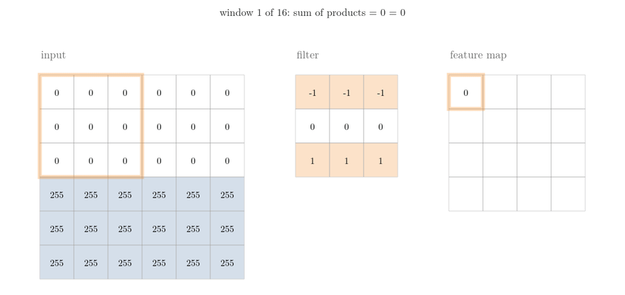
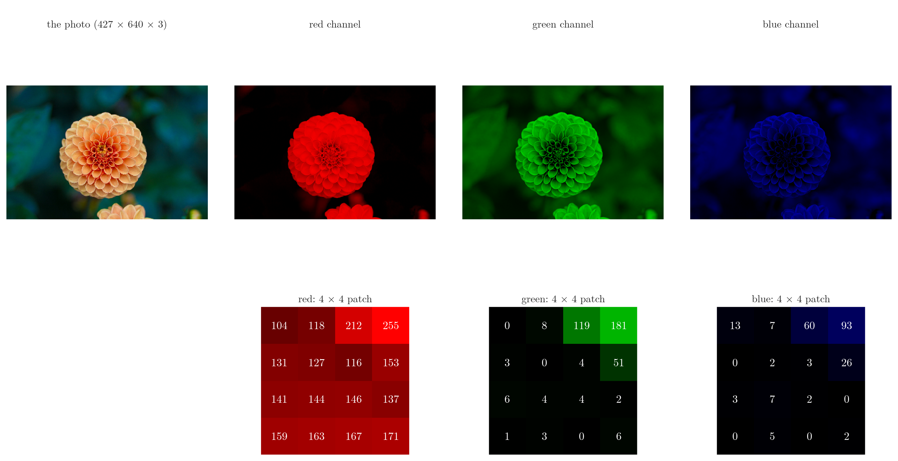
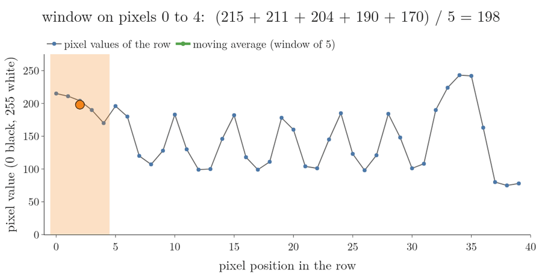
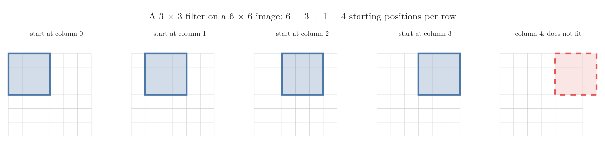
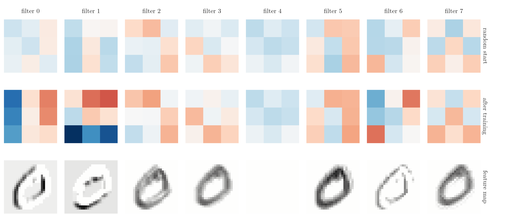

<!-- where-this-fits: generated by course_map/build_map.py; edit concepts.yaml, not this block -->
> **Where this fits:** Pipeline map step 8 (Model). See the [Course map](../../../00-course-map/00-course-map.md).
>
> 
>
> - **Leads to:** [Padding and strides](../../../DL/04-cnn/DL-043-padding-and-strides/DL-043-padding-and-strides.md#4-zero-padding); [Pooling](../../../DL/04-cnn/DL-044-pooling/DL-044-pooling.md#4-max-pooling); [CNN architecture (LeNet-5)](../../../DL/04-cnn/DL-045-lenet-5/DL-045-lenet-5.md#3-the-general-cnn-architecture); [Convolutional neural network (CNN)](../../../DL/04-cnn/DL-046-cnn-vs-ann/DL-046-cnn-vs-ann.md#1-overview); [Backpropagation in a CNN](../../../DL/04-cnn/DL-048-backpropagation-cnn-layers/DL-048-backpropagation-cnn-layers.md#1-overview); [Visualising what a CNN learns](../../../DL/04-cnn/DL-052-visualizing-cnn/DL-052-visualizing-cnn.md#3-two-things-to-look-at).
<!-- /where-this-fits -->

## 1. Overview

> **Key point:** A convolution slides a small grid of numbers, the filter, over an image. At each position it multiplies the filter and the pixels under it cell by cell and adds the products. The numbers it writes out form a new grid, the feature map, which is large wherever the image contains the pattern the filter looks for.

A **convolutional neural network** (G-484; CNN) is built from three kinds of layers: convolution layers, pooling layers (which shrink a feature map) and fully connected layers (ordinary ANN layers) (see the [CNN intuition](../DL-040-cnn-intuition/DL-040-cnn-intuition.md#3-what-makes-a-network-a-cnn)). The **convolution layer** (G-480) is the one that gives the network its name, and the one that finds features such as edges.

{width=100% height=55%}

Figure 1 shows the whole **convolution operation** (G-481) on a tiny image. This Note covers:

- how images are stored (section 3);
- the sliding window on a list and on a photo: averaging, blur and edges (section 4);
- what an edge is (section 5);
- the convolution step by step (section 6);
- the size of the result (section 7);
- why the filter values are learned (section 8);
- positive and negative values, and ReLU (section 9);
- colour images and many filters (sections 10 and 11).

## 2. Prerequisites

- The [CNN intuition](../DL-040-cnn-intuition/DL-040-cnn-intuition.md#41-an-image-is-a-grid-of-numbers): an image is a grid of pixel values, and the first layers of a CNN look for edges.
- The [MNIST ANN](../../01-basics/DL-012-mnist-ann/DL-012-mnist-ann.md#3-scaling-the-pixels): the MNIST digits and scaling pixels to 0–1.
- The [activation functions](../../02-training/DL-027-activation-functions/DL-027-activation-functions.md#8-relu): ReLU.
- The [backpropagation](../../01-basics/DL-015-backpropagation-what/DL-015-backpropagation-what.md#4-the-steps-of-backpropagation): how weights are learned.

## 3. How images are stored

> **Key point:** A greyscale image is one grid of numbers, one per pixel. A colour image is three such grids stacked, one each for red, green and blue: three channels.

### 3.1 Greyscale images

> **Key point:** One channel. Each pixel holds a number from 0 (black) to 255 (white), often scaled to 0–1.

An **MNIST** (G-1249; a set of handwritten-digit images) digit is a grid of 28 × 28 **pixels** (G-1501), and each pixel holds one number between 0 and 255 (see the [CNN intuition](../DL-040-cnn-intuition/DL-040-cnn-intuition.md#41-an-image-is-a-grid-of-numbers) for a digit drawn as its numbers). In MNIST, 0 means black, the background, and 255 means white, the ink. We often divide by 255 to bring the values into the range 0 to 1, as in the [MNIST ANN](../../01-basics/DL-012-mnist-ann/DL-012-mnist-ann.md#3-scaling-the-pixels).

To the computer, a greyscale image is just a 2D array of numbers. Every operation on the image is an operation on that array.

### 3.2 Colour (RGB) images

> **Key point:** Three channels, red, green and blue, each a greyscale-like grid of 0–255. Shape: height × width × 3.

A colour image stores three grids of the same size, one for each primary colour: **red, green and blue** (RGB). Mixing the three intensities gives every other colour. Each grid is called a **channel** (G-375), and each holds values from 0 to 255.

So a colour image has shape height × width × 3. The only difference between a greyscale and an RGB image is the number of channels: one against three.



Figure 2 takes a colour photo of 427 × 640 pixels apart. Each channel is a grid of the same size; drawn on its own, it looks like a greyscale image in one colour. The orange flower is bright in the red channel (values up to 255 in the patch), dimmer in the green one and almost black in the blue one, while the blue-green leaves are the reverse. Mixed back together, the three numbers of each pixel give its colour.

## 4. A sliding window, first on a list

> **Key point:** Slide a small window of weights along a list of numbers. At each position, multiply each weight by the number under it and add the products. With five weights of 1/5 the result is a moving average: a smoothed copy of the list. Convolution on an image is the same sliding window in two dimensions.

### 4.1 A moving average

> **Key point:** A window of five weights of 1/5 replaces each run of five numbers by their average. Sharp jumps are smoothed out.

Take one row of pixels from a greyscale photo of a staircase (SciPy's `ascent` image, shown in full in Figure 5): the first 40 pixels of row 100. The values jump up and down as the row crosses bright and dark stripes (Figure 3, grey line).

Now lay a window over the first five pixels, average them, and write the result down. Move the window one pixel to the right and repeat. The list of averages is called a **moving average** (G-2267).

{width=95%}

1. **In words:** multiply each of the five pixels under the window by 1/5 and add the five products.
2. **Formula:** for pixel values $x_0, x_1, \dots$ and weights $w_0, \dots, w_4$, all equal to $\frac{1}{5}$, the output at position $k$ is
   $$z_k = \sum_{m=0}^{4} w_m\thinspace x_{k+m}$$
   The symbol $\sum$ means "add up": for $m = 0, 1, 2, 3, 4$ it adds the five products $w_m x_{k+m}$, each weight times the pixel under it.
3. **Example:** the first five pixels are 215, 211, 204, 190 and 170, so:

   $$z_0 = (215 + 211 + 204 + 190 + 170)/5$$

   $$z_0 = 990/5 = 198$$

   One step to the right, the window covers 211, 204, 190, 170 and 196, and $z_1 = 194.2$.

In Figure 3, watch the green line: it follows the grey one but without its sharp teeth. The largest jump between two neighbouring pixels is 83; between two neighbouring averages it is 33.

The small list of weights is the **kernel**, or **filter** (G-777). The operation, slide, multiply, add, is the **convolution operation** (G-481) in one dimension. Nothing else changes when we move to images.

### 4.2 The same window on an image: blur, then edges

> **Key point:** On an image the kernel is a small grid. If its weights add up to 1, each output pixel is an average of its neighbours and the image blurs. If they add up to 0, flat regions give 0 and only changes in brightness survive: the kernel finds edges.

An image is a grid, so the kernel becomes a small grid too, and it slides both across and down. Figure 4 applies four kernels to the same 64 × 64 piece of the photo.

{width=100%}

1. **Box blur:** nine weights of 1/9. Each pixel becomes the average of its 3 × 3 neighbourhood, the moving average of section 4.1 in two dimensions. The stripes soften.
2. **Gaussian blur:** a 5 × 5 kernel whose weights are largest in the centre and small at the rim. Each output pixel is still an average, but one that favours the centre pixel; the blur looks smoother, like a lens out of focus.
3. **Vertical-edge kernel:** $-1$ in the left column, $+1$ in the right column. The output is the right side of the window minus the left side.
4. **Horizontal-edge kernel:** the same kernel turned by 90 degrees: the bottom of the window minus the top.

What a kernel does can be read from the sum of its weights:

- **Sum 1: an average.** On a flat patch where every pixel is 180, a blur kernel returns 180: the patch is unchanged, and only sharp detail is smoothed.
- **Sum 0: a difference.** On the same flat patch an edge kernel (weights add up to 0) returns 0, because every pixel is multiplied by weights that cancel. The kernel gives a large value only where the brightness changes across the window.

The photo gives a real example. One nearly flat 3 × 3 patch of it holds the values 101, 101, 99, 100, 100, 100, 101, 101, 101. The box blur returns their average, 100.4. The vertical-edge kernel returns right column minus left column:

$$99 + 100 + 101 = 300$$

$$101 + 100 + 101 = 302$$

$$300 - 302 = -2$$

This is almost 0: no edge here (the script `images/kernel_gallery.py` prints the patch and checks both rules).

Blur is useful in photo editing. A CNN mostly needs the second kind of kernel, the kind that responds to change. Section 5 looks at what such a change is, and section 6 works through an edge kernel by hand.

## 5. Edges are changes in intensity

> **Key point:** An edge is a place where the brightness changes sharply, from dark to light or light to dark. A filter that compares neighbouring pixels finds it.

Any image is made up of edges: the outline of a face, the side of a building, the stroke of a digit. The first layers of a CNN detect edges, the most basic features of an image (see the [CNN intuition](../DL-040-cnn-intuition/DL-040-cnn-intuition.md#51-breaking-a-9-into-features)).

An **edge** (G-661) is a change in intensity. Where a black region meets a white one, the pixel values jump from 0 to 255. Our eyes see the edge at once; an algorithm must find where the numbers change, and the convolution operation does exactly that.

{width=100%}

Figure 5 shows the result on a real photo. One filter finds the vertical edges, another finds the horizontal ones. Other filters find slanted edges. Section 6 shows how, number by number.

## 6. The convolution operation

> **Key point:** Place the filter on the top-left corner, multiply each filter value by the pixel under it, add the products, write the sum. Slide one pixel right and repeat; at the end of a row, go back left and one pixel down.

### 6.1 Filter and feature map

> **Key point:** The filter (or kernel) is a small matrix, usually 3 × 3. Convolving it with the image gives the feature map.

Three objects take part:

- the **image**, the input;
- the **filter** (G-777), also called the **kernel**: a small matrix of numbers, usually 3 × 3 but sometimes larger;
- the **feature map** (G-766): the output grid of the convolution.

The filter we use is a **horizontal-edge detector** (an **edge detector**, G-659), the fourth kernel of Figure 4:

$$K = \begin{bmatrix} -1 & -1 & -1 \cr0 & 0 & 0 \cr1 & 1 & 1 \end{bmatrix}$$

The filter subtracts the row above from the row below. Its weights add up to 0, so where the two rows are equal it gives 0 (the rule of section 4.2); where the lower row is brighter it gives a large number. The symbol $\ast$ denotes convolution: image $\ast$ filter = feature map.

### 6.2 One step

> **Key point:** One position of the filter gives one number: the sum of 9 products.

1. **In words:** lay the filter on a 3 × 3 window of the image, multiply each pair of overlapping numbers, and add the 9 products.
2. **Formula:** the value at row $i$, column $j$ of the feature map $Z$, for an image $X$ and a 3 × 3 filter $K$ (rows and columns counted from 0):
   $$Z_{ij} = \sum_{m=0}^{2}\sum_{n=0}^{2} X_{i+m,\thinspace j+n}\thinspace K_{mn}$$
   Here $i, j$ is the window's top-left corner in the image, $m, n$ count the filter's row and column from 0 to 2, $X_{i+m,\thinspace j+n}$ is the image pixel under the filter cell $K_{mn}$, and $\sum$ means "add up". The two sums together add the 9 products.
3. **Example:** the 6 × 6 image of Figure 1 has three rows of 0 (black) on top of three rows of 255 (white). With the filter on rows 1–3 ($i = 1$), its top row meets 0s, its middle row meets 0s and its bottom row meets 255s. Each filter row, three products and their sum:
   $$\text{top row: } (-1)(0) + (-1)(0) + (-1)(0) = 0$$
   $$\text{middle row: } (0)(0) + (0)(0) + (0)(0) = 0$$
   $$\text{bottom row: } (1)(255) + (1)(255) + (1)(255) = 765$$
   $$Z_{10} = 0 + 0 + 765 = 765$$

### 6.3 Sliding over the whole image

> **Key point:** 16 positions on a 6 × 6 image give a 4 × 4 feature map: 0, then two rows of 765, then 0. The large values mark exactly where the edge is.

The filter moves one pixel to the right at a time. At the end of a row it returns to the left and moves one pixel down. Every position gives one number (Figure 1). Rows are counted from 0, as in section 6.2:

- **Row 0** of the feature map (filter on image rows 0–2): all pixels are 0, so every sum is 0.
- **Rows 1 and 2** (filter on rows 1–3 and 2–4; row 1 holds the $Z_{10} = 765$ of section 6.2): the bottom of the filter sits on white pixels and the top on black or on the boundary, so each sum is $765$:

  $$3 \times 255 = 765$$
- **Row 3** (filter on rows 3–5): all pixels are 255. The top row gives $-765$, the bottom row $+765$, and they cancel to 0.

  Image:

  $$\begin{bmatrix} 0&0&0&0&0&0\cr0&0&0&0&0&0\cr0&0&0&0&0&0\cr255&255&255&255&255&255\cr255&255&255&255&255&255\cr255&255&255&255&255&255 \end{bmatrix}$$

  Filter:

  $$\begin{bmatrix} -1&-1&-1\cr0&0&0\cr1&1&1 \end{bmatrix}$$

  Feature map, image $\ast$ filter:

  $$\begin{bmatrix} 0&0&0&0\cr765&765&765&765\cr765&765&765&765\cr0&0&0&0 \end{bmatrix}$$

The feature map is 0 in flat regions and large along the band where black meets white: it has found the horizontal edge. Shown as an image, it is a bright stripe across the middle.

> **Python:** The convolution in a few lines of NumPy. `X[i:i+3, j:j+3]` cuts out the 3 × 3 window; `*` multiplies cell by cell; `.sum()` adds.
>
> ```python
> def conv2d(X, K):
>     n_r = X.shape[0] - K.shape[0] + 1
>     n_c = X.shape[1] - K.shape[1] + 1
>     Z = np.zeros((n_r, n_c))
>     for i in range(n_r):
>         for j in range(n_c):
>             window = X[i:i + K.shape[0], j:j + K.shape[1]]
>             Z[i, j] = (window * K).sum()
>     return Z
> ```

The Notebook loads the same filter into a Keras `Conv2D` (G-72) layer: it returns exactly the same 4 × 4 numbers (largest difference 0).

### 6.4 Other filters find other edges

> **Key point:** Turn the filter by 90 degrees and it finds vertical edges. Changing the numbers changes the feature the filter looks for.

The **transpose** (G-2012; rows become columns) of the horizontal filter,

$$K_v = \begin{bmatrix} -1 & 0 & 1 \cr-1 & 0 & 1 \cr-1 & 0 & 1 \end{bmatrix}$$

compares the column on the right with the column on the left, so it is a **vertical-edge detector**. On our 6 × 6 image, which has no vertical edge, it gives a feature map of all 0s (Notebook). On the photo of Figure 5 it lights up the railings. With other values we get filters for slanted edges, or for edges with the dark side on the left, right, top or bottom.

> **Extra:** Strictly, mathematicians call this operation **cross-correlation** (G-508). A true convolution first flips the kernel upside down and left to right. On two short lists the flip is easy to see: the true convolution of 1, 2, 3 with 4, 5, 6 turns the second list round to 6, 5, 4, slides it across the first, and gives 4, 13, 28, 27, 18 (NumPy's `np.convolve`). Most deep learning libraries compute the cross-correlation and call it convolution (Goodfellow et al. 2016, §9.1). The Notebook confirms it for Keras: `Conv2D` gives $+765$ where the flipped filter would give $-765$. Because the filter values are learned (section 8), the difference does not matter: training would simply learn the flipped filter.

## 7. The size of the feature map

> **Key point:** An $n \times n$ image convolved with an $f \times f$ filter gives an $(n - f + 1) \times (n - f + 1)$ feature map.

The filter must fit inside the image. Along one row it can start at positions $0, 1, \dots, n - f$: that is $n - f + 1$ positions. The same holds down the columns.



Figure 6 shows the four positions along one row. Each position gives one number of the feature map, so each row of the map has 4 numbers.

1. **In words:** the feature map is smaller than the image by the filter size minus 1.
2. **Formula:**
   $$\text{output size} = n - f + 1$$
3. **Example:** a 6 × 6 image and a 3 × 3 filter:

   $$6 - 3 + 1 = 4$$

   The feature map is 4 × 4. An MNIST digit, 28 × 28, with a 3 × 3 filter:

   $$28 - 3 + 1 = 26$$

   A 64 × 64 image gives 62 × 62.

The Notebook checks the formula against Keras for three image sizes and two filter sizes:

| Image $n$ | Filter $f$ | $n - f + 1$ | Keras `Conv2D` output |
|---|---|---|---|
| 6 | 3 | 4 | 4 |
| 6 | 5 | 2 | 2 |
| 28 | 3 | 26 | 26 |
| 28 | 5 | 24 | 24 |
| 64 | 3 | 62 | 62 |
| 64 | 5 | 60 | 60 |

The [padding and strides](../DL-043-padding-and-strides/DL-043-padding-and-strides.md#42-the-formula-with-padding) extends the formula to padded images and to filters that jump more than one pixel.

## 8. Filters are learned, not designed

> **Key point:** In a CNN the filter values are weights. They start random and backpropagation sets them, so the network builds the filters its task needs.

People have designed many filters by hand: left, right, top and bottom edge detectors and others. A CNN does not need them. In deep learning we only choose the filter size and the number of filters; the values start random and are learned during training by **backpropagation** (G-247), exactly like the weights of an ANN (see the [backpropagation](../../01-basics/DL-015-backpropagation-what/DL-015-backpropagation-what.md#4-the-steps-of-backpropagation)). The values that come out depend on the training data. Learning its own filters, instead of relying on hand-made ones, is one of the main reasons CNNs became so successful.

The Notebook shows this happening. A small CNN with one convolution layer of 8 filters (3 × 3), followed by Flatten (turns the grid of numbers into one long list) and a softmax output layer (one probability per digit), trains for 2 epochs on MNIST and reaches 96.7% test accuracy.

{width=100%}

In Figure 7 nobody told the network what to look for, yet filter 0 has turned negative on its left column and positive on its right: a vertical-edge detector, and its feature map marks the left and right sides of the 0. Filter 1 has become positive on top and negative at the bottom, a horizontal-edge detector, and it marks the top and bottom of the 0. Filter 4 ended with all values negative; on this digit, whose pixels are all 0 or more, its map is empty after ReLU.

> **Extra:** Each filter of a `Conv2D` layer also has one bias, added to every value of its feature map before the activation, just as each node of a `Dense` layer has one bias (Keras documentation, `Conv2D`). The [CNN vs ANN](../DL-046-cnn-vs-ann/DL-046-cnn-vs-ann.md#51-counting-the-parameters-of-a-convolution-layer) counts these parameters.

## 9. Positive and negative values, and ReLU

> **Key point:** A feature map has positive values where the filter's pattern is present and negative values where its opposite is. ReLU keeps only the positive ones.

Take a **left-edge filter**: positive on its left column, negative on its right, so it gives a large positive value where the image is bright on the left and dark on the right.

$$K_{\text{left}} = \begin{bmatrix} 1 & 0 & -1 \cr1 & 0 & -1 \cr1 & 0 & -1 \end{bmatrix}$$

{width=100%}

On a handwritten 0 (Figure 8, middle), the red values are the places where the filter finds its left edge: the stroke is bright and the background on its right is dark. The blue values are the opposite edge, where the background is on the left: a right edge. The Notebook counts 136 clearly positive cells and 138 clearly negative ones (absolute value above 0.1).

In a CNN, the feature map goes through an activation function next, usually **ReLU** (G-1668), $\max(0, z)$ (see the [activation functions](../../02-training/DL-027-activation-functions/DL-027-activation-functions.md#8-relu)). Negative values become 0 and positive values stay. The activation is needed because a convolution, like a node, is only a weighted sum plus a bias: without a non-linear step, stacked convolution layers would [collapse into one linear layer](../../02-training/DL-027-activation-functions/DL-027-activation-functions.md#42-the-algebra-linear-layers-collapse). After ReLU (Figure 8, right) only the red left edges remain: the feature map now answers one question, "is there a left edge here?".

## 10. Convolution on colour images

> **Key point:** On a 3-channel image the filter has 3 channels too: 3 × 3 × 3 = 27 numbers. Each position still gives one number, so the feature map has 1 channel.

On an RGB image, a 3 × 3 filter is automatically a 3 × 3 × 3 filter: one 3 × 3 slice for each of the red, green and blue channels. Think of the image as a box of depth 3 and the filter as a small box of the same depth.

{width=85%}

The small box slides over the large one exactly as before (Figure 9, top). At each position it multiplies 27 pairs of numbers, 9 in each channel, and adds all 27 products into a single number. So the output has one channel.

1. **In words:** the filter covers all channels at once and sums over them, so one filter gives one single-channel feature map.
2. **Formula:** an $n \times n \times c$ image and an $f \times f \times c$ filter give
   $$(n - f + 1) \times (n - f + 1) \times 1$$
3. **Example:** a 6 × 6 × 3 image and a 3 × 3 × 3 filter give a 4 × 4 × 1 feature map. The Notebook checks that Keras' result equals convolving each channel separately with its slice of the filter and adding the three maps.

The number of channels of the filter always equals the number of channels of its input; we never choose it.

## 11. Many filters

> **Key point:** Each filter gives one feature map. With $k$ filters, the maps stack into a volume of depth $k$, which is the input of the next layer.

A convolution layer almost never uses a single filter. It may use one filter for vertical edges, one for horizontal edges, one for slanted edges, and so on. Each filter is convolved with the same image and gives its own feature map of the same size.

The maps are stacked into a volume (Figure 9, bottom):

| Input | Filters | Output |
|---|---|---|
| 6 × 6 × 3 | 1 of 3 × 3 × 3 | 4 × 4 × 1 |
| 6 × 6 × 3 | 2 of 3 × 3 × 3 | 4 × 4 × 2 |
| 6 × 6 × 3 | 10 of 3 × 3 × 3 | 4 × 4 × 10 |

The number of filters becomes the number of channels of the output. The Notebook gets these three shapes from Keras. The output volume works like an image with $k$ channels for the next convolution layer, whose filters then have depth $k$.

> **Python:** In Keras the number of filters and the filter size are the first two arguments of `Conv2D`; the depth of each filter follows from the input.
>
> ```python
> layer = keras.layers.Conv2D(10, 3)    # 10 filters, each 3 x 3
> layer(img[None]).shape                # img: 6 x 6 x 3
> # (1, 4, 4, 10): batch, height, width, channels
> ```

## 12. Summary

| Object | Shape | Meaning |
|---|---|---|
| Greyscale image | $n \times n \times 1$ | one number per pixel, 0 (black) to 255 (white) |
| RGB image | $n \times n \times 3$ | red, green and blue channels |
| Filter (kernel) | $f \times f \times c$ | learned weights; depth $c$ = input channels |
| Feature map | $(n - f + 1) \times (n - f + 1)$ | one per filter |
| Output of a layer with $k$ filters | $(n - f + 1) \times (n - f + 1) \times k$ | the maps stacked |

- Convolution: slide the filter, multiply cell by cell, add, write one number per position, so each number says how well the image under the filter matches the filter's pattern.
- A kernel whose weights add up to 1 averages (blur); one whose weights add up to 0 responds only to change (edges), because on a flat patch the weights either keep the value or cancel to 0.
- An edge is a change in intensity; edge filters give large values where the image changes and 0 where it is flat, so the feature map marks where the edges are.
- Output size $n - f + 1$, because the filter must fit inside the image; on a colour image one filter still gives one feature map, because it adds the products over all channels.
- Filter values are learned by backpropagation, like ANN weights; a small CNN on MNIST learned vertical- and horizontal-edge detectors on its own, so the network builds the filters its task needs.
- ReLU after the convolution keeps the positive responses only, so each feature map answers one question, such as "is there a left edge here?".

## 13. Sources

**Built from**

- CampusX, "CNN Part 3 | Convolution Operation", YouTube, https://www.youtube.com/watch?v=cgJx3GvQ5y8
- Sanderson, G. (3Blue1Brown), "But what is a convolution?", 2022, https://www.youtube.com/watch?v=KuXjwB4LzSA (the moving average, blur kernels and the sum-to-1 and sum-to-0 rule of section 4; the flip in true convolution)

**Other references**

- Goodfellow, I., Bengio, Y. and Courville, A. (2016). *Deep Learning*. MIT Press. Chapter 9, Convolutional Networks, §9.1 (the convolution operation, cross-correlation). deeplearningbook.org.
- Keras API documentation: `Conv2D` layer, keras.io/api/layers/convolution_layers/convolution2d.
- Stanford CS231n, Convolutional Neural Networks for Visual Recognition, course notes "Convolutional Neural Networks: Architectures, Convolution / Pooling Layers", cs231n.github.io/convolutional-networks.
- scikit-learn developers. `load_sample_image("flower.jpg")`, one of scikit-learn's two sample photos, photo by danielbuechele (Flickr), CC BY 2.0, as listed in `load_sample_images().DESCR`.
- SciPy `ascent` test image (public domain), from the scipy/dataset-ascent repository, used for Figures 3, 4 and 5.

## 14. Key terms

Terms taught in this Note come first; linked terms are recaps, taught in the Note the link opens.

| Term | Meaning |
|---|---|
| Convolution operation (G-481) | Sliding a small filter over an input and, at each position, multiplying cell by cell and adding up, so the output (a feature map) is large where the input contains the filter's pattern, such as an edge. |
| Moving average (G-2267) | The list of averages a sliding window gives: each output is the mean of the numbers under the window, so sharp jumps are smoothed out. |
| Filter (kernel) (G-777) | A small grid of weights slid over the image; at each position it multiplies and adds, so it responds strongly where its pattern (such as an edge) appears and produces a feature map. Its depth equals the input's number of channels. |
| Edge (G-661) | In an image, a place where the intensity changes sharply, such as where a dark region meets a light one. Finding edges is the first job of a CNN's filters. |
| Feature map (CNN) (G-766) | The grid of numbers a filter produces; large where the filter's pattern is present. |
| Edge detector (filter) (G-659) | A filter whose feature map is large along edges of one direction. |
| `Conv2D` (G-72) | The Keras layer that performs 2D convolution, `Conv2D(filters, kernel_size)`: it slides learned filters over an image and outputs one feature map per filter. |
| Cross-correlation (G-508) | The slide, multiply and add of a CNN filter done without first flipping the filter; a true convolution flips it. Most deep learning libraries compute cross-correlation and call it convolution, which does not matter because the filter values are learned. |
| [Convolutional neural network (CNN)](../../../DL/04-cnn/DL-040-cnn-intuition/DL-040-cnn-intuition.md#1-overview) (G-484) | A neural network that slides small filters over its input to find patterns such as edges, using at least one convolutional layer; the standard network for images. |
| [Convolution layer](../../../DL/04-cnn/DL-040-cnn-intuition/DL-040-cnn-intuition.md#3-what-makes-a-network-a-cnn) (G-480) | A layer that slides small filters over its input to find features. |
| [MNIST](../../../ML/03-feature-engineering/ML-022-what-is-feature-engineering/ML-022-what-is-feature-engineering.md#81-pixels-as-columns-the-mnist-dataset) (G-1249) | A dataset of about 70,000 handwritten-digit images of 28 × 28 pixels. |
| [Pixel](../../../ML/01-foundations/ML-010-tensors/ML-010-tensors.md#64-4d-images) (G-1501) | One dot of an image, stored as one or more numbers. |
| [Channel](../../../ML/01-foundations/ML-010-tensors/ML-010-tensors.md#64-4d-images) (G-375) | One colour layer of an image (red, green or blue). |
| [Transpose](../../../ML/06-regression/ML-053-multiple-lr-maths/ML-053-multiple-lr-maths.md#41-two-rules-about-transposes) (G-2012) | A matrix or vector with rows and columns swapped; it turns a column vector $u$ into a row $u^{\mathsf T}$, so $u^{\mathsf T}x$ is the dot product. |
| [Backpropagation](../../../DL/01-basics/DL-015-backpropagation-what/DL-015-backpropagation-what.md#1-overview) (G-247) | The algorithm that computes the gradient of the loss with respect to every weight and bias by applying the chain rule backward from the output; gradient descent then uses these gradients to train the network. |
| [ReLU](../../../DL/02-training/DL-027-activation-functions/DL-027-activation-functions.md#8-relu) (G-1668) | Rectified linear unit, the activation $\max(0, z)$: it passes a positive input unchanged and turns a negative one into 0; the usual default activation for hidden layers. |
