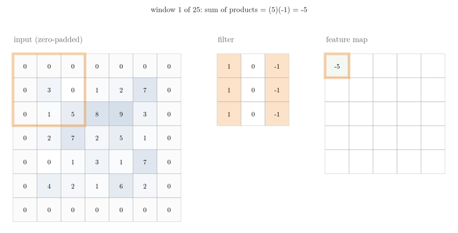
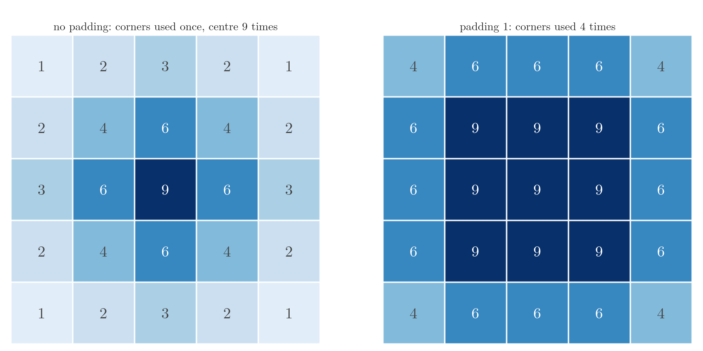
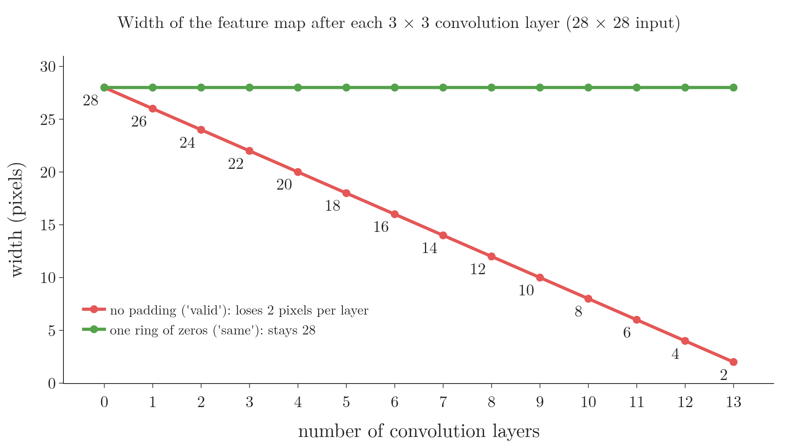
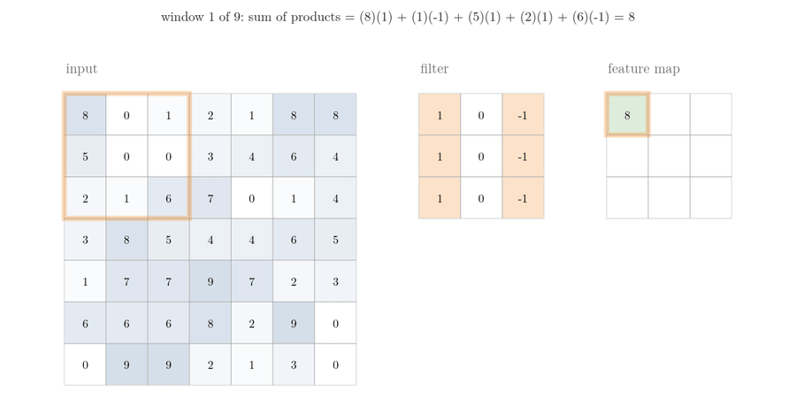
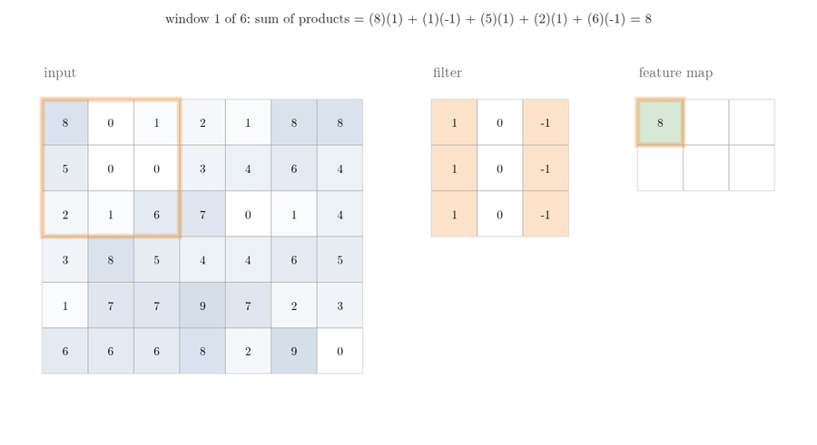
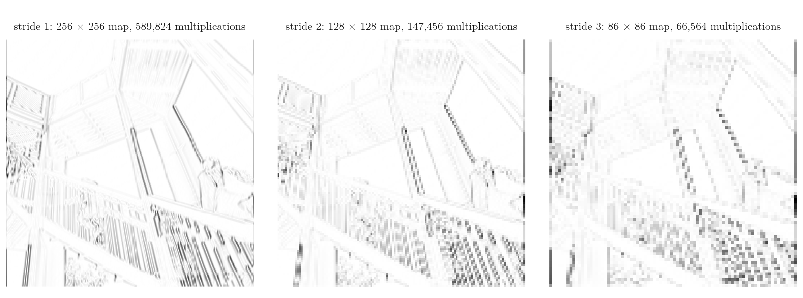

<!-- where-this-fits: generated by course_map/build_map.py; edit concepts.yaml, not this block -->
> **Where this fits:** Pipeline map step 8 (Model). See the [Course map](../../../00-course-map/00-course-map.md).
>
> 
>
> - **Builds on:** [Convolution operation and feature maps](../../../DL/04-cnn/DL-042-convolution-operation/DL-042-convolution-operation.md#6-the-convolution-operation).
> - **Leads to:** [CNN architecture (LeNet-5)](../../../DL/04-cnn/DL-045-lenet-5/DL-045-lenet-5.md#3-the-general-cnn-architecture).
<!-- /where-this-fits -->

## 1. Overview

> **Key point:** Padding adds a border of zeros around the image so that convolution keeps the image's size and uses the border pixels as often as the others. A stride larger than 1 makes the filter jump several pixels at a time, which shrinks the feature map and the amount of work.

A plain convolution (see [sliding over the whole image](../DL-042-convolution-operation/DL-042-convolution-operation.md#63-sliding-over-the-whole-image)) has two side effects: the **feature map** (G-766) is smaller than the image, and pixels near the border take part in fewer positions of the **filter** (G-777) than pixels in the middle. **Padding** (G-1436) fixes both. **Strides** (G-1900) do the opposite of padding on purpose: they make the output smaller.

{width=100% height=55%}

Figure 1 shows convolution with padding. This Note covers:

- the two problems of plain convolution (section 3);
- zero padding, its formula, and Keras' `valid` and `same` (section 4);
- strides and their formula (section 5);
- why strides are used (section 6).

## 2. Prerequisites

- The [size of the feature map](../DL-042-convolution-operation/DL-042-convolution-operation.md#7-the-size-of-the-feature-map): for an image $n \times n$ pixels and a filter $f \times f$, the feature map is $(n - f + 1) \times (n - f + 1)$. Also the [filter and feature map](../DL-042-convolution-operation/DL-042-convolution-operation.md#61-filter-and-feature-map) themselves.

## 3. Two problems of plain convolution

> **Key point:** Each convolution shrinks the image, so stacked layers lose information quickly. And border pixels are covered by fewer filter positions than central ones, so they have less say in the feature map.

### 3.1 The image shrinks

> **Key point:** $n - f + 1 < n$: every convolution layer makes the image smaller.

Here $n$ is the side of the image and $f$ the side of the filter. A 5 × 5 image ($n = 5$) and a 3 × 3 filter ($f = 3$) give a 3 × 3 feature map:

$$5 - 3 + 1 = 3$$

A second convolution layer on that map shrinks it again, to 1 × 1. Each layer loses part of the image, so the number of convolution layers we can stack is limited.

On MNIST-sized images, three convolution layers with 3 × 3 filters go from 28 × 28 to 26 × 26, 24 × 24 and 22 × 22 (Notebook).

### 3.2 Border pixels count less

> **Key point:** A corner pixel lies under the filter once; the centre pixel of a 5 × 5 image lies under it 9 times.

Count, for every pixel, how many positions of the filter cover it. Figure 2 (left) shows the counts for a 5 × 5 image and a 3 × 3 filter.

{width=85%}

The corner pixels take part in only one convolution, while the centre pixel takes part in 9. So the middle of the image has more say in the feature map, and information at the border is under-used (Goodfellow et al. 2016, §9.5). If the important part of an image lies near its edge, a plain convolution partly misses it.

## 4. Zero padding

> **Key point:** Add $p$ rows and columns of zeros on every side. A 3 × 3 filter with $p = 1$ keeps the size: $n + 2p - f + 1 = n$.

### 4.1 What padding does

> **Key point:** We do not change the filter; we enlarge the image with a border of zeros.

We want the feature map to have the same size as the image: $n - f + 1 = n$. We cannot change the filter size, so we change the image. **Padding** adds rows and columns around the image, on the top, bottom, left and right. The added pixels are almost always 0, so the method is called **zero padding** (G-2146).

For a 5 × 5 image and a 3 × 3 filter, one ring of zeros turns the image into 7 × 7. The filter then fits in 5 positions per row:

$$7 - 3 + 1 = 5$$

The feature map is 5 × 5, the size of the original image (Figure 1).

Padding also fixes the second problem: with one ring of zeros, the corner pixels are covered 4 times instead of once (Figure 2, right).



Figure 3 shows the difference over many layers. Without padding, each layer takes 2 pixels off the width: 28, 26, 24, and after 13 layers only 2 × 2 is left. With one ring of zeros, every layer keeps 28 × 28, so we can stack as many layers as we like.

### 4.2 The formula with padding

> **Key point:** Padding $p$ adds $2p$ to the image size: output $= n + 2p - f + 1$.

1. **In words:** padding adds $p$ pixels on each side, so the image grows by $2p$ before we apply the usual $n - f + 1$.
2. **Formula:**
   $$\text{output size} = n + 2p - f + 1$$
3. **Example:** $n = 5$, $f = 3$, $p = 1$:

   $$5 + 2 - 3 + 1 = 5$$

   The size is kept.

To keep the size we need $2p = f - 1$, so:

$$p = (f - 1)/2$$

That is one ring for a 3 × 3 filter, two for a 5 × 5 filter (CS231n notes).

### 4.3 `valid` and `same` in Keras

> **Key point:** `padding="valid"` (the default) means no padding; `padding="same"` lets Keras add just enough zeros to keep the size.

Keras' `Conv2D` layer has two padding options (Keras documentation):

- **`valid`** (G-155): no padding. The filter visits only positions where it fits inside the image. The output shrinks by $f - 1$.
- **`same`** (G-139): Keras works out how much padding is needed and adds it evenly on the sides, so that with stride 1 the output has the same size as the input.

> **Python:** The same three convolution layers, once with each padding option.
>
> ```python
> keras.layers.Conv2D(32, 3, padding="valid", activation="relu")
> keras.layers.Conv2D(32, 3, padding="same", activation="relu")
> ```

With 32 filters of 3 × 3 in each of three layers, on a 28 × 28 × 1 input (Notebook):

| Padding | After layer 1 | After layer 2 | After layer 3 |
|---|---|---|---|
| `valid` | 26 × 26 | 24 × 24 | 22 × 22 |
| `same` | 28 × 28 | 28 × 28 | 28 × 28 |

With `same` no layer loses size, however many we stack.

## 5. Strides

> **Key point:** The stride is how many pixels the filter moves at each step. Stride 1 is the default; with stride 2 the filter skips every other position, and the feature map is about half as wide and half as tall.

### 5.1 What a stride is

> **Key point:** Stride $(s, s)$: move $s$ pixels right, and at the end of a row, $s$ pixels down.

So far the filter has moved one pixel to the right, and one pixel down at the end of each row. That step is the **stride**, here 1 × 1. We can make the step bigger.

{width=100% height=55%}

With stride 2 the filter starts at the top-left as usual, then jumps two pixels to the right, then two more (Figure 4). At the end of the row it comes down two pixels. A convolution with a stride larger than 1 is called a **strided convolution** (G-1901).

### 5.2 The formula with strides

> **Key point:** Output $= \left\lfloor \dfrac{n + 2p - f}{s} \right\rfloor + 1$, where $\lfloor\ \rfloor$ means round down.

The filter can start at positions $0, s, 2s, \dots$ as long as it still fits. The padded image leaves $n + 2p - f$ pixels of room, and each step uses up $s$ of that room. So the number of whole steps is the room divided by $s$, rounded down, and the starting position adds one more (Dumoulin and Visin 2016, Relationship 6). The result is the general **output-size formula** (G-1427).

1. **In words:** the room left for the filter, divided by the step, rounded down, plus one for the first position.
2. **Formula:**
   $$\text{output size} = \left\lfloor \frac{n + 2p - f}{s} \right\rfloor + 1$$
3. **Example:** $n = 7$, $f = 3$, $s = 2$, no padding:

   $$\frac{7 - 3}{2} + 1 = 2 + 1$$

   $$\frac{7 - 3}{2} + 1 = 3$$

   This is a 3 × 3 feature map (Figure 4). With padding 1:

   $$\frac{7 + 2 - 3}{2} + 1 = 3 + 1$$

   $$\frac{7 + 2 - 3}{2} + 1 = 4$$

   This is a 4 × 4 map. Even with padding, stride 2 makes the feature map smaller than the image.

With $s = 1$ the formula becomes $n + 2p - f + 1$ again, and with $p = 0$ as well, $n - f + 1$.

### 5.3 When the filter does not fit: round down

> **Key point:** If the last jump would push the filter past the edge, that position is skipped. Rounding down in the formula does exactly this.

Take an image of 6 rows and 7 columns, a 3 × 3 filter and stride 2. Along a row, the filter fits at columns 0, 2 and 4: three positions. Down the columns it fits at rows 0 and 2. The next jump would start at row 4 and need rows 4, 5 and 6, but row 6 does not exist, so that position is skipped. The feature map is 2 × 3.

{width=100% height=55%}

In Figure 5, watch the last frame: the dashed red box sticks out below the image, so that position is never computed, and the bottom row of pixels is used by no window at all.

The formula gives the same answer only if we round down:

Rows:

$$\frac{6 - 3}{2} + 1 = 1.5 + 1$$

$$\lfloor 1.5 \rfloor + 1 = 2$$

Columns:

$$\frac{7 - 3}{2} + 1 = 2 + 1$$

$$\frac{7 - 3}{2} + 1 = 3$$

A fraction means the last step has too few pixels; rounding down drops that step.

The Notebook checks the formula against TensorFlow for 1,254 combinations of image size (5 to 32), filter size (1 to 7), padding (0 to 2) and stride (1 to 3): it matches in all 1,254.

### 5.4 Strides in Keras

> **Key point:** `strides=(2, 2)` in `Conv2D`. Three such layers with `same` padding take 28 × 28 to 14 × 14, then 7 × 7, then 4 × 4.

> **Python:** Stride 2 in both directions. The two numbers can differ, for example `(2, 1)` for 2 pixels down and 1 pixel across.
>
> ```python
> keras.layers.Conv2D(32, 3, strides=(2, 2), padding="same",
>                     activation="relu")
> ```

Three such layers on a 28 × 28 input give 14 × 14, 7 × 7 and 4 × 4 (Notebook). The formula with $p = 1$ explains the first:

$$\left\lfloor \frac{28 + 2 - 3}{2} \right\rfloor + 1$$

$$\lfloor 13.5 \rfloor + 1 = 14$$

The next two work the same way:

$$\lfloor 6.5 \rfloor + 1 = 7$$

$$\lfloor 3 \rfloor + 1 = 4$$

The image loses size quickly.

## 6. Why use strides

> **Key point:** Two reasons: we may want only the coarse, high-level features, and fewer positions mean less computation. Today the second reason matters less, and stride 1 is the usual choice.

A large stride makes the filter skip information. That is useful in two situations:

1. **Only high-level features are needed.** With stride 1 the filter visits every position and captures fine, low-level detail. With stride 2 or 3 it samples the image more coarsely, so fine detail is lost and the coarser features remain (Goodfellow et al. 2016, §9.5: we skip positions "at the expense of not extracting our features as finely").
2. **Less computation.** Fewer positions mean fewer multiplications, so training is faster. For a 224 × 224 image and one 3 × 3 filter with padding 1, stride 1 needs 451,584 multiplications, stride 2 needs 112,896 (a quarter) and stride 3 needs 50,625 (Notebook).



Figure 6 shows both reasons on a real photo. The filter is a [vertical-edge filter](../DL-042-convolution-operation/DL-042-convolution-operation.md#64-other-filters-find-other-edges): a small table of numbers that responds strongly where the brightness changes from left to right.

- **Detail.** At stride 1 the thin railings are separate lines. At stride 3 the map has 86 × 86 positions, and the railings blur into blocks: only the coarse edges survive.
- **Computation.** The multiplications fall from 589,824 at stride 1 to 147,456 at stride 2 (a quarter) and 66,564 at stride 3 (about a ninth).

The second reason mattered more when computers were slower. With today's computing power, networks are usually trained with stride 1, and strides are kept for particular problems.

> **Extra:** On a [colour image](../DL-042-convolution-operation/DL-042-convolution-operation.md#10-convolution-on-colour-images) or on a volume of feature maps, padding adds zeros around every channel (one of the stacked 2D layers, such as red, green and blue), and the stride moves the whole $f \times f \times c$ filter across the height and width, never through the depth. The output-size formula therefore applies to the height and width only (CS231n notes).

## 7. Summary

| Setting | Effect | Output size |
|---|---|---|
| No padding, stride 1 (`valid`) | shrinks by $f - 1$; border pixels under-used | $n - f + 1$ |
| Padding $p$, stride 1 | $p = (f-1)/2$ keeps the size (`same`) | $n + 2p - f + 1$ |
| Padding $p$, stride $s$ | skips positions; output about $n/s$ | $\lfloor (n + 2p - f)/s \rfloor + 1$ |

- Plain convolution shrinks the image and under-uses the border pixels, so stacked layers lose size quickly and a feature near the edge is partly missed.
- Zero padding adds a border of zeros; with `padding="same"` and stride 1, Keras keeps the size, so we can stack as many layers as we like and the border pixels are covered more often.
- The stride is the step of the filter; stride 2 roughly halves the height and width, because the filter visits only every other position.
- Round down when the division is not exact: the last, incomplete position is skipped.
- Strides are used to keep only coarse features or to save computation, because skipped positions lose fine detail and need no multiplications; with today's computers stride 1 is the usual choice.

## 8. Sources

**Built from**

- CampusX, "Padding & Strides in CNN | CNN Lecture 4 | Deep Learning", YouTube, https://www.youtube.com/watch?v=btWE6SsdDZA

**Other references**

- SciPy `ascent` test image (public domain), from the scipy/dataset-ascent repository, used for Figure 6 (copied from the [convolution operation](../DL-042-convolution-operation/DL-042-convolution-operation.md#42-the-same-window-on-an-image-blur-then-edges)).
- Dumoulin, V. and Visin, F. (2016). A guide to convolution arithmetic for deep learning. arXiv:1603.07285. Relationships 1–6.
- Goodfellow, I., Bengio, Y. and Courville, A. (2016). *Deep Learning*. MIT Press. §9.5 (zero padding, valid and same convolution, strides).
- Keras API documentation: `Conv2D` and `MaxPooling2D` layers, keras.io/api/layers.
- Stanford CS231n course notes, "Convolutional Neural Networks", cs231n.github.io/convolutional-networks.

## 9. Key terms

| Term | Meaning |
|---|---|
| Padding | Extra rows and columns added around an image before convolution |
| Zero padding (G-2146) | Padding with pixels of value 0 |
| `valid` padding | No padding; the output shrinks to $n - f + 1$ |
| `same` padding | Just enough padding to keep the output the size of the input (with stride 1) |
| Stride | The number of pixels the filter moves at each step |
| Strided convolution | A convolution with a stride larger than 1 |
| Output-size formula | $\lfloor (n + 2p - f)/s \rfloor + 1$ for image size $n$, filter $f$, padding $p$, stride $s$ |
