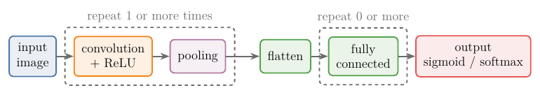
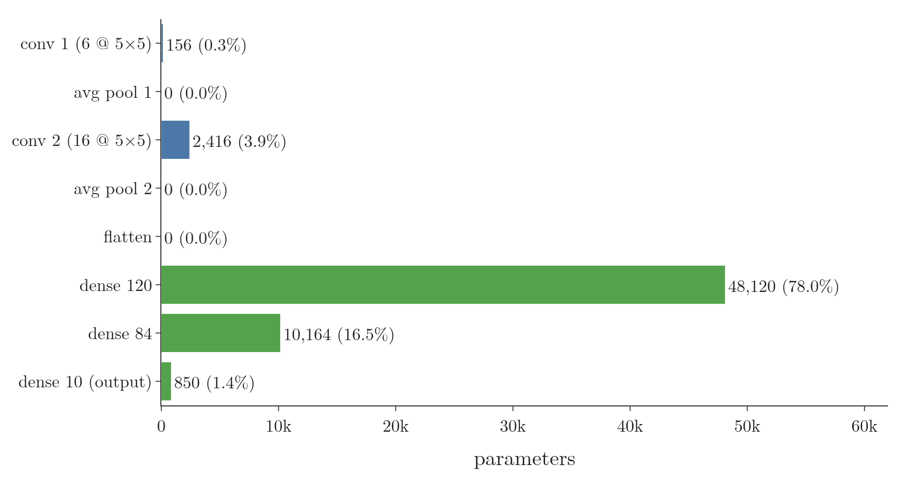

<!-- where-this-fits: generated by course_map/build_map.py; edit concepts.yaml, not this block -->
> **Where this fits:** Pipeline map step 8 (Model). See the [Course map](../../../00-course-map/00-course-map.md).
>
> 
>
> - **Builds on:** [Convolution operation and feature maps](../../../DL/04-cnn/DL-042-convolution-operation/DL-042-convolution-operation.md#6-the-convolution-operation); [Padding and strides](../../../DL/04-cnn/DL-043-padding-and-strides/DL-043-padding-and-strides.md#4-zero-padding); [Pooling](../../../DL/04-cnn/DL-044-pooling/DL-044-pooling.md#4-max-pooling).
> - **Leads to:** [Image classification with a CNN (cats vs dogs)](../../../DL/04-cnn/DL-049-cat-vs-dog-cnn/DL-049-cat-vs-dog-cnn.md#6-the-cnn); [Pretrained models and ImageNet](../../../DL/04-cnn/DL-051-pretrained-models/DL-051-pretrained-models.md#3-why-use-someone-elses-model).
<!-- /where-this-fits -->

## 1. Overview

> **Key point:** A CNN stacks blocks of convolution and pooling, flattens the result, and finishes with fully connected layers and an output layer. LeNet-5 (LeCun et al. 1998) is the classic example: two convolution-and-pooling blocks, then layers of 120, 84 and 10 nodes, about 60,000 parameters in all.

The parts were built earlier: the [convolution operation](../DL-042-convolution-operation/DL-042-convolution-operation.md#6-the-convolution-operation) (sliding a small grid of weights over an image), [padding and strides](../DL-043-padding-and-strides/DL-043-padding-and-strides.md#4-zero-padding) and [pooling](../DL-044-pooling/DL-044-pooling.md#4-max-pooling) (shrinking a feature map). This Note puts them together into a whole network, first in general and then in the first CNN that solved a real problem.

{width=100%}

Figure 1 shows LeNet-5. This Note covers:

- the general CNN architecture and what can be varied in it (section 3);
- the LeNet-5 layers and their shapes (section 4);
- the parameter count (section 5);
- LeNet-5 in Keras, trained on MNIST (section 6).

## 2. Prerequisites

- [The convolution operation](../DL-042-convolution-operation/DL-042-convolution-operation.md#6-the-convolution-operation), [padding and strides](../DL-043-padding-and-strides/DL-043-padding-and-strides.md#4-zero-padding) and [max pooling](../DL-044-pooling/DL-044-pooling.md#4-max-pooling).
- [The MNIST network](../../01-basics/DL-012-mnist-ann/DL-012-mnist-ann.md#4-the-network): **Flatten** (G-788), Dense layers, softmax output and counting **parameters** (G-1448).
- [Tanh](../../02-training/DL-027-activation-functions/DL-027-activation-functions.md#7-tanh) and [ReLU](../../02-training/DL-027-activation-functions/DL-027-activation-functions.md#8-relu), two activation functions (functions applied to each node's sum).

## 3. The general CNN architecture

> **Key point:** Input, then one or more blocks of convolution + ReLU + pooling, then Flatten, then any number of fully connected layers, then the output layer.

{width=100%}

Almost every CNN follows the pattern of Figure 2. The sequence of layers is the **CNN architecture** (G-403):

1. **Input:** an image, for example an RGB image of 32 × 32 × 3.
2. **Convolution layer:** (G-480) a set of **filters** (G-777) (kernels), say 3, each with 3 channels (layers of the image, such as red, green and blue) because the input has 3. The output is a volume of feature maps with 3 channels, one per filter.
3. **Non-linearity:** an activation function such as ReLU applied to every number of the feature maps.
4. **Pooling layer** (G-1520): shrinks the volume.
5. **Repeat** steps 2–4 as many times as needed: a second convolution, a second pooling, and so on.
6. **Flatten:** turn the final 3D volume into one long 1D vector of numbers.
7. **Fully connected layers** (G-583): the Dense layers of an ANN, as many as the problem needs.
8. **Output layer** (G-1424): one node with sigmoid ([sigmoid](../../02-training/DL-027-activation-functions/DL-027-activation-functions.md#6-sigmoid), a function that squeezes a number into 0 to 1) for binary classification, or one node per class with softmax (a function that turns the scores into probabilities that add to 1) for multi-class classification.

The convolution and pooling blocks extract the features; the fully connected part uses them to classify. The CS231n notes write the same pattern as INPUT → [[CONV → RELU] × N → POOL?] × M → [FC → RELU] × K → FC.

### 3.1 What can be varied

> **Key point:** The number of convolution layers and filters, filter size, stride, padding, the fully connected part, the activation, and extras such as dropout and batch normalisation.

Different CNN architectures come from different choices for:

- the number of convolution layers, and the number of filters in each;
- the filter size, the stride and whether there is padding;
- the number of fully connected layers and of nodes in each;
- the activation function;
- whether [dropout](../../02-training/DL-024-dropout/DL-024-dropout.md#4-how-dropout-works) or [batch normalisation](../../02-training/DL-031-batch-normalization/DL-031-batch-normalization.md#4-how-batch-normalisation-works-during-training) is used.

Over the years, competitions such as **ImageNet** (G-920), a hard image classification task with many classes, have produced a series of famous architectures: LeNet, AlexNet, GoogLeNet, VGGNet, ResNet and Inception. All of them follow the pattern above with different choices. LeNet came first.

## 4. LeNet-5

> **Key point:** Yann LeCun's network for reading handwritten digits: input 32 × 32, convolution with 6 filters of 5 × 5, average pooling, convolution with 16 filters of 5 × 5, average pooling, then 120, 84 and 10 nodes, with tanh activations.

### 4.1 Background

> **Key point:** LeCun worked on CNNs from 1989; the 1998 paper describes LeNet-5, used in a commercial system that read millions of cheques a day.

Yann LeCun, often called the father of CNNs, worked on convolutional networks from 1989. An early network of his read handwritten US Postal Service zip codes (LeCun et al. 1998 describe LeNet-1 as developed on this zip-code data). In 1998 he and his co-authors published **LeNet-5** (G-1080) for handwritten digit recognition. A check-reading system built on CNN character recognisers "is deployed commercially and reads several million checks per day" (LeCun et al. 1998).

### 4.2 The layers

> **Key point:** conv 6@5 × 5 → avg pool 2 × 2 → conv 16@5 × 5 → avg pool 2 × 2 → flatten → 120 → 84 → 10.

LeNet-5 expects a 32 × 32 greyscale image. Layer by layer (Figure 1):

1. **Convolution 1:** 6 filters of 5 × 5, stride 1, no padding, tanh.
2. **Average pooling 1** (G-238): 2 × 2 window, stride 2. LeNet-5 uses average pooling, not max pooling.
3. **Convolution 2:** 16 filters of 5 × 5, stride 1, no padding, tanh.
4. **Average pooling 2:** 2 × 2 window, stride 2.
5. **Flatten.**
6. **Fully connected:** 120 nodes, tanh.
7. **Fully connected:** 84 nodes, tanh.
8. **Output:** 10 nodes with softmax, one for each digit.

The activation is **tanh** (G-1947), not ReLU. ReLU is the usual choice in today's CNNs, but in 1998 tanh was the best activation function available (see [tanh](../../02-training/DL-027-activation-functions/DL-027-activation-functions.md#7-tanh)).

### 4.3 The shapes, layer by layer

> **Key point:** 32 → 28 → 14 → 10 → 5, then 5 × 5 × 16 = 400 numbers.

The sizes follow from the formulas of [strides](../DL-043-padding-and-strides/DL-043-padding-and-strides.md#5-strides): $n - f + 1$ for a convolution without padding, $\lfloor (n - 2)/2 \rfloor + 1$ for 2 × 2 pooling with stride 2.

| Layer | Calculation | Output |
|---|---|---|
| Input | | 32 × 32 × 1 |
| Convolution 1, 6 filters 5 × 5 | $32 - 5 + 1 = 28$ | 28 × 28 × 6 |
| Average pooling 1 | $28 / 2 = 14$ | 14 × 14 × 6 |
| Convolution 2, 16 filters 5 × 5 | $14 - 5 + 1 = 10$ | 10 × 10 × 16 |
| Average pooling 2 | $10 / 2 = 5$ | 5 × 5 × 16 |
| Flatten | $5 \times 5 \times 16$ | 400 |
| Dense | | 120 |
| Dense | | 84 |
| Output | | 10 |

Figure 3 draws the table one layer at a time. Each block is drawn to scale, one square per map, and its calculation appears below as the block is drawn: watch the squares get smaller while the stacks get thicker.

{width=100%}

So the first fully connected layer has $400 \times 120$ weights, the second $120 \times 84$, and the output layer $84 \times 10$.

The number of filters grows as we go deeper, from 6 to 16, while the filter size stays 5 × 5 and the height and width of the maps shrink. The extra filters make up for the lost height and width: each smaller map is described by more feature maps, so the network keeps a rich description while becoming less sensitive to small shifts and distortions of the input (LeCun et al. 1998, §II.A). More filters in deeper layers is a pattern we will see again in later architectures.

{height=50%}

In Figure 4, watch the 7 stay visible while the maps shrink from 28 × 28 to 5 × 5 and multiply from 6 to 16, then dissolve into 400 numbers once flattened; by the output, the model puts a probability of 1.000 on the digit 7.

### 4.4 Why "5"

> **Key point:** The paper calls LeNet-5 a network of 7 layers, not counting the input; "5" is the version number after LeNet-1 and LeNet-4.

One common way to count reaches 5 layers: each convolution with its pooling counts as one layer, giving 2, plus the two hidden fully connected layers and the output layer. But the paper itself says "LeNet-5 comprises 7 layers, not counting the input": C1, S2, C3, S4, C5, F6 and the output (LeCun et al. 1998). The same paper also tests LeNet-1 and LeNet-4, so the 5 is best read as a version number.

## 5. Counting the parameters

> **Key point:** A convolution layer has (filter height × width × input channels + 1) × filters parameters. LeNet-5 in Keras has 61,706, and 48,120 of them sit in the first fully connected layer.

1. **In words:** each filter has height × width × input channels weights plus one bias; a Dense layer has inputs × nodes weights plus one bias per node. Pooling and Flatten have none.
2. **Formula:**
   Here $f$ is the filter side, $c_{\text{in}}$ the input channels, $k$ the number of filters, $n_{\text{in}}$ the inputs of the Dense layer and $n_{\text{out}}$ its nodes.
   $$\text{conv} = (f \times f \times c_{\text{in}} + 1) \times k$$
   $$\text{dense} = (n_{\text{in}} + 1) \times n_{\text{out}}$$
3. **Example:** convolution 1 has 5 × 5 filters, 1 input channel and 6 filters:
   $$(5 \times 5 \times 1 + 1) \times 6 = 26 \times 6$$
   $$(5 \times 5 \times 1 + 1) \times 6 = 156$$
   Convolution 2 has 5 × 5 filters, 6 input channels and 16 filters:
   $$(5 \times 5 \times 6 + 1) \times 16 = 151 \times 16$$
   $$(5 \times 5 \times 6 + 1) \times 16 = 2{,}416$$

From `model.summary()` in the Notebook:

| Layer | Output shape | Parameters |
|---|---|---|
| Conv2D, 6 filters 5 × 5 | 28 × 28 × 6 | 156 |
| AveragePooling2D | 14 × 14 × 6 | 0 |
| Conv2D, 16 filters 5 × 5 | 10 × 10 × 16 | 2,416 |
| AveragePooling2D | 5 × 5 × 16 | 0 |
| Flatten | 400 | 0 |
| Dense, 120 | 120 | 48,120 |
| Dense, 84 | 84 | 10,164 |
| Dense, 10 | 10 | 850 |
| **Total** | | **61,706** |

Pooling layers have no parameters because pooling involves no training, and Flatten has none because it only reshapes. LeNet-5 has about 60,000 parameters, few for a CNN; modern CNNs have millions.

{height=38%}

Figure 5 shows where the weights live: the two convolution layers hold 4.2% of them, and the first dense layer, which connects all 400 flattened numbers to 120 nodes, holds 78%.

> **Extra:** The original LeNet-5 differs from the Keras version in a few details, all from LeCun et al. (1998). Its pooling layers multiply each average by a trainable coefficient and add a trainable bias (12 and 32 parameters). C3 connects each of its 16 maps to only some of S2's 6 maps (1,516 parameters instead of 2,416). C5 is a convolution layer with 120 filters of 5 × 5, which on a 5 × 5 input amounts to a fully connected layer. The activation is a scaled tanh, $1.7159 \tanh(Sa)$, and the output layer uses Euclidean radial basis function units instead of softmax. Adding the paper's own counts (conv 1, pooling 1, C3, pooling 2, C5, F6) gives the "60,000 trainable free parameters" the paper states:
>
> $$156 + 12 + 1{,}516 = 1{,}684$$
> $$1{,}684 + 32 + 48{,}120 = 49{,}836$$
> $$49{,}836 + 10{,}164 = 60{,}000$$

## 6. LeNet-5 in Keras

> **Key point:** Two `Conv2D` + `AveragePooling2D` blocks, `Flatten`, three `Dense` layers. On MNIST padded to 32 × 32 it reaches 98.46% test accuracy after 10 epochs.

> **Python:** LeNet-5 with today's Keras layers.
>
> ```python
> model = keras.Sequential([
>     keras.Input(shape=(32, 32, 1)),
>     keras.layers.Conv2D(6, kernel_size=(5, 5), strides=1,
>                         padding="valid", activation="tanh"),
>     keras.layers.AveragePooling2D(pool_size=(2, 2), strides=2),
>     keras.layers.Conv2D(16, kernel_size=(5, 5), strides=1,
>                         padding="valid", activation="tanh"),
>     keras.layers.AveragePooling2D(pool_size=(2, 2), strides=2),
>     keras.layers.Flatten(),
>     keras.layers.Dense(120, activation="tanh"),
>     keras.layers.Dense(84, activation="tanh"),
>     keras.layers.Dense(10, activation="softmax")])
> ```

MNIST digits are 28 × 28, so the Notebook adds 2 rows and columns of zeros on every side to make them 32 × 32. The paper's input was also larger than the digits, so that features at the edge of a digit can sit in the centre of a filter's view (LeCun et al. 1998). Pixels are scaled to 0–1, and the model is compiled as in [compiling and training](../../01-basics/DL-012-mnist-ann/DL-012-mnist-ann.md#5-compiling-and-training) (sparse categorical cross-entropy, Adam).

Trained for 10 epochs with batch size 128, averaged over 3 seeds, LeNet-5 reaches a test accuracy of 98.46%, a test error of 1.54%. The paper reports 0.95% test error for LeNet-5 (LeCun et al. 1998), trained differently and for longer. The two-hidden-layer ANN of [the MNIST network](../../01-basics/DL-012-mnist-ann/DL-012-mnist-ann.md#7-a-bigger-network-and-its-training-curves) reached 97.72%.

{height=38%}

In Figure 6, the validation curve is just below the ANN's line at epoch 2 (97.66%), passes it at epoch 3 and levels off near 98.5%, while the training curve keeps climbing towards 99.5%.

## 7. Summary

| | General CNN | LeNet-5 |
|---|---|---|
| Feature extraction | [conv + ReLU → pool] × M | 2 × [conv 5 × 5 (6, then 16 filters) + tanh → avg pool 2 × 2] |
| Bridge | Flatten | 5 × 5 × 16 → 400 |
| Classification | fully connected × K | 120 → 84 (tanh) |
| Output | sigmoid or softmax | 10, softmax |
| Parameters | depends | 61,706 in Keras (60,000 in the paper) |

- A CNN = convolution and pooling blocks, Flatten, fully connected layers, output layer, because the blocks extract the features and the fully connected part uses them to classify.
- Architectures differ in the number of layers and filters, filter size, stride, padding, activation, dropout and batch normalisation, so LeNet, AlexNet, VGGNet and ResNet are all this one pattern with different choices.
- LeNet-5 (LeCun et al. 1998): 32 × 32 input, tanh, average pooling, 6 then 16 filters of 5 × 5 (more filters as the maps shrink, to keep a rich description of a smaller map), layers of 120, 84 and 10 nodes; tanh, because in 1998 it was the best activation function available.
- Pooling and Flatten have no parameters; most of LeNet-5's parameters are in its first Dense layer, because pooling involves no training, Flatten only reshapes, and that Dense layer connects all 400 flattened numbers to 120 nodes.

## 8. Sources

**Built from**

- CampusX, "CNN Architecture | LeNet -5 Architecture", YouTube, https://www.youtube.com/watch?v=ewsvsJQOuTI

**Other references**

- LeCun, Y., Bottou, L., Bengio, Y. and Haffner, P. (1998). Gradient-based learning applied to document recognition. *Proceedings of the IEEE*, 86(11), 2278–2324. Section II.A (the number of feature maps grows as the spatial resolution shrinks, giving invariance to shifts and distortions), Section II.B (LeNet-5), Table I, Section III.
- Keras API documentation: `Conv2D`, `AveragePooling2D`, `Flatten` and `Dense` layers, keras.io/api/layers.
- Stanford CS231n course notes, "Convolutional Neural Networks", section "Layer Patterns", cs231n.github.io/convolutional-networks.

## 9. Key terms

Terms taught in this Note come first; linked terms are recaps, taught in the Note the link opens.

| Term | Meaning |
|---|---|
| CNN architecture (G-403) | The sequence of layers of a CNN: convolution and pooling blocks, Flatten, fully connected layers, output. |
| LeNet-5 (G-1080) | An early network for reading handwritten digits, built by LeCun et al. in 1998 (a CNN): two blocks of convolution then pooling (conv-pool blocks), then layers of 120, 84 and 10 nodes. |
| [Flatten layer](../../../DL/01-basics/DL-012-mnist-ann/DL-012-mnist-ann.md#41-flatten-from-an-image-to-a-row) (G-788) | A layer that reshapes a multi-dimensional input into one dimension; no parameters. |
| [Parameter (of a function)](../../../ML/02-getting-data/ML-014-working-with-csv/ML-014-working-with-csv.md#3-the-read_csv-function) (G-1448) | A named setting passed to a function, like `sep=";"`. |
| [Convolution layer](../../../DL/04-cnn/DL-040-cnn-intuition/DL-040-cnn-intuition.md#3-what-makes-a-network-a-cnn) (G-480) | A layer that slides small filters over its input to find features. |
| [Filter (kernel)](../../../DL/04-cnn/DL-042-convolution-operation/DL-042-convolution-operation.md#41-a-moving-average) (G-777) | A small grid of weights slid over the image; at each position it multiplies and adds, so it responds strongly where its pattern (such as an edge) appears and produces a feature map. Its depth equals the input's number of channels. |
| [Pooling layer](../../../DL/04-cnn/DL-044-pooling/DL-044-pooling.md#41-where-pooling-sits) (G-1520) | A CNN layer that shrinks the feature map from a convolution layer by replacing each small window with one number, such as its maximum; this cuts the computation and makes the features less sensitive to small shifts. |
| [Dense (fully connected) layer](../../../DL/01-basics/DL-011-customer-churn-ann/DL-011-customer-churn-ann.md#41-the-first-architecture) (G-583) | A layer whose every node receives the output of every node in the layer before. |
| [Output layer](../../../DL/01-basics/DL-002-what-is-deep-learning/DL-002-what-is-deep-learning.md#22-the-parts-of-a-neural-network) (G-1424) | The last layer, which gives the prediction. |
| [ImageNet](../../../DL/01-basics/DL-003-nn-types-history-applications/DL-003-nn-types-history-applications.md#36-2012-imagenet-and-after) (G-920) | A very large labelled image dataset with a yearly classification competition. |
| [Average pooling](../../../DL/04-cnn/DL-044-pooling/DL-044-pooling.md#81-max-average-and-l2-pooling) (G-238) | Pooling that replaces each window of a feature map with the mean of its values, which shrinks the map; unlike max pooling, it fades strong values such as edges. |
| [Tanh (hyperbolic tangent)](../../../DL/02-training/DL-027-activation-functions/DL-027-activation-functions.md#3-what-an-activation-function-is) (G-1947) | An activation function that squashes any number into an S-curve from $-1$ to 1, centred on 0: $\tanh(z) = (e^{z}-e^{-z})/(e^{z}+e^{-z})$, with derivative $1 - \tanh^2(z)$. |
