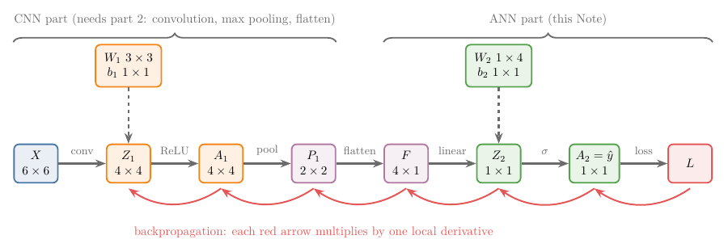
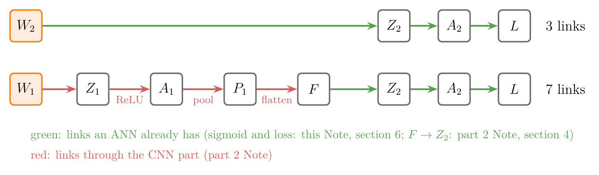
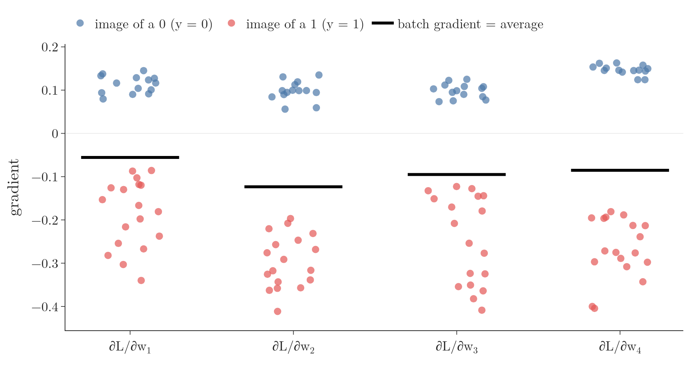

<!-- where-this-fits: generated by course_map/build_map.py; edit concepts.yaml, not this block -->
> **Where this fits:** Pipeline map step 8 (Model). See the [Course map](../../../00-course-map/00-course-map.md).
>
> 
>
> - **Builds on:** [Backpropagation](../../../DL/01-basics/DL-015-backpropagation-what/DL-015-backpropagation-what.md#4-the-steps-of-backpropagation); [Convolution operation and feature maps](../../../DL/04-cnn/DL-042-convolution-operation/DL-042-convolution-operation.md#6-the-convolution-operation).
<!-- /where-this-fits -->

## 1. Overview

> **Key point:** A CNN learns the same way as an ordinary network: it makes a guess, measures how wrong the guess is, and nudges every weight in the direction that makes the error smaller. We cut a small CNN into a CNN part and an ANN part. For the ANN part, each output weight's nudge is the output error times the number that weight multiplied.

**Backpropagation** (G-247) for an ANN is [the algorithm](../../01-basics/DL-015-backpropagation-what/DL-015-backpropagation-what.md#4-the-steps-of-backpropagation) that finds the **gradient** (the list of slopes of the loss with respect to every weight) and uses it to update the weights. A CNN adds three new operations, and the **chain rule** (G-371; the slope along a path of links is the product of the slopes of the links, see [the chain rule](../../../MA/06-calculus/MA-061-derivatives-of-one-variable/MA-061-derivatives-of-one-variable.md#53-the-chain-rule)) must pass through each of them:

- [convolution](../DL-042-convolution-operation/DL-042-convolution-operation.md#6-the-convolution-operation) (a filter slides over the image, giving a feature map);
- [max pooling](../DL-044-pooling/DL-044-pooling.md#4-max-pooling) (the largest value of each small window is kept);
- [flatten](../../01-basics/DL-012-mnist-ann/DL-012-mnist-ann.md#41-flatten-from-an-image-to-a-row) (a grid is read out as a list).

This Note sets the problem up on the smallest possible CNN and finds the gradients of its last layer. The second part goes back through [flatten](../DL-048-backpropagation-cnn-layers/DL-048-backpropagation-cnn-layers.md#5-back-through-flatten-reshape), [max pooling](../DL-048-backpropagation-cnn-layers/DL-048-backpropagation-cnn-layers.md#6-back-through-max-pooling-route-to-the-maximum) and [convolution](../DL-048-backpropagation-cnn-layers/DL-048-backpropagation-cnn-layers.md#8-back-through-the-convolution).

{width=100%}

Figure 1 shows the whole network as a row of boxes. Read it left to right for the guess: a small image goes in, a probability comes out. Read it right to left for the learning: the error at the output is passed back, box by box, to every weight. Section 3 gives every box its numbers.

In practice Keras computes all of this for us. Knowing how the gradients flow through a CNN still helps us understand and use the tools better.

## 2. Prerequisites

- [The steps of backpropagation](../../01-basics/DL-015-backpropagation-what/DL-015-backpropagation-what.md#4-the-steps-of-backpropagation), [how it runs](../../01-basics/DL-016-backpropagation-how/DL-016-backpropagation-how.md#7-the-classification-derivatives) and [why subtracting the derivative works](../../01-basics/DL-017-backpropagation-why/DL-017-backpropagation-why.md#7-why-we-subtract-the-derivative): the chain rule along a network, and the update $w \leftarrow w - \eta\thinspace\partial L/\partial w$.
- [A filter is a node](../DL-046-cnn-vs-ann/DL-046-cnn-vs-ann.md#4-how-they-are-similar-a-filter-is-a-node): a **filter** (G-777) works like a node, its values are weights.
- [The convolution operation](../DL-042-convolution-operation/DL-042-convolution-operation.md#6-the-convolution-operation) and [max pooling](../DL-044-pooling/DL-044-pooling.md#4-max-pooling).
- [The log loss](../../../ML/07-classification/ML-072-log-loss/ML-072-log-loss.md#62-the-loss-function) and [the sigmoid derivative](../../../ML/07-classification/ML-073-sigmoid-derivative/ML-073-sigmoid-derivative.md#33-the-result).

## 3. A small CNN

> **Key point:** 6 × 6 image → one 3 × 3 filter with bias → ReLU → 2 × 2 max pooling → flatten → one sigmoid node. Shapes: 6 × 6 → 4 × 4 → 4 × 4 → 2 × 2 → 4 → 1.

### 3.1 The architecture and the shapes

> **Key point:** Convolution gives 4 × 4, ReLU keeps the shape, pooling halves it to 2 × 2, flatten gives 4 numbers, the output node gives 1.

The network (Figure 1) has:

1. **Input:** a 6 × 6 greyscale image $X$ (a grid of 36 brightness values).
2. **Convolution:** one 3 × 3 filter with its bias, giving a 4 × 4 **feature map** (G-766). The side is:

   $$6 - 3 + 1 = 4$$

3. **ReLU** (G-1668): negatives become 0; the shape stays 4 × 4.
4. **Max pooling** (G-1182): 2 × 2 window, stride 2, giving 2 × 2.
5. **Flatten:** the 2 × 2 grid read out row by row as a list of 4 numbers.
6. **Output:** a single node with [sigmoid](../../../ML/07-classification/ML-071-sigmoid-function/ML-071-sigmoid-function.md#4-the-sigmoid-function) (a function that squashes any number into the range 0 to 1), giving the prediction $\hat{y}$, a number between 0 and 1.

The network is a binary classifier: is this a picture of a cat or a dog, or, in the Notebook, is this MNIST digit a 1 ($y = 1$) or a 0 ($y = 0$)? The Notebook shrinks real MNIST digits to 6 × 6 so that every shape matches this Note.

{height=40%}

In Figure 2, the 6 × 6 versions keep only the rough shape, a ring for a 0 and a vertical stroke for a 1.

### 3.2 The trainable parameters

> **Key point:** 9 filter weights + 1 filter bias + 4 output weights + 1 output bias = 15 parameters.

Only two places in the network hold numbers that training can change: the filter and the output node. Before training, the Notebook draws them at random. These starting values are the ones used in every example of this Note and of the part 2 Note.

| Parameter | Where | Shape | Count | Starting value (Notebook) |
|---|---|---|---|---|
| $W_1$ | the filter | 3 × 3 | 9 | the 3 × 3 grid below |
| $b_1$ | the filter's bias | 1 × 1 | 1 | 0.1 |
| $W_2$ | weights of the output node | 1 × 4 | 4 | (−0.6327, −0.3116, 0.0207, −1.1625) |
| $b_2$ | bias of the output node | 1 × 1 | 1 | 0 |

$$W_1 = \begin{bmatrix} 0.0629 & -0.0661 & 0.3202 \cr0.0525 & -0.2678 & 0.1808 \cr0.6520 & 0.4735 & -0.3519 \end{bmatrix}$$

The count of parameters, one line per place:

$$9 + 1 = 10 \quad \text{(filter)}$$

$$4 + 1 = 5 \quad \text{(output node)}$$

$$10 + 5 = 15$$

These 15 numbers are the **trainable parameters** (G-1065). ReLU, max pooling and flatten have none. Training means finding the 15 values that make the loss smallest.

### 3.3 The loss

> **Key point:** Binary cross-entropy (log loss), the same loss as in logistic regression.

The loss is one number that says how wrong one guess is: near 0 for a confident right guess, large for a confident wrong one. Our first image is a 0, so its target is $y = 0$. Section 4 shows that the untrained network gives it the prediction $a_2 = 0.2104$, a 21 percent chance of being a 1. The guess leans the right way, so the loss should be small:

$$L = -0 \times \log 0.2104 - (1 - 0) \times \log(1 - 0.2104)$$

$$= 0 - \log 0.7896$$

$$= 0.2362$$

Here $\log$ is the natural logarithm. The general rule is the **binary cross-entropy** (G-303) (derived in [the log loss](../../../ML/07-classification/ML-072-log-loss/ML-072-log-loss.md#62-the-loss-function)), for one image with target $y$ (0 or 1) and prediction $a_2 = \hat{y}$:

$$L = -y\log a_2 - (1 - y)\log(1 - a_2)$$

Check: $y = 0$ and $a_2 = 0.2104$ give 0.2362, as above (Notebook: 0.2362). For a batch of $m$ images (for example $m = 32$) the loss is the average of the $m$ single losses. For several classes we would use softmax and categorical cross-entropy instead (see [categorical cross-entropy](../../01-basics/DL-014-dl-loss-functions/DL-014-dl-loss-functions.md#9-categorical-cross-entropy)). The loss of a CNN is exactly the loss of an ANN.

## 4. Forward propagation

> **Key point:** The image passes through six operations, each turning one grid of numbers into the next, until a single probability comes out. This walk from image to prediction is **forward propagation** (G-797).

Figure 1 is the **logical diagram** (G-1118) of the network: each arrow is one operation, each box one tensor (a grid of numbers). Figure 3 plays the walk on our first image, a 0 shrunk to 6 × 6; the steps below give the same numbers in writing.

{width=100%}

In Figure 3, watch the grids shrink, 6 × 6 to 4 × 4 to 2 × 2 to 4 numbers to 1, as each operation runs.

**Step 1, convolution.** The input $X$ is the 6 × 6 grid of pixel brightnesses, 0 for the blank background and 1 for full ink (Figure 3 draws the background white and the ink dark). The filter $W_1$ sits on the top-left 3 × 3 window of $X$; each pixel is multiplied by the filter value on top of it, and the 9 products are added (the **convolution operation** (G-481), see [one step](../DL-042-convolution-operation/DL-042-convolution-operation.md#62-one-step)). The top-left window of our image is

$$\begin{bmatrix} 0 & 0 & 0.0078 \cr0 & 0.0078 & 0.2706 \cr0 & 0.1765 & 0.4667 \end{bmatrix}$$

and the 9 products with $W_1$ (section 3.2) are:

| Pixel × filter value | Product |
|---|---|
| 0 × 0.0629 | 0 |
| 0 × (−0.0661) | 0 |
| 0.0078 × 0.3202 | 0.0025 |
| 0 × 0.0525 | 0 |
| 0.0078 × (−0.2678) | −0.0021 |
| 0.2706 × 0.1808 | 0.0489 |
| 0 × 0.6520 | 0 |
| 0.1765 × 0.4735 | 0.0836 |
| 0.4667 × (−0.3519) | −0.1642 |

$$\text{sum} = 0.0025 - 0.0021 + 0.0489$$

$$\qquad + 0.0836 - 0.1642$$

$$\text{sum} = -0.0313$$

$$\text{plus } b_1: \quad -0.0313 + 0.1 = 0.0687$$

0.0687 is the top-left cell of the feature map $Z_1$. The filter then slides one pixel at a time to fill all 16 cells (Notebook):

$$Z_1 = \begin{bmatrix} 0.0687 & 0.4468 & 0.2560 & 0.4006 \cr0.3558 & 0.4947 & 0.2482 & 0.2801 \cr0.1859 & 0.5311 & 0.7707 & 0.2888 \cr0.0771 & 0.2393 & 0.2995 & 0.1123 \end{bmatrix}$$

**Step 2, ReLU.** Each negative cell becomes 0, each positive cell stays. All 16 cells of $Z_1$ are positive, so $A_1 = Z_1$ for this image.

**Step 3, max pooling.** Cut $A_1$ into four 2 × 2 windows and keep the largest number of each:

$$\text{top-left: } (0.0687, 0.4468,$$

$$0.3558, 0.4947) \rightarrow 0.4947$$

$$\text{top-right: } (0.2560, 0.4006,$$

$$0.2482, 0.2801) \rightarrow 0.4006$$

$$\text{bottom-left: } (0.1859, 0.5311,$$

$$0.0771, 0.2393) \rightarrow 0.5311$$

$$\text{bottom-right: } (0.7707, 0.2888,$$

$$0.2995, 0.1123) \rightarrow 0.7707$$

$$P_1 = \begin{bmatrix} 0.4947 & 0.4006 \cr0.5311 & 0.7707 \end{bmatrix}$$

**Step 4, flatten.** Read $P_1$ row by row into one column of 4 numbers, $f_1$ to $f_4$:

$$F = (0.4947,\ 0.4006,\ 0.5311,\ 0.7707)^{\mathsf T}$$

The $\mathsf T$ (**transpose**, G-2012) only says that $F$ is stored as a column.

**Step 5, the output node.** Each of the 4 values is multiplied by its weight in $W_2$, one product per line:

$$-0.6327 \times 0.4947 = -0.3130$$

$$-0.3116 \times 0.4006 = -0.1249$$

$$0.0207 \times 0.5311 = 0.0110$$

$$-1.1625 \times 0.7707 = -0.8959$$

$$Z_2 = -0.3130 - 0.1249 + 0.0110 - 0.8959 + b_2$$

$$Z_2 = -1.3228 + 0$$

$$Z_2 = -1.3228$$

**Step 6, sigmoid.** The **sigmoid function** (G-1798) squeezes $Z_2$ into a probability:

$$\sigma(z) = \frac{1}{1 + e^{-z}}$$

$$e^{1.3228} = 3.7538$$

$$A_2 = \frac{1}{1 + 3.7538} = 0.2104$$

The network says "21 percent a 1"; the image is a 0. The loss of section 3.3 measures this miss as 0.2362.

The same six steps as equations, for any image:

| Step | Equation | Shape |
|---|---|---|
| Convolution | $Z_1 = X \ast W_1 + b_1$ | 4 × 4 (the feature map) |
| ReLU | $A_1 = \text{ReLU}(Z_1)$ | 4 × 4 |
| Max pooling | $P_1 = \text{maxpool}(A_1)$ | 2 × 2 |
| Flatten | $F = \text{flatten}(P_1)$ | 4 × 1 |
| Output node | $Z_2 = W_2 F + b_2$ | (1 × 4)(4 × 1) = 1 × 1 |
| Sigmoid | $A_2 = \sigma(Z_2)$ | 1 × 1 (the prediction) |

Here $\ast$ is the convolution of step 1 and $b_1$ is added to every cell of the feature map. The product is written $W_2 F$, not $F W_2$, so that the shapes fit:

$$(1 \times 4)\ \text{times}\ (4 \times 1) = 1 \times 1$$

Check: the equations reproduce step by step the numbers above, ending at $A_2 = 0.2104$ (Notebook: 0.2104). With these equations we can code the forward pass and predict for any image; the Notebook does it in NumPy.

## 5. What we need: four derivatives

> **Key point:** To nudge a parameter the right way, we need its slope: how much the loss changes when that parameter changes a little. We need one slope for each of the 15 parameters, so each group of slopes has the shape of its group of parameters.

Training starts from the random values of section 3.2 and repeats **gradient descent** (G-862; repeatedly moving every parameter a little against its slope, see [why we subtract the derivative](../../01-basics/DL-017-backpropagation-why/DL-017-backpropagation-why.md#7-why-we-subtract-the-derivative)) until the loss is small. Each step moves every parameter a little against its slope.

The slope of the loss with respect to one parameter, say $b_2$, is written $\partial L/\partial b_2$ and read "how much $L$ changes per unit change of $b_2$". It is a **partial derivative** (G-1457; [the slope in one parameter with the others held fixed](../../../MA/06-calculus/MA-062-partial-derivatives-and-gradients/MA-062-partial-derivatives-and-gradients.md#3-partial-derivatives)). Section 6.2 finds, for our image,

$$\frac{\partial L}{\partial b_2} = 0.2104$$

A positive slope means that raising $b_2$ raises the loss, so gradient descent lowers $b_2$. With a **learning rate** (G-1068; [the size of the step](../../../ML/01-foundations/ML-005-online-learning/ML-005-online-learning.md#5-the-learning-rate)) $\eta = 0.1$, the value the second part trains with, one step is:

$$b_2 \leftarrow b_2 - \eta\thinspace\frac{\partial L}{\partial b_2}$$

$$= 0 - 0.1 \times 0.2104$$

$$= -0.0210$$

Every parameter follows the same rule, with its own slope:

$$W_1 \leftarrow W_1 - \eta\frac{\partial L}{\partial W_1}$$

$$b_1 \leftarrow b_1 - \eta\frac{\partial L}{\partial b_1}$$

$$W_2 \leftarrow W_2 - \eta\frac{\partial L}{\partial W_2}$$

$$b_2 \leftarrow b_2 - \eta\frac{\partial L}{\partial b_2}$$

$W_1$ and $W_2$ are matrices, so their derivatives are matrices of the same shape: one partial derivative per weight, 9 numbers for $W_1$ and 4 for $W_2$ (see [gradients of matrices](../../../MA/06-calculus/MA-063-jacobian-and-matrix-gradients/MA-063-jacobian-and-matrix-gradients.md#8-gradients-of-matrices)). So the whole task is to find these four derivatives.

### 5.1 Two parts: a CNN and an ANN

> **Key point:** Everything up to flatten is the CNN part; everything after is an ordinary one-node ANN. Study them separately, then join them.

It helps to see the network as two networks joined together (Figure 1): a **CNN part** (convolution, ReLU, max pooling, flatten) and an **ANN part** (the output node). This Note finds the ANN part's derivatives; [the second part](../DL-048-backpropagation-cnn-layers/DL-048-backpropagation-cnn-layers.md#3-the-plan) finds the CNN part's.

### 5.2 The chains

> **Key point:** A weight of the output node reaches the loss through 3 links; a filter weight through 7. The slope of the whole path is the product of the slopes of its links.

Think of a row of gears. Turn the first gear a little and the last gear turns too, by an amount set by every gear in between. The first weight of $W_2$, call it $w_1$ (starting value −0.6327), is not connected to the loss directly:

1. a change in $w_1$ changes $Z_2$;
2. the change in $Z_2$ changes $A_2$;
3. the change in $A_2$ changes $L$.

Each link has its own slope, and section 6 finds each one on our image:

| Link | What it asks | Value on our image |
|---|---|---|
| $\partial Z_2/\partial w_1$ | how much $Z_2$ moves per unit of $w_1$ | $f_1 = 0.4947$ |
| $\partial A_2/\partial Z_2$ | how much the sigmoid output moves per unit of $Z_2$ | 0.1661 |
| $\partial L/\partial A_2$ | how much the loss moves per unit of $A_2$ | 1.2664 |

The slope of the whole path is the product of the three, one factor per line:

$$1.2664$$

$$\times\ 0.1661 = 0.2104$$

$$\times\ 0.4947 = 0.1041$$

So raising $w_1$ by a small amount raises the loss by about 0.1041 times that amount. Multiplying the slopes along a path is the **chain rule** (G-371) (Goodfellow et al. 2016, §6.5.2; see [the chain rule](../../../MA/06-calculus/MA-061-derivatives-of-one-variable/MA-061-derivatives-of-one-variable.md#53-the-chain-rule)). For all of $W_2$ and for $b_2$:

$$\frac{\partial L}{\partial W_2} = \frac{\partial L}{\partial A_2}\cdot\frac{\partial A_2}{\partial Z_2}\cdot\frac{\partial Z_2}{\partial W_2}$$

$$\frac{\partial L}{\partial b_2} = \frac{\partial L}{\partial A_2}\cdot\frac{\partial A_2}{\partial Z_2}\cdot\frac{\partial Z_2}{\partial b_2}$$

Only the last factor differs between the two. Check: the first entry of $\partial L/\partial W_2$ in the Notebook is 0.1041, the product above.

For the filter the path is much longer. A change in a filter weight goes through 7 links before it reaches the loss:

| Link | Goes back through | On our image | Found in |
|---|---|---|---|
| $\partial L/\partial A_2$ | the loss | 1.2664 | section 6.1 |
| $\partial A_2/\partial Z_2$ | the sigmoid | 0.1661 | section 6.1 |
| $\partial Z_2/\partial F$ | the output node | the 4 weights of $W_2$ | part 2, section 4 |
| $\partial F/\partial P_1$ | flatten | a reshape, no arithmetic | part 2, section 5 |
| $\partial P_1/\partial A_1$ | max pooling | 1 at each window's maximum, 0 elsewhere | part 2, section 6 |
| $\partial A_1/\partial Z_1$ | ReLU | 1 in all 16 cells (all of $Z_1$ is positive) | part 2, section 7 |
| $\partial Z_1/\partial W_1$ | the convolution | the pixels of $X$ under each filter weight | part 2, section 8 |

Written as one product:

$$\frac{\partial L}{\partial W_1} = \frac{\partial L}{\partial A_2}\cdot\frac{\partial A_2}{\partial Z_2}$$

$$\qquad \cdot\thinspace\frac{\partial Z_2}{\partial F}\cdot\frac{\partial F}{\partial P_1}$$

$$\qquad \cdot\thinspace\frac{\partial P_1}{\partial A_1}\cdot\frac{\partial A_1}{\partial Z_1}$$

$$\qquad \cdot\thinspace\frac{\partial Z_1}{\partial W_1}$$

and $\partial L/\partial b_1$ is the same chain with $\partial Z_1/\partial b_1$ as its last factor. The part 2 Note multiplies these links out on the same image.

{width=100%}

Figure 4 shows the two chains side by side. Both end with the same two links, through the sigmoid and the loss, so the error $a_2 - y$ of section 6.1 is reused for the filter. The green link from $F$ to $Z_2$ is an ordinary dense-layer link; its slope is the weights $W_2$ (part 2, section 4). The four red links, through the CNN part, are left for the part 2 Note.

Figure 5 plays the whole plan. First the forward chain is drawn, one operation per arrow. Then the gradients appear from right to left, one per tensor, each with the same shape as its tensor: 1 × 1 at the output, then 4 × 1, 2 × 2 and 4 × 4. The last frame shows where the two weight gradients come from.

{width=100%}

Three of these factors are new: $\partial F/\partial P_1$ goes back through flatten, $\partial P_1/\partial A_1$ through max pooling, and $\partial Z_1/\partial W_1$ through the convolution. The part 2 Note finds them.

## 6. The ANN part: $\partial L/\partial W_2$ and $\partial L/\partial b_2$

> **Key point:** Two slopes, of the loss and of the sigmoid, multiply to a very simple number: the prediction minus the target, the **error** at the output ($\partial L/\partial Z_2 = a_2 - y$, G-17). Each output weight's slope is that error times the value the weight multiplied; the bias's slope is the error itself.

### 6.1 The first two factors

> **Key point:** The slope of the loss and the slope of the sigmoid multiply to the output error, prediction minus target: 0.2104 − 0 = 0.2104 on our image.

Take one image, so $A_2$ is a single number $a_2$. On our image $a_2 = 0.2104$ and $y = 0$. The two factors shared by both chains are exactly those of [the output layer in classification](../../01-basics/DL-016-backpropagation-how/DL-016-backpropagation-how.md#71-the-output-layer).

**The slope of the loss.** Differentiating the log loss of section 3.3 gives

$$\frac{\partial L}{\partial a_2} = -\frac{y}{a_2} + \frac{1 - y}{1 - a_2}$$

On our image:

$$-\frac{0}{0.2104} = 0$$

$$\frac{1 - 0}{1 - 0.2104} = \frac{1}{0.7896} = 1.2664$$

$$\frac{\partial L}{\partial a_2} = 0 + 1.2664 = 1.2664$$

**The slope of the sigmoid** (see [the result](../../../ML/07-classification/ML-073-sigmoid-derivative/ML-073-sigmoid-derivative.md#33-the-result)) is the output times one minus the output:

$$\frac{\partial a_2}{\partial Z_2} = a_2(1 - a_2)$$

$$= 0.2104 \times 0.7896$$

$$= 0.1661$$

**The product of the two:**

$$1.2664 \times 0.1661 = 0.2104$$

The result is exactly $a_2 - y$:

$$a_2 - y = 0.2104 - 0$$

The cancellation holds for every image (the log of the loss undoes the exponential of the sigmoid; Goodfellow et al. 2016, §6.2.2.2). First put the two terms of $\partial L/\partial a_2$ over one denominator:

$$-\frac{y}{a_2} + \frac{1 - y}{1 - a_2} = \frac{-y(1 - a_2) + (1 - y)a_2}{a_2(1 - a_2)}$$

$$= \frac{-y + y a_2 + a_2 - y a_2}{a_2(1 - a_2)}$$

$$= \frac{a_2 - y}{a_2(1 - a_2)}$$

Then multiply by the sigmoid's slope; $a_2(1 - a_2)$ cancels:

$$\frac{a_2 - y}{a_2(1 - a_2)} \times a_2(1 - a_2) = a_2 - y$$

$$\frac{\partial L}{\partial Z_2} = a_2 - y$$

Check against the product of the two numbers above (Notebook):

$$0.2104 - 0 = 0.2104$$

### 6.2 The last factors

> **Key point:** Each output weight's slope is the output error times the value of $F$ it multiplied; the bias's slope is the error itself.

$Z_2$ is the sum of four products plus the bias (section 4, step 5):

$$Z_2 = w_1 f_1 + w_2 f_2 + w_3 f_3 + w_4 f_4 + b_2$$

Raise $w_1$ by a small amount and only the first product changes, by that amount times $f_1 = 0.4947$. So the slope of $Z_2$ with respect to $w_1$ is $f_1$; with respect to each weight $w_k$ it is the input $f_k$ that weight multiplies; with respect to $b_2$ it is 1.

On our image the error is $a_2 - y = 0.2104$ (section 6.1). Each weight's slope is the error times its input, one product per line:

$$\frac{\partial L}{\partial w_1} = 0.2104 \times 0.4947 = 0.1041$$

$$\frac{\partial L}{\partial w_2} = 0.2104 \times 0.4006 = 0.0843$$

$$\frac{\partial L}{\partial w_3} = 0.2104 \times 0.5311 = 0.1117$$

$$\frac{\partial L}{\partial w_4} = 0.2104 \times 0.7707 = 0.1621$$

$$\frac{\partial L}{\partial b_2} = 0.2104 \times 1 = 0.2104$$

All four slopes are positive, so gradient descent lowers all four weights, which lowers $Z_2$ and the prediction: the right move for an image of a 0. The last frames of Figure 3 show these products: every weight of $W_2$ gets the same error, 0.21, times the value of $F$ it multiplied.

The general formula collects the four lines into one row, with $F^{\mathsf T}$ the row $(f_1, f_2, f_3, f_4)$:

$$\frac{\partial L}{\partial W_2} = (a_2 - y)\thinspace F^{\mathsf T}$$

$$\frac{\partial L}{\partial b_2} = a_2 - y$$

Check against the four lines above (Notebook):

$$0.2104 \times 0.4947 = 0.1041$$

$$0.2104 \times 0.4006 = 0.0843$$

$$0.2104 \times 0.5311 = 0.1117$$

$$0.2104 \times 0.7707 = 0.1621$$

TensorFlow's `GradientTape` (G-88), which differentiates the same network automatically, gives the same numbers (largest difference 0, Notebook).

### 6.3 Checking the shapes

> **Key point:** The slopes of $W_2$ must form a row of 4, the shape of $W_2$. Turning the column $F$ into a row (its transpose) makes the shapes fit.

A derivative is used to update its parameter, so it must have the same shape. $W_2$ is 1 × 4. The error $a_2 - y$ is 1 × 1 and $F$ is 4 × 1, so we use its transpose $F^{\mathsf T}$, 1 × 4:

$$\underset{1 \times 1}{\underbrace{(a_2 - y)}}\thickspace\underset{1 \times 4}{\underbrace{F^{\mathsf T}}} = \underset{1 \times 4}{\underbrace{\frac{\partial L}{\partial W_2}}}$$

## 7. A batch of images

> **Key point:** For a batch, each image gives its own gradient as in section 6, and the batch gradient is their average. One matrix product computes all of them at once.

With **mini-batch gradient descent** (G-1222), a batch of, say, 32 or 64 images goes forward together and backpropagation runs once for the batch (see [mini-batch](../../02-training/DL-020-gradient-descent-in-neural-networks/DL-020-gradient-descent-in-neural-networks.md#10-mini-batch-the-middle-ground)).

Start with the smallest batch, $m = 2$ images: our 0 and the Notebook's second image, a 1 ($y = 1$). Section 6 gives each image its own gradient:

| Image | Target $y$ | Prediction $a_2$ | Error $a_2 - y$ | $F$ |
|---|---|---|---|---|
| 1 | 0 | 0.2104 | 0.2104 | (0.4947, 0.4006, 0.5311, 0.7707) |
| 2 | 1 | 0.2910 | −0.7090 | (0.3766, 0.5051, 0.5133, 0.4346) |

For the first weight $w_1$, one product per line, then the average:

$$\text{image 1:} \quad 0.2104 \times 0.4947 = 0.1041$$

$$\text{image 2:} \quad -0.7090 \times 0.3766 = -0.2670$$

$$\text{sum:} \quad 0.1041 - 0.2670 = -0.1629$$

$$\text{average:} \quad -0.1629 / 2 = -0.0815$$

The same for all four weights gives $(-0.0815,\ -0.1369,\ -0.1261,\ -0.0730)$, and for the bias:

$$(0.2104 - 0.7090) / 2 = -0.2493$$

(Notebook.) The second image, badly wrong, outweighs the first: the batch asks to raise the weights.

The matrix form stores one image per column:

- $F$ has shape $4 \times m$, here $4 \times 2$;
- the predictions $A_2$ and the targets $Y$ have shape $1 \times m$, here $1 \times 2$.

The batch loss is the average of the single losses, so a factor $1/m$ appears:

$$\frac{\partial L}{\partial W_2} = \frac{1}{m}\thinspace(A_2 - Y)\thinspace F^{\mathsf T}$$

$$\frac{\partial L}{\partial b_2} = \frac{1}{m}\sum_{i=1}^{m}(a_{2,i} - y_i)$$

Here $\sum_{i=1}^{m}$ means "add the term for image 1, image 2, …, image $m$". Check: the first entry of $(A_2 - Y)F^{\mathsf T}$ is the row $(0.2104, -0.7090)$ times the column $(0.4947, 0.3766)$, which is the sum $-0.1629$ above; times $1/2$ it gives $-0.0815$.

The shapes:

$$(1 \times m)(m \times 4) = 1 \times 4$$

The $m$ cancels in the matrix product, so the derivative is 1 × 4 whatever the batch size, the shape of $W_2$. In the Notebook, with $m = 32$, the formula and `GradientTape` agree to within $6 \times 10^{-17}$.

The matrix product adds up the 32 single-image gradients, and the $1/m$ turns the sum into an average.

{height=40%}

In Figure 6, the images of 0s (blue) push every weight one way and the images of 1s (red) the other way, because $a_2 - y$ is positive for a 0 and negative for a 1; the batch gradient is the average of both groups.

## 8. Summary

| Derivative | Formula (one image) | Formula (batch of $m$) | Shape |
|---|---|---|---|
| $\partial L/\partial Z_2$ | $a_2 - y$ | $A_2 - Y$ | $1 \times 1$ or $1 \times m$ |
| $\partial L/\partial W_2$ | $(a_2 - y)F^{\mathsf T}$ | $\frac{1}{m}(A_2 - Y)F^{\mathsf T}$ | $1 \times 4$ |
| $\partial L/\partial b_2$ | $a_2 - y$ | mean of $A_2 - Y$ | $1 \times 1$ |
| $\partial L/\partial W_1$, $\partial L/\partial b_1$ | chains of 7 factors through flatten, max pooling, ReLU and convolution | | $3 \times 3$, $1 \times 1$ |

- A CNN is trained like an ANN: forward pass, loss, chain rule, gradient descent, because a filter works like a node; only the chain rule must also pass through convolution, max pooling and flatten.
- The small CNN has 15 parameters: $W_1$ (9), $b_1$, $W_2$ (4), $b_2$, because only the filter and the output node hold numbers that training can change.
- Split it into a CNN part and an ANN part; the ANN part gives $\partial L/\partial W_2 = (a_2 - y)F^{\mathsf T}$, because the slopes of the loss and the sigmoid multiply to the error $a_2 - y$, and each weight's slope is that error times the input it multiplied.
- Every derivative has the shape of its parameter; shapes guide where to put transposes, because a derivative is used to update its parameter.
- The filter's gradients need the backward steps through flatten, max pooling and convolution, because a filter weight reaches the loss through 7 links, three of them new: [the whole backward pass](../DL-048-backpropagation-cnn-layers/DL-048-backpropagation-cnn-layers.md#9-the-whole-backward-pass).

## 9. Sources

**Built from**

- CampusX, "Backpropagation in CNN | Part 1 | Deep Learning", YouTube, https://www.youtube.com/watch?v=RvCCFttGFMY

**Other references**

- Goodfellow, I., Bengio, Y. and Courville, A. (2016). *Deep Learning*. MIT Press. §6.2.2.2 (sigmoid output with the log loss), §6.5.2 (the chain rule in back-propagation).
- TensorFlow API documentation: `tf.GradientTape`, tensorflow.org/api_docs/python/tf/GradientTape.

## 10. Key terms

| Term | Meaning |
|---|---|
| Logical diagram | A drawing of a network as a chain of tensors linked by operations |
| Forward propagation | Computing the prediction from the input, operation by operation |
| Trainable parameter (G-1065) | A number changed by gradient descent: filter values, weights and biases |
| Binary cross-entropy (G-303) | The log loss $-y\log a - (1 - y)\log(1 - a)$ used for two classes |
| $\partial L/\partial Z_2 = a_2 - y$ | The gradient of the loss with respect to the output's weighted sum $Z_2$: for a sigmoid output with log loss it simplifies to prediction minus target, the error, which then gives the slope of every output weight and bias. |
| Partial derivative (G-1457) | The slope of the loss in one parameter, the others held fixed: how much $L$ changes per unit change of that parameter |
| Chain rule (G-371) | The slope along a path of links is the product of the slopes of the links |
| `GradientTape` | TensorFlow's tool that records a computation and returns its gradients automatically |
