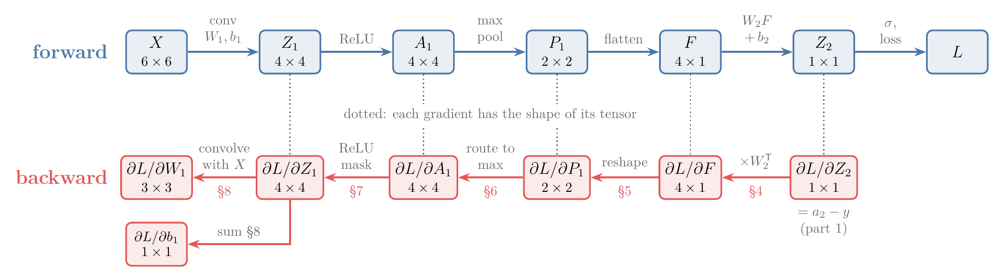
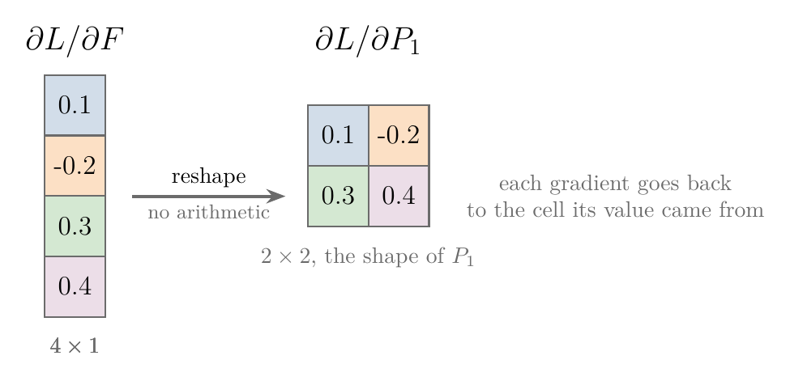
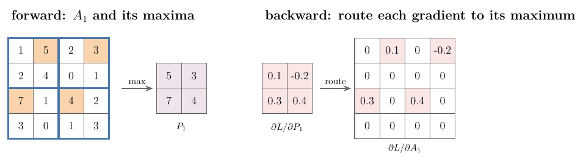
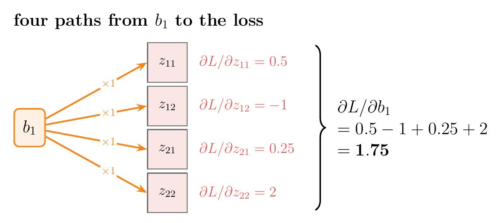
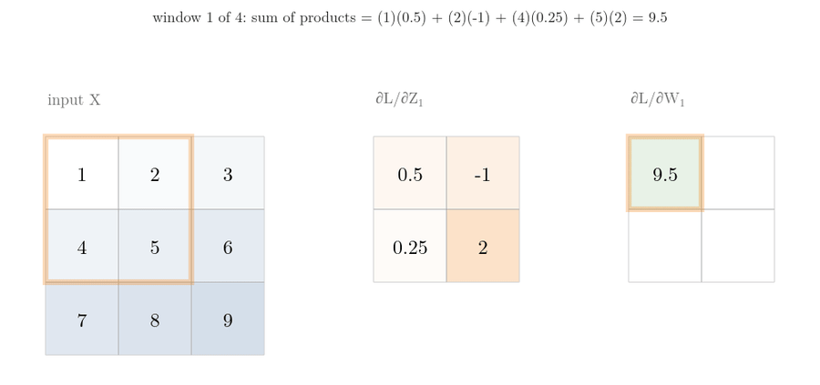
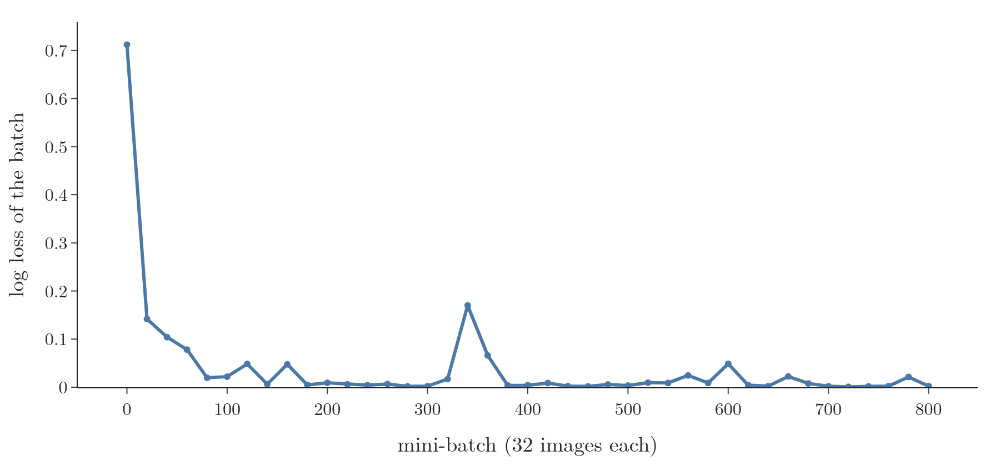

<!-- where-this-fits: generated by course_map/build_map.py; edit concepts.yaml, not this block -->
> **Where this fits:** Pipeline map step 8 (Model). See the [Course map](../../../00-course-map/00-course-map.md).
>
> 
>
> - **Builds on:** [Backpropagation](../../../DL/01-basics/DL-015-backpropagation-what/DL-015-backpropagation-what.md#4-the-steps-of-backpropagation); [Convolution operation and feature maps](../../../DL/04-cnn/DL-042-convolution-operation/DL-042-convolution-operation.md#6-the-convolution-operation).
<!-- /where-this-fits -->

## 1. Overview

> **Key point:** Going backwards, each layer passes the error back in its own simple way:
>
> - flatten puts each number back in its old place;
> - max pooling gives the error only to the cell that won its window;
> - ReLU blocks the error wherever its input was negative;
> - the filter's bias collects the sum of all the errors, and the filter's slopes come from sliding the errors over the image, like a convolution.

The [small CNN of part 1](../DL-047-backpropagation-in-cnn/DL-047-backpropagation-in-cnn.md#3-a-small-cnn) was set up there, with its [forward equations](../DL-047-backpropagation-in-cnn/DL-047-backpropagation-in-cnn.md#4-forward-propagation) and the [gradients of its output node](../DL-047-backpropagation-in-cnn/DL-047-backpropagation-in-cnn.md#6-the-ann-part-partial-lpartial-w_2-and-partial-lpartial-b_2). To train the filter we still need to go back through five more steps. A **gradient** is the slope of the loss with respect to a number or a grid of numbers. A **tensor** (a grid of numbers of any shape, see [what a tensor is](../../../ML/01-foundations/ML-010-tensors/ML-010-tensors.md#2-what-a-tensor-is)) is a single number, a list or a table. Going from the loss back towards the input, one gradient per tensor, is the **backward pass** (G-249). This Note finds each backward step:

- the output node (section 4);
- **flatten** (G-788) (section 5);
- **max pooling** (G-1182) (section 6);
- **ReLU** (G-1668) (section 7);
- the convolution (section 8).

{width=85%}

Figure 1 shows the final result. The Notebook checks every formula against TensorFlow's `GradientTape`, then trains the small CNN on real MNIST digits using only these formulas.

## 2. Prerequisites

- [The small CNN of part 1](../DL-047-backpropagation-in-cnn/DL-047-backpropagation-in-cnn.md#3-a-small-cnn): the network, its [forward equations](../DL-047-backpropagation-in-cnn/DL-047-backpropagation-in-cnn.md#4-forward-propagation), [the chains of derivatives](../DL-047-backpropagation-in-cnn/DL-047-backpropagation-in-cnn.md#52-the-chains), and $\partial L/\partial Z_2 = a_2 - y$.
- [The convolution operation](../DL-042-convolution-operation/DL-042-convolution-operation.md#6-the-convolution-operation) and [max pooling](../DL-044-pooling/DL-044-pooling.md#4-max-pooling).
- [Backpropagation as chain rule plus memoization](../../01-basics/DL-019-mlp-memoization/DL-019-mlp-memoization.md#5-where-memoization-comes-in): backpropagation stores one gradient per step and reuses it.

## 3. The plan

> **Key point:** The error at the output is already known from part 1: 0.2104 on our image. Five backward steps carry it to the filter.

Recall the network of [part 1](../DL-047-backpropagation-in-cnn/DL-047-backpropagation-in-cnn.md#31-the-architecture-and-the-shapes), with its first image (a 0, so $y = 0$) and starting weights: $X$ (6 × 6) → convolution with $W_1$ (3 × 3) and $b_1$ → $Z_1$ (4 × 4) → ReLU → $A_1$ (4 × 4) → max pooling → $P_1$ (2 × 2) → flatten → $F$ (4 × 1) → $Z_2 = W_2F + b_2$ → $A_2 = \sigma(Z_2)$ → loss $L$.

The chains for the filter's weights and bias are

$$\frac{\partial L}{\partial W_1} = \underset{a_2 - y}{\underbrace{\frac{\partial L}{\partial A_2}\frac{\partial A_2}{\partial Z_2}}}\cdot\frac{\partial Z_2}{\partial F}$$
$$\qquad \cdot\frac{\partial F}{\partial P_1}\cdot\frac{\partial P_1}{\partial A_1}$$
$$\qquad \cdot\frac{\partial A_1}{\partial Z_1}\cdot\frac{\partial Z_1}{\partial W_1}$$

and the same with $\partial Z_1/\partial b_1$ at the end. Part 1 found the first two factors. We now take the rest one at a time, from the output backwards.

The gradient flowing back has a name at every step: $\partial L/\partial Z_2$, then $\partial L/\partial F$, $\partial L/\partial P_1$ (2 × 2), $\partial L/\partial A_1$ (4 × 4), $\partial L/\partial Z_1$ (4 × 4), and finally $\partial L/\partial W_1$ and $\partial L/\partial b_1$. Each has the shape of its tensor. As in [memoization](../../01-basics/DL-019-mlp-memoization/DL-019-mlp-memoization.md#52-backpropagation-stores-one-number-per-node), each one is computed once and reused for the next step.

{width=100%}

Read Figure 2 from right to left along the bottom row: the gradient starts as one number, $a_2 - y$, and each step turns it into the gradient of the tensor above it, until it reaches the filter.

## 4. Back through the output node: $\partial Z_2/\partial F = W_2$

> **Key point:** Each of the 4 values of $F$ reaches the output through its own weight, so its share of the error is the error times that weight.

The output node computed $Z_2$ as four products plus the bias (part 1, [forward propagation](../DL-047-backpropagation-in-cnn/DL-047-backpropagation-in-cnn.md#4-forward-propagation), step 5):

$$Z_2 = w_1f_1 + w_2f_2 + w_3f_3 + w_4f_4 + b_2$$

Raise $f_1$ by a small amount and $Z_2$ moves by that amount times $w_1$. So the slope of $Z_2$ with respect to each input $f_k$ is its weight $w_k$, and each input's share of the output error $a_2 - y$ is that error times its weight.

On our image the error is $a_2 - y = 0.21036$ and $W_2 = (-0.63271,\ -0.31164,\ 0.02066,\ -1.16252)$ (five decimals, so that the rounding matches the Notebook). One product per line:

$$\frac{\partial L}{\partial f_1} = -0.63271 \times 0.21036 = -0.1331$$

$$\frac{\partial L}{\partial f_2} = -0.31164 \times 0.21036 = -0.0656$$

$$\frac{\partial L}{\partial f_3} = 0.02066 \times 0.21036 = 0.0043$$

$$\frac{\partial L}{\partial f_4} = -1.16252 \times 0.21036 = -0.2445$$

The value $f_4$ has the largest weight in size (−1.16), so it gets the largest share of the error.

The gradient with respect to $F$ must have the shape of $F$, 4 × 1, because there is one gradient for every value of $F$. $W_2$ is 1 × 4, so we use its transpose $W_2^{\mathsf T}$ (the same 4 numbers as a column):

$$\frac{\partial L}{\partial F} = \underset{4 \times 1}{\underbrace{W_2^{\mathsf T}}}\thinspace\underset{1 \times 1}{\underbrace{(a_2 - y)}}$$

Check: the column $(-0.1331,\ -0.0656,\ 0.0043,\ -0.2445)$ is the Notebook's $\partial L/\partial F$.

To keep the arithmetic easy to follow, sections 5 and 6 use the round numbers $(0.1,\ -0.2,\ 0.3,\ 0.4)$ in place of these four; section 9 and Figure 8 run the real ones.

## 5. Back through flatten: reshape

> **Key point:** Flatten only rearranges numbers, so going back means rearranging the gradients the same way: reshape the 4 × 1 gradient into 2 × 2, the shape of $P_1$.

Flatten has no trainable parameters, and it does no arithmetic: it takes the 2 × 2 values of $P_1$ and lays them out as a 4 × 1 column $F$. Each value of $F$ is one value of $P_1$, moved. So there is nothing to differentiate in the usual sense; the backward step simply reverses the forward one.

1. **In words:** put each gradient back where its value came from.
2. **Example:** if $\partial L/\partial F = (0.1,\ -0.2,\ 0.3,\ 0.4)^{\mathsf T}$, the first two numbers fill the first row and the last two the second row:
   $$\frac{\partial L}{\partial P_1} = \begin{bmatrix} 0.1 & -0.2 \cr0.3 & 0.4 \end{bmatrix}$$
3. **Formula:**
   $$\frac{\partial L}{\partial P_1} = \text{reshape}\Big(\frac{\partial L}{\partial F},\ \text{shape of } P_1\Big)$$

{width=65%}

In Figure 3, follow the colours: no number changes, only its place.

So far: $\partial L/\partial P_1 = \text{reshape}\big(W_2^{\mathsf T}(a_2 - y)\big)$, four numbers.

## 6. Back through max pooling: route to the maximum

> **Key point:** Only the maximum of each window reached the output, so only it receives a gradient. Every other position of $A_1$ gets 0.

Max pooling has no trainable parameters either. Going backwards we must turn the 2 × 2 gradient $\partial L/\partial P_1$ into the 4 × 4 gradient $\partial L/\partial A_1$: the reverse of max pooling.

In every window, max pooling passed one value forward, the maximum, and dropped the other three. The dropped values had no role in the prediction $\hat{y}$, so no role in the loss: their gradient is 0. A small change in the maximum, on the other hand, changes $P_1$ by exactly the same amount, so the maximum receives the window's gradient unchanged.

{width=100%}

**Example (Figure 4).** Take a small $A_1$ whose window maxima are 5, 3, 7 and 4, and $\partial L/\partial P_1 = \begin{bmatrix} 0.1 & -0.2 \cr0.3 & 0.4 \end{bmatrix}$ from section 5. One window per line, written as (row, column) of the maximum, then the gradient that goes there:

$$\text{top-left: max 5 at (1, 2)} \rightarrow 0.1$$

$$\text{top-right: max 3 at (1, 4)} \rightarrow -0.2$$

$$\text{bottom-left: max 7 at (3, 1)} \rightarrow 0.3$$

$$\text{bottom-right: max 4 at (3, 3)} \rightarrow 0.4$$

Every other cell gets 0:

$$\frac{\partial L}{\partial A_1} =$$

$$\begin{bmatrix} 0 & 0.1 & 0 & -0.2 \cr0 & 0 & 0 & 0 \cr0.3 & 0 & 0.4 & 0 \cr0 & 0 & 0 & 0 \end{bmatrix}$$

**Formula.** Number the cells of $P_1$ by row $i$ and column $j$, and the cells of $A_1$ by row $r$ and column $c$. For a cell $(r, c)$ of $A_1$ inside the window that produced $P_{1,ij}$:

For the maximum of its window:

$$\frac{\partial L}{\partial A_{1,rc}} = \frac{\partial L}{\partial P_{1,ij}}$$

For every other cell:

$$\frac{\partial L}{\partial A_{1,rc}} = 0$$

Check: cell (1, 2) of $A_1$ holds 5, the maximum of window (1, 1), so it receives $\partial L/\partial P_{1,11} = 0.1$, as in the example (Notebook).

Sending each gradient only to the position of its window's maximum is called **gradient routing** (G-864). Figure 5 plays the example one window at a time: watch the green cell, the maximum, receive the window's gradient while the other three cells of the red window get 0.

{width=100%}

The indices $i, j$ and $r, c$ help when writing the code; the letters $x$ and $y$ are kept for pixels and targets. To do this backward step, the forward pass must remember where each maximum was (CS231n notes call these positions the "**switches** (G-1930)"). When a window holds two equal maxima, as in an all-zero window after ReLU, the Notebook sends the gradient to the first of them.

## 7. Back through ReLU: a mask

> **Key point:** ReLU let positive values through unchanged and turned negative values into 0. Going back, it lets the error through unchanged where its input was positive and blocks it (0) where its input was negative.

$A_1 = \text{ReLU}(Z_1)$ applies $\max(0, z)$ to each of the 16 cells of $Z_1$ separately. Think of a gate on each cell: open where the input was positive, shut where it was negative. A shut gate passed nothing forward, so a small change in that input changes nothing: its slope is 0. An open gate passed the input unchanged: its slope is 1 (see [ReLU](../../02-training/DL-027-activation-functions/DL-027-activation-functions.md#8-relu)).

**Example.** Take a 2 × 2 piece, with the gradient arriving from max pooling and the inputs of ReLU:

$$\frac{\partial L}{\partial A} = \begin{bmatrix} 0.1 & -0.2 \cr0.3 & 0.4 \end{bmatrix}$$

$$Z = \begin{bmatrix} 1.5 & -0.7 \cr2.0 & -0.1 \end{bmatrix}$$

Each cell, one per line (gate 1 if $z > 0$, else 0):

$$\text{cell (1, 1):} \quad z = 1.5 > 0, \quad 0.1 \times 1 = 0.1$$

$$\text{cell (1, 2):} \quad z = -0.7 < 0, \quad -0.2 \times 0 = 0$$

$$\text{cell (2, 1):} \quad z = 2.0 > 0, \quad 0.3 \times 1 = 0.3$$

$$\text{cell (2, 2):} \quad z = -0.1 < 0, \quad 0.4 \times 0 = 0$$

$$\frac{\partial L}{\partial Z} = \begin{bmatrix} 0.1 & 0 \cr0.3 & 0 \end{bmatrix}$$

The grid of gates, $\begin{bmatrix} 1 & 0 \cr1 & 0 \end{bmatrix}$ here, is the **ReLU mask** (G-1667). On our real digit all 16 cells of $Z_1$ are positive (part 1, section 4), so the mask is all ones and $\partial L/\partial Z_1 = \partial L/\partial A_1$.

**Formula.** The slope of one cell:

If the input is positive:

$$\frac{\partial A_{1,rc}}{\partial Z_{1,rc}} = 1 \quad (Z_{1,rc} > 0)$$

Otherwise:

$$\frac{\partial A_{1,rc}}{\partial Z_{1,rc}} = 0$$

The whole step multiplies cell by cell:

$$\frac{\partial L}{\partial Z_1} = \frac{\partial L}{\partial A_1} \odot \mathbb{1}[Z_1 > 0]$$

Here $\mathbb{1}[Z_1 > 0]$ is the mask: 1 in each cell where $Z_1 > 0$ and 0 elsewhere, written with the indicator sign $\mathbb{1}[\ldots]$, "1 if the condition holds, else 0". The sign $\odot$ is the **element-wise product** (also called the Hadamard product): multiply the two grids cell by cell, as in the four lines above. Check: the four lines give $\begin{bmatrix} 0.1 & 0 \cr0.3 & 0 \end{bmatrix}$, the Notebook's result.

We now have $\partial L/\partial Z_1$, a 4 × 4 matrix: how the loss changes with each value of the **feature map** (G-766).

## 8. Back through the convolution

> **Key point:** The bias was added into every cell of the feature map, so its slope is the sum of the errors of all the cells. Each filter weight multiplied a different pixel at every stop of the slide, so its slope adds up each cell's error times that pixel: the same slide-multiply-add as a convolution.

The convolution layer, unlike flatten and max pooling, has trainable parameters, the filter $W_1$ and its bias $b_1$. To see the pattern clearly we shrink the example: a 3 × 3 input and a 2 × 2 filter, so $Z_1$ and $\partial L/\partial Z_1$ are 2 × 2. Everything else stays the same.

$$X =$$

$$\begin{bmatrix} x_{11} & x_{12} & x_{13}\cr x_{21} & x_{22} & x_{23}\cr x_{31} & x_{32} & x_{33} \end{bmatrix}$$

$$W_1 = \begin{bmatrix} w_{11} & w_{12}\cr w_{21} & w_{22} \end{bmatrix}$$

The forward convolution gives four equations:

$$z_{11} = x_{11}w_{11} + x_{12}w_{12}$$
$$\qquad + x_{21}w_{21} + x_{22}w_{22} + b_1$$

$$z_{12} = x_{12}w_{11} + x_{13}w_{12}$$
$$\qquad + x_{22}w_{21} + x_{23}w_{22} + b_1$$

$$z_{21} = x_{21}w_{11} + x_{22}w_{12}$$
$$\qquad + x_{31}w_{21} + x_{32}w_{22} + b_1$$

$$z_{22} = x_{22}w_{11} + x_{23}w_{12}$$
$$\qquad + x_{32}w_{21} + x_{33}w_{22} + b_1$$

### 8.1 The bias: a sum

> **Key point:** The bias's slope is the sum of the errors of every cell of the feature map: one number, like the bias itself.

$b_1$ appears in all four values of $Z_1$, so a change in $b_1$ reaches the loss along four paths, and the **chain rule** (G-371; see [the chain rule](../../../MA/06-calculus/MA-061-derivatives-of-one-variable/MA-061-derivatives-of-one-variable.md#53-the-chain-rule)) adds them:

$$\frac{\partial L}{\partial b_1} = \frac{\partial L}{\partial z_{11}}\frac{\partial z_{11}}{\partial b_1}$$
$$\qquad + \frac{\partial L}{\partial z_{12}}\frac{\partial z_{12}}{\partial b_1}$$
$$\qquad + \frac{\partial L}{\partial z_{21}}\frac{\partial z_{21}}{\partial b_1}$$
$$\qquad + \frac{\partial L}{\partial z_{22}}\frac{\partial z_{22}}{\partial b_1}$$

Each $\partial z/\partial b_1$ is 1, because $b_1$ enters every equation with coefficient 1. So:

1. **In words:** add up all the values of $\partial L/\partial Z_1$.
2. **Example:** with $\partial L/\partial Z_1 = \begin{bmatrix} 0.5 & -1 \cr0.25 & 2 \end{bmatrix}$, one path per line:
   $$\text{path through } z_{11}: \quad 0.5 \times 1 = 0.5$$
   $$\text{path through } z_{12}: \quad -1 \times 1 = -1$$
   $$\text{path through } z_{21}: \quad 0.25 \times 1 = 0.25$$
   $$\text{path through } z_{22}: \quad 2 \times 1 = 2$$
   $$\frac{\partial L}{\partial b_1} = 0.5 - 1 + 0.25 + 2 = 1.75$$
3. **Formula:**
   $$\frac{\partial L}{\partial b_1} = \sum_{r,c}\frac{\partial L}{\partial Z_{1,rc}}$$
   where $\sum_{r,c}$ means "add over every row $r$ and column $c$ of the grid". Check: the four cells of the example add to 1.75, and TensorFlow gives 1.75 (Notebook).

{width=80%}

In Figure 6, every arrow from $b_1$ carries the factor 1, so each path contributes its gradient unchanged and the bias gradient is just their sum.

### 8.2 The filter: a convolution

> **Key point:** A filter weight's slope adds up, over the four cells of the feature map, the cell's error times the pixel that weight multiplied there. Laid out, this is the error grid sliding over the image like a filter.

Each weight also appears in all four equations, each time multiplying a different pixel. For $w_{11}$ these pixels are $x_{11}, x_{12}, x_{21}, x_{22}$, so

$$\frac{\partial L}{\partial w_{11}} = \frac{\partial L}{\partial z_{11}}x_{11} + \frac{\partial L}{\partial z_{12}}x_{12}$$
$$\qquad + \frac{\partial L}{\partial z_{21}}x_{21} + \frac{\partial L}{\partial z_{22}}x_{22}$$

and the same reasoning for the other weights gives

$$\frac{\partial L}{\partial w_{12}} = \frac{\partial L}{\partial z_{11}}x_{12} + \frac{\partial L}{\partial z_{12}}x_{13}$$
$$\qquad + \frac{\partial L}{\partial z_{21}}x_{22} + \frac{\partial L}{\partial z_{22}}x_{23}$$

$$\frac{\partial L}{\partial w_{21}} = \frac{\partial L}{\partial z_{11}}x_{21} + \frac{\partial L}{\partial z_{12}}x_{22}$$
$$\qquad + \frac{\partial L}{\partial z_{21}}x_{31} + \frac{\partial L}{\partial z_{22}}x_{32}$$

$$\frac{\partial L}{\partial w_{22}} = \frac{\partial L}{\partial z_{11}}x_{22} + \frac{\partial L}{\partial z_{12}}x_{23}$$
$$\qquad + \frac{\partial L}{\partial z_{21}}x_{32} + \frac{\partial L}{\partial z_{22}}x_{33}$$

These look complex, but there is a pattern. In $\partial L/\partial w_{11}$, the 2 × 2 matrix $\partial L/\partial Z_1$ is laid on the top-left 2 × 2 window of $X$, multiplied cell by cell and summed. In $\partial L/\partial w_{12}$ the same matrix is laid one step to the right; in $\partial L/\partial w_{21}$ one step down; in $\partial L/\partial w_{22}$ down and right. This pattern is the convolution operation, with $\partial L/\partial Z_1$ playing the role of the filter (Figure 1).

**Example.** Take this input and this gradient:

$$X = \begin{bmatrix} 1&2&3\cr4&5&6\cr7&8&9 \end{bmatrix}$$

$$\frac{\partial L}{\partial Z_1} = \begin{bmatrix} 0.5 & -1 \cr0.25 & 2 \end{bmatrix}$$

For $w_{11}$ the four pixels are $x_{11} = 1$, $x_{12} = 2$, $x_{21} = 4$, $x_{22} = 5$. One product per line:

$$0.5 \times 1 = 0.5$$

$$-1 \times 2 = -2$$

$$0.25 \times 4 = 1$$

$$2 \times 5 = 10$$

$$\frac{\partial L}{\partial w_{11}} = 0.5 - 2 + 1 + 10 = 9.5$$

The other three weights, each with its four products:

| Weight | Four products | Sum |
|---|---|---|
| $w_{12}$ | 0.5 × 2, −1 × 3, 0.25 × 5, 2 × 6 = 1, −3, 1.25, 12 | 11.25 |
| $w_{21}$ | 0.5 × 4, −1 × 5, 0.25 × 7, 2 × 8 = 2, −5, 1.75, 16 | 14.75 |
| $w_{22}$ | 0.5 × 5, −1 × 6, 0.25 × 8, 2 × 9 = 2.5, −6, 2, 18 | 16.5 |

$$\frac{\partial L}{\partial W_1} = \begin{bmatrix} 9.5 & 11.25 \cr14.75 & 16.5 \end{bmatrix}$$

exactly what `GradientTape` returns (Notebook).

**Formula.** In words: convolve the input with the gradient of the feature map. With $\ast$ the convolution (slide, multiply cell by cell, add):

$$\frac{\partial L}{\partial W_1} = X \ast\frac{\partial L}{\partial Z_1}$$

Check: sliding $\partial L/\partial Z_1$ over the four 2 × 2 windows of $X$ gives 9.5, 11.25, 14.75 and 16.5, the four sums above.

Figure 7 plays this example. Watch $\partial L/\partial Z_1$ sit on each 2 × 2 window of $X$ in turn, exactly as a filter would: each stop multiplies cell by cell, adds, and writes one entry of $\partial L/\partial W_1$.

{width=95% height=40%}

The shapes agree. A $3 \times 3$ input convolved with a $2 \times 2$ matrix gives the shape of $W_1$:

$$3 - 2 + 1 = 2$$

In the 6 × 6 network of part 1, $X$ is 6 × 6 and $\partial L/\partial Z_1$ is 4 × 4. This gives the 3 × 3 shape of the filter:

$$6 - 4 + 1 = 3$$

> **Extra:** Goodfellow et al. (2016, §9.5, equation 9.11) give the same result for any number of channels and any stride: the gradient for kernel entry $K_{i,j,k,l}$ is a sum over output positions of the incoming gradient times the input value that entry multiplied. For a network with more convolution layers, the gradient must also pass back to the layer's input, $\partial L/\partial X$; that backward pass "is also a convolution (but with spatially-flipped filters)" (CS231n notes).

## 9. The whole backward pass

> **Key point:** The output error travels back in five steps:
>
> - first, times the output weights;
> - then reshape;
> - then route to each window's maximum;
> - then the ReLU mask;
> - last, sum (bias) and slide over the image (filter).

Putting the steps together, for one image:

| Step | Gradient | Shape | Rule |
|---|---|---|---|
| Output node | $\partial L/\partial Z_2 = a_2 - y$ | 1 × 1 | log loss and sigmoid (part 1) |
| Into $F$ | $\partial L/\partial F = W_2^{\mathsf T}(a_2 - y)$ | 4 × 1 | weights of the output node |
| Flatten | $\partial L/\partial P_1 = \text{reshape}(\partial L/\partial F)$ | 2 × 2 | reverse the reshape |
| Max pooling | $\partial L/\partial A_1$ | 4 × 4 | route to the maximum, 0 elsewhere |
| ReLU | $\partial L/\partial Z_1 = \partial L/\partial A_1 \odot \mathbb{1}[Z_1 > 0]$ | 4 × 4 | mask |
| Convolution | $\partial L/\partial b_1 = \sum \partial L/\partial Z_1$ | 1 × 1 | sum |
| Convolution | $\partial L/\partial W_1 = X \ast\partial L/\partial Z_1$ | 3 × 3 | convolution |

{width=100%}

Figure 8 runs the table from top to bottom on a real image (Notebook, last section). Watch the shapes: 1 number becomes 4, then a 2 × 2 grid, then a 4 × 4 grid with only 4 non-zero cells, and finally the 3 × 3 shape of the filter.

The same run in numbers, at five decimals (Notebook):

**Steps 1 to 4:**

1. **Into $F$** (section 4): $(-0.13310,\ -0.06556,\ 0.00435,\ -0.24454)$.
2. **Flatten:** reshape to $\begin{bmatrix} -0.13310 & -0.06556 \cr0.00435 & -0.24454 \end{bmatrix}$.
3. **Max pooling:** the four maxima of $A_1$ sit at (row 2, column 2), (1, 4), (3, 2) and (3, 3) (part 1, section 4, step 3), so the four numbers go to those cells and the other 12 cells get 0.
4. **ReLU:** all of $Z_1$ is positive, so the mask is all ones and nothing changes.

**Step 5, bias:** the sum of the 4 non-zero cells, one per line:

$$-0.13310$$

$$-0.06556$$

$$+0.00435$$

$$-0.24454$$

$$\frac{\partial L}{\partial b_1} = -0.43885 \approx -0.44$$

**Step 6, filter.** Only the 4 non-zero cells matter in the slide, so each value of $\partial L/\partial W_1$ adds up just 4 products. For the top-left weight, each cell's error times the pixel of $X$ under it when the error grid sits at the top-left:

$$-0.06556 \times 0.13333 = -0.00874$$

$$-0.13310 \times 0.00784 = -0.00104$$

$$0.00435 \times 0.17647 = 0.00077$$

$$-0.24454 \times 0.46667 = -0.11412$$

$$\frac{\partial L}{\partial w_{11}} = -0.00874 - 0.00104$$
$$\qquad + 0.00077 - 0.11412$$
$$\frac{\partial L}{\partial w_{11}} = -0.1231$$

Check: the Notebook's $\partial L/\partial W_1$ has −0.1231 in its top-left cell, and its bias gradient is −0.4388.

With a batch of images, each image goes through these steps and the gradients are averaged over the batch, as for $W_2$ in part 1.

### 9.1 Checking against TensorFlow

> **Key point:** On a real 28 × 28 MNIST digit, all four gradients match `GradientTape` to within $3 \times 10^{-16}$.

The Notebook builds the same kind of network at full MNIST size: a 28 × 28 digit, one 3 × 3 filter (26 × 26 feature map), ReLU, 2 × 2 max pooling (13 × 13), flatten (169 values), one sigmoid node. The task: is the digit a 1 ($y = 1$) or a 7 ($y = 0$)? The hand-coded backward pass and TensorFlow's automatic gradients agree for $W_1$, $b_1$, $W_2$ and $b_2$, with the largest difference below $3 \times 10^{-16}$, rounding error. Of the 676 values of $\partial L/\partial A_1$, 169 are non-zero: one per pooling window.

### 9.2 Training with these formulas only

> **Key point:** Mini-batch gradient descent (updating the weights after each small batch of images) with the hand-derived gradients takes test accuracy from 54.7% to 99.4% in 2 epochs.

Using nothing but the formulas of this Note and part 1, the Notebook trains the network with mini-batch gradient descent (updating the weights after each small batch of images): batches of 32 images, learning rate 0.1, 2 epochs over 13,007 training images of 1s and 7s.

{width=85%}

Figure 9 shows the loss falling. The test accuracy on 2,163 unseen 1s and 7s goes from 54.7% before training to 99.0% after the first epoch and 99.4% after the second. Backpropagation through convolution, max pooling and flatten works exactly as derived.

## 10. Summary

| Layer | Trainable parameters | Backward rule |
|---|---|---|
| Dense (output node) | $W_2$, $b_2$ | $\partial L/\partial W_2 = (a_2 - y)F^{\mathsf T}$; pass $W_2^{\mathsf T}(a_2 - y)$ back |
| Flatten | none | reshape to the input's shape |
| Max pooling | none | gradient to each window's maximum, 0 elsewhere |
| ReLU | none | multiply by 1 where the input was positive, 0 elsewhere |
| Convolution | $W_1$, $b_1$ | $\partial L/\partial b_1 = \sum \partial L/\partial Z_1$; $\partial L/\partial W_1 = X \ast\partial L/\partial Z_1$ |

- Layers without parameters still pass the gradient back; they just have nothing to update, because the filter's chain of derivatives runs through them.
- Flatten: reshape. Max pooling: route to the maximum. ReLU: mask. Because flatten only moves numbers, only each window's maximum reached the output, and ReLU passed nothing where its input was negative.
- The bias of a filter collects the sum of the gradient over the whole feature map, because the bias is added into every cell, so it reaches the loss along every path.
- The gradient of a filter is the convolution of the input with the gradient of the feature map, because each filter weight multiplied a different pixel at every stop of the slide.
- Checked against `GradientTape`, and enough to train a CNN from scratch, so these steps are exactly the gradients TensorFlow computes for us.

## 11. Sources

**Built from**

- CampusX, "CNN Backpropagation Part 2 | How Backpropagation works on Convolution, Maxpooling and Flatten Layers", YouTube, https://www.youtube.com/watch?v=OoSDzOodY3Y

**Other references**

- Goodfellow, I., Bengio, Y. and Courville, A. (2016). *Deep Learning*. MIT Press. §9.5, equations 9.11–9.13 (gradients of a convolution with respect to the kernel and the input).
- Stanford CS231n course notes, "Convolutional Neural Networks", sections on the backward pass of convolution and of pooling, cs231n.github.io/convolutional-networks.
- TensorFlow API documentation: `tf.GradientTape`, tensorflow.org/api_docs/python/tf/GradientTape.

## 12. Key terms

| Term | Meaning |
|---|---|
| Backward pass | Computing the gradient of the loss for every tensor, from the output back to the input |
| Gradient routing | In max pooling's backward pass, sending each gradient only to the position of its window's maximum |
| Switches | The stored positions of the maxima, needed for max pooling's backward pass |
| ReLU mask | The 0/1 matrix $\mathbb{1}[Z > 0]$, with 1 where ReLU's input was positive and 0 elsewhere; in the backward pass the gradient is multiplied by it, so it flows back only through the positive cells. |
| Element-wise (Hadamard) product $\odot$ | Multiplying two grids of the same shape cell by cell |
| Indicator $\mathbb{1}[\ldots]$ | 1 if the condition in the brackets holds, else 0 |
| $\partial L/\partial b_1$ | The gradient of the loss with respect to the convolution layer's bias $b_1$, used to update that bias; because the one bias is added to every cell of the feature map, it is the sum of the feature map's gradient over all its cells. |
| $\partial L/\partial W_1$ | The gradient of the loss with respect to the filter weights $W_1$, used to update the filter; it is found by sliding the feature map's gradient over the input like a filter, a convolution of the input with that gradient. |
